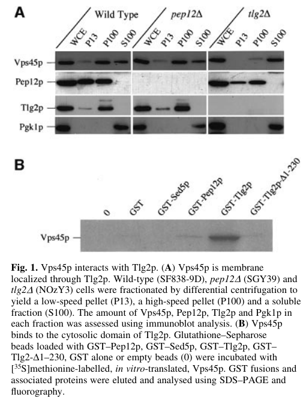

## Question

# Gene Research for Functional Annotation

## ⚠️ CRITICAL: Gene/Protein Identification Context

**BEFORE YOU BEGIN RESEARCH:** You MUST verify you are researching the CORRECT gene/protein. Gene symbols can be ambiguous, especially for less well-characterized genes from non-model organisms.

### Target Gene/Protein Identity (from UniProt):
- **UniProt Accession:** P38932
- **Protein Description:** RecName: Full=Vacuolar protein sorting-associated protein 45;
- **Gene Information:** Name=VPS45; Synonyms=STT10, VPL28; OrderedLocusNames=YGL095C;
- **Organism (full):** Saccharomyces cerevisiae (strain ATCC 204508 / S288c) (Baker's yeast).
- **Protein Family:** Belongs to the STXBP/unc-18/SEC1 family. .
- **Key Domains:** Sec-1-like_dom1. (IPR043154); Sec-1-like_dom3a. (IPR043127); Sec1-like. (IPR001619); Sec1-like_dom2. (IPR027482); Sec1-like_sf. (IPR036045)

### MANDATORY VERIFICATION STEPS:

1. **Check if the gene symbol "VPS45" matches the protein description above**
2. **Verify the organism is correct:** Saccharomyces cerevisiae (strain ATCC 204508 / S288c) (Baker's yeast).
3. **Check if protein family/domains align with what you find in literature**
4. **If you find literature for a DIFFERENT gene with the same or similar symbol, STOP**

### If Gene Symbol is Ambiguous or You Cannot Find Relevant Literature:

**DO NOT PROCEED WITH RESEARCH ON A DIFFERENT GENE.** Instead:
- State clearly: "The gene symbol 'VPS45' is ambiguous or literature is limited for this specific protein"
- Explain what you found (e.g., "Found extensive literature on a different gene with the same symbol in a different organism")
- Describe the protein based ONLY on the UniProt information provided above
- Suggest that the protein function can be inferred from domain/family information

### Research Target:

Please provide a comprehensive research report on the gene **VPS45** (gene ID: VPS45, UniProt: P38932) in yeast.

The research report should be a detailed narrative explaining the function, biological processes, and localization of the gene product. Citations should be given for all claims.

You should prioritize authoritative reviews and primary scientific literature when conducting research. You can supplement
this with annotations you find in gene/protein databases, but these can be outdated or inaccurate.

We are specifically interested in the primary function of the gene - for enzymes, what reaction is catalyzed, and what is the substrate specificity? For transporters, what is the substrate? For structural proteins or adapters, what is the broader structural role? For signaling molecules, what is the role in the pathway.

We are interested in where in or outside the cell the gene product carries out its function.

We are also interested in the signaling or biochemical pathways in which the gene functions. We are less interested in broad pleiotropic effects, except where these elucidate the precise role.

Include evidence where possible. We are interested in both experimental evidence as well as inference from structure, evolution, or bioinformatic analysis. Precise studies should be prioritized over high-throughput, where available.

## Output

Question: You are an expert researcher providing comprehensive, well-cited information.

Provide detailed information focusing on:
1. Key concepts and definitions with current understanding
2. Recent developments and latest research (prioritize 2023-2024 sources)
3. Current applications and real-world implementations
4. Expert opinions and analysis from authoritative sources
5. Relevant statistics and data from recent studies

Format as a comprehensive research report with proper citations. Include URLs and publication dates where available.
Always prioritize recent, authoritative sources and provide specific citations for all major claims.

# Gene Research for Functional Annotation

## ⚠️ CRITICAL: Gene/Protein Identification Context

**BEFORE YOU BEGIN RESEARCH:** You MUST verify you are researching the CORRECT gene/protein. Gene symbols can be ambiguous, especially for less well-characterized genes from non-model organisms.

### Target Gene/Protein Identity (from UniProt):
- **UniProt Accession:** P38932
- **Protein Description:** RecName: Full=Vacuolar protein sorting-associated protein 45;
- **Gene Information:** Name=VPS45; Synonyms=STT10, VPL28; OrderedLocusNames=YGL095C;
- **Organism (full):** Saccharomyces cerevisiae (strain ATCC 204508 / S288c) (Baker's yeast).
- **Protein Family:** Belongs to the STXBP/unc-18/SEC1 family. .
- **Key Domains:** Sec-1-like_dom1. (IPR043154); Sec-1-like_dom3a. (IPR043127); Sec1-like. (IPR001619); Sec1-like_dom2. (IPR027482); Sec1-like_sf. (IPR036045)

### MANDATORY VERIFICATION STEPS:

1. **Check if the gene symbol "VPS45" matches the protein description above**
2. **Verify the organism is correct:** Saccharomyces cerevisiae (strain ATCC 204508 / S288c) (Baker's yeast).
3. **Check if protein family/domains align with what you find in literature**
4. **If you find literature for a DIFFERENT gene with the same or similar symbol, STOP**

### If Gene Symbol is Ambiguous or You Cannot Find Relevant Literature:

**DO NOT PROCEED WITH RESEARCH ON A DIFFERENT GENE.** Instead:
- State clearly: "The gene symbol 'VPS45' is ambiguous or literature is limited for this specific protein"
- Explain what you found (e.g., "Found extensive literature on a different gene with the same symbol in a different organism")
- Describe the protein based ONLY on the UniProt information provided above
- Suggest that the protein function can be inferred from domain/family information

### Research Target:

Please provide a comprehensive research report on the gene **VPS45** (gene ID: VPS45, UniProt: P38932) in yeast.

The research report should be a detailed narrative explaining the function, biological processes, and localization of the gene product. Citations should be given for all claims.

You should prioritize authoritative reviews and primary scientific literature when conducting research. You can supplement
this with annotations you find in gene/protein databases, but these can be outdated or inaccurate.

We are specifically interested in the primary function of the gene - for enzymes, what reaction is catalyzed, and what is the substrate specificity? For transporters, what is the substrate? For structural proteins or adapters, what is the broader structural role? For signaling molecules, what is the role in the pathway.

We are interested in where in or outside the cell the gene product carries out its function.

We are also interested in the signaling or biochemical pathways in which the gene functions. We are less interested in broad pleiotropic effects, except where these elucidate the precise role.

Include evidence where possible. We are interested in both experimental evidence as well as inference from structure, evolution, or bioinformatic analysis. Precise studies should be prioritized over high-throughput, where available.

## Research report: *Saccharomyces cerevisiae* VPS45 (UniProt P38932; YGL095C)

### 1) Target verification (gene/protein identity)
The UniProt accession **P38932** corresponds to *S. cerevisiae* **Vps45p**, a **Sec1/Munc18 (SM) family** protein (STXBP/unc-18/SEC1 family) involved in vacuolar protein sorting and endosomal trafficking. The core yeast literature explicitly describes **Vps45p as a Sec1p homologue** that forms complexes with endosomal/Golgi syntaxins (t-SNAREs) such as **Pep12p** and **Tlg2p**, matching the provided UniProt identity and domain-family expectations (abeliovich1999cytoplasmtovacuole pages 1-2, abeliovich1999cytoplasmtovacuole pages 2-3, bryant1998trafficintothe pages 1-2).

### 2) Key concepts and current definitions (mechanistic understanding)

#### 2.1 SM proteins (Sec1/Munc18 family)
Modern consensus frames SM proteins as **active chaperones for productive trans-SNARE complex assembly**, rather than passive syntaxin binders. A 2024 mechanistic study (focused on yeast Sly1 as an exemplar SM) summarizes that SM proteins template early SNARE “zippering” and protect nascent prefusion complexes from Sec17/α-SNAP and Sec18/NSF disassembly, and proposes that SMs can also contribute to **close-range tethering** after long-range tethers capture vesicles (duan2024snarechaperonesly1 pages 1-2, duan2024snarechaperonesly1 pages 5-7). Within yeast, SM subfamilies are compartment-specialized; **Vps45 is the endosomal SM** in this framework (duan2024snarechaperonesly1 pages 1-2).

A 2023 authoritative overview of membrane tethers emphasizes that multisubunit tethering complexes (MTCs) and SM proteins collaborate: tethers interact with SNAREs/SMs and can **chaperone SNARE assembly**, and class C Vps-family tethers are “gatekeepers” of endolysosomal traffic (szentgyorgyi2023membranetethersat pages 3-4, szentgyorgyi2023membranetethersat pages 2-3, szentgyorgyi2023membranetethersat pages 6-6). This provides a current conceptual context for yeast Vps45: an SM protein whose essential output is **enabling correct SNARE complex formation at endosomal trafficking steps**.

#### 2.2 VPS45 in yeast: functional definition
In *S. cerevisiae*, Vps45p is best defined as an **endosomal SM protein that binds syntaxins and promotes/controls SNARE-dependent docking and fusion** at specific trafficking steps, especially:
- **Golgi (TGN) → prevacuolar compartment/endosome (PVC)** transport in the CPY pathway (bryant1998trafficintothe pages 1-2, bryant1998trafficintothe pages 7-8).
- A **Tlg2-dependent t-SNARE/SM module** required for the constitutive **cytoplasm-to-vacuole targeting (Cvt)** pathway of aminopeptidase I (API) (abeliovich1999cytoplasmtovacuole pages 6-7, abeliovich1999cytoplasmtovacuole pages 1-2).

### 3) Molecular function, binding partners, pathways, and localization (experiment-based)

#### 3.1 Core molecular role: syntaxin binding and SNARE complex promotion
**Direct binding / complex formation with syntaxins.** Vps45p physically associates with the syntaxin-like t-SNARE **Tlg2p** and also forms a separate complex with the endosomal t-SNARE **Pep12p**; co-immunoprecipitation data support **distinct Vps45p–Tlg2p and Vps45p–Pep12p complexes** (abeliovich1999cytoplasmtovacuole pages 6-7, abeliovich1999cytoplasmtovacuole pages 7-8).

**Positive regulation of SNARE complex assembly.** Deletion of **VPS45** causes loss of functional Tlg2-dependent SNARE pairing: even when Tlg2 is stabilized, it fails to bind cognate partners **Tlg1p and Vti1p**, indicating Vps45p is required for productive SNARE complex formation (bryant2001vps45pstabilizesthe pages 1-2, bryant2001vps45pstabilizesthe pages 3-5).

**Structural determinants of specificity.** Structural/biochemical analysis of the Tlg2/syntaxin 16 interface highlights that selectively conserved residues in Tlg2 homologs are important for Vps45 binding, supporting the idea that **Vps45–Tlg2 recognition is sequence/structure specific** rather than generic syntaxin association (szentgyorgyi2023membranetethersat pages 6-6).

#### 3.2 Tlg2 quality control: proteasome-dependent stability
Vps45p stabilizes Tlg2p: in **vps45Δ**, Tlg2p is lost through **rapid proteasomal down-regulation**, and proteasome impairment (but not loss of vacuolar proteases) restores Tlg2p levels (bryant2001vps45pstabilizesthe pages 1-2, bryant2001vps45pstabilizesthe media faea3417). Quantitatively, inactivation of Vps45 function causes a measurable decline in Tlg2p after **~20 min at 37°C** and **undetectable levels by ~60 min** in a temperature-shift paradigm (bryant2001vps45pstabilizesthe pages 3-5). Importantly, stabilized Tlg2p without Vps45p localizes correctly but remains **non-functional for SNARE complex assembly**, separating targeting from fusion competence (bryant2001vps45pstabilizesthe pages 1-2, bryant2001vps45pstabilizesthe pages 3-5).

#### 3.3 Pathway roles in yeast trafficking
**Golgi-to-endosome/PVC fusion (CPY route).** A key experimental distinction is that traffic into the PVC includes:
- A **VPS45-dependent intracellular route** (Golgi/TGN → PVC) for biosynthetic cargo (bryant1998trafficintothe pages 1-2, bryant1998trafficintothe pages 7-8).
- A **VPS45-independent endocytic route** (plasma membrane → PVC), demonstrated by delivery of endocytosed cargo (e.g., Ste3p) to the PVC without VPS45 function (bryant1998trafficintothe pages 7-8).

**Endosomal docking/fusion circuitry integrating Rab and PI3P signals.** Vac1p acts as a multivalent adaptor that coordinates Vps45-dependent docking/fusion at endosomes by integrating **Vps21 (Rab5-like) activity** and **Vps34-generated PI(3)P**:
- Vac1p **co-precipitates Vps45p**; this interaction persists without Pep12p, supporting a direct or Pep12-independent association (peterson1999vac1pcoordinatesrab pages 3-4).
- Vac1p binds **GTP-bound Vps21p** (nucleotide-state specific), and Vps9p preferentially binds GDP-locked Vps21p (consistent with Vps9p as a GEF), tying Rab activation to the docking machinery (peterson1999vac1pcoordinatesrab pages 3-4).
- A Vac1 FYVE-domain mutant (C221S), affecting PI(3)P binding, partially disrupts Vac1–Vps45 interaction, linking the **PI(3)P axis to Vps45 recruitment/engagement** (peterson1999vac1pcoordinatesrab pages 3-4, peterson1999vac1pcoordinatesrab pages 1-2).

**Cytoplasm-to-vacuole targeting (Cvt) of aminopeptidase I.** Vps45p and Tlg2p are required for maturation/processing of API via the constitutive Cvt route: **vps45ts** mutants fail to mature API at non-permissive temperature, phenocopying **tlg2Δ**, and accumulate proAPI in a membrane-associated, protease-sensitive intermediate state consistent with a membrane-fusion/delivery defect (abeliovich1999cytoplasmtovacuole pages 6-7, abeliovich1999cytoplasmtovacuole pages 4-6). Rapamycin (autophagy-inducing) can rapidly bypass the API maturation defect, and vps45Δ cells can accumulate autophagic bodies, supporting a **Cvt-specific requirement** rather than a general block of starvation-induced macroautophagy (abeliovich1999cytoplasmtovacuole pages 6-7, abeliovich1999cytoplasmtovacuole pages 3-4).

#### 3.4 Subcellular localization (where Vps45 acts)
Evidence from biochemical fractionation supports that Vps45p is predominantly **membrane-associated** in wild-type contexts, and that its membrane association is strongly influenced by Tlg2:
- Vps45p is membrane-associated when full-length Tlg2p is present, but becomes more **cytosolic** when Tlg2 lacks its N-terminal Vps45-binding region (Δ1–230) (bryant2001vps45pstabilizesthe pages 3-5).
- Figures from Bryant & James (2001) show subcellular fractionation and density gradient distributions consistent with Vps45p/Tlg2p association with intracellular membranes (bryant2001vps45pstabilizesthe media faea3417, bryant2001vps45pstabilizesthe media c194e187).

### 4) Recent developments (prioritizing 2023–2024)

#### 4.1 Updated view of SM proteins as tethering+SNARE assembly factors
The 2024 JCB study on Sly1 provides a current mechanistic model where an SM protein can directly bind vesicle membranes (via a curvature-sensing amphipathic helix) and contribute to **short-range tethering** as well as SNARE assembly; the authors propose handoff from long-range tethers/MTCs to SM proteins to complete close-range alignment for fusion (duan2024snarechaperonesly1 pages 1-2, duan2024snarechaperonesly1 pages 5-7). While not directly experimenting on Vps45, it provides an updated interpretive frame for Vps45-mediated endosomal fusion: Vps45 may be expected to function not only by stabilizing syntaxin but by **actively promoting a fusion-competent SNARE assembly state** (duan2024snarechaperonesly1 pages 1-2).

The 2023 J Cell Sci review highlights that tethering complexes have fusion-promoting functions beyond capture and that SM proteins are tightly integrated into these processes; it also emphasizes the staging of CORVET (early endosome) and HOPS (late endosome/vacuole) and how SM proteins are embedded or associated with tether systems (szentgyorgyi2023membranetethersat pages 3-4, szentgyorgyi2023membranetethersat pages 2-3, szentgyorgyi2023membranetethersat pages 6-6). These points refine how VPS45-dependent steps can be mapped onto broader endolysosomal fusion logic.

#### 4.2 Real-world “implementation” in pathogen biology (2024)
A 2024 PLOS Biology study shows that a **VPS45-dependent endosomal route** is functional in *Plasmodium falciparum* and is required for transport of host cell cytosol to the parasite food vacuole. The authors explicitly connect core elements (VPS45 with Rab5 and rabenosyn-5-like factors; yeast analogs Vac1/PEP7) and demonstrate that inactivation of parasite VPS45 pathway components causes accumulation of endosome-like, PI3P-decorated vesicles, supporting conservation of key endosomal transport principles (sabitzki2024roleofrabenosyn5 pages 1-2, sabitzki2024roleofrabenosyn5 pages 2-3). This is a concrete example where yeast-derived VPS45 mechanistic knowledge informs inference about essential trafficking in pathogens.

### 5) Current applications and real-world implementations

#### 5.1 Yeast VPS45 as a tractable model for endosomal SNARE regulation
Yeast VPS45 is experimentally used as a model for:
- **Defining pathway branching** into the PVC (biosynthetic vs endocytic entry), which is difficult to isolate in more complex systems (bryant1998trafficintothe pages 1-2, bryant1998trafficintothe pages 7-8).
- Dissecting how an SM protein affects a syntaxin’s **stability, localization, and SNARE-assembly competence**, with clear separation of (i) trafficking localization and (ii) functional SNARE complex formation (bryant2001vps45pstabilizesthe pages 1-2, bryant2001vps45pstabilizesthe pages 3-5).

#### 5.2 Conservation to mammals: mVps45 as a Golgi/TGN trafficking factor
The identification of **mammalian Vps45 (mVps45)** demonstrated conservation of Sec1-like VPS45 proteins beyond yeast. mVps45 behaves as a **peripheral membrane protein**, localizes to a perinuclear Golgi/TGN-like compartment in mammalian cells, and binds yeast Pep12 and mammalian syntaxin 6 in vitro (tellam1997identificationofa pages 6-6, tellam1997identificationofa pages 5-6). These experiments operationalized cross-species SNARE/SM binding assays and provided a route to translate yeast trafficking modules into mammalian cell biology.

#### 5.3 Human disease relevance (2024 expert synthesis)
A 2024 clinical pathology review describes **autosomal recessive VPS45 mutations** as causing severe congenital neutropenia (SCN5; OMIM 615285) and interprets VPS45 as controlling endolysosomal vesicle maturation; defects disrupt cargo delivery including the **G-CSF receptor**, offering a mechanistic rationale for poor G-CSF response in some patients (parisi2024discerningclinicopathologicalfeatures pages 6-7). This constitutes an applied, clinical “real-world” context where endosomal trafficking machinery has diagnostic and therapeutic implications.

### 6) Relevant statistics and quantitative data (from cited studies)

**Trafficking assay magnitude (yeast CPY secretion):** In yeast, vps45Δ causes strong CPY mis-sorting, with **~70% CPY secretion** versus **~2–4%** in wild type (Tellam et al., 1997) (tellam1997identificationofa pages 5-6). Expression of mVPS45-HA in wild-type yeast increased CPY secretion to **~12–15%** (dominant effect) versus **~2–3%** in vector controls (tellam1997identificationofa pages 5-6).

**Kinetics of Tlg2 loss after Vps45 inactivation:** Tlg2 protein levels decline detectably by **~20 min** after shift to restrictive temperature and are **undetectable by ~60 min**, supporting a rapid Vps45-dependent stability/quality-control process (bryant2001vps45pstabilizesthe pages 3-5).

**Clinical ranges in VPS45-associated neutropenia (2024 review):** The 2024 review reports ANC often **100–500 cells/µL** in VPS45-associated SCN, alongside systemic manifestations (e.g., hepatosplenomegaly, failure to thrive) and bone marrow fibrosis features (parisi2024discerningclinicopathologicalfeatures pages 6-7).

### 7) Evidence map (structured summary)
The following table consolidates the highest-signal functional annotation claims with partners, assays, and localization evidence.

| Function/Process | Molecular role | Key partners/complexes | Experimental evidence (assay types) | Subcellular location | Notes | Primary citation (with year, DOI URL) |
|---|---|---|---|---|---|---|
| Golgi-to-prevacuolar/endosomal transport (CPY pathway) | Sec1/Munc18-family SM protein required for docking/fusion of Golgi-derived vesicles with the prevacuolar compartment; acts with endosomal SNARE machinery | Pep12p, Vti1p; functionally linked to Vps21/Ypt51 Rab5-like GTPase | Mutant phenotyping, epistasis, cargo-trafficking assays, comparison of intracellular vs endocytic routes (bryant1998trafficintothe pages 1-2, bryant1998trafficintothe pages 7-8, bryant1998trafficintothe pages 2-3) | Prevacuolar/endosomal compartment | Defines a VPS45-dependent intracellular route into the PVC distinct from plasma membrane-derived endocytic entry | Bryant et al. 1998, https://doi.org/10.1016/S0171-9335(98)80016-2 (bryant1998trafficintothe pages 1-2, bryant1998trafficintothe pages 7-8, bryant1998trafficintothe pages 2-3) |
| Endocytic entry to PVC | Not required for delivery of endocytosed cargo from plasma membrane to PVC | Endocytosed Ste3p cargo pathway is VPS45-independent | Endocytosis assays/cargo tracking showing Ste3p delivery without VPS45 (bryant1998trafficintothe pages 7-8) | Plasma membrane to PVC route | Separates biosynthetic Golgi→PVC fusion from endocytic traffic into the same compartment | Bryant et al. 1998, https://doi.org/10.1016/S0171-9335(98)80016-2 (bryant1998trafficintothe pages 7-8) |
| Cytoplasm-to-vacuole targeting (Cvt) of aminopeptidase I | Forms a functional t-SNARE–SM module that promotes a membrane-fusion step needed for constitutive API delivery | Tlg2p; separate Vps45p complexes with Tlg2p and Pep12p | Temperature-sensitive mutant analysis, pulse-chase API maturation, membrane fractionation, protease sensitivity/protection, native and denaturing immunoprecipitation, rapamycin bypass experiments (abeliovich1999cytoplasmtovacuole pages 6-7, abeliovich1999cytoplasmtovacuole pages 1-2, abeliovich1999cytoplasmtovacuole pages 7-8, abeliovich1999cytoplasmtovacuole pages 4-6, abeliovich1999cytoplasmtovacuole pages 3-4) | Tlg2-associated Golgi/endosomal membranes and Cvt vesicles | Required for Cvt but dispensable for starvation-induced macroautophagy; vps45ts phenocopies tlg2Δ for API maturation defects | Abeliovich et al. 1999, https://doi.org/10.1093/emboj/18.21.6005 (abeliovich1999cytoplasmtovacuole pages 6-7, abeliovich1999cytoplasmtovacuole pages 1-2, abeliovich1999cytoplasmtovacuole pages 7-8, abeliovich1999cytoplasmtovacuole pages 4-6, abeliovich1999cytoplasmtovacuole pages 3-4) |
| SNARE regulation with Tlg2p | Directly binds Tlg2p and positively regulates productive SNARE complex assembly | Tlg2p, Tlg1p, Vti1p | Co-precipitation/complex analysis, GST-binding, truncation mutants, subcellular fractionation (bryant2001vps45pstabilizesthe pages 1-2, bryant2001vps45pstabilizesthe pages 3-5) | Membrane-associated when full-length Tlg2p is present; becomes cytosolic with Tlg2 N-terminal truncation | Vps45p is needed not just for Tlg2 stability but also for Tlg2 entry into ternary SNARE complexes | Bryant & James 2001, https://doi.org/10.1093/emboj/20.13.3380 (bryant2001vps45pstabilizesthe pages 1-2, bryant2001vps45pstabilizesthe pages 3-5) |
| Tlg2p quality control/stability | Stabilizes the syntaxin homologue Tlg2p; prevents rapid proteasome-dependent loss of Tlg2p | Tlg2p; proteasome machinery | Immunoblotting in vps45Δ, proteasome-mutant rescue, pulse-chase degradation time course, fractionation (bryant2001vps45pstabilizesthe pages 1-2, bryant2001vps45pstabilizesthe pages 3-5, bryant2001vps45pstabilizesthe media faea3417) | Tlg2p still reaches correct intracellular location without Vps45p, but is unstable/nonfunctional | Loss of VPS45 causes rapid Tlg2 depletion detectable within ~20 min and near-complete loss by ~60 min after inactivation in reported assays | Bryant & James 2001, https://doi.org/10.1093/emboj/20.13.3380 (bryant2001vps45pstabilizesthe pages 1-2, bryant2001vps45pstabilizesthe pages 3-5, bryant2001vps45pstabilizesthe media faea3417) |
| Endosomal docking/fusion signal integration | Acts in Vac1p-, Rab-, and PI3P-coordinated docking/fusion at the endosome | Vac1p, Pep12p, Vps21p, Vps9p, VPS34/PI(3)P | Protein A pulldown/co-precipitation, mutant interaction analysis, nucleotide-state-specific Rab binding, FYVE-domain mutant analysis (peterson1999vac1pcoordinatesrab pages 3-4, peterson1999vac1pcoordinatesrab pages 1-2) | Endosome/prevacuolar endosome | Vac1p behaves as a multivalent adaptor linking PI3P and active Vps21 to Pep12/Vps45-dependent vesicle targeting | Peterson et al. 1999, https://doi.org/10.1016/S0960-9822(99)80071-2 (peterson1999vac1pcoordinatesrab pages 3-4, peterson1999vac1pcoordinatesrab pages 1-2) |
| Structural basis of SM–syntaxin recognition | SM protein recognizes the syntaxin N-terminal region; selective residues in Tlg2 homologs are important for Vps45 binding | Tlg2p/syntaxin 16–Vps45 interface | Structural/biochemical analysis of Tlg2p/syntaxin 16 binding determinants (szentgyorgyi2023membranetethersat pages 6-6) | Endosomal SNARE interface | Provides mechanistic support for specificity of Vps45–Tlg2 interaction, complementing yeast functional genetics | Dulubova et al. 2002, https://doi.org/10.1093/emboj/cdf381 (szentgyorgyi2023membranetethersat pages 6-6) |
| Current conceptual placement of Vps45 among SM proteins | Endosomal SM/Sec1-Munc18 chaperone that promotes SNARE assembly and membrane fusion; conceptually adjacent to short-range tethering functions of SM proteins | Endosomal SNAREs; compared with Sly1, Vps33, tethering complexes | Review synthesis and mechanistic extrapolation from contemporary SM/tether literature (szentgyorgyi2023membranetethersat pages 2-3, duan2024snarechaperonesly1 pages 1-2, szentgyorgyi2023membranetethersat pages 3-4) | Endosomal compartments / endosomal recycling context | 2023–2024 sources emphasize SM proteins as active fusion chaperones rather than passive syntaxin binders; yeast Vps45 remains the endosomal SM benchmark | Szentgyörgyi & Spang 2023, https://doi.org/10.1242/jcs.260471; Duan et al. 2024, https://doi.org/10.1083/jcb.202001032 (szentgyorgyi2023membranetethersat pages 2-3, duan2024snarechaperonesly1 pages 1-2, szentgyorgyi2023membranetethersat pages 3-4) |

*Table: This table summarizes experimentally supported functional annotation for S. cerevisiae VPS45/YGL095C, including pathway role, interacting partners, localization, and assay evidence. It is useful as a compact evidence map linking classical yeast genetics and biochemistry with current SM-protein conceptual frameworks.*

### 8) Key figure evidence (supporting central claims)
Cropped figure panels from Bryant & James (2001) document (i) fractionation-based localization of Vps45/Tlg2, (ii) reduced Tlg2 levels in vps45Δ, and (iii) proteasome-dependent stabilization of Tlg2 in vps45Δ backgrounds, directly supporting the Vps45→Tlg2 stability and membrane-association conclusions (bryant2001vps45pstabilizesthe media faea3417, bryant2001vps45pstabilizesthe media fb7b78b9, bryant2001vps45pstabilizesthe media e0fdd051, bryant2001vps45pstabilizesthe media c194e187).

### 9) Expert synthesis / interpretation (what VPS45 “does” in one sentence)
Across mechanistic yeast genetics/biochemistry and modern fusion models, **Vps45 is an endosomal SM protein that couples signaling-defined membrane identity (Vac1–Vps21–PI3P) to the formation and maintenance of a fusion-competent syntaxin/SNARE state**, notably by stabilizing and activating the Tlg2 syntaxin module for specific trafficking steps into/within the endosomal system (bryant2001vps45pstabilizesthe pages 1-2, peterson1999vac1pcoordinatesrab pages 3-4, bryant1998trafficintothe pages 1-2, duan2024snarechaperonesly1 pages 1-2).

---

## Key references (URLs; publication dates)
- Abeliovich H, Darsow T, Emr S. **Cytoplasm to vacuole trafficking of aminopeptidase I requires a t-SNARE–Sec1p complex composed of Tlg2p and Vps45p.** *EMBO J.* **1999-11**. https://doi.org/10.1093/emboj/18.21.6005 (abeliovich1999cytoplasmtovacuole pages 6-7)
- Bryant NJ et al. **Traffic into the prevacuolar/endosomal compartment… a VPS45-dependent intracellular route and a VPS45-independent endocytic route.** *Eur J Cell Biol.* **1998-05**. https://doi.org/10.1016/S0171-9335(98)80016-2 (bryant1998trafficintothe pages 1-2)
- Peterson MR, Burd CG, Emr SD. **Vac1p coordinates Rab and PI3-kinase signaling in Vps45p-dependent docking/fusion at the endosome.** *Curr Biol.* **1999-02**. https://doi.org/10.1016/S0960-9822(99)80071-2 (peterson1999vac1pcoordinatesrab pages 3-4)
- Bryant NJ, James D. **Vps45p stabilizes the syntaxin homologue Tlg2p and positively regulates SNARE complex formation.** *EMBO J.* **2001-07**. https://doi.org/10.1093/emboj/20.13.3380 (bryant2001vps45pstabilizesthe pages 1-2)
- Dulubova I et al. **How Tlg2p/syntaxin 16 ‘snares’ Vps45.** *EMBO J.* **2002-07**. https://doi.org/10.1093/emboj/cdf381 (szentgyorgyi2023membranetethersat pages 6-6)
- Szentgyörgyi V, Spang A. **Membrane tethers at a glance.** *J Cell Sci.* **2023-03**. https://doi.org/10.1242/jcs.260471 (szentgyorgyi2023membranetethersat pages 2-3)
- Duan M et al. **SNARE chaperone Sly1 directly mediates close-range vesicle tethering.** *J Cell Biol.* **2024-03**. https://doi.org/10.1083/jcb.202001032 (duan2024snarechaperonesly1 pages 1-2)
- Sabitzki R et al. **Role of Rabenosyn-5 and Rab5b… reveals conservation of endosomal transport in malaria parasites.** *PLOS Biol.* **2024-05**. https://doi.org/10.1371/journal.pbio.3002639 (sabitzki2024roleofrabenosyn5 pages 1-2)
- Parisi X, Bledsoe JR. **Discerning clinicopathological features of congenital neutropenia syndromes…** *J Clin Pathol.* **2024-04**. https://doi.org/10.1136/jcp-2022-208686 (parisi2024discerningclinicopathologicalfeatures pages 6-7)
- Tellam JT et al. **Identification of a Mammalian Golgi Sec1p-like Protein, mVps45.** *J Biol Chem.* **1997-03**. https://doi.org/10.1074/jbc.272.10.6187 (tellam1997identificationofa pages 6-6)

References

1. (abeliovich1999cytoplasmtovacuole pages 1-2): H. Abeliovich, T. Darsow, and S. Emr. Cytoplasm to vacuole trafficking of aminopeptidase i requires a t‐snare–sec1p complex composed of tlg2p and vps45p. The EMBO Journal, 18:6005-6016, Nov 1999. URL: https://doi.org/10.1093/emboj/18.21.6005, doi:10.1093/emboj/18.21.6005. This article has 169 citations.

2. (abeliovich1999cytoplasmtovacuole pages 2-3): H. Abeliovich, T. Darsow, and S. Emr. Cytoplasm to vacuole trafficking of aminopeptidase i requires a t‐snare–sec1p complex composed of tlg2p and vps45p. The EMBO Journal, 18:6005-6016, Nov 1999. URL: https://doi.org/10.1093/emboj/18.21.6005, doi:10.1093/emboj/18.21.6005. This article has 169 citations.

3. (bryant1998trafficintothe pages 1-2): Nia J. Bryant, Robert C. Piper, Sonja R. Gerrard, and Tom H. Stevens. Traffic into the prevacuolar/endosomal compartment of saccharomyces cerevisiae: a vps45-dependent intracellular route and a vps45-independent, endocytic route. European journal of cell biology, 76 1:43-52, May 1998. URL: https://doi.org/10.1016/s0171-9335(98)80016-2, doi:10.1016/s0171-9335(98)80016-2. This article has 89 citations and is from a peer-reviewed journal.

4. (duan2024snarechaperonesly1 pages 1-2): Mengtong Duan, Rachael L. Plemel, Tomoka Takenaka, Ariel Lin, Beatriz Marie Delgado, Una Nattermann, Daniel P. Nickerson, Joji Mima, Elizabeth A. Miller, and Alexey J. Merz. Snare chaperone sly1 directly mediates close-range vesicle tethering. The Journal of Cell Biology, Mar 2024. URL: https://doi.org/10.1083/jcb.202001032, doi:10.1083/jcb.202001032. This article has 4 citations.

5. (duan2024snarechaperonesly1 pages 5-7): Mengtong Duan, Rachael L. Plemel, Tomoka Takenaka, Ariel Lin, Beatriz Marie Delgado, Una Nattermann, Daniel P. Nickerson, Joji Mima, Elizabeth A. Miller, and Alexey J. Merz. Snare chaperone sly1 directly mediates close-range vesicle tethering. The Journal of Cell Biology, Mar 2024. URL: https://doi.org/10.1083/jcb.202001032, doi:10.1083/jcb.202001032. This article has 4 citations.

6. (szentgyorgyi2023membranetethersat pages 3-4): Viktória Szentgyörgyi and Anne Spang. Membrane tethers at a glance. Journal of Cell Science, Mar 2023. URL: https://doi.org/10.1242/jcs.260471, doi:10.1242/jcs.260471. This article has 23 citations and is from a domain leading peer-reviewed journal.

7. (szentgyorgyi2023membranetethersat pages 2-3): Viktória Szentgyörgyi and Anne Spang. Membrane tethers at a glance. Journal of Cell Science, Mar 2023. URL: https://doi.org/10.1242/jcs.260471, doi:10.1242/jcs.260471. This article has 23 citations and is from a domain leading peer-reviewed journal.

8. (szentgyorgyi2023membranetethersat pages 6-6): Viktória Szentgyörgyi and Anne Spang. Membrane tethers at a glance. Journal of Cell Science, Mar 2023. URL: https://doi.org/10.1242/jcs.260471, doi:10.1242/jcs.260471. This article has 23 citations and is from a domain leading peer-reviewed journal.

9. (bryant1998trafficintothe pages 7-8): Nia J. Bryant, Robert C. Piper, Sonja R. Gerrard, and Tom H. Stevens. Traffic into the prevacuolar/endosomal compartment of saccharomyces cerevisiae: a vps45-dependent intracellular route and a vps45-independent, endocytic route. European journal of cell biology, 76 1:43-52, May 1998. URL: https://doi.org/10.1016/s0171-9335(98)80016-2, doi:10.1016/s0171-9335(98)80016-2. This article has 89 citations and is from a peer-reviewed journal.

10. (abeliovich1999cytoplasmtovacuole pages 6-7): H. Abeliovich, T. Darsow, and S. Emr. Cytoplasm to vacuole trafficking of aminopeptidase i requires a t‐snare–sec1p complex composed of tlg2p and vps45p. The EMBO Journal, 18:6005-6016, Nov 1999. URL: https://doi.org/10.1093/emboj/18.21.6005, doi:10.1093/emboj/18.21.6005. This article has 169 citations.

11. (abeliovich1999cytoplasmtovacuole pages 7-8): H. Abeliovich, T. Darsow, and S. Emr. Cytoplasm to vacuole trafficking of aminopeptidase i requires a t‐snare–sec1p complex composed of tlg2p and vps45p. The EMBO Journal, 18:6005-6016, Nov 1999. URL: https://doi.org/10.1093/emboj/18.21.6005, doi:10.1093/emboj/18.21.6005. This article has 169 citations.

12. (bryant2001vps45pstabilizesthe pages 1-2): N. J. Bryant and D. James. Vps45p stabilizes the syntaxin homologue tlg2p and positively regulates snare complex formation. The EMBO Journal, 20:3380-3388, Jul 2001. URL: https://doi.org/10.1093/emboj/20.13.3380, doi:10.1093/emboj/20.13.3380. This article has 176 citations.

13. (bryant2001vps45pstabilizesthe pages 3-5): N. J. Bryant and D. James. Vps45p stabilizes the syntaxin homologue tlg2p and positively regulates snare complex formation. The EMBO Journal, 20:3380-3388, Jul 2001. URL: https://doi.org/10.1093/emboj/20.13.3380, doi:10.1093/emboj/20.13.3380. This article has 176 citations.

14. (bryant2001vps45pstabilizesthe media faea3417): N. J. Bryant and D. James. Vps45p stabilizes the syntaxin homologue tlg2p and positively regulates snare complex formation. The EMBO Journal, 20:3380-3388, Jul 2001. URL: https://doi.org/10.1093/emboj/20.13.3380, doi:10.1093/emboj/20.13.3380. This article has 176 citations.

15. (peterson1999vac1pcoordinatesrab pages 3-4): Michael R. Peterson, Christopher G. Burd, and Scott D. Emr. Vac1p coordinates rab and phosphatidylinositol 3-kinase signaling in vps45p-dependent vesicle docking/fusion at the endosome. Current Biology, 9:159-S1, Feb 1999. URL: https://doi.org/10.1016/s0960-9822(99)80071-2, doi:10.1016/s0960-9822(99)80071-2. This article has 208 citations and is from a highest quality peer-reviewed journal.

16. (peterson1999vac1pcoordinatesrab pages 1-2): Michael R. Peterson, Christopher G. Burd, and Scott D. Emr. Vac1p coordinates rab and phosphatidylinositol 3-kinase signaling in vps45p-dependent vesicle docking/fusion at the endosome. Current Biology, 9:159-S1, Feb 1999. URL: https://doi.org/10.1016/s0960-9822(99)80071-2, doi:10.1016/s0960-9822(99)80071-2. This article has 208 citations and is from a highest quality peer-reviewed journal.

17. (abeliovich1999cytoplasmtovacuole pages 4-6): H. Abeliovich, T. Darsow, and S. Emr. Cytoplasm to vacuole trafficking of aminopeptidase i requires a t‐snare–sec1p complex composed of tlg2p and vps45p. The EMBO Journal, 18:6005-6016, Nov 1999. URL: https://doi.org/10.1093/emboj/18.21.6005, doi:10.1093/emboj/18.21.6005. This article has 169 citations.

18. (abeliovich1999cytoplasmtovacuole pages 3-4): H. Abeliovich, T. Darsow, and S. Emr. Cytoplasm to vacuole trafficking of aminopeptidase i requires a t‐snare–sec1p complex composed of tlg2p and vps45p. The EMBO Journal, 18:6005-6016, Nov 1999. URL: https://doi.org/10.1093/emboj/18.21.6005, doi:10.1093/emboj/18.21.6005. This article has 169 citations.

19. (bryant2001vps45pstabilizesthe media c194e187): N. J. Bryant and D. James. Vps45p stabilizes the syntaxin homologue tlg2p and positively regulates snare complex formation. The EMBO Journal, 20:3380-3388, Jul 2001. URL: https://doi.org/10.1093/emboj/20.13.3380, doi:10.1093/emboj/20.13.3380. This article has 176 citations.

20. (sabitzki2024roleofrabenosyn5 pages 1-2): Ricarda Sabitzki, Anna-Lena Roßmann, Marius Schmitt, Sven Flemming, Andrés Guillén-Samander, Hannah Michaela Behrens, Ernst Jonscher, Katharina Höhn, Ulrike Fröhlke, and Tobias Spielmann. Role of rabenosyn-5 and rab5b in host cell cytosol uptake reveals conservation of endosomal transport in malaria parasites. PLOS Biology, 22:e3002639, May 2024. URL: https://doi.org/10.1371/journal.pbio.3002639, doi:10.1371/journal.pbio.3002639. This article has 18 citations and is from a highest quality peer-reviewed journal.

21. (sabitzki2024roleofrabenosyn5 pages 2-3): Ricarda Sabitzki, Anna-Lena Roßmann, Marius Schmitt, Sven Flemming, Andrés Guillén-Samander, Hannah Michaela Behrens, Ernst Jonscher, Katharina Höhn, Ulrike Fröhlke, and Tobias Spielmann. Role of rabenosyn-5 and rab5b in host cell cytosol uptake reveals conservation of endosomal transport in malaria parasites. PLOS Biology, 22:e3002639, May 2024. URL: https://doi.org/10.1371/journal.pbio.3002639, doi:10.1371/journal.pbio.3002639. This article has 18 citations and is from a highest quality peer-reviewed journal.

22. (tellam1997identificationofa pages 6-6): Judy T. Tellam, David E. James, Tom H. Stevens, and Robert C. Piper. Identification of a mammalian golgi sec1p-like protein, mvps45*. The Journal of Biological Chemistry, 272:6187-6193, Mar 1997. URL: https://doi.org/10.1074/jbc.272.10.6187, doi:10.1074/jbc.272.10.6187. This article has 57 citations.

23. (tellam1997identificationofa pages 5-6): Judy T. Tellam, David E. James, Tom H. Stevens, and Robert C. Piper. Identification of a mammalian golgi sec1p-like protein, mvps45*. The Journal of Biological Chemistry, 272:6187-6193, Mar 1997. URL: https://doi.org/10.1074/jbc.272.10.6187, doi:10.1074/jbc.272.10.6187. This article has 57 citations.

24. (parisi2024discerningclinicopathologicalfeatures pages 6-7): Xenia Parisi and Jacob R. Bledsoe. Discerning clinicopathological features of congenital neutropenia syndromes: an approach to diagnostically challenging differential diagnoses. Journal of Clinical Pathology, 77:586-604, Apr 2024. URL: https://doi.org/10.1136/jcp-2022-208686, doi:10.1136/jcp-2022-208686. This article has 16 citations and is from a peer-reviewed journal.

25. (bryant1998trafficintothe pages 2-3): Nia J. Bryant, Robert C. Piper, Sonja R. Gerrard, and Tom H. Stevens. Traffic into the prevacuolar/endosomal compartment of saccharomyces cerevisiae: a vps45-dependent intracellular route and a vps45-independent, endocytic route. European journal of cell biology, 76 1:43-52, May 1998. URL: https://doi.org/10.1016/s0171-9335(98)80016-2, doi:10.1016/s0171-9335(98)80016-2. This article has 89 citations and is from a peer-reviewed journal.

26. (bryant2001vps45pstabilizesthe media fb7b78b9): N. J. Bryant and D. James. Vps45p stabilizes the syntaxin homologue tlg2p and positively regulates snare complex formation. The EMBO Journal, 20:3380-3388, Jul 2001. URL: https://doi.org/10.1093/emboj/20.13.3380, doi:10.1093/emboj/20.13.3380. This article has 176 citations.

27. (bryant2001vps45pstabilizesthe media e0fdd051): N. J. Bryant and D. James. Vps45p stabilizes the syntaxin homologue tlg2p and positively regulates snare complex formation. The EMBO Journal, 20:3380-3388, Jul 2001. URL: https://doi.org/10.1093/emboj/20.13.3380, doi:10.1093/emboj/20.13.3380. This article has 176 citations.

## Artifacts

- [Edison artifact artifact-00](VPS45-deep-research-falcon_artifacts/artifact-00.md)

## Citations

1. szentgyorgyi2023membranetethersat pages 6-6
2. bryant1998trafficintothe pages 7-8
3. parisi2024discerningclinicopathologicalfeatures pages 6-7
4. tellam1997identificationofa pages 5-6
5. abeliovich1999cytoplasmtovacuole pages 6-7
6. bryant1998trafficintothe pages 1-2
7. szentgyorgyi2023membranetethersat pages 2-3
8. tellam1997identificationofa pages 6-6
9. abeliovich1999cytoplasmtovacuole pages 1-2
10. abeliovich1999cytoplasmtovacuole pages 2-3
11. szentgyorgyi2023membranetethersat pages 3-4
12. abeliovich1999cytoplasmtovacuole pages 7-8
13. abeliovich1999cytoplasmtovacuole pages 4-6
14. abeliovich1999cytoplasmtovacuole pages 3-4
15. bryant1998trafficintothe pages 2-3
16. https://doi.org/10.1016/S0171-9335(98
17. https://doi.org/10.1093/emboj/18.21.6005
18. https://doi.org/10.1093/emboj/20.13.3380
19. https://doi.org/10.1016/S0960-9822(99
20. https://doi.org/10.1093/emboj/cdf381
21. https://doi.org/10.1242/jcs.260471;
22. https://doi.org/10.1083/jcb.202001032
23. https://doi.org/10.1242/jcs.260471
24. https://doi.org/10.1371/journal.pbio.3002639
25. https://doi.org/10.1136/jcp-2022-208686
26. https://doi.org/10.1074/jbc.272.10.6187
27. https://doi.org/10.1093/emboj/18.21.6005,
28. https://doi.org/10.1016/s0171-9335(98
29. https://doi.org/10.1083/jcb.202001032,
30. https://doi.org/10.1242/jcs.260471,
31. https://doi.org/10.1093/emboj/20.13.3380,
32. https://doi.org/10.1016/s0960-9822(99
33. https://doi.org/10.1371/journal.pbio.3002639,
34. https://doi.org/10.1074/jbc.272.10.6187,
35. https://doi.org/10.1136/jcp-2022-208686,