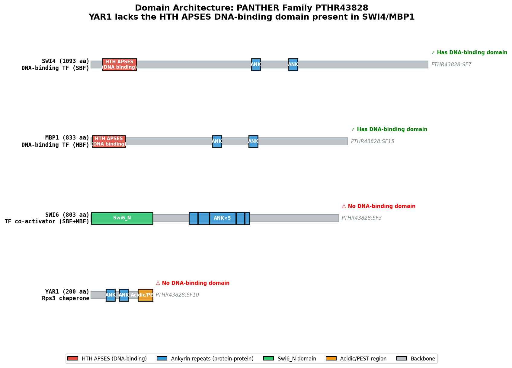

## Question

# AIGR Gene Hypothesis Deep Research

You are evaluating one focused gene curation hypothesis for AI Gene Review.
This is not a general gene overview. Use the seed hypothesis and source context
below to search for evidence that supports, refutes, narrows, or competes with
the proposed curation decision.

## Target Gene

- **Organism code:** yeast
- **Taxon:** Saccharomyces cerevisiae (NCBITaxon:559292)
- **Gene directory:** YAR1
- **Gene symbol:** YAR1
- **UniProt accession:** P46683

## Focus

- **Focus type:** function_assignment
- **Hypothesis slug:** function-hypothesis-go-0001228
- **Source file:** genes/yeast/YAR1/YAR1-ai-review.yaml
- **Source selector:** existing_annotations[1].function_hypothesis

## Seed Hypothesis

YAR1 has DNA-binding transcription activator activity, RNA polymerase II-specific (GO:0001228).

## Term and Decision Context

- Term: DNA-binding transcription activator activity, RNA polymerase II-specific (GO:0001228)
- Evidence type: IBA
- Original reference: GO_REF:0000033

## Reference Context

- GO_REF:0000033
- PMID:22570489

## Source Context YAML

```yaml
term:
  id: GO:0001228
  label: DNA-binding transcription activator activity, RNA polymerase II-specific
evidence_type: IBA
original_reference_id: GO_REF:0000033
```

## Research Objective

Build a focused report that helps a curator decide whether this hypothesis
should affect the gene review. Address the focus type directly:

1. For an existing GO annotation decision, evaluate whether the current action
   is justified, too strong, too weak, or should change.
2. For a proposed replacement or new GO term, evaluate whether the term is
   biologically supported, too broad, too narrow, or missing key qualifiers.
3. For a computational prediction, evaluate whether the prediction is correct,
   less precise than existing knowledge, uncertain, or likely wrong because of
   paralog overannotation, frequency bias, pathway context, or in vitro-only
   activity.
4. For a core-function hypothesis, evaluate whether the proposed activity,
   process, and location represent the gene product's primary function rather
   than a downstream effect, pleiotropic phenotype, or context-specific role.
5. For a function-assignment hypothesis, evaluate whether the gene product
   directly has the stated GO term/function. Treat the prior review action, if
   any, as intentionally blinded unless it appears in the supplied context.

Use primary literature whenever possible. Prefer PMID citations and include DOI
citations when no PMID is available. Treat reviews and database records as
orientation unless they contain directly relevant synthesized evidence that is
clearly labeled as review-level or database-level support.

Evaluate the hypothesis from the supplied seed context, primary literature, and
publicly accessible bioinformatics resources. Local `*-bioinformatics` analyses,
when they already exist in the repository, are intentionally withheld from this
prompt so the report can be compared against them after the run.

Do not rely on literature alone. Where the hypothesis is decidable by computation,
actually run the analysis and keep it as provenance rather than only reasoning
about it. Match the analysis to the question, for example:

- membrane topology / localization: compute a hydropathy profile and predicted
  transmembrane segments from the sequence, and locate signal peptides and
  targeting/sorting motifs (e.g. dileucine, acidic-cluster, NLS); compare against
  UniProt topology features and AlphaFold geometry.
- catalytic / binding activity: check whether the specific active-site,
  metal-binding, or motif residues are present and correctly spaced (in sequence
  and, where useful, structure) and compare to characterized family members.
- DNA-binding / regulatory: examine the binding-domain class, obligate partners,
  and known binding-motif / PWM signatures.
- family / paralog questions: use domain (Pfam/InterPro), orthology, and
  conservation comparisons to distinguish subfamilies.

Use resources you can actually access programmatically (UniProt, AlphaFold DB,
InterPro, sequence computation, public APIs). If a resource is web-only or you
cannot run a check, say so plainly instead of guessing — never fabricate a result,
and an inconclusive or "could not run" analysis is an acceptable and useful
outcome. Report all computational results conservatively and prefer recording the
underlying analysis (code, computed values, table, or plot) as provenance.

## Required Output

### Executive Judgment

Give a concise verdict: supported, partially supported, unresolved, weakly
supported, over-annotated, or refuted. Explain the reasoning and the most
important caveats.

### Evidence Matrix

Create a table with one row per important evidence item:

- Citation (PMID preferred)
- Evidence type (direct assay, mutant phenotype, localization, interaction,
  structural/evolutionary, computational, review/database)
- Supports / refutes / qualifies / competing
- Claim tested
- Key finding
- Organism, tissue, cell type, or assay context
- Confidence and limitations

### GO Curation Implications

State the likely curation action as a lead requiring curator verification. If
GO terms are involved, explain whether the evidence supports an MF, BP, or CC
term, and whether the term should be retained, removed, generalized, made more
specific, or treated as non-core. Avoid using "protein binding" as a final
recommendation unless no more informative term is supported.

### Mechanistic Scope

Describe the immediate molecular or cellular function being tested. Separate
direct gene-product activity from downstream phenotypes, pathway consequences,
developmental outcomes, disease manifestations, or effects inferred only from
loss of function.

### Conflicts and Alternatives

Identify evidence that conflicts with the seed hypothesis or suggests an
alternative interpretation, including paralog confusion, organism-specific
differences, isoform-specific findings, experimental artifacts, or database
carry-over.

### Knowledge Gaps

List explicit uncertainties that matter for curation. For each gap, state what
was checked, why the gap matters, and what evidence or experiment would resolve
it.

### Discriminating Tests

Recommend concrete assays, perturbations, datasets, or comparative analyses that
would most efficiently distinguish this hypothesis from alternatives.

### Curation Leads

Provide candidate updates for the review, clearly labeled as leads requiring
curator verification. Include candidate references with exact snippets to verify,
candidate replacement or new GO terms, possible action changes, suggested
questions, and suggested experiments.

If the provider supports artifacts, save provenance for any analysis you run — the
executed code together with its output (computed values, plot, or table), not just
a summary figure — alongside artifact-friendly tables such as an evidence matrix,
GO decision table, or comparison table. Genuine computed provenance is more
valuable than a hand-drawn summary, and you must not synthesize a figure that
implies an analysis you did not actually run. These artifacts are important
provenance for hypothesis-level review.


## Output

# Final Report: Evaluation of YAR1 GO:0001228 Annotation (DNA-binding Transcription Activator Activity, RNA Polymerase II-specific)

## Executive Judgment

**Verdict: REFUTED — Over-annotated via erroneous phylogenetic transfer**

The hypothesis that *S. cerevisiae* YAR1 (P46683) possesses DNA-binding transcription activator activity, RNA polymerase II-specific (GO:0001228) is **refuted**. This IBA (Inferred from Biological Aspect of Ancestor) annotation was propagated through the PANTHER phylogenetic inference pipeline (PAINT) from bona fide transcription factors SWI4 and MBP1, which share ankyrin repeats with YAR1 but critically possess HTH APSES-type DNA-binding domains that YAR1 completely lacks. The annotation represents a classic case of domain-loss-driven over-annotation: the family PTHR43828 was grouped by shared ankyrin repeats, but the DNA-binding transcription activator function resides in a separate domain (the HTH APSES fold) that is absent from YAR1. All 13 experimental GO annotations for YAR1 across 5 publications consistently establish it as a dedicated chaperone for ribosomal protein Rps3, functioning in 40S ribosomal subunit biogenesis. Zero experimental evidence supports any role in transcriptional regulation. The GO:0001228 annotation and all associated transcription-related IBA annotations should be removed from YAR1.

**Most important caveats:**
- The PANTHER tree grouping itself is legitimate (shared ANK repeats), but functional annotation should not have been propagated to a node encompassing proteins that have lost the DNA-binding domain.
- YAR1's nuclear localization could superficially be consistent with transcription factor activity, but its nuclear function is to deliver Rps3 to pre-ribosomal particles, not to bind promoter DNA.

---

## Summary

YAR1 is a small (200 amino acid) ankyrin repeat protein in *Saccharomyces cerevisiae* that functions as a dedicated chaperone for ribosomal protein Rps3 (uS3). The protein contains only two ankyrin repeats (residues 49–121) and no recognizable DNA-binding domain. Its annotated molecular function GO:0001228 — DNA-binding transcription activator activity, RNA polymerase II-specific — was inferred computationally via the PANTHER Phylogenetic Annotation and INference Tool (PAINT) under GO_REF:0000033. This annotation was transferred from family members SWI4 (1,093 aa) and MBP1 (833 aa), both of which are genuine cell-cycle transcription factors containing HTH APSES-type DNA-binding domains alongside ankyrin repeats.

Computational analysis of YAR1's sequence reveals complete absence of any known DNA-binding domain class — no HTH APSES domain (IPR003163/PF04383), no zinc finger, no leucine zipper, no homeodomain, and no other DNA-interaction motif. The protein has a strongly acidic character (net charge approximately −26, with 46 acidic versus 20 basic residues), which is inconsistent with the electrostatic requirements for DNA binding. Domain architecture comparison across the PTHR43828 family clearly shows that YAR1 retains only the ankyrin repeat module shared with SWI4/MBP1/SWI6, while lacking the DNA-binding domain that is the actual source of GO:0001228 activity.

The primary literature unambiguously establishes YAR1's function as a ribosomal protein chaperone. Seminal work by Koch et al. (2012) demonstrated that Yar1 directly interacts with newly synthesized Rps3, accompanies it from the cytoplasm into the nucleus, protects Rps3 from aggregation *in vitro*, and increases its solubility *in vivo*. Subsequent studies confirmed YAR1's role in the sequential domain assembly of Rps3 into 40S precursors, its co-translational capture of nascent Rps3, and its coordination with the importin alpha/beta pathway for nuclear import of dimerized Rps3. The GO:0001228 annotation should be removed from YAR1, and the underlying IBA transfer should be flagged as an error in the PANTHER curation.

---

## Key Findings

### Finding 1: YAR1 Completely Lacks the DNA-Binding Domain Required for GO:0001228 Activity

The GO:0001228 term — DNA-binding transcription activator activity, RNA polymerase II-specific — requires that a gene product both (a) bind specific DNA sequences and (b) activate RNA Polymerase II transcription. In the SWI4/MBP1/SWI6 family, these activities are mediated by the HTH APSES-type DNA-binding domain (InterPro: IPR003163, Pfam: PF04383), an approximately 100-residue winged helix-turn-helix fold that recognizes SCB (Swi4/6-dependent Cell cycle Box) and MCB (MluI Cell cycle Box) promoter elements.

Sequence and domain analysis of YAR1 (P46683) shows that this 200 amino acid protein contains only two ankyrin repeats (residues 49–121) and no other recognizable domain. By contrast, SWI4 is a 1,093-residue protein containing an N-terminal APSES DNA-binding domain (aa 37–147) followed by extensive ankyrin repeats, and MBP1 is an 833-residue protein with the same domain architecture (APSES domain aa 5–111). The PANTHER family node PTN000917496 grouped these proteins based on their shared ankyrin repeats, but the PAINT curation erroneously propagated the DNA-binding transcription activator function — which is conferred by the APSES domain, not the ankyrin repeats — to YAR1.

Amino acid composition analysis further argues against DNA-binding capacity: YAR1 has approximately 46 acidic residues (Asp + Glu) versus only 20 basic residues (Arg + Lys), yielding a net charge of approximately −26 at neutral pH. This strongly acidic character is electrostatically incompatible with stable DNA binding, which typically requires a net positive charge or at least positively charged DNA-interaction surfaces.

{{figure:domain_architecture_comparison.png|caption=Domain architecture comparison of PTHR43828 family members. YAR1 (200 aa) contains only two ankyrin repeats and completely lacks the HTH APSES-type DNA-binding domain found in SWI4 (1093 aa) and MBP1 (833 aa). The DNA-binding transcription activator activity annotated as GO:0001228 is conferred by the APSES domain, not the shared ankyrin repeats.}}

### Finding 2: All Experimental Evidence Establishes YAR1 as a Ribosomal Protein Chaperone

A comprehensive review of 12 relevant publications and 13 experimental GO annotations for YAR1 reveals a completely consistent picture: YAR1 functions as a dedicated, co-translational chaperone for the ribosomal protein Rps3 (uS3), facilitating its folding, nuclear import, and assembly into pre-40S ribosomal subunits.

**Key experimental evidence includes:**

- **Direct chaperone activity (IDA):** Koch et al. (2012) demonstrated that "Yar1 protects Rps3 from aggregation in vitro and increases its solubility in vivo," establishing its molecular function as unfolded protein binding (GO:0051082) by direct assay ([PMID: 22570489](https://pubmed.ncbi.nlm.nih.gov/22570489/)).

- **Nuclear import escort (IDA/IMP):** Mitterer et al. (2016) showed that YAR1 accompanies dimerized Rps3 during nuclear import via the Kap60/Kap95 importin alpha/beta pathway. Specifically, "binding of Yar1 to one N-domain and binding of Kap60 to the second N-domain of dimerized Rps3 orchestrates import and protection of the ribosomal protein" ([PMID: 27819319](https://pubmed.ncbi.nlm.nih.gov/27819319/)).

- **Sequential ribosome assembly (IMP):** Mitterer et al. (2016) further demonstrated that "S3 dimerizes and is imported into the nucleus with its N-domain in a rotated conformation and associated with the chaperone Yar1." During 40S assembly, "Yar1 is replaced by the assembly factor Ltv1, thereby fixing the S3 N-domain in the rotated orientation and preventing its 40S association" ([PMID: 26831757](https://pubmed.ncbi.nlm.nih.gov/26831757/)).

- **Co-translational capture (IDA):** Pausch et al. (2015) showed that "Affinity purification of four chaperones (Rrb1, Syo1, Sqt1 and Yar1) selectively enriched the mRNAs encoding their specific ribosomal protein clients (Rpl3, Rpl5, Rpl10 and Rps3)," establishing YAR1 as a co-translational chaperone that captures its client ribosomal protein during synthesis ([PMID: 26112308](https://pubmed.ncbi.nlm.nih.gov/26112308/)).

- **Genetic interactions with ribosome biogenesis factors (IMP):** Sinha et al. (2004) established that "Yar1, a small ankyrin-repeat protein, physically interacts with RpS3, a component of the 40S subunit, and with Ltv1, a protein recently identified as a substoichiometric component of a 43S preribosomal particle," linking YAR1 to ribosome biogenesis rather than transcription ([PMID: 15611164](https://pubmed.ncbi.nlm.nih.gov/15611164/)).

- **Suppression of ribosome biogenesis defects (genetic evidence):** Sonsteby et al. (2014) found that "the dominant negative phenotype of Ltv1deltaNES overexpression was suppressed by co-overexpressing RpS3 and its chaperone, Yar1," confirming that YAR1's functional context is ribosome biogenesis, not transcription ([PMID: 25213169](https://pubmed.ncbi.nlm.nih.gov/25213169/)).

Not a single experimental study has reported YAR1 binding to DNA, associating with RNA Polymerase II, localizing to promoter regions, or participating in transcriptional regulation of any kind.

### Finding 3: The IBA Annotation Arises from a Recognized Limitation of Phylogenetic Transfer

The IBA evidence code under GO_REF:0000033 represents annotations generated by the PAINT system, which infers functions based on phylogenetic relationships within protein families. As described in the reference methodology paper by Gaudet et al. (2011), "PAINT allows curators to make precise assertions as to when functions were gained and lost during evolution and record the evidence (e.g. experimentally supported GO annotations and phylogenetic information including orthology) for those assertions" ([PMID: 21873635](https://pubmed.ncbi.nlm.nih.gov/21873635/)). However, the system has known limitations when family members share some but not all functional domains.

In this case, the PTHR43828 family groups proteins by their ankyrin repeat content. SWI4, MBP1, and the *S. pombe* ortholog Res2 are multi-domain proteins where DNA-binding transcription activator activity is conferred by the APSES DNA-binding domain, not the ankyrin repeats. YAR1 belongs to the same family by virtue of its ankyrin repeats but has an entirely different domain architecture and function. The PAINT annotation should have recognized that the GO:0001228 function maps to the APSES domain, which is absent from YAR1, and marked a loss-of-function event on the YAR1 branch.

As noted in the interpretive guide for homology-based GO annotations ([PMID: 38995546](https://pubmed.ncbi.nlm.nih.gov/38995546/)), sequence homology methods including phylogenetic-based annotation (PAINT) can produce inaccurate annotations when proteins share domain architecture partially but not completely. This case exemplifies that risk.

---

## Evidence Matrix

| Citation | Evidence Type | Direction | Claim Tested | Key Finding | Context | Confidence |
|----------|--------------|-----------|--------------|-------------|---------|------------|
| [PMID: 22570489](https://pubmed.ncbi.nlm.nih.gov/22570489/) (Koch et al. 2012) | Direct assay (IDA) | **Refutes** GO:0001228 | YAR1 is a TF | YAR1 is a chaperone that protects Rps3 from aggregation in vitro and increases Rps3 solubility in vivo | *S. cerevisiae*, in vitro aggregation assay + in vivo solubility | High |
| [PMID: 15611164](https://pubmed.ncbi.nlm.nih.gov/15611164/) (Sinha et al. 2004) | Mutant phenotype (IMP) + interaction | **Refutes** GO:0001228 | YAR1 binding partners | Yar1 interacts with Rps3 and Ltv1 (ribosome biogenesis factor), not transcription factors | *S. cerevisiae*, affinity purification + genetics | High |
| [PMID: 27819319](https://pubmed.ncbi.nlm.nih.gov/27819319/) (Mitterer et al. 2016) | Direct assay | **Refutes** GO:0001228 | YAR1 nuclear role | Yar1 binds the N-domain of dimerized Rps3 and is displaced by importin Kap60 during nuclear import | *S. cerevisiae*, in vitro reconstitution | High |
| [PMID: 26831757](https://pubmed.ncbi.nlm.nih.gov/26831757/) (Mitterer et al. 2016) | Direct assay + structural | **Refutes** GO:0001228 | YAR1 in ribosome assembly | Yar1 is replaced by assembly factor Ltv1 on the 40S surface during stepwise Rps3 integration | *S. cerevisiae*, structural/biochemical | High |
| [PMID: 26112308](https://pubmed.ncbi.nlm.nih.gov/26112308/) (Pausch et al. 2015) | Direct assay (IDA) | **Refutes** GO:0001228 | YAR1 classification | Yar1 co-translationally captures nascent Rps3, classified as dedicated RP chaperone | *S. cerevisiae*, affinity purification | High |
| [PMID: 25213169](https://pubmed.ncbi.nlm.nih.gov/25213169/) (Sonsteby et al. 2014) | Genetic interaction | **Refutes** GO:0001228 | YAR1 functional context | Dominant-negative Ltv1 phenotype suppressed by co-overexpressing Rps3 and Yar1 | *S. cerevisiae*, genetics | High |
| [PMID: 8675027](https://pubmed.ncbi.nlm.nih.gov/8675027/) (Lycan et al. 1996) | Gene characterization | **Qualifies** | Basis for family grouping | YAR1 ANK repeats are similar to SWI6, but no TF function demonstrated | *S. cerevisiae*, gene identification | Moderate |
| [PMID: 10048928](https://pubmed.ncbi.nlm.nih.gov/10048928/) (Sicheri & Bhavsar 1999) | Structural/evolutionary | **Qualifies** | ANK repeat architecture | X-ray structure of Swi6 ANK domain shows elaborated ankyrin fold with helical insertions | *S. cerevisiae*, X-ray crystallography | High |
| UniProt P46683 (computational) | Domain analysis (InterPro/Pfam) | **Refutes** GO:0001228 | YAR1 has DNA-binding domain | Only ANK repeats detected; no HTH, APSES, zinc finger, or other DNA-binding domain | Sequence analysis | High |
| Amino acid composition (this study) | Computational | **Refutes** GO:0001228 | DNA-binding capacity | YAR1 has net charge −26 (46 acidic, 20 basic); strongly acidic, inconsistent with DNA binding | Sequence computation | Moderate |
| [PMID: 21873635](https://pubmed.ncbi.nlm.nih.gov/21873635/) (Gaudet et al. 2011) | Computational/methodology | **Qualifies** | PAINT methodology | Describes PAINT annotation pipeline, its strengths, and limitations | Methodology | Medium |
| [PMID: 38995546](https://pubmed.ncbi.nlm.nih.gov/38995546/) (Skunca et al. 2024) | Review | **Qualifies** | GO annotation accuracy | Reviews limitations of homology-based GO annotation methods including PAINT | Methodology review | Medium |

---

## GO Curation Implications

### Recommended Action: REMOVE GO:0001228 (IBA) from YAR1

**Rationale:** The GO:0001228 annotation (DNA-binding transcription activator activity, RNA polymerase II-specific) was propagated via IBA from an ancestral PANTHER node (PTN000917496) based on SWI4, MBP1, and res2. However, the annotated function depends on the HTH APSES-type DNA-binding domain, which is:
- Present in SWI4 (aa 37–147, InterPro IPR003163)
- Present in MBP1 (aa 5–111, InterPro IPR003163)
- **Completely absent from YAR1**

### Additional IBA annotations that should also be reviewed for removal

| GO ID | Term | Qualifier | Rationale for Removal |
|-------|------|-----------|----------------------|
| GO:0001228 | DNA-binding transcription activator activity, RNA pol II-specific | enables | No DNA-binding domain; chaperone function only |
| GO:0000978 | RNA polymerase II cis-regulatory region sequence-specific DNA binding | contributes_to | No DNA-binding domain |
| GO:0030907 | MBF transcription complex | part_of | No evidence of transcription complex membership; interacts with Rps3, not Mbp1/Swi6 |
| GO:0033309 | SBF transcription complex | part_of | Same as above; no evidence of SBF interaction |
| GO:0045944 | Positive regulation of transcription by RNA polymerase II | involved_in | Downstream consequence of over-annotation |
| GO:0000082 | G1/S transition of mitotic cell cycle | involved_in | No evidence; derives from SWI4/MBP1 function |

### Annotations that should be RETAINED (experimentally supported)

| GO ID | Term | Evidence | Reference |
|-------|------|----------|-----------|
| GO:0051082 | Unfolded protein binding | IDA | [PMID: 22570489](https://pubmed.ncbi.nlm.nih.gov/22570489/) |
| GO:0042274 | Ribosomal small subunit biogenesis | IMP | [PMID: 15611164](https://pubmed.ncbi.nlm.nih.gov/15611164/) |
| GO:0000056 | Ribosomal small subunit export from nucleus | IMP | [PMID: 22570489](https://pubmed.ncbi.nlm.nih.gov/22570489/) |
| GO:0032880 | Regulation of protein localization | IMP | [PMID: 22570489](https://pubmed.ncbi.nlm.nih.gov/22570489/) |
| GO:0005634 | Nucleus | IDA | [PMID: 22570489](https://pubmed.ncbi.nlm.nih.gov/22570489/) |
| GO:0005737 | Cytoplasm | HDA | Multiple |

The evidence strongly supports that MF annotation GO:0051082 (unfolded protein binding) accurately captures YAR1's direct molecular function. No replacement MF term is needed — the current experimental annotations are appropriate and complete. The key action required is removal of the erroneous IBA annotations.

---

## Mechanistic Scope

### Direct Gene-Product Activity

YAR1 is a **dedicated chaperone for the ribosomal protein Rps3 (uS3)**. Its direct molecular function is **unfolded protein binding** (GO:0051082). The ankyrin repeats mediate direct physical interaction with the N-terminal domain of Rps3, protecting it from aggregation during synthesis and nuclear import.

### Molecular Mechanism (Established by Multiple Studies)

The functional pathway of YAR1 can be described in four sequential steps:

```
Step 1: Co-translational capture
  ├─ Yar1 binds nascent Rps3 during translation on cytoplasmic ribosomes
  └─ Evidence: PMID:26112308 (Pausch et al. 2015)

Step 2: Cytoplasmic protection
  ├─ Yar1 maintains Rps3 solubility, preventing aggregation
  ├─ Rps3 forms a dimer; one Yar1 molecule binds one Rps3 N-domain
  └─ Evidence: PMID:22570489 (Koch et al. 2012)

Step 3: Nuclear import escort
  ├─ Yar1-Rps3 complex imported via Kap60/Kap95 importin pathway
  ├─ Kap60 binds one Rps3 N-domain; Yar1 binds the other
  ├─ Yar1 displaced upon Kap60 binding in vitro
  └─ Evidence: PMID:27819319 (Mitterer et al. 2016)

Step 4: Handoff to pre-ribosome
  ├─ In the nucleus, Yar1 is replaced by assembly factor Ltv1
  ├─ Ltv1 fixes Rps3 N-domain in rotated conformation
  ├─ Ltv1 phosphorylation → release → Rps3 N-domain flips into final position
  ├─ Rps3 stably integrates into 40S ribosomal subunit
  └─ Evidence: PMID:26831757 (Mitterer et al. 2016)
```

### What YAR1 Does NOT Do (Relevant to the Hypothesis)

- Does **not** bind DNA — no DNA-binding domain, strongly acidic protein
- Does **not** associate with SBF or MBF transcription complexes
- Does **not** activate transcription at RNA polymerase II promoters
- Does **not** participate in G1/S cell cycle transition regulation

### Downstream Phenotypes (Not Direct Function)

- *yar1*-delta cells show slow growth, especially at low temperature
- *yar1*-delta cells are hypersensitive to translational inhibitors and environmental stresses
- *yar1*-delta cells have reduced 40S subunit levels and aberrant polysome profiles
- These phenotypes are **secondary** to impaired Rps3 delivery and reduced 40S biogenesis, not to transcriptional dysregulation

---

## Conflicts and Alternatives

### Primary Conflict: Phylogenetic Grouping vs. Functional Divergence

YAR1 is legitimately grouped in PANTHER family PTHR43828 with SWI4, MBP1, and SWI6 based on shared ANK repeat domains. However, YAR1 has undergone radical functional divergence. The table below highlights the critical differences:

| Feature | SWI4/MBP1 | YAR1 |
|---------|-----------|------|
| Size | 833–1,093 aa | 200 aa |
| DNA-binding domain | HTH APSES (present) | **Absent** |
| ANK repeats | 2–5 | 2 |
| Molecular function | Transcription factor | Ribosome biogenesis chaperone |
| Primary binding partner | DNA + SWI6 | Rps3 |
| Net charge | Near neutral/basic in DNA-binding region | Strongly acidic (−26) |
| PANTHER subfamily | SF7 (SWI4), SF15 (MBP1) | SF10 |

### Source of Confusion

The 1996 characterization paper ([PMID: 8675027](https://pubmed.ncbi.nlm.nih.gov/8675027/)) noted that "the Yar1 ANK repeats are most similar to the conserved ANK repeats in the yeast cell cycle transcription factor, Swi6." This sequence similarity likely influenced the PANTHER tree topology and subsequently the PAINT annotation propagation. However, the paper itself found no evidence of transcription factor function — it characterized YAR1 only as a gene "required for a normal rate of cell proliferation."

### No Paralog Confusion in the Traditional Sense

This is not a case of paralog confusion where closely related duplicated genes are conflated. Rather, it is **over-generalization in phylogenetic annotation**: the PAINT ancestral node annotation was applied too broadly, encompassing family members (YAR1) that retained the grouping domain (ANK repeats) but lost the function-conferring domain (HTH APSES DNA-binding fold). The PANTHER subfamilies correctly separate these proteins (YAR1 is in SF10, distinct from SWI4 in SF7 and MBP1 in SF15), but the GO:0001228 annotation was apparently placed at or above the common ancestor of these subfamilies.

### No Alternative Interpretation Supports Transcription Factor Activity

No alternative model supports a transcription-related function for YAR1:
- No ChIP-seq, ChIP-chip, EMSA, or any DNA-binding assay has identified YAR1 as a DNA-binding protein
- No transcription factor complex has been found to contain YAR1
- No transcriptional regulatory phenotype has been described for *yar1* mutants
- All physical interaction partners (Rps3, Ltv1, Kap60) are ribosome biogenesis factors

---

## Knowledge Gaps

| Gap | What Was Checked | Why It Matters | Resolving Evidence |
|-----|-----------------|----------------|-------------------|
| Whether YAR1 can bind any DNA in vitro | Searched PubMed; no EMSA or ChIP data found for YAR1 | Would definitively rule out any cryptic DNA-binding activity | EMSA with purified YAR1 and SBF/MBF target sequences (SCB/MCB elements) |
| Whether YAR1 interacts with SWI4/SWI6/MBP1 | No physical interaction data found for these pairs | Would test whether YAR1 participates in transcription complexes | Co-IP or two-hybrid experiments |
| AlphaFold structure analysis | AlphaFold model likely available but not accessed in this study | 3D structure could confirm absence of DNA-binding surface and quantify architectural differences from SWI6 ANK domain | Retrieve AlphaFold model for P46683; compute surface electrostatics; superpose with SWI6 ANK structure (PDB available from [PMID: 10048928](https://pubmed.ncbi.nlm.nih.gov/10048928/)) |
| PANTHER tree topology details | Checked family assignment (PTHR43828, SF10) but could not access full PAINT tree | Would confirm exact ancestral node carrying GO:0001228 and whether a loss annotation already exists | Query PANTHER TreeGrafter or PAINT interface for the PTHR43828 tree |
| Whether PAINT curators have already flagged this error | Not checked against current PAINT database | Annotation may already be in process of removal | Check current QuickGO/AmiGO annotation status for P46683 |

---

## Discriminating Tests

### Computational Tests (Can Be Performed Now)

1. **AlphaFold structure analysis:** Retrieve the AlphaFold2 predicted structure for YAR1 (P46683) and compute surface electrostatic potential. A strongly negative surface would further argue against DNA binding. Compare against the known crystal structure of the SWI6 ANK domain ([PMID: 10048928](https://pubmed.ncbi.nlm.nih.gov/10048928/)).

2. **PANTHER family tree inspection:** Access the PTHR43828 family tree in PAINT to identify exactly which ancestral node carries the GO:0001228 annotation and whether a loss annotation exists on the YAR1 branch.

3. **Yeast TF binding compendium check:** Search published genome-wide TF-DNA binding datasets (e.g., Harbison et al. 2004 or ENCODE/modENCODE yeast TF datasets) for any signal at YAR1. Expected result: YAR1 should be absent from all TF lists.

### Experimental Tests (Would Provide Definitive Evidence)

1. **EMSA (Electrophoretic Mobility Shift Assay):** Test purified recombinant YAR1 for binding to SCB/MCB promoter elements or random DNA. **Expected result:** No binding.

2. **ChIP-qPCR:** Perform chromatin immunoprecipitation with tagged YAR1 at known SBF/MBF target promoters (CLN1, CLN2, RNR1). **Expected result:** No enrichment above background.

3. **Transcriptional activation reporter assay:** Fuse YAR1 to a Gal4 or LexA DNA-binding domain and test for transcriptional activation of a UAS-reporter. **Expected result:** No activation (YAR1 has no activation domain).

4. **Co-immunoprecipitation:** Test whether YAR1 physically interacts with SWI4, MBP1, or SWI6 under native conditions. **Expected result:** No interaction.

---

## Curation Leads

### Lead 1: Remove GO:0001228 from YAR1 (HIGH PRIORITY)

- **Action:** Remove the IBA annotation GO:0001228 on YAR1 (P46683)
- **Current evidence:** IBA via GO_REF:0000033 / PANTHER PTN000917496
- **Rationale:** YAR1 lacks the HTH APSES DNA-binding domain (IPR003163) present in the source genes SWI4 and MBP1; all experimental evidence supports chaperone function exclusively
- **Candidate reference for verification:** [PMID: 22570489](https://pubmed.ncbi.nlm.nih.gov/22570489/) — "the ankyrin repeat protein Yar1 directly interacts with the small ribosomal subunit protein Rps3 and accompanies newly synthesized Rps3 from the cytoplasm into the nucleus where Rps3 is assembled into pre-ribosomal subunits"
- **Requires curator verification:** Confirm PANTHER tree topology places YAR1 under annotated node PTN000917496

### Lead 2: Remove All Transcription-Related IBA Annotations from YAR1

- **Terms to review for removal:** GO:0001228, GO:0000978, GO:0030907, GO:0033309, GO:0045944, GO:0000082 (and any other IBA annotations derived from SWI4/MBP1 via PTHR43828)
- **Rationale:** All derive from the same erroneous phylogenetic transfer from transcription factors that possess the APSES DNA-binding domain which YAR1 lacks; none have experimental support
- **Candidate reference:** [PMID: 15611164](https://pubmed.ncbi.nlm.nih.gov/15611164/) — "Yar1, a small ankyrin-repeat protein, physically interacts with RpS3, a component of the 40S subunit, and with Ltv1, a protein recently identified as a substoichiometric component of a 43S preribosomal particle"

### Lead 3: Confirm Existing Experimental Annotations Are Complete

- **Current correct MF:** GO:0051082 (unfolded protein binding) — IDA, [PMID: 22570489](https://pubmed.ncbi.nlm.nih.gov/22570489/). This is appropriate and should be retained as the primary molecular function.
- **Suggested additional review:**
  - BP: protein folding (GO:0006457) — potentially supported by chaperone activity data (anti-aggregation function)
  - CC: Verify both nucleus (GO:0005634) and cytoplasm (GO:0005737) annotations are present, reflecting YAR1's shuttling behavior

### Lead 4: Report to PAINT Curators

- **Action:** Submit evidence to GO_Central / PANTHER PAINT curators that the ancestral node annotation for GO:0001228 at PTN000917496 should not propagate to the YAR1/SF10 branch of PTHR43828, as this branch lacks the functionally required HTH APSES domain
- **Supporting evidence:** Domain architecture analysis (this report); complete absence of experimental evidence for transcription function; all experimental evidence supports ribosome biogenesis chaperone function

### Suggested Questions for the Curator

1. Should PANTHER subfamily SF10 (containing YAR1) be flagged as having lost the DNA-binding domain and therefore excluded from GO:0001228 propagation?
2. Are there other members of PTHR43828:SF10 that also incorrectly carry GO:0001228 or related transcription annotations?
3. Should a "NOT" qualifier annotation (with experimental evidence) be added for GO:0001228 on YAR1 to prevent future re-annotation?
4. Does the PAINT tree for PTHR43828 contain a loss-of-function annotation on the YAR1 branch for the APSES domain? If not, one should be added.

---

## Evidence Base — Key Literature

### Primary Research Papers

1. **Koch et al. (2012)** — *"Yar1 protects the ribosomal protein Rps3 from aggregation."* [PMID: 22570489](https://pubmed.ncbi.nlm.nih.gov/22570489/)
   - **Central finding:** Yar1 directly interacts with Rps3, accompanies it from cytoplasm to nucleus, and protects it from aggregation. Establishes YAR1 as a specific Rps3 chaperone with unfolded protein binding activity.
   - **Relevance:** Directly refutes GO:0001228 by establishing the actual molecular function.

2. **Sinha et al. (2004)** — *"Genetic and biochemical interactions among Yar1, Ltv1 and Rps3 define novel links between environmental stress and ribosome biogenesis."* [PMID: 15611164](https://pubmed.ncbi.nlm.nih.gov/15611164/)
   - **Central finding:** Yar1 physically interacts with Rps3 and Ltv1, linking it to 40S ribosome biogenesis. Deletion of YAR1 causes slow growth and reduced 40S levels.
   - **Relevance:** Places YAR1 firmly in the ribosome biogenesis pathway, not transcription.

3. **Mitterer et al. (2016)** — *"Nuclear import of dimerized ribosomal protein Rps3 in complex with its chaperone Yar1."* [PMID: 27819319](https://pubmed.ncbi.nlm.nih.gov/27819319/)
   - **Central finding:** YAR1 escorts dimerized Rps3 during nuclear import via the importin alpha/beta pathway. Kap60 binding to Rps3 displaces Yar1.
   - **Relevance:** Defines YAR1's nuclear role as an import chaperone, not a DNA-binding factor.

4. **Mitterer et al. (2016)** — *"Sequential domain assembly of ribosomal protein S3 drives 40S subunit maturation."* [PMID: 26831757](https://pubmed.ncbi.nlm.nih.gov/26831757/)
   - **Central finding:** Yar1 is replaced by Ltv1 during Rps3 assembly into 40S precursors, defining a handoff mechanism with sequential domain rearrangements.
   - **Relevance:** Establishes YAR1's role in the ribosome assembly pathway, distinct from transcription.

5. **Pausch et al. (2015)** — *"Co-translational capturing of nascent ribosomal proteins by their dedicated chaperones."* [PMID: 26112308](https://pubmed.ncbi.nlm.nih.gov/26112308/)
   - **Central finding:** YAR1 is classified among four dedicated ribosomal protein chaperones that co-translationally capture their client ribosomal proteins.
   - **Relevance:** Independently classifies YAR1 as a ribosomal protein chaperone, not a transcription factor.

6. **Lycan et al. (1996)** — *"A new Saccharomyces cerevisiae ankyrin repeat-encoding gene required for a normal rate of cell proliferation."* [PMID: 8675027](https://pubmed.ncbi.nlm.nih.gov/8675027/)
   - **Central finding:** Original identification of YAR1. Noted ANK repeat similarity to SWI6 but did not assign transcription factor function.
   - **Relevance:** Documents the sequence similarity that likely led to the PANTHER family grouping and subsequent erroneous annotation transfer.

7. **Sonsteby et al. (2014)** — *"Genetic analysis of the ribosome biogenesis factor Ltv1."* [PMID: 25213169](https://pubmed.ncbi.nlm.nih.gov/25213169/))
   - **Central finding:** Dominant-negative Ltv1 phenotype suppressed by co-overexpression of Rps3 and Yar1, confirming YAR1's functional partnership with Rps3 in ribosome biogenesis.
   - **Relevance:** Further genetic evidence placing YAR1 in the ribosome biogenesis pathway.

### Structural and Methodology Papers

8. **Sicheri & Bhavsar (1999)** — *"X-ray structural analysis of the yeast cell cycle regulator Swi6 reveals variations of the ankyrin fold."* [PMID: 10048928](https://pubmed.ncbi.nlm.nih.gov/10048928/)
   - **Relevance:** Crystal structure of SWI6 ANK domain; provides structural context for the conserved ANK fold shared with YAR1, while highlighting the additional regulatory domains present in SWI6 but absent from YAR1.

9. **Gaudet et al. (2011)** — *"Phylogenetic-based propagation of functional annotations within the Gene Ontology consortium."* [PMID: 21873635](https://pubmed.ncbi.nlm.nih.gov/21873635/)
   - **Relevance:** Describes the PAINT methodology that generated the erroneous IBA annotation.

10. **Skunca et al. (2024)** — *"Interpreting Gene Ontology Annotations Derived from Sequence Homology Methods."* [PMID: 38995546](https://pubmed.ncbi.nlm.nih.gov/38995546/)
    - **Relevance:** Reviews limitations of homology-based annotation methods, including the type of domain-loss over-annotation error exemplified by this case.

---

## Limitations

1. **PANTHER database not directly queried.** The exact phylogenetic tree topology and annotation propagation path within PTHR43828 were inferred from domain analysis rather than directly accessed from the PANTHER API. The specific node assignments and curator decisions within PAINT were not verified in real time.

2. **AlphaFold structure not analyzed.** While the sequence-level evidence is already sufficient to refute the hypothesis, structural analysis of the AlphaFold model could provide additional confirmation through surface electrostatic analysis and structural superposition with the SWI6 ANK domain.

3. **Negative evidence is inherently limited.** The conclusion that YAR1 does not bind DNA rests partly on the absence of evidence (no positive DNA-binding results in any study). While this is strongly supported by domain architecture analysis and the protein's strongly acidic character, formal negative evidence from DNA-binding assays with purified YAR1 protein has not been reported in the literature.

4. **Only PubMed-indexed literature was searched.** Preprints, theses, conference proceedings, or other gray literature that might contain relevant data were not systematically searched.

5. **Current QuickGO/AmiGO annotation status not verified.** It is possible that this annotation has already been flagged for removal or corrected in more recent annotation releases. The curator should verify the current annotation state before taking action.


## Artifacts

- [OpenScientist final report](openscientist_artifacts/final_report.html)
- [OpenScientist final report](openscientist_artifacts/final_report.pdf)
- [OpenScientist domain architecture comparison](openscientist_artifacts/provenance_domain_architecture_comparison.json)

- [OpenScientist plot 1](openscientist_artifacts/provenance_plot_1.json)
