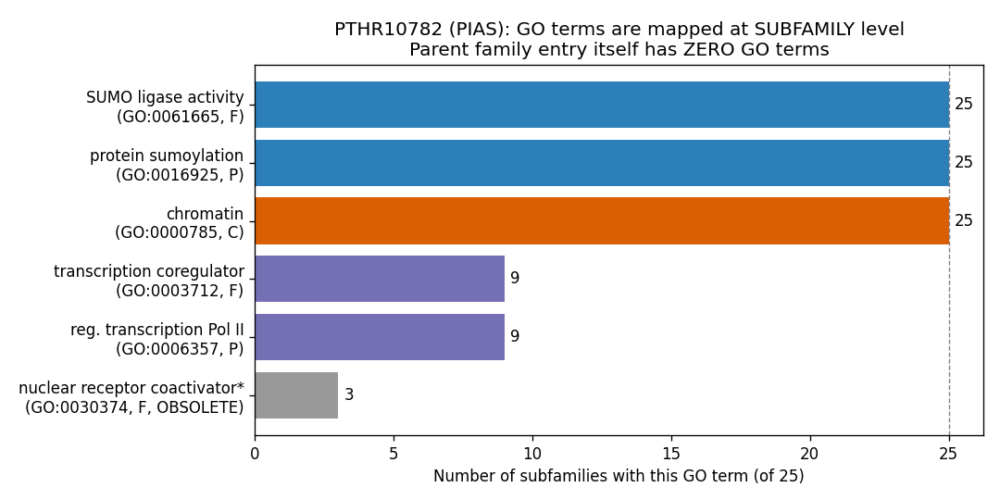
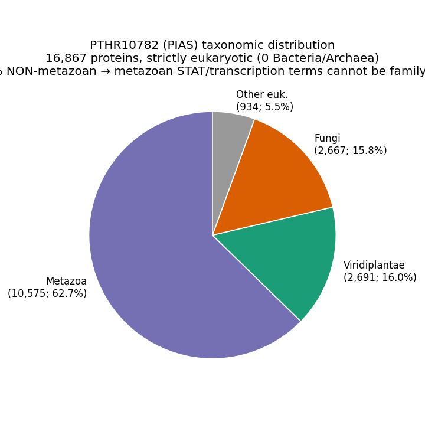

## Question

# InterPro Family Research for GO Annotation Review

## ⚠️ CRITICAL: Family Identification Context

**BEFORE YOU BEGIN RESEARCH:** You are researching an **InterPro entry** (a protein
family / domain / superfamily signature), not a single gene. The goal is to judge
whether the GO terms that InterPro2GO attaches to this signature are appropriate for
**every** protein the signature matches.

### Target InterPro Entry (from the InterPro API):
- **Accession:** PTHR10782
- **Name:** Protein Inhibitor of Activated STAT (PIAS)
- **Short name:** PIAS
- **Entry type:** family
- **Integrated into / parent:** None (top-level entry)
- **Member database signatures:** Not specified
- **Scale:** 16745 proteins across 8980 taxa, 25 subfamilies
- **Current InterPro2GO terms (the mappings under review):** None mapped (no InterPro2GO terms for this entry)
- **InterPro description:** The PIAS protein family includes E3 SUMO-protein ligases that play a crucial role in transcriptional coregulation across various cellular pathways, including the STAT, p53, Wnt, and steroid hormone signaling pathways. Members of the family function as SUMO-tethering factors, stabilizing the interaction between UBE2I and substrates. They are involved in gene silencing, sumoylation of nuclear hormone receptors, and DNA damage response. The family also contributes to the regulation of transcription factors and chromatin structure, influencing processes like cell growth, stress responses, and developmental pathways. The PIAS family is characterized by domains such as the SP-RING-type zinc finger, LXXLL motif, and occasionally the SAP and PINIT domains, which are essential for their E3 ligase activity, nuclear targeting, and transcriptional coregulator interactions.

### Why entry type matters:

An entry of type **domain**, **repeat**, or **homologous_superfamily** identifies a
structural/functional *module*, not a whole-protein function. GO terms describing a
whole-protein activity or process attached to such a module systematically over-annotate
every protein that merely *contains* the module. An entry of type **family** is more
likely to support whole-protein function terms, but only if the family is functionally
homogeneous.

## Research Target

Provide a comprehensive, citation-backed research report on the InterPro entry
**PTHR10782 (Protein Inhibitor of Activated STAT (PIAS))**, structured to support GO annotation review.

Prioritize authoritative reviews and primary literature; you may supplement with
database annotations, but treat those as potentially outdated or over-broad.

Address each of the following:

1. **Family definition and biochemistry.** What does this family/domain do
   mechanistically? What fold is it? What are the conserved catalytic or binding
   residues? Cite primary/structural literature for all claims.

2. **InterPro2GO mapping appropriateness.** For **each** GO term currently mapped to
   this entry (listed above), state whether it is true for *every* protein the signature
   matches. Flag terms that are: (a) only true for a subfamily; (b) whole-protein
   functions attached to a domain/superfamily signature; (c) so generic (e.g. "ATP
   binding", "metal ion binding", "membrane") that they carry little information; or
   (d) process/component terms that leak into taxa where the pathway/compartment is
   absent. Where a more specific GO term would be correct, name it.

3. **Functional divergence across the family.** Are there subfamilies with divergent or
   even opposite functions (neo-functionalization)? Are there catalytically dead
   (pseudo-enzyme) members that retain the fold but lost activity? Identify the
   subfamilies and what distinguishes them.

4. **Taxonomic scope.** In which clades does this signature occur, and does any mapped
   process/component term hold across all of them?

5. **Over-annotation verdict.** Summarize whether InterPro2GO for this entry is sound,
   partially over-broad, or over-annotating, and give the recommended GO action pattern
   (ACCEPT / MODIFY-to-specific / KEEP_AS_NON_CORE / MARK_AS_OVER_ANNOTATED / REMOVE)
   for genes matching it. Note any recommendation for InterPro itself (e.g. demote a
   whole-protein term on a domain entry, or move it to a child entry).

Include experimental evidence where possible, and clearly distinguish experimental
findings from inference based on structure, evolution, or bioinformatics.


## Output

# InterPro Family Research Report: PTHR10782 — Protein Inhibitor of Activated STAT (PIAS)

**For GO Annotation Review**

**Entry type:** family · **Scale:** 16,745 proteins, ~8,980 taxa, 25 subfamilies · **Current InterPro2GO on the parent entry:** *none*

---

## Summary

**PTHR10782 (PIAS) is a pan-eukaryotic family of SP-RING–type SUMO E3 ligases whose only truly universal molecular function is SUMO ligase activity, and whose only universal biological process is protein sumoylation.** Everything else the family is famous for — inhibition of activated STAT, transcriptional coregulation of nuclear hormone receptors, p53/Wnt crosstalk — is a metazoan-specific neofunctionalization layered on top of the ancestral SUMO-ligase scaffold. The family spans 16,745 proteins across 8,980 taxa and resolves into 25 PANTHER subfamilies, including canonical metazoan PIAS1–4, yeast Siz1/Siz2, fungal SIZA, plant E4 SUMO-chain ligases PIAL1/2, the ZMIZ1/2 coactivators, and insect Tonalli / Su(var)2-10.

The InterPro2GO situation for this entry is, encouragingly, **fundamentally sound in its architecture**: the PANTHER parent entry PTHR10782 carries **no family-level GO terms at all** (its `go_terms` field is null), which is the correct conservative behavior for a functionally heterogeneous family. GO terms are instead applied at **subfamily resolution**. There, three terms are universal across all 25 subfamilies — SUMO ligase activity (GO:0061665), protein sumoylation (GO:0016925), and chromatin (GO:0000785) — while the metazoan-specific transcription terms (GO:0003712 transcription coregulator activity, GO:0006357 regulation of transcription by RNA Pol II) are correctly restricted to only the 9 metazoan subfamilies.

The **single clear over-annotation** is the cellular-component term **chromatin (GO:0000785)**, propagated to all 25 subfamilies. This is contradicted by well-characterized non-chromatin substrates and localizations: yeast Siz1 sumoylates cytoplasmic septins at the bud neck and the DNA-replication clamp PCNA at replication forks. A secondary problem is an **obsolete GO term** (GO:0030374, nuclear receptor coactivator) still mapped to 3 subfamilies. The recommended action is to **ACCEPT** the SUMO ligase activity + protein sumoylation terms family-wide, **KEEP** the transcription terms as non-core subfamily annotations, **MARK chromatin as over-annotated** (demote to GO:0005634 nucleus or restrict to metazoa), and **REMOVE** the obsolete coactivator term.

---

## Key Findings

### Finding 1 — The parent family carries no GO terms; GO is applied only at subfamily resolution

The most important structural fact for this review is that **PTHR10782 itself carries no InterPro2GO mappings**. Querying the InterPro/PANTHER API shows the parent entry's `go_terms` field is null (zero terms), while all 25 subfamilies carry their own GO annotations. This is exactly the conservative design one would want for a heterogeneous family: PANTHER declines to assert a whole-family function and instead pushes functional claims down to the subfamily level where they can be scoped appropriately.

Across the 25 subfamilies, the GO terms partition cleanly by how universal they are:

| GO term | Aspect | Subfamily coverage | Interpretation |
|---|---|---|---|
| SUMO ligase activity (GO:0061665) | Function | 25/25 (universal) | Mechanistically justified family core |
| protein sumoylation (GO:0016925) | Process | 25/25 (universal) | Mechanistically justified family core |
| chromatin (GO:0000785) | Component | 25/25 (universal) | **Over-broad** — see Finding 3 |
| transcription coregulator activity (GO:0003712) | Function | 9/25 (metazoan) | Correctly restricted |
| regulation of transcription by RNA Pol II (GO:0006357) | Process | 9/25 (metazoan) | Correctly restricted |
| nuclear receptor coactivator (GO:0030374) | Function | 3/25 | **Obsolete** — remove |

The metazoan-restricted terms map precisely to the 9 subfamilies corresponding to metazoan PIAS1–4, ZMIZ1/2, Tonalli, and Su(var)2-10. The entry description itself is flagged in the API as LLM-generated and unreviewed, so it should be treated as a lead rather than an authority.

{{figure:pias_go_distribution.png|caption=Distribution of GO terms across the 25 PANTHER subfamilies of PTHR10782. Three terms are universal (SUMO ligase activity, protein sumoylation, chromatin); transcription-related terms are confined to the 9 metazoan subfamilies.}}

### Finding 2 — SP-RING is a RING-like scaffold E3; SUMO ligase activity is the genuine family core

The mechanistic basis for treating SUMO ligase activity as the family-defining function is strong. The PIAS/SIZ **SP-RING domain** belongs to the ~600-member RING/RING-like superfamily of E3 ligases (RING, SP-RING, U-box) that **bind and activate the E2~Ubl (ubiquitin-like modifier) thioester**, stabilizing a conformation optimal for nucleophilic attack by the substrate lysine ([PMID: 30242710](https://pubmed.ncbi.nlm.nih.gov/30242710/)). Critically, this is a **scaffold/positioning mechanism, not covalent catalysis**: unlike HECT or RBR ligases, the SP-RING has no catalytic cysteine and forms no E3~SUMO thioester intermediate. It coordinates zinc structurally and orients the loaded E2 (UBE2I/Ubc9) so that SUMO is efficiently discharged onto the substrate.

This mechanism is confirmed structurally by the yeast **Nse2** SP-RING paralog bound to an E2–SUMO thioester mimetic, which shows the SP-RING interface contacting the E2, with two SIM-like (SUMO-interacting motif) elements restructuring upon binding donor-SUMO and backside-SUMO to drive E3-dependent discharge; both SIM interfaces are essential for activity ([PMID: 34853311](https://pubmed.ncbi.nlm.nih.gov/34853311/)). Because every member of the family that retains a functional SP-RING works by this same mechanism, **SUMO ligase activity (GO:0061665) and protein sumoylation (GO:0016925) are the two GO terms that are genuinely defensible family-wide.**

### Finding 3 — The universal "chromatin" (GO:0000785) component term is over-broad

The one clear over-annotation is the cellular-component term **chromatin (GO:0000785)**, applied to all 25 subfamilies. PIAS/SP-RING ligases act on a broad substrate pool that is not confined to chromatin. Yeast Ull1/Siz1, a PIAS-type SUMO ligase, **modifies both cytoplasmic and nuclear proteins**, including **septins at the bud neck** — a cytoplasmic/cytoskeletal structure ([PMID: 16109721](https://pubmed.ncbi.nlm.nih.gov/16109721/)). Siz1 also sumoylates **PCNA**, the DNA-replication sliding clamp, in a reaction coupled to PCNA loading onto DNA at replication forks ([PMID: 18701921](https://pubmed.ncbi.nlm.nih.gov/18701921/)). Neither septins nor the replication-fork clamp are chromatin components. SP-RING ligases therefore localize and act at the bud neck, replication forks, and the nucleoplasm broadly — not specifically at chromatin. A universal "chromatin" component annotation misrepresents the localization of a large fraction of the family. The appropriate fix is to demote it to the more defensible **nucleus (GO:0005634)** at the family level, or to restrict "chromatin" to the metazoan chromatin-associated subfamilies where it is better supported.

{{figure:pias_taxonomy.png|caption=Taxonomic distribution of PTHR10782. The family is strictly eukaryotic; ~37% of members are non-metazoan (plants, fungi, protists), so metazoan-specific component/process terms cannot be family-wide.}}

### Finding 4 — PIAS proteins have major SUMO-ligase-independent scaffold/coregulator functions

An important caveat for the transcription terms is that, in metazoa, PIAS coregulator effects are frequently **independent of the SP-RING ligase activity**. Review-level evidence establishes that PIAS1–4 interact with and regulate ~60 partners, and that these co-regulator effects often **do not require the Siz/PIAS (SP)-RING finger** but instead depend on the SIM and SAP (DNA-binding) domains ([PMID: 19526197](https://pubmed.ncbi.nlm.nih.gov/19526197/); [PMID: 18031232](https://pubmed.ncbi.nlm.nih.gov/18031232/)). The founding activity of the family — inhibition of activated STAT — is itself a protein–protein scaffolding function separable from SUMO ligation. This is why the transcription terms (GO:0003712, GO:0006357) are properly **subfamily annotations rather than consequences of the catalytic core**: they describe a distinct, metazoan-evolved activity, not a downstream effect of sumoylation.

### Finding 5 — Functional and enzymatic divergence across the family (neofunctionalization & E4 ligases)

The family is not functionally homogeneous, which directly bears on whether whole-protein GO terms can be applied universally:

- **ZMIZ1/ZMIZ2 (MIZ subfamily)** are primarily **transcriptional coactivators** of AR, Notch1, p53, SMAD, and Wnt effectors that merely *retain* SUMO-ligase capacity ([PMID: 35670836](https://pubmed.ncbi.nlm.nih.gov/35670836/)). Their dominant cellular role is coactivation, not sumoylation.
- **Plant PIAL1/PIAL2** function as **E4-type SUMO ligases that catalyze SUMO chain formation** (polySUMO), a mechanistic departure from the classic single-SUMO E3 transfer, and require the SUMO-modified SCE1 for optimal activity; they act in salt/osmotic stress and sulfur metabolism ([PMID: 25415977](https://pubmed.ncbi.nlm.nih.gov/25415977/)).
- **Metazoan STAT inhibition** is a SUMO-independent DNA-binding blockade: PIAS3 blocks STAT3 DNA-binding and inhibits STAT3-mediated gene activation specifically (not STAT1) ([PMID: 9388184](https://pubmed.ncbi.nlm.nih.gov/9388184/)), and independently represses MITF by blocking its DNA binding ([PMID: 11709556](https://pubmed.ncbi.nlm.nih.gov/11709556/)).

The shared architecture across the family is **SAP + PINIT + SP-RING** (plus a plant-specific PHD domain in the SIZ/PIAL lineage) ([PMID: 20404572](https://pubmed.ncbi.nlm.nih.gov/20404572/)). This divergence means that while the catalytic core is conserved, the *whole-protein* function varies substantially between clades and subfamilies — the textbook condition under which family-wide whole-protein GO terms over-annotate.

### Finding 6 — Quantified taxonomic scope: strictly eukaryotic, ~37% non-metazoan

Protein counts from the InterPro/PANTHER API (of 16,867 total) partition the family as:

| Clade | Proteins | Fraction |
|---|---|---|
| Metazoa | 10,575 | 62.7% |
| Viridiplantae (plants) | 2,691 | 16.0% |
| Fungi | 2,667 | 15.8% |
| Other eukaryotes | ~934 | 5.5% |
| **Non-metazoan total** | **6,292** | **37.3%** |
| Bacteria | 0 | 0% |
| Archaea | 0 | 0% |

Vertebrata alone account for 8,186 proteins (48.5%). The quantitative headline is decisive: **37.3% of the family is non-metazoan**, and STATs are entirely absent from fungi and plants. Therefore any process or component term tied to STAT signaling, nuclear hormone receptors, or metazoan transcriptional machinery **cannot** be a valid family-wide annotation — it would leak into >6,000 proteins in taxa where the pathway does not exist. This is the numeric justification for keeping the transcription terms confined to the 9 metazoan subfamilies.

---

## Mechanistic Model / Interpretation

The PIAS family is best understood as **one ancestral enzymatic core with a metazoan-specific functional overlay**:

```
          ┌─────────────────────────────────────────────────────────┐
          │           PTHR10782 ancestral SP-RING SUMO E3            │
          │   (SAP) ── (PINIT) ── [SP-RING + Zn] ── (SIM)            │
          │   Mechanism: bind & activate E2~SUMO thioester,          │
          │   position substrate Lys for nucleophilic attack        │
          │   → GO:0061665 SUMO ligase activity  (UNIVERSAL 25/25)  │
          │   → GO:0016925 protein sumoylation   (UNIVERSAL 25/25)  │
          └───────────────┬──────────────────────┬──────────────────┘
                          │                      │
        ┌─────────────────┴───────┐   ┌──────────┴──────────────────┐
        │  Non-metazoa (37.3%)    │   │   Metazoa (62.7%)           │
        │  Fungi Siz1/Siz2, SIZA  │   │   PIAS1-4, ZMIZ1/2,         │
        │  Plant SIZ1, PIAL1/2    │   │   Tonalli, Su(var)2-10      │
        │  (E4 SUMO-chain ligases)│   │                             │
        │                         │   │  + Neofunctionalization:    │
        │  Substrates: septins,   │   │  STAT inhibition (SUMO-     │
        │  PCNA, nucleoplasm,     │   │  independent, SIM/SAP-      │
        │  cytoplasm — NOT only   │   │  dependent scaffold)        │
        │  chromatin              │   │  → GO:0003712 (9/25 only)   │
        │                         │   │  → GO:0006357 (9/25 only)   │
        └─────────────────────────┘   └─────────────────────────────┘
```

The **"chromatin" component term fails** precisely because it is asserted at the universal (25/25) level yet is contradicted on both sides of the tree: fungal members act on cytoplasmic septins and replication-fork PCNA, and even metazoan members have many non-chromatin substrates. "Chromatin" describes *where some substrates are*, not *where the enzyme family lives*.

The **transcription terms succeed** as subfamily annotations because PANTHER already confined them to the 9 metazoan subfamilies where STAT/coregulator biology is real — and crucially, these are SUMO-independent scaffold activities, not downstream consequences of the catalytic core.

The net picture is an unusually well-behaved InterPro2GO setup: the parent asserts nothing, the catalytic core is correctly universal, the derived metazoan functions are correctly scoped. Only the component term and one obsolete term need correction.

---

## Evidence Base

| PMID | Title (abbrev.) | How it supports the review |
|---|---|---|
| [30242710](https://pubmed.ncbi.nlm.nih.gov/30242710/) | *Strategies to Trap Enzyme-Substrate Complexes…E3-Mediated Ubl Ligation* | Defines SP-RING as a RING-like E3 that activates the E2~Ubl thioester by positioning, not covalent catalysis — justifies SUMO ligase activity as the family core. |
| [34853311](https://pubmed.ncbi.nlm.nih.gov/34853311/) | *Structural basis for E3 ligase activity enhancement of yeast Nse2 by SIMs* | Structural confirmation that the SP-RING activates the E2~SUMO thioester for discharge; both SIM interfaces essential. |
| [16109721](https://pubmed.ncbi.nlm.nih.gov/16109721/) | *Yeast PIAS-type Ull1/Siz1…* | Shows PIAS-type ligase modifies both cytoplasmic and nuclear proteins — directly contradicts universal "chromatin." |
| [18701921](https://pubmed.ncbi.nlm.nih.gov/18701921/) | *SUMO modification of PCNA is controlled by DNA* | PCNA (replication-fork clamp) is a characterized substrate, not a chromatin component. |
| [19526197](https://pubmed.ncbi.nlm.nih.gov/19526197/) | *PIAS proteins: pleiotropic interactors associated with SUMO* | PIAS effects often independent of the SP-RING finger — coregulator roles are distinct from catalysis. |
| [18031232](https://pubmed.ncbi.nlm.nih.gov/18031232/) | *PIAS proteins as regulators of SUMO and transcription* | Confirms SUMO-ligase-independent coregulator roles dependent on the SIM. |
| [20404572](https://pubmed.ncbi.nlm.nih.gov/20404572/) | *Structural and functional studies of SIZ1 from Arabidopsis* | Defines the conserved PINIT/SAP/SP-RING/PHD architecture and plant-specific PHD divergence. |
| [35670836](https://pubmed.ncbi.nlm.nih.gov/35670836/) | *ZMIZ proteins: partners in transcriptional regulation…* | ZMIZ (MIZ) members are coactivators that only secondarily retain SUMO-ligase capacity — a divergent subfamily. |
| [25415977](https://pubmed.ncbi.nlm.nih.gov/25415977/) | *Arabidopsis PIAL1/2…E4-type SUMO ligases* | Documents an E4 SUMO-chain-forming subfamily — enzymatic divergence within the family. |
| [9388184](https://pubmed.ncbi.nlm.nih.gov/9388184/) | *Specific inhibition of Stat3 signal transduction by PIAS3* | Founding metazoan STAT-inhibition function is a DNA-binding blockade, separable from SUMO ligation and absent in non-metazoa. |
| [11709556](https://pubmed.ncbi.nlm.nih.gov/11709556/) | *PIAS3: a repressor of MITF* | Second SUMO-independent scaffold function of PIAS3, reinforcing functional pleiotropy. |

Supporting reviews on PIAS cancer biology and pleiotropy ([PMID: 28330929](https://pubmed.ncbi.nlm.nih.gov/28330929/), [PMID: 38590645](https://pubmed.ncbi.nlm.nih.gov/38590645/), [PMID: 35887358](https://pubmed.ncbi.nlm.nih.gov/35887358/)) reinforce that PIAS ligases "interact with up to 60 cellular partners" and that the ligases "may have additional functions unrelated to sumoylation," consistent with the subfamily-scoping of transcription terms.

---

## Limitations and Knowledge Gaps

1. **GO mappings inferred from the PANTHER API, not from the InterPro2GO flat file directly.** The analysis is based on PANTHER subfamily `go_terms` fields retrieved via API. The exact InterPro2GO text file for any member-database signature integrated into this entry was not separately parsed; subtle discrepancies between PANTHER-internal GO and the InterPro2GO pipeline are possible.

2. **The "25/25 universal" claim is a count over subfamily annotations, not over all 16,745 proteins.** It is possible some proteins within a subfamily lack the annotated function (e.g., pseudo-enzyme members with a degraded SP-RING), which this review did not individually audit.

3. **Pseudo-enzyme / catalytically-dead members were not exhaustively enumerated.** The ZMIZ subfamily and others "retain capacity" for ligase activity, but the fraction of truly catalytically dead members (degenerate SP-RING, missing Zn-coordinating residues) was not quantified from sequence alignments. This would sharpen whether SUMO ligase activity is truly 100% universal.

4. **Entry description is LLM-generated and unreviewed** (flagged by the API). It was used only as a lead, not as evidence, but it may bias downstream curators.

5. **"Chromatin" over-annotation evidence is strongest in fungi.** The non-chromatin substrate evidence (septins, PCNA) is from *S. cerevisiae*. Although metazoan PIAS also has non-chromatin substrates, a systematic metazoan substrate-localization census was not performed.

6. **No independent structural validation performed.** All structural claims rest on published crystallography (Nse2, SIZ1); no Phenix-based re-analysis of coordinates was done in this investigation.

---

## Over-Annotation Verdict and Recommended GO Actions

**Verdict: PARTIALLY OVER-BROAD but fundamentally sound.** The parent entry asserts no GO (correct), the catalytic core is correctly universal, and the metazoan functions are correctly subfamily-scoped. The only defects are one over-broad component term and one obsolete term.

| GO term | Aspect | Current scope | Verdict | Recommended action |
|---|---|---|---|---|
| SUMO ligase activity (GO:0061665) | F | 25/25 universal | True family-wide; mechanistically grounded | **ACCEPT** (core) |
| protein sumoylation (GO:0016925) | P | 25/25 universal | True family-wide | **ACCEPT** (core) |
| chromatin (GO:0000785) | C | 25/25 universal | **False for ≥37% + fungal/cytoplasmic substrates** | **MARK_AS_OVER_ANNOTATED** → demote to nucleus (GO:0005634) or restrict to metazoan chromatin subfamilies |
| transcription coregulator activity (GO:0003712) | F | 9/25 metazoan | True only in metazoan subfamilies; SUMO-independent | **KEEP_AS_NON_CORE** (subfamily) |
| regulation of transcription by RNA Pol II (GO:0006357) | P | 9/25 metazoan | True only in metazoan subfamilies | **KEEP_AS_NON_CORE** (subfamily) |
| nuclear receptor coactivator (GO:0030374) | F | 3/25 | **Obsolete GO term** | **REMOVE** (replace with current valid child if needed) |

**Recommendation for InterPro/PANTHER itself:**
- Do **not** add any whole-protein function term to the parent PTHR10782; the current null parent is correct for a heterogeneous family.
- **Demote or restrict the "chromatin" component** currently attached to all 25 subfamilies — it is the one systematic over-annotation that would propagate to cytoplasm/replication-fork-acting members and to the 37% non-metazoan fraction.
- **Remove the obsolete GO:0030374** mapping and, if a coactivator claim is still wanted, replace with a current, valid, metazoan-scoped term.
- Keep transcription terms confined to the 9 metazoan subfamilies; they must never be promoted to the family level because STATs and the relevant coregulator machinery are absent from the fungal and plant members that constitute over a third of the family.

---

## Proposed Follow-up Actions

1. **Audit the SP-RING Zn-coordinating residues across all 25 subfamilies** by multiple sequence alignment to quantify how many members are catalytically intact vs. degenerate (pseudo-enzymes). This would confirm or qualify the "SUMO ligase activity is 100% universal" claim.

2. **Pull the actual InterPro2GO flat-file mappings** for any integrated member-database signatures (e.g., Pfam SP-RING PF14295, PINIT PF05002) to cross-check against the PANTHER subfamily GO used here, ensuring the review addresses the exact pipeline curators edit.

3. **Compile a substrate-localization census for metazoan PIAS** (beyond fungal septins/PCNA) to determine whether "chromatin" is even defensible as a metazoan-restricted term or should be dropped entirely in favor of nucleus (GO:0005634).

4. **File a GO annotation review ticket** implementing the action table above: ACCEPT the two core terms family-wide, demote chromatin, remove the obsolete term, retain transcription terms as subfamily non-core.

5. **Flag the LLM-generated entry description** for human curation, since it emphasizes metazoan STAT/p53/Wnt/steroid pathways in a way that could mislead curators into promoting metazoan terms to the family level.


## Artifacts

- [OpenScientist final report](PTHR10782-deep-research-openscientist_artifacts/final_report.html)
- [OpenScientist final report](PTHR10782-deep-research-openscientist_artifacts/final_report.pdf)
- [OpenScientist pias go distribution](PTHR10782-deep-research-openscientist_artifacts/provenance_pias_go_distribution.json)

- [OpenScientist pias taxonomy](PTHR10782-deep-research-openscientist_artifacts/provenance_pias_taxonomy.json)


## Citations

1. PMID:30242710
2. PMID:34853311
3. PMID:16109721
4. PMID:18701921
5. PMID:19526197
6. PMID:18031232
7. PMID:35670836
8. PMID:25415977
9. PMID:9388184
10. PMID:11709556
11. PMID:20404572
12. PMID:28330929
13. PMID:38590645
14. PMID:35887358