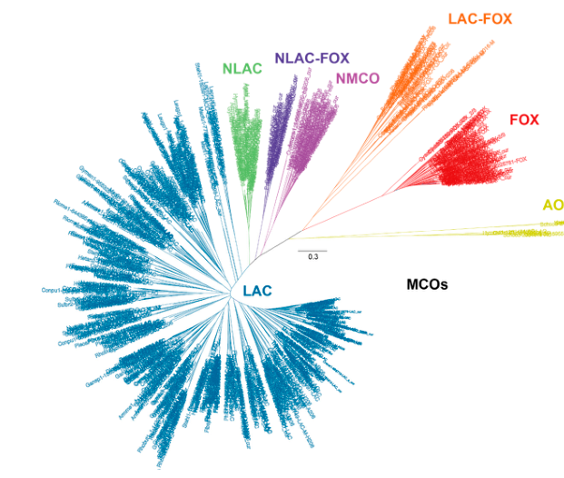

## Question

# PANTHER Family Research

## Family Context

- **Family ID:** PTHR11709
- **Family Name:** {'name': 'MULTI-COPPER OXIDASE', 'short': None}
- **InterPro Entry:** IPR045087
- **Root Node:** 
- **Number of Subfamilies:** 0

### Subfamily Summary

No subfamily information available.

---

## Research Objective

This is a PANTHER protein family that may contain subfamilies with divergent functions. Your task is to investigate the evolutionary relationships and functional diversity within this family, with particular attention to:

1. **Neo-functionalization**: Have any subfamilies evolved new functions distinct from the ancestral function?
2. **Subfunctionalization**: Have subfamilies specialized for different substrates, cellular contexts, or organisms?
3. **GO annotation accuracy**: Are the GO annotations propagated from ancestral nodes appropriate for all descendants?

## Research Questions

### 1. Family Function Overview

For this protein family:
- What is the common structural fold shared by family members?
- What is the ancestral/core function of this family?
- What cofactors, substrates, or binding partners are typical?
- What are the key catalytic/functional residues?

### 2. Subfamily Functional Diversity

For each major subfamily:
- What is the specific function of proteins in this subfamily?
- Does this function differ from the ancestral function?
- What is the EC number (if enzymatic)?
- What experimental evidence supports this function?

### 3. Neo-functionalization Detection

Look for signs of functional divergence:
- Are there subfamilies with different EC numbers within the family?
- Are there subfamilies that catalyze opposite reactions (e.g., synthesis vs degradation)?
- Are there subfamilies with different substrate specificities?
- Do any subfamilies have non-catalytic functions (e.g., structural, regulatory)?

### 4. Branch Length Analysis

Consider the evolutionary divergence:
- Which subfamilies have the longest branch lengths from the root?
- Do longer branches correlate with functional changes?
- Are there any very short branches that might be recent duplications?

### 5. GO Annotation Assessment

For GO annotations propagated across the family:
- Are these annotations appropriate for ALL subfamilies?
- Should any subfamilies have different/opposite annotations?
- Are there subfamilies that should be excluded from certain annotations?
- What subfamily-specific annotations should be added?

### 6. Literature Support

- What are the key papers describing this protein family?
- Are there papers specifically about functional divergence within the family?
- Are there structural biology papers showing differences between subfamilies?
- Are there biochemical studies comparing activities of different family members?

## Output Format

Please provide your findings in a narrative format with citations. Structure your response as:

1. **Executive Summary** - Brief overview of family diversity and key findings
2. **Ancestral Function** - What the common ancestor likely did
3. **Subfamily Analysis** - Function of each major subfamily with evidence
4. **Functional Divergence** - Cases of neo-functionalization or subfunctionalization
5. **GO Annotation Issues** - Problematic annotations and recommendations
6. **Key Literature** - Citations supporting the analysis

Be sure to include citations (PMIDs) for all statements.

## Output

Question: You are an expert researcher providing comprehensive, well-cited information.

Provide detailed information focusing on:
1. Key concepts and definitions with current understanding
2. Recent developments and latest research (prioritize 2023-2024 sources)
3. Current applications and real-world implementations
4. Expert opinions and analysis from authoritative sources
5. Relevant statistics and data from recent studies

Format as a comprehensive research report with proper citations. Include URLs and publication dates where available.
Always prioritize recent, authoritative sources and provide specific citations for all major claims.

# PANTHER Family Research

## Family Context

- **Family ID:** PTHR11709
- **Family Name:** {'name': 'MULTI-COPPER OXIDASE', 'short': None}
- **InterPro Entry:** IPR045087
- **Root Node:** 
- **Number of Subfamilies:** 0

### Subfamily Summary

No subfamily information available.

---

## Research Objective

This is a PANTHER protein family that may contain subfamilies with divergent functions. Your task is to investigate the evolutionary relationships and functional diversity within this family, with particular attention to:

1. **Neo-functionalization**: Have any subfamilies evolved new functions distinct from the ancestral function?
2. **Subfunctionalization**: Have subfamilies specialized for different substrates, cellular contexts, or organisms?
3. **GO annotation accuracy**: Are the GO annotations propagated from ancestral nodes appropriate for all descendants?

## Research Questions

### 1. Family Function Overview

For this protein family:
- What is the common structural fold shared by family members?
- What is the ancestral/core function of this family?
- What cofactors, substrates, or binding partners are typical?
- What are the key catalytic/functional residues?

### 2. Subfamily Functional Diversity

For each major subfamily:
- What is the specific function of proteins in this subfamily?
- Does this function differ from the ancestral function?
- What is the EC number (if enzymatic)?
- What experimental evidence supports this function?

### 3. Neo-functionalization Detection

Look for signs of functional divergence:
- Are there subfamilies with different EC numbers within the family?
- Are there subfamilies that catalyze opposite reactions (e.g., synthesis vs degradation)?
- Are there subfamilies with different substrate specificities?
- Do any subfamilies have non-catalytic functions (e.g., structural, regulatory)?

### 4. Branch Length Analysis

Consider the evolutionary divergence:
- Which subfamilies have the longest branch lengths from the root?
- Do longer branches correlate with functional changes?
- Are there any very short branches that might be recent duplications?

### 5. GO Annotation Assessment

For GO annotations propagated across the family:
- Are these annotations appropriate for ALL subfamilies?
- Should any subfamilies have different/opposite annotations?
- Are there subfamilies that should be excluded from certain annotations?
- What subfamily-specific annotations should be added?

### 6. Literature Support

- What are the key papers describing this protein family?
- Are there papers specifically about functional divergence within the family?
- Are there structural biology papers showing differences between subfamilies?
- Are there biochemical studies comparing activities of different family members?

## Output Format

Please provide your findings in a narrative format with citations. Structure your response as:

1. **Executive Summary** - Brief overview of family diversity and key findings
2. **Ancestral Function** - What the common ancestor likely did
3. **Subfamily Analysis** - Function of each major subfamily with evidence
4. **Functional Divergence** - Cases of neo-functionalization or subfunctionalization
5. **GO Annotation Issues** - Problematic annotations and recommendations
6. **Key Literature** - Citations supporting the analysis

Be sure to include citations (PMIDs) for all statements.

## PANTHER Family PTHR11709 (InterPro IPR045087): MULTI‑COPPER OXIDASE — Functional Diversity & Evolutionary Assessment (2023–2024 focus)

### Executive Summary
PTHR11709 / IPR045087 corresponds to the multi‑copper oxidase (MCO) “Cu‑oxidase” family, encompassing canonical laccases and multiple divergent MCO lineages distinguished by domain architecture (2/3/6 cupredoxin domains), cellular localization (secreted, periplasmic/spore coat, membrane-tethered, plasma), and substrate specialization (phenolics/aromatics, Fe(II), ascorbate). A 2024 study explicitly links IPR045087 (“Cu‑oxidase_fam”) to PTHR11709 (“multi‑copper oxidase‑PTHR11709”), consistent with these proteins carrying multiple Cu‑oxidase domains and MCO signature motifs. (tiwari2024precisionthermostabilitypredictions pages 9-11)

Across fungi, recent phylogenomic synthesis supports distinct MCO clades with different predicted functions—laccase sensu stricto (LAC), ferroxidases (FOX), ascorbate oxidases (AO), and laccase–ferroxidase hybrids (LAC‑FOX)—implying that a single ancestral-node function (e.g., “laccase activity” or “iron homeostasis”) is inappropriate to propagate to all descendants. (aza2023fungallaccasesfundamentals pages 6-8, aza2023fungallaccasesfundamentals pages 5-6, aza2023fungallaccasesfundamentals media 2a9da982)

Key takeaways:
- **Shared catalytic core**: all bona fide MCOs share a **T1 copper** site that accepts electrons from substrates and a **T2/T3 trinuclear cluster (TNC)** that reduces O2 to H2O. (singha2023tuningthetype pages 1-3, aza2023fungallaccasesfundamentals pages 1-3)
- **Neo-/subfunctionalization** is strongly supported by clade‑specific determinants such as Fe(II)-binding acidic residues in ferroxidases and by lineage-specific gene family expansions with stress‑specific expression patterns in fungi. (aza2023fungallaccasesfundamentals pages 6-8, zhang2023genomewidestudyof pages 1-2)
- **GO propagation risk**: over‑propagating specific terms (e.g., “ferroxidase activity”, “lignin catabolic process”, “ascorbate oxidase activity”) across PTHR11709 descendants is likely to create systematic misannotation; only high‑level MCO chemistry terms can be propagated broadly. (aza2023fungallaccasesfundamentals pages 6-8, aza2023fungallaccasesfundamentals pages 5-6)

### Family Function Overview (Key Concepts & Definitions)

#### Common structural fold and copper-site organization
MCOs are **cupredoxin-fold** oxidoreductases. Canonical laccase-like enzymes are typically **three-domain** cupredoxin proteins; the catalytic unit contains **four Cu ions** coordinated by **ten histidines and one cysteine**, arranged as **T1**, **T2**, and **binuclear T3** sites. (aza2023fungallaccasesfundamentals pages 1-3)

Mechanistically, MCOs contain:
- A **mononuclear T1 Cu** site (typically with a **2His–1Cys** ligand set and variable axial ligand), which accepts electrons from substrate. (singha2023tuningthetype pages 1-3, aza2023fungallaccasesfundamentals pages 1-3)
- A **TNC** comprising **T2 + T3** (T2 coordinated by two His and a water-derived ligand; T3 is binuclear with six His ligands total) where **O2 is reduced to H2O**. (singha2023tuningthetype pages 1-3, aza2023fungallaccasesfundamentals pages 3-5, jaiswal2024thermostableαamylasesand pages 10-12)
- An electron-transfer pathway between T1 and TNC via a **Cys–His superexchange** route, with T1→TNC distance on the order of ~13 Å in representative systems. (singha2023tuningthetype pages 1-3)

A schematic of the 3-domain laccase fold and copper-site arrangement (T1/T2/T3) is shown in the retrieved figure from a 2023 laccase review. (aza2023fungallaccasesfundamentals media 8c0dab1f)

#### Ancestral/core function (current understanding)
The conserved ancestral biochemical capability across the family is best described as:
- **Copper-dependent oxidoreductase activity** coupling **one-electron oxidation of a donor substrate at T1** to **four-electron reduction of O2 to H2O at the TNC**. (singha2023tuningthetype pages 1-3, aza2023fungallaccasesfundamentals pages 3-5)

A widely used net reaction for laccase-type MCOs is:
- **4RH + O2 → 4R• + 2H2O**, where RH represents the reducing substrate. (jaiswal2024thermostableαamylasesand pages 10-12)

#### Typical substrates, cofactors, binding partners
- **Cofactors**: copper ions (typically 4 in 3-domain laccases; 6 in mammalian multicopper ferroxidases). (aza2023fungallaccasesfundamentals pages 1-3, helman2023thebiologyof pages 1-3)
- **Substrates**:
  - Laccase clades oxidize a broad spectrum of **phenolics, aryl amines, N-heterocycles, and dyes**, often broadened via **redox mediators**. (aza2023fungallaccasesfundamentals pages 3-5)
  - Ferroxidase clades oxidize **Fe(II) → Fe(III)**. (aza2023fungallaccasesfundamentals pages 6-8, amadei2024investigatingtheferroportinferroxidase pages 45-50)
  - Ascorbate oxidase clades oxidize **ascorbate** (and sometimes phenolics). (aza2023fungallaccasesfundamentals pages 6-8)
- **Binding partners (context-dependent)**: mammalian ferroxidases (ceruloplasmin/hephaestin) functionally couple to **ferroportin (FPN)** for iron export and transferrin loading; interaction/co-localization is reported in multiple systems. (helman2023thebiologyof pages 4-6, amadei2024investigatingtheferroportinferroxidase pages 40-45)

#### Key catalytic residues and determinants
Family-wide conserved features:
- T1 Cu: **2His–1Cys** ligation (with variable axial ligand). (singha2023tuningthetype pages 1-3, aza2023fungallaccasesfundamentals pages 1-3)
- TNC: histidine ligands and bridging ligation patterns consistent with O2 reduction chemistry. (singha2023tuningthetype pages 1-3, aza2023fungallaccasesfundamentals pages 3-5)
- A conserved **His–Cys–His** linkage/triad connecting electron transfer from T1 to TNC is emphasized in fungal laccase mechanistic descriptions. (aza2023fungallaccasesfundamentals pages 3-5)

Determinants of functional divergence:
- **T1 redox potential tuning**: MCO T1 potentials span approximately **340–780 mV**, with second-sphere electrostatics and H‑bonding to His ligands contributing substantially to differences; charged carboxylates in Fet3p lower T1 potential relative to Trametes versicolor laccase. (singha2023tuningthetype pages 1-3)
- **Axial ligand identity**: fungal high-redox laccases often feature **Phe/Leu** as the fourth axial ligand, while some lower‑potential enzymes (including some AOs) have **Met**, contributing to potential and substrate differences. (aza2023fungallaccasesfundamentals pages 6-8)
- **Ferroxidase Fe(II)-binding site**: ferroxidase activity depends on a specific Fe(II)-binding site formed by acidic residues equivalent to **Glu185, Asp283, Asp409 (Fet3p)**. (aza2023fungallaccasesfundamentals pages 6-8)

### Ancestral Function (inferred for PTHR11709 root)
Given the conserved T1+TNC architecture and oxygen-reduction chemistry, the most defensible ancestral function at the family root is **“multicopper oxidase activity”** (broad copper-dependent oxidoreductase using O2 as electron acceptor), rather than any single substrate-specific activity (e.g., “laccase activity” or “ferroxidase activity”). This is supported by mechanistic conservation across laccases, bilirubin oxidases, ascorbate oxidase, and multicopper ferroxidases described as members of the same MCO catalytic paradigm. (singha2023tuningthetype pages 1-3, singha2023tuningthetype pages 19-20)

### Subfamily / Major-Lineage Functional Diversity
Because PTHR11709 is reported without subfamilies in the prompt, the “subfamily” analysis below uses **major recognized functional lineages** within IPR045087/PTHR11709-like MCOs (fungal clades, vertebrate 6-domain ferroxidases, and bacterial laccase-like MCOs), for which recent evidence exists.

A recent phylogenetic classification of fungal MCOs into LAC/NLAC/FOX/AO/LAC‑FOX is shown in a retrieved figure (phylogeny/classification). (aza2023fungallaccasesfundamentals media 2a9da982)

#### 1) Fungal laccases (LAC; EC 1.10.3.2)
- **Function**: oxidation of diverse aromatic substrates with O2→H2O reduction; roles in lignin-related transformations and diverse physiological processes (development, interactions). (aza2023fungallaccasesfundamentals pages 3-5, li2023genomewideanalysisof pages 1-2)
- **Architecture/localization**: typically **3-domain** cupredoxin enzymes and often **secreted** glycoproteins. (aza2023fungallaccasesfundamentals pages 1-3, aza2023fungallaccasesfundamentals pages 9-11)
- **Evidence**:
  - Genome-wide family studies show extensive **paralog expansion** and subgrouping (e.g., Pleurotus eryngii has **10** laccase genes grouped into **four** subgroups; Cerrena unicolor has **18** laccase genes grouped into **three clades**). (li2023genomewideanalysisof pages 1-2, zhang2023genomewidestudyof pages 1-2)
  - Subfunctionalization: in C. unicolor, distinct paralogs respond predominantly to **copper** vs **oxidative stress** (CuLac8/12 vs CuLac2/13), supporting specialized regulatory roles. (zhang2023genomewidestudyof pages 1-2)

#### 2) Fungal ferroxidases (FOX)
- **Function**: Fe(II) oxidation supporting iron uptake/homeostasis. (aza2023fungallaccasesfundamentals pages 6-8)
- **Key determinant**: the **acidic Fe(II)-binding triad** (Fet3p equivalents Glu185/Asp283/Asp409) enabling electron transfer from Fe(II) to T1 Cu. (aza2023fungallaccasesfundamentals pages 6-8)
- **Distribution**: a recent basidiomycete survey suggests FOX are widespread (roughly ~1 per species on average, with a small number of species lacking them). (aza2023fungallaccasesfundamentals pages 6-8)

#### 3) Laccase–ferroxidase hybrids (LAC‑FOX)
- **Function**: can oxidize both Fe(II) and canonical laccase substrates (e.g., ABTS, phenols, aromatic amines), suggesting **functional blending** or intermediate states between laccase and ferroxidase specializations. (aza2023fungallaccasesfundamentals pages 6-8)
- **Ecological association**: enriched in wood-rotting fungi; the basidiomycete survey reports about ~1 LAC‑FOX per white-rot and brown-rot species. (aza2023fungallaccasesfundamentals pages 6-8)

#### 4) Ascorbate oxidases (AO; EC 1.10.3.3)
- **Function**: oxidation of ascorbic acid (and sometimes phenolics). (aza2023fungallaccasesfundamentals pages 6-8)
- **Rarity in fungal basidiomycetes**: the same survey reports AO genes are rare (only a few genomes). (aza2023fungallaccasesfundamentals pages 6-8)
- **Potential confusion**: AOs may differ at key determinants such as the axial ligand and residues near positions implicated in laccase substrate deprotonation, supporting the need for AO-specific annotation rather than “laccase”. (aza2023fungallaccasesfundamentals pages 6-8)

#### 5) Mammalian multicopper ferroxidases (ceruloplasmin CP, hephaestin HEPH, zyklopen ZP)
- **Function**: Fe(II) oxidation is central to systemic iron homeostasis; they support Fe export through **ferroportin** and loading onto transferrin while limiting ROS formation. (amadei2024investigatingtheferroportinferroxidase pages 40-45, helman2023thebiologyof pages 1-3)
- **Architecture/localization**: **six cupredoxin domains** with multiple T1 sites and a TNC; CP occurs as secreted plasma CP and a membrane GPI form; HEPH and ZP are **C-terminal transmembrane** proteins. (helman2023thebiologyof pages 1-3, helman2023thebiologyof pages 3-4)
- **Key residues / mechanistic evidence**:
  - CP has two Fe(II)-binding sites (domain 6 and domain 4) near T1 centers; residue sets are explicitly reported (e.g., domain 6: D1025/E935/H940/E272; domain 4: E971/D684/E597/H602). (amadei2024investigatingtheferroportinferroxidase pages 40-45, amadei2024investigatingtheferroportinferroxidase pages 45-50)
  - For HEPH, corresponding ligands include E960/H965/D1050/E300, with mutagenesis indicating E960/H965 are critical for binding/activity. (amadei2024investigatingtheferroportinferroxidase pages 45-50)
  - Kinetics: CP and HEPH show **biphasic Km** values for Fe(II) (CP: 0.6 μM and 50 μM; HEPH: 3.5 μM and 107 μM), consistent with coupling to different iron sources/sites (including proposed high-affinity FPN sites). (amadei2024investigatingtheferroportinferroxidase pages 91-96)
- **Disease relevance**: genetic loss of CP causes aceruloplasminemia with tissue iron accumulation; copper loading defects yield apo-CP lacking oxidase activity. (helman2023thebiologyof pages 4-6, helman2023thebiologyof pages 3-4)

#### 6) Bacterial laccase-like MCOs (including CueO/CotA/SLAC)
- **Function/application**: oxidation of xenobiotics and phenolics in harsh conditions; some are explicitly tied to copper homeostasis (CueO) while others are spore coat associated (CotA) or extracellular. (bera2024leveragingbacteriallaccases pages 21-22, bera2024leveragingbacteriallaccases pages 1-2)
- **Quantitative evidence from 2024 review**:
  - A UniProt survey reported ~**7,300** laccase entries (1,026 bacterial; 6,258 eukaryotic; 16 archaeal) and notes MCOs can be **2-, 3-, or 6-domain**. (bera2024leveragingbacteriallaccases pages 1-2)
  - Bioelectrochemical metric: a **CueO-based cathode** achieved current density ~**20 mA cm−2** at 0 V; reported T1 potentials include **0.28 V** (CueO, pH 5.0) and **~460 mV** (CotA) in cited work. (bera2024leveragingbacteriallaccases pages 21-22)
  - Industrial process benchmarks: laccase treatments in pulp contexts reduced kappa number by **5.89–21.1%**, reduced chlorine demand by up to **10%**, and decreased lignin by **28% (no mediator) to 47% (with mediator)**; recycled newsprint brightness increased **28.8%** with **73.9% ERIC** reduction in combined treatments. (bera2024leveragingbacteriallaccases pages 20-21)

### Functional Divergence: Neo-functionalization and Subfunctionalization

#### Evidence consistent with neo-functionalization (new functions relative to “generic laccase”)
1. **Ferroxidase specialization** (Fe(II) oxidation and iron homeostasis) is mechanistically distinct from broad phenolic oxidation and depends on acquisition of an Fe(II)-binding acidic site and coupling to metal export/import systems. In fungi, FOX and LAC-FOX clades reflect divergence from laccase-like substrate sets; in vertebrates, CP/HEPH/ZP are six-domain iron-export ferroxidases coupled to ferroportin. (aza2023fungallaccasesfundamentals pages 6-8, amadei2024investigatingtheferroportinferroxidase pages 40-45, helman2023thebiologyof pages 1-3)
2. **Ascorbate oxidase specialization** represents a substrate shift (ascorbate as primary electron donor) and is rare in basidiomycete datasets, consistent with a derived/lineage-specific function. (aza2023fungallaccasesfundamentals pages 6-8)

#### Evidence consistent with subfunctionalization (partitioning of roles among duplicates)
1. **Fungal paralog expansion** with stimulus-specific transcription suggests partitioning of roles among laccase paralogs. In C. unicolor, particular paralogs are dominant responders to copper vs oxidative stress. (zhang2023genomewidestudyof pages 1-2)
2. In P. eryngii, different laccase genes are implicated in **developmental timing** (PeLac5) versus **lignocellulose degradation** (PeLac2/4/9). (li2023genomewideanalysisof pages 1-2)

#### EC diversity within the broader family
Within IPR045087-like MCOs, distinct EC-level activities are expected (and are explicitly named for several clades):
- Laccase **EC 1.10.3.2** (aza2023fungallaccasesfundamentals pages 3-5, li2023genomewideanalysisof pages 1-2)
- Ascorbate oxidase **EC 1.10.3.3** (aza2023fungallaccasesfundamentals pages 6-8)
- Ferroxidase activity (Fe(II) oxidase; commonly mapped in biology of CP/HEPH although EC is not consistently provided in the retrieved text snippets). (amadei2024investigatingtheferroportinferroxidase pages 40-45, helman2023thebiologyof pages 1-3)

### Branch Length / Divergence Assessment (limitations)
The provided literature includes phylogenetic clustering and clade-level diversification patterns (including a retrieved phylogeny figure), but does **not** provide direct **PANTHER tree branch length** values for PTHR11709, nor node-wise divergence metrics that could be mapped back to PANTHER’s internal model. Therefore:
- **Qualitative divergence**: clade separation (LAC vs FOX vs AO vs hybrids) indicates deep divergence likely corresponding to long branches between these functional groups. (aza2023fungallaccasesfundamentals media 2a9da982, aza2023fungallaccasesfundamentals pages 6-8)
- **Short-branch/recent duplication signals** are better supported by within-species paralog expansions (e.g., 10–18 laccases in a genome), but exact branch lengths cannot be reported without the PANTHER phylogeny output. (zhang2023genomewidestudyof pages 1-2, li2023genomewideanalysisof pages 1-2)

### GO Annotation Issues and Recommendations

#### 1) What can be safely propagated across most descendants?
Given shared catalytic architecture and chemistry:
- **Copper ion binding** (supported by conserved copper sites and ligand sets). (aza2023fungallaccasesfundamentals pages 1-3, aza2023fungallaccasesfundamentals pages 3-5)
- **Oxidoreductase activity** using O2 as acceptor (broad MCO definition: T1 oxidation + TNC O2 reduction). (singha2023tuningthetype pages 1-3, aza2023fungallaccasesfundamentals pages 3-5)

These correspond to high-level GO concepts (e.g., “oxidoreductase activity” and “copper ion binding”) that are consistent across MCO clades.

#### 2) What should *not* be propagated across the entire family?
- **“Laccase activity (EC 1.10.3.2)”** should not be assigned to ferroxidase-specialized proteins (FOX, CP/HEPH/ZP) or ascorbate oxidases. The 2023 fungal MCO review explicitly emphasizes overlapping substrate specificity, poor sequence homology, and risks from automatic annotations without experimental validation. (aza2023fungallaccasesfundamentals pages 5-6, aza2023fungallaccasesfundamentals pages 6-8)
- **“Iron homeostasis / ferroxidase activity”** should not be propagated to canonical laccase clades unless the Fe(II)-binding determinants and/or biochemical evidence are present (e.g., Fet3p-like acidic triad; specific Fe-binding sites and coupling to iron transport). (aza2023fungallaccasesfundamentals pages 6-8, amadei2024investigatingtheferroportinferroxidase pages 45-50)
- **“Lignin catabolic process / lignocellulose degradation”** should not be assigned broadly: many laccases participate in these processes, but the family also includes iron-export ferroxidases and AOs where lignin catabolism is not a core role. (li2023genomewideanalysisof pages 1-2, helman2023thebiologyof pages 1-3)

#### 3) Subfamily-/clade-specific GO additions (evidence-based)
- FOX clade: add **ferroxidase activity** and iron-related process terms, constrained by Fe(II)-binding site determinants. (aza2023fungallaccasesfundamentals pages 6-8)
- LAC‑FOX: consider **dual annotations** (laccase-like oxidation + ferroxidase activity) when both substrate classes are supported. (aza2023fungallaccasesfundamentals pages 6-8)
- AO clade: add **ascorbate oxidase activity**. (aza2023fungallaccasesfundamentals pages 6-8)
- Vertebrate CP/HEPH/ZP: add **ferroxidase activity** and **iron ion homeostasis/iron export coupling** terms (FPN stabilization/iron efflux context), and avoid “lignin catabolic process”. (amadei2024investigatingtheferroportinferroxidase pages 40-45, helman2023thebiologyof pages 4-6, helman2023thebiologyof pages 1-3)

#### 4) Annotation guardrails (recommended checks)
- For ferroxidase annotations in fungal-like proteins: require presence of **Glu185/Asp283/Asp409 equivalents** (or validated Fe-binding motifs) and supportive phylogenetic placement in FOX/LAC‑FOX clades. (aza2023fungallaccasesfundamentals pages 6-8, aza2023fungallaccasesfundamentals media 2a9da982)
- For “secreted” or extracellular annotations: require signal peptide/TAT export predictions and avoid propagation where localization is ambiguous (noted in Actinobacteria MCO analysis, where export predictions can conflict). (prins2024actinobacteriaassociatedwith pages 75-82)

### Current Applications and Real-World Implementations (2023–2024)
Recent reviews emphasize that MCOs—particularly laccases—are active targets for biotechnological deployment.

#### Environmental and industrial biocatalysis
- **Pulp/paper processing**: laccase-based treatments can reduce kappa number by **5.89–21.1%**, reduce chlorine demand up to **10%**, and decrease lignin by **28% (no mediator) to 47% (with mediator)**; recycled newsprint brightness increased **28.8%** with **73.9% ERIC reduction** in combined treatments, reflecting real performance metrics for industrial implementation. (bera2024leveragingbacteriallaccases pages 20-21)

#### Biosensors and bioelectrochemical systems
- **Laccase-based sensing**: a reported linear range of **0.05–4.75 mM** for H2O2 detection is highlighted in a 2024 bacterial laccase review. (bera2024leveragingbacteriallaccases pages 21-22, bera2024leveragingbacteriallaccases pages 20-21)
- **Biofuel-cell style cathodes**: CueO-based cathodes achieving ~**20 mA cm−2** at 0 V demonstrate catalytic oxygen reduction implementation in electrochemical devices. (bera2024leveragingbacteriallaccases pages 21-22)

#### Enzyme engineering and discovery trends
- **Thermostable/extremotolerant laccases** remain a central development focus for scalable use at elevated temperature/high pH; a 2024 review compiles multiple high-temperature optima (e.g., reported sources up to ~90°C). (jaiswal2024thermostableαamylasesand pages 9-10, jaiswal2024thermostableαamylasesand pages 10-12)
- **Directed evolution and protein engineering** are emphasized as routes to improve secretion/yield and adapt laccases to process conditions (e.g., mediator systems; stability). (aza2023fungallaccasesfundamentals pages 14-15, aza2023fungallaccasesfundamentals pages 9-11)

### Relevant Statistics and Data (Recent Studies)
- **Family/database mapping**: explicit linkage of **IPR045087 ↔ PTHR11709** and MCO motif/domain signatures in 2024 laccase gene/ML paper. (tiwari2024precisionthermostabilitypredictions pages 9-11)
- **Redox potential diversity**: MCO **T1 potentials span ~340–780 mV**, supporting mechanistic diversification across subtypes (metallo-oxidases vs high-potential laccases). (singha2023tuningthetype pages 1-3)
- **Fungal MCO phylogenomic counts**: in 52 basidiomycete genomes, **649** MCOs categorized into clades (LAC largest with **465** sequences; NLAC up to **28**; AOs rare; FOX widespread). (aza2023fungallaccasesfundamentals pages 6-8)
- **Species gene family expansion**: C. unicolor contains **18** laccase genes, larger than commonly reported 4–12 and exceeding some prior maxima. (zhang2023genomewidestudyof pages 1-2)
- **Mammalian ferroxidase kinetics**: CP and HEPH biphasic Fe(II) Km values (CP: **0.6 μM** and **50 μM**; HEPH: **3.5 μM** and **107 μM**). (amadei2024investigatingtheferroportinferroxidase pages 91-96)
- **Bacterial laccase landscape**: UniProt survey ~**7,300** laccase entries (1,026 bacterial; 6,258 eukaryotic; 16 archaeal). (bera2024leveragingbacteriallaccases pages 1-2)

### Key Literature (with URLs, dates, and PMID note)
The tool-retrieved corpus contains multiple authoritative 2023–2024 sources. **PMIDs were not present in the retrieved text exports**, so they cannot be reliably asserted here; URLs/DOIs and publication months/years are provided.

1. Singha A. et al. *Tuning the Type 1 Reduction Potential of Multicopper Oxidases…* **JACS**, Jun 2023. https://doi.org/10.1021/jacs.3c03241 (singha2023tuningthetype pages 1-3)
2. Helman SL. et al. *The biology of mammalian multi-copper ferroxidases.* **BioMetals**, Feb 2023. https://doi.org/10.1007/s10534-022-00370-z (helman2023thebiologyof pages 1-3)
3. Aza P., Camarero S. *Fungal laccases: fundamentals, engineering and classification update.* 2023. (Retrieved as a review including classification figure.) (aza2023fungallaccasesfundamentals pages 6-8)
4. Jaiswal N., Jaiswal P. *Thermostable α-Amylases and Laccases…* **Processes**, Jun 2024. https://doi.org/10.3390/pr12071341 (jaiswal2024thermostableαamylasesand pages 10-12)
5. Bera K. et al. *Leveraging bacterial laccases to facilitate the decomposition of xenobiotic compounds: a review.* **3 Biotech**, Nov 2024. https://doi.org/10.1007/s13205-024-04152-x (bera2024leveragingbacteriallaccases pages 20-21)
6. Zhang L‑B. et al. *Genome-wide study of Cerrena unicolor 87613 laccase gene family…* **BMC Genomics**, Aug 2023. https://doi.org/10.1186/s12864-023-09606-9 (zhang2023genomewidestudyof pages 1-2)
7. Li Z. et al. *Genome-wide analysis of the Pleurotus eryngii laccase gene family…* **AMB Express**, Sep 2023. https://doi.org/10.1186/s13568-023-01608-w (li2023genomewideanalysisof pages 1-2)
8. Tiwari A. et al. *Precision Thermostability Predictions…* **IJMS**, Dec 2024. https://doi.org/10.3390/ijms252313035 (tiwari2024precisionthermostabilitypredictions pages 9-11)

---

### Summary table of subtypes and evidence
| Group/subtype | Typical domain architecture | Typical localization | Core reaction & EC number (if known) | Key determinants/residues | Representative organisms/examples | Evidence type | Key recent (2023–2024) quantitative statistics |
|---|---|---|---|---|---|---|---|
| Fungal laccase sensu stricto (LAC) | Usually 3 cupredoxin/Cu-oxidase domains with 4 Cu centers (T1 + T2/T3 trinuclear cluster) (aza2023fungallaccasesfundamentals pages 1-3, jaiswal2024thermostableαamylasesand pages 10-12) | Mostly secreted extracellular glycoproteins (aza2023fungallaccasesfundamentals pages 1-3, aza2023fungallaccasesfundamentals pages 9-11) | Broad one-electron oxidation of phenols/aromatic amines with 4e- reduction of O2 to 2 H2O; laccase EC 1.10.3.2 (aza2023fungallaccasesfundamentals pages 3-5, jaiswal2024thermostableαamylasesand pages 10-12) | T1 Cu ligated by 2 His + 1 Cys; fourth axial ligand often Phe/Leu in high-potential fungal laccases; conserved His–Cys–His path to TNC; catalytic acidic residues including Asp205/His455 and Asp77/Asp453 in review numbering (aza2023fungallaccasesfundamentals pages 3-5, aza2023fungallaccasesfundamentals pages 6-8) | Trametes versicolor laccase; Pleurotus eryngii PeLacs; Cerrena unicolor CuLacs (singha2023tuningthetype pages 1-3, zhang2023genomewidestudyof pages 1-2, li2023genomewideanalysisof pages 1-2) | Review + genomics + biochemistry (singha2023tuningthetype pages 1-3, zhang2023genomewidestudyof pages 1-2, li2023genomewideanalysisof pages 1-2) | T1 potential across MCOs spans ~340–780 mV; fungal laccases occupy the high-potential end (singha2023tuningthetype pages 1-3). In 52 basidiomycete genomes, 649 MCOs were identified, with LAC the largest clade at 465 sequences (aza2023fungallaccasesfundamentals pages 6-8). In P. eryngii, 10 PeLac genes were found and PeLac5 overexpression increased activity 1.4–2.4-fold (li2023genomewideanalysisof pages 1-2). |
| Novel laccase (NLAC) | Predicted 3-domain fungal MCO/laccase-like cupredoxin architecture (inferred from fungal MCO classification) (aza2023fungallaccasesfundamentals pages 6-8, aza2023fungallaccasesfundamentals pages 1-3) | Fungal secretory pathway likely common, but localization varies by protein and is less well resolved in current evidence (aza2023fungallaccasesfundamentals pages 6-8) | Putative laccase-like oxidation of phenolic/aromatic substrates; EC often unresolved/not uniformly assigned (aza2023fungallaccasesfundamentals pages 6-8) | Share core MCO copper centers; diverge in substrate-binding loops and motif combinations relative to canonical LACs (aza2023fungallaccasesfundamentals pages 3-5, aza2023fungallaccasesfundamentals pages 6-8) | Restricted to some Agaricales and Russulales lineages (aza2023fungallaccasesfundamentals pages 6-8) | Comparative genomics + classification review (aza2023fungallaccasesfundamentals pages 6-8) | Up to 28 sequences formed a distinct NLAC cluster in the 52-genome basidiomycete analysis, indicating a minor but recognizable clade (aza2023fungallaccasesfundamentals pages 6-8). |
| Fungal ferroxidase (FOX) | Fungal MCO architecture with cupredoxin domains and T1/TNC centers; often 3-domain enzymes in fungal datasets (aza2023fungallaccasesfundamentals pages 6-8) | Frequently cell-surface/secretory-context proteins linked to iron uptake/homeostasis rather than bulk extracellular lignin oxidation (aza2023fungallaccasesfundamentals pages 6-8) | Fe2+ oxidation to Fe3+ coupled to O2 reduction; ferroxidase activity (EC commonly assigned in literature as ferroxidase, but not explicitly given in retrieved evidence) (aza2023fungallaccasesfundamentals pages 6-8) | Diagnostic Fe(II)-binding acidic triad equivalent to Fet3p Glu185, Asp283, Asp409, plus electron-transfer path to T1 Cu (aza2023fungallaccasesfundamentals pages 6-8) | Fet3p-like fungal ferroxidases; FOX clade across basidiomycetes (aza2023fungallaccasesfundamentals pages 6-8) | Review + mechanistic comparison (aza2023fungallaccasesfundamentals pages 6-8) | FOX genes were widespread across basidiomycetes, averaging about one per genome; only three genomes in the survey lacked them (aza2023fungallaccasesfundamentals pages 6-8). |
| Laccase–ferroxidase hybrid (LAC-FOX) | Fungal MCOs with laccase-like 3-domain scaffold but ferroxidase determinants superimposed (aza2023fungallaccasesfundamentals pages 6-8) | Often associated with wood-decaying fungi; likely secreted/cell-envelope associated depending on member (aza2023fungallaccasesfundamentals pages 6-8) | Dual oxidation profile: Fe2+ plus typical laccase substrates such as aromatic amines, ABTS, phenols; no single EC fits all hybrid activities (aza2023fungallaccasesfundamentals pages 6-8) | Combination of laccase determinants (e.g., T1 axial environment) with ferroxidase acidic Fe-binding residues equivalent to Fet3p Glu185/Asp283/Asp409 (aza2023fungallaccasesfundamentals pages 6-8) | Wood-rotting basidiomycetes; hybrid clade enriched in white-rot and brown-rot species (aza2023fungallaccasesfundamentals pages 6-8) | Review + phylogenomic classification (aza2023fungallaccasesfundamentals pages 6-8) | Roughly one LAC-FOX per white-rot and brown-rot species in the 52-genome basidiomycete survey (aza2023fungallaccasesfundamentals pages 6-8). |
| Ascorbate oxidase (AO) | Canonical multicopper oxidase cupredoxin-domain architecture; fungal MCO review notes some AOs differ at axial ligand and catalytic-position residues (aza2023fungallaccasesfundamentals pages 6-8, singha2023tuningthetype pages 19-20) | Typically secreted/apoplastic in plants; fungal AO-like sequences are rare in surveyed basidiomycetes (aza2023fungallaccasesfundamentals pages 6-8) | Oxidation of ascorbate to dehydroascorbate with O2 reduction; ascorbate oxidase EC 1.10.3.3 (function stated in review) (aza2023fungallaccasesfundamentals pages 6-8) | Some AOs carry Met as the fourth axial ligand where high-potential laccases often have Phe/Leu; residue near laccase Asp205 position can differ (aza2023fungallaccasesfundamentals pages 6-8) | AO clade in fungal comparative survey; plant AOs referenced in classification context (aza2023fungallaccasesfundamentals pages 6-8) | Review + classification/genomics (aza2023fungallaccasesfundamentals pages 6-8) | AO genes were rare in the 52-genome basidiomycete analysis; only 4 genomes harbored AO genes (aza2023fungallaccasesfundamentals pages 6-8). |
| Mammalian multicopper ferroxidases (ceruloplasmin, hephaestin, zyklopen) | 6 cupredoxin domains; 6 biosynthetic Cu atoms; 3 T1 sites plus TNC; CP has one non-functional permanently reduced T1 site, while HEPH/ZP are predicted to have 3 functional T1 sites (helman2023thebiologyof pages 1-3, helman2023thebiologyof pages 3-4) | CP is secreted plasma protein and also GPI-anchored in some tissues; HEPH and ZP are membrane-tethered via C-terminal transmembrane segment (amadei2024investigatingtheferroportinferroxidase pages 40-45, helman2023thebiologyof pages 1-3) | Ferroxidation of Fe2+ to Fe3+ coupled to O2 reduction, enabling ferroportin-mediated iron export and transferrin loading; CP ferroxidase EC commonly 1.16.3.1 in databases/literature context (ferroxidase function explicit here) (amadei2024investigatingtheferroportinferroxidase pages 40-45, helman2023thebiologyof pages 4-6) | CP Fe sites: D1025/E935/H940/E272 (domain 6) and E971/D684/E597/H602 (domain 4); HEPH corresponding ligands include E960/H965/D1050/E300 and D616/H621/S703/D996; E960/H965 critical for HEPH iron binding/activity (amadei2024investigatingtheferroportinferroxidase pages 40-45, amadei2024investigatingtheferroportinferroxidase pages 45-50) | Human CP, HEPH, ZP; sla mouse hephaestin defect (amadei2024investigatingtheferroportinferroxidase pages 40-45, helman2023thebiologyof pages 1-3) | Review + structural/biochemical synthesis (amadei2024investigatingtheferroportinferroxidase pages 40-45, amadei2024investigatingtheferroportinferroxidase pages 45-50, helman2023thebiologyof pages 4-6) | CP shows biphasic Fe2+ Km values reported as 0.6 and 50 uM (revised ~15 uM in one discussion); HEPH ~3.5 and 107 uM (amadei2024investigatingtheferroportinferroxidase pages 45-50, amadei2024investigatingtheferroportinferroxidase pages 91-96). Loss of CP causes aceruloplasminemia with tissue iron accumulation; ferroxidase activity also stabilizes FPN (amadei2024investigatingtheferroportinferroxidase pages 40-45, helman2023thebiologyof pages 4-6). |
| Bacterial laccase-like MCOs including CueO/CotA/SLAC | Bacterial MCOs can be 2-, 3-, or 6-domain overall; many bacterial laccases are 3-domain, while some small laccases are 2-domain (bera2024leveragingbacteriallaccases pages 1-2). Canonical MCO copper organization retained (T1 + T2/T3) (singha2023tuningthetype pages 1-3) | Often periplasmic (CueO), spore coat-associated (CotA), or extracellular/cell-associated depending on species (bera2024leveragingbacteriallaccases pages 21-22, bera2024leveragingbacteriallaccases pages 1-2) | One-electron oxidation of phenolics/xenobiotics with 4e- O2 reduction to water; CueO also functions in copper homeostasis; laccase EC 1.10.3.2 commonly applied to many members (bera2024leveragingbacteriallaccases pages 21-22, bera2024leveragingbacteriallaccases pages 1-2) | T1 potential lower than high-redox fungal laccases in many cases; CueO T1 redox potential reported at 0.28 V (pH 5.0), CotA ~460 mV; Met axial ligation more typical of lower-potential bacterial/plant enzymes (aza2023fungallaccasesfundamentals pages 6-8, bera2024leveragingbacteriallaccases pages 21-22) | E. coli CueO, Bacillus CotA, bacterial SLACs; Brevibacillus agri LacT (bera2024leveragingbacteriallaccases pages 21-22, bera2024leveragingbacteriallaccases pages 1-2, jaiswal2024thermostableαamylasesand pages 9-10) | Review + applied biochemistry (jaiswal2024thermostableαamylasesand pages 9-10, bera2024leveragingbacteriallaccases pages 21-22, bera2024leveragingbacteriallaccases pages 1-2) | UniProt survey in 2024 review found ~7,300 laccase entries: 1,026 bacterial, 6,258 eukaryotic, 16 archaeal (bera2024leveragingbacteriallaccases pages 1-2). CueO-based cathode current density reached 20 mA cm^-2 at 0 V (bera2024leveragingbacteriallaccases pages 21-22). CotA production was reported at 891.2 U/L in a biosensor context (bera2024leveragingbacteriallaccases pages 20-21). Bacterial laccases often tolerate high temperature/high pH; reported optima include 90 C for Geobacillus stearothermophilus MB600 and >90 C for Litopenaeus vannamei-associated laccase entry in review tabulation (jaiswal2024thermostableαamylasesand pages 9-10). |
| Expanded fungal laccase paralog repertoires within single species (subfunctionalized isozyme sets) | Usually multiple 3-domain laccase paralogs with conserved core Cu sites but diversified loops, signal peptides, and occasional extra TM/special sequences (zhang2023genomewidestudyof pages 1-2, li2023genomewideanalysisof pages 1-2) | Mixed: many secreted; some paralogs have extra transmembrane/special sequences suggesting altered compartmentation (zhang2023genomewidestudyof pages 1-2) | Same general laccase chemistry but specialized expression and substrate preferences across paralogs (zhang2023genomewidestudyof pages 1-2, li2023genomewideanalysisof pages 1-2) | Conserved motifs retained, but paralog-specific loop/extra-sequence variation alters substrate-contact residues and predicted binding affinities (zhang2023genomewidestudyof pages 1-2, li2023genomewideanalysisof pages 5-7) | Cerrena unicolor, Pleurotus eryngii, Coprinopsis/Coprinus relatives (zhang2023genomewidestudyof pages 1-2, li2023genomewideanalysisof pages 1-2, wang2023comparativegenomicanalysis pages 2-5) | Genome-wide family analysis + expression profiling (zhang2023genomewidestudyof pages 1-2, li2023genomewideanalysisof pages 1-2, wang2023comparativegenomicanalysis pages 2-5) | C. unicolor has 18 laccase genes in 3 clades, with MW 47.89–141.41 kDa, 5–15 motifs, 13 secreted proteins, and 7 proteins carrying extra TM/special sequences; CuLac8/12 respond to copper, CuLac2/13 to oxidative stress (zhang2023genomewidestudyof pages 1-2). Across 5 coprinoid mushrooms, 95 laccase genes were found; broader gene-family analysis detected 532 expanded families vs 134 contracted (wang2023comparativegenomicanalysis pages 2-5, wang2023comparativegenomicanalysis pages 1-2). |

*Table: This table summarizes the major functional groupings that likely sit within the broad PTHR11709/IPR045087 multicopper oxidase family, linking architecture, localization, chemistry, key residues, and recent quantitative findings. It is useful for evaluating subfunctionalization, likely neo-functionalization, and which annotations are too broad to propagate across all descendants.*

### Visual evidence (domain/copper-site schematic and phylogeny)
- Laccase 3-domain structure and copper-site schematic (Figure 1 crop). (aza2023fungallaccasesfundamentals media 8c0dab1f)
- Fungal MCO phylogeny/classification (Figure 5 crop). (aza2023fungallaccasesfundamentals media 2a9da982)

References

1. (tiwari2024precisionthermostabilitypredictions pages 9-11): Ashutosh Tiwari, Dyah Ika Krisnawati, Widodo, Tsai-Mu Cheng, and Tsung-Rong Kuo. Precision thermostability predictions: leveraging machine learning for examining laccases and their associated genes. International Journal of Molecular Sciences, 25:13035, Dec 2024. URL: https://doi.org/10.3390/ijms252313035, doi:10.3390/ijms252313035. This article has 4 citations.

2. (aza2023fungallaccasesfundamentals pages 6-8): P Aza and S Camarero. Fungal laccases: fundamentals, engineering and classification update. biomolecules 2023; 13: 1716. Unknown journal, 2023.

3. (aza2023fungallaccasesfundamentals pages 5-6): P Aza and S Camarero. Fungal laccases: fundamentals, engineering and classification update. biomolecules 2023; 13: 1716. Unknown journal, 2023.

4. (aza2023fungallaccasesfundamentals media 2a9da982): P Aza and S Camarero. Fungal laccases: fundamentals, engineering and classification update. biomolecules 2023; 13: 1716. Unknown journal, 2023.

5. (singha2023tuningthetype pages 1-3): Asmita Singha, Alina Sekretareva, Lizhi Tao, Hyeongtaek Lim, Yang Ha, Augustin Braun, Stephen M. Jones, Britt Hedman, Keith O. Hodgson, R. David Britt, Daniel J. Kosman, and Edward I. Solomon. Tuning the type 1 reduction potential of multicopper oxidases: uncoupling the effects of electrostatics and h-bonding to histidine ligands. Journal of the American Chemical Society, 145:13284-13301, Jun 2023. URL: https://doi.org/10.1021/jacs.3c03241, doi:10.1021/jacs.3c03241. This article has 29 citations and is from a highest quality peer-reviewed journal.

6. (aza2023fungallaccasesfundamentals pages 1-3): P Aza and S Camarero. Fungal laccases: fundamentals, engineering and classification update. biomolecules 2023; 13: 1716. Unknown journal, 2023.

7. (zhang2023genomewidestudyof pages 1-2): Long-Bin Zhang, Wu-Wei-Jie Yang, and Ting-Ting Qiu. Genome-wide study of cerrena unicolor 87613 laccase gene family and their mode prediction in association with substrate oxidation. BMC Genomics, Aug 2023. URL: https://doi.org/10.1186/s12864-023-09606-9, doi:10.1186/s12864-023-09606-9. This article has 12 citations and is from a peer-reviewed journal.

8. (aza2023fungallaccasesfundamentals pages 3-5): P Aza and S Camarero. Fungal laccases: fundamentals, engineering and classification update. biomolecules 2023; 13: 1716. Unknown journal, 2023.

9. (jaiswal2024thermostableαamylasesand pages 10-12): Nivedita Jaiswal and Pundrik Jaiswal. Thermostable α-amylases and laccases: paving the way for sustainable industrial applications. Processes, Jun 2024. URL: https://doi.org/10.3390/pr12071341, doi:10.3390/pr12071341. This article has 31 citations.

10. (aza2023fungallaccasesfundamentals media 8c0dab1f): P Aza and S Camarero. Fungal laccases: fundamentals, engineering and classification update. biomolecules 2023; 13: 1716. Unknown journal, 2023.

11. (helman2023thebiologyof pages 1-3): Sheridan L. Helman, Jie Zhou, Brie K. Fuqua, Yan Lu, James F. Collins, Huijun Chen, Christopher D. Vulpe, Gregory J. Anderson, and David M. Frazer. The biology of mammalian multi-copper ferroxidases. BioMetals, 36:263-281, Feb 2023. URL: https://doi.org/10.1007/s10534-022-00370-z, doi:10.1007/s10534-022-00370-z. This article has 77 citations and is from a peer-reviewed journal.

12. (amadei2024investigatingtheferroportinferroxidase pages 45-50): M Amadei. Investigating the ferroportin-ferroxidase system. Unknown journal, 2024.

13. (helman2023thebiologyof pages 4-6): Sheridan L. Helman, Jie Zhou, Brie K. Fuqua, Yan Lu, James F. Collins, Huijun Chen, Christopher D. Vulpe, Gregory J. Anderson, and David M. Frazer. The biology of mammalian multi-copper ferroxidases. BioMetals, 36:263-281, Feb 2023. URL: https://doi.org/10.1007/s10534-022-00370-z, doi:10.1007/s10534-022-00370-z. This article has 77 citations and is from a peer-reviewed journal.

14. (amadei2024investigatingtheferroportinferroxidase pages 40-45): M Amadei. Investigating the ferroportin-ferroxidase system. Unknown journal, 2024.

15. (singha2023tuningthetype pages 19-20): Asmita Singha, Alina Sekretareva, Lizhi Tao, Hyeongtaek Lim, Yang Ha, Augustin Braun, Stephen M. Jones, Britt Hedman, Keith O. Hodgson, R. David Britt, Daniel J. Kosman, and Edward I. Solomon. Tuning the type 1 reduction potential of multicopper oxidases: uncoupling the effects of electrostatics and h-bonding to histidine ligands. Journal of the American Chemical Society, 145:13284-13301, Jun 2023. URL: https://doi.org/10.1021/jacs.3c03241, doi:10.1021/jacs.3c03241. This article has 29 citations and is from a highest quality peer-reviewed journal.

16. (li2023genomewideanalysisof pages 1-2): Zihao Li, Yuanyuan Zhou, Congtao Xu, Jinlong Pan, Haikang Li, Yi Zhou, and Yajie Zou. Genome-wide analysis of the pleurotus eryngii laccase gene (pelac) family and functional identification of pelac5. AMB Express, Sep 2023. URL: https://doi.org/10.1186/s13568-023-01608-w, doi:10.1186/s13568-023-01608-w. This article has 16 citations and is from a peer-reviewed journal.

17. (aza2023fungallaccasesfundamentals pages 9-11): P Aza and S Camarero. Fungal laccases: fundamentals, engineering and classification update. biomolecules 2023; 13: 1716. Unknown journal, 2023.

18. (helman2023thebiologyof pages 3-4): Sheridan L. Helman, Jie Zhou, Brie K. Fuqua, Yan Lu, James F. Collins, Huijun Chen, Christopher D. Vulpe, Gregory J. Anderson, and David M. Frazer. The biology of mammalian multi-copper ferroxidases. BioMetals, 36:263-281, Feb 2023. URL: https://doi.org/10.1007/s10534-022-00370-z, doi:10.1007/s10534-022-00370-z. This article has 77 citations and is from a peer-reviewed journal.

19. (amadei2024investigatingtheferroportinferroxidase pages 91-96): M Amadei. Investigating the ferroportin-ferroxidase system. Unknown journal, 2024.

20. (bera2024leveragingbacteriallaccases pages 21-22): Kalyanee Bera, Debalina Bhattacharya, and Mainak Mukhopadhyay. Leveraging bacterial laccases to facilitate the decomposition of xenobiotic compounds: a review. 3 Biotech, 14 12:317, Nov 2024. URL: https://doi.org/10.1007/s13205-024-04152-x, doi:10.1007/s13205-024-04152-x. This article has 4 citations and is from a peer-reviewed journal.

21. (bera2024leveragingbacteriallaccases pages 1-2): Kalyanee Bera, Debalina Bhattacharya, and Mainak Mukhopadhyay. Leveraging bacterial laccases to facilitate the decomposition of xenobiotic compounds: a review. 3 Biotech, 14 12:317, Nov 2024. URL: https://doi.org/10.1007/s13205-024-04152-x, doi:10.1007/s13205-024-04152-x. This article has 4 citations and is from a peer-reviewed journal.

22. (bera2024leveragingbacteriallaccases pages 20-21): Kalyanee Bera, Debalina Bhattacharya, and Mainak Mukhopadhyay. Leveraging bacterial laccases to facilitate the decomposition of xenobiotic compounds: a review. 3 Biotech, 14 12:317, Nov 2024. URL: https://doi.org/10.1007/s13205-024-04152-x, doi:10.1007/s13205-024-04152-x. This article has 4 citations and is from a peer-reviewed journal.

23. (prins2024actinobacteriaassociatedwith pages 75-82): A Prins. Actinobacteria associated with two diverse soil environments and their multicopper oxidase diversity. Unknown journal, 2024.

24. (jaiswal2024thermostableαamylasesand pages 9-10): Nivedita Jaiswal and Pundrik Jaiswal. Thermostable α-amylases and laccases: paving the way for sustainable industrial applications. Processes, Jun 2024. URL: https://doi.org/10.3390/pr12071341, doi:10.3390/pr12071341. This article has 31 citations.

25. (aza2023fungallaccasesfundamentals pages 14-15): P Aza and S Camarero. Fungal laccases: fundamentals, engineering and classification update. biomolecules 2023; 13: 1716. Unknown journal, 2023.

26. (li2023genomewideanalysisof pages 5-7): Zihao Li, Yuanyuan Zhou, Congtao Xu, Jinlong Pan, Haikang Li, Yi Zhou, and Yajie Zou. Genome-wide analysis of the pleurotus eryngii laccase gene (pelac) family and functional identification of pelac5. AMB Express, Sep 2023. URL: https://doi.org/10.1186/s13568-023-01608-w, doi:10.1186/s13568-023-01608-w. This article has 16 citations and is from a peer-reviewed journal.

27. (wang2023comparativegenomicanalysis pages 2-5): Jingjing Wang, Ran Zhang, Guoao Ding, Lingling Wang, Wei Wang, Yan Zhang, and GuiLan Zhu. Comparative genomic analysis of five coprinoid mushrooms species. Functional & Integrative Genomics, May 2023. URL: https://doi.org/10.1007/s10142-023-01094-0, doi:10.1007/s10142-023-01094-0. This article has 4 citations and is from a peer-reviewed journal.

28. (wang2023comparativegenomicanalysis pages 1-2): Jingjing Wang, Ran Zhang, Guoao Ding, Lingling Wang, Wei Wang, Yan Zhang, and GuiLan Zhu. Comparative genomic analysis of five coprinoid mushrooms species. Functional & Integrative Genomics, May 2023. URL: https://doi.org/10.1007/s10142-023-01094-0, doi:10.1007/s10142-023-01094-0. This article has 4 citations and is from a peer-reviewed journal.

## Artifacts

- [Edison artifact artifact-00](PTHR11709-deep-research-falcon_artifacts/artifact-00.md)

## Citations

1. tiwari2024precisionthermostabilitypredictions pages 9-11
2. aza2023fungallaccasesfundamentals pages 1-3
3. singha2023tuningthetype pages 1-3
4. aza2023fungallaccasesfundamentals pages 3-5
5. aza2023fungallaccasesfundamentals pages 6-8
6. zhang2023genomewidestudyof pages 1-2
7. amadei2024investigatingtheferroportinferroxidase pages 45-50
8. amadei2024investigatingtheferroportinferroxidase pages 91-96
9. bera2024leveragingbacteriallaccases pages 1-2
10. bera2024leveragingbacteriallaccases pages 21-22
11. bera2024leveragingbacteriallaccases pages 20-21
12. li2023genomewideanalysisof pages 1-2
13. prins2024actinobacteriaassociatedwith pages 75-82
14. helman2023thebiologyof pages 1-3
15. aza2023fungallaccasesfundamentals pages 5-6
16. helman2023thebiologyof pages 4-6
17. amadei2024investigatingtheferroportinferroxidase pages 40-45
18. singha2023tuningthetype pages 19-20
19. aza2023fungallaccasesfundamentals pages 9-11
20. helman2023thebiologyof pages 3-4
21. aza2023fungallaccasesfundamentals pages 14-15
22. li2023genomewideanalysisof pages 5-7
23. wang2023comparativegenomicanalysis pages 2-5
24. wang2023comparativegenomicanalysis pages 1-2
25. https://doi.org/10.1021/jacs.3c03241
26. https://doi.org/10.1007/s10534-022-00370-z
27. https://doi.org/10.3390/pr12071341
28. https://doi.org/10.1007/s13205-024-04152-x
29. https://doi.org/10.1186/s12864-023-09606-9
30. https://doi.org/10.1186/s13568-023-01608-w
31. https://doi.org/10.3390/ijms252313035
32. https://doi.org/10.3390/ijms252313035,
33. https://doi.org/10.1021/jacs.3c03241,
34. https://doi.org/10.1186/s12864-023-09606-9,
35. https://doi.org/10.3390/pr12071341,
36. https://doi.org/10.1007/s10534-022-00370-z,
37. https://doi.org/10.1186/s13568-023-01608-w,
38. https://doi.org/10.1007/s13205-024-04152-x,
39. https://doi.org/10.1007/s10142-023-01094-0,