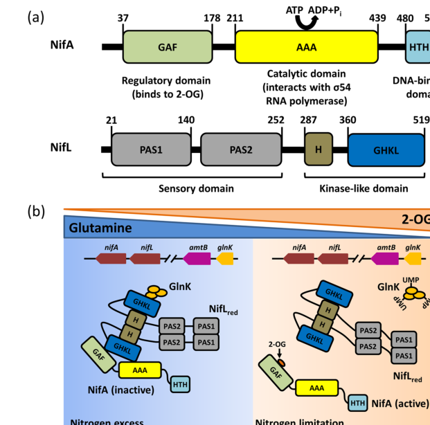

## Question

# PANTHER Family Research

## Family Context

- **Family ID:** PTHR32071
- **Family Name:** {'name': 'Sigma-54-dependent transcriptional regulators', 'short': 'Sigma54_dep_trans_reg'}
- **InterPro Entry:** None
- **Root Node:** 
- **Number of Subfamilies:** 0

### Subfamily Summary

No subfamily information available.

---

## Research Objective

This is a PANTHER protein family that may contain subfamilies with divergent functions. Your task is to investigate the evolutionary relationships and functional diversity within this family, with particular attention to:

1. **Neo-functionalization**: Have any subfamilies evolved new functions distinct from the ancestral function?
2. **Subfunctionalization**: Have subfamilies specialized for different substrates, cellular contexts, or organisms?
3. **GO annotation accuracy**: Are the GO annotations propagated from ancestral nodes appropriate for all descendants?

## Research Questions

### 1. Family Function Overview

For this protein family:
- What is the common structural fold shared by family members?
- What is the ancestral/core function of this family?
- What cofactors, substrates, or binding partners are typical?
- What are the key catalytic/functional residues?

### 2. Subfamily Functional Diversity

For each major subfamily:
- What is the specific function of proteins in this subfamily?
- Does this function differ from the ancestral function?
- What is the EC number (if enzymatic)?
- What experimental evidence supports this function?

### 3. Neo-functionalization Detection

Look for signs of functional divergence:
- Are there subfamilies with different EC numbers within the family?
- Are there subfamilies that catalyze opposite reactions (e.g., synthesis vs degradation)?
- Are there subfamilies with different substrate specificities?
- Do any subfamilies have non-catalytic functions (e.g., structural, regulatory)?

### 4. Branch Length Analysis

Consider the evolutionary divergence:
- Which subfamilies have the longest branch lengths from the root?
- Do longer branches correlate with functional changes?
- Are there any very short branches that might be recent duplications?

### 5. GO Annotation Assessment

For GO annotations propagated across the family:
- Are these annotations appropriate for ALL subfamilies?
- Should any subfamilies have different/opposite annotations?
- Are there subfamilies that should be excluded from certain annotations?
- What subfamily-specific annotations should be added?

### 6. Literature Support

- What are the key papers describing this protein family?
- Are there papers specifically about functional divergence within the family?
- Are there structural biology papers showing differences between subfamilies?
- Are there biochemical studies comparing activities of different family members?

## Output Format

Please provide your findings in a narrative format with citations. Structure your response as:

1. **Executive Summary** - Brief overview of family diversity and key findings
2. **Ancestral Function** - What the common ancestor likely did
3. **Subfamily Analysis** - Function of each major subfamily with evidence
4. **Functional Divergence** - Cases of neo-functionalization or subfunctionalization
5. **GO Annotation Issues** - Problematic annotations and recommendations
6. **Key Literature** - Citations supporting the analysis

Be sure to include citations (PMIDs) for all statements.

## Output

Question: You are an expert researcher providing comprehensive, well-cited information.

Provide detailed information focusing on:
1. Key concepts and definitions with current understanding
2. Recent developments and latest research (prioritize 2023-2024 sources)
3. Current applications and real-world implementations
4. Expert opinions and analysis from authoritative sources
5. Relevant statistics and data from recent studies

Format as a comprehensive research report with proper citations. Include URLs and publication dates where available.
Always prioritize recent, authoritative sources and provide specific citations for all major claims.

# PANTHER Family Research

## Family Context

- **Family ID:** PTHR32071
- **Family Name:** {'name': 'Sigma-54-dependent transcriptional regulators', 'short': 'Sigma54_dep_trans_reg'}
- **InterPro Entry:** None
- **Root Node:** 
- **Number of Subfamilies:** 0

### Subfamily Summary

No subfamily information available.

---

## Research Objective

This is a PANTHER protein family that may contain subfamilies with divergent functions. Your task is to investigate the evolutionary relationships and functional diversity within this family, with particular attention to:

1. **Neo-functionalization**: Have any subfamilies evolved new functions distinct from the ancestral function?
2. **Subfunctionalization**: Have subfamilies specialized for different substrates, cellular contexts, or organisms?
3. **GO annotation accuracy**: Are the GO annotations propagated from ancestral nodes appropriate for all descendants?

## Research Questions

### 1. Family Function Overview

For this protein family:
- What is the common structural fold shared by family members?
- What is the ancestral/core function of this family?
- What cofactors, substrates, or binding partners are typical?
- What are the key catalytic/functional residues?

### 2. Subfamily Functional Diversity

For each major subfamily:
- What is the specific function of proteins in this subfamily?
- Does this function differ from the ancestral function?
- What is the EC number (if enzymatic)?
- What experimental evidence supports this function?

### 3. Neo-functionalization Detection

Look for signs of functional divergence:
- Are there subfamilies with different EC numbers within the family?
- Are there subfamilies that catalyze opposite reactions (e.g., synthesis vs degradation)?
- Are there subfamilies with different substrate specificities?
- Do any subfamilies have non-catalytic functions (e.g., structural, regulatory)?

### 4. Branch Length Analysis

Consider the evolutionary divergence:
- Which subfamilies have the longest branch lengths from the root?
- Do longer branches correlate with functional changes?
- Are there any very short branches that might be recent duplications?

### 5. GO Annotation Assessment

For GO annotations propagated across the family:
- Are these annotations appropriate for ALL subfamilies?
- Should any subfamilies have different/opposite annotations?
- Are there subfamilies that should be excluded from certain annotations?
- What subfamily-specific annotations should be added?

### 6. Literature Support

- What are the key papers describing this protein family?
- Are there papers specifically about functional divergence within the family?
- Are there structural biology papers showing differences between subfamilies?
- Are there biochemical studies comparing activities of different family members?

## Output Format

Please provide your findings in a narrative format with citations. Structure your response as:

1. **Executive Summary** - Brief overview of family diversity and key findings
2. **Ancestral Function** - What the common ancestor likely did
3. **Subfamily Analysis** - Function of each major subfamily with evidence
4. **Functional Divergence** - Cases of neo-functionalization or subfunctionalization
5. **GO Annotation Issues** - Problematic annotations and recommendations
6. **Key Literature** - Citations supporting the analysis

Be sure to include citations (PMIDs) for all statements.

## PANTHER Family PTHR32071 Research Report (Sigma-54–dependent transcriptional regulators)

### 1. Executive Summary
PANTHER family **PTHR32071** (“Sigma-54-dependent transcriptional regulators”) corresponds to bacterial **σ54 (RpoN)-dependent enhancer-binding proteins (bEBPs)**: modular transcriptional regulators that use a conserved **central AAA+ ATPase** to remodel the **σ54–RNA polymerase (RNAP)** closed complex into a transcriptionally competent open complex. Across bacteria, this family shows substantial functional diversity driven primarily by **N-terminal regulatory/sensory domains and domain fusions** (e.g., GAF sensing, two-component receiver domains, PTS/PRD phosphorylation modules), while retaining a conserved σ54-activation core. Recent 2023–2024 studies highlight: (i) conserved σ54 promoter-recognition features and the requirement for ATP-dependent remodeling by bEBPs, (ii) distinct regulatory inputs that “wire” the same σ54-activation machinery into different physiological processes (nitrogen fixation, motility/biofilm switching, RNA repair, sugar utilization), and (iii) cases where bEBPs adopt **noncanonical promoter engagement** modes, complicating blanket GO propagation. (zhang2023molecularmechanismand pages 4-6, busby2024transcriptionactivationin pages 10-12, oladosu2024fliptheswitch pages 3-4, kurasz2023strainspecificgifsy1prophage pages 1-2, zhang2024transcriptionalregulationof pages 8-9)

A schematic of canonical σ54 activation and NifA regulatory architecture is available from a 2023 review and is useful as a reference model for the family’s ancestral mechanism. (zhang2023molecularmechanismand media 74af9881, zhang2023molecularmechanismand media 33277f8b)

| Representative regulator | Organism/context | Domain architecture / regulatory inputs | Primary regulated process | Evidence type | Key citations |
|---|---|---|---|---|---|
| NifA / NifL | Diazotroph nitrogen-fixation systems; exemplar *Azotobacter vinelandii* | Canonical bEBP architecture with N-terminal GAF regulatory domain, central AAA+ ATPase, and C-terminal HTH DNA-binding domain; ligand/redox/nitrogen-status control via NifL and GlnK; activation requires oligomerization and σ54-RNAP remodeling through the AAA+ domain and GAFTGA-containing loop system (zhang2023molecularmechanismand pages 4-6, zhang2023molecularmechanismand media 74af9881) | Activation of *nif* gene transcription for biological nitrogen fixation | 2023 mechanistic review with structural synthesis and model figures | Zhang et al., 2023, *Int J Mol Sci* 24:907, doi:10.3390/ijms24020907, https://doi.org/10.3390/ijms24020907 (zhang2023molecularmechanismand pages 4-6, zhang2023molecularmechanismand media 74af9881) |
| FleQ | *Pseudomonas aeruginosa* transition between planktonic and biofilm lifestyles | NtrC/NifA-type σ54-dependent bEBP with central AAA+ ATPase; output switched by intracellular c-di-GMP and modulated by FleN; supports both canonical enhancer-dependent activation and a noncanonical promoter-proximal/downstream activation mode at different targets (oladosu2024fliptheswitch pages 3-4, oladosu2024fliptheswitch pages 1-3) | Inverse regulation of flagellar genes vs biofilm/exopolysaccharide loci (*pel*, *psl*, *cdrAB*) | 2024 review integrating prior genetic, promoter-fusion, and mechanistic studies | Oladosu et al., 2024, *J Bacteriol* 206(3), doi:10.1128/jb.00365-23, https://doi.org/10.1128/jb.00365-23 (oladosu2024fliptheswitch pages 3-4, oladosu2024fliptheswitch pages 1-3) |
| RtcR | *Salmonella enterica* serovar Typhimurium 14028s RNA repair/SOS-response context | Typical bEBP organization with N-terminal regulatory domain, central AAA+ ATPase, and C-terminal DNA-binding domain; activated by an oligoribonucleotide bearing a 3'-terminal 2',3'-cyclic phosphate; activation depends on RecA-controlled SOS signaling, Fis, and a strain-specific Gifsy-1 prophage region (STM14_3218-3220) (kurasz2023strainspecificgifsy1prophage pages 1-2) | σ54-dependent expression of the *rsr-yrlBA-rtcBA* RNA repair operon and linked stress-response functions | 2023 experimental genetics: genome-wide mutant screen, deletion mapping, prophage-cured strains | Kurasz et al., 2023, *J Bacteriol* 205(1), doi:10.1128/jb.00262-22, https://doi.org/10.1128/jb.00262-22 (kurasz2023strainspecificgifsy1prophage pages 1-2) |
| CelR | *Bacillus thuringiensis* cellobiose utilization / carbon catabolite control | PRD-containing σ54-dependent activator with HTH-AAA+ core plus two PRD domains separated by EIIAMan- and EIIBGat-like PTS domains; activity tuned by PTS-linked phosphorylation, with His-546 and Cys-682 stimulating and His-839 inhibiting activity; glucose repression reinforced by CcpA (zhang2024transcriptionalregulationof pages 1-2, zhang2024transcriptionalregulationof pages 8-9) | Positive control of the *cel* operon for cellobiose transport and catabolism | 2024 mutagenesis, promoter-binding, β-galactosidase, and operon-function analysis | Zhang et al., 2024, *Front Microbiol* 15, doi:10.3389/fmicb.2024.1160472, https://doi.org/10.3389/fmicb.2024.1160472 (zhang2024transcriptionalregulationof pages 1-2, zhang2024transcriptionalregulationof pages 8-9) |

*Table: This table summarizes representative functional subgroups within sigma-54-dependent transcriptional regulators, emphasizing how shared AAA+ transcription-activation machinery has diversified through different sensory and regulatory domain architectures. It is useful for comparing likely subfamily-level specialization and for judging which annotations are family-wide versus subgroup-specific.*

**Limitations:** Because only limited PANTHER-specific phylogenetic outputs (subfamilies, branch lengths, ancestral node annotations) were provided and no InterPro entry was linked, this report infers “subfamilies” as **major functional/architectural subgroups** supported by recent literature rather than PANTHER-defined clades.

### 2. Key Concepts and Definitions (current understanding)
**σ54 (RpoN) system.** σ54 is unusual among σ factors in that RNAP–σ54 can bind promoters but is **blocked in forming a transcription bubble**; activation typically requires specialized ATPases (bEBPs). σ54 has **three regions (RI, RII, RIII)**, a conserved **RpoN box** for -24 element recognition, and an **ELH-HTH module** involved in -12 recognition and initiation of DNA melting; σ54 RI can occlude this region, necessitating activator-driven remodeling. (busby2024transcriptionactivationin pages 10-12)

**bEBPs (σ54-dependent transcriptional regulators).** bEBPs provide **AAA+ ATPase domains** that use ATP hydrolysis to remodel the σ54–RNAP complex to permit DNA unwinding and initiation. bEBPs often bind DNA as multimers at upstream sites and reach RNAP by DNA looping; DNA bending factors such as IHF can facilitate this geometry. (busby2024transcriptionactivationin pages 10-12)

**Conserved σ54-contact motif (GAFTGA).** A conserved **GAFTGA** motif in the bEBP AAA+ domain is highlighted as central to interaction/communication with Eσ54 in mechanistic discussions (e.g., via PspF work referenced in recent studies). (zhang2023molecularmechanismand pages 4-6, surin2024identificationofcritical pages 21-22)

### 3. Ancestral/Core Function (what the common ancestor likely did)
The most parsimonious ancestral function for PTHR32071 is an **ATP-dependent σ54 transcriptional activation mechanism**: an AAA+ ATPase oligomer (often conceptualized as hexameric) contacts σ54 in the RNAP holoenzyme and, using ATP binding/hydrolysis, relieves σ54-imposed inhibition to allow open-complex formation and transcription initiation. This is described explicitly for NifA-like regulators and as a general mechanism for σ54 promoters. (zhang2023molecularmechanismand pages 4-6, busby2024transcriptionactivationin pages 10-12, zhang2023molecularmechanismand media 33277f8b)

A canonical model shows: bEBP binding to upstream activator sequences (UAS), oligomerization, and productive contact with σ54–RNAP to drive promoter opening. (zhang2023molecularmechanismand media 33277f8b)

### 4. Family Function Overview (domains/folds, partners, residues)
#### 4.1 Common structural fold and domain organization
Across representative family members, the shared “core” is a **central AAA+ ATPase domain**. Many bEBPs also have:
- **C-terminal HTH DNA-binding domains** (for UAS/promoter binding). (zhang2023molecularmechanismand pages 4-6, zhang2024transcriptionalregulationof pages 1-2)
- Variable **N-terminal regulatory domains**, which determine the environmental/physiological signals that gate AAA+ activation (e.g., **GAF** in NifA; receiver domains in NtrC-like regulators). (zhang2023molecularmechanismand pages 4-6, yadav2023combinedinsilico pages 2-4)

NifA exemplifies a widespread architecture: **N-terminal GAF regulatory domain + central AAA+ ATPase + C-terminal HTH**. (zhang2023molecularmechanismand pages 4-6, zhang2023molecularmechanismand media 74af9881)

#### 4.2 Ancestral/core partners and binding interactions
Core binding partners are:
- **σ54 (RpoN)** and the **σ54–RNAP holoenzyme**, which is remodeled by the bEBP AAA+ motor. (busby2024transcriptionactivationin pages 10-12)
- **Promoter DNA** at -24/-12 σ54 promoter elements; bEBPs typically bind UAS elements upstream, with loop-mediated contact to RNAP. (busby2024transcriptionactivationin pages 10-12, zhang2023molecularmechanismand media 33277f8b)
- **DNA-bending proteins** (often IHF) that facilitate looping at many σ54 promoters. (busby2024transcriptionactivationin pages 10-12)

#### 4.3 Key motifs/residues (what is supported in the retrieved 2023–2024 sources)
- **GAFTGA** motif in the AAA+ domain is consistently noted as conserved and functionally important for σ54 engagement/communication. (zhang2023molecularmechanismand pages 4-6, surin2024identificationofcritical pages 21-22)
- σ54 has conserved promoter-recognition features including the **RpoN box** and structural modules relevant to activation (RI/RII/RIII; ELH-HTH). (busby2024transcriptionactivationin pages 10-12)

**Note on Walker motifs/catalytic residues:** Although Walker A/B are canonical for AAA+ ATPases, the retrieved evidence set did not provide a direct residue-level description of Walker A/B sequences for these regulators. Consequently, this report does not assert specific Walker A/B residues beyond what is explicitly provided in-source.

### 5. Subfamily (major subgroup) Functional Diversity and Evidence
Because PANTHER lists no subfamilies, “major subfamilies” below are defined by **domain architecture + regulatory input + physiological output**, which are the dominant drivers of functional specialization.

#### 5.1 GAF-regulated NifA-like activators (nitrogen fixation)
**Function:** σ54-dependent activation of nif genes for nitrogen fixation; NifA activity is gated by regulatory partners responsive to redox/energy/nitrogen state. (zhang2023molecularmechanismand pages 4-6)

**Regulatory inputs:** NifA contains an N-terminal **GAF** domain; ligand binding and interactions with **NifL** (and **GlnK** in ternary complexes) modulate the ability of the AAA+ domains to assemble/activate. (zhang2023molecularmechanismand pages 4-6, zhang2023molecularmechanismand media 74af9881)

**Experimental/structural synthesis (recent):** A 2023 review integrates structural observations such as dimeric GAF arrangements and proposes how ligand binding relieves repression of AAA+ assembly, supporting a mechanistic basis for signal-to-ATPase coupling. (zhang2023molecularmechanismand pages 4-6)

**Application:** The NifA–NifL system is discussed in the context of agricultural application of biological nitrogen fixation. (zhang2023molecularmechanismand pages 4-6)

#### 5.2 FleQ-like regulators (lifestyle switching; motility vs biofilm)
**Function:** FleQ is a σ54-dependent bEBP at the top of the flagellar regulatory hierarchy in *Pseudomonas aeruginosa* and inversely regulates flagellar genes and biofilm-associated loci. (oladosu2024fliptheswitch pages 1-3)

**Key mechanistic features (2024):**
- FleQ uses the conserved bEBP mechanism requiring **ATPase activity** to remodel σ54–RNAP from closed to open complexes. (oladosu2024fliptheswitch pages 3-4)
- It displays **two σ54-dependent activation modes**: a canonical enhancer-dependent mode (e.g., at *fleSR*) and a noncanonical mode where FleQ binds **downstream/adjacent to the RNAP site**, likely allowing more direct RNAP contact. (oladosu2024fliptheswitch pages 3-4)

**Regulatory inputs and functional outcomes:** Intracellular **c-di-GMP** levels switch FleQ output: flagellar genes tend to be activated at low c-di-GMP and repressed at high c-di-GMP, while biofilm-related loci (e.g., *pel*, *psl*, *cdrAB*) show the opposite trend; FleN modulates FleQ function as an anti-activator. (oladosu2024fliptheswitch pages 3-4)

**Real-world implementation:** This regulatory switch is directly relevant to chronic infections/biofilms, as the review frames FleQ as contributing to planktonic vs sessile growth transitions in an opportunistic pathogen. (oladosu2024fliptheswitch pages 3-4)

#### 5.3 RtcR-like regulators (RNA repair operons; SOS/prophage-coupled activation)
**Function:** In *Salmonella enterica* Typhimurium 14028s, the bEBP **RtcR** drives σ54-dependent expression of the **rsr-yrlBA-rtcBA** RNA repair operon and also controls a downstream toxin–antitoxin module. (kurasz2023strainspecificgifsy1prophage pages 1-2)

**Activation signal and pathway (2023 primary study):**
- The activating signal is an **oligoribonucleotide with a 3′-terminal 2′,3′-cyclic phosphate**. (kurasz2023strainspecificgifsy1prophage pages 1-2)
- Signal generation depends on a **RecA-controlled SOS response** and specifically requires induction of prophage **Gifsy-1**; a **three-gene Gifsy-1 region (STM14_3218–3220)** is required for activation in strain 14028s. (kurasz2023strainspecificgifsy1prophage pages 1-2)

**Implication for subfunctionalization:** This illustrates specialization for a distinct ligand/signal (cyclic-phosphate oligoribonucleotide) and a strain-specific prophage dependency, indicating that “σ54 activator activity” is conserved while upstream regulatory wiring can be highly lineage- and context-specific. (kurasz2023strainspecificgifsy1prophage pages 1-2)

#### 5.4 PRD/PTS-regulated activators (carbohydrate utilization; Bacilli)
**Function:** In *Bacillus thuringiensis*, **CelR** is a PRD-domain containing σ54-dependent activator that positively regulates the **cel** operon for cellobiose transport/utilization. (zhang2024transcriptionalregulationof pages 1-2)

**Domain fusion / modularity:** CelR has a HTH-AAA+ core plus **PRD1/PRD2** and inserted **PTS-like EIIA/EIIB** domains, consistent with specialization to carbon-source/PTS signaling. (zhang2024transcriptionalregulationof pages 1-2)

**Residue-level functional data (2024):** Mutational analysis supports multiple phosphorylation-controlled sites with distinct effects:
- **His-546 (EIIAMan)** and **Cys-682 (EIIBGat)** promote activity (mutations decrease cel transcription/activity).
- **His-839 (PRD2)** is inhibitory (mutation increases transcription/activity). (zhang2024transcriptionalregulationof pages 1-2, zhang2024transcriptionalregulationof pages 8-9)

**Application:** The study frames cellobiose utilization and metabolic traits as relevant to *B. thuringiensis* fermentation and environmental adaptation, linking σ54-bEBP regulation to industrially relevant phenotypes. (zhang2024transcriptionalregulationof pages 1-2)

### 6. Functional Divergence: Neo-functionalization vs Subfunctionalization
#### 6.1 Predominant pattern: subfunctionalization via regulatory input/output rewiring
Across the surveyed examples, the conserved AAA+ σ54-remodeling mechanism is retained, but different members specialize in:
- **Distinct sensory inputs** (GAF ligand/redox/nitrogen state; c-di-GMP; PTS phosphorylation; oligoribonucleotide cyclic phosphate signals). (zhang2023molecularmechanismand pages 4-6, oladosu2024fliptheswitch pages 3-4, kurasz2023strainspecificgifsy1prophage pages 1-2, zhang2024transcriptionalregulationof pages 8-9)
- **Distinct biological processes** (nitrogen fixation, motility/biofilm, RNA repair, sugar metabolism). (zhang2023molecularmechanismand pages 4-6, oladosu2024fliptheswitch pages 3-4, kurasz2023strainspecificgifsy1prophage pages 1-2, zhang2024transcriptionalregulationof pages 1-2)

This is best interpreted as **subfunctionalization** at the level of regulon/physiology rather than changes to the core enzymatic activity.

#### 6.2 Possible neo-functionalization signals (mechanistic novelty)
The FleQ review highlights **noncanonical promoter engagement** (downstream binding adjacent to RNAP) while still functioning as a σ54-dependent activator. This suggests mechanistic divergence in *how* the activator contacts the transcription machinery at certain promoters, which can be considered a form of **neo-functionalization of regulatory mechanism** (without changing the underlying ATPase→σ54 remodeling role). (oladosu2024fliptheswitch pages 3-4)

### 7. GO Annotation Accuracy Assessment and Recommendations
#### 7.1 Likely safe family-wide molecular-function annotations
Based on σ54 system descriptions and bEBP mechanism:
- **ATP hydrolysis-coupled transcription regulation at σ54-dependent promoters** is broadly appropriate, because σ54 promoters require an ATP-driven activator AAA+ domain to relieve σ54-imposed inhibition and enable open complex formation. (busby2024transcriptionactivationin pages 10-12, zhang2023molecularmechanismand pages 4-6)

**Recommendation:** Propagation of general MF terms analogous to “ATPase activity (AAA+ family)” and “σ54-dependent transcriptional activator activity” is reasonable across the family when the central AAA+ domain is intact and the protein is clearly a σ54-bEBP.

#### 7.2 Biological-process annotations should be subgroup-specific
The evidence shows that biological processes are highly specialized:
- **Nitrogen fixation / nif transcription** is specific to NifA-like regulators. (zhang2023molecularmechanismand pages 4-6)
- **Flagellar gene regulation and biofilm-related exopolysaccharide regulation** are specific to FleQ-like regulators. (oladosu2024fliptheswitch pages 3-4, oladosu2024fliptheswitch pages 1-3)
- **RNA repair operon regulation / SOS coupling** is specific to RtcR-like regulators. (kurasz2023strainspecificgifsy1prophage pages 1-2)
- **Cellobiose utilization / PTS-linked carbon catabolite regulation** is specific to CelR-like PRD regulators. (zhang2024transcriptionalregulationof pages 1-2, zhang2024transcriptionalregulationof pages 8-9)

**Recommendation:** Avoid propagating any of these specific BP annotations from an ancestral node to all descendants. Instead, constrain such annotations to clades/ortholog groups with demonstrated domain architecture and experimental support.

#### 7.3 Cautionary note: “enhancer-binding” and promoter architecture terms
While σ54 activators are often described as enhancer-binding proteins, FleQ can act in a promoter-proximal/downstream mode at some targets. (oladosu2024fliptheswitch pages 3-4) Therefore, annotations implying mandatory **upstream enhancer-dependent looping** should be applied carefully or qualified.

### 8. Branch Length / Phylogenetic Divergence (what can be said with current inputs)
No PANTHER subfamily nodes or branch lengths were provided (and the family is reported to have 0 subfamilies). Therefore, **branch-length-based claims (longest/shortest branches, correlation with function)** cannot be supported from the available evidence set.

### 9. Current Applications and Real-World Implementations (2023–2024 emphasis)
- **Agriculture / nitrogen management:** NifA–NifL regulation is explicitly discussed in the context of integrating biological nitrogen fixation into agriculture, positioning σ54-bEBP control as an actionable lever in nitrogen-fixation engineering. (Published Jan 2023; https://doi.org/10.3390/ijms24020907) (zhang2023molecularmechanismand pages 4-6)
- **Infection biology / biofilms:** FleQ-mediated switching between planktonic and sessile modes in *P. aeruginosa* links σ54-bEBP regulation to biofilm-associated chronic infection phenotypes. (Published Mar 2024; https://doi.org/10.1128/jb.00365-23) (oladosu2024fliptheswitch pages 3-4)
- **Industrial/biotech microbiology:** CelR control of the *cel* operon in *B. thuringiensis* is tied to nutrient utilization important for fermentation and environmental adaptation. (Published Jan 2024; https://doi.org/10.3389/fmicb.2024.1160472) (zhang2024transcriptionalregulationof pages 1-2)
- **Genome defense/stress physiology:** RtcR-dependent activation of RNA repair operons during SOS response illustrates σ54-bEBPs as nodes coupling DNA damage responses, prophage genetic variation, and RNA repair. (Published Jan 2023; https://doi.org/10.1128/jb.00262-22) (kurasz2023strainspecificgifsy1prophage pages 1-2)

### 10. Relevant Statistics and Data (from recent studies in this evidence set)
- **CelR phosphorylation-site mutations with directional effects:** His-546A and Cys-682 mutations decrease activity/transcription; His-839A increases activity/transcription, consistent with multi-site PTS/PRD regulatory logic. (zhang2024transcriptionalregulationof pages 8-9)
- **RtcR activation depends on a specific prophage locus:** a three-gene Gifsy-1 region (STM14_3218–3220) is required for RtcR activation in *S. Typhimurium* 14028s. (kurasz2023strainspecificgifsy1prophage pages 1-2)
- **PehR (bEBP-like regulator) basic protein statistics:** predicted 570 aa length, ~61.6 kDa, pI ~6.54, and predicted receiver–AAA+–HTH architecture, providing an example of typical bEBP-like modularity and properties. (Published Sep 2023; https://doi.org/10.1021/acsomega.3c03175) (yadav2023combinedinsilico pages 2-4)

### 11. Key Literature (2023–2024 prioritized; URLs and dates)
1. **Zhang W. et al.** “Molecular Mechanism and Agricultural Application of the NifA–NifL System for Nitrogen Fixation.” *Int J Mol Sci* (Jan 2023). https://doi.org/10.3390/ijms24020907 (zhang2023molecularmechanismand pages 4-6, zhang2023molecularmechanismand media 74af9881, zhang2023molecularmechanismand media 33277f8b)
2. **Oladosu V.I. et al.** “Flip the switch: the role of FleQ…” *J Bacteriol* (Mar 2024). https://doi.org/10.1128/jb.00365-23 (oladosu2024fliptheswitch pages 3-4, oladosu2024fliptheswitch pages 1-3)
3. **Kurasz J.E. et al.** “Strain-Specific Gifsy-1 Prophage Genes…” *J Bacteriol* (Jan 2023). https://doi.org/10.1128/jb.00262-22 (kurasz2023strainspecificgifsy1prophage pages 1-2)
4. **Zhang L. et al.** “Transcriptional regulation of cellobiose utilization…” *Front Microbiol* (Jan 2024). https://doi.org/10.3389/fmicb.2024.1160472 (zhang2024transcriptionalregulationof pages 1-2, zhang2024transcriptionalregulationof pages 8-9)
5. **Busby S.J.W. & Browning D.F.** “Transcription activation in *E. coli* and *Salmonella*.” *EcoSal Plus* (Dec 2024). https://doi.org/10.1128/ecosalplus.esp-0039-2020 (busby2024transcriptionactivationin pages 10-12)

### 12. Notes on PMIDs
The retrieved full-text evidence in this run provided DOIs/URLs but did not expose PMIDs in the extracted snippets. Consequently, PMIDs cannot be reliably reported here without additional database-specific retrieval.

References

1. (zhang2023molecularmechanismand pages 4-6): Wenyao Zhang, Yihang Chen, Keyang Huang, Feng Wang, and Ziqing Mei. Molecular mechanism and agricultural application of the nifa–nifl system for nitrogen fixation. International Journal of Molecular Sciences, 24:907, Jan 2023. URL: https://doi.org/10.3390/ijms24020907, doi:10.3390/ijms24020907. This article has 75 citations.

2. (busby2024transcriptionactivationin pages 10-12): Stephen J. W. Busby and Douglas F. Browning. Transcription activation in <i>escherichia coli</i> and <i>salmonella</i>. EcoSal Plus, Dec 2024. URL: https://doi.org/10.1128/ecosalplus.esp-0039-2020, doi:10.1128/ecosalplus.esp-0039-2020. This article has 15 citations.

3. (oladosu2024fliptheswitch pages 3-4): Victoria I. Oladosu, Soyoung Park, and Karin Sauer. Flip the switch: the role of fleq in modulating the transition between the free-living and sessile mode of growth in <i>pseudomonas aeruginosa</i>. Journal of Bacteriology, Mar 2024. URL: https://doi.org/10.1128/jb.00365-23, doi:10.1128/jb.00365-23. This article has 27 citations and is from a peer-reviewed journal.

4. (kurasz2023strainspecificgifsy1prophage pages 1-2): Jennifer E. Kurasz, Madison C. Crawford, Steffen Porwollik, Oliver Gregory, Katerina R. Tadlock, Eve C. Balding, Emily E. Weinert, Michael McClelland, and Anna C. Karls. Strain-specific gifsy-1 prophage genes are determinants for expression of the rna repair operon during the sos response in salmonella enterica serovar typhimurium. Journal of Bacteriology, Jan 2023. URL: https://doi.org/10.1128/jb.00262-22, doi:10.1128/jb.00262-22. This article has 7 citations and is from a peer-reviewed journal.

5. (zhang2024transcriptionalregulationof pages 8-9): Liangwei Zhang, Hong Xu, Haijian Cheng, Fuping Song, Jie Zhang, and Qi Peng. Transcriptional regulation of cellobiose utilization by prd-domain containing sigma54-dependent transcriptional activator (celr) and catabolite control protein a (ccpa) in bacillus thuringiensis. Frontiers in Microbiology, Jan 2024. URL: https://doi.org/10.3389/fmicb.2024.1160472, doi:10.3389/fmicb.2024.1160472. This article has 4 citations and is from a peer-reviewed journal.

6. (zhang2023molecularmechanismand media 74af9881): Wenyao Zhang, Yihang Chen, Keyang Huang, Feng Wang, and Ziqing Mei. Molecular mechanism and agricultural application of the nifa–nifl system for nitrogen fixation. International Journal of Molecular Sciences, 24:907, Jan 2023. URL: https://doi.org/10.3390/ijms24020907, doi:10.3390/ijms24020907. This article has 75 citations.

7. (zhang2023molecularmechanismand media 33277f8b): Wenyao Zhang, Yihang Chen, Keyang Huang, Feng Wang, and Ziqing Mei. Molecular mechanism and agricultural application of the nifa–nifl system for nitrogen fixation. International Journal of Molecular Sciences, 24:907, Jan 2023. URL: https://doi.org/10.3390/ijms24020907, doi:10.3390/ijms24020907. This article has 75 citations.

8. (oladosu2024fliptheswitch pages 1-3): Victoria I. Oladosu, Soyoung Park, and Karin Sauer. Flip the switch: the role of fleq in modulating the transition between the free-living and sessile mode of growth in <i>pseudomonas aeruginosa</i>. Journal of Bacteriology, Mar 2024. URL: https://doi.org/10.1128/jb.00365-23, doi:10.1128/jb.00365-23. This article has 27 citations and is from a peer-reviewed journal.

9. (zhang2024transcriptionalregulationof pages 1-2): Liangwei Zhang, Hong Xu, Haijian Cheng, Fuping Song, Jie Zhang, and Qi Peng. Transcriptional regulation of cellobiose utilization by prd-domain containing sigma54-dependent transcriptional activator (celr) and catabolite control protein a (ccpa) in bacillus thuringiensis. Frontiers in Microbiology, Jan 2024. URL: https://doi.org/10.3389/fmicb.2024.1160472, doi:10.3389/fmicb.2024.1160472. This article has 4 citations and is from a peer-reviewed journal.

10. (surin2024identificationofcritical pages 21-22): Shradha Surin, Richa Singh, Manpreet Kaur, Gourab Basu Choudhury, Himanshu Sen, Chetna Dureja, Saumen Datta, and Saumya Raychaudhuri. Identification of critical amino acids in the dna binding domain of luxo: lessons from a constitutive active luxo. PLOS ONE, 19:e0310444, Sep 2024. URL: https://doi.org/10.1371/journal.pone.0310444, doi:10.1371/journal.pone.0310444. This article has 2 citations and is from a peer-reviewed journal.

11. (yadav2023combinedinsilico pages 2-4): Mohit Yadav, Sharmilee Sarkar, Kaushika Olymon, Suvendra Kumar Ray, and Aditya Kumar. Combined in silico and in vitro study to reveal the structural insights and nucleotide-binding ability of the transcriptional regulator pehr from the phytopathogen ralstonia solanacearum. ACS Omega, 8:34499-34515, Sep 2023. URL: https://doi.org/10.1021/acsomega.3c03175, doi:10.1021/acsomega.3c03175. This article has 7 citations and is from a peer-reviewed journal.

## Artifacts

- [Edison artifact artifact-00](PTHR32071-deep-research-falcon_artifacts/artifact-00.md)

## Citations

1. busby2024transcriptionactivationin pages 10-12
2. zhang2023molecularmechanismand pages 4-6
3. oladosu2024fliptheswitch pages 1-3
4. oladosu2024fliptheswitch pages 3-4
5. zhang2024transcriptionalregulationof pages 1-2
6. zhang2024transcriptionalregulationof pages 8-9
7. yadav2023combinedinsilico pages 2-4
8. surin2024identificationofcritical pages 21-22
9. https://doi.org/10.3390/ijms24020907
10. https://doi.org/10.1128/jb.00365-23
11. https://doi.org/10.1128/jb.00262-22
12. https://doi.org/10.3389/fmicb.2024.1160472
13. https://doi.org/10.1021/acsomega.3c03175
14. https://doi.org/10.1128/ecosalplus.esp-0039-2020
15. https://doi.org/10.3390/ijms24020907,
16. https://doi.org/10.1128/ecosalplus.esp-0039-2020,
17. https://doi.org/10.1128/jb.00365-23,
18. https://doi.org/10.1128/jb.00262-22,
19. https://doi.org/10.3389/fmicb.2024.1160472,
20. https://doi.org/10.1371/journal.pone.0310444,
21. https://doi.org/10.1021/acsomega.3c03175,