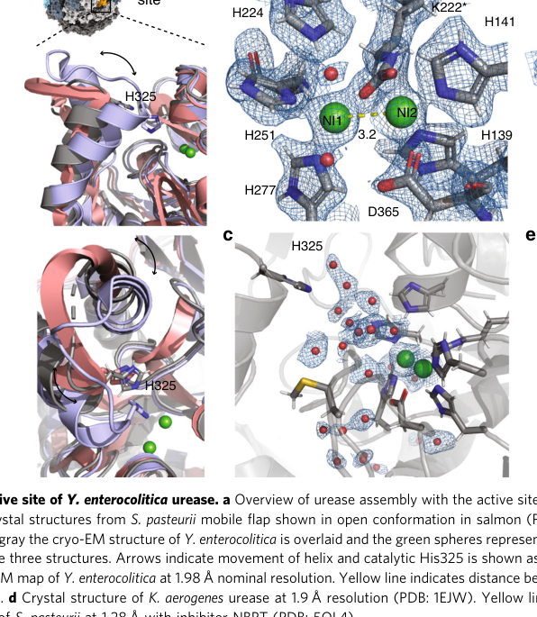

## Question

# PANTHER Family Research

## Family Context

- **Family ID:** PTHR43440
- **Family Name:** {'name': 'Urease Alpha Subunit', 'short': 'Urease_alpha_subunit'}
- **InterPro Entry:** IPR050112
- **Root Node:** 
- **Number of Subfamilies:** 0

### Subfamily Summary

No subfamily information available.

---

## Research Objective

This is a PANTHER protein family that may contain subfamilies with divergent functions. Your task is to investigate the evolutionary relationships and functional diversity within this family, with particular attention to:

1. **Neo-functionalization**: Have any subfamilies evolved new functions distinct from the ancestral function?
2. **Subfunctionalization**: Have subfamilies specialized for different substrates, cellular contexts, or organisms?
3. **GO annotation accuracy**: Are the GO annotations propagated from ancestral nodes appropriate for all descendants?

## Research Questions

### 1. Family Function Overview

For this protein family:
- What is the common structural fold shared by family members?
- What is the ancestral/core function of this family?
- What cofactors, substrates, or binding partners are typical?
- What are the key catalytic/functional residues?

### 2. Subfamily Functional Diversity

For each major subfamily:
- What is the specific function of proteins in this subfamily?
- Does this function differ from the ancestral function?
- What is the EC number (if enzymatic)?
- What experimental evidence supports this function?

### 3. Neo-functionalization Detection

Look for signs of functional divergence:
- Are there subfamilies with different EC numbers within the family?
- Are there subfamilies that catalyze opposite reactions (e.g., synthesis vs degradation)?
- Are there subfamilies with different substrate specificities?
- Do any subfamilies have non-catalytic functions (e.g., structural, regulatory)?

### 4. Branch Length Analysis

Consider the evolutionary divergence:
- Which subfamilies have the longest branch lengths from the root?
- Do longer branches correlate with functional changes?
- Are there any very short branches that might be recent duplications?

### 5. GO Annotation Assessment

For GO annotations propagated across the family:
- Are these annotations appropriate for ALL subfamilies?
- Should any subfamilies have different/opposite annotations?
- Are there subfamilies that should be excluded from certain annotations?
- What subfamily-specific annotations should be added?

### 6. Literature Support

- What are the key papers describing this protein family?
- Are there papers specifically about functional divergence within the family?
- Are there structural biology papers showing differences between subfamilies?
- Are there biochemical studies comparing activities of different family members?

## Output Format

Please provide your findings in a narrative format with citations. Structure your response as:

1. **Executive Summary** - Brief overview of family diversity and key findings
2. **Ancestral Function** - What the common ancestor likely did
3. **Subfamily Analysis** - Function of each major subfamily with evidence
4. **Functional Divergence** - Cases of neo-functionalization or subfunctionalization
5. **GO Annotation Issues** - Problematic annotations and recommendations
6. **Key Literature** - Citations supporting the analysis

Be sure to include citations (PMIDs) for all statements.

## Output

Question: You are an expert researcher providing comprehensive, well-cited information.

Provide detailed information focusing on:
1. Key concepts and definitions with current understanding
2. Recent developments and latest research (prioritize 2023-2024 sources)
3. Current applications and real-world implementations
4. Expert opinions and analysis from authoritative sources
5. Relevant statistics and data from recent studies

Format as a comprehensive research report with proper citations. Include URLs and publication dates where available.
Always prioritize recent, authoritative sources and provide specific citations for all major claims.

# PANTHER Family Research

## Family Context

- **Family ID:** PTHR43440
- **Family Name:** {'name': 'Urease Alpha Subunit', 'short': 'Urease_alpha_subunit'}
- **InterPro Entry:** IPR050112
- **Root Node:** 
- **Number of Subfamilies:** 0

### Subfamily Summary

No subfamily information available.

---

## Research Objective

This is a PANTHER protein family that may contain subfamilies with divergent functions. Your task is to investigate the evolutionary relationships and functional diversity within this family, with particular attention to:

1. **Neo-functionalization**: Have any subfamilies evolved new functions distinct from the ancestral function?
2. **Subfunctionalization**: Have subfamilies specialized for different substrates, cellular contexts, or organisms?
3. **GO annotation accuracy**: Are the GO annotations propagated from ancestral nodes appropriate for all descendants?

## Research Questions

### 1. Family Function Overview

For this protein family:
- What is the common structural fold shared by family members?
- What is the ancestral/core function of this family?
- What cofactors, substrates, or binding partners are typical?
- What are the key catalytic/functional residues?

### 2. Subfamily Functional Diversity

For each major subfamily:
- What is the specific function of proteins in this subfamily?
- Does this function differ from the ancestral function?
- What is the EC number (if enzymatic)?
- What experimental evidence supports this function?

### 3. Neo-functionalization Detection

Look for signs of functional divergence:
- Are there subfamilies with different EC numbers within the family?
- Are there subfamilies that catalyze opposite reactions (e.g., synthesis vs degradation)?
- Are there subfamilies with different substrate specificities?
- Do any subfamilies have non-catalytic functions (e.g., structural, regulatory)?

### 4. Branch Length Analysis

Consider the evolutionary divergence:
- Which subfamilies have the longest branch lengths from the root?
- Do longer branches correlate with functional changes?
- Are there any very short branches that might be recent duplications?

### 5. GO Annotation Assessment

For GO annotations propagated across the family:
- Are these annotations appropriate for ALL subfamilies?
- Should any subfamilies have different/opposite annotations?
- Are there subfamilies that should be excluded from certain annotations?
- What subfamily-specific annotations should be added?

### 6. Literature Support

- What are the key papers describing this protein family?
- Are there papers specifically about functional divergence within the family?
- Are there structural biology papers showing differences between subfamilies?
- Are there biochemical studies comparing activities of different family members?

## Output Format

Please provide your findings in a narrative format with citations. Structure your response as:

1. **Executive Summary** - Brief overview of family diversity and key findings
2. **Ancestral Function** - What the common ancestor likely did
3. **Subfamily Analysis** - Function of each major subfamily with evidence
4. **Functional Divergence** - Cases of neo-functionalization or subfunctionalization
5. **GO Annotation Issues** - Problematic annotations and recommendations
6. **Key Literature** - Citations supporting the analysis

Be sure to include citations (PMIDs) for all statements.

# PANTHER Family PTHR43440 (Urease alpha/large subunit): evolutionary and functional diversity report

## Executive Summary
PANTHER family PTHR43440 (InterPro IPR050112) corresponds to urease catalytic large/alpha subunits (commonly called **UreC** in many bacteria; nomenclature varies with subunit fusions). Canonical members catalyze **urea hydrolysis** (EC **3.5.1.5**) using a **dinuclear metallocenter** typically containing **two Ni(II) ions** bridged by a **carbamylated lysine** in the UreC active site. (hausinger2017ureaseactivation pages 1-3, nim2019thematurationpathway pages 1-3, righetto2020highresolutioncryoemstructure pages 1-2)

Despite strong conservation of catalytic architecture, multiple lines of evidence support functional diversification relevant to family-level annotation:

* **Neo-functionalization by metal-switching**: an **oxygen-labile iron-dependent urease paralog** (UreA2B2) in *Helicobacter mustelae* is expressed under **nickel restriction / iron supplementation**, has much lower specific activity than the nickel enzyme, and shows reduced dependence on canonical maturation proteins (proshlyakov2021ironcontainingureases. pages 2-4, proshlyakov2021ironcontainingureases. pages 1-2).
* **Substrate-spectrum broadening**: an “acid urease” from *Providencia rettgeri* shows measurable **ethyl carbamate (urethane) hydrolysis (“urethanase” side activity)** in addition to urease activity when expressed with urease accessory genes (liu2017expressionofan pages 1-2, liu2017expressionofan pages 7-9).
* **Subfunctionalization of maturation systems**: eukaryotic ureases (e.g., fungi) are nickel-dependent but **lack bacterial UreE** and appear to repurpose **UreG** for nickel delivery, cautioning against naive propagation of accessory-protein-related annotations (hausinger2017ureaseactivation pages 1-3, xiong2023ureaseofaspergillus pages 2-4, xiong2023ureaseofaspergillus pages 10-13).
* **Phylogeny suggests repeated acquisition/divergence**: UreC phylogenies in anammox bacteria show branches/clusters distinct from canonical urea-utilizing nitrifiers, consistent with **independent acquisition (HGT)** in some lineages (ganesh2018singlecellgenomic pages 8-9, zhao2020geochemicaltransitionzone pages 6-7).

Recent (2023–2024) research emphasizes urease’s real-world impact as a virulence and engineering-relevant enzyme and highlights intervention strategies, including nickel chelation and competitive inhibition by small molecules such as lactic acid (xiong2023ureaseofaspergillus pages 2-4, fitzgerald2024proteusmirabilisurer pages 1-2, szczerbiec2024antibacterialpropertiesand pages 5-7).

## 1. Key concepts and definitions (current understanding)

### 1.1 What is the urease alpha/large subunit (UreC)?
In many bacteria, urease is a heteromultimeric enzyme encoded by **three structural genes** (often **ureA/ureB/ureC** for γ/β/α subunits, respectively). The **active site resides in the α/large subunit (UreC)** (nim2019thematurationpathway pages 1-3, proshlyakov2021ironcontainingureases. pages 2-2). Taxa differ in gene architecture: some bacteria use fused subunits (e.g., *H. pylori*), and plants/fungi often have a single fused polypeptide corresponding to the three-subunit bacterial enzyme (hausinger2017ureaseactivation pages 1-3, nim2019thematurationpathway pages 1-3, righetto2020highresolutioncryoemstructure pages 1-2).

### 1.2 Core catalytic function and EC number
Canonical urease catalyzes **urea → ammonia + carbamate**, with carbamate spontaneously decomposing to bicarbonate + a second ammonia; this is the biochemical basis of **urea catabolism** and rapid pH elevation in host niches (EC **3.5.1.5**) (hausinger2017ureaseactivation pages 1-3, righetto2020highresolutioncryoemstructure pages 1-2).

### 1.3 Active-site architecture and cofactors
Across canonical ureases, the active site is a **dinuclear metallocenter** in UreC in which:

* **Two metal ions** (typically **Ni2+**) are bridged by a **carbamylated lysine** ligand (hausinger2017ureaseactivation pages 1-3, nim2019thematurationpathway pages 1-3).
* Metal coordination involves **four histidines and one aspartate** plus solvent ligands (nim2019thematurationpathway pages 1-3, righetto2020highresolutioncryoemstructure pages 1-2).
* A **bridging hydroxide/water** serves as the nucleophile during hydrolysis, and a **mobile flap** closes over the active site during catalysis (righetto2020highresolutioncryoemstructure pages 1-2, proshlyakov2021ironcontainingureases. pages 2-2).

A close-up structure of the dinuclear active site (including Ni1/Ni2 and carbamylated Lys) and the mobile flap in open/closed conformations is visible in the high-resolution cryo-EM study of *Yersinia enterocolitica* urease (righetto2020highresolutioncryoemstructure media 1d1b06dd).

### 1.4 Accessory proteins and maturation
In bacteria and archaea, urease is synthesized as an apoenzyme requiring post-translational activation involving **lysine carbamylation** and **metal insertion**. Canonical nickel urease activation typically requires **UreD (or UreH), UreE, UreF, and UreG**; nickel transfer follows a handoff (UreE → UreG → UreF/UreD → urease) regulated by **UreG GTP binding/hydrolysis** and multiprotein complexes (hausinger2017ureaseactivation pages 1-3, nim2019thematurationpathway pages 1-3).

## 2. Ancestral/core function (what the common ancestor likely did)
The most parsimonious ancestral function for PTHR43440 is **nickel-dependent urease catalysis** in which UreC housed the dinuclear active site that hydrolyzes urea, supported by high conservation of the metallocenter geometry (carbamylated Lys bridge; His/Asp ligands; solvent ligands) and the widespread occurrence of the UreD/E/F/G maturation module in prokaryotes (hausinger2017ureaseactivation pages 1-3, nim2019thematurationpathway pages 1-3).

## 3. Subfamily analysis (major clades/functional groupings supported by evidence)
PANTHER reports no formal subfamilies for PTHR43440; therefore, major “subfamily-like” groupings are presented here as **functionally meaningful clades** observed in the literature.

### 3.1 Canonical nickel ureases (most bacteria; many eukaryotic fusions)
**Function:** urea hydrolysis (EC 3.5.1.5).  
**Key residues/ligands:** carbamylated Lys bridge; His/His ligation on Ni-1; His/His/Asp on Ni-2; solvent ligands; mobile flap controlling access (hausinger2017ureaseactivation pages 1-3, proshlyakov2021ironcontainingureases. pages 2-2, righetto2020highresolutioncryoemstructure pages 1-2).  
**Evidence:** structural and mechanistic descriptions from reviews and cryo-EM (hausinger2017ureaseactivation pages 1-3, righetto2020highresolutioncryoemstructure pages 1-2).

### 3.2 Iron-containing ureases (metal-switch neo-functionalization)
**Function:** still urease-like urea hydrolysis, but with **Fe** instead of Ni and altered maturation dependencies.  
**Example:** *Helicobacter mustelae* UreA2B2.  
**Evidence:** Proshlyakov et al. describe two urease clusters in *H. mustelae* with differential metal regulation; purified UreA2B2 contains ~1.1 Fe per heterodimer, is oxygen-labile, has lower activity, and appears not to require UreG production in cells (proshlyakov2021ironcontainingureases. pages 2-4, proshlyakov2021ironcontainingureases. pages 1-2).  
**Quantitative data:** UreA2B2: 14 U mg−1; Km 1.6 mM; canonical nickel urease UreAB: 390 and 840 U mg−1 with Km 1.7 and 2.3 mM (proshlyakov2021ironcontainingureases. pages 2-4).

### 3.3 Acid-tolerant urease with urethanase side activity (substrate-spectrum subfunctionalization)
**Function:** canonical urease activity plus measurable hydrolysis of ethyl carbamate (urethane) in vitro; best interpreted as broadened substrate specificity rather than a distinct enzyme family function.  
**Example:** *Providencia rettgeri* JN-B815 urease (ureABC).  
**Evidence and quantitative data:** purified recombinant enzyme shows specific activities of 2.10 U/mg (urease) and 0.60 U/mg (urethanase); activities increased to 10.7 U/mg (urease) and 3.8 U/mg (urethanase) after renaturation/co-expression context (liu2017expressionofan pages 1-2, liu2017expressionofan pages 7-9).

### 3.4 Eukaryotic maturation lineages lacking UreE (maturation-system subfunctionalization)
**Function:** urease activity retained; maturation machinery differs.  
**Example:** fungal urease in *Aspergillus fumigatus*.  
**Evidence:** *A. fumigatus* lacks a UreE homolog; UreG may adopt nickel delivery functions, and UreD/F/G are required for urease function (xiong2023ureaseofaspergillus pages 2-4, xiong2023ureaseofaspergillus pages 10-13). 

## 4. Functional divergence: neo-functionalization and subfunctionalization

### 4.1 Neo-functionalization: metal cofactor substitution (Ni → Fe)
Iron-containing ureases provide a strong example of **neo-functionalization** within an overall conserved fold/mechanism: they maintain the urease-like dinuclear architecture but switch to **ferrous ions**, resulting in oxygen lability and a different dependence on maturation factors (proshlyakov2021ironcontainingureases. pages 1-2, proshlyakov2021ironcontainingureases. pages 2-4). This divergence directly impacts GO annotation propagation for “nickel ion binding” and “nickel-dependent urease maturation” (see Section 5).

### 4.2 Subfunctionalization: maturation pathway differences across domains of life
Bacteria/archaea commonly require UreD/E/F/G; in contrast, fungi/plants possess homologs of UreD/F/G but **lack UreE** and may use alternative nickel delivery logic (UreG N-terminal His-rich/HXH motifs) (hausinger2017ureaseactivation pages 1-3, xiong2023ureaseofaspergillus pages 2-4, xiong2023ureaseofaspergillus pages 10-13). This is a classic subfunctionalization of accessory pathway components rather than catalytic subunit function.

### 4.3 Substrate-spectrum broadening (urea plus ethyl carbamate)
The *P. rettgeri* case demonstrates that UreC-based ureases can acquire detectable activity toward non-urea substrates (ethyl carbamate) while still primarily functioning as ureases; docking suggests fewer stabilizing interactions and greater steric hindrance for ethyl carbamate compared with urea, consistent with lower activity (liu2017expressionofan pages 7-9).

### 4.4 Divergent phylogenetic placement and likely HGT in nitrogen-cycling specialists
UreC phylogenies in anammox systems show distinct branches and affiliations: ETNP *Scalindua* UreC clusters away from nitrifier UreC and exhibits patterns consistent with HGT (high similarity among ure genes across SAGs and recombination-associated features on contigs) (ganesh2018singlecellgenomic pages 8-9). In subsurface sediments, *Scalindua sediminis* UreC falls on a distinct branch separate from known urea-utilizing nitrifiers, also interpreted as independent acquisition (zhao2020geochemicaltransitionzone pages 6-7). While the catalytic residues are conserved, these observations caution against assuming identical ecological roles or metal usage without context.

## 5. GO annotation issues and recommendations

### 5.1 Summary of GO propagation risks
The strongest evidence supports propagating **urease catalytic activity** and **urea catabolic process** to UreC homologs that retain conserved metal-binding residues and occur in complete urease loci (nim2019thematurationpathway pages 1-3, xiong2023ureaseofaspergillus pages 2-4). The major risks arise when propagating **nickel-specific** terms and **maturation/accessory** terms:

* **Nickel-specific terms** (e.g., nickel ion binding) are not universally valid because **iron ureases exist** with conserved architecture but different metals and maturation requirements (proshlyakov2021ironcontainingureases. pages 1-2, proshlyakov2021ironcontainingureases. pages 2-4).
* **Maturation-related terms** (e.g., metallocenter insertion, GTPase activity) belong to accessory proteins (UreD/E/F/G) rather than UreC; UreG is a GTPase and nickel-transfer factor, but UreC is the recipient catalytic scaffold (hausinger2017ureaseactivation pages 1-3, nim2019thematurationpathway pages 1-3).

### 5.2 Recommendations table
The following artifact provides a structured set of recommended GO annotation rules.

| GO term (or category) | When appropriate | When NOT appropriate / caveats | Evidence/rationale | Example taxa/cases | Supporting citations |
|---|---|---|---|---|---|
| urease activity | Appropriate for bona fide catalytic large/alpha subunits (UreC or fused eukaryotic catalytic homologs) that retain the conserved active-site architecture and are experimentally shown or strongly inferred to hydrolyze urea. | Not appropriate for accessory proteins (UreD/UreE/UreF/UreG), regulators (e.g., UreR), nickel transporters, or incomplete/pseudogenized homologs lacking catalytic residues. Use caution for highly divergent hits without the carbamylated-Lys/His/Asp motif. | The catalytic site resides in the alpha/large subunit and contains the dinuclear metal center; deletion of the structural urease gene abolishes growth on urea in fungi, and canonical bacterial/plant ureases all place catalysis in the large/fused catalytic chain. | Canonical bacterial UreC; fungal catalytic urease subunit in *Aspergillus fumigatus*; fused plant ureases. | (hausinger2017ureaseactivation pages 1-3, nim2019thematurationpathway pages 1-3, xiong2023ureaseofaspergillus pages 2-4) |
| urea catabolic process | Appropriate when the encoded UreC is part of a functional urease system used for urea utilization or pH-altering ureolysis in vivo. | Avoid for accessory proteins alone, isolated nonfunctional homologs, or sequences in genomes where urease function is uncertain. If only biochemical activity is known in vitro, organism-level process annotation should be added cautiously. | Urease catalyzes urea breakdown to ammonia and carbamate/bicarbonate; loss of catalytic structural genes abolishes growth on urea as sole nitrogen source in tested systems. | *A. fumigatus* urease system; *Proteus mirabilis* urease in urinary tract; nitrifiers/anammox with bona fide urease operons. | (hausinger2017ureaseactivation pages 1-3, xiong2023ureaseofaspergillus pages 2-4, fitzgerald2024proteusmirabilisurer pages 1-2, zhao2020geochemicaltransitionzone pages 6-7) |
| nickel ion binding | Appropriate for canonical nickel urease alpha/large subunits with conserved dinuclear nickel center and supporting biochemical/phylogenetic context; especially strong when nearby maturation genes or direct structural data support Ni usage. | Do not propagate blindly to all descendants. Exclude or qualify for iron urease paralogs, very divergent homologs, or cases where metal specificity is not demonstrated. Presence/absence of UreE alone is not decisive, since eukaryotes can be nickel ureases without UreE. | Canonical ureases bind two Ni2+ ions bridged by carbamylated Lys; however, iron-containing ureases exist and preserve overall urease architecture while changing metal identity. | Canonical *Klebsiella*, *Yersinia*, *Helicobacter pylori* ureases; fungal/plant ureases remain nickel-dependent despite lacking UreE. | (hausinger2017ureaseactivation pages 1-3, nim2019thematurationpathway pages 1-3, proshlyakov2021ironcontainingureases. pages 1-2, xiong2023ureaseofaspergillus pages 2-4) |
| iron ion binding | Appropriate only for experimentally supported iron-containing urease paralogs or very close orthologs in the iron-urease clade. | Not appropriate for the great majority of canonical ureases, which are nickel enzymes. Do not infer from general urease family membership alone. | A distinct oxygen-labile ferrous urease class has been described; it retains urease-like architecture but uses Fe instead of Ni and can differ in maturation requirements. | *Helicobacter mustelae* UreA2B2 iron urease paralog; possible related *Helicobacter* dual-cluster systems. | (proshlyakov2021ironcontainingureases. pages 2-4, proshlyakov2021ironcontainingureases. pages 1-2, nim2019thematurationpathway pages 10-12) |
| metalloenzyme maturation / urease maturation involvement | Generally NOT appropriate for UreC itself as a direct gene-product function term; reserve maturation-process roles primarily for accessory proteins that catalyze or mediate metal insertion. | Do not annotate UreC with chaperone/metallocenter-assembly functions unless there is specific evidence of a noncanonical moonlighting role. UreC is the target of maturation, not the maturation factor. | Nickel insertion and lysine carbamylation are mediated by UreD/UreH, UreE, UreF, UreG (or lineage-specific alternatives), whereas UreC houses the nascent active site receiving the metals. | Bacterial UreD/E/F/G systems; fungal/plant UreD/F/G-like maturation without UreE. | (hausinger2017ureaseactivation pages 1-3, nim2019thematurationpathway pages 1-3, xiong2023ureaseofaspergillus pages 2-4, xiong2023ureaseofaspergillus pages 10-13) |
| GTPase activity | Exclude for UreC. | Never appropriate for the urease alpha/large catalytic subunit based on current evidence; belongs to UreG, not UreC. | GTP binding/hydrolysis regulates nickel delivery through UreG during maturation; this function is accessory and separate from the catalytic urease subunit. | UreG in bacterial and eukaryotic maturation pathways. | (hausinger2017ureaseactivation pages 1-3, nim2019thematurationpathway pages 1-3, xiong2023ureaseofaspergillus pages 10-13) |
| structural constituent vs accessory protein distinction | Annotate UreC as catalytic structural subunit of urease complex where the multimeric enzyme architecture is known. | Do not confuse UreC with small structural subunits (UreA/UreB) or accessory proteins; avoid assigning catalytic urease activity to UreD/E/F/G or transport/regulatory proteins. | The active site is in the large/alpha subunit, while small subunits contribute assembly/context and accessory proteins mediate maturation rather than catalysis. | *Y. enterocolitica* UreA/UreB/UreC hetero-oligomer; plant/fungal single-chain fusions; bacterial accessory proteins. | (nim2019thematurationpathway pages 1-3, righetto2020highresolutioncryoemstructure pages 1-2, righetto2020highresolutioncryoemstructure pages 4-5, xiong2023ureaseofaspergillus pages 2-4) |
| nickel-chaperone / nickel transfer annotations | Exclude for UreC. | Not appropriate for the catalytic large subunit, even when it binds nickel in the finished enzyme. Nickel donor/chaperone roles belong to UreE, UreG, HypA/HypB, or lineage-specific maturation proteins. | Evidence supports ordered nickel handoff from accessory proteins to apourease; UreC is the recipient active-site scaffold, not the nickel carrier. | Bacterial UreE→UreG→UreF/UreD→urease pathway; *H. pylori* HypA/HypB-linked maturation; fungal UreG compensation for absent UreE. | (nim2019thematurationpathway pages 1-3, nim2019thematurationpathway pages 15-16, xiong2023ureaseofaspergillus pages 10-13) |
| broad substrate specificity notes | Keep core annotation as urease activity even where side activity toward ethyl carbamate/urethane is reported, unless a curated ontology term specifically captures the secondary activity and evidence is strong. | Do not replace canonical urease annotation with a different catalytic term solely because low-level urethanase side activity is observed in one lineage. Treat as possible subfamily-specific add-on annotation pending broader confirmation. | Recombinant *Providencia rettgeri* urease showed lower but measurable urethanase activity, best interpreted as broadened specificity around the canonical urease scaffold rather than wholesale family-wide functional reassignment. | Acid urease from *Providencia rettgeri* JN-B815. | (liu2017expressionofan pages 5-7, liu2017expressionofan pages 1-2, liu2017expressionofan pages 7-9) |
| phylogeny-based caution for propagation | Core urease annotations are usually safe within conserved catalytic UreC clades that retain hallmark residues and occur in complete urease loci. | Use caution for long-branch or apparently horizontally transferred UreC homologs in anammox/nitrifier lineages until metal usage and physiological role are confirmed; avoid over-propagating nickel-specific or maturation-specific terms from distant homologs. | UreC phylogenies show distinct anammox clusters and branches separate from canonical nitrifier groups, suggesting independent acquisition and potentially lineage-specific biology despite conserved catalytic residues. | *Scalindua sediminis* and ETNP *Scalindua* ureC branches distinct from Thaumarchaeota, AOB, NOB. | (ganesh2018singlecellgenomic pages 8-9, zhao2020geochemicaltransitionzone pages 6-7) |

*Table: This table summarizes which GO annotations are appropriate for urease alpha/large subunits and which should be restricted to accessory proteins or exceptional clades. It is useful for avoiding over-propagation of nickel- and maturation-related terms across divergent urease family members.*

## 6. Recent developments, applications, and real-world implementations (2023–2024 emphasis)

### 6.1 Infectious disease and virulence targeting
*Fungal virulence*: In *Aspergillus fumigatus*, urease is described as a virulence factor supporting survival in macrophages and virulence; >95% of clinical isolates were urease-positive, and deletion of urease structural and accessory genes abolishes urease activity and growth on urea (xiong2023ureaseofaspergillus pages 2-4). Nickel chelation was effective in infection model contexts, supporting druggability of nickel dependence (xiong2023ureaseofaspergillus pages 15-17, xiong2023ureaseofaspergillus pages 10-13).

*Urinary tract infection / stones*: In *Proteus mirabilis*, urease hydrolysis elevates urine pH, promoting precipitation and stone formation. A 2024 study shows the regulator **UreR** coordinates expression of urease genes with nickel import (direct regulation of the Ynt nickel transporter), linking metabolic readiness to availability of Ni cofactor (fitzgerald2024proteusmirabilisurer pages 1-2).

**Recent statistics** reported in Fitzgerald et al. 2024 include:
* CAUTIs account for **>40% of acute nosocomial infections in the USA** and cost **$340 million annually** (IMPORTANCE section) (fitzgerald2024proteusmirabilisurer pages 1-2).
* Elsewhere in the same paper, **>500,000 CAUTIs annually** in the US are cited, with estimated cost **up to $1.7 billion** (fitzgerald2024proteusmirabilisurer pages 1-2).
* Urine contains ~**400 mM urea**, motivating strong urea-induced urease expression in vivo (fitzgerald2024proteusmirabilisurer pages 1-2).

### 6.2 Anti-urease strategies: microbiome and small-molecule inhibition
A 2024 Scientific Reports study demonstrates that lactic-acid–producing *Lactobacillus* strains suppress urease-driven crystallization by *P. mirabilis*, and that **lactic acid is a competitive urease inhibitor** with quantitative parameters:

* **IC50 = 38 mM ± 0.45 mM**, IC25 = 11 mM, IC75 = 55 mM (szczerbiec2024antibacterialpropertiesand pages 5-7).
* Competitive inhibition: **Km increases** while **Vmax remains ~unchanged**, consistent with direct competition with urea at the catalytic center (szczerbiec2024antibacterialpropertiesand pages 5-7).

These data illustrate a plausible “competitive exclusion/chemical inhibition” route for translational urease suppression in infectious stone contexts.

### 6.3 Structural biology enabling antimicrobial design
High-resolution structural work (e.g., 2 Å cryo-EM urease from *Y. enterocolitica*) provides detailed visualization of the dinuclear active site and mobile flap, explicitly positioned as supporting drug development efforts (righetto2020highresolutioncryoemstructure pages 1-2, righetto2020highresolutioncryoemstructure media 1d1b06dd). Complementarily, a 2023 study uses evolutionary couplings plus mutagenesis to map activation-complex interfaces, supporting strategies targeting urease maturation protein–protein interactions (xiong2023ureaseofaspergillus pages 2-4).

### 6.4 Engineering and environmental implementations
Urease-driven reactions are exploited in biomineralization and engineered applications such as microbially induced calcium carbonate precipitation (MICP) and self-healing concrete; while the family here is UreC (catalysis), these implementations depend on urease-driven alkalinization and carbonate chemistry (aramova2024propertiesofthe pages 3-4).

## 7. Branch length analysis (limits of current evidence)
The retrieved sources include qualitative statements that some UreC lineages form **distinct branches** in phylogenetic trees (anammox *Scalindua* in marine sediments and ETNP), interpreted as independent acquisition (HGT) (ganesh2018singlecellgenomic pages 8-9, zhao2020geochemicaltransitionzone pages 6-7). However, the present evidence set does not provide explicit **branch length values** or systematic comparisons across the entire PTHR43440 family. Consequently, a quantitative “longest branch” analysis cannot be completed here without direct access to the PANTHER tree or the full UreC phylogenies with branch-length scales.

## 8. Consolidated subfamily-like functional summary
The following artifact summarizes the canonical urease alpha subunit mechanism and the clearest divergent variants relevant to neo-/subfunctionalization.

| Variant/clade | Organisms/examples | Metal/cofactor | Reaction/EC | Key residues/structural notes | Accessory proteins/maturation notes | Key quantitative data | Primary citations with DOI and year |
|---|---|---|---|---|---|---|---|
| Canonical nickel urease large/alpha subunit (UreC) | *Klebsiella aerogenes*, *Yersinia enterocolitica*, many bacteria; homologous catalytic large subunit in plants/fungi as fused single-chain urease | Dinuclear Ni2+ center with carbamylated Lys bridge; bridging hydroxide/water | Urea hydrolysis: urea -> ammonia + carbamate; carbamate decomposes to bicarbonate + second ammonia; EC 3.5.1.5 | Active site resides in large/alpha subunit; Ni-1 coordinated by 2 His, Ni-2 by 2 His + Asp; both bridged by carbamylated Lys; nearby catalytic His residues and mobile flap control substrate access; quaternary organization varies (e.g., UreABC trimers/dodecamers; fused eukaryotic chains) (hausinger2017ureaseactivation pages 1-3, nim2019thematurationpathway pages 1-3, proshlyakov2021ironcontainingureases. pages 2-2, righetto2020highresolutioncryoemstructure pages 1-2, righetto2020highresolutioncryoemstructure pages 4-5) | Canonical bacterial maturation uses UreD/UreH, UreE, UreF, UreG with ordered Ni transfer UreE -> UreG -> UreF/UreD -> urease; CO2/bicarbonate required for Lys carbamylation; UreG GTPase regulates assembly (hausinger2017ureaseactivation pages 1-3, nim2019thematurationpathway pages 1-3) | *H. pylori* canonical UreAB activity reported at 390 and 840 U mg^-1 with Km 1.7 and 2.3 mM in comparative iron/nickel study; *P. mirabilis* urine niche contains ~400 mM urea (proshlyakov2021ironcontainingureases. pages 2-4, fitzgerald2024proteusmirabilisurer pages 1-2) | Hausinger 2017, doi:10.1002/9781119951438.eibc2483; Nim & Wong 2019, doi:10.3390/inorganics7070085; Proshlyakov et al. 2021, doi:10.1016/j.ccr.2021.214190; Righetto et al. 2020, doi:10.1038/s41467-020-18870-2 |
| Iron-containing urease paralog (neo-functionalized metal usage) | *Helicobacter mustelae* UreA2B2 paralog; related dual-cluster systems in some *Helicobacter* spp. | Ferrous iron-dependent, oxygen-labile; ~1.1 Fe per heterodimer | Same net urease chemistry (urea hydrolysis), but metal usage differs from canonical nickel urease; still urease/EC 3.5.1.5-like chemistry | Active-site architecture remains urease-like and conserved overall despite Fe replacing Ni; expressed under nickel-restricted, iron-supplemented conditions, consistent with metal-specific functional divergence (proshlyakov2021ironcontainingureases. pages 1-2, proshlyakov2021ironcontainingureases. pages 2-4) | Unlike canonical Ni urease, activity of UreA2B2 in cells does not require UreG production; iron ureases reported to lack the standard maturation-protein requirement seen for Ni ureases (proshlyakov2021ironcontainingureases. pages 2-4, proshlyakov2021ironcontainingureases. pages 1-2, nim2019thematurationpathway pages 10-12) | Purified UreA2B2: 14 U mg^-1, Km 1.6 mM; canonical *H. mustelae* nickel UreAB: 390 and 840 U mg^-1, Km 1.7 and 2.3 mM; suggests strong activity tradeoff with alternate metal usage (proshlyakov2021ironcontainingureases. pages 2-4) | Proshlyakov et al. 2021, doi:10.1016/j.ccr.2021.214190 |
| Acid urease with urethanase side activity (altered substrate specificity) | *Providencia rettgeri* JN-B815 urease expressed in *E. coli* | Nickel-dependent urease system; Ni2+ required for activation | Canonical urease activity on urea (EC 3.5.1.5) plus measurable urethanase/ethyl-carbamate hydrolysis activity reported in assays; best interpreted as broadened substrate specificity rather than clearly separate family-level EC shift | UreC is 572 aa (~61.6 kDa) and contains the catalytic site; docking shows urea forms 3 H-bonds in UreC active site, whereas ethyl carbamate forms only 1 and encounters steric hindrance, explaining lower urethanase activity (liu2017expressionofan pages 5-7, liu2017expressionofan pages 1-2, liu2017expressionofan pages 7-9, liu2017expressionofan pages 2-5) | Accessory genes ureEFGD included for activation in recombinant expression system; Ni2+ optimum around 0.5 mM, with higher Ni2+ inhibitory (liu2017expressionofan pages 1-2, liu2017expressionofan pages 7-9) | After purification: 2.10 U mg^-1 urease and 0.60 U mg^-1 urethanase; after renaturation/co-expression with accessory genes: 10.7 U mg^-1 urease and 3.8 U mg^-1 urethanase; >80% activity retained from pH 4-7; >50% recovery in 5-25% ethanol; model wine urea reduced to <50% after 30 h (liu2017expressionofan pages 5-7, liu2017expressionofan pages 1-2, liu2017expressionofan pages 7-9) | Liu et al. 2017, doi:10.1007/s12033-017-9994-x |
| Eukaryotic urease maturation lineage lacking UreE (subfunctionalized maturation system, not catalytic divergence) | Fungi/plants including *Aspergillus fumigatus* and plant ureases | Still nickel-dependent catalytic urease center | Urea hydrolysis / EC 3.5.1.5 retained; ancestral catalytic chemistry conserved | Conserved catalytic motif remains one Lys, four His, one Asp in catalytic subunit; eukaryotic ureases often occur as single-chain fused enzymes rather than bacterial three-subunit architecture (hausinger2017ureaseactivation pages 1-3, xiong2023ureaseofaspergillus pages 2-4) | Eukaryotes lack recognizable bacterial UreE; maturation instead uses UreD/UreF/UreG homologs, and in fungi/plants UreG may substitute partly for Ni delivery functions; in *A. fumigatus*, UreD/F/G and urease structural gene are all required for urease activity and growth on urea (hausinger2017ureaseactivation pages 1-3, xiong2023ureaseofaspergillus pages 2-4, xiong2023ureaseofaspergillus pages 10-13) | In *A. fumigatus*, >95% of clinical isolates are urease-positive; deleting ureB, ureD, ureF, or ureG abolishes urease activity and growth on urea; nickel chelation reduces growth/virulence phenotypes (xiong2023ureaseofaspergillus pages 2-4, xiong2023ureaseofaspergillus pages 1-2, xiong2023ureaseofaspergillus pages 10-13) | Hausinger 2017, doi:10.1002/9781119951438.eibc2483; Xiong et al. 2023, doi:10.1128/spectrum.03508-22 |

*Table: This table summarizes the canonical UreC/large-subunit urease mechanism and the best-supported divergent cases relevant to PTHR43440, including metal-switching, broadened substrate specificity, and lineage-specific maturation differences. It is useful for distinguishing which traits appear ancestral versus clade-specific when assessing function and GO propagation.*

## 9. Key literature (with URLs and dates)
A curated list of primary sources used here (prioritizing 2023–2024), including DOI URLs and publication months, is provided below.

| Topic | Citation (first author) | Year-month | Journal | DOI URL | PMID | Key contribution (1 line) |
|---|---|---|---|---|---|---|
| Urease regulation, nickel transport, CAUTI relevance | Fitzgerald | 2024-04 | Journal of Bacteriology | https://doi.org/10.1128/jb.00031-24 |  | Shows UreR coordinates urease expression with nickel uptake in *Proteus mirabilis* and reports major CAUTI burden statistics. (fitzgerald2024proteusmirabilisurer pages 1-2) |
| Competitive anti-urease inhibition and stone prevention | Szczerbiec | 2024-01 | Scientific Reports | https://doi.org/10.1038/s41598-024-51323-0 |  | Demonstrates lactic acid competitively inhibits *P. mirabilis* urease (IC50 38 mM) and suppresses crystallization linked to infectious stones. (szczerbiec2024antibacterialpropertiesand pages 5-7) |
| Urease activation interfaces as antimicrobial targets | Carosella | 2023-10 | Frontiers in Chemical Biology | https://doi.org/10.3389/fchbi.2023.1243564 |  | Defines functional contacts in the *Helicobacter pylori* urease activation complex using evolutionary couplings, mutagenesis, and docking. (xiong2023ureaseofaspergillus pages 2-4) |
| Fungal urease, macrophage survival, virulence | Xiong | 2023-04 | Microbiology Spectrum | https://doi.org/10.1128/spectrum.03508-22 |  | Shows *Aspergillus fumigatus* urease and accessory proteins are required for growth on urea, macrophage survival, and virulence; >95% of clinical isolates were urease-positive. (xiong2023ureaseofaspergillus pages 2-4, xiong2023ureaseofaspergillus pages 1-2, xiong2023ureaseofaspergillus pages 10-13) |
| High-resolution pathogen urease structure | Righetto | 2020-10 | Nature Communications | https://doi.org/10.1038/s41467-020-18870-2 |  | Provides a near-atomic cryo-EM structure of *Yersinia enterocolitica* urease, detailing the dinuclear active site and mobile flap. (righetto2020highresolutioncryoemstructure pages 1-2, righetto2020highresolutioncryoemstructure pages 4-5, righetto2020highresolutioncryoemstructure media 1d1b06dd) |
| Nickel urease maturation pathway review | Nim | 2019-07 | Inorganics | https://doi.org/10.3390/inorganics7070085 |  | Reviews UreD/UreE/UreF/UreG-mediated nickel insertion into UreC and summarizes conserved active-site chemistry. (nim2019thematurationpathway pages 1-3, nim2019thematurationpathway pages 10-12, nim2019thematurationpathway pages 15-16) |
| Iron-containing urease divergence | Proshlyakov | 2021-12 | Coordination Chemistry Reviews | https://doi.org/10.1016/j.ccr.2021.214190 |  | Synthesizes evidence for iron-containing ureases as a metal-switched divergent branch of the urease family. (proshlyakov2021ironcontainingureases. pages 2-2, proshlyakov2021ironcontainingureases. pages 1-2, proshlyakov2021ironcontainingureases. pages 2-4) |
| Urease activation overview | Hausinger | 2017-09 | Encyclopedia of Inorganic and Bioinorganic Chemistry | https://doi.org/10.1002/9781119951438.eibc2483 |  | Summarizes conserved dinuclear metallocenter architecture, catalytic mechanism, and maturation systems across taxa. (hausinger2017ureaseactivation pages 1-3) |
| Distinct anammox UreC branch in sediments | Zhao | 2020-12 | Proceedings of the National Academy of Sciences of the United States of America | https://doi.org/10.1073/pnas.2005917117 |  | Shows *Scalindua sediminis* UreC forms a distinct branch separate from canonical nitrifier ureases, consistent with independent acquisition. (zhao2020geochemicaltransitionzone pages 6-7) |
| HGT-like ureC pattern in anammox | Ganesh | 2018-07 | The ISME Journal | https://doi.org/10.1038/s41396-018-0223-9 |  | Reports ETNP *Scalindua* ureC sequences cluster away from nitrifier ureases and may reflect horizontal gene transfer. (ganesh2018singlecellgenomic pages 8-9) |
| Acid urease with urethanase side activity | Liu | 2017-02 | Molecular Biotechnology | https://doi.org/10.1007/s12033-017-9994-x |  | Characterizes *Providencia rettgeri* urease with measurable ethyl-carbamate hydrolysis, supporting broadened substrate specificity in a UreC-containing enzyme. (liu2017expressionofan pages 5-7, liu2017expressionofan pages 1-2, liu2017expressionofan pages 7-9, liu2017expressionofan pages 2-5) |

*Table: This table lists the main papers used in the report, prioritizing 2023-2024 studies while retaining foundational structural and mechanistic references. It is useful for quickly locating evidence on urease function, divergence, activation, phylogeny, and real-world relevance.*

## Notes on PMIDs
Several sources retrieved here provide DOIs and full-text but do not include PMIDs in the extracted text; therefore, PMIDs could not be reliably reported from the available evidence for all papers. Where PMIDs are required, they should be verified via PubMed cross-referencing by DOI and journal metadata.

References

1. (hausinger2017ureaseactivation pages 1-3): Robert P. Hausinger. Urease activation. Encyclopedia of Inorganic and Bioinorganic Chemistry, pages 1-10, Sep 2017. URL: https://doi.org/10.1002/9781119951438.eibc2483, doi:10.1002/9781119951438.eibc2483. This article has 2 citations.

2. (nim2019thematurationpathway pages 1-3): Yap Shing Nim and Kam-Bo Wong. The maturation pathway of nickel urease. Inorganics, 7:85, Jul 2019. URL: https://doi.org/10.3390/inorganics7070085, doi:10.3390/inorganics7070085. This article has 51 citations.

3. (righetto2020highresolutioncryoemstructure pages 1-2): Ricardo D. Righetto, Leonie Anton, Ricardo Adaixo, Roman P. Jakob, Jasenko Zivanov, Mohamed-Ali Mahi, Philippe Ringler, Torsten Schwede, Timm Maier, and Henning Stahlberg. High-resolution cryo-em structure of urease from the pathogen yersinia enterocolitica. Nature Communications, Oct 2020. URL: https://doi.org/10.1038/s41467-020-18870-2, doi:10.1038/s41467-020-18870-2. This article has 50 citations and is from a highest quality peer-reviewed journal.

4. (proshlyakov2021ironcontainingureases. pages 2-4): Denis A. Proshlyakov, Mark A. Farrugia, Yegor D. Proshlyakov, and Robert P. Hausinger. Iron-containing ureases. Coordination chemistry reviews, 448:214190, Dec 2021. URL: https://doi.org/10.1016/j.ccr.2021.214190, doi:10.1016/j.ccr.2021.214190. This article has 17 citations and is from a peer-reviewed journal.

5. (proshlyakov2021ironcontainingureases. pages 1-2): Denis A. Proshlyakov, Mark A. Farrugia, Yegor D. Proshlyakov, and Robert P. Hausinger. Iron-containing ureases. Coordination chemistry reviews, 448:214190, Dec 2021. URL: https://doi.org/10.1016/j.ccr.2021.214190, doi:10.1016/j.ccr.2021.214190. This article has 17 citations and is from a peer-reviewed journal.

6. (liu2017expressionofan pages 1-2): Xiaofeng S. Liu, Qian Zhang, Nandi Zhou, and Yaping Tian. Expression of an acid urease with urethanase activity in e. coli and analysis of urease gene. Molecular Biotechnology, 59:84-97, Feb 2017. URL: https://doi.org/10.1007/s12033-017-9994-x, doi:10.1007/s12033-017-9994-x. This article has 33 citations and is from a peer-reviewed journal.

7. (liu2017expressionofan pages 7-9): Xiaofeng S. Liu, Qian Zhang, Nandi Zhou, and Yaping Tian. Expression of an acid urease with urethanase activity in e. coli and analysis of urease gene. Molecular Biotechnology, 59:84-97, Feb 2017. URL: https://doi.org/10.1007/s12033-017-9994-x, doi:10.1007/s12033-017-9994-x. This article has 33 citations and is from a peer-reviewed journal.

8. (xiong2023ureaseofaspergillus pages 2-4): Zhenzhen Xiong, Nan Zhang, Liru Xu, Zhiduo Deng, Jarukitt Limwachiranon, Yaojie Guo, Yi Han, Wei Yang, and Daniel H. Scharf. Urease of aspergillus fumigatus is required for survival in macrophages and virulence. Apr 2023. URL: https://doi.org/10.1128/spectrum.03508-22, doi:10.1128/spectrum.03508-22. This article has 27 citations and is from a domain leading peer-reviewed journal.

9. (xiong2023ureaseofaspergillus pages 10-13): Zhenzhen Xiong, Nan Zhang, Liru Xu, Zhiduo Deng, Jarukitt Limwachiranon, Yaojie Guo, Yi Han, Wei Yang, and Daniel H. Scharf. Urease of aspergillus fumigatus is required for survival in macrophages and virulence. Apr 2023. URL: https://doi.org/10.1128/spectrum.03508-22, doi:10.1128/spectrum.03508-22. This article has 27 citations and is from a domain leading peer-reviewed journal.

10. (ganesh2018singlecellgenomic pages 8-9): Sangita Ganesh, Anthony D Bertagnolli, Laura A Bristow, Cory C Padilla, Nigel Blackwood, Montserrat Aldunate, Annie Bourbonnais, Mark A Altabet, Rex R Malmstrom, Tanja Woyke, Osvaldo Ulloa, Konstantinos T Konstantinidis, Bo Thamdrup, and Frank J Stewart. Single cell genomic and transcriptomic evidence for the use of alternative nitrogen substrates by anammox bacteria. The ISME Journal, 12:2706-2722, Jul 2018. URL: https://doi.org/10.1038/s41396-018-0223-9, doi:10.1038/s41396-018-0223-9. This article has 70 citations.

11. (zhao2020geochemicaltransitionzone pages 6-7): Rui Zhao, José M. Mogollón, Sophie S. Abby, Christa Schleper, Jennifer F. Biddle, Desiree L. Roerdink, Ingunn H. Thorseth, and Steffen L. Jørgensen. Geochemical transition zone powering microbial growth in subsurface sediments. Proceedings of the National Academy of Sciences of the United States of America, 117:32617-32626, Dec 2020. URL: https://doi.org/10.1073/pnas.2005917117, doi:10.1073/pnas.2005917117. This article has 53 citations and is from a highest quality peer-reviewed journal.

12. (fitzgerald2024proteusmirabilisurer pages 1-2): Madison J. Fitzgerald, Melanie M. Pearson, and Harry L. T. Mobley. <i>proteus mirabilis</i> urer coordinates cellular functions required for urease activity. Journal of Bacteriology, Apr 2024. URL: https://doi.org/10.1128/jb.00031-24, doi:10.1128/jb.00031-24. This article has 22 citations and is from a peer-reviewed journal.

13. (szczerbiec2024antibacterialpropertiesand pages 5-7): Dominika Szczerbiec, Katarzyna Bednarska-Szczepaniak, and Agnieszka Torzewska. Antibacterial properties and urease suppression ability of lactobacillus inhibit the development of infectious urinary stones caused by proteus mirabilis. Scientific Reports, Jan 2024. URL: https://doi.org/10.1038/s41598-024-51323-0, doi:10.1038/s41598-024-51323-0. This article has 17 citations and is from a peer-reviewed journal.

14. (proshlyakov2021ironcontainingureases. pages 2-2): Denis A. Proshlyakov, Mark A. Farrugia, Yegor D. Proshlyakov, and Robert P. Hausinger. Iron-containing ureases. Coordination chemistry reviews, 448:214190, Dec 2021. URL: https://doi.org/10.1016/j.ccr.2021.214190, doi:10.1016/j.ccr.2021.214190. This article has 17 citations and is from a peer-reviewed journal.

15. (righetto2020highresolutioncryoemstructure media 1d1b06dd): Ricardo D. Righetto, Leonie Anton, Ricardo Adaixo, Roman P. Jakob, Jasenko Zivanov, Mohamed-Ali Mahi, Philippe Ringler, Torsten Schwede, Timm Maier, and Henning Stahlberg. High-resolution cryo-em structure of urease from the pathogen yersinia enterocolitica. Nature Communications, Oct 2020. URL: https://doi.org/10.1038/s41467-020-18870-2, doi:10.1038/s41467-020-18870-2. This article has 50 citations and is from a highest quality peer-reviewed journal.

16. (nim2019thematurationpathway pages 10-12): Yap Shing Nim and Kam-Bo Wong. The maturation pathway of nickel urease. Inorganics, 7:85, Jul 2019. URL: https://doi.org/10.3390/inorganics7070085, doi:10.3390/inorganics7070085. This article has 51 citations.

17. (righetto2020highresolutioncryoemstructure pages 4-5): Ricardo D. Righetto, Leonie Anton, Ricardo Adaixo, Roman P. Jakob, Jasenko Zivanov, Mohamed-Ali Mahi, Philippe Ringler, Torsten Schwede, Timm Maier, and Henning Stahlberg. High-resolution cryo-em structure of urease from the pathogen yersinia enterocolitica. Nature Communications, Oct 2020. URL: https://doi.org/10.1038/s41467-020-18870-2, doi:10.1038/s41467-020-18870-2. This article has 50 citations and is from a highest quality peer-reviewed journal.

18. (nim2019thematurationpathway pages 15-16): Yap Shing Nim and Kam-Bo Wong. The maturation pathway of nickel urease. Inorganics, 7:85, Jul 2019. URL: https://doi.org/10.3390/inorganics7070085, doi:10.3390/inorganics7070085. This article has 51 citations.

19. (liu2017expressionofan pages 5-7): Xiaofeng S. Liu, Qian Zhang, Nandi Zhou, and Yaping Tian. Expression of an acid urease with urethanase activity in e. coli and analysis of urease gene. Molecular Biotechnology, 59:84-97, Feb 2017. URL: https://doi.org/10.1007/s12033-017-9994-x, doi:10.1007/s12033-017-9994-x. This article has 33 citations and is from a peer-reviewed journal.

20. (xiong2023ureaseofaspergillus pages 15-17): Zhenzhen Xiong, Nan Zhang, Liru Xu, Zhiduo Deng, Jarukitt Limwachiranon, Yaojie Guo, Yi Han, Wei Yang, and Daniel H. Scharf. Urease of aspergillus fumigatus is required for survival in macrophages and virulence. Apr 2023. URL: https://doi.org/10.1128/spectrum.03508-22, doi:10.1128/spectrum.03508-22. This article has 27 citations and is from a domain leading peer-reviewed journal.

21. (aramova2024propertiesofthe pages 3-4): OY Aramova and IV Kornienko. Properties of the urease enzyme as a component of self-healing concrete. a review. Unknown journal, 2024.

22. (liu2017expressionofan pages 2-5): Xiaofeng S. Liu, Qian Zhang, Nandi Zhou, and Yaping Tian. Expression of an acid urease with urethanase activity in e. coli and analysis of urease gene. Molecular Biotechnology, 59:84-97, Feb 2017. URL: https://doi.org/10.1007/s12033-017-9994-x, doi:10.1007/s12033-017-9994-x. This article has 33 citations and is from a peer-reviewed journal.

23. (xiong2023ureaseofaspergillus pages 1-2): Zhenzhen Xiong, Nan Zhang, Liru Xu, Zhiduo Deng, Jarukitt Limwachiranon, Yaojie Guo, Yi Han, Wei Yang, and Daniel H. Scharf. Urease of aspergillus fumigatus is required for survival in macrophages and virulence. Apr 2023. URL: https://doi.org/10.1128/spectrum.03508-22, doi:10.1128/spectrum.03508-22. This article has 27 citations and is from a domain leading peer-reviewed journal.

## Artifacts

- [Edison artifact artifact-00](PTHR43440-deep-research-falcon_artifacts/artifact-00.md)
- [Edison artifact artifact-01](PTHR43440-deep-research-falcon_artifacts/artifact-01.md)
- [Edison artifact artifact-02](PTHR43440-deep-research-falcon_artifacts/artifact-02.md)

## Citations

1. liu2017expressionofan pages 7-9
2. ganesh2018singlecellgenomic pages 8-9
3. zhao2020geochemicaltransitionzone pages 6-7
4. xiong2023ureaseofaspergillus pages 2-4
5. fitzgerald2024proteusmirabilisurer pages 1-2
6. szczerbiec2024antibacterialpropertiesand pages 5-7
7. aramova2024propertiesofthe pages 3-4
8. hausinger2017ureaseactivation pages 1-3
9. nim2019thematurationpathway pages 1-3
10. righetto2020highresolutioncryoemstructure pages 1-2
11. liu2017expressionofan pages 1-2
12. xiong2023ureaseofaspergillus pages 10-13
13. nim2019thematurationpathway pages 10-12
14. righetto2020highresolutioncryoemstructure pages 4-5
15. nim2019thematurationpathway pages 15-16
16. liu2017expressionofan pages 5-7
17. xiong2023ureaseofaspergillus pages 15-17
18. liu2017expressionofan pages 2-5
19. xiong2023ureaseofaspergillus pages 1-2
20. https://doi.org/10.1128/jb.00031-24
21. https://doi.org/10.1038/s41598-024-51323-0
22. https://doi.org/10.3389/fchbi.2023.1243564
23. https://doi.org/10.1128/spectrum.03508-22
24. https://doi.org/10.1038/s41467-020-18870-2
25. https://doi.org/10.3390/inorganics7070085
26. https://doi.org/10.1016/j.ccr.2021.214190
27. https://doi.org/10.1002/9781119951438.eibc2483
28. https://doi.org/10.1073/pnas.2005917117
29. https://doi.org/10.1038/s41396-018-0223-9
30. https://doi.org/10.1007/s12033-017-9994-x
31. https://doi.org/10.1002/9781119951438.eibc2483,
32. https://doi.org/10.3390/inorganics7070085,
33. https://doi.org/10.1038/s41467-020-18870-2,
34. https://doi.org/10.1016/j.ccr.2021.214190,
35. https://doi.org/10.1007/s12033-017-9994-x,
36. https://doi.org/10.1128/spectrum.03508-22,
37. https://doi.org/10.1038/s41396-018-0223-9,
38. https://doi.org/10.1073/pnas.2005917117,
39. https://doi.org/10.1128/jb.00031-24,
40. https://doi.org/10.1038/s41598-024-51323-0,