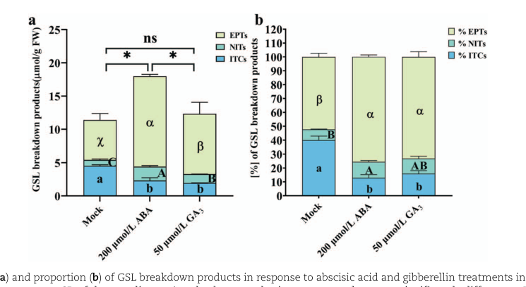

## Question

# PANTHER Family Research

## Family Context

- **Family ID:** PTHR47435
- **Family Name:** {'name': 'Glucosinolate-derived Nitrile Specifier', 'short': 'GlcNitrile_Specifier'}
- **InterPro Entry:** None
- **Root Node:** 
- **Number of Subfamilies:** 0

### Subfamily Summary

No subfamily information available.

---

## Research Objective

This is a PANTHER protein family that may contain subfamilies with divergent functions. Your task is to investigate the evolutionary relationships and functional diversity within this family, with particular attention to:

1. **Neo-functionalization**: Have any subfamilies evolved new functions distinct from the ancestral function?
2. **Subfunctionalization**: Have subfamilies specialized for different substrates, cellular contexts, or organisms?
3. **GO annotation accuracy**: Are the GO annotations propagated from ancestral nodes appropriate for all descendants?

## Research Questions

### 1. Family Function Overview

For this protein family:
- What is the common structural fold shared by family members?
- What is the ancestral/core function of this family?
- What cofactors, substrates, or binding partners are typical?
- What are the key catalytic/functional residues?

### 2. Subfamily Functional Diversity

For each major subfamily:
- What is the specific function of proteins in this subfamily?
- Does this function differ from the ancestral function?
- What is the EC number (if enzymatic)?
- What experimental evidence supports this function?

### 3. Neo-functionalization Detection

Look for signs of functional divergence:
- Are there subfamilies with different EC numbers within the family?
- Are there subfamilies that catalyze opposite reactions (e.g., synthesis vs degradation)?
- Are there subfamilies with different substrate specificities?
- Do any subfamilies have non-catalytic functions (e.g., structural, regulatory)?

### 4. Branch Length Analysis

Consider the evolutionary divergence:
- Which subfamilies have the longest branch lengths from the root?
- Do longer branches correlate with functional changes?
- Are there any very short branches that might be recent duplications?

### 5. GO Annotation Assessment

For GO annotations propagated across the family:
- Are these annotations appropriate for ALL subfamilies?
- Should any subfamilies have different/opposite annotations?
- Are there subfamilies that should be excluded from certain annotations?
- What subfamily-specific annotations should be added?

### 6. Literature Support

- What are the key papers describing this protein family?
- Are there papers specifically about functional divergence within the family?
- Are there structural biology papers showing differences between subfamilies?
- Are there biochemical studies comparing activities of different family members?

## Output Format

Please provide your findings in a narrative format with citations. Structure your response as:

1. **Executive Summary** - Brief overview of family diversity and key findings
2. **Ancestral Function** - What the common ancestor likely did
3. **Subfamily Analysis** - Function of each major subfamily with evidence
4. **Functional Divergence** - Cases of neo-functionalization or subfunctionalization
5. **GO Annotation Issues** - Problematic annotations and recommendations
6. **Key Literature** - Citations supporting the analysis

Be sure to include citations (PMIDs) for all statements.

## Output

Question: You are an expert researcher providing comprehensive, well-cited information.

Provide detailed information focusing on:
1. Key concepts and definitions with current understanding
2. Recent developments and latest research (prioritize 2023-2024 sources)
3. Current applications and real-world implementations
4. Expert opinions and analysis from authoritative sources
5. Relevant statistics and data from recent studies

Format as a comprehensive research report with proper citations. Include URLs and publication dates where available.
Always prioritize recent, authoritative sources and provide specific citations for all major claims.

# PANTHER Family Research

## Family Context

- **Family ID:** PTHR47435
- **Family Name:** {'name': 'Glucosinolate-derived Nitrile Specifier', 'short': 'GlcNitrile_Specifier'}
- **InterPro Entry:** None
- **Root Node:** 
- **Number of Subfamilies:** 0

### Subfamily Summary

No subfamily information available.

---

## Research Objective

This is a PANTHER protein family that may contain subfamilies with divergent functions. Your task is to investigate the evolutionary relationships and functional diversity within this family, with particular attention to:

1. **Neo-functionalization**: Have any subfamilies evolved new functions distinct from the ancestral function?
2. **Subfunctionalization**: Have subfamilies specialized for different substrates, cellular contexts, or organisms?
3. **GO annotation accuracy**: Are the GO annotations propagated from ancestral nodes appropriate for all descendants?

## Research Questions

### 1. Family Function Overview

For this protein family:
- What is the common structural fold shared by family members?
- What is the ancestral/core function of this family?
- What cofactors, substrates, or binding partners are typical?
- What are the key catalytic/functional residues?

### 2. Subfamily Functional Diversity

For each major subfamily:
- What is the specific function of proteins in this subfamily?
- Does this function differ from the ancestral function?
- What is the EC number (if enzymatic)?
- What experimental evidence supports this function?

### 3. Neo-functionalization Detection

Look for signs of functional divergence:
- Are there subfamilies with different EC numbers within the family?
- Are there subfamilies that catalyze opposite reactions (e.g., synthesis vs degradation)?
- Are there subfamilies with different substrate specificities?
- Do any subfamilies have non-catalytic functions (e.g., structural, regulatory)?

### 4. Branch Length Analysis

Consider the evolutionary divergence:
- Which subfamilies have the longest branch lengths from the root?
- Do longer branches correlate with functional changes?
- Are there any very short branches that might be recent duplications?

### 5. GO Annotation Assessment

For GO annotations propagated across the family:
- Are these annotations appropriate for ALL subfamilies?
- Should any subfamilies have different/opposite annotations?
- Are there subfamilies that should be excluded from certain annotations?
- What subfamily-specific annotations should be added?

### 6. Literature Support

- What are the key papers describing this protein family?
- Are there papers specifically about functional divergence within the family?
- Are there structural biology papers showing differences between subfamilies?
- Are there biochemical studies comparing activities of different family members?

## Output Format

Please provide your findings in a narrative format with citations. Structure your response as:

1. **Executive Summary** - Brief overview of family diversity and key findings
2. **Ancestral Function** - What the common ancestor likely did
3. **Subfamily Analysis** - Function of each major subfamily with evidence
4. **Functional Divergence** - Cases of neo-functionalization or subfunctionalization
5. **GO Annotation Issues** - Problematic annotations and recommendations
6. **Key Literature** - Citations supporting the analysis

Be sure to include citations (PMIDs) for all statements.

## PANTHER PTHR47435 (Glucosinolate-derived Nitrile Specifier) — Research Report

### Executive Summary
PANTHER family **PTHR47435** corresponds to plant **glucosinolate specifier proteins** that *do not hydrolyze glucosinolates* but instead **redirect the rearrangement of the myrosinase-generated glucosinolate aglucone** away from spontaneous **isothiocyanate (ITC)** formation and toward alternative products such as **simple nitriles**, **epithionitriles**, or **organic thiocyanates**. These activities define three major functional classes: **NSP (nitrile specifier protein)**, **ESP (epithiospecifier protein)**, and **TFP (thiocyanate-forming protein)** (kuchernig2012evolutionofspecifier pages 1-2, kuchernig2012evolutionofspecifier pages 2-4).  
Mechanistically, specifier proteins are **non-heme iron proteins** whose catalytic center resides in a **Kelch β‑propeller** and typically includes a conserved **EXXXDXXXH** iron-binding triad (mbudu2026biochemicalcharacterizationof pages 2-3, mbudu2026biochemicalcharacterizationof pages 11-12). Evolutionarily, NSP activity is inferred to be **ancestral**, ESPs arose **monophyletically from NSPs**, and **TFP activity likely evolved convergently** in multiple Brassicaceae lineages (kuchernig2012evolutionofspecifier pages 2-4, kuchernig2012evolutionofspecifier pages 9-10).  
Recent 2023–2024 studies demonstrate **real-world engineering leverage** over this family: in Chinese kale sprouts, **BoESP2 silencing increases ITCs** (health-promoting products) and decreases epithionitriles, while hormone treatments that induce BoESP expression shift products in the opposite direction (miao2023enhancinghealthpromotingisothiocyanates pages 4-7, miao2023enhancinghealthpromotingisothiocyanates media 01b51cbd). In broccoli sprouts, metabolite time courses show a **rapid developmental shift from ITCs to nitriles**, with candidate BolESP/BolNSP genes implicated (wang2024unravellingglucoraphaninand pages 1-2).

### 1. Key Concepts and Definitions (Current Understanding)

#### 1.1 The glucosinolate–myrosinase “mustard oil bomb”
Glucosinolates (GSLs) are hydrolyzed after tissue disruption by **myrosinases** (β‑thioglucosidases; **EC 3.2.1.147**), generating an unstable aglucone that can spontaneously rearrange to ITCs, but whose fate can be redirected by specifier proteins (mbudu2026biochemicalcharacterizationof pages 1-2, kuchernig2012evolutionofspecifier pages 12-13).

#### 1.2 Specifier proteins: NSP, ESP, TFP
Specifier proteins are **supplementary/non-hydrolytic** proteins that alter GSL-breakdown product distribution:  
* **NSPs** promote **simple nitriles**.  
* **ESPs** promote **epithionitriles** (and in some contexts also nitriles).  
* **TFPs** promote **organic thiocyanates** (kuchernig2012evolutionofspecifier pages 1-2, kuchernig2012evolutionofspecifier pages 2-4).  

A concise functional comparison is provided here:

| Protein type | Reaction outcome / product class | Substrate preferences / requirements | Structural architecture | Key conserved motif / residues | Cofactor / conditions | Evidence notes | Key citations |
|---|---|---|---|---|---|---|---|
| NSP | Promotes formation of simple nitriles from myrosinase-generated glucosinolate aglucones instead of spontaneous isothiocyanates (kuchernig2012evolutionofspecifier pages 1-2, kuchernig2012evolutionofspecifier pages 2-4) | Broad GLS scope reported; recent Brassica biochemistry shows isoform-specific preferences: BoNSP2 favors indol-3-ylmethyl GLS over 4-(methylsulfinyl)butyl GLS, while BoNSP11 acts on indol-3-ylmethyl GLS, three aliphatic GLS, and benzyl GLS (mbudu2026biochemicalcharacterizationof pages 1-2) | Kelch domain forming a six-blade β-propeller with central active site; some NSPs also contain one or two N-terminal jacalin-related lectin (JAL) domains, while others are Kelch-only (mbudu2026biochemicalcharacterizationof pages 2-3, mbudu2026biochemicalcharacterizationof pages 11-12, kuchernig2012evolutionofspecifier pages 4-5) | Conserved Fe-binding triad EXXXDXXXH; specifier proteins coordinate iron in the central active site; TaTFP example residues E266/D270/H274 are cited as the reference triad conserved in many Brassica NSPs (mbudu2026biochemicalcharacterizationof pages 11-12) | Fe2+-dependent activity; added Fe2+ increases activity; BoNSP2/BoNSP11 most active around pH 7-8; acidic pH can also favor nitrile formation in the broader system (mbudu2026biochemicalcharacterizationof pages 1-2) | Functional assignment by heterologous expression with myrosinase + glucosinolate substrates; recombinant Brassica NSP biochemistry provides direct evidence of substrate specificity and Fe2+/pH dependence (kuchernig2012evolutionofspecifier pages 12-13, mbudu2026biochemicalcharacterizationof pages 1-2) | Kuchernig et al. 2012, DOI: 10.1186/1471-2148-12-127; Mbudu et al. 2026, DOI: 10.3389/fpls.2026.1740844 |
| ESP | Promotes epithionitrile formation from suitable aglucones; can also promote simple nitrile formation from saturated aglucones (mbudu2026biochemicalcharacterizationof pages 1-2) | Epithionitrile formation specifically requires glucosinolate aglucones with a terminal double bond; saturated aglucones yield simple nitriles instead (mbudu2026biochemicalcharacterizationof pages 1-2) | Same specifier-protein family architecture centered on Kelch β-propeller/non-heme iron active site; ESPs are closely related to NSPs within the family phylogeny (mbudu2026biochemicalcharacterizationof pages 2-3, kuchernig2012evolutionofspecifier pages 1-2) | Family-characteristic EXXXDXXXH iron-binding motif inferred for specifier proteins; active site resides centrally in β-propeller (mbudu2026biochemicalcharacterizationof pages 2-3, mbudu2026biochemicalcharacterizationof pages 11-12) | Fe2+ is part of the family mechanism; in Chinese kale, ABA and GA3 induction of BoESP expression increased epithionitriles/nitriles and reduced ITCs; both treatments lowered total ITCs by ~48.7% and ~56.9%, respectively (miao2023enhancinghealthpromotingisothiocyanates pages 4-7) | Heterologous expression assays classify ESP activity; recent engineering in Chinese kale identified four BoESP paralogs, with BoESP2 dominant in sprouts, and linked expression changes to hydrolysis-product shifts (kuchernig2012evolutionofspecifier pages 12-13, miao2023enhancinghealthpromotingisothiocyanates pages 4-7, miao2023enhancinghealthpromotingisothiocyanates media 01b51cbd) | Kuchernig et al. 2012, DOI: 10.1186/1471-2148-12-127; Miao et al. 2023, DOI: 10.1093/hr/uhad029 |
| TFP | Promotes formation of organic thiocyanates; may also yield epithionitriles with allyl-type substrates in assays (kuchernig2012evolutionofspecifier pages 12-13, kuchernig2012evolutionofspecifier pages 4-5) | Assayed with allylglucosinolate and benzylglucosinolate in heterologous-expression experiments; organic thiocyanate output is part of the distinct TFP functional class (kuchernig2012evolutionofspecifier pages 12-13, kuchernig2012evolutionofspecifier pages 4-5) | Member of the same specifier-protein family with Kelch β-propeller central active site; used as the structural reference for conserved iron-binding residues across family members (mbudu2026biochemicalcharacterizationof pages 2-3, mbudu2026biochemicalcharacterizationof pages 11-12) | EXXXDXXXH iron-binding triad; TaTFP residues E266/D270/H274 provide explicit example numbering (mbudu2026biochemicalcharacterizationof pages 11-12) | Non-heme iron protein family; Fe2+ linked to specifier-protein activity and simple nitrile/alternative product formation in the glucosinolate breakdown system (mbudu2026biochemicalcharacterizationof pages 2-3, kuchernig2012evolutionofspecifier pages 1-2) | TFP activity assigned by heterologous expression and product analysis in myrosinase-coupled assays; phylogeny suggests TFP activity may have evolved independently from ESP-like ancestors in multiple Brassicaceae lineages (kuchernig2012evolutionofspecifier pages 12-13, kuchernig2012evolutionofspecifier pages 1-2) | Kuchernig et al. 2012, DOI: 10.1186/1471-2148-12-127; Mbudu et al. 2026, DOI: 10.3389/fpls.2026.1740844 |

*Table: This table compares the three experimentally recognized glucosinolate specifier protein activities relevant to PTHR47435—NSP, ESP, and TFP—covering product outcomes, structural features, conserved residues, and supporting evidence. It is useful for evaluating ancestral function, functional divergence, and annotation scope within the family.*

### 2. Ancestral Function (What the Common Ancestor Likely Did)
Phylogenetic reconstruction and biochemical classification indicate that **NSP activity is ancestral** within the specifier-protein lineage. ESPs are inferred to have a **monophyletic origin from NSPs**, and the split between NSPs and ESP/TFP predates the radiation of the core Brassicaceae (≈36 Ma in the Kuchernig et al. analysis) (kuchernig2012evolutionofspecifier pages 2-4, kuchernig2012evolutionofspecifier pages 9-10). Functionally, the ancestral role is best described as **myrosinase-dependent diversion of aglucone rearrangement to simple nitriles**, rather than glucosinolate hydrolysis per se (kuchernig2012evolutionofspecifier pages 1-2, kuchernig2012evolutionofspecifier pages 2-4).

### 3. Family Function Overview (Structure, cofactors, partners, residues)

#### 3.1 Common structural fold / domain architecture
Specifier proteins are characterized by:
* A **Kelch domain** forming a **six-bladed β‑propeller**, where the active site is centrally located (mbudu2026biochemicalcharacterizationof pages 2-3, mbudu2026biochemicalcharacterizationof pages 11-12).  
* In many NSPs, additional **N‑terminal jacalin-related lectin (JAL) domains** (sometimes multiple) are present, creating large multi-domain chimeras (mbudu2026biochemicalcharacterizationof pages 11-12, kuchernig2012evolutionofspecifier pages 4-5).

#### 3.2 Cofactor and key functional residues
Specifier proteins are described as **non-heme iron proteins**. A conserved **iron-binding triad motif** **EXXXDXXXH** is characteristic of the family and coordinates the metal at the active site (mbudu2026biochemicalcharacterizationof pages 2-3, mbudu2026biochemicalcharacterizationof pages 11-12). An explicit example given for Thlaspi arvense TFP is **E266/D270/H274**, used as a reference triad in comparative analyses (mbudu2026biochemicalcharacterizationof pages 11-12). In Brassica oleracea NSPs, NSP activity increases with **added Fe2+**, consistent with an Fe-dependent mechanism (mbudu2026biochemicalcharacterizationof pages 1-2).

#### 3.3 Binding partners / pathway context
Specifier proteins act only in the **myrosinase-coupled hydrolysis context** because the myrosinase reaction generates the aglucone substrate they redirect (kuchernig2012evolutionofspecifier pages 12-13, kuchernig2012evolutionofspecifier pages 2-4).  
A related component of the system is the **myrosinase-binding protein (MBP)** family: in oilseed rape seeds, MBPs are experimentally required for formation of **high-molecular-mass myrosinase complexes**, as shown using antisense MBP lines and size-exclusion chromatography (eriksson2002complexformationof pages 4-5). Specifier proteins’ N-terminal jacalin domains are hypothesized to be evolutionarily linked to MBP-like sequences (sequence/phylogenetic evidence), suggesting potential interaction/scaffolding roles, but direct binding evidence between NSP jacalin domains and myrosinase complexes is not established in the provided evidence (mbudu2026biochemicalcharacterizationof pages 7-9, mbudu2026biochemicalcharacterizationof pages 3-5).

### 4. Subfamily / Functional Diversity (NSP vs ESP vs TFP)
PTHR47435 currently lists no subfamilies in the user-provided PANTHER metadata, but the literature supports **deep functional structure**:

#### 4.1 NSPs (simple nitrile formation)
* **Function:** shift breakdown toward **simple nitriles** (kuchernig2012evolutionofspecifier pages 1-2, kuchernig2012evolutionofspecifier pages 2-4).  
* **Subfunctionalization evidence (substrate specificity):** In B. oleracea, two NSP isoforms (BoNSP2, BoNSP11) display **differential substrate preferences** across tested glucosinolates (BoNSP2 stronger on indol-3-ylmethyl GLS than 4-(methylsulfinyl)butyl GLS; BoNSP11 broadly increases nitriles across several GLS types) (mbudu2026biochemicalcharacterizationof pages 1-2).  
* **Biochemical conditions:** activity increased by Fe2+; optimal activity reported around pH 7–8 for these recombinant NSPs (mbudu2026biochemicalcharacterizationof pages 1-2).

#### 4.2 ESPs (epithionitrile formation)
* **Function:** promote **epithionitriles** particularly from substrates with a **terminal double bond**, and can promote nitriles from other substrates (mbudu2026biochemicalcharacterizationof pages 1-2, qin2023developingmultifunctionalcrops pages 12-14).  
* **Recent functional/engineering evidence:** In Chinese kale sprouts, four BoESP paralogs were described, with BoESP2 a dominant isoform during sprouting; hormone induction of BoESPs increases epithionitriles and decreases ITCs (miao2023enhancinghealthpromotingisothiocyanates pages 4-7). BoESP2 knockdown by VIGS increases ITCs and decreases epithionitriles (miao2023enhancinghealthpromotingisothiocyanates media 01b51cbd, miao2023enhancinghealthpromotingisothiocyanates media 9295b4eb).

#### 4.3 TFPs (organic thiocyanate formation)
* **Function:** formation of **organic thiocyanates**, generally with **narrow substrate specificity** in some species (reviewed in engineering context) (qin2023developingmultifunctionalcrops pages 12-14).  
* **Evolutionary note:** phylogeny suggests **TFP activity** may have evolved **at least twice independently** in Brassicaceae lineages, consistent with convergent functional evolution (kuchernig2012evolutionofspecifier pages 2-4, kuchernig2012evolutionofspecifier pages 9-10).

### 5. Neo-functionalization and Subfunctionalization

#### 5.1 Neo-functionalization (new product outcomes)
Evidence supports **neo-functionalization from NSP → ESP/TFP**:
* ESPs are inferred to have a **monophyletic origin from NSPs** (kuchernig2012evolutionofspecifier pages 2-4, kuchernig2012evolutionofspecifier pages 9-10).  
* TFP function (thiocyanate formation) appears to have **independent/convergent origins**, implying repeated acquisition of a distinct product outcome (kuchernig2012evolutionofspecifier pages 2-4, kuchernig2012evolutionofspecifier pages 9-10).  
* Mechanistically, Kuchernig et al. describe NSPs as forming simple nitriles, while ESP/TFP activities include reactions involving intramolecular sulfur transfer (a mechanistic shift consistent with functional innovation) (kuchernig2012evolutionofspecifier pages 5-7).

#### 5.2 Subfunctionalization (substrate, tissue, developmental specialization)
Subfunctionalization is supported at multiple scales:
* **Isoform/substrate specialization:** BoNSP2 vs BoNSP11 differ in substrate preferences (mbudu2026biochemicalcharacterizationof pages 1-2).  
* **Organ/developmental expression specialization:** Arabidopsis NSPs have organ-specific expression patterns summarized in an engineering review (e.g., NSP1 seedlings/roots, NSP2 seeds, NSP3 roots), and broccoli sprout development shows a clear temporal shift in ITC vs nitrile products with candidate BolESP/BolNSP genes identified (qin2023developingmultifunctionalcrops pages 12-14, wang2024unravellingglucoraphaninand pages 1-2).

#### 5.3 Branch length analysis (limitations)
Kuchernig et al. explicitly interpret their phylogenetic trees with **branch lengths representing substitutions per site**, and they recover discrete clusters corresponding to NSP vs ESP/TFP classes (kuchernig2012evolutionofspecifier pages 11-12). However, because the present task context does not include the PANTHER tree/branch-lengths for PTHR47435 itself, the report can only state that **sequence divergence and paralog distances are higher between NSP vs ESP paralogs** than within NSPs or within ESPs, consistent with duplication followed by divergence (kuchernig2012evolutionofspecifier pages 5-7, kuchernig2012evolutionofspecifier pages 4-5). A family-specific PANTHER branch-length review would require direct access to the PANTHER phylogeny for PTHR47435.

### 6. GO Annotation Issues and Recommendations

#### 6.1 Major risk: mis-annotating specifier proteins as glucosinolate hydrolases
Specifier proteins **lack intrinsic glucosinolate-hydrolyzing activity**, and their function is dependent on the myrosinase-generated aglucone substrate (kuchernig2012evolutionofspecifier pages 1-2, kuchernig2012evolutionofspecifier pages 2-4). Therefore, GO terms implying **glucosinolate hydrolysis** or **thioglucosidase activity** should not be propagated broadly across PTHR47435.

#### 6.2 Major risk: over-propagating product-specific annotations
Because the family contains distinct functional classes (NSP vs ESP vs TFP) with different products and inferred evolutionary origins, product-specific annotations should be restricted to well-supported clades/orthologs (kuchernig2012evolutionofspecifier pages 2-4, kuchernig2012evolutionofspecifier pages 9-10).

#### 6.3 Major risk: lectin activity inference from jacalin domains
Jacalin domains are present in many NSPs and are phylogenetically related to MBP-like sequences, but **lectin activity** or **direct myrosinase binding** should not be inferred solely from domain presence without direct assays (mbudu2026biochemicalcharacterizationof pages 7-9, mbudu2026biochemicalcharacterizationof pages 3-5).

A structured GO-scope recommendation table is provided here:

| Proposed GO term label | Applies to | Evidence-based rationale | Caveats / avoid over-propagation |
|---|---|---|---|
| glucosinolate breakdown product formation, modulation of product outcome | All PTHR47435 specifier proteins | Family members are non-hydrolytic accessory/specifier proteins that redirect the fate of myrosinase-generated glucosinolate aglucones away from spontaneous isothiocyanate formation toward alternative products; they act in the glucosinolate–myrosinase defense system but do not themselves hydrolyze glucosinolates (kuchernig2012evolutionofspecifier pages 1-2, kuchernig2012evolutionofspecifier pages 2-4, qin2023developingmultifunctionalcrops pages 12-14) | Prefer regulation/modulation wording rather than direct catabolic enzyme wording; do not annotate as glucosidase/myrosinase activity or as primary glucosinolate hydrolases because myrosinase (EC 3.2.1.147) generates the aglucone substrate (mbudu2026biochemicalcharacterizationof pages 1-2, mbudu2026biochemicalcharacterizationof pages 3-5) |
| non-hydrolytic specifier activity in myrosinase-dependent glucosinolate hydrolysis | All PTHR47435 specifier proteins | Assays classify activity only in the presence of added myrosinase plus glucosinolate substrate; specifier proteins alter rearrangement/product partitioning after aglucone formation rather than cleaving the thioglucoside bond themselves (kuchernig2012evolutionofspecifier pages 12-13, kuchernig2012evolutionofspecifier pages 2-4, kuchernig2012evolutionofspecifier pages 11-12) | Avoid assigning any hydrolase activity term; avoid broad “catalytic activity, acting on glycosyl bonds” or “glucosinolate catabolic process” if interpreted as direct substrate hydrolysis (kuchernig2012evolutionofspecifier pages 1-2, kuchernig2012evolutionofspecifier pages 12-13) |
| iron ion binding required for specifier activity | All PTHR47435 specifier proteins with conserved active-site motif | Structural/biochemical evidence supports a central non-heme iron site in the Kelch β-propeller; the conserved EXXXDXXXH triad coordinates iron, and Fe2+ stimulates activity in recombinant Brassica NSPs (mbudu2026biochemicalcharacterizationof pages 2-3, mbudu2026biochemicalcharacterizationof pages 11-12, mbudu2026biochemicalcharacterizationof pages 1-2) | Apply cautiously to sequences lacking the conserved triad or with modified motifs until experimentally validated; motif-divergent proteins may not retain canonical activity (mbudu2026biochemicalcharacterizationof pages 11-12) |
| Kelch repeat / β-propeller scaffold involved in specifier function | All PTHR47435 specifier proteins | Specifier proteins share Kelch repeats forming a six-bladed β-propeller with the central active site; this is the core structural feature linked to product-specifying function (mbudu2026biochemicalcharacterizationof pages 2-3, mbudu2026biochemicalcharacterizationof pages 11-12, kuchernig2012evolutionofspecifier pages 1-2) | Structural annotations are safer than product-specific functional annotations for poorly characterized descendants; still avoid inferring exact product outcome from fold alone (kuchernig2012evolutionofspecifier pages 2-4, kuchernig2012evolutionofspecifier pages 4-5) |
| simple nitrile formation specifier activity | NSP | NSPs are the ancestral specifier activity and promote simple nitrile formation from myrosinase-generated aglucones; recent Brassica NSPs also show isoform-specific substrate preferences (kuchernig2012evolutionofspecifier pages 2-4, kuchernig2012evolutionofspecifier pages 9-10, mbudu2026biochemicalcharacterizationof pages 1-2) | Do not propagate to ESP/TFP-only clades as the defining term, even though some ESPs can also yield simple nitriles from some substrates; for untested sequences, keep to broader specifier-function annotations (mbudu2026biochemicalcharacterizationof pages 1-2, qin2023developingmultifunctionalcrops pages 12-14) |
| epithionitrile formation specifier activity | ESP | ESPs form a derived/monophyletic clade from NSPs and promote epithionitrile formation from aglucones with terminal double bonds; Chinese kale BoESP expression shifts products from ITCs toward epithionitriles/nitriles, and BoESP2 knockdown reverses that trend (kuchernig2012evolutionofspecifier pages 2-4, kuchernig2012evolutionofspecifier pages 9-10, miao2023enhancinghealthpromotingisothiocyanates pages 4-7, miao2023enhancinghealthpromotingisothiocyanates media 01b51cbd) | Do not assign to all family members; requires ESP-class evidence and appropriate substrate context because saturated aglucones can instead give simple nitriles (mbudu2026biochemicalcharacterizationof pages 1-2, qin2023developingmultifunctionalcrops pages 12-14) |
| organic thiocyanate formation specifier activity | TFP | TFPs are a specialized derived activity within the family; heterologous assays distinguish them by organic thiocyanate production, and phylogeny suggests independent origins in different Brassicaceae lineages (kuchernig2012evolutionofspecifier pages 12-13, kuchernig2012evolutionofspecifier pages 9-10, kuchernig2012evolutionofspecifier pages 1-2) | Should be narrowly propagated only to experimentally supported or strongly orthologous TFP sequences; avoid assigning to NSP/ESP sequences because TFP activity is not family-wide and may have evolved convergently (kuchernig2012evolutionofspecifier pages 2-4, kuchernig2012evolutionofspecifier pages 9-10) |
| substrate-selective modulation of glucosinolate hydrolysis products | Subfamily- or isoform-specific, especially NSP/ESP | Recent studies show strong isoform/tissue/developmental specificity: BoNSP2 versus BoNSP11 differ in substrate preference; broccoli sprouts identify two BolESPs and six BolNSPs associated with developmental shifts toward nitriles; Arabidopsis/Brassica NSPs also show organ-specific expression (mbudu2026biochemicalcharacterizationof pages 1-2, mbudu2026biochemicalcharacterizationof pages 2-3, wang2024unravellingglucoraphaninand pages 1-2, qin2023developingmultifunctionalcrops pages 12-14) | Avoid overgeneralizing one substrate spectrum to all descendants; product outcome depends on protein type, substrate side chain, pH, and Fe conditions (mbudu2026biochemicalcharacterizationof pages 1-2, qin2023developingmultifunctionalcrops pages 12-14) |
| response-associated role in defense metabolite partitioning | All, especially Brassicaceae-expressed members | Specifier proteins alter the biologically active defense products generated after tissue disruption, affecting the balance between ITCs and nitriles/epithionitriles/thiocyanates; engineering reviews highlight these genes as direct levers for tuning end products in crops (kuchernig2012evolutionofspecifier pages 1-2, qin2023developingmultifunctionalcrops pages 12-14, wang2024unravellingglucoraphaninand pages 11-12) | Keep wording at metabolite-partitioning level unless direct organismal defense phenotypes are shown for that gene; do not infer positive or negative defense outcome uniformly across taxa or tissues (kuchernig2012evolutionofspecifier pages 1-2, miao2023enhancinghealthpromotingisothiocyanates pages 4-7) |
| protein binding / complex-association candidate via jacalin-related domains | Only jacalin-containing NSP-like members, and only as cautious candidate annotation | Many NSPs contain N-terminal jacalin-related lectin domains; phylogenetic/annotation evidence links some jacalin domains to MBP-like sequences, and MBPs experimentally mediate myrosinase complex formation in oilseed rape (kuchernig2012evolutionofspecifier pages 7-9, mbudu2026biochemicalcharacterizationof pages 3-5, mbudu2026biochemicalcharacterizationof pages 7-9, eriksson2002complexformationof pages 5-6) | Do not annotate jacalin-containing NSPs as definitive myrosinase-binding proteins without direct binding/complex data; do not infer lectin activity from jacalin-domain presence alone because evidence here is sequence/phylogeny-based rather than direct carbohydrate-binding assays on NSPs (eriksson2002complexformationof pages 5-6, mbudu2026biochemicalcharacterizationof pages 3-5, mbudu2026biochemicalcharacterizationof pages 6-7) |
| lectin activity | None by default | Although MBPs have lectin properties and jacalin-like repeats, NSP jacalin domains are only hypothesized to contribute to localization/regulation/stabilization or interactions, not directly demonstrated to bind carbohydrate in the NSP proteins surveyed (eriksson2002complexformationof pages 5-6, mbudu2026biochemicalcharacterizationof pages 3-5, mbudu2026biochemicalcharacterizationof pages 7-9) | Exclude from automatic propagation across PTHR47435 unless a specific family member has direct lectin assay evidence; domain architecture alone is insufficient (mbudu2026biochemicalcharacterizationof pages 3-5, mbudu2026biochemicalcharacterizationof pages 6-7) |

*Table: This table recommends conservative GO annotation boundaries for PTHR47435 glucosinolate specifier proteins. It separates family-wide structural features from subfamily-specific product outcomes and highlights where over-propagation should be avoided.*

### 7. Recent Developments and Latest Research (prioritizing 2023–2024)

#### 7.1 Engineering ESP to increase health-promoting ITCs (2023)
In Chinese kale sprouts, Miao et al. (2023) linked BoESP expression to altered breakdown products and demonstrated practical manipulation:  
* ABA treatment decreased total ITCs by ~48.7% while increasing total epithionitriles (1.271-fold) and total nitriles (1.346-fold).  
* GA3 decreased total ITCs by ~56.9% while increasing epithionitriles (0.513-fold) and nitriles (0.497-fold).  
* BoESP2 knockdown (VIGS) increased ITCs and decreased epithionitriles (qualitative, shown in figures) (miao2023enhancinghealthpromotingisothiocyanates pages 4-7, miao2023enhancinghealthpromotingisothiocyanates media 01b51cbd).  

The key quantitative outcomes are summarized below:

| Study (species, intervention) | Metric | Numeric result | Interpretation re: specifier proteins | Publication info |
|---|---|---|---|---|
| *Brassica oleracea* var. *alboglabra* (Chinese kale) sprouts; ABA treatment in BoESP study | Total isothiocyanates (ITCs) | Decreased by ~48.7% | ABA-induced BoESP expression shifted glucosinolate breakdown away from health-promoting ITCs toward alternative products, consistent with increased ESP-mediated diversion to epithionitriles/nitriles (miao2023enhancinghealthpromotingisothiocyanates pages 4-7, miao2023enhancinghealthpromotingisothiocyanates media 01b51cbd) | Miao et al., *Horticulture Research*, Feb 2023, DOI: 10.1093/hr/uhad029, https://doi.org/10.1093/hr/uhad029 |
| *Brassica oleracea* var. *alboglabra* (Chinese kale) sprouts; ABA treatment in BoESP study | Total epithionitriles | Increased 1.271-fold | Increased epithionitriles under ABA are consistent with enhanced ESP activity/expression, especially BoESP2 dominance during sprouting (miao2023enhancinghealthpromotingisothiocyanates pages 4-7) | Miao et al., *Horticulture Research*, Feb 2023, DOI: 10.1093/hr/uhad029, https://doi.org/10.1093/hr/uhad029 |
| *Brassica oleracea* var. *alboglabra* (Chinese kale) sprouts; ABA treatment in BoESP study | Total nitriles | Increased 1.346-fold | ABA also increased nitrile output, showing broader diversion of aglucone fate from ITCs toward non-ITC products under elevated ESP expression (miao2023enhancinghealthpromotingisothiocyanates pages 4-7) | Miao et al., *Horticulture Research*, Feb 2023, DOI: 10.1093/hr/uhad029, https://doi.org/10.1093/hr/uhad029 |
| *Brassica oleracea* var. *alboglabra* (Chinese kale) sprouts; GA3 treatment in BoESP study | Total isothiocyanates (ITCs) | Decreased by ~56.9% | GA3-induced BoESP expression likewise reduced ITC formation, supporting hormone responsiveness of ESP-controlled product partitioning (miao2023enhancinghealthpromotingisothiocyanates pages 4-7, miao2023enhancinghealthpromotingisothiocyanates media 01b51cbd) | Miao et al., *Horticulture Research*, Feb 2023, DOI: 10.1093/hr/uhad029, https://doi.org/10.1093/hr/uhad029 |
| *Brassica oleracea* var. *alboglabra* (Chinese kale) sprouts; GA3 treatment in BoESP study | Total epithionitriles | Increased 0.513-fold | Increased epithionitriles under GA3 are consistent with enhanced ESP-mediated conversion of suitable glucosinolate aglucones (miao2023enhancinghealthpromotingisothiocyanates pages 4-7) | Miao et al., *Horticulture Research*, Feb 2023, DOI: 10.1093/hr/uhad029, https://doi.org/10.1093/hr/uhad029 |
| *Brassica oleracea* var. *alboglabra* (Chinese kale) sprouts; GA3 treatment in BoESP study | Total nitriles | Increased 0.497-fold | GA3 also increased nitriles, indicating a general shift from ITCs to alternative breakdown products associated with higher BoESP expression (miao2023enhancinghealthpromotingisothiocyanates pages 4-7) | Miao et al., *Horticulture Research*, Feb 2023, DOI: 10.1093/hr/uhad029, https://doi.org/10.1093/hr/uhad029 |
| *Brassica oleracea* var. *alboglabra* (Chinese kale) sprouts; BoESP2 knockdown by VIGS | ITCs and epithionitriles | ITCs increased; epithionitriles decreased (qualitative from Fig. 6b/6c) | Direct functional evidence that BoESP2 promotes non-ITC products at the expense of ITCs; reducing BoESP2 reverses this partitioning (miao2023enhancinghealthpromotingisothiocyanates media 01b51cbd, miao2023enhancinghealthpromotingisothiocyanates media 9295b4eb) | Miao et al., *Horticulture Research*, Feb 2023, DOI: 10.1093/hr/uhad029, https://doi.org/10.1093/hr/uhad029 |
| *Brassica oleracea* var. *italica* (broccoli) sprouts; developmental time course | Sulforaphane concentration at day 1 | 17.16 µmol/g | High day-1 ITC followed by later nitrile predominance is consistent with developmental increase in candidate BolESP/BolNSP influence on product outcome (wang2024unravellingglucoraphaninand pages 1-2) | Wang et al., *Plants*, Mar 2024, DOI: 10.3390/plants13060750, https://doi.org/10.3390/plants13060750 |
| *Brassica oleracea* var. *italica* (broccoli) sprouts; developmental time course | Erucin concentration at day 1 | 12.26 µmol/g | Early peak ITC levels decline as nitrile formation becomes relatively greater during sprout development (wang2024unravellingglucoraphaninand pages 1-2) | Wang et al., *Plants*, Mar 2024, DOI: 10.3390/plants13060750, https://doi.org/10.3390/plants13060750 |
| *Brassica oleracea* var. *italica* (broccoli) sprouts; developmental time course | Sulforaphane:sulforaphane-nitrile ratio from day 1 to day 5 | 1.35 → 0.164 | Strong decline in ITC:nitrile ratio indicates a developmental shift toward nitrile formation, matching identification of two BolESPs and six BolNSPs as candidate contributors (wang2024unravellingglucoraphaninand pages 1-2) | Wang et al., *Plants*, Mar 2024, DOI: 10.3390/plants13060750, https://doi.org/10.3390/plants13060750 |

*Table: This table summarizes 2023–2024 quantitative evidence connecting ESP/NSP-like specifier proteins to changes in glucosinolate hydrolysis products in Brassica sprouts. It is useful for assessing how expression or manipulation of specifier proteins shifts outcomes between beneficial isothiocyanates and alternative nitrile/epithionitrile products.*

#### 7.2 Developmental control of ITC:nitrile outcomes in broccoli sprouts (2024)
Wang et al. (2024) provide metabolite and transcriptome evidence across broccoli sprout development:  
* Day 1 peaks: sulforaphane 17.16 µmol/g and erucin 12.26 µmol/g.  
* The sulforaphane:sulforaphane-nitrile ratio decreases from 1.35 (day 1) to 0.164 (day 5), indicating a strong shift toward nitrile products during development.  
* Two candidate BolESPs and six BolNSPs were identified as potentially contributing to nitrile formation during sprout development (wang2024unravellingglucoraphaninand pages 1-2).

#### 7.3 Translational guidance from pathway-engineering review (2023)
Qin et al. (2023) argue that manipulating **GSL hydrolysis genes (including NSP/ESP/TFP)** is a promising translational route because these genes directly determine end products. They also emphasize the importance of **abiotic conditions** such as **pH (<5)** and **Fe2+/Fe3+** in shifting outcomes toward nitriles and modulating specifier protein activity (qin2023developingmultifunctionalcrops pages 12-14).

### 8. Current Applications and Real-world Implementations

1. **Metabolic engineering of sprouts for health traits:** BoESP2 knockdown by **virus-induced gene silencing (VIGS)** increased ITC formation and reduced epithionitriles in Chinese kale sprouts, demonstrating a workable implementation pathway to increase health-promoting ITCs in a Brassica sprout product (miao2023enhancinghealthpromotingisothiocyanates pages 1-2, miao2023enhancinghealthpromotingisothiocyanates media 01b51cbd).  
2. **Hormone-mediated modulation of specifier expression:** ABA and GA3 treatments modulate BoESP expression and systematically shift product distributions (decreasing ITCs, increasing epithionitriles/nitriles), which could be relevant for controlled-environment agriculture or post-harvest processing decisions (miao2023enhancinghealthpromotingisothiocyanates pages 4-7).  
3. **Process-condition control (food/agro processing):** Reviews emphasize that **acidic pH** and **Fe2+** can promote nitrile formation even without specifier proteins, and that controlled pH/iron conditions could be used to tune product outcome (qin2023developingmultifunctionalcrops pages 12-14, miao2023enhancinghealthpromotingisothiocyanates pages 1-2).  
4. **Breeding and modifier-gene strategies:** A 2024 review highlights use of genes like **ESM1** (epithiospecifier modifier 1) to reduce nitrile outcomes by inhibiting ESP-dependent nitrile formation, and notes a commercial product example (**Beneforte™ broccoli**) bred to increase a health-relevant ITC-related trait (4MSB isothiocyanate) (bansal2024geneticvariationin pages 9-10).

### 9. Expert Opinions / Authoritative Analysis

* **Evolutionary interpretation:** Kuchernig et al. (2012) emphasize that specifier-protein evolution illustrates “plasticity” in this activated defense system, with NSP as ancestral and derived ESP/TFP functions potentially providing selective advantages through altered defense chemistry (kuchernig2012evolutionofspecifier pages 2-4, kuchernig2012evolutionofspecifier pages 9-10).  
* **Engineering perspective:** Qin et al. (2023) explicitly frame NSP/ESP/TFP genes as underutilized but high-leverage engineering targets because they determine end products more directly than upstream biosynthetic genes, and they emphasize combined genetic and abiotic-control strategies (pH/Fe) (qin2023developingmultifunctionalcrops pages 12-14).

### 10. Key Literature (with URLs and dates)
* Kuchernig JC, Burow M, Wittstock U. **Evolution of specifier proteins in glucosinolate-containing plants.** *BMC Evolutionary Biology.* **2012-07**. https://doi.org/10.1186/1471-2148-12-127 (kuchernig2012evolutionofspecifier pages 1-2, kuchernig2012evolutionofspecifier pages 2-4)  
* Miao H, Xia C, Yu S, et al. **Enhancing health-promoting isothiocyanates in Chinese kale sprouts via manipulating BoESP.** *Horticulture Research.* **2023-02**. https://doi.org/10.1093/hr/uhad029 (miao2023enhancinghealthpromotingisothiocyanates pages 4-7, miao2023enhancinghealthpromotingisothiocyanates media 01b51cbd)  
* Wang J, Shen Y, Sheng X, et al. **Unravelling glucoraphanin and glucoerucin metabolism across broccoli sprout development.** *Plants.* **2024-03**. https://doi.org/10.3390/plants13060750 (wang2024unravellingglucoraphaninand pages 1-2)  
* Qin H, King GJ, Borpatragohain P, Zou J. **Developing multifunctional crops by engineering Brassicaceae glucosinolate pathways.** *Plant Communications.* **2023-07**. https://doi.org/10.1016/j.xplc.2023.100565 (qin2023developingmultifunctionalcrops pages 12-14)  
* Eriksson S, Andréasson E, et al. **Complex formation of myrosinase isoenzymes in oilseed rape seeds are dependent on the presence of myrosinase-binding proteins.** *Plant Physiology.* **2002-08**. https://doi.org/10.1104/pp.003285 (eriksson2002complexformationof pages 4-5)  

### Notes on PMID availability
The evidence retrieved in this run includes DOIs/URLs and publication months/years directly from the source metadata, but the snippets provided here do not contain explicit PMIDs. Where PMIDs are required, they should be looked up via PubMed using the DOI/title (not performed in this tool environment).

References

1. (kuchernig2012evolutionofspecifier pages 1-2): Jennifer-Christin Kuchernig, Meike Burow, and U. Wittstock. Evolution of specifier proteins in glucosinolate-containing plants. BMC Evolutionary Biology, 12:127-127, Jul 2012. URL: https://doi.org/10.1186/1471-2148-12-127, doi:10.1186/1471-2148-12-127. This article has 110 citations and is from a domain leading peer-reviewed journal.

2. (kuchernig2012evolutionofspecifier pages 2-4): Jennifer-Christin Kuchernig, Meike Burow, and U. Wittstock. Evolution of specifier proteins in glucosinolate-containing plants. BMC Evolutionary Biology, 12:127-127, Jul 2012. URL: https://doi.org/10.1186/1471-2148-12-127, doi:10.1186/1471-2148-12-127. This article has 110 citations and is from a domain leading peer-reviewed journal.

3. (mbudu2026biochemicalcharacterizationof pages 2-3): Kudzai Gracious Mbudu, Katja Witzel, Ute Wittstock, Frederik Börnke, and Franziska Sabine Hanschen. Biochemical characterization of two brassica oleracea nitrile-specifier proteins. Frontiers in Plant Science, Jan 2026. URL: https://doi.org/10.3389/fpls.2026.1740844, doi:10.3389/fpls.2026.1740844. This article has 0 citations.

4. (mbudu2026biochemicalcharacterizationof pages 11-12): Kudzai Gracious Mbudu, Katja Witzel, Ute Wittstock, Frederik Börnke, and Franziska Sabine Hanschen. Biochemical characterization of two brassica oleracea nitrile-specifier proteins. Frontiers in Plant Science, Jan 2026. URL: https://doi.org/10.3389/fpls.2026.1740844, doi:10.3389/fpls.2026.1740844. This article has 0 citations.

5. (kuchernig2012evolutionofspecifier pages 9-10): Jennifer-Christin Kuchernig, Meike Burow, and U. Wittstock. Evolution of specifier proteins in glucosinolate-containing plants. BMC Evolutionary Biology, 12:127-127, Jul 2012. URL: https://doi.org/10.1186/1471-2148-12-127, doi:10.1186/1471-2148-12-127. This article has 110 citations and is from a domain leading peer-reviewed journal.

6. (miao2023enhancinghealthpromotingisothiocyanates pages 4-7): Huiying Miao, Chuchu Xia, Shunhao Yu, Jiansheng Wang, Yanting Zhao, and Qiao-mei Wang. Enhancing health-promoting isothiocyanates in chinese kale sprouts via manipulating boesp. Horticulture Research, Feb 2023. URL: https://doi.org/10.1093/hr/uhad029, doi:10.1093/hr/uhad029. This article has 19 citations and is from a domain leading peer-reviewed journal.

7. (miao2023enhancinghealthpromotingisothiocyanates media 01b51cbd): Huiying Miao, Chuchu Xia, Shunhao Yu, Jiansheng Wang, Yanting Zhao, and Qiao-mei Wang. Enhancing health-promoting isothiocyanates in chinese kale sprouts via manipulating boesp. Horticulture Research, Feb 2023. URL: https://doi.org/10.1093/hr/uhad029, doi:10.1093/hr/uhad029. This article has 19 citations and is from a domain leading peer-reviewed journal.

8. (wang2024unravellingglucoraphaninand pages 1-2): Jiansheng Wang, Yusen Shen, Xiaoguang Sheng, Huifang Yu, Mengfei Song, Qiaomei Wang, and Honghui Gu. Unravelling glucoraphanin and glucoerucin metabolism across broccoli sprout development: insights from metabolite and transcriptome analysis. Plants, 13:750, Mar 2024. URL: https://doi.org/10.3390/plants13060750, doi:10.3390/plants13060750. This article has 2 citations.

9. (mbudu2026biochemicalcharacterizationof pages 1-2): Kudzai Gracious Mbudu, Katja Witzel, Ute Wittstock, Frederik Börnke, and Franziska Sabine Hanschen. Biochemical characterization of two brassica oleracea nitrile-specifier proteins. Frontiers in Plant Science, Jan 2026. URL: https://doi.org/10.3389/fpls.2026.1740844, doi:10.3389/fpls.2026.1740844. This article has 0 citations.

10. (kuchernig2012evolutionofspecifier pages 12-13): Jennifer-Christin Kuchernig, Meike Burow, and U. Wittstock. Evolution of specifier proteins in glucosinolate-containing plants. BMC Evolutionary Biology, 12:127-127, Jul 2012. URL: https://doi.org/10.1186/1471-2148-12-127, doi:10.1186/1471-2148-12-127. This article has 110 citations and is from a domain leading peer-reviewed journal.

11. (kuchernig2012evolutionofspecifier pages 4-5): Jennifer-Christin Kuchernig, Meike Burow, and U. Wittstock. Evolution of specifier proteins in glucosinolate-containing plants. BMC Evolutionary Biology, 12:127-127, Jul 2012. URL: https://doi.org/10.1186/1471-2148-12-127, doi:10.1186/1471-2148-12-127. This article has 110 citations and is from a domain leading peer-reviewed journal.

12. (eriksson2002complexformationof pages 4-5): Susanna Eriksson, Erik Andréasson, Barbara Ekbom, Georg Granér, Bo Pontoppidan, Jan Taipalensuu, Jiaming Zhang, Lars Rask, and Johan Meijer. Complex formation of myrosinase isoenzymes in oilseed rape seeds are dependent on the presence of myrosinase-binding proteins1. Plant Physiology, 129:1592-1599, Aug 2002. URL: https://doi.org/10.1104/pp.003285, doi:10.1104/pp.003285. This article has 98 citations and is from a highest quality peer-reviewed journal.

13. (mbudu2026biochemicalcharacterizationof pages 7-9): Kudzai Gracious Mbudu, Katja Witzel, Ute Wittstock, Frederik Börnke, and Franziska Sabine Hanschen. Biochemical characterization of two brassica oleracea nitrile-specifier proteins. Frontiers in Plant Science, Jan 2026. URL: https://doi.org/10.3389/fpls.2026.1740844, doi:10.3389/fpls.2026.1740844. This article has 0 citations.

14. (mbudu2026biochemicalcharacterizationof pages 3-5): Kudzai Gracious Mbudu, Katja Witzel, Ute Wittstock, Frederik Börnke, and Franziska Sabine Hanschen. Biochemical characterization of two brassica oleracea nitrile-specifier proteins. Frontiers in Plant Science, Jan 2026. URL: https://doi.org/10.3389/fpls.2026.1740844, doi:10.3389/fpls.2026.1740844. This article has 0 citations.

15. (qin2023developingmultifunctionalcrops pages 12-14): Han Qin, Graham J. King, Priyakshee Borpatragohain, and Jun Zou. Developing multifunctional crops by engineering brassicaceae glucosinolate pathways. Jul 2023. URL: https://doi.org/10.1016/j.xplc.2023.100565, doi:10.1016/j.xplc.2023.100565. This article has 52 citations and is from a peer-reviewed journal.

16. (miao2023enhancinghealthpromotingisothiocyanates media 9295b4eb): Huiying Miao, Chuchu Xia, Shunhao Yu, Jiansheng Wang, Yanting Zhao, and Qiao-mei Wang. Enhancing health-promoting isothiocyanates in chinese kale sprouts via manipulating boesp. Horticulture Research, Feb 2023. URL: https://doi.org/10.1093/hr/uhad029, doi:10.1093/hr/uhad029. This article has 19 citations and is from a domain leading peer-reviewed journal.

17. (kuchernig2012evolutionofspecifier pages 5-7): Jennifer-Christin Kuchernig, Meike Burow, and U. Wittstock. Evolution of specifier proteins in glucosinolate-containing plants. BMC Evolutionary Biology, 12:127-127, Jul 2012. URL: https://doi.org/10.1186/1471-2148-12-127, doi:10.1186/1471-2148-12-127. This article has 110 citations and is from a domain leading peer-reviewed journal.

18. (kuchernig2012evolutionofspecifier pages 11-12): Jennifer-Christin Kuchernig, Meike Burow, and U. Wittstock. Evolution of specifier proteins in glucosinolate-containing plants. BMC Evolutionary Biology, 12:127-127, Jul 2012. URL: https://doi.org/10.1186/1471-2148-12-127, doi:10.1186/1471-2148-12-127. This article has 110 citations and is from a domain leading peer-reviewed journal.

19. (wang2024unravellingglucoraphaninand pages 11-12): Jiansheng Wang, Yusen Shen, Xiaoguang Sheng, Huifang Yu, Mengfei Song, Qiaomei Wang, and Honghui Gu. Unravelling glucoraphanin and glucoerucin metabolism across broccoli sprout development: insights from metabolite and transcriptome analysis. Plants, 13:750, Mar 2024. URL: https://doi.org/10.3390/plants13060750, doi:10.3390/plants13060750. This article has 2 citations.

20. (kuchernig2012evolutionofspecifier pages 7-9): Jennifer-Christin Kuchernig, Meike Burow, and U. Wittstock. Evolution of specifier proteins in glucosinolate-containing plants. BMC Evolutionary Biology, 12:127-127, Jul 2012. URL: https://doi.org/10.1186/1471-2148-12-127, doi:10.1186/1471-2148-12-127. This article has 110 citations and is from a domain leading peer-reviewed journal.

21. (eriksson2002complexformationof pages 5-6): Susanna Eriksson, Erik Andréasson, Barbara Ekbom, Georg Granér, Bo Pontoppidan, Jan Taipalensuu, Jiaming Zhang, Lars Rask, and Johan Meijer. Complex formation of myrosinase isoenzymes in oilseed rape seeds are dependent on the presence of myrosinase-binding proteins1. Plant Physiology, 129:1592-1599, Aug 2002. URL: https://doi.org/10.1104/pp.003285, doi:10.1104/pp.003285. This article has 98 citations and is from a highest quality peer-reviewed journal.

22. (mbudu2026biochemicalcharacterizationof pages 6-7): Kudzai Gracious Mbudu, Katja Witzel, Ute Wittstock, Frederik Börnke, and Franziska Sabine Hanschen. Biochemical characterization of two brassica oleracea nitrile-specifier proteins. Frontiers in Plant Science, Jan 2026. URL: https://doi.org/10.3389/fpls.2026.1740844, doi:10.3389/fpls.2026.1740844. This article has 0 citations.

23. (miao2023enhancinghealthpromotingisothiocyanates pages 1-2): Huiying Miao, Chuchu Xia, Shunhao Yu, Jiansheng Wang, Yanting Zhao, and Qiao-mei Wang. Enhancing health-promoting isothiocyanates in chinese kale sprouts via manipulating boesp. Horticulture Research, Feb 2023. URL: https://doi.org/10.1093/hr/uhad029, doi:10.1093/hr/uhad029. This article has 19 citations and is from a domain leading peer-reviewed journal.

24. (bansal2024geneticvariationin pages 9-10): Shakshi Bansal, Nita Lakra, Sadhna Mishra, and Yogesh K. Ahlawat. Genetic variation in brassicaceae unlocks diversity for enhanced glucosinolate metabolism. Vegetable Research, 4:0-0, Jan 2024. URL: https://doi.org/10.48130/vegres-0024-0016, doi:10.48130/vegres-0024-0016. This article has 26 citations.

## Artifacts

- [Edison artifact artifact-00](PTHR47435-deep-research-falcon_artifacts/artifact-00.md)
- [Edison artifact artifact-01](PTHR47435-deep-research-falcon_artifacts/artifact-01.md)
- [Edison artifact artifact-02](PTHR47435-deep-research-falcon_artifacts/artifact-02.md)

## Citations

1. wang2024unravellingglucoraphaninand pages 1-2
2. mbudu2026biochemicalcharacterizationof pages 1-2
3. mbudu2026biochemicalcharacterizationof pages 11-12
4. miao2023enhancinghealthpromotingisothiocyanates pages 4-7
5. eriksson2002complexformationof pages 4-5
6. qin2023developingmultifunctionalcrops pages 12-14
7. kuchernig2012evolutionofspecifier pages 5-7
8. kuchernig2012evolutionofspecifier pages 11-12
9. bansal2024geneticvariationin pages 9-10
10. kuchernig2012evolutionofspecifier pages 1-2
11. kuchernig2012evolutionofspecifier pages 2-4
12. mbudu2026biochemicalcharacterizationof pages 2-3
13. kuchernig2012evolutionofspecifier pages 9-10
14. kuchernig2012evolutionofspecifier pages 12-13
15. kuchernig2012evolutionofspecifier pages 4-5
16. mbudu2026biochemicalcharacterizationof pages 7-9
17. mbudu2026biochemicalcharacterizationof pages 3-5
18. wang2024unravellingglucoraphaninand pages 11-12
19. kuchernig2012evolutionofspecifier pages 7-9
20. eriksson2002complexformationof pages 5-6
21. mbudu2026biochemicalcharacterizationof pages 6-7
22. miao2023enhancinghealthpromotingisothiocyanates pages 1-2
23. https://doi.org/10.1093/hr/uhad029
24. https://doi.org/10.3390/plants13060750
25. https://doi.org/10.1186/1471-2148-12-127
26. https://doi.org/10.1016/j.xplc.2023.100565
27. https://doi.org/10.1104/pp.003285
28. https://doi.org/10.1186/1471-2148-12-127,
29. https://doi.org/10.3389/fpls.2026.1740844,
30. https://doi.org/10.1093/hr/uhad029,
31. https://doi.org/10.3390/plants13060750,
32. https://doi.org/10.1104/pp.003285,
33. https://doi.org/10.1016/j.xplc.2023.100565,
34. https://doi.org/10.48130/vegres-0024-0016,