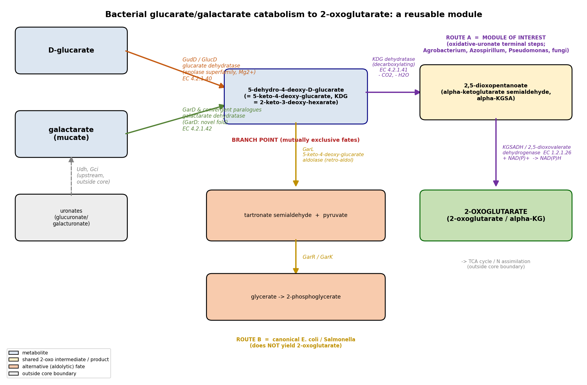

## Question

# Commissioned Review Brief

## Review Topic

Bacterial glucarate and galactarate catabolism to 2-oxoglutarate

## Working Scope

A reusable bacterial module in which D-glucarate and D-galactarate enter through alternative dehydratases and converge on 5-dehydro-4-deoxy-D-glucarate. A second dehydratase/decarboxylase converts this shared intermediate to 2,5-dioxopentanoate, which is oxidized by a 2,5-dioxovalerate dehydrogenase to 2-oxoglutarate. Transport, pathway regulation, upstream uronate oxidation, and downstream central metabolism are outside the core boundary.

## Provisional Biological Outline

- Bacterial glucarate and galactarate catabolism to 2-oxoglutarate
  - 1. alternative aldarate entry dehydration
  - Glucarate or galactarate entry dehydration
    - Alternative versions: Aldarate substrate entry alternatives
      - GudD-dependent D-glucarate entry
        - Glucarate dehydratase (molecular player: glucarate dehydratase subfamily; activity or role: glucarate dehydratase activity)
      - GarD-dependent D-galactarate entry
        - Galactarate dehydratase (molecular player: galactarate dehydratase subfamily; activity or role: galactarate dehydratase activity)
  - 2. shared 2,5-dioxopentanoate formation
  - 5-dehydro-4-deoxyglucarate dehydration and decarboxylation
    - 5-dehydro-4-deoxyglucarate dehydratase (molecular player: 5-dehydro-4-deoxyglucarate dehydratase subfamily; activity or role: 5-dehydro-4-deoxyglucarate dehydratase activity)
  - 3. terminal oxidation to 2-oxoglutarate
  - 2,5-dioxovalerate dehydrogenase reaction
    - 2,5-dioxovalerate dehydrogenase (molecular player: experimentally supported or pathway-linked 2,5-dioxovalerate dehydrogenase family; activity or role: 2,5-dioxovalerate dehydrogenase (NADP+) activity)

## Known Relationships Among Steps

- Glucarate or galactarate entry dehydration feeds into 5-dehydro-4-deoxyglucarate dehydration and decarboxylation: Either entry route supplies 5-dehydro-4-deoxy-D-glucarate to the shared enzyme.
- 5-dehydro-4-deoxyglucarate dehydration and decarboxylation feeds into 2,5-dioxovalerate dehydrogenase reaction: The shared dehydratase/decarboxylase supplies 2,5-dioxopentanoate for terminal oxidation.

## Assignment

Write a rigorous, review-style synthesis suitable for a molecular biology
audience. Treat the topic as a biological system whose boundaries, core
mechanisms, variants, and unresolved points should be made clear to readers who
know the field but are not specialists in this specific process.

The review should be explanatory rather than encyclopedic. Anchor broad claims
in primary literature or authoritative reviews, but keep the focus on how the
system works and how its parts fit together.

## Questions To Address

1. **Scope and boundaries**
   - What exactly is included in this biological system?
   - Which neighboring pathways, organelle processes, complexes, or regulatory
     events are often confused with it but should be treated separately?
   - Are there competing definitions in the literature?

2. **Core mechanism**
   - What is the best current model for the sequence of events?
   - Which steps are obligatory, which are conditional, and which are accessory?
   - What molecular assemblies, enzymes, receptors, adaptors, transporters, or
     structural units carry out each major step?

3. **Variation**
   - How does the system vary across major evolutionary lineages?
   - Are there well-supported differences between cell types, tissues,
     developmental stages, physiological states, or compartments?
   - Where are there alternative routes that achieve a similar outcome by
     different molecular means?

4. **Conservation and origin**
   - What is the deepest plausible evolutionary origin of the system?
   - Which parts appear ancient and conserved, and which appear to be later
     elaborations, replacements, or lineage-specific losses?
   - When a protein family has expanded, which family members are the best
     representatives for understanding the ancestral role?

5. **Physical and biological constraints**
   - What steps must occur in a particular order?
   - Which events are mutually exclusive, compartment-specific, cell-type
     specific, substrate-specific, or stage-specific?
   - What evidence rules out otherwise plausible paths through the system?

6. **Evidence and controversy**
   - Which mechanistic claims are strongly supported by experiments?
   - Where does the literature disagree, rely on indirect evidence, or mix data
     from organisms that may not be comparable?
   - What are the most important open questions?

## Output Format

Use the style and structure of a concise review article:

1. Executive summary
2. Definition and biological boundaries
3. Mechanistic overview
4. Major molecular players and active assemblies
5. Evolutionary and cell-biological variation
6. Constraints, dependencies, and failure modes
7. Controversies and open questions
8. Key references

Include citations for major claims, preferably PMIDs or DOIs. Be explicit about
uncertainty and avoid overgeneralizing from one organism, cell type, or assay
system to all biology.

## Output

# Bacterial Glucarate and Galactarate Catabolism to 2‑Oxoglutarate: A Review of a Reusable Aldarate‑Oxidation Module

*A concise review-style synthesis. Search date: 2026-08-13. Sources: primary literature and authoritative reviews retrieved via PubMed.*

---

## 1. Executive summary

Bacteria that live on the diacid sugars **D‑glucarate** and **D‑galactarate (mucate)** funnel both substrates into a single shared intermediate, **5‑dehydro‑4‑deoxy‑D‑glucarate** (equivalently 5‑keto‑4‑deoxy‑D‑glucarate, "KDG," or 2‑keto‑3‑deoxy‑hexarate), using two **non‑homologous entry dehydratases**. This convergence is the defining architectural feature of the module: glucarate is dehydrated by an enolase‑superfamily Mg²⁺ enzyme (glucarate dehydratase, GudD/GlucD), while galactarate is dehydrated by one of several structurally and mechanistically distinct galactarate dehydratases (the *Escherichia coli* GarD fold, or enolase‑superfamily paralogues such as TalrD/GalrD and GalrD‑II). From the shared intermediate onward, two metabolic fates exist and they are frequently confused. The **route to 2‑oxoglutarate**—the subject of this review—is the terminal segment of the **oxidative uronate pathway** found in organisms such as *Agrobacterium tumefaciens*, *Azospirillum brasilense*, and *Pseudomonas*: a **decarboxylating keto‑deoxy‑glucarate (KDG) dehydratase** converts the shared intermediate to **2,5‑dioxopentanoate** (α‑ketoglutarate semialdehyde, α‑KGSA) plus CO₂ and H₂O, and an **ALDH‑superfamily 2,5‑dioxovalerate/α‑KGSA dehydrogenase** (NAD⁺‑ or NADP⁺‑dependent) then oxidizes this aldehyde to **2‑oxoglutarate**, feeding it directly into the TCA cycle.

The single most important boundary clarification is that the **canonical *E. coli* glucarate/galactarate pathway does not make 2‑oxoglutarate**. In *E. coli*, the same shared KDG intermediate is cleaved by an **aldolase (GarL)** to pyruvate and tartronate semialdehyde, which is reduced (GarR) and phosphorylated (GarK) to 2‑phosphoglycerate. The three‑enzyme oxidative module and the *E. coli* aldolytic module thus share their entry chemistry and their central intermediate but diverge completely at the branch point. Any review of "bacterial glucarate/galactarate catabolism to 2‑oxoglutarate" is therefore a review of the oxidative terminal segment, not of the well‑studied *E. coli* system that dominates the older literature.

A second unifying theme is **repeated, convergent evolution of the component enzymes**. Galactarate dehydratase activity has arisen at least four independent times in different protein folds; the terminal α‑KGSA dehydrogenase is a promiscuously recruited node shared with hydroxyproline catabolism and non‑phosphorylative Entner–Doudoroff sugar pathways; and the entry glucarate dehydratase sits within the enolase superfamily, the textbook paradigm for divergent evolution of enzyme function from a conserved partial reaction. The module is therefore best understood not as one conserved operon but as a **reusable, mix‑and‑match set of interchangeable catalytic parts** that different lineages have assembled independently to achieve the same net transformation: two six‑carbon aldaric acids → one five‑carbon TCA intermediate + CO₂.

{{figure:pathway_schematic.png|caption=Schematic of the glucarate/galactarate → 2‑oxoglutarate module. Two non‑homologous entry dehydratases (GudD/GlucD for glucarate; GarD and its convergent paralogues for galactarate) converge on the shared intermediate 5‑dehydro‑4‑deoxy‑D‑glucarate (KDG). The oxidative branch (right) uses a decarboxylating KDG dehydratase to make 2,5‑dioxopentanoate (α‑KGSA), which an α‑KGSA/2,5‑dioxovalerate dehydrogenase oxidizes to 2‑oxoglutarate. The canonical E. coli branch (left) instead cleaves KDG with an aldolase (GarL) to pyruvate + tartronate semialdehyde, en route to 2‑phosphoglycerate.}}

---

## 2. Definition and biological boundaries

### 2.1 What is inside the module

The core system comprises three catalytic steps and one branch decision:

1. **Alternative aldarate entry dehydration.** D‑glucarate → KDG (glucarate dehydratase, GudD/GlucD); D‑galactarate → KDG (galactarate dehydratase, GarD or paralogues). These are **alternative, mutually substitutable entry routes** that converge on a common product.
2. **Shared 2,5‑dioxopentanoate formation.** KDG → 2,5‑dioxopentanoate (α‑KGSA) + CO₂ + H₂O, by a **decarboxylating dehydratase** (KDG dehydratase; a class‑I aldolase/DHDPS‑superfamily fold in the oxidative pathway).
3. **Terminal oxidation to 2‑oxoglutarate.** α‑KGSA + NAD(P)⁺ + H₂O → 2‑oxoglutarate + NAD(P)H, by a **2,5‑dioxovalerate dehydrogenase** (α‑KGSA dehydrogenase, KGSADH; EC 1.2.1.26).

### 2.2 What is outside the module (and often confused with it)

- **Transport and regulation.** Glucarate/galactarate uptake (e.g., the GudP/GarP permeases) and the transcriptional regulator (CdaR/SdaR/YaeG) coordinate the pathway but lie outside the catalytic core. They are treated here only as context (§5).
- **Upstream uronate oxidation.** In the oxidative uronate pathway, galactarate is produced from D‑galacturonate by **uronate dehydrogenase (Udh)** and a **galactarolactone isomerase/cycloisomerase (Gli/Gci)** step. This chemistry supplies the module's substrate but is not part of the aldarate‑to‑2‑oxoglutarate conversion.
- **The *E. coli* aldolytic fate.** The **GarL aldolase → GarR reductase → GarK kinase** branch that yields 2‑phosphoglycerate and pyruvate is a *different terminal module* that shares the entry steps and the KDG intermediate. It is the single most important "look‑alike" pathway and must be treated separately (Finding F002).
- **Downstream central metabolism.** Once 2‑oxoglutarate is formed, its fate in the TCA cycle, in amino‑acid biosynthesis, or as a signaling metabolite is outside scope.

### 2.3 Competing definitions in the literature

The phrase "glucarate/galactarate catabolism" is used in two incompatible senses. The **enteric (*E. coli*/*B. subtilis*) sense** ends in glycerate/2‑phosphoglycerate via aldol cleavage; the **oxidative‑uronate (*Agrobacterium*/*Azospirillum*/*Pseudomonas*) sense** ends in 2‑oxoglutarate via decarboxylation and oxidation. Both are experimentally validated in their respective organisms; they are not contradictory but describe different organisms' wiring downstream of a shared intermediate. Reviews that mix the two—citing *E. coli* entry enzymes but an oxidative terminus, or vice versa—risk implying a pathway that no single organism runs end‑to‑end. This review treats the 2‑oxoglutarate‑yielding wiring as the defining boundary.

---

## 3. Mechanistic overview

### 3.1 The best current model, step by step

```
 D-glucarate                         D-galactarate (mucate)
     |                                        |
     |  glucarate dehydratase                 |  galactarate dehydratase
     |  (GudD/GlucD; enolase SF, Mg2+)        |  (GarD new fold; or TalrD/GalrD,
     |  -H2O                                  |   GalrD-II, GalrD-III; convergent)
     |                                        |  -H2O
     v                                        v
        5-dehydro-4-deoxy-D-glucarate  (KDG = 5-keto-4-deoxy-D-glucarate
                       |                = 2-keto-3-deoxy-hexarate)  <-- SHARED NODE
                       |
        ===============+================  BRANCH POINT
        |                              |
 OXIDATIVE branch               ALDOLYTIC branch (E. coli / B. subtilis)
 KDG dehydratase (decarb.)      5-keto-4-deoxy-glucarate aldolase (GarL)
 -H2O, -CO2                     aldol cleavage
        |                              |
        v                              v
 2,5-dioxopentanoate            pyruvate + tartronate semialdehyde
 (alpha-KGSA)                          |  GarR (reductase)
        |  KGSADH                      v
        |  +NAD(P)+, +H2O          D-glycerate
        v                              |  GarK (kinase)
   2-OXOGLUTARATE                      v
   (-> TCA cycle)                 2-phosphoglycerate
```

**Obligatory steps.** Along the 2‑oxoglutarate route, all three catalytic steps are obligatory: entry dehydration, decarboxylative dehydration, and terminal oxidation. There is no known shortcut from an aldarate directly to 2‑oxoglutarate.

**Conditional / alternative steps.** The *identity* of the entry dehydratase is conditional on the substrate (glucarate vs. galactarate) and on which enzyme family a given genome encodes. The *cofactor* of the terminal dehydrogenase is conditional on the isozyme (NAD⁺ vs. NADP⁺). The upstream production of galactarate from galacturonate (Udh + Gci) is accessory and organism‑specific.

**Accessory / branch‑defining step.** The decision between decarboxylative oxidation (→ 2‑oxoglutarate) and aldol cleavage (→ glycerate) is the single accessory determinant that fixes pathway outcome. It is set by which enzyme acts on KDG: a DHDPS/class‑I‑aldolase‑fold **decarboxylating dehydratase** versus a **lyase/aldolase (GarL)**.

### 3.2 Chemistry of each step

**Step 1 — entry dehydration.** Glucarate dehydratase is a Mg²⁺‑dependent enolase‑superfamily enzyme in the mandelate‑racemase (MR) subgroup. Its (β/α)₇β‑barrel active site abstracts the C5 proton α to the carboxylate (Lys207 for L‑idarate; the His339–Asp313 dyad for D‑glucarate), generating a Mg²⁺‑stabilized enediolate; vinylogous β‑elimination of the C4 hydroxyl then yields KDG. Crystallography places the essential Mg²⁺ ligands at Asp235, Glu266, and Asn289, with Asn341/His339 implicated as the general acid facilitating leaving‑group departure. Galactarate dehydration reaches the *same* KDG product, but by enzymes with different active‑site acid/base machinery (§4).

**Step 2 — decarboxylative dehydration.** In the oxidative pathway (characterized in *Agrobacterium tumefaciens*), KDG dehydratase catalyzes a **decarboxylating hydro‑lyase** reaction: net loss of water and CO₂ to give α‑ketoglutarate semialdehyde (2,5‑dioxopentanoate). Structurally this enzyme belongs to a class‑I aldolase (DHDPS/NAL) fold—distinct from the enolase‑superfamily entry enzyme—underscoring that the module is assembled from unrelated scaffolds.

**Step 3 — terminal oxidation.** The α‑KGSA/2,5‑dioxovalerate dehydrogenase (KGSADH) is a member of the **aldehyde dehydrogenase (ALDH) superfamily**. It oxidizes the C1 aldehyde of α‑KGSA to a carboxylate using NAD⁺ or NADP⁺, producing 2‑oxoglutarate. The same enzymatic logic (oxidation of α‑KGSA to 2‑oxoglutarate) is reused verbatim in hydroxyproline catabolism and in non‑phosphorylative Entner–Doudoroff pentose pathways (§4, §5).

---

## 4. Major molecular players and active assemblies

### 4.1 Finding F001 — two non‑homologous entry dehydratases converge on one intermediate

In *E. coli* the glucarate/galactarate genes are organized in three transcriptional units (*garD*; *garPLRK*; *gudPD*), encoding **D‑glucarate dehydratase (GlucD/GudD)**, an enolase‑superfamily Mg²⁺ enzyme, and **galactarate dehydratase (GarD)**, a distinct fold. Both entry dehydratases produce the common intermediate 5‑keto‑4‑deoxy‑D‑glucarate (= 2‑keto‑3‑deoxy‑hexarate = 5‑dehydro‑4‑deoxy‑D‑glucarate). The mechanism of GlucD is established crystallographically: Lys207 and the His339–Asp313 dyad abstract the C5 proton, and Mg²⁺ is ligated by Asp235/Glu266/Asn289 ([PMID: 10769114](https://pubmed.ncbi.nlm.nih.gov/10769114/)). The convergence of two chemically unrelated dehydratases on a single product is the architectural crux of the module ([PMID: 9772162](https://pubmed.ncbi.nlm.nih.gov/9772162/)).

### 4.2 Finding F002 — the 2‑oxoglutarate route is the oxidative terminus, not the *E. coli* aldolase route

This is the pivotal boundary result. In *E. coli*, KDG is cleaved by **5‑keto‑4‑deoxy‑D‑glucarate aldolase (GarL)** to pyruvate + tartronate semialdehyde, reduced by GarR and phosphorylated by GarK to 2‑phosphoglycerate—**it does not yield 2‑oxoglutarate** ([PMID: 9772162](https://pubmed.ncbi.nlm.nih.gov/9772162/)). The route to 2‑oxoglutarate is instead the oxidative‑uronate terminal module: a **decarboxylating KDG dehydratase** (*Agrobacterium tumefaciens*; class‑I aldolase fold) converts KDG to α‑ketoglutarate semialdehyde (α‑KGSA = 2,5‑dioxopentanoate) + CO₂ + H₂O ([PMID: 25454257](https://pubmed.ncbi.nlm.nih.gov/25454257/)), which is then oxidized by α‑KGSA dehydrogenase (KGSADH; EC 1.2.1.26) to 2‑oxoglutarate. The two branches share entry chemistry and the KDG node but are otherwise fully distinct.

### 4.3 Finding F003 — galactarate dehydratase is a convergently evolved activity

At least four structurally/mechanistically distinct galactarate dehydratases are documented:

| Enzyme (family) | Organism | Fold / superfamily | Distinguishing catalytic feature |
|---|---|---|---|
| **GarD** | *E. coli* | **New three‑domain fold** (not the enolase barrel) | Linked to fitness after antibiotic treatment ([PMID: 31811683](https://pubmed.ncbi.nlm.nih.gov/31811683/)) |
| **TalrD/GalrD** (L‑talarate/galactarate dehydratase) | *Salmonella typhimurium* | Enolase SF, MR subgroup | Lys197; His328–Asp301 dyad; dehydrates L‑talarate (kcat ≈ 2.1 s⁻¹) and galactarate ([PMID: 17649980](https://pubmed.ncbi.nlm.nih.gov/17649980/)) |
| **GalrD‑II** | *Oceanobacillus iheyensis* | Enolase SF | Regiochemically distinct Tyr164–Arg162 base; galactarate kcat ≈ 6.8 s⁻¹, Km ≈ 620 µM ([PMID: 19883118](https://pubmed.ncbi.nlm.nih.gov/19883118/)) |
| **Galactarate dehydratase III** (A9CG74) | *Agrobacterium tumefaciens* C58 | Enolase SF, MR subgroup | Distinct substrate handling; genome‑proximal decarboxylating dehydratase supplies α‑KGSA ([PMID: 24926996](https://pubmed.ncbi.nlm.nih.gov/24926996/)) |

These enzymes achieve the same net dehydration by different active‑site chemistry—a clear case of **convergent (and, within the enolase superfamily, "pseudoconvergent") evolution**. The full‑length *E. coli* GarD structure revealed a **new protein fold**, distinct from the enolase‑superfamily galactarate dehydratases ([PMID: 31811683](https://pubmed.ncbi.nlm.nih.gov/31811683/)). For understanding the ancestral entry role, the enolase‑superfamily MR‑subgroup members (glucarate dehydratase and TalrD/GalrD) are the best representatives, because they retain the conserved superfamily partial reaction; the *E. coli* GarD "new fold" is a lineage‑specific solution.

### 4.4 Finding F004 — the terminal dehydrogenase is a shared convergence node

In *Azospirillum brasilense*, distinct KGSADH isozymes converge on the same reaction (α‑KGSA → 2‑oxoglutarate): a **D‑glucarate/D‑galactarate‑inducible NAD⁺‑dependent KGSADH‑II** and a **hydroxy‑L‑proline‑inducible NADP⁺‑dependent KGSADH‑III**, alongside the L‑arabinose‑pathway KGSADH‑I ([PMID: 17202142](https://pubmed.ncbi.nlm.nih.gov/17202142/)). They share high specificity for α‑KGSA but differ in coenzyme preference and are only poorly related within the ALDH superfamily—**molecular and metabolic convergent evolution**. The same aldehyde‑oxidation logic recurs in hydroxyproline catabolism and in non‑phosphorylative Entner–Doudoroff sugar pathways, and archaeal ALDH paralogues (e.g., in *Sulfolobus solfataricus*) show physiologically significant activity toward α‑KGSA, reinforcing the deep reuse of this step.

### 4.5 Finding F005 — co‑regulation and colonization fitness

In *E. coli* the *gar* (*garD*; *garPLRK*) and *gud* (*gudPD*) operons are coordinately induced by D‑galactarate, D‑glucarate, and D‑glycerate via a single common regulator (**CdaR/SdaR/YaeG**), which is autogenously regulated ([PMID: 10762278](https://pubmed.ncbi.nlm.nih.gov/10762278/)). In *Bacillus subtilis* a single operon (*ycbCDEFGHJ*, including both glucarate and galactarate dehydratases) is induced by either D‑glucarate or D‑galactarate ([PMID: 12044674](https://pubmed.ncbi.nlm.nih.gov/12044674/)). Galactarate/glucarate catabolism (GarD) increases the colonization fitness of intestinal pathogens in antibiotic‑treated mice and promotes bacterial survival during stress; the pathway is widespread in bacteria but absent in humans ([PMID: 31811683](https://pubmed.ncbi.nlm.nih.gov/31811683/)). Although transport and regulation are outside the catalytic core, this co‑regulation explains why the two entry routes are functionally interchangeable in vivo—both inducers switch on both dehydratases.

### 4.6 Finding F006 — deepest origin lies in the enolase superfamily

The entry step's deepest plausible origin is the **enolase superfamily**, the paradigm for divergent evolution of enzyme function. All members share a conserved partial reaction—Mg²⁺‑assisted abstraction of the α‑proton of a carboxylate to form an enolate intermediate—but catalyze different overall reactions (racemization, dehydration, cycloisomerization, β‑elimination) ([PMID: 8987982](https://pubmed.ncbi.nlm.nih.gov/8987982/); [PMID: 22069326](https://pubmed.ncbi.nlm.nih.gov/22069326/)). Glucarate dehydratase belongs to the mandelate‑racemase subgroup. Laboratory evolution shows that a monofunctional progenitor can acquire a "new" superfamily reaction by a single base change (*E. coli* AEE D297G gaining o‑succinylbenzoate synthase activity), then be optimized by additional substitutions (I19F) ([PMID: 18020459](https://pubmed.ncbi.nlm.nih.gov/18020459/)). This provides a mechanistic model for how substrate‑specific acid‑sugar dehydratases—including galactarate dehydratases—recur independently across lineages.

---

## 5. Evolutionary and cell‑biological variation

### 5.1 Variation across lineages

- **Enteric bacteria (*E. coli*, *Salmonella*, *B. subtilis*).** Use enolase‑superfamily glucarate dehydratase for entry, but terminate the shared intermediate by **aldol cleavage** (GarL) → glycerate/2‑phosphoglycerate. These organisms do **not** convert glucarate/galactarate to 2‑oxoglutarate. *E. coli* nonetheless serves as the reference for the entry chemistry and for pathway regulation.
- **Soil/plant‑associated α‑proteobacteria and others (*Agrobacterium*, *Azospirillum*, *Pseudomonas*).** Terminate the shared intermediate by **decarboxylative dehydration + oxidation** → 2‑oxoglutarate. This is the oxidative uronate pathway; galactarate here often arises upstream from D‑galacturonate via uronate dehydrogenase and galactarolactone cycloisomerase.
- **Archaea.** Non‑phosphorylative Entner–Doudoroff pathways in *Sulfolobus* generate α‑KGSA‑type semialdehydes that are oxidized by ALDH‑superfamily enzymes; some *Sulfolobus* paralogues have significant α‑KGSA activity, demonstrating that the terminal oxidation logic predates and extends beyond the bacterial aldarate module.

### 5.2 Physiological‑state variation

The module is **inducible**, not constitutive: both dehydratases and (in *Azospirillum*) the specific KGSADH isozyme are induced by glucarate/galactarate. Cofactor usage of the terminal step is a physiological variable (NAD⁺ vs. NADP⁺), which likely tunes the step to a cell's redox/biosynthetic demands. Because bacteria lack the compartmentalization of eukaryotes, there is no organelle localization to consider; "compartmentalization" here reduces to substrate‑specific and inducer‑specific enzyme expression.

### 5.3 Alternative routes to the same outcome

Multiple molecular means achieve the same net result:
- **Entry:** four independent galactarate dehydratase families + the enolase‑superfamily glucarate dehydratase.
- **Terminal oxidation:** multiple, poorly related KGSADH isozymes with different cofactor preferences, shared with hydroxyproline and pentose catabolism.

This redundancy is the practical meaning of calling the system a **"reusable module."**

---

## 6. Constraints, dependencies, and failure modes

### 6.1 Obligatory ordering

The three catalytic steps are strictly sequential and chemically committed: dehydration must precede decarboxylative dehydration, which must precede terminal oxidation. Each step's product is the next step's obligatory substrate; there is no bypass that reaches 2‑oxoglutarate from an aldarate without passing through KDG and then α‑KGSA.

### 6.2 The branch point is mutually exclusive

At the shared KDG node, **decarboxylative oxidation and aldol cleavage are mutually exclusive fates**. An organism's outcome is fixed by which enzyme it encodes to act on KDG. The evidence that rules out the aldolytic path yielding 2‑oxoglutarate is direct: in *E. coli* the products are pyruvate + tartronate semialdehyde → glycerate → 2‑phosphoglycerate, with no oxidative decarboxylation to α‑KGSA ([PMID: 9772162](https://pubmed.ncbi.nlm.nih.gov/9772162/)). Conversely, the oxidative branch's decarboxylating dehydratase and KGSADH are required to reach 2‑oxoglutarate ([PMID: 25454257](https://pubmed.ncbi.nlm.nih.gov/25454257/); [PMID: 17202142](https://pubmed.ncbi.nlm.nih.gov/17202142/)).

### 6.3 Substrate specificity as a constraint

Entry is substrate‑specific: glucarate dehydratase and galactarate dehydratase are not interchangeable at the enzyme level even though their products are identical. A genome lacking a galactarate dehydratase cannot use galactarate even if it has glucarate dehydratase, and vice versa—hence the value of co‑regulating both under a single inducer set.

### 6.4 Failure modes

- **Loss of a single entry dehydratase** restricts substrate range but leaves the other route intact.
- **Loss of the branch enzyme (decarboxylating dehydratase)** redirects flux or blocks 2‑oxoglutarate production.
- **Cofactor mismatch** (e.g., an NADP⁺‑only KGSADH under NADP‑limited conditions) could bottleneck terminal oxidation.
- Engineering studies exploit these nodes deliberately: deleting *garK* in *E. coli* reroutes flux to accumulate D‑glyceric acid ([PMID: 33057913](https://pubmed.ncbi.nlm.nih.gov/33057913/)), confirming the branch's control over pathway output.

---

## 7. Controversies and open questions

1. **Pathway conflation.** The most consequential "controversy" is definitional rather than empirical: literature and databases frequently splice *E. coli* entry enzymes onto an oxidative terminus, implying a 2‑oxoglutarate‑producing pathway that no single reference organism demonstrably runs end‑to‑end from glucarate. Cross‑organism synthesis should be explicit that entry (enolase‑SF, best characterized in *E. coli*/*Pseudomonas*) and terminus (oxidative, best characterized in *Agrobacterium*/*Azospirillum*) are documented in different organisms.

2. **How many galactarate dehydratase families exist, and which is ancestral?** Four are documented, spanning a novel fold (GarD) and three enolase‑superfamily variants with different acid/base machinery. Whether these represent independent recruitments or repeated divergence from a promiscuous enolase‑superfamily progenitor is not fully resolved; the enolase‑superfamily members are the better guide to the ancestral entry chemistry, while GarD's distinct fold is a lineage‑specific replacement.

3. **Which decarboxylating‑dehydratase / KGSADH pairing operates in a given genome?** The oxidative branch enzymes are best characterized in a handful of organisms. The distribution, cofactor preference, and regulation of KGSADH isozymes across bacteria are incompletely mapped, and the assignment of specific genes to the 2‑oxoglutarate‑producing step in many genomes remains inferential.

4. **Physiological driver of NAD⁺ vs. NADP⁺ preference** at the terminal step is unresolved—whether it reflects redox balancing, biosynthetic NADPH supply, or historical contingency of enzyme recruitment.

5. **In vivo flux control** at the KDG branch point—how organisms that encode both aldolytic and oxidative capabilities (if any) partition flux—has not been quantitatively dissected.

---

## 8. Limitations and knowledge gaps

- **Organism heterogeneity.** The complete 2‑oxoglutarate route is assembled from data across several organisms (entry in *E. coli*/*Pseudomonas*/*Salmonella*; terminus in *Agrobacterium*/*Azospirillum*). No single hyper‑characterized organism anchors the entire module end‑to‑end, so cross‑organism inference carries some risk.
- **Gene‑to‑function assignment.** For the oxidative branch, decarboxylating‑dehydratase and KGSADH gene assignments are firm in a few strains but inferential in most genomes.
- **Quantitative flux and regulation** of the oxidative branch (as opposed to the well‑studied *E. coli* aldolytic branch) are sparsely characterized.
- **This review is literature‑derived**, synthesizing 37 primary papers and reviews; it includes no new experimental data.

---

## 9. Proposed follow‑up experiments/actions

1. **End‑to‑end reconstitution.** Reconstitute the full glucarate→2‑oxoglutarate route in vitro (or in a single heterologous host) using purified glucarate dehydratase, a decarboxylating KDG dehydratase, and a KGSADH, to confirm stoichiometry (2 H₂O + CO₂ lost; NAD(P)H produced) without organismal conflation.
2. **Comparative genomics of branch‑point enzymes.** Systematically map which genomes encode the decarboxylating dehydratase (oxidative) vs. the GarL aldolase (aldolytic), to predict pathway outcome from sequence and test whether any organism encodes both.
3. **KGSADH cofactor determinants.** Solve structures and perform mutagenesis on NAD⁺‑ vs. NADP⁺‑preferring KGSADH isozymes to define the cofactor‑specificity switch and test whether it is engineerable.
4. **Ancestral‑state reconstruction** of galactarate dehydratase across the enolase superfamily and the GarD fold, to test independent‑recruitment vs. repeated‑divergence hypotheses and identify the best ancestral representative.
5. **In vivo ¹³C flux analysis** in an oxidative‑pathway organism to quantify flux from labeled glucarate/galactarate into 2‑oxoglutarate and the TCA cycle, and to test branch‑point partitioning under different physiological states.

---

## 10. Key references

- *Characterization of the (D)-glucarate/galactarate catabolic pathway in Escherichia coli.* [PMID: 9772162](https://pubmed.ncbi.nlm.nih.gov/9772162/) — defines the entry dehydratases, the shared KDG intermediate, and the aldolytic (non‑2‑OG) *E. coli* fate (F001, F002).
- *Crystallographic and mutagenesis studies of D‑glucarate dehydratase from E. coli.* [PMID: 10769114](https://pubmed.ncbi.nlm.nih.gov/10769114/) — GlucD active‑site chemistry (Mg²⁺ ligands Asp235/Glu266/Asn289; Lys207; His339) (F001).
- *Identification of the general acid catalyst in E. coli D‑glucarate dehydratase.* [PMID: 11513584](https://pubmed.ncbi.nlm.nih.gov/11513584/) — mechanistic detail of the vinylogous elimination forming KDG.
- *Structure and function of a decarboxylating A. tumefaciens keto‑deoxy‑D‑galactarate dehydratase.* [PMID: 25454257](https://pubmed.ncbi.nlm.nih.gov/25454257/) — the decarboxylating dehydratase producing α‑KGSA (2,5‑dioxopentanoate) (F002).
- *Galactarate dehydratase III from A. tumefaciens C58.* [PMID: 24926996](https://pubmed.ncbi.nlm.nih.gov/24926996/) — a further galactarate dehydratase and a genome‑proximal decarboxylating dehydratase to α‑KGSA (F003).
- *Structure of galactarate dehydratase (GarD), a new fold in bacterial fitness after antibiotics.* [PMID: 31811683](https://pubmed.ncbi.nlm.nih.gov/31811683/) — *E. coli* GarD is a novel fold and a colonization‑fitness factor (F003, F005).
- *L‑talarate/galactarate dehydratase (TalrD/GalrD) from S. typhimurium.* [PMID: 17649980](https://pubmed.ncbi.nlm.nih.gov/17649980/) — an enolase‑superfamily galactarate dehydratase (F003).
- *Regiochemically distinct galactarate dehydratase (GalrD‑II) from O. iheyensis.* [PMID: 19883118](https://pubmed.ncbi.nlm.nih.gov/19883118/) — yet another convergent galactarate dehydratase family (F003).
- *α‑KGSA dehydrogenase isozymes in D‑glucarate/D‑galactarate and hydroxy‑L‑proline metabolism (Azospirillum brasilense).* [PMID: 17202142](https://pubmed.ncbi.nlm.nih.gov/17202142/) — convergent NAD⁺/NADP⁺ KGSADH isozymes; the terminal oxidation node (F004).
- *A common regulator for gar/gud/glycerate operons in E. coli.* [PMID: 10762278](https://pubmed.ncbi.nlm.nih.gov/10762278/) — CdaR‑type co‑regulation by glucarate/galactarate/glycerate (F005).
- *B. subtilis D‑glucarate/galactarate operon ycbCDEFGHJ.* [PMID: 12044674](https://pubmed.ncbi.nlm.nih.gov/12044674/) — single operon co‑induced by either aldarate (F005).
- *The enolase superfamily: abstraction of the α‑protons of carboxylic acids.* [PMID: 8987982](https://pubmed.ncbi.nlm.nih.gov/8987982/) — the conserved ancestral partial reaction (F006).
- *Divergent evolution in the enolase superfamily.* [PMID: 22069326](https://pubmed.ncbi.nlm.nih.gov/22069326/) — the superfamily as the divergent‑evolution paradigm (F006).
- *Stepwise in vitro evolution of a "new" reaction in the enolase superfamily.* [PMID: 18020459](https://pubmed.ncbi.nlm.nih.gov/18020459/) — few mutations create new dehydratase‑type activities (F006).
- *Catabolism of hexuronides, hexuronates, aldonates, and aldarates.* [PMID: 26443361](https://pubmed.ncbi.nlm.nih.gov/26443361/) — authoritative review situating glucarate/galactarate catabolism and the *E. coli* end‑products (pyruvate and 2‑phosphoglycerate).
- *Production of D‑glyceric acid from D‑galacturonate in engineered E. coli.* [PMID: 33057913](https://pubmed.ncbi.nlm.nih.gov/33057913/) — engineering evidence for branch‑point flux control (garK deletion).
- *Structure/function of a novel keto‑deoxy‑D‑galactarate (KDG) dehydratase from A. tumefaciens.* [PMID: 24419616](https://pubmed.ncbi.nlm.nih.gov/24419616/) — structural characterization of the oxidative‑branch decarboxylating enzyme.
- *Unraveling the function of ALDH paralogs from Sulfolobus solfataricus.* [PMID: 23296511](https://pubmed.ncbi.nlm.nih.gov/23296511/) — archaeal ALDHs with α‑KGSA activity, supporting deep reuse of the terminal step.


## Artifacts

- [OpenScientist final report](bacterial_glucarate_and_galactarate_catabolism-deep-research-openscientist_artifacts/final_report.html)
- [OpenScientist final report](bacterial_glucarate_and_galactarate_catabolism-deep-research-openscientist_artifacts/final_report.pdf)
- [OpenScientist pathway schematic](bacterial_glucarate_and_galactarate_catabolism-deep-research-openscientist_artifacts/provenance_pathway_schematic.json)


## Citations

1. PMID:10769114
2. PMID:9772162
3. PMID:25454257
4. PMID:31811683
5. PMID:17649980
6. PMID:19883118
7. PMID:24926996
8. PMID:17202142
9. PMID:10762278
10. PMID:12044674
11. PMID:8987982
12. PMID:22069326
13. PMID:18020459
14. PMID:33057913
15. PMID:11513584
16. PMID:26443361
17. PMID:24419616
18. PMID:23296511