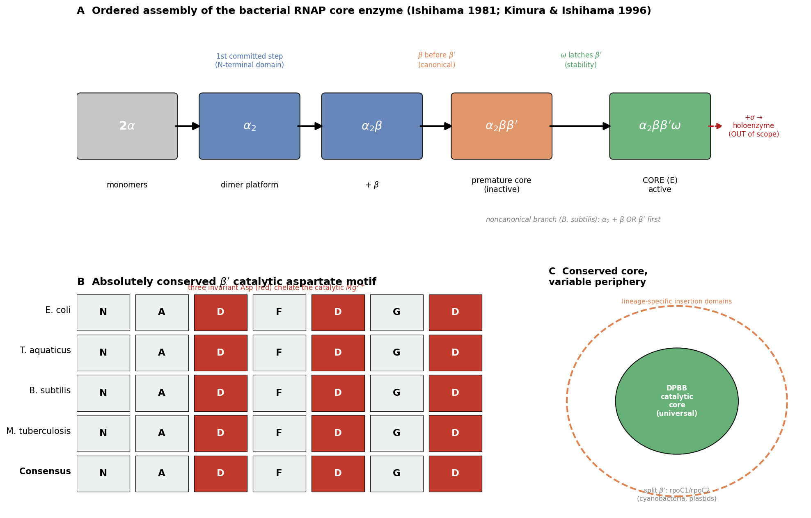

## Question

# Commissioned Review Brief

## Review Topic

Bacterial DNA-directed RNA polymerase core enzyme

## Working Scope

Species-neutral bacterial module for the DNA-directed RNA polymerase core enzyme that carries out DNA-templated RNA synthesis. The conserved bacterial core enzyme is built from an alpha dimer, beta and beta-prime catalytic cleft subunits, and the omega assembly/stability subunit. This module deliberately stops at the core enzyme and excludes sigma factors, transcription elongation factors, and promoter-specific regulatory proteins.

## Provisional Biological Outline

- Bacterial DNA-directed RNA polymerase core enzyme
  - 1. alpha dimer assembly platform
  - RpoA alpha dimer platform
    - rpoA: RNA polymerase alpha subunit (molecular player: bacterial DNA-directed RNA polymerase alpha subunit family; activity or role: protein dimerization activity)
  - 2. beta and beta-prime catalytic cleft
  - RpoB/RpoC catalytic cleft
    - rpoB: RNA polymerase beta subunit (molecular player: DNA-directed RNA polymerase beta subunit family; activity or role: contributes to DNA-directed RNA polymerase activity)
    - rpoC: RNA polymerase beta-prime subunit (molecular player: bacterial DNA-directed RNA polymerase beta-prime subunit family; activity or role: contributes to DNA-directed RNA polymerase activity)
  - 3. omega assembly and stability subunit
  - RpoZ omega assembly/stability subunit
    - rpoZ: RNA polymerase omega subunit (molecular player: DNA-directed RNA polymerase omega subunit family; activity or role: contributes to DNA-directed RNA polymerase activity)

## Known Relationships Among Steps

- RpoA alpha dimer platform feeds into RpoB/RpoC catalytic cleft: The alpha dimer provides the assembly platform for recruitment of the beta and beta-prime subunits into the core enzyme.
- RpoZ omega assembly/stability subunit promotes RpoB/RpoC catalytic cleft: The omega subunit supports proper assembly and stability of the beta/beta-prime-containing core enzyme.

## Assignment

Write a rigorous, review-style synthesis suitable for a molecular biology
audience. Treat the topic as a biological system whose boundaries, core
mechanisms, variants, and unresolved points should be made clear to readers who
know the field but are not specialists in this specific process.

The review should be explanatory rather than encyclopedic. Anchor broad claims
in primary literature or authoritative reviews, but keep the focus on how the
system works and how its parts fit together.

## Questions To Address

1. **Scope and boundaries**
   - What exactly is included in this biological system?
   - Which neighboring pathways, organelle processes, complexes, or regulatory
     events are often confused with it but should be treated separately?
   - Are there competing definitions in the literature?

2. **Core mechanism**
   - What is the best current model for the sequence of events?
   - Which steps are obligatory, which are conditional, and which are accessory?
   - What molecular assemblies, enzymes, receptors, adaptors, transporters, or
     structural units carry out each major step?

3. **Variation**
   - How does the system vary across major evolutionary lineages?
   - Are there well-supported differences between cell types, tissues,
     developmental stages, physiological states, or compartments?
   - Where are there alternative routes that achieve a similar outcome by
     different molecular means?

4. **Conservation and origin**
   - What is the deepest plausible evolutionary origin of the system?
   - Which parts appear ancient and conserved, and which appear to be later
     elaborations, replacements, or lineage-specific losses?
   - When a protein family has expanded, which family members are the best
     representatives for understanding the ancestral role?

5. **Physical and biological constraints**
   - What steps must occur in a particular order?
   - Which events are mutually exclusive, compartment-specific, cell-type
     specific, substrate-specific, or stage-specific?
   - What evidence rules out otherwise plausible paths through the system?

6. **Evidence and controversy**
   - Which mechanistic claims are strongly supported by experiments?
   - Where does the literature disagree, rely on indirect evidence, or mix data
     from organisms that may not be comparable?
   - What are the most important open questions?

## Output Format

Use the style and structure of a concise review article:

1. Executive summary
2. Definition and biological boundaries
3. Mechanistic overview
4. Major molecular players and active assemblies
5. Evolutionary and cell-biological variation
6. Constraints, dependencies, and failure modes
7. Controversies and open questions
8. Key references

Include citations for major claims, preferably PMIDs or DOIs. Be explicit about
uncertainty and avoid overgeneralizing from one organism, cell type, or assay
system to all biology.

## Output

# The Bacterial DNA-Directed RNA Polymerase Core Enzyme: A Mechanistic Review

*Commissioned review synthesis. Scope: the species-neutral bacterial core enzyme (α₂ββ′ω) that carries out DNA-templated RNA synthesis. Sigma factors, elongation factors, and promoter-specific regulators are explicitly out of scope.*

---

## 1. Executive Summary

The bacterial DNA-directed RNA polymerase (RNAP) **core enzyme** is a five-polypeptide, four-species assembly — two identical α subunits, one β, one β′, and one ω — with the canonical composition **α₂ββ′ω** (~380 kDa). It is the minimal machine that catalyzes template-directed phosphodiester bond formation; it is *sufficient* for RNA chain elongation but *not* for promoter-specific initiation, which requires a dissociable σ factor to form the holoenzyme (Eσ). The core is organized as a "crab-claw," with the two largest subunits (β and β′) forming the pincers and the catalytic cleft, a single catalytic Mg²⁺ held by an absolutely conserved β′ aspartate motif, the α dimer acting as the assembly platform on the back of the enzyme, and the small ω subunit clamping the β′ C-terminus to promote folding and stability (Zhang et al. 1999, PMID 10499798; Weiss et al. 2017, PMID 27799328).

{{figure:rnap_core_overview.png|caption=Figure 1. (A) Ordered assembly pathway of the core enzyme, from α monomers through the α₂ platform and the premature core to the active α₂ββ′ω enzyme; the σ-bound holoenzyme (dashed) is downstream and out of scope. (B) The absolutely conserved β′ active-site aspartate motif (NADFDGD): the three invariant Asp residues chelate the single catalytic Mg²⁺. (C) The "conserved core, variable periphery" principle — a universal double-psi-β-barrel (DPBB) catalytic core decorated by lineage-specific insertion domains, with genetic splitting of β′ (rpoC1/rpoC2) in cyanobacteria and plastids. Panel B is illustrative of the invariance emphasized by Zhang et al. 1999 (PMID 10499798).}}

Assembly is an **ordered pathway**: 2α → α₂ → α₂β → α₂ββ′ → (ω, maturation) → active core E (Ishihama 1981, PMID 7015808; Kimura & Ishihama 1996, PMID 9078382). The catalytic core (the double-psi β-barrel active site) and the α-dimerization module are among the most deeply conserved protein features in biology, traceable toward the last universal common ancestor (LUCA) and homologous to the cores of archaeal and eukaryotic RNAPs (Fouqueau et al. 2017, PMID 28657884; Onuoha et al. 2026, PMID 42417148). Below we define the system's boundaries, lay out the best current mechanistic model, catalogue the molecular players, and mark the places where evidence is lineage-specific or genuinely unresolved.

---

## 2. Definition and Biological Boundaries

### 2.1 What is included
The **core enzyme** is defined by composition and catalytic capability:
- **α₂** — a homodimer; assembly scaffold and platform for regulatory contacts (via the mobile C-terminal domain, αCTD).
- **β (rpoB)** and **β′ (rpoC)** — the two large subunits that build the DNA-binding channel, the catalytic center, the NTP-entry (secondary) channel, and the RNA-exit channel.
- **ω (rpoZ)** — a small subunit wrapped around the β′ C-terminus; an assembly/stability factor.

The functional signature of the core is **processive, template-directed RNA synthesis** (nucleotide addition cycle), independent of promoter recognition.

### 2.2 What is deliberately excluded (and commonly confused)
- **σ factors** convert core → holoenzyme and confer promoter specificity. They are dissociable and are *not* part of the core; including them changes the biological question from "how is RNA made" to "where does transcription start." (Ishihama 1981 shows σ acts as a regulatory maturation/initiation factor, not a stoichiometric core subunit.)
- **Elongation/termination factors** — NusG/Spt5, NusA, GreA/B, Mfd, Rho — act *on* the core but are separate machines (e.g., Mfd loading dynamics: Brewer et al. 2026, PMID 42444603; Rho spatial biology: Bossi et al. 2026, PMID 42366572). Spt5/NusG is the *only* transcription factor universally conserved across all three domains, and is still not a core subunit (Werner 2012, PMID 22306403).
- **Second-messenger regulators** — (p)ppGpp/DksA bind the *assembled* enzyme (β′–ω interface, site 1; secondary channel, site 2) to reprogram transcription; they are regulatory ligands, not structural components (Ortiz-Vasco et al. 2024, PMID 38574051).
- **Archaeal/eukaryotic nuclear RNAPs and organellar/single-subunit (phage-type) RNAPs** are evolutionarily related (multisubunit) or unrelated (T7-type) machines and should be treated separately, even though the multisubunit catalytic core is homologous.

### 2.3 Competing definitions
"Core enzyme" is used consistently to mean α₂ββ′ω. Two definitional wrinkles exist: (i) historically, ω was sometimes regarded as a copurifying contaminant / non-essential subunit, so older "core" preparations were treated as α₂ββ′; modern usage includes ω. (ii) In some Gram-positive and specialized bacteria, additional small subunits (e.g., δ, ε) copurify with RNAP and are sometimes discussed alongside the "core," but they are lineage-specific accessory subunits, not part of the universal core module.

---

## 3. Mechanistic Overview

### 3.1 Assembly: the obligatory ordered pathway
Reconstitution from purified E. coli subunits established a strictly stepwise route (Ishihama 1981, PMID 7015808):

> 2α → **α₂** → **α₂β** → **α₂ββ′** (premature core) → **E** (active core)

Key mechanistic points:
1. **α dimerization is the first committed step** and nucleates everything else, mediated by the α N-terminal domain (α-NTD, ≤ residue ~235). The interface is a defined side-chain cluster (e.g., F35, I46) conserved into Thermus (Kannan et al. 2001, PMID 11266593; Miyake et al. 1998, PMID 9477962).
2. **β loads before β′.** The α-NTD presents distinct surfaces for β and β′ recruitment (Kimura & Ishihama 1996, PMID 9078382). Long-range allosteric coupling within the assembling complex is real: an α-NTD mutation defective for β′ contact is suppressed by a distant β′ substitution (G333D) (Sujatha et al. 2001, PMID 11212907).
3. **Maturation to the active core** requires a conformational activation step; at low temperature the "premature core" (α₂ββ′) accumulates in an inactive but near-native conformation and matures only in the continued presence of σ or DNA (Ishihama 1981).
4. **ω joins to stabilize β′.** Its recruitment latches the β′ C-terminus, promoting correct folding and preventing β′ degradation/dissociation (Weiss et al. 2017, PMID 27799328).

**Obligatory vs. conditional vs. accessory:**
- *Obligatory:* α dimer formation → recruitment of the two large subunits → catalytic-cleft closure around a single Mg²⁺.
- *Conditional / lineage-variable:* the strict β-before-β′ order. In Bacillus subtilis a **noncanonical branch** exists in which the α dimer can associate with *either* β *or* β′ before completing the core (Tewary et al. 2026, PMID 42001948).
- *Accessory (important but not catalytically obligatory):* ω incorporation; the core can assemble and function without ω, but is less stable and more degradation-prone.

### 3.2 Catalysis: the nucleotide addition cycle (NAC)
The catalytic center lies at the β/β′ interface on the back wall of the main channel, with a single Mg²⁺ (Mg-I) chelated by the absolutely conserved β′ **NADFDGD** aspartate triad (Zhang et al. 1999, PMID 10499798). Each cycle:
1. NTP delivery through the secondary channel to the insertion (i+1) site.
2. **Trigger-loop (TL) folding** closes over the correctly paired NTP, positioning it for catalysis; the Rim-helices/F-loop couple to TL closure (Dhingra et al. 2026, PMID 42378287).
3. Two-metal-ion phosphoryl transfer extends the RNA by one nucleotide; pyrophosphate release.
4. **Bridge-helix / clamp** conformational oscillations drive single-nucleotide translocation; TL unfolds, resetting the cycle.

The clamp (largely β′) can open and close by tens of Å — cryo-EM of E. coli core versus the Taq crystal structure revealed ~25 Å channel opening — and these motions are functionally required and universally conserved across bacterial, archaeal, and eukaryotic RNAPs (Darst et al. 2002, PMID 11904365; Pilotto & Werner 2022, PMID 36144426).

---

## 4. Major Molecular Players and Active Assemblies

| Subunit (gene) | Copies | Family / role | Key mechanistic contributions |
|---|---|---|---|
| **α (rpoA)** | 2 | α-subunit family; protein dimerization | α-NTD forms the α₂ assembly platform and nucleates core assembly; presents β- and β′-binding surfaces. The **αCTD** is a mobile, flexibly tethered domain that stimulates initiation by binding UP-element DNA and activators (Fis, SoxS, TyrR, CAP) and by contacting σ region 4.2 — a *regulatory* interface outside the core's catalytic remit (Kimura & Ishihama 1996; Kannan et al. 2001; Ross et al. 2003, PMID 12756230; Aiyar et al. 2002, PMID 11866514). The functional split between α-NTD (assembly) and αCTD (regulation) within one subunit is a clean illustration of where the core module's boundary lies. |
| **β (rpoB)** | 1 | β-subunit family (double-psi β-barrel) | Forms one pincer of the crab claw and part of the catalytic cleft, NTP-binding, and the rifampicin pocket adjacent to the active site. Rif-resistance mutations (e.g., βS450L in M. tuberculosis) cluster in conserved rpoB regions (Zhang et al. 1999; Eckartt et al. 2026, PMID 42156950). |
| **β′ (rpoC)** | 1 | β′-subunit family (double-psi β-barrel) | Second pincer; carries the catalytic Mg²⁺ (NADFDGD), the bridge helix, the trigger loop, and the mobile clamp; contains the σ-binding coiled-coil (β′ 260–309 in E. coli) (Zhang et al. 1999; Arthur et al. 2000, PMID 10764785). |
| **ω (rpoZ)** | 1 | ω-subunit family; RPB6 homolog | Wraps the β′ C-terminus; chaperones β′ folding and retains it in the assembled enzyme; provides part of the (p)ppGpp site-1 surface at the β′–ω interface (Weiss et al. 2017; Chatterji et al. 2007, PMID 17233676). |

**Active assemblies along the pathway:** α (monomer) → α₂ (platform) → α₂β → α₂ββ′ (premature core; catalytically inert, near-native fold) → **α₂ββ′ω = core (E)** → +σ → **Eσ holoenzyme** (initiation-competent; out of scope but the immediate downstream product).

---

## 5. Evolutionary and Cell-Biological Variation

### 5.1 Deep conservation and origin
The **catalytic core is LUCA-deep.** All cellular (multisubunit) RNAPs share a two-**double-psi β-barrel (DPBB)** active-site configuration and a homologous β/β′ catalytic module; this architecture is traceable across all three domains and is one of the strongest molecular arguments for a single origin of cellular transcription (Burton 2014, PMID 25764332; Fouqueau et al. 2017, PMID 28657884). Bacterial β and β′ are single polypeptides; in archaea and eukaryotes each is split into two (Rpo/Rpb) chains, but the fold and active-site geometry are preserved.

### 5.2 The α platform and its representatives
The **α dimerization module** is ancient. It began as a *homodimeric* scaffold in bacteria (best represented by bacterial α₂) and was later duplicated and partitioned into *asymmetric heterodimers* in archaea (Rpo3/Rpo11) and eukaryotes (RPB3/RPB11 for Pol II; paralogs for Pol I/III) (Onuoha et al. 2026, PMID 42417148). Thus the bacterial α homodimer is the best living representative of the ancestral assembly platform. ω is homologous to eukaryotic **RPB6** — an ancient, conserved small subunit — reinforcing that all four core species predate the bacterial/archaeal split.

### 5.3 Lineage- and state-specific variation
- **Assembly order is not universally linear:** the B. subtilis "α binds β *or* β′ first" branch shows the pathway topology varies between Gram-negative and Gram-positive lineages (Tewary et al. 2026, PMID 42001948).
- **ω's regulatory role is lineage-variable:** ω contributes to (p)ppGpp binding and relA/stringent-response tuning in E. coli, but the key ppGpp-coordinating residues are *not* conserved in S. aureus, where rpoZ deletion does not impair starvation survival even though it destabilizes the enzyme (Weiss et al. 2017; Chatterji et al. 2007). Its structural chaperone role is conserved; its second-messenger role is not.
- **Subunit-architecture variation:** the *fold* is universal but its packaging is not. In cyanobacteria and chloroplast (plastid-encoded) RNAPs the β′ subunit is split across two genes (rpoC1/rpoC2), i.e. the single bacterial polypeptide is encoded as two chains that reconstitute the same crab-claw geometry — an alternative genetic route to the same structural outcome. Superimposed on the conserved core are lineage-specific insertion/"sequence-insertion" domains within β and β′ that vary greatly in size between phyla (large in E. coli, minimal in Thermus), decorating but not altering the catalytic center (consistent with the conserved-core/variable-periphery picture of Fouqueau et al. 2017; Onuoha et al. 2026). *Caveat:* these architectural variants are established from comparative genomics/structures across a modest set of taxa and are noted here rather than exhaustively sampled.
- **Accessory small subunits** (δ, ε in Firmicutes) modulate core behavior in some Gram-positives but are absent in E. coli — variation at the *periphery* of the core, not its catalytic heart. In several Gram-positive and actinobacterial lineages, ancillary factors (e.g., the δ subunit, HelD-type ATPases, RbpA/CarD) associate with the core to recycle or stabilize it, but these are dissociable accessory proteins, not universal core subunits, and are treated here as adjacent to the core module.
- **Physiological/spatial states:** the assembled core partitions with the nucleoid and forms clusters that reorganize between exponential and stationary phase (Bossi et al. 2026, PMID 42366572) — a cell-biological, not compositional, variation.

---

## 6. Constraints, Dependencies, and Failure Modes

**Ordering constraints (what must precede what):**
1. α₂ must form before the large subunits can be recruited — no productive α-monomer→β complex is the committed route.
2. In the canonical (enterobacterial) pathway, β loads before β′; the premature core α₂ββ′ must undergo a conformational **maturation** step to become catalytically active.
3. ω acts on β′ *after* β′ is in the complex — it is a stabilizer of an existing subunit, not an initiator of assembly.

**Mutually exclusive / conditional events:**
- Core assembly and promoter-specific initiation are temporally separated: σ binding (holoenzyme formation) is downstream of core maturation and is reversible (σ cycling).
- (p)ppGpp/DksA regulation requires an *already assembled* enzyme; it cannot substitute for assembly.

**Failure modes (evidence-backed):**
- **Loss of ω:** β′ misfolding/degradation, δ/σ imbalance, and general RNAP dissociation, with downstream stress-resistance and biofilm defects (S. aureus; Weiss et al. 2017). This is the clearest demonstration that ω's job is to keep β′ folded and the core intact.
- **Defective α–large-subunit contacts:** ts α mutants (e.g., R45C defective for β binding; C131A defective for β′ contact) arrest assembly at defined intermediates; some are rescued by second-site β′ suppressors, revealing long-range allosteric coupling (Sujatha et al. 2001, PMID 11212907).
- **Catalytic-cleft perturbation:** rifampicin binding in the β pocket sterically blocks nascent RNA extension; resistance requires β mutations that also carry collateral fitness costs via transcription attenuation (Eckartt et al. 2026, PMID 42156950).

**What the evidence rules out:** the historical view of ω as a dispensable contaminant is refuted — it has a definite β′-chaperone function. The idea that assembly could begin from a β/β′ heterodimer without α is not supported by reconstitution; α₂ is the obligatory nucleus.

---

## 7. Controversies and Open Questions

1. **How linear is assembly, really?** The classic enterobacterial β-before-β′ order is challenged by the B. subtilis noncanonical branch (Tewary et al. 2026). Whether parallel routes coexist in a single organism, and how dedicated assembly chaperones (e.g., the RbpA/HelD-type factors, GroEL) bias flux, remains open.
2. **Is ω essential?** ω is dispensable for viability in E. coli and S. aureus under standard conditions but is required for full stability and stress fitness. The boundary between "accessory" and "required" is condition- and lineage-dependent — a genuine definitional and biological ambiguity.
3. **Structural vs. regulatory ω:** the chaperone function appears universal; the (p)ppGpp-binding/stringent role is not conserved (E. coli vs. S. aureus). Disentangling these two roles across taxa needs more comparative structural and genetic work.
4. **Organism-mixing caveat:** much mechanistic detail comes from three model systems — E. coli (genetics/assembly), Thermus (crystallography), and Mycobacterium (drug resistance). Extrapolating quantitative claims (rates, stabilities, residue-level roles) across these and to under-studied phyla risks conflating lineage-specific features with universal ones. Several "universal" statements rest on structural homology plus a handful of organisms rather than broad experimental sampling.
5. **Active-site dynamics:** the precise coupling of trigger-loop folding, bridge-helix bending, and translocation is still being refined with new inhibitor-trapped structures (Dhingra et al. 2026); the energetic model of the NAC is not fully settled.

---

## 8. Key References

- Zhang G, Campbell EA, Minakhin L, Richter C, Severinov K, Darst SA. *Crystal structure of Thermus aquaticus core RNA polymerase at 3.3 Å resolution.* **Cell** 98:811–824 (1999). PMID 10499798.
- Darst SA, Opalka N, Chacon P, et al. *Conformational flexibility of bacterial RNA polymerase.* **PNAS** (2002). PMID 11904365.
- Ishihama A. *Subunit assembly of Escherichia coli RNA polymerase.* (1981). PMID 7015808.
- Kimura M, Ishihama A. *Subunit assembly in vivo of E. coli RNA polymerase: role of the N-terminal assembly domain of α.* (1996). PMID 9078382.
- Kannan N, Chander P, Ghosh P, Vishveshwara S, Chatterji D. *Stabilizing interactions in the α-subunit dimer interface.* (2001). PMID 11266593.
- Miyake R, Murakami K, et al. *Dimeric association of E. coli RNAP α subunits.* (1998). PMID 9477962.
- Sujatha S, Ishihama A, Chatterji D. *Functional complementation between distant α and β′ positions.* (2001). PMID 11212907.
- Weiss A, Moore BD, Tremblay MHJ, Chaput D, Kremer A, Shaw LN. *The ω subunit governs RNAP stability and transcriptional specificity in S. aureus.* (2017). PMID 27799328.
- Chatterji D, Ogawa Y, Shimada T, Ishihama A. *Role of ω in expression of relA in E. coli.* (2007). PMID 17233676.
- Bhardwaj N, Syal K, Chatterji D. *Role of ω in stress response.* (2018). PMID 29542212.
- Tewary S, Chakraborty A, Sur S, Mukhopadhyay J. *A noncanonical RNAP assembly pathway in Bacillus subtilis.* (2026). PMID 42001948.
- Onuoha N, Belkevich, Palumbo, Knutson. *Alpha-like subunits of multisubunit RNA polymerases.* (2026). PMID 42417148.
- Fouqueau T, Blombach F, Werner F. *Evolutionary origins of two-barrel RNA polymerases.* (2017). PMID 28657884.
- Burton ZF. *Evolution of multi-subunit RNA polymerases…* (2014). PMID 25764332.
- Dhingra S, Landick R, Campbell EA, Darst SA. *RNAP inhibitors reveal active-site motions essential for the NAC.* (2026). PMID 42378287.
- Eckartt K, et al. *Transcription attenuation amplifies collateral vulnerabilities in rifampicin-resistant M. tuberculosis.* (2026). PMID 42156950.
- Werner F. *A nexus for gene expression — Spt5 and NusG in three domains of life.* (2012). PMID 22306403.
- Pilotto S, Werner F. *How to shut down transcription in Archaea during virus infection.* (2022). PMID 36144426.
- Ross W, Schneider DA, Paul BJ, Mertens A, Gourse RL. *Intersubunit contact stimulating transcription initiation: αCTD and σ region 4.* (2003). PMID 12756230.
- Aiyar SE, McLeod SM, Ross W, et al. *Architecture of Fis-activated transcription complexes at rrnB P1/rrnE P1.* (2002). PMID 11866514.
- Arthur TM, Anthony LC, Burgess RR. *Mutational analysis of β′260–309, a σ⁷⁰ binding site on E. coli core RNAP.* (2000). PMID 10764785.

---

*Uncertainty note:* Quantitative and residue-level claims derive predominantly from E. coli, Thermus, and Mycobacterium. Universality statements about assembly order, ω function, and active-site dynamics rest on structural homology plus a limited set of model organisms and should not be over-generalized to all bacterial phyla.

## Artifacts

- [OpenScientist final report](bacterial_rna_polymerase_core-deep-research-openscientist_artifacts/final_report.html)
- [OpenScientist final report](bacterial_rna_polymerase_core-deep-research-openscientist_artifacts/final_report.pdf)
- [OpenScientist rnap core overview](bacterial_rna_polymerase_core-deep-research-openscientist_artifacts/provenance_rnap_core_overview.json)
