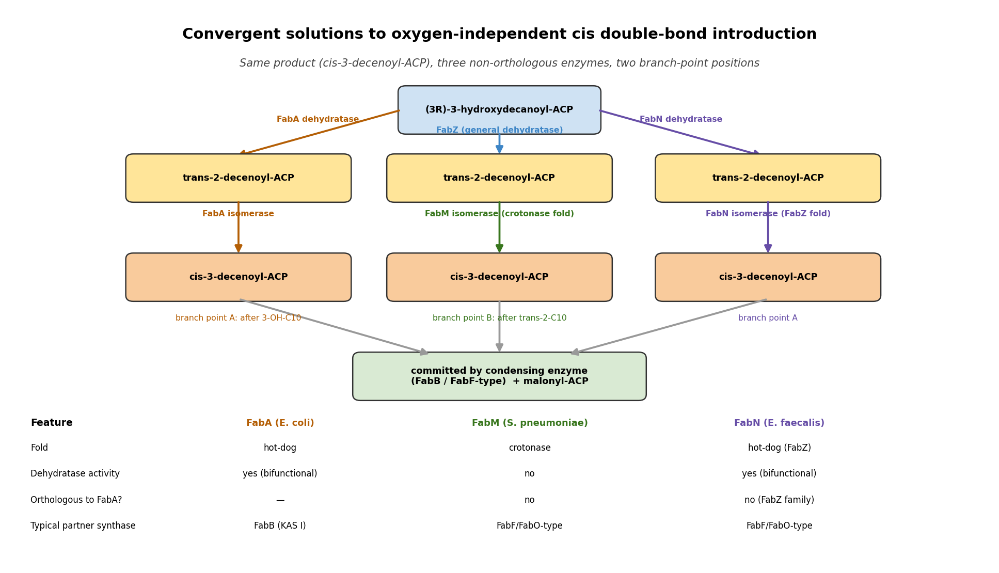
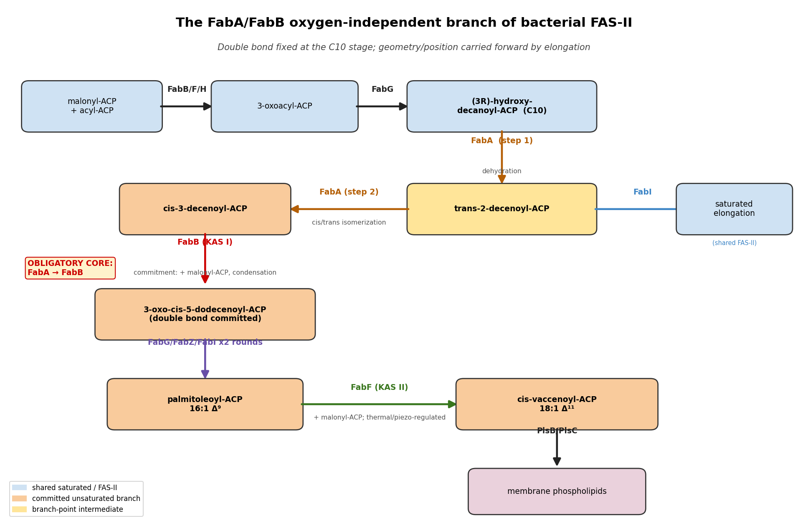

## Question

# Commissioned Review Brief

## Review Topic

Bacterial FabA/FabB unsaturated-fatty-acid biosynthesis

## Working Scope

A reusable oxygen-independent branch of bacterial type-II fatty-acid synthesis in which FabA dehydrates 3-hydroxydecanoyl-ACP and isomerizes the resulting trans-2-decenoyl-ACP to cis-3-decenoyl-ACP, FabB commits that intermediate to elongation, and FabF can extend palmitoleoyl-ACP toward cis-vaccenoyl-ACP. General FAS-II reduction and dehydration reactions are shared with saturated-fatty-acid synthesis and are outside this focused branch.

## Provisional Biological Outline

- Bacterial FabA/FabB unsaturated-fatty-acid biosynthesis
  - 1. decanoyl-branch dehydration
  - FabA 3-hydroxydecanoyl-ACP dehydration
    - FabA 3-hydroxydecanoyl-ACP dehydratase (molecular player: FabA-family dehydratase/isomerases; activity or role: (3R)-hydroxyacyl-acyl-carrier-protein dehydratase activity)
  - 2. cis double-bond introduction
  - FabA trans-2-decenoyl-ACP isomerization
    - FabA trans-2-decenoyl-ACP isomerase (molecular player: FabA-family dehydratase/isomerases; activity or role: trans-2-decenoyl-acyl-carrier-protein isomerase activity)
  - 3. committed unsaturated-chain elongation
  - FabB cis-3-decenoyl-ACP condensation
    - FabB 3-oxoacyl-ACP synthase I (molecular player: FabB/KAS-I condensing enzymes; activity or role: 3-oxoacyl-acyl-carrier-protein synthase activity)
  - 4. long-chain unsaturated-product extension
  - FabF palmitoleoyl-ACP condensation
    - FabF 3-oxoacyl-ACP synthase II (molecular player: FabF/KAS-II condensing enzymes; activity or role: 3-oxoacyl-acyl-carrier-protein synthase activity)

## Known Relationships Among Steps

- FabA 3-hydroxydecanoyl-ACP dehydration feeds into FabA trans-2-decenoyl-ACP isomerization: The first FabA reaction supplies trans-2-decenoyl-ACP.
- FabA trans-2-decenoyl-ACP isomerization feeds into FabB cis-3-decenoyl-ACP condensation: FabA supplies cis-3-decenoyl-ACP to FabB.
- FabB cis-3-decenoyl-ACP condensation precedes FabF palmitoleoyl-ACP condensation

## Assignment

Write a rigorous, review-style synthesis suitable for a molecular biology
audience. Treat the topic as a biological system whose boundaries, core
mechanisms, variants, and unresolved points should be made clear to readers who
know the field but are not specialists in this specific process.

The review should be explanatory rather than encyclopedic. Anchor broad claims
in primary literature or authoritative reviews, but keep the focus on how the
system works and how its parts fit together.

## Questions To Address

1. **Scope and boundaries**
   - What exactly is included in this biological system?
   - Which neighboring pathways, organelle processes, complexes, or regulatory
     events are often confused with it but should be treated separately?
   - Are there competing definitions in the literature?

2. **Core mechanism**
   - What is the best current model for the sequence of events?
   - Which steps are obligatory, which are conditional, and which are accessory?
   - What molecular assemblies, enzymes, receptors, adaptors, transporters, or
     structural units carry out each major step?

3. **Variation**
   - How does the system vary across major evolutionary lineages?
   - Are there well-supported differences between cell types, tissues,
     developmental stages, physiological states, or compartments?
   - Where are there alternative routes that achieve a similar outcome by
     different molecular means?

4. **Conservation and origin**
   - What is the deepest plausible evolutionary origin of the system?
   - Which parts appear ancient and conserved, and which appear to be later
     elaborations, replacements, or lineage-specific losses?
   - When a protein family has expanded, which family members are the best
     representatives for understanding the ancestral role?

5. **Physical and biological constraints**
   - What steps must occur in a particular order?
   - Which events are mutually exclusive, compartment-specific, cell-type
     specific, substrate-specific, or stage-specific?
   - What evidence rules out otherwise plausible paths through the system?

6. **Evidence and controversy**
   - Which mechanistic claims are strongly supported by experiments?
   - Where does the literature disagree, rely on indirect evidence, or mix data
     from organisms that may not be comparable?
   - What are the most important open questions?

## Output Format

Use the style and structure of a concise review article:

1. Executive summary
2. Definition and biological boundaries
3. Mechanistic overview
4. Major molecular players and active assemblies
5. Evolutionary and cell-biological variation
6. Constraints, dependencies, and failure modes
7. Controversies and open questions
8. Key references

Include citations for major claims, preferably PMIDs or DOIs. Be explicit about
uncertainty and avoid overgeneralizing from one organism, cell type, or assay
system to all biology.

## Output

# Bacterial FabA/FabB Unsaturated–Fatty-Acid Biosynthesis: A Mechanistic Review

*A commissioned review-style synthesis for a molecular-biology audience*

---

## 1. Executive Summary

Bacterial unsaturated fatty acids (UFAs) can be made **without molecular oxygen**, using a small, self-contained detour within the otherwise ordinary type-II fatty-acid synthesis (FAS-II) elongation cycle. In *Escherichia coli* and other γ-proteobacteria the detour is defined by three dedicated activities layered onto shared FAS-II chemistry: (i) the **bifunctional hot-dog-fold enzyme FabA**, which dehydrates (3*R*)-hydroxydecanoyl-ACP to *trans*-2-decenoyl-ACP and then isomerizes a portion of that intermediate to *cis*-3-decenoyl-ACP in a single two-base (His/Asp) active site; (ii) **FabB (β-ketoacyl-ACP synthase I, KAS I)**, which captures the *cis*-3-decenoyl-ACP and elongates it, thereby *committing* the carbon to the unsaturated branch; and (iii) **FabF (KAS II)**, which extends palmitoleoyl-ACP (16:1) to *cis*-vaccenoyl-ACP (18:1) and doubles as the thermal/pressure sensor that tunes membrane fluidity. The obligatory core of the system is the **FabA→FabB hand-off**; FabF elongation is accessory and regulatory.

Two features make this system conceptually important beyond its metabolic role. First, the cis double bond is installed **once, at the C10 stage**, and is thereafter merely propagated by standard elongation chemistry — the geometry and position of the bond are fixed early and are never revisited. Second, the commitment step does **not** appear to require a physical FabA–FabB complex; instead, FabB's kinetic affinity for the labile *cis*-3-decenoyl-ACP intermediate pulls flux into the branch. This "kinetic channeling" model is central to understanding why the pathway works and why it is vulnerable to specific inhibitors (cerulenin, thiolactomycin) that target FabB.

The system is also a textbook case of **convergent evolution**. Many UFA-producing bacteria lack FabA entirely and solve the isomerization problem with non-orthologous enzymes: the crotonase-superfamily **FabM** (*Streptococcus pneumoniae*) or the FabZ-family **FabN** (*Enterococcus faecalis*). The core condensation (thiolase-fold KAS) and general dehydration (hot-dog-fold FabZ) machinery is ancient and broadly conserved, whereas the **isomerase function is a repeatedly re-invented, later elaboration**. The strong implication — and a recurring caution in this review — is that the *E. coli* FabA/FabB paradigm should not be over-generalized to all bacteria.

---

## 2. Definition and Biological Boundaries

### 2.1 What is included

The system, defined narrowly, comprises four catalytic events superimposed on FAS-II:

1. **Decanoyl-branch dehydration** — FabA converts (3*R*)-hydroxydecanoyl-ACP to *trans*-2-decenoyl-ACP.
2. **Cis double-bond introduction** — FabA isomerizes *trans*-2-decenoyl-ACP to *cis*-3-decenoyl-ACP.
3. **Committed elongation** — FabB condenses *cis*-3-decenoyl-ACP with malonyl-ACP, carrying the double bond forward.
4. **Long-chain extension** — FabF elongates palmitoleoyl-ACP (16:1Δ9) to *cis*-vaccenoyl-ACP (18:1Δ11).

The distinguishing chemistry is the **FabA isomerization** and the **FabB commitment**. Everything upstream (initiation, the first condensations) and the reductase/general-dehydratase steps of each elongation round (FabG, FabZ, FabI) are shared with saturated-fatty-acid (SFA) synthesis and lie **outside** the focused branch.

### 2.2 Neighboring processes often confused with this system

- **General FAS-II saturated synthesis.** FabZ (the general β-hydroxyacyl-ACP dehydratase), FabG (ketoreductase), and FabI (enoyl reductase) operate in every elongation round for *both* saturated and unsaturated products. They are enabling infrastructure, not part of the UFA branch per se.
- **Aerobic (oxygen-dependent) desaturation.** Many bacteria (and all eukaryotes) introduce double bonds *post*-synthetically using O₂-dependent acyl-lipid or acyl-CoA desaturases. This is a mechanistically unrelated route to the same chemical outcome and must be treated separately.
- **Initiation chemistry (FabH / malonyl-ACP decarboxylase).** The priming condensation is distinct from the elongation-committed FabB step, although — as noted below — FabB can, in some species, also initiate.
- **Downstream phospholipid assembly and membrane remodeling** (e.g., cardiolipin/phosphatidylglycerol balance) responds to UFA supply but is not part of UFA synthesis.

### 2.3 Competing definitions

The principal definitional tension is whether the "branch point" is fixed. In *E. coli* the branch occurs **after β-hydroxydecanoyl-ACP** (because FabA both dehydrates and isomerizes). In *S. pneumoniae*, which uses FabM, the branch occurs **after *trans*-2-decenoyl-ACP**, because the dehydration is performed by the general dehydratase and only the isomerization is dedicated ([PMID: 12237320](https://pubmed.ncbi.nlm.nih.gov/12237320/)). Thus "the branch point" is organism-dependent, and any general definition must be stated at the level of *function* (dedicated isomerization + committed elongation), not a specific enzyme or intermediate.

---

## 3. Mechanistic Overview

### 3.1 The best current model

{{figure:fabA_fabB_pathway_schematic.png|caption=The FabA/FabB oxygen-independent unsaturated-fatty-acid branch. FAS-II elongation proceeds normally until the C10 stage, where FabA dehydrates (3R)-hydroxydecanoyl-ACP to trans-2-decenoyl-ACP and isomerizes part of it to cis-3-decenoyl-ACP. FabB (KAS I) selectively captures the cis-3 intermediate, committing it to elongation; the double bond is then propagated by standard chemistry to palmitoleoyl-ACP (16:1), which FabF (KAS II) extends to cis-vaccenoyl-ACP (18:1).}}

The canonical *E. coli* sequence is:

```
   ...FAS-II elongation to C10...
          │
   (3R)-3-hydroxydecanoyl-ACP
          │  FabA dehydratase
          ▼
   trans-2-decenoyl-ACP ───────────► (general elongation → saturated 10:0, 12:0, 14:0, 16:0)
          │  FabA isomerase (reversible, partitions flux)
          ▼
   cis-3-decenoyl-ACP
          │  FabB commitment (KAS I condensation with malonyl-ACP)
          ▼
   cis-5-dodecenoyl-ACP → ... → palmitoleoyl-ACP (16:1 Δ9)
          │  FabF elongation (KAS II)
          ▼
   cis-vaccenoyl-ACP (18:1 Δ11)
```

The essential logic: a **single kinetic decision at C10** determines saturated versus unsaturated fate. FabA sits at the junction, and the reversible isomerization it catalyzes generates the branch-specific *cis*-3 intermediate; FabB then pulls that intermediate forward before the general elongation machinery can reclaim it.

### 3.2 Obligatory, conditional, and accessory steps

| Step | Enzyme | Status | Rationale |
|------|--------|--------|-----------|
| C10 dehydration | FabA | **Obligatory** (in *E. coli*-type organisms) | Produces the *trans*-2 substrate for isomerization |
| C10 isomerization | FabA (or FabM/FabN) | **Obligatory (functionally)** | The defining UFA-specific reaction; without it, no anaerobic UFA |
| Commitment | FabB | **Obligatory** | Only FabB efficiently elongates *cis*-3-decenoyl-ACP; loss → UFA auxotrophy |
| 16:1 → 18:1 extension | FabF | **Accessory / conditional** | Governs *cis*-vaccenate content and thermal adaptation, but not UFA synthesis itself |

### 3.3 Molecular assemblies

All steps operate on **acyl-carrier-protein (ACP) thioesters**, not CoA, and all enzymes are discrete, soluble proteins characteristic of dissociated FAS-II (in contrast to mammalian megasynthase FAS-I). FabA is a **symmetric homodimer** with a shared, inter-subunit active site; FabB and FabF are **thiolase-fold homodimers** whose active sites are likewise built from both subunits.

---

## 4. Major Molecular Players and Active Assemblies

### 4.1 FabA — the bifunctional branch-point enzyme (Finding F001)

FabA (β-hydroxydecanoyl thioester dehydrase) is the linchpin. Crystal structures of the *E. coli* enzyme at 2.0 Å — both free and inactivated by the classic mechanism-based inhibitor **3-decynoyl-*N*-acetylcysteamine** — reveal a **symmetric dimer with an α+β "hot-dog" fold**, in which each active site lies *between* the two subunits and contains, as its only reactive groups, a **histidine from one subunit and an aspartate from the other** ([PMID: 8805534](https://pubmed.ncbi.nlm.nih.gov/8805534/)). This architecture supports a **two-base mechanism**, in which the His and Asp cooperatively catalyze both the dehydration and the double-bond isomerization on the same C10-ACP substrate. As the authors state, *"Dehydrase catalyzes reactions of dehydration and of double-bond isomerization on 10-carbon thiol esters of acyl carrier protein (ACP),"* and *"A two-base mechanism by which the histidine and aspartic acid together catalyze dehydration and isomerization reactions is consistent with the active-site structure."*

Earlier mechanism-based labeling with ¹⁴C-3-decynoyl-*N*-acetylcysteamine identified the catalytic histidine as **His-70**, adjacent to Cys-69 ([PMID: 2832401](https://pubmed.ncbi.nlm.nih.gov/2832401/)). The remarkable feature is the **economy of catalysis**: two chemically distinct reactions (β-elimination and allylic isomerization) share one small active site, and the isomerization simply repositions the double bond from Δ2-*trans* to Δ3-*cis*. This dual activity is what makes FabA both a general dehydratase surrogate at C10 and the gateway to unsaturation.

### 4.2 FabB — the commitment condensing enzyme (Finding F002)

FabB (KAS I) converts a *reversible* isomerization into an *irreversible* commitment. In reconstituted *E. coli* FAS-II, FabA is essentially **inactive on long-chain unsaturated β-hydroxyacyl-ACPs**, and productive introduction of the double bond at C10 was **detected only in the presence of FabB** ([PMID: 8910376](https://pubmed.ncbi.nlm.nih.gov/8910376/)): *"The introduction of the double bond at the 10-carbon stage of fatty acid synthesis by FabA was only detected in the presence of beta-ketoacyl-ACP synthase I (FabB)."*

Crucially, a yeast two-hybrid analysis **failed to detect a FabA–FabB interaction**, so the channeling toward UFAs was attributed to **FabB's intrinsic affinity for *cis*-decenoyl-ACP** rather than to a physical enzyme complex: *"the channeling of intermediates toward unsaturated fatty acid synthesis by FabB was attributed to the affinity of the condensing enzyme for cis-decenoyl-ACP."* This **kinetic-channeling** model — commitment by substrate selectivity, not by metabolon assembly — is the mechanistic heart of the pathway.

FabB is also the **physiological target of two natural-product antibiotics**: cerulenin (a covalent active-site inhibitor) and thiolactomycin (TLM). Overproduction of FabB imparts TLM resistance, confirming FabB as a major TLM target ([PMID: 1729241](https://pubmed.ncbi.nlm.nih.gov/1729241/)). Structural studies of the cerulenin–KAS complex show the inhibitor covalently bound to the active-site cysteine in a hydrophobic dimer-interface pocket ([PMID: 10037680](https://pubmed.ncbi.nlm.nih.gov/10037680/)), and the KAS I fold and catalytic model are well established ([PMID: 10571059](https://pubmed.ncbi.nlm.nih.gov/10571059/), [PMID: 11171140](https://pubmed.ncbi.nlm.nih.gov/11171140/)).

### 4.3 FabF — long-chain extension and the thermal/pressure regulator (Finding F003)

FabF (KAS II) performs the final, accessory extension and, in doing so, becomes the **membrane-fluidity thermostat**. *fabF*-null *E. coli* cannot synthesize *cis*-vaccenic acid (18:1) and fail to raise unsaturation upon a temperature downshift; *fabF* is the structural gene for synthase II ([PMID: 6339472](https://pubmed.ncbi.nlm.nih.gov/6339472/)). Elegantly, overproducing FabB can restore *cis*-vaccenate synthesis in a *fabF* strain, **but the restored synthesis is temperature-independent** — demonstrating that **FabF alone confers the temperature-dependent acyl-chain composition** ([PMID: 6337151](https://pubmed.ncbi.nlm.nih.gov/6337151/)): *"synthase II, the product of the fabF gene, is the sole enzyme regulating the temperature-dependent composition of the membrane phospholipid acyl chains."*

This regulatory role extends to other physical stresses. In the deep-sea piezophile *Photobacterium profundum* SS9, a *fabF* disruption **impairs growth at elevated hydrostatic pressure and diminishes *cis*-vaccenic acid production** ([PMID: 10671446](https://pubmed.ncbi.nlm.nih.gov/10671446/)), showing that FabF governs **pressure-regulated** as well as temperature-regulated membrane adaptation.

### 4.4 Transcriptional control: FabR and FadR (Finding F005)

The branch is gated at the level of transcription by two regulators that sense the **acyl-thioester pool**:

- **FabR (repressor).** FabR represses *fabB* and *fabA*. Its DNA binding to a palindrome in the *fabB/fabA* promoters **requires unsaturated acyl-ACP or acyl-CoA and is antagonized by saturated acyl-thioesters** ([PMID: 19854834](https://pubmed.ncbi.nlm.nih.gov/19854834/)): *"FabR binding to a DNA palindrome located within the promoters of the fabB and fabA genes required the presence of an unsaturated acyl-acyl carrier protein (ACP) or acyl-CoA and was antagonized by saturated acyl-ACP or acyl-CoA."* This makes FabR a feedback sensor that holds the UFA:SFA ratio steady.
- **FadR (activator).** FadR **positively regulates *fabB*** (and *fabA*) ([PMID: 11566998](https://pubmed.ncbi.nlm.nih.gov/11566998/)). *fabB fadR* double mutants are synthetically lethal, and *fadR* strains are hypersensitive to cerulenin — consistent with FadR maintaining sufficient FabB expression for viable UFA synthesis.

Together, FabR and FadR form a **push-pull system** that tunes the flux entering the FabA/FabB branch in response to the cell's current lipid state.

---

## 5. Evolutionary and Cell-Biological Variation

### 5.1 Convergent isomerase solutions (Finding F004)

The most striking variation is that **the FabA/FabB apparatus is only one of several convergent solutions** to the anaerobic-UFA problem.

{{figure:convergent_isomerases_comparison.png|caption=Three convergent, oxygen-independent isomerase solutions. FabA (Proteobacteria) is a hot-dog-fold dehydratase/isomerase acting after 3-hydroxydecanoyl-ACP. FabM (Streptococcus) is an unrelated crotonase-superfamily isomerase acting after trans-2-decenoyl-ACP, with no dehydratase activity. FabN (Enterococcus) is a FabZ-family dehydratase that has acquired isomerase activity via its β3/β4 substrate-tunnel strands. The branch-point position and partner condensing enzymes differ accordingly.}}

- **FabM (*Streptococcus pneumoniae*).** Many UFA-producing bacteria lack any *fabA* homolog. *S. pneumoniae* uses **FabM**, a **tetrameric *trans*-2/*cis*-3-decenoyl-ACP isomerase of the hydratase/isomerase (crotonase) superfamily** with **no similarity to FabA and no dehydratase activity** ([PMID: 12237320](https://pubmed.ncbi.nlm.nih.gov/12237320/)): *"This tetrameric enzyme, designated FabM, has no similarity to FabA, but rather is a member of the hydratase/isomerase superfamily."* Because FabM only isomerizes, the **branch point shifts to after *trans*-2-decenoyl-ACP formation**, unlike the *E. coli* branch after β-hydroxydecanoyl-ACP.
- **FabN (*Enterococcus faecalis*).** *E. faecalis* instead uses **FabN**, a **FabZ-family dehydratase that has acquired isomerase activity**. Elegant domain-swapping experiments localized the isomerase determinant to the **β3/β4 strands** that shape the substrate tunnel: *"Substitution of the beta3 and beta4 strands of EfFabZ with the corresponding strands from EfFabN was necessary and sufficient to convert EfFabZ into an isomerase"* ([PMID: 15980063](https://pubmed.ncbi.nlm.nih.gov/15980063/)).

| Feature | FabA (E. coli) | FabM (S. pneumoniae) | FabN (E. faecalis) |
|---|---|---|---|
| Fold / superfamily | Hot-dog | Crotonase (hydratase/isomerase) | Hot-dog (FabZ-family) |
| Dehydratase activity | Yes | No | Yes |
| Isomerase activity | Yes | Yes | Yes |
| Oligomeric state | Dimer | Tetramer | Dimer |
| Branch point | After 3-OH-decanoyl-ACP | After *trans*-2-decenoyl-ACP | After 3-OH-decanoyl-ACP |
| Evolutionary relationship to FabA | — | Non-orthologous | Non-orthologous (FabZ elaboration) |

### 5.2 Variation in the condensing enzymes

The FabB/FabF distinction is itself lineage-variable. In *Plasmodium falciparum*, a **single condensing enzyme (PfFabB/F)** functions like *E. coli* FabF in complementation, rescuing growth only with oleate supplementation, and — unlike the bacterial enzyme — does **not** raise *cis*-vaccenate on cold-shift ([PMID: 19472174](https://pubmed.ncbi.nlm.nih.gov/19472174/)). In *Pseudomonas putida* F1, **FabB unexpectedly also initiates FAS**, decarboxylating malonyl-ACP and condensing the acetyl-ACP product — a role the *E. coli* paradigm FabB does not play ([PMID: 38335573](https://pubmed.ncbi.nlm.nih.gov/38335573/)). In *Pseudomonas aeruginosa*, *fabA* and *fabB* are co-transcribed as a *fabAB* operon, and mutants in either gene are UFA auxotrophs ([PMID: 9286984](https://pubmed.ncbi.nlm.nih.gov/9286984/)). These examples underscore that condensing-enzyme roles are **not fixed across lineages**.

### 5.3 Physiological-state variation

Even within one organism, output varies with environment: temperature (FabF thermal regulation), hydrostatic pressure (piezophiles), and membrane-lipid perturbations (e.g., *pgsA* mutants show altered UFA content, [PMID: 9178924](https://pubmed.ncbi.nlm.nih.gov/9178924/)) all reshape the saturated:unsaturated balance without changing the core enzymatic logic.

---

## 6. Conservation and Origin

### 6.1 Ancient scaffolds, re-invented function (Finding F006)

The core structural architectures are **ancient and broadly conserved**. The **thiolase fold** (FabB/FabF, FabH, chalcone synthase, and the ketosynthase domains of modular PKS/FAS systems) and the **hot-dog fold** (FabA/FabZ) are shared across FAS and polyketide-synthase biology, implying that the **condensing enzyme and the general dehydratase predate lineage-specific specialization**. The KAS catalytic machinery and its relationship to other Claisen-condensation enzymes are well characterized ([PMID: 11171140](https://pubmed.ncbi.nlm.nih.gov/11171140/), [PMID: 10571059](https://pubmed.ncbi.nlm.nih.gov/10571059/), [PMID: 10593943](https://pubmed.ncbi.nlm.nih.gov/10593943/)).

By contrast, the **isomerase capability is discontinuously distributed and mechanistically convergent**. It has been acquired **within a FabZ-type dehydratase scaffold** (FabA in Proteobacteria; FabN in *Enterococcus*, where β3/β4 tunnel strands confer it — [PMID: 15980063](https://pubmed.ncbi.nlm.nih.gov/15980063/)) or supplied by an **entirely unrelated crotonase-superfamily enzyme** (FabM in *Streptococcus* — [PMID: 12237320](https://pubmed.ncbi.nlm.nih.gov/12237320/)). The domain-swap result is especially telling: *"the isomerase potential of beta-hydroxyacyl-ACP dehydratases is determined by the properties of the beta-sheets that dictate the orientation of the central alpha-helix and thus the shape of the substrate binding tunnel rather than the catalytic machinery at the active site."*

The inference is that **the general dehydratase FabZ, not the isomerase-competent FabA, best represents the ancestral hot-dog role**. Isomerase activity looks like a small, tunnel-shaping modification (or an independent recruitment) layered onto an older dehydratase — a **later elaboration**, not a primordial feature. When choosing a representative of the ancestral state within the hot-dog family, **FabZ is the better model than FabA**. This is a well-reasoned inference from distribution and convergence patterns rather than a dated phylogenetic reconstruction, and is flagged as such.

---

## 7. Constraints, Dependencies, and Failure Modes

### 7.1 Order constraints

- The **double bond must be introduced at C10** and cannot be added at longer chain lengths: FabA is essentially inactive on long-chain unsaturated β-hydroxyacyl-ACPs ([PMID: 8910376](https://pubmed.ncbi.nlm.nih.gov/8910376/)). This **rules out** an otherwise plausible "desaturate late" path through the FAS-II intermediates.
- **Isomerization precedes commitment:** FabB acts on *cis*-3-decenoyl-ACP, which only exists after FabA (or FabM/FabN) has run.
- **Commitment precedes extension:** the *cis* double bond must be propagated through several rounds to reach 16:1 before FabF can make 18:1.

### 7.2 Mutually exclusive / conditional events

- At C10, the *trans*-2 intermediate can either be **claimed by general elongation (→ saturated)** or **isomerized and committed (→ unsaturated)**. These are competing fates decided kinetically.
- FabF's thermal regulation is **conditional on FabF itself**: FabB overexpression can substitute for bulk 18:1 synthesis but abolishes temperature responsiveness ([PMID: 6337151](https://pubmed.ncbi.nlm.nih.gov/6337151/)).

### 7.3 Failure modes

- **Loss of FabA or FabB → UFA auxotrophy** (growth rescued by exogenous oleate), as seen in *P. aeruginosa fabA/fabB* mutants ([PMID: 9286984](https://pubmed.ncbi.nlm.nih.gov/9286984/)).
- **Loss of FabF → loss of *cis*-vaccenate and thermal adaptation** ([PMID: 6339472](https://pubmed.ncbi.nlm.nih.gov/6339472/)), and piezophilic growth failure ([PMID: 10671446](https://pubmed.ncbi.nlm.nih.gov/10671446/)).
- **Regulatory failure:** *fabB fadR* double mutants are synthetically lethal ([PMID: 11566998](https://pubmed.ncbi.nlm.nih.gov/11566998/)); dysregulated FabR relieves or over-represses *fabA/fabB* ([PMID: 19854834](https://pubmed.ncbi.nlm.nih.gov/19854834/)).
- **Pharmacological inhibition:** cerulenin and thiolactomycin target FabB, selectively blocking UFA synthesis ([PMID: 1729241](https://pubmed.ncbi.nlm.nih.gov/1729241/), [PMID: 10037680](https://pubmed.ncbi.nlm.nih.gov/10037680/)).

---

## 8. Controversies and Open Questions

1. **Complex vs. kinetic channeling.** The prevailing model attributes FabA→FabB channeling to FabB's substrate affinity, with no detected FabA–FabB interaction ([PMID: 8910376](https://pubmed.ncbi.nlm.nih.gov/8910376/)). This rests partly on a negative result (yeast two-hybrid), which cannot exclude weak or transient, physiologically meaningful interactions. Whether any higher-order organization exists on ACP remains open.

2. **How general is the branch-point position?** Because FabM shifts the branch to after *trans*-2-decenoyl-ACP ([PMID: 12237320](https://pubmed.ncbi.nlm.nih.gov/12237320/)), statements about "the" branch point are organism-specific. Reviews that mix *E. coli* and Gram-positive data risk conflating distinct architectures.

3. **Condensing-enzyme role assignments are not portable.** *P. putida* FabB initiates FAS ([PMID: 38335573](https://pubmed.ncbi.nlm.nih.gov/38335573/)); *P. falciparum* has a single FabB/F that behaves like FabF but lacks thermal regulation ([PMID: 19472174](https://pubmed.ncbi.nlm.nih.gov/19472174/)). The clean *E. coli* FabB=commitment / FabF=elongation dichotomy is a special case.

4. **Structural basis of isomerization specificity.** The domain-swap work localizes isomerase potential to substrate-tunnel β-strands ([PMID: 15980063](https://pubmed.ncbi.nlm.nih.gov/15980063/)), but a full stereochemical mechanism unifying FabA and FabN — and the entirely independent FabM — is not yet resolved.

5. **Evolutionary polarity.** The claim that FabZ best represents the ancestral hot-dog role is a well-reasoned inference from distribution and convergence, not a phylogenetically dated reconstruction. Rigorous ancestral-sequence work is still needed.

---

## 9. Limitations and Knowledge Gaps

- **Organismal bias.** The mechanistic backbone derives overwhelmingly from *E. coli*, with structural work on a handful of enzymes. Generalizations to Gram-positives, Bacteroidetes, and diverse Proteobacteria are extrapolations.
- **Indirect evidence for channeling.** The "no complex" conclusion depends on a negative interaction assay; modern approaches (crosslinking-MS, cryo-EM on ACP-trapped intermediates, single-molecule kinetics) have not been comprehensively applied.
- **Regulatory scope.** FabR/FadR data are *E. coli*-centric; the regulatory logic in FabM/FabN organisms is comparatively underexplored.
- **Evolutionary claims are inferential.** Origin statements rest on fold distribution and convergence patterns rather than dated phylogenies or ancestral reconstructions.
- **This was a literature-synthesis investigation**, not a primary-data reanalysis; conclusions are only as strong as the cited experimental record.

---

## 10. Proposed Follow-up Experiments / Actions

1. **Directly test FabA–FabB co-organization** using in-vitro crosslinking mass spectrometry and cryo-EM with a trapped *cis*-3-decenoyl-ACP mimic, to move beyond the negative two-hybrid result.
2. **Single-turnover kinetics** measuring FabB's selectivity for *cis*-3- vs *trans*-2-decenoyl-ACP to quantify the kinetic-channeling model.
3. **Ancestral-sequence reconstruction** across the hot-dog (FabA/FabZ/FabN) family to formally test whether the ancestral node was a pure dehydratase.
4. **Cross-species complementation matrix** (FabA/FabM/FabN × FabB/FabF from multiple lineages) to map functional interchangeability and branch-point plasticity.
5. **Structural mechanism of FabM** (crotonase-fold isomerase) at atomic resolution to define the third, fully independent solution.
6. **Regulatory characterization in Gram-positives** to determine how FabM/FabN organisms tune UFA:SFA ratios in the absence of the FabR/FadR system.

---

## 11. Key References

| PMID | Relevance |
|------|-----------|
| [8805534](https://pubmed.ncbi.nlm.nih.gov/8805534/) | FabA 2.0 Å structure; hot-dog fold; His/Asp two-base dehydratase/isomerase mechanism (F001) |
| [2832401](https://pubmed.ncbi.nlm.nih.gov/2832401/) | Identification of catalytic His-70 via 3-decynoyl-NAC labeling (F001) |
| [8910376](https://pubmed.ncbi.nlm.nih.gov/8910376/) | FabA vs FabZ roles; double bond captured only with FabB; kinetic channeling (F002) |
| [1729241](https://pubmed.ncbi.nlm.nih.gov/1729241/) | FabB as thiolactomycin target; overexpression confers resistance (F002) |
| [10037680](https://pubmed.ncbi.nlm.nih.gov/10037680/) | Cerulenin–KAS complex structure (F002) |
| [10571059](https://pubmed.ncbi.nlm.nih.gov/10571059/) / [11171140](https://pubmed.ncbi.nlm.nih.gov/11171140/) | KAS I structure and catalytic model (F002) |
| [6337151](https://pubmed.ncbi.nlm.nih.gov/6337151/) | FabF is the sole thermal regulator of acyl-chain composition (F003) |
| [6339472](https://pubmed.ncbi.nlm.nih.gov/6339472/) | *fabF* loss abolishes *cis*-vaccenate and thermal regulation (F003) |
| [10671446](https://pubmed.ncbi.nlm.nih.gov/10671446/) | FabF required for pressure-regulated *cis*-vaccenate in a piezophile (F003) |
| [12237320](https://pubmed.ncbi.nlm.nih.gov/12237320/) | FabM: crotonase-fold isomerase; shifted branch point (F004, F006) |
| [15980063](https://pubmed.ncbi.nlm.nih.gov/15980063/) | FabN: FabZ-family isomerase; β3/β4 tunnel determinants (F004, F006) |
| [19854834](https://pubmed.ncbi.nlm.nih.gov/19854834/) | FabR represses *fabA/fabB* sensing acyl-thioester pool (F005) |
| [11566998](https://pubmed.ncbi.nlm.nih.gov/11566998/) | FadR positively regulates *fabB* (F005) |
| [9286984](https://pubmed.ncbi.nlm.nih.gov/9286984/) | *P. aeruginosa fabAB* operon; UFA auxotrophy of mutants |
| [38335573](https://pubmed.ncbi.nlm.nih.gov/38335573/) | *P. putida* FabB also initiates FAS — role variability |
| [19472174](https://pubmed.ncbi.nlm.nih.gov/19472174/) | *P. falciparum* single FabB/F behaves like FabF, no thermal regulation |
| [10593943](https://pubmed.ncbi.nlm.nih.gov/10593943/) | FabH structure; condensing-enzyme fold family context |

---

*Prepared as a commissioned review synthesis. Mechanistic conclusions are anchored in the cited primary literature; evolutionary-origin statements are explicitly inferential and flagged as such. The central caution throughout is that the* E. coli *FabA/FabB paradigm is one convergent solution among several and should not be over-generalized to all bacteria.*


## Artifacts

- [OpenScientist final report](bacterial_unsaturated_fatty_acid_biosynthesis-deep-research-openscientist_artifacts/final_report.html)
- [OpenScientist final report](bacterial_unsaturated_fatty_acid_biosynthesis-deep-research-openscientist_artifacts/final_report.pdf)
- [OpenScientist convergent isomerases comparison](bacterial_unsaturated_fatty_acid_biosynthesis-deep-research-openscientist_artifacts/provenance_convergent_isomerases_comparison.json)

- [OpenScientist fabA fabB pathway schematic](bacterial_unsaturated_fatty_acid_biosynthesis-deep-research-openscientist_artifacts/provenance_fabA_fabB_pathway_schematic.json)


## Citations

1. PMID:12237320
2. PMID:8805534
3. PMID:2832401
4. PMID:8910376
5. PMID:1729241
6. PMID:10037680
7. PMID:10571059
8. PMID:11171140
9. PMID:6339472
10. PMID:6337151
11. PMID:10671446
12. PMID:19854834
13. PMID:11566998
14. PMID:15980063
15. PMID:19472174
16. PMID:38335573
17. PMID:9286984
18. PMID:9178924
19. PMID:10593943