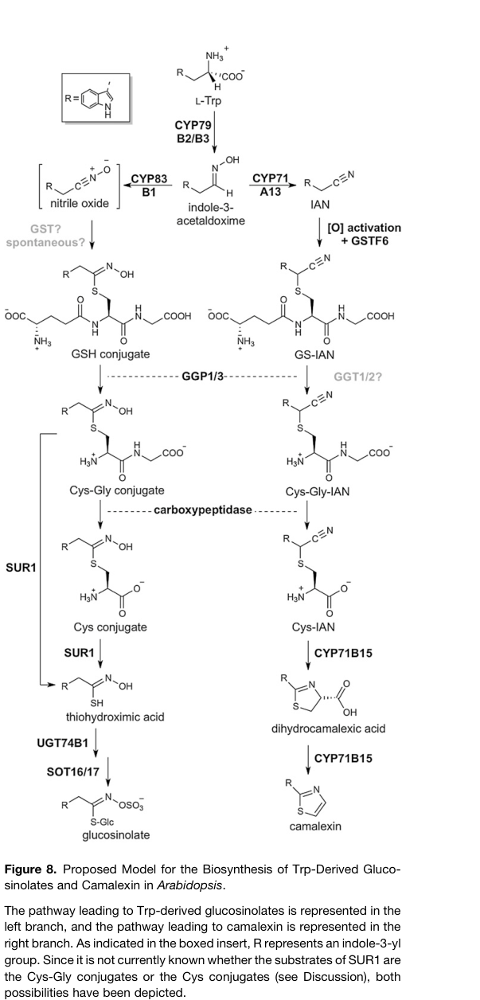

## Question

# Commissioned Review Brief

## Review Topic

Camalexin biosynthesis (tryptophan-derived indole phytoalexin)

## Working Scope

Camalexin (3-thiazol-2'-yl-indole) is the main phytoalexin of Arabidopsis and related Brassicaceae, made from tryptophan after pathogen attack. Tryptophan is converted to indole-3-acetaldoxime (IAOx) by CYP79B2/CYP79B3, IAOx to indole-3-acetonitrile (IAN) and onward by CYP71A13/CYP71A12, the nitrile intermediate is conjugated to glutathione and processed to a cysteine conjugate, and the bifunctional P450 CYP71B15 (PAD3) converts the cysteine conjugate to dihydrocamalexic acid and then camalexin. The pathway P450s associate in an ER-anchored metabolic complex. Pathogen-induced transcription of the biosynthetic genes depends on the MPK3/MPK6-WRKY33 module.

## Provisional Biological Outline

- Camalexin biosynthesis
  - 1. tryptophan to indole-3-acetaldoxime (CYP79B2/B3)
  - IAOx formation
  - 2. indole-3-acetaldoxime to indole-3-acetonitrile and indole cyanohydrin (CYP71A13/A12)
  - IAN formation
  - 3. glutathione conjugation and processing to the cysteine conjugate (GST, GGP1/GGT)
  - Glutathione conjugation and processing
  - 4. cysteine conjugate to dihydrocamalexic acid and camalexin (CYP71B15/PAD3)
  - Thiazole ring formation (PAD3)
  - 5. transcriptional activation of the pathway (MPK3/MPK6-WRKY33)
  - MPK3/MPK6-WRKY33 transcriptional activation

## Known Relationships Among Steps

No explicit connections.

## Assignment

Write a rigorous, review-style synthesis suitable for a molecular biology
audience. Treat the topic as a biological system whose boundaries, core
mechanisms, variants, and unresolved points should be made clear to readers who
know the field but are not specialists in this specific process.

The review should be explanatory rather than encyclopedic. Anchor broad claims
in primary literature or authoritative reviews, but keep the focus on how the
system works and how its parts fit together.

## Questions To Address

1. **Scope and boundaries**
   - What exactly is included in this biological system?
   - Which neighboring pathways, organelle processes, complexes, or regulatory
     events are often confused with it but should be treated separately?
   - Are there competing definitions in the literature?

2. **Core mechanism**
   - What is the best current model for the sequence of events?
   - Which steps are obligatory, which are conditional, and which are accessory?
   - What molecular assemblies, enzymes, receptors, adaptors, transporters, or
     structural units carry out each major step?

3. **Variation**
   - How does the system vary across major evolutionary lineages?
   - Are there well-supported differences between cell types, tissues,
     developmental stages, physiological states, or compartments?
   - Where are there alternative routes that achieve a similar outcome by
     different molecular means?

4. **Conservation and origin**
   - What is the deepest plausible evolutionary origin of the system?
   - Which parts appear ancient and conserved, and which appear to be later
     elaborations, replacements, or lineage-specific losses?
   - When a protein family has expanded, which family members are the best
     representatives for understanding the ancestral role?

5. **Physical and biological constraints**
   - What steps must occur in a particular order?
   - Which events are mutually exclusive, compartment-specific, cell-type
     specific, substrate-specific, or stage-specific?
   - What evidence rules out otherwise plausible paths through the system?

6. **Evidence and controversy**
   - Which mechanistic claims are strongly supported by experiments?
   - Where does the literature disagree, rely on indirect evidence, or mix data
     from organisms that may not be comparable?
   - What are the most important open questions?

## Output Format

Use the style and structure of a concise review article:

1. Executive summary
2. Definition and biological boundaries
3. Mechanistic overview
4. Major molecular players and active assemblies
5. Evolutionary and cell-biological variation
6. Constraints, dependencies, and failure modes
7. Controversies and open questions
8. Key references

Include citations for major claims, preferably PMIDs or DOIs. Be explicit about
uncertainty and avoid overgeneralizing from one organism, cell type, or assay
system to all biology.

## Output

Question: You are an expert researcher providing comprehensive, well-cited information.

Provide detailed information focusing on:
1. Key concepts and definitions with current understanding
2. Recent developments and latest research (prioritize 2023-2024 sources)
3. Current applications and real-world implementations
4. Expert opinions and analysis from authoritative sources
5. Relevant statistics and data from recent studies

Format as a comprehensive research report with proper citations. Include URLs and publication dates where available.
Always prioritize recent, authoritative sources and provide specific citations for all major claims.

# Commissioned Review Brief

## Review Topic

Camalexin biosynthesis (tryptophan-derived indole phytoalexin)

## Working Scope

Camalexin (3-thiazol-2'-yl-indole) is the main phytoalexin of Arabidopsis and related Brassicaceae, made from tryptophan after pathogen attack. Tryptophan is converted to indole-3-acetaldoxime (IAOx) by CYP79B2/CYP79B3, IAOx to indole-3-acetonitrile (IAN) and onward by CYP71A13/CYP71A12, the nitrile intermediate is conjugated to glutathione and processed to a cysteine conjugate, and the bifunctional P450 CYP71B15 (PAD3) converts the cysteine conjugate to dihydrocamalexic acid and then camalexin. The pathway P450s associate in an ER-anchored metabolic complex. Pathogen-induced transcription of the biosynthetic genes depends on the MPK3/MPK6-WRKY33 module.

## Provisional Biological Outline

- Camalexin biosynthesis
  - 1. tryptophan to indole-3-acetaldoxime (CYP79B2/B3)
  - IAOx formation
  - 2. indole-3-acetaldoxime to indole-3-acetonitrile and indole cyanohydrin (CYP71A13/A12)
  - IAN formation
  - 3. glutathione conjugation and processing to the cysteine conjugate (GST, GGP1/GGT)
  - Glutathione conjugation and processing
  - 4. cysteine conjugate to dihydrocamalexic acid and camalexin (CYP71B15/PAD3)
  - Thiazole ring formation (PAD3)
  - 5. transcriptional activation of the pathway (MPK3/MPK6-WRKY33)
  - MPK3/MPK6-WRKY33 transcriptional activation

## Known Relationships Among Steps

No explicit connections.

## Assignment

Write a rigorous, review-style synthesis suitable for a molecular biology
audience. Treat the topic as a biological system whose boundaries, core
mechanisms, variants, and unresolved points should be made clear to readers who
know the field but are not specialists in this specific process.

The review should be explanatory rather than encyclopedic. Anchor broad claims
in primary literature or authoritative reviews, but keep the focus on how the
system works and how its parts fit together.

## Questions To Address

1. **Scope and boundaries**
   - What exactly is included in this biological system?
   - Which neighboring pathways, organelle processes, complexes, or regulatory
     events are often confused with it but should be treated separately?
   - Are there competing definitions in the literature?

2. **Core mechanism**
   - What is the best current model for the sequence of events?
   - Which steps are obligatory, which are conditional, and which are accessory?
   - What molecular assemblies, enzymes, receptors, adaptors, transporters, or
     structural units carry out each major step?

3. **Variation**
   - How does the system vary across major evolutionary lineages?
   - Are there well-supported differences between cell types, tissues,
     developmental stages, physiological states, or compartments?
   - Where are there alternative routes that achieve a similar outcome by
     different molecular means?

4. **Conservation and origin**
   - What is the deepest plausible evolutionary origin of the system?
   - Which parts appear ancient and conserved, and which appear to be later
     elaborations, replacements, or lineage-specific losses?
   - When a protein family has expanded, which family members are the best
     representatives for understanding the ancestral role?

5. **Physical and biological constraints**
   - What steps must occur in a particular order?
   - Which events are mutually exclusive, compartment-specific, cell-type
     specific, substrate-specific, or stage-specific?
   - What evidence rules out otherwise plausible paths through the system?

6. **Evidence and controversy**
   - Which mechanistic claims are strongly supported by experiments?
   - Where does the literature disagree, rely on indirect evidence, or mix data
     from organisms that may not be comparable?
   - What are the most important open questions?

## Output Format

Use the style and structure of a concise review article:

1. Executive summary
2. Definition and biological boundaries
3. Mechanistic overview
4. Major molecular players and active assemblies
5. Evolutionary and cell-biological variation
6. Constraints, dependencies, and failure modes
7. Controversies and open questions
8. Key references

Include citations for major claims, preferably PMIDs or DOIs. Be explicit about
uncertainty and avoid overgeneralizing from one organism, cell type, or assay
system to all biology.

# Camalexin biosynthesis: pathway, organization and biological limits

## 1. Executive summary

Camalexin (3-thiazol-2′-yl-indole) is an inducible, tryptophan-derived antimicrobial phytoalexin best characterized in *Arabidopsis thaliana*. Its sulfur-containing thiazole is assembled through a glutathione-derived conjugate, not by simply attaching free cysteine to indole. The best-supported sequence is tryptophan → indole-3-acetaldoxime (IAOx) → indole-3-acetonitrile (IAN) → activated IAN and its glutathione conjugate (GS-IAN) → cysteinylglycine and cysteine conjugates → dihydrocamalexic acid (DHCA) → camalexin. CYP79B2/B3, CYP71A12/A13 and PAD3/CYP71B15 provide the principal P450 activities; cytosolic GGP1/GGP3 process GS-IAN. Pathogen-responsive MPK3/MPK6–WRKY33 signaling increases pathway expression, while plasma-membrane transporters deliver the product outside cells. The glutathione-conjugating enzyme and the peptidase that removes glycine remain less securely assigned than the P450s or GGPs. (mucha2019theformationof pages 2-3, geuflores2011cytosolicγglutamylpeptidases pages 8-10, geuflores2011cytosolicγglutamylpeptidases pages 10-11, zhou2020differentialphosphorylationof pages 1-4, he2019thearabidopsispleiotropic pages 4-7)

The pathway is **not a universal Brassicaceae phytoalexin program**. Comparative metabolite and genomic data associate camalexin production with a subset of Camelineae, whereas *Brassica rapa* uses a distinct, indole-glucosinolate-derived brassinin pathway. The defensible evolutionary model is recruitment of older tryptophan, glucosinolate, glutathione-processing and immune-signaling capacities into a more restricted camalexin-producing branch—not inheritance of an intact camalexin pathway by all flowering plants or crucifers. (bednarek2011conservationandcladespecific pages 7-8, klein2017biosynthesisofcabbage pages 1-2, geuflores2011cytosolicγglutamylpeptidases pages 10-11)

## 2. Definition and biological boundaries

**Narrowly defined**, camalexin biosynthesis comprises precursor commitment from IAOx, incorporation of glutathione-derived sulfur, processing to Cys(IAN), and PAD3-dependent formation of the thiazole-containing end product. **Broadly defined**, the inducible defense module also includes precursor supply from tryptophan, kinase-dependent transcription, ER-associated enzyme organization and product secretion. Keeping these definitions distinct prevents a transporter defect or impaired immune induction from being mistaken for loss of an individual chemical reaction. (mucha2019theformationof pages 2-3, mucha2019theformationof pages 5-6, he2019thearabidopsispleiotropic pages 4-7)

IAOx is a **shared branch point**, not uniquely a camalexin intermediate: CYP83B1 directs it toward indole glucosinolates, especially under unstressed conditions. Indole glucosinolate hydrolysis, PEN2-dependent penetration defense, auxin-associated indole metabolism and formation of other indolic antimicrobials should therefore be treated as neighboring routes. Sharing CYP79B2/B3 or glutathione-processing enzymes does not make the glucosinolate pathway a mandatory linear segment of camalexin synthesis in *A. thaliana*. Conversely, the brassinin pathway reconstructed in cabbage *does* proceed through an indole glucosinolate and its myrosinase-generated breakdown product; it is a different route to a different phytoalexin. (mucha2019theformationof pages 2-3, bednarek2011conservationandcladespecific pages 2-3, klein2017biosynthesisofcabbage pages 1-2, klein2017biosynthesisofcabbage pages 4-4)

## 3. Mechanistic overview

The biochemical sequence and its differing levels of certainty are summarized below. **IAN, an indole nitrile, must not be equated with the subsequently proposed reactive indole cyanohydrin**: evidence for CYP71A12/A13-dependent IAOx-to-IAN conversion is stronger than direct characterization of the short-lived species captured by glutathione. Similarly, the shorthand “GS-IAN → Cys(IAN)” hides two peptide-trimming reactions. (mucha2019theformationof pages 2-3, mucha2019theformationof pages 1-2, geuflores2011cytosolicγglutamylpeptidases pages 10-11)

| Transformation | Proteins and compartment | Experimental support | Main caution |
|---|---|---|---|
| **Trp → indole-3-acetaldoxime (IAOx)** | CYP79B2/CYP79B3; ER-anchored P450s with cytosol-facing catalytic domains | **Strong:** biochemical/genetic assignment; *cyp79b2 cyp79b3* eliminates most Trp-derived defense chemistry. DOI: [10.1105/tpc.19.00403](https://doi.org/10.1105/tpc.19.00403) (mucha2019theformationof pages 2-3, mucha2019theformationof pages 1-2) | IAOx is a branch point also feeding indole glucosinolates and other indolic metabolism, not a camalexin-specific intermediate. |
| **IAOx → IAN → proposed indole-3-cyanohydrin** | CYP71A13, with partially redundant CYP71A12; ER | **Strong for IAOx→IAN; moderate for cyanohydrin:** CYP71A12/A13 genetics and P450 assays support IAN formation and further activation, but the cyanohydrin is inferred as a short-lived intermediate. DOI: [10.1105/tpc.19.00403](https://doi.org/10.1105/tpc.19.00403) (mucha2019theformationof pages 1-2, mucha2019theformationof pages 2-3) | IAN is a nitrile and is **not** synonymous with indole-3-cyanohydrin; the latter’s identity and enzyme-bound status remain less directly established. |
| **Indole-3-cyanohydrin + GSH → GS-IAN** | GSH; GSTF6 is a candidate cytosolic catalyst, while many GSTs can catalyse the chemistry in heterologous assays | **Moderate for obligatory glutathionylation; weak for a unique GST:** GS-IAN is an established intermediate, but 41 of 54 Arabidopsis GSTs supported product formation in yeast and reactive precursors can conjugate spontaneously. DOIs: [10.1105/tpc.19.00403](https://doi.org/10.1105/tpc.19.00403); [10.1098/rstb.2023.0365](https://doi.org/10.1098/rstb.2023.0365) (micic2024overlookedandmisunderstood pages 8-9, mucha2019theformationof pages 7-8) | GSTF6 loss causes only a small effect; GSTF2/F3/F6 mutants retain camalexin. No single GST has been shown to be uniquely required in planta. |
| **GS-IAN → Cys-Gly-IAN → Cys(IAN)** | Cytosolic GGP1, assisted by GGP3, removes γ-Glu; the glycine-removing carboxypeptidase remains unidentified | **Strong for GGP step:** recombinant GGP1/GGP3 make Cys-Gly-IAN; *ggp1* and *ggp1 ggp3* retain ~40% and ~11% of wild-type camalexin and accumulate 200–300 pmol GS-IAN mg⁻¹ fresh weight. DOI: [10.1105/tpc.111.083998](https://doi.org/10.1105/tpc.111.083998) (geuflores2011cytosolicγglutamylpeptidases pages 8-10, geuflores2011cytosolicγglutamylpeptidases pages 10-11, geuflores2011cytosolicγglutamylpeptidases pages 5-7) | Conversion of Cys-Gly-IAN to Cys(IAN) is unresolved. Extracellular GGT1/GGT2 phenotypes do not establish direct pathway catalysis; acivicin can also inhibit GGPs. |
| **Cys(IAN) → dihydrocamalexic acid (DHCA) → camalexin** | CYP71B15/PAD3; ER-associated P450 in *A. thaliana* | **Strong:** PAD3 performs the terminal two-step conversion; *pad3* plants are camalexin deficient and accumulate Cys(IAN), DHCA and derivatives. DOI: [10.1105/tpc.19.00403](https://doi.org/10.1105/tpc.19.00403) (mucha2019theformationof pages 1-2, zhou2020differentialphosphorylationof pages 1-4) | This assignment is secure for *A. thaliana* but should not be generalized to every Brassicaceae lineage, many of which produce different indole–sulfur phytoalexins. |

*Table: A five-step biochemical map of Arabidopsis camalexin formation, separating strongly established reactions from unresolved intermediate chemistry and enzyme assignments.*

The experimentally established ordering has useful genetic tests. Loss of both CYP79B enzymes removes the usual IAOx supply; disrupting GGP1/GGP3 causes **GS-IAN accumulation upstream** of a decrease in camalexin; *pad3* eliminates the principal terminal activity and leaves Cys(IAN), DHCA and related metabolites. In AgNO₃-induced leaves, *ggp1* retained approximately **40%** of wild-type camalexin and the *ggp1 ggp3* line approximately **11%**; affected lines accumulated approximately **200–300 pmol GS-IAN mg⁻¹ fresh weight**. These were pathway-specific experimental conditions and knockdown backgrounds, not universal flux constants. The illustrated primary-study pathway model distinguishes the camalexin branch from the neighboring glucosinolate branch. (mucha2019theformationof pages 2-3, geuflores2011cytosolicγglutamylpeptidases pages 5-7, geuflores2011cytosolicγglutamylpeptidases pages 7-8, geuflores2011cytosolicγglutamylpeptidases media 382c9ec3)

Glutathionylation is compelling as a **metabolite-level dependency**: the sulfur-containing conjugate is detected, and blocking its downstream processing traps it. A dedicated, uniquely obligatory **GST protein** is another matter. GSTF6 remains a candidate, but a 2019 yeast screen produced GS-IAN with **41 of 54** tested Arabidopsis GSTs; a 2024 expert review emphasizes that reactive precursors can also conjugate chemically and that GSTF6 loss has only a small effect. The GSTF2/F3/F6 mutant combinations examined under silver-nitrate induction likewise retained camalexin. GSTU4 associates physically with the P450 assembly, yet its knockout *increases* camalexin and overexpression *decreases* it, arguing against assigning it the obligatory biosynthetic GST step. (mucha2019theformationof pages 7-8, micic2024overlookedandmisunderstood pages 8-9, mucha2019theformationof pages 2-3, mucha2019theformationof pages 1-2)

## 4. Major molecular players and active assemblies

**ER-associated catalytic core.** CYP79B2/B3 produce IAOx; CYP71A13, assisted in a partially overlapping manner by CYP71A12, directs IAOx toward IAN and subsequent activation; PAD3/CYP71B15 converts Cys(IAN) through DHCA to camalexin. These P450s are associated with the endoplasmic reticulum, with catalysis accessible from its cytosolic face. CYP71A13 interacts with the electron-transfer partner ATR1. In infected leaves, functional PAD3–GFP was detected near successful fungal infection sites, with patterns depending on pathogen, rather than being uniformly present throughout the tissue. (mucha2019theformationof pages 2-3, mucha2019theformationof pages 1-2, mucha2019theformationof pages 5-5, zhou2020differentialphosphorylationof pages 1-4)

**Metabolon, not a sealed pipeline.** Co-immunoprecipitation and FRET–FLIM support proximity among CYP79B2, CYP71A12/A13, PAD3, GGP1 and recruited GSTU4. Coexpression of CYP79B2 with CYP71A13 in yeast shifted products toward IAN and decreased CYP79B2’s apparent tryptophan *K*ₘ from **17.5 ± 1.9 to 6.9 ± 0.9 mM**. These data support functional coupling and a plausible means of limiting exposure to reactive intermediates. They do **not** establish that every intermediate is exclusively handed between proteins, that all components form one fixed-stoichiometry complex in every cell, or that GSTU4 catalyzes net camalexin formation. (mucha2019theformationof pages 5-6, mucha2019theformationof pages 7-8, mucha2019theformationof pages 1-2)

**Soluble processing enzymes and compartment limits.** GGP1 and GGP3 remove the γ-glutamyl moiety of GS-IAN in the cytosol, yielding Cys-Gly-IAN in recombinant-enzyme assays. The subsequent glycine-removing carboxypeptidase remains unidentified. Earlier suggestions that GGT1/GGT2 directly perform the core GS-IAN-processing reaction conflict with their extracellular location; inhibitor experiments are inconclusive because acivicin may also inhibit GGPs. Vacuolar GGT-mediated conjugate degradation is likewise not interchangeable with cytosolic camalexin synthesis. A November 2024 **bioRxiv preprint**, rather than peer-reviewed evidence available from that date, reported GGP1 structures including a trapped γ-glutamyl–C100 intermediate and an open pocket compatible with bulky glutathione conjugates; its proposed oxidative regulation warrants independent physiological testing. (geuflores2011cytosolicγglutamylpeptidases pages 8-10, geuflores2011cytosolicγglutamylpeptidases pages 10-11, sone2024crystalstructureof pages 1-5)

**Induction and deployment.** In the tested pathogen responses, MPK3/MPK6 phosphorylate WRKY33; a phosphorylation-site mutant incompletely rescues induction of CYP71A13, PAD3 and camalexin. WRKY33 binds the PAD3 promoter *in vivo*. This is not a kinase-only switch: CPK5/CPK6 phosphorylate WRKY33 at **Thr229**, increasing DNA-binding ability, whereas MPK3/MPK6 phosphorylation of N-terminal serines enhances transactivation. MYB34/MYB51/MYB122 additionally control upstream IAOx supply; feeding IAOx or IAN largely restores camalexin in the triple-*myb* background, whereas feeding tryptophan does not. These regulators act at distinct positions in the system and need not have identical importance for every elicitor. (mao2011phosphorylationofa pages 5-6, mao2011phosphorylationofa pages 9-10, zhou2020differentialphosphorylationof pages 1-4, yang2020co‐regulationofindole pages 7-7)

Export follows synthesis but is crucial for extracellular defense. Epidermally localized **ABCG34** supports surface camalexin accumulation. **PEN3/ABCG36 and PDR12/ABCG40** jointly promote secretion following *Botrytis cinerea* infection: their double mutant has **less extracellular but more intracellular camalexin**, severe camalexin hypersensitivity and greater fungal susceptibility. Its lesions were reported as approximately **2.5-fold larger than in *pen3* alone** under the studied conditions. Thus, measuring only whole-leaf camalexin can misclassify a secretion failure as adequate antimicrobial protection; these transporters also have or may have other substrates. (khare2017arabidopsisabcg34contributes pages 1-1, khare2017arabidopsisabcg34contributes pages 7-8, he2019thearabidopsispleiotropic pages 4-7, he2019thearabidopsispleiotropic pages 27-29)

## 5. Evolutionary and cell-biological variation

A comparative pathogen-challenge study detected strong *Botrytis*-induced camalexin in *A. thaliana*, *A. lyrata*, *A. halleri*, two tested *Olimarabidopsis* species and *Capsella rubella*, but not in the other taxa tested. PAD3 orthologs were reported in *A. lyrata* and *C. rubella*, but not *B. rapa* or *Arabis alpina*; 6-methoxycamalexin had an even narrower observed distribution. Negative metabolite detection is conditional on the pathogen and sampling regime, so this establishes a well-supported **restricted distribution under tested conditions**, not an exhaustive species-wide absence claim. Older, more widely shared functions include tryptophan metabolism, glutathione chemistry and aspects of glucosinolate-associated metabolism; CYP71A12/A13 and PAD3 are more informative representatives of the characterized *Arabidopsis* camalexin specialization than arbitrary members of their expanded P450 families. A precise date or deepest ancestor for the *complete* camalexin pathway is not established by these comparisons. (bednarek2011conservationandcladespecific pages 7-8, geuflores2011cytosolicγglutamylpeptidases pages 10-11, klein2017biosynthesisofcabbage pages 1-2)

In *B. rapa*, a distinct combination of indole-glucosinolate synthesis, myrosinase activity, SUR1-associated chemistry, a dithiocarbamate methyltransferase and CYP71CR enzymes produces **brassinin and its derivatives**, rather than demonstrating conservation of the PAD3 route. Transient reconstruction in *Nicotiana benthamiana* produced approximately **400 pmol brassinin mg⁻¹ dry weight**, demonstrating engineering feasibility for that *different* crucifer pathway. Its CYP71CR transformations should not be presented as alternative catalytic steps in *Arabidopsis* camalexin synthesis. (klein2017biosynthesisofcabbage pages 1-2, klein2017biosynthesisofcabbage pages 4-4, klein2015twocytochromesp450 pages 2-3)

Cellular specificity is demonstrable but not fully mapped. The 2019 PAD3 reporter study localized induction to cells adjoining fungal infection. In a **2023** single-cell study of *Pseudomonas syringae*-challenged leaves, **11,206 cells** partitioned into 18 populations; CYP71A12/A13 expression was enriched in a responsive population designated **C13**, suggesting localized biosynthetic competence. Transcript abundance is not direct imaging of camalexin flux or proof that other leaf cell types never synthesize it. Root defense is also possible: an earlier clubroot study found infected roots of the more resistant Bur-0 accession accumulated **four- to sevenfold** more camalexin than infected Col-0 under its experimental conditions. Developmental-stage-wide rules cannot safely be inferred from these specific leaf and root assays. (mucha2019theformationof pages 2-3, delannoy2023cellspecializationand pages 2-3, delannoy2023cellspecializationand pages 7-8, zhou2020differentialphosphorylationof pages 1-4)

## 6. Constraints, dependencies and failure modes

The principal chemical constraints are **precursor supply before branch commitment**, **glutathione conjugation before GGP-mediated γ-glutamyl removal**, **formation of Cys(IAN) before terminal PAD3 chemistry**, and **export after end-product production**. CYP83B1-directed consumption of IAOx competes with, rather than constitutes, the direct *Arabidopsis* camalexin branch. Because GGP catalysis occurs in the cytosol, extracellular GGT1/GGT2 phenotypes alone cannot establish that those enzymes are the cytosolic pathway catalyst. The *ggp* metabolite trap and *pad3* precursor accumulation supply stronger order-of-reaction evidence than expression correlations do. (mucha2019theformationof pages 2-3, geuflores2011cytosolicγglutamylpeptidases pages 8-10, geuflores2011cytosolicγglutamylpeptidases pages 10-11, geuflores2011cytosolicγglutamylpeptidases pages 5-7)

A system-level failure can occur without deleting the terminal P450: insufficient pathogen-induced transcription limits precursor flux, GGP impairment traps GS-IAN, and ABC transporter impairment retains synthesized camalexin inside cells rather than delivering it to the pathogen interface. Even a severe defense phenotype in *cyp79b2 cyp79b3* cannot be attributed uniquely to camalexin because the genes supply several indolic defense branches. Likewise, altered susceptibility in a pleiotropic kinase or transporter mutant is not by itself proof of a camalexin-specific mechanism. (mao2011phosphorylationofa pages 5-6, geuflores2011cytosolicγglutamylpeptidases pages 5-7, he2019thearabidopsispleiotropic pages 4-7, schlaeppi2010diseaseresistanceof pages 1-2)

## 7. Recent developments, applications and unresolved questions

**Recent findings, interpreted within their limits.** A **2024** critical review of plant GST biology argues explicitly against equating an in-vitro GST reaction, protein association or a single-mutant phenotype with identification of the physiologically unique GS-IAN catalyst. The **2023** single-cell analysis adds spatial resolution to pathogen-responsive transcription, while the 2024 GGP1 structural preprint offers a testable molecular explanation for processing chemically different conjugates, not yet a demonstration of flux regulation during infection. Together these results shift emphasis from a simple enzyme list to substrate chemistry, cell-specific expression and localization. (micic2024overlookedandmisunderstood pages 8-9, delannoy2023cellspecializationand pages 2-3, delannoy2023cellspecializationand pages 7-8, sone2024crystalstructureof pages 1-5)

A concrete **2024 proof-of-concept for defense priming** treated Arabidopsis with **20 μM rac-GR24 four days before *B. cinerea* inoculation**. PAD3 transcript abundance was about **2-fold** and **1.6-fold** above controls at 12 and 16 hours post-inoculation, respectively; camalexin was **36%** and **44%** higher at 18 and 24 hours. Increased resistance depended on intact ethylene signaling and PAD3, while treatment alone did not comparably elevate preinfection camalexin. However, rac-GR24 is a stereoisomer mixture capable of engaging both strigolactone- and karrikin-related signaling, so the experiment does not identify a uniquely strigolactone-receptor-specific intervention or demonstrate field efficacy in crops. The immediate real-world use is as an experimental immune-priming strategy and a mechanistic lead, not an established camalexin-based crop product. (fujita2024enhanceddiseaseresistance pages 5-6, fujita2024enhanceddiseaseresistance pages 1-2, fujita2024enhanceddiseaseresistance pages 6-7)

**Priority open questions** are: Which catalyst, if any, is physiologically indispensable for GS-IAN formation when spontaneous conjugation and GST redundancy are jointly controlled? Which enzyme removes glycine from Cys-Gly-IAN? Is the proposed cyanohydrin a freely diffusible, enzyme-bound or exceptionally short-lived intermediate? How much flux is truly channeled by the ER-associated assembly across different pathogen and tissue contexts? How are GGP, P450 and exporter activities coordinated in individual infected cells, and how much of observed resistance reflects camalexin rather than accompanying indolic metabolites? Resolving these issues requires quantitative isotope tracing, enzyme-specific catalytic genetics, native-cell localization and pathogen experiments that distinguish synthesis from export. (micic2024overlookedandmisunderstood pages 8-9, geuflores2011cytosolicγglutamylpeptidases pages 10-11, mucha2019theformationof pages 2-3, mucha2019theformationof pages 5-6, he2019thearabidopsispleiotropic pages 4-7)

## 8. Key references

1. Mucha S *et al.* **2019**, *The Plant Cell* 31:2697–2710. ER-associated camalexin biosynthetic metabolon, P450 interactions and GSTU4 caveat. DOI: https://doi.org/10.1105/tpc.19.00403. (mucha2019theformationof pages 1-2, mucha2019theformationof pages 5-6)
2. Geu-Flores F *et al.* **2011**, *The Plant Cell* 23:2456–2469. GGP1/GGP3 genetics, GS-IAN trapping and recombinant processing. DOI: https://doi.org/10.1105/tpc.111.083998. (geuflores2011cytosolicγglutamylpeptidases pages 5-7, geuflores2011cytosolicγglutamylpeptidases pages 10-11)
3. Mao G *et al.* **2011**, *The Plant Cell* 23:1639–1653. MPK3/MPK6 phosphorylation of WRKY33 and camalexin gene induction. DOI: https://doi.org/10.1105/tpc.111.084996. (mao2011phosphorylationofa pages 5-6, mao2011phosphorylationofa pages 9-10)
4. Zhou J *et al.* **2020**, *The Plant Cell* 32:2621–2638. Distinct CPK5/CPK6 and MPK3/MPK6 phosphorylation of WRKY33. DOI: https://doi.org/10.1105/tpc.19.00971. (zhou2020differentialphosphorylationof pages 1-4)
5. Micic N *et al.* **September 2024**, *Philosophical Transactions of the Royal Society B* 379. Critical review of GST assignments and spontaneous conjugation. DOI: https://doi.org/10.1098/rstb.2023.0365. (micic2024overlookedandmisunderstood pages 8-9)
6. Bednarek P *et al.* **2011**, *New Phytologist* 192:713–726. Comparative distribution of pathogen-induced camalexin and related indolic responses. DOI: https://doi.org/10.1111/j.1469-8137.2011.03824.x. (bednarek2011conservationandcladespecific pages 7-8)
7. Klein AP and Sattely ES. **2017**, *PNAS* 114:1910–1915. Reconstruction of the distinct cabbage brassinin pathway. DOI: https://doi.org/10.1073/pnas.1615625114. (klein2017biosynthesisofcabbage pages 1-2, klein2017biosynthesisofcabbage pages 4-4)
8. He Y *et al.* **2019**, *The Plant Cell* 31:2206–2222; Khare D *et al.* **2017**, *PNAS* 114:E5712–E5720. Camalexin secretion by PEN3/PDR12 and ABCG34, respectively. DOIs: https://doi.org/10.1105/tpc.19.00239; https://doi.org/10.1073/pnas.1702259114. (he2019thearabidopsispleiotropic pages 4-7, khare2017arabidopsisabcg34contributes pages 1-1)
9. Delannoy E *et al.* **September 2023**, *Plant Communications* 4:100676. Cell-type-resolved transcription after bacterial challenge. DOI: https://doi.org/10.1016/j.xplc.2023.100676. (delannoy2023cellspecializationand pages 2-3, delannoy2023cellspecializationand pages 7-8)
10. Fujita M *et al.* **published online August 9, 2024**, *Journal of Pesticide Science* 49:186–194. rac-GR24 immune-priming experiment. DOI: https://doi.org/10.1584/jpestics.d24-019. (fujita2024enhanceddiseaseresistance pages 1-2, fujita2024enhanceddiseaseresistance pages 5-6)
11. Sone K *et al.* **November 2024 bioRxiv preprint**, GGP1 structures and catalytic mechanism; **not treated here as peer-reviewed validation of physiological regulation**. DOI: https://doi.org/10.1101/2024.11.09.622773. (sone2024crystalstructureof pages 1-5)

References

1. (mucha2019theformationof pages 2-3): Stefanie Mucha, Stephanie Heinzlmeir, Verena Kriechbaumer, Benjamin Strickland, Charlotte Kirchhelle, Manisha Choudhary, Natalie Kowalski, Ruth Eichmann, Ralph Hueckelhoven, Erwin Grill, Bernhard Kuster, and Erich Glawischnig. The formation of a camalexin biosynthetic metabolon. Plant Cell, 31:2697-2710, Sep 2019. URL: https://doi.org/10.1105/tpc.19.00403, doi:10.1105/tpc.19.00403. This article has 105 citations and is from a highest quality peer-reviewed journal.

2. (geuflores2011cytosolicγglutamylpeptidases pages 8-10): Fernando Geu-Flores, Morten Emil Møldrup, Christoph Böttcher, Carl Erik Olsen, Dierk Scheel, and Barbara Ann Halkier. Cytosolic γ-glutamyl peptidases process glutathione conjugates in the biosynthesis of glucosinolates and camalexin in <i>arabidopsis</i>. Jun 2011. URL: https://doi.org/10.1105/tpc.111.083998, doi:10.1105/tpc.111.083998. This article has 173 citations.

3. (geuflores2011cytosolicγglutamylpeptidases pages 10-11): Fernando Geu-Flores, Morten Emil Møldrup, Christoph Böttcher, Carl Erik Olsen, Dierk Scheel, and Barbara Ann Halkier. Cytosolic γ-glutamyl peptidases process glutathione conjugates in the biosynthesis of glucosinolates and camalexin in <i>arabidopsis</i>. Jun 2011. URL: https://doi.org/10.1105/tpc.111.083998, doi:10.1105/tpc.111.083998. This article has 173 citations.

4. (zhou2020differentialphosphorylationof pages 1-4): Jinggeng Zhou, Xiaoyang Wang, Yunxia He, Tian Sang, Pengcheng Wang, Shaojun Dai, Shuqun Zhang, and Xiang-Zong Meng. Differential phosphorylation of the transcription factor wrky33 by the protein kinases cpk5/cpk6 and mpk3/mpk6 cooperatively regulates camalexin biosynthesis in arabidopsis. The Plant Cell, 32:2621-2638, May 2020. URL: https://doi.org/10.1105/tpc.19.00971, doi:10.1105/tpc.19.00971. This article has 262 citations.

5. (he2019thearabidopsispleiotropic pages 4-7): Yunxia He, Juan Xu, Xiaoyang Wang, Xiaomeng He, Yangxiayu Wang, Jinggeng Zhou, Shuqun Zhang, and Xiangzong Meng. The arabidopsis pleiotropic drug resistance transporters pen3 and pdr12 mediate camalexin secretion for resistance to botrytis cinerea. Plant Cell, 31:2206-2222, Jun 2019. URL: https://doi.org/10.1105/tpc.19.00239, doi:10.1105/tpc.19.00239. This article has 153 citations and is from a highest quality peer-reviewed journal.

6. (bednarek2011conservationandcladespecific pages 7-8): Paweł Bednarek, Mariola Piślewska-Bednarek, Emiel Ver Loren van Themaat, Ravi Kumar Maddula, Aleš Svatoš, and Paul Schulze-Lefert. Conservation and clade-specific diversification of pathogen-inducible tryptophan and indole glucosinolate metabolism in arabidopsis thaliana relatives. New Phytologist, 192:713-726, Jul 2011. URL: https://doi.org/10.1111/j.1469-8137.2011.03824.x, doi:10.1111/j.1469-8137.2011.03824.x. This article has 128 citations and is from a highest quality peer-reviewed journal.

7. (klein2017biosynthesisofcabbage pages 1-2): Andrew P. Klein and Elizabeth S. Sattely. Biosynthesis of cabbage phytoalexins from indole glucosinolate. Proceedings of the National Academy of Sciences, 114:1910-1915, Feb 2017. URL: https://doi.org/10.1073/pnas.1615625114, doi:10.1073/pnas.1615625114. This article has 108 citations and is from a highest quality peer-reviewed journal.

8. (mucha2019theformationof pages 5-6): Stefanie Mucha, Stephanie Heinzlmeir, Verena Kriechbaumer, Benjamin Strickland, Charlotte Kirchhelle, Manisha Choudhary, Natalie Kowalski, Ruth Eichmann, Ralph Hueckelhoven, Erwin Grill, Bernhard Kuster, and Erich Glawischnig. The formation of a camalexin biosynthetic metabolon. Plant Cell, 31:2697-2710, Sep 2019. URL: https://doi.org/10.1105/tpc.19.00403, doi:10.1105/tpc.19.00403. This article has 105 citations and is from a highest quality peer-reviewed journal.

9. (bednarek2011conservationandcladespecific pages 2-3): Paweł Bednarek, Mariola Piślewska-Bednarek, Emiel Ver Loren van Themaat, Ravi Kumar Maddula, Aleš Svatoš, and Paul Schulze-Lefert. Conservation and clade-specific diversification of pathogen-inducible tryptophan and indole glucosinolate metabolism in arabidopsis thaliana relatives. New Phytologist, 192:713-726, Jul 2011. URL: https://doi.org/10.1111/j.1469-8137.2011.03824.x, doi:10.1111/j.1469-8137.2011.03824.x. This article has 128 citations and is from a highest quality peer-reviewed journal.

10. (klein2017biosynthesisofcabbage pages 4-4): Andrew P. Klein and Elizabeth S. Sattely. Biosynthesis of cabbage phytoalexins from indole glucosinolate. Proceedings of the National Academy of Sciences, 114:1910-1915, Feb 2017. URL: https://doi.org/10.1073/pnas.1615625114, doi:10.1073/pnas.1615625114. This article has 108 citations and is from a highest quality peer-reviewed journal.

11. (mucha2019theformationof pages 1-2): Stefanie Mucha, Stephanie Heinzlmeir, Verena Kriechbaumer, Benjamin Strickland, Charlotte Kirchhelle, Manisha Choudhary, Natalie Kowalski, Ruth Eichmann, Ralph Hueckelhoven, Erwin Grill, Bernhard Kuster, and Erich Glawischnig. The formation of a camalexin biosynthetic metabolon. Plant Cell, 31:2697-2710, Sep 2019. URL: https://doi.org/10.1105/tpc.19.00403, doi:10.1105/tpc.19.00403. This article has 105 citations and is from a highest quality peer-reviewed journal.

12. (micic2024overlookedandmisunderstood pages 8-9): Nikola Micic, Asta Holmelund Rønager, Mette Sørensen, and Nanna Bjarnholt. Overlooked and misunderstood: can glutathione conjugates be clues to understanding plant glutathione transferases? Philosophical Transactions of the Royal Society B: Biological Sciences, Sep 2024. URL: https://doi.org/10.1098/rstb.2023.0365, doi:10.1098/rstb.2023.0365. This article has 25 citations and is from a domain leading peer-reviewed journal.

13. (mucha2019theformationof pages 7-8): Stefanie Mucha, Stephanie Heinzlmeir, Verena Kriechbaumer, Benjamin Strickland, Charlotte Kirchhelle, Manisha Choudhary, Natalie Kowalski, Ruth Eichmann, Ralph Hueckelhoven, Erwin Grill, Bernhard Kuster, and Erich Glawischnig. The formation of a camalexin biosynthetic metabolon. Plant Cell, 31:2697-2710, Sep 2019. URL: https://doi.org/10.1105/tpc.19.00403, doi:10.1105/tpc.19.00403. This article has 105 citations and is from a highest quality peer-reviewed journal.

14. (geuflores2011cytosolicγglutamylpeptidases pages 5-7): Fernando Geu-Flores, Morten Emil Møldrup, Christoph Böttcher, Carl Erik Olsen, Dierk Scheel, and Barbara Ann Halkier. Cytosolic γ-glutamyl peptidases process glutathione conjugates in the biosynthesis of glucosinolates and camalexin in <i>arabidopsis</i>. Jun 2011. URL: https://doi.org/10.1105/tpc.111.083998, doi:10.1105/tpc.111.083998. This article has 173 citations.

15. (geuflores2011cytosolicγglutamylpeptidases pages 7-8): Fernando Geu-Flores, Morten Emil Møldrup, Christoph Böttcher, Carl Erik Olsen, Dierk Scheel, and Barbara Ann Halkier. Cytosolic γ-glutamyl peptidases process glutathione conjugates in the biosynthesis of glucosinolates and camalexin in <i>arabidopsis</i>. Jun 2011. URL: https://doi.org/10.1105/tpc.111.083998, doi:10.1105/tpc.111.083998. This article has 173 citations.

16. (geuflores2011cytosolicγglutamylpeptidases media 382c9ec3): Fernando Geu-Flores, Morten Emil Møldrup, Christoph Böttcher, Carl Erik Olsen, Dierk Scheel, and Barbara Ann Halkier. Cytosolic γ-glutamyl peptidases process glutathione conjugates in the biosynthesis of glucosinolates and camalexin in <i>arabidopsis</i>. Jun 2011. URL: https://doi.org/10.1105/tpc.111.083998, doi:10.1105/tpc.111.083998. This article has 173 citations.

17. (mucha2019theformationof pages 5-5): Stefanie Mucha, Stephanie Heinzlmeir, Verena Kriechbaumer, Benjamin Strickland, Charlotte Kirchhelle, Manisha Choudhary, Natalie Kowalski, Ruth Eichmann, Ralph Hueckelhoven, Erwin Grill, Bernhard Kuster, and Erich Glawischnig. The formation of a camalexin biosynthetic metabolon. Plant Cell, 31:2697-2710, Sep 2019. URL: https://doi.org/10.1105/tpc.19.00403, doi:10.1105/tpc.19.00403. This article has 105 citations and is from a highest quality peer-reviewed journal.

18. (sone2024crystalstructureof pages 1-5): Kosei Sone, Takehiro Ito, Chihaya Yamada, Toma Kashima, Akimasa Miyanaga, Naoko Ohkama-Ohtsu, and Shinya Fushinobu. Crystal structure of plant γ-glutamyl peptidase 1 with dual roles in sulfur metabolism and implications for oxidative stress regulation. bioRxiv, Nov 2024. URL: https://doi.org/10.1101/2024.11.09.622773, doi:10.1101/2024.11.09.622773. This article has 0 citations.

19. (mao2011phosphorylationofa pages 5-6): Guo-Hong Mao, Xiang-Zong Meng, Yidong Liu, Zu-Yu Zheng, Zhi-Xiang Chen, and Shuqun Zhang. Phosphorylation of a wrky transcription factor by two pathogen-responsive mapks drives phytoalexin biosynthesis in <i>arabidopsis</i>. The Plant Cell, 23:1639-1653, Apr 2011. URL: https://doi.org/10.1105/tpc.111.084996, doi:10.1105/tpc.111.084996. This article has 1056 citations.

20. (mao2011phosphorylationofa pages 9-10): Guo-Hong Mao, Xiang-Zong Meng, Yidong Liu, Zu-Yu Zheng, Zhi-Xiang Chen, and Shuqun Zhang. Phosphorylation of a wrky transcription factor by two pathogen-responsive mapks drives phytoalexin biosynthesis in <i>arabidopsis</i>. The Plant Cell, 23:1639-1653, Apr 2011. URL: https://doi.org/10.1105/tpc.111.084996, doi:10.1105/tpc.111.084996. This article has 1056 citations.

21. (yang2020co‐regulationofindole pages 7-7): Liuyi Yang, Yan Zhang, Rongxia Guan, Sen Li, Xuwen Xu, Shuqun Zhang, and Juan Xu. Co‐regulation of indole glucosinolates and camalexin biosynthesis by cpk5/cpk6 and mpk3/mpk6 signaling pathways. Journal of Integrative Plant Biology, 62:1780-1796, Jun 2020. URL: https://doi.org/10.1111/jipb.12973, doi:10.1111/jipb.12973. This article has 92 citations and is from a peer-reviewed journal.

22. (khare2017arabidopsisabcg34contributes pages 1-1): Deepa Khare, Hyunju Choi, Sung Un Huh, Barbara Bassin, Jeongsik Kim, Enrico Martinoia, Kee Hoon Sohn, Kyung-Hee Paek, and Youngsook Lee. Arabidopsis abcg34 contributes to defense against necrotrophic pathogens by mediating the secretion of camalexin. Proceedings of the National Academy of Sciences, 114:E5712-E5720, Jun 2017. URL: https://doi.org/10.1073/pnas.1702259114, doi:10.1073/pnas.1702259114. This article has 118 citations and is from a highest quality peer-reviewed journal.

23. (khare2017arabidopsisabcg34contributes pages 7-8): Deepa Khare, Hyunju Choi, Sung Un Huh, Barbara Bassin, Jeongsik Kim, Enrico Martinoia, Kee Hoon Sohn, Kyung-Hee Paek, and Youngsook Lee. Arabidopsis abcg34 contributes to defense against necrotrophic pathogens by mediating the secretion of camalexin. Proceedings of the National Academy of Sciences, 114:E5712-E5720, Jun 2017. URL: https://doi.org/10.1073/pnas.1702259114, doi:10.1073/pnas.1702259114. This article has 118 citations and is from a highest quality peer-reviewed journal.

24. (he2019thearabidopsispleiotropic pages 27-29): Yunxia He, Juan Xu, Xiaoyang Wang, Xiaomeng He, Yangxiayu Wang, Jinggeng Zhou, Shuqun Zhang, and Xiangzong Meng. The arabidopsis pleiotropic drug resistance transporters pen3 and pdr12 mediate camalexin secretion for resistance to botrytis cinerea. Plant Cell, 31:2206-2222, Jun 2019. URL: https://doi.org/10.1105/tpc.19.00239, doi:10.1105/tpc.19.00239. This article has 153 citations and is from a highest quality peer-reviewed journal.

25. (klein2015twocytochromesp450 pages 2-3): Andrew P. Klein and Elizabeth S. Sattely. Two cytochromes p450 catalyze s-heterocyclizations in cabbage phytoalexin biosynthesis. Sep 2015. URL: https://doi.org/10.1038/nchembio.1914, doi:10.1038/nchembio.1914. This article has 56 citations and is from a highest quality peer-reviewed journal.

26. (delannoy2023cellspecializationand pages 2-3): Etienne Delannoy, Bastien Batardiere, Stéphanie Pateyron, Ludivine Soubigou-Taconnat, Julien Chiquet, Jean Colcombet, and Julien Lang. Cell specialization and coordination in arabidopsis leaves upon pathogenic attack revealed by scrna-seq. Sep 2023. URL: https://doi.org/10.1016/j.xplc.2023.100676, doi:10.1016/j.xplc.2023.100676. This article has 57 citations and is from a peer-reviewed journal.

27. (delannoy2023cellspecializationand pages 7-8): Etienne Delannoy, Bastien Batardiere, Stéphanie Pateyron, Ludivine Soubigou-Taconnat, Julien Chiquet, Jean Colcombet, and Julien Lang. Cell specialization and coordination in arabidopsis leaves upon pathogenic attack revealed by scrna-seq. Sep 2023. URL: https://doi.org/10.1016/j.xplc.2023.100676, doi:10.1016/j.xplc.2023.100676. This article has 57 citations and is from a peer-reviewed journal.

28. (schlaeppi2010diseaseresistanceof pages 1-2): Klaus Schlaeppi, Eliane Abou-Mansour, Antony Buchala, and Felix Mauch. Disease resistance of arabidopsis to phytophthora brassicae is established by the sequential action of indole glucosinolates and camalexin. The Plant journal : for cell and molecular biology, 62 5:840-51, Mar 2010. URL: https://doi.org/10.1111/j.1365-313x.2010.04197.x, doi:10.1111/j.1365-313x.2010.04197.x. This article has 240 citations.

29. (fujita2024enhanceddiseaseresistance pages 5-6): Moeka Fujita, Tomoya Tanaka, Miyuki Kusajima, Kengo Inoshima, Futo Narita, Hidemitsu Nakamura, Tadao Asami, Akiko Maruyama-Nakashita, and Hideo Nakashita. Enhanced disease resistance against botrytis cinerea by strigolactone-mediated immune priming in arabidopsis thaliana. Journal of Pesticide Science, 49:186-194, Aug 2024. URL: https://doi.org/10.1584/jpestics.d24-019, doi:10.1584/jpestics.d24-019. This article has 10 citations and is from a peer-reviewed journal.

30. (fujita2024enhanceddiseaseresistance pages 1-2): Moeka Fujita, Tomoya Tanaka, Miyuki Kusajima, Kengo Inoshima, Futo Narita, Hidemitsu Nakamura, Tadao Asami, Akiko Maruyama-Nakashita, and Hideo Nakashita. Enhanced disease resistance against botrytis cinerea by strigolactone-mediated immune priming in arabidopsis thaliana. Journal of Pesticide Science, 49:186-194, Aug 2024. URL: https://doi.org/10.1584/jpestics.d24-019, doi:10.1584/jpestics.d24-019. This article has 10 citations and is from a peer-reviewed journal.

31. (fujita2024enhanceddiseaseresistance pages 6-7): Moeka Fujita, Tomoya Tanaka, Miyuki Kusajima, Kengo Inoshima, Futo Narita, Hidemitsu Nakamura, Tadao Asami, Akiko Maruyama-Nakashita, and Hideo Nakashita. Enhanced disease resistance against botrytis cinerea by strigolactone-mediated immune priming in arabidopsis thaliana. Journal of Pesticide Science, 49:186-194, Aug 2024. URL: https://doi.org/10.1584/jpestics.d24-019, doi:10.1584/jpestics.d24-019. This article has 10 citations and is from a peer-reviewed journal.

## Artifacts

- [Edison artifact artifact-00](camalexin_biosynthesis-deep-research-falcon_artifacts/artifact-00.md)

## Citations

1. zhou2020differentialphosphorylationof pages 1-4
2. micic2024overlookedandmisunderstood pages 8-9
3. bednarek2011conservationandcladespecific pages 7-8
4. sone2024crystalstructureof pages 1-5
5. mucha2019theformationof pages 2-3
6. he2019thearabidopsispleiotropic pages 4-7
7. klein2017biosynthesisofcabbage pages 1-2
8. mucha2019theformationof pages 5-6
9. bednarek2011conservationandcladespecific pages 2-3
10. klein2017biosynthesisofcabbage pages 4-4
11. mucha2019theformationof pages 1-2
12. mucha2019theformationof pages 7-8
13. mucha2019theformationof pages 5-5
14. mao2011phosphorylationofa pages 5-6
15. mao2011phosphorylationofa pages 9-10
16. he2019thearabidopsispleiotropic pages 27-29
17. delannoy2023cellspecializationand pages 2-3
18. delannoy2023cellspecializationand pages 7-8
19. schlaeppi2010diseaseresistanceof pages 1-2
20. fujita2024enhanceddiseaseresistance pages 5-6
21. fujita2024enhanceddiseaseresistance pages 1-2
22. fujita2024enhanceddiseaseresistance pages 6-7
23. 10.1105/tpc.19.00403
24. 10.1098/rstb.2023.0365
25. 10.1105/tpc.111.083998
26. https://doi.org/10.1105/tpc.19.00403
27. https://doi.org/10.1098/rstb.2023.0365
28. https://doi.org/10.1105/tpc.111.083998
29. https://doi.org/10.1105/tpc.19.00403.
30. https://doi.org/10.1105/tpc.111.083998.
31. https://doi.org/10.1105/tpc.111.084996.
32. https://doi.org/10.1105/tpc.19.00971.
33. https://doi.org/10.1098/rstb.2023.0365.
34. https://doi.org/10.1111/j.1469-8137.2011.03824.x.
35. https://doi.org/10.1073/pnas.1615625114.
36. https://doi.org/10.1105/tpc.19.00239;
37. https://doi.org/10.1073/pnas.1702259114.
38. https://doi.org/10.1016/j.xplc.2023.100676.
39. https://doi.org/10.1584/jpestics.d24-019.
40. https://doi.org/10.1101/2024.11.09.622773.
41. https://doi.org/10.1105/tpc.19.00403,
42. https://doi.org/10.1105/tpc.111.083998,
43. https://doi.org/10.1105/tpc.19.00971,
44. https://doi.org/10.1105/tpc.19.00239,
45. https://doi.org/10.1111/j.1469-8137.2011.03824.x,
46. https://doi.org/10.1073/pnas.1615625114,
47. https://doi.org/10.1098/rstb.2023.0365,
48. https://doi.org/10.1101/2024.11.09.622773,
49. https://doi.org/10.1105/tpc.111.084996,
50. https://doi.org/10.1111/jipb.12973,
51. https://doi.org/10.1073/pnas.1702259114,
52. https://doi.org/10.1038/nchembio.1914,
53. https://doi.org/10.1016/j.xplc.2023.100676,
54. https://doi.org/10.1111/j.1365-313x.2010.04197.x,
55. https://doi.org/10.1584/jpestics.d24-019,