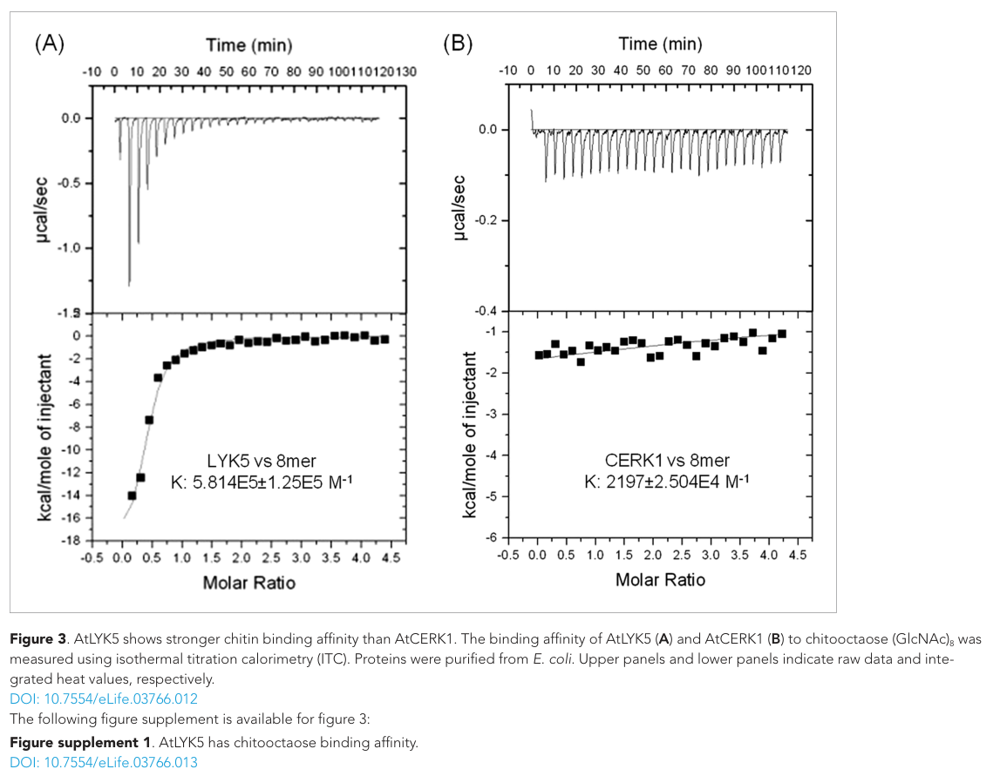

## Question

# Commissioned Review Brief

## Review Topic

Plant chitin perception by LysM receptor complexes

## Working Scope

Plants detect fungal cell-wall chitin oligosaccharides at the plasma membrane with LysM-domain pattern recognition receptors. A ligand-binding LysM protein (CEBiP-type LysM-RLP in rice; the LysM-RLKs LYK5 and LYK4 in Arabidopsis) binds chitin and forms a complex with the LysM receptor kinase CERK1, whose kinase domain is activated and phosphorylates receptor-like cytoplasmic kinases (PBL27/OsRLCK185 and BIK1-type). These relay the signal to a MAPKKK-MKK4/5-MPK3/6 cascade and to RBOHD-dependent ROS production, driving chitin-triggered immunity. Fungal LysM effectors (e.g. Ecp6, Slp1) sequester chitin oligomers to evade this system.

## Provisional Biological Outline

- Chitin perception by LysM receptors
  - 1. chitin oligosaccharide binding by a LysM receptor
  - Chitin binding (CEBiP / LYK5 / LYK4)
  - 2. CERK1 co-receptor kinase activation
  - CERK1 kinase activation
  - 3. receptor-like cytoplasmic kinase relay (PBL27, BIK1)
  - RLCK relay
  - 4. MAPK cascade and ROS burst outputs
  - MAPK cascade and ROS burst

## Known Relationships Among Steps

No explicit connections.

## Assignment

Write a rigorous, review-style synthesis suitable for a molecular biology
audience. Treat the topic as a biological system whose boundaries, core
mechanisms, variants, and unresolved points should be made clear to readers who
know the field but are not specialists in this specific process.

The review should be explanatory rather than encyclopedic. Anchor broad claims
in primary literature or authoritative reviews, but keep the focus on how the
system works and how its parts fit together.

## Questions To Address

1. **Scope and boundaries**
   - What exactly is included in this biological system?
   - Which neighboring pathways, organelle processes, complexes, or regulatory
     events are often confused with it but should be treated separately?
   - Are there competing definitions in the literature?

2. **Core mechanism**
   - What is the best current model for the sequence of events?
   - Which steps are obligatory, which are conditional, and which are accessory?
   - What molecular assemblies, enzymes, receptors, adaptors, transporters, or
     structural units carry out each major step?

3. **Variation**
   - How does the system vary across major evolutionary lineages?
   - Are there well-supported differences between cell types, tissues,
     developmental stages, physiological states, or compartments?
   - Where are there alternative routes that achieve a similar outcome by
     different molecular means?

4. **Conservation and origin**
   - What is the deepest plausible evolutionary origin of the system?
   - Which parts appear ancient and conserved, and which appear to be later
     elaborations, replacements, or lineage-specific losses?
   - When a protein family has expanded, which family members are the best
     representatives for understanding the ancestral role?

5. **Physical and biological constraints**
   - What steps must occur in a particular order?
   - Which events are mutually exclusive, compartment-specific, cell-type
     specific, substrate-specific, or stage-specific?
   - What evidence rules out otherwise plausible paths through the system?

6. **Evidence and controversy**
   - Which mechanistic claims are strongly supported by experiments?
   - Where does the literature disagree, rely on indirect evidence, or mix data
     from organisms that may not be comparable?
   - What are the most important open questions?

## Output Format

Use the style and structure of a concise review article:

1. Executive summary
2. Definition and biological boundaries
3. Mechanistic overview
4. Major molecular players and active assemblies
5. Evolutionary and cell-biological variation
6. Constraints, dependencies, and failure modes
7. Controversies and open questions
8. Key references

Include citations for major claims, preferably PMIDs or DOIs. Be explicit about
uncertainty and avoid overgeneralizing from one organism, cell type, or assay
system to all biology.

## Output

Question: You are an expert researcher providing comprehensive, well-cited information.

Provide detailed information focusing on:
1. Key concepts and definitions with current understanding
2. Recent developments and latest research (prioritize 2023-2024 sources)
3. Current applications and real-world implementations
4. Expert opinions and analysis from authoritative sources
5. Relevant statistics and data from recent studies

Format as a comprehensive research report with proper citations. Include URLs and publication dates where available.
Always prioritize recent, authoritative sources and provide specific citations for all major claims.

# Commissioned Review Brief

## Review Topic

Plant chitin perception by LysM receptor complexes

## Working Scope

Plants detect fungal cell-wall chitin oligosaccharides at the plasma membrane with LysM-domain pattern recognition receptors. A ligand-binding LysM protein (CEBiP-type LysM-RLP in rice; the LysM-RLKs LYK5 and LYK4 in Arabidopsis) binds chitin and forms a complex with the LysM receptor kinase CERK1, whose kinase domain is activated and phosphorylates receptor-like cytoplasmic kinases (PBL27/OsRLCK185 and BIK1-type). These relay the signal to a MAPKKK-MKK4/5-MPK3/6 cascade and to RBOHD-dependent ROS production, driving chitin-triggered immunity. Fungal LysM effectors (e.g. Ecp6, Slp1) sequester chitin oligomers to evade this system.

## Provisional Biological Outline

- Chitin perception by LysM receptors
  - 1. chitin oligosaccharide binding by a LysM receptor
  - Chitin binding (CEBiP / LYK5 / LYK4)
  - 2. CERK1 co-receptor kinase activation
  - CERK1 kinase activation
  - 3. receptor-like cytoplasmic kinase relay (PBL27, BIK1)
  - RLCK relay
  - 4. MAPK cascade and ROS burst outputs
  - MAPK cascade and ROS burst

## Known Relationships Among Steps

No explicit connections.

## Assignment

Write a rigorous, review-style synthesis suitable for a molecular biology
audience. Treat the topic as a biological system whose boundaries, core
mechanisms, variants, and unresolved points should be made clear to readers who
know the field but are not specialists in this specific process.

The review should be explanatory rather than encyclopedic. Anchor broad claims
in primary literature or authoritative reviews, but keep the focus on how the
system works and how its parts fit together.

## Questions To Address

1. **Scope and boundaries**
   - What exactly is included in this biological system?
   - Which neighboring pathways, organelle processes, complexes, or regulatory
     events are often confused with it but should be treated separately?
   - Are there competing definitions in the literature?

2. **Core mechanism**
   - What is the best current model for the sequence of events?
   - Which steps are obligatory, which are conditional, and which are accessory?
   - What molecular assemblies, enzymes, receptors, adaptors, transporters, or
     structural units carry out each major step?

3. **Variation**
   - How does the system vary across major evolutionary lineages?
   - Are there well-supported differences between cell types, tissues,
     developmental stages, physiological states, or compartments?
   - Where are there alternative routes that achieve a similar outcome by
     different molecular means?

4. **Conservation and origin**
   - What is the deepest plausible evolutionary origin of the system?
   - Which parts appear ancient and conserved, and which appear to be later
     elaborations, replacements, or lineage-specific losses?
   - When a protein family has expanded, which family members are the best
     representatives for understanding the ancestral role?

5. **Physical and biological constraints**
   - What steps must occur in a particular order?
   - Which events are mutually exclusive, compartment-specific, cell-type
     specific, substrate-specific, or stage-specific?
   - What evidence rules out otherwise plausible paths through the system?

6. **Evidence and controversy**
   - Which mechanistic claims are strongly supported by experiments?
   - Where does the literature disagree, rely on indirect evidence, or mix data
     from organisms that may not be comparable?
   - What are the most important open questions?

## Output Format

Use the style and structure of a concise review article:

1. Executive summary
2. Definition and biological boundaries
3. Mechanistic overview
4. Major molecular players and active assemblies
5. Evolutionary and cell-biological variation
6. Constraints, dependencies, and failure modes
7. Controversies and open questions
8. Key references

Include citations for major claims, preferably PMIDs or DOIs. Be explicit about
uncertainty and avoid overgeneralizing from one organism, cell type, or assay
system to all biology.

# Plant chitin perception by LysM receptor complexes

## 1. Executive summary

Plant chitin-triggered immunity begins when extracellular, typically acetylated fungal chitin oligomers engage lysin-motif (LysM) receptors at the plasma membrane. The most securely established division of labor is **ligand capture followed by kinase-dependent signal transmission**, but the proteins performing those jobs differ: rice relies principally on the kinase-less receptor-like protein CEBiP plus OsCERK1, whereas Arabidopsis uses the strongly chitin-binding, kinase-impaired LYK5, partially redundant LYK4, and kinase-active CERK1. Activated receptor-associated cytoplasmic kinases connect perception to MAP kinase signaling and to other outputs, including an RBOHD-dependent oxidative burst. These outputs branch; ROS is not simply the final product of a single linear MAPK cascade. (shimizu2010twolysmreceptor pages 3-4, cao2014thekinaselyk5 pages 3-5, yamada2016thearabidopsiscerk1‐associated pages 3-4, cheval2020chitinperceptionin pages 4-6)

Recent crop and evolutionary studies sharpen this model rather than making it universal. A 2023 grapevine study found a chitin-responsive VvLYK5-1–VvLYK1-1 partnership; 2024 work in the liverwort *Marchantia paleacea*, published in peer-reviewed form in 2025, separated the receptor that binds chitin-related signals from the receptor required for mycorrhiza. These findings argue for conserved receptor *principles*, not identical receptor assemblies or identical immune outputs across land plants. (roudaire2023thegrapevinelysm pages 1-2, teyssier2024lysmrlkplaysan pages 4-7, teyssier2025aplantlysin pages 3-4)

## 2. Definition and biological boundaries

**Chitin** is a β-1,4-linked polymer of *N*-acetylglucosamine in fungal cell walls. The immediate immune elicitors considered here are soluble chitin-derived oligomers accessible to extracellular receptor domains, rather than intact polymer within a fungal wall. Oligomer length and acetylation matter: rice CEBiP preferentially recognizes longer, particularly seven- to eight-unit oligomers, while Arabidopsis LYK5–CERK1 association was induced by oligomers of degree of polymerization **at least six**, but not by the tested five-unit oligomer. Binding, receptor assembly and immune activation must nevertheless be distinguished experimentally; a length threshold for one assay is not a universal threshold for every plant or response. (hayafune2014chitininducedactivationof pages 4-5, hayafune2014chitininducedactivationof pages 1-2, cao2014thekinaselyk5 pages 7-9)

In its **narrow sense**, the system comprises apoplastic chitin-oligomer availability; LysM-dependent recognition at the general plasma membrane; CERK1-associated kinase activation; receptor-like cytoplasmic kinase (RLCK) relays; and the resulting early calcium, MAPK, ROS and transcriptional responses. The **broader sense** also encompasses spatially distinct chitin responses, such as plasmodesmal closure, and fungal strategies that prevent ligand access. Neither should automatically be treated as another step in the canonical CEBiP/LYK5–CERK1 chain. Fungal chitinase resistance and ligand scavenging occur on the fungal/apoplastic side of the interface, not as plant intracellular signaling reactions. (cheval2020chitinperceptionin pages 4-6, cheval2020chitinperceptionin pages 2-4, tian2022fungaldualdomainlysm pages 5-11)

Several neighboring processes warrant separate names. LysM-dependent recognition of bacterial **peptidoglycan** involves different ligand-binding partners; fungal **chitosan** is deacetylated and need not engage a particular chitin-binding receptor equivalently. Short chitin oligomers and lipochitooligosaccharides can also participate in **root symbiosis**, whose developmental outputs are not interchangeable with immunity. Finally, pathogen-intrinsic MAPK cascades controlling fungal appressoria are distinct from the plant MAPKs activated after receptor perception. (hayafune2014chitininducedactivationof pages 2-4, roudaire2023thegrapevinelysm pages 1-2, teyssier2025aplantlysin pages 4-5, zhang2024earlymolecularevents pages 4-5)

## 3. Mechanistic overview

**Ligand capture and assembly.** In rice, membrane CEBiP binds chitin, and OsCERK1 supplies an essential signaling kinase: OsCERK1 knockdown markedly reduces chitin-induced ROS and defense-gene induction **without abolishing membrane binding of labeled chitooctaose**. CEBiP is detectable in oligomers even before elicitation; chitin promotes its association with OsCERK1. NMR, mutagenesis and biochemical experiments support a model in which two CEBiP ectodomains bind a sufficiently long oligomer from opposing sides—a ligand-mediated “sandwich.” This is a useful mechanistic model, not an experimentally determined full-length, membrane-embedded CEBiP–OsCERK1 structure or fixed stoichiometry. (shimizu2010twolysmreceptor pages 3-4, shimizu2010twolysmreceptor pages 5-6, hayafune2014chitininducedactivationof pages 1-2, hayafune2014chitininducedactivationof pages 5-6)

In Arabidopsis, LYK5 captures chitin and associates with CERK1 after elicitation; LYK4 contributes overlapping receptor function but need not have identical assembly dynamics. Purified ectodomains bound chitooctaose in the same isothermal titration calorimetry study with **LYK5 Kd = 1.72 µM** and **CERK1 Kd = 455 µM**—approximately **264-fold** difference calculated from those values. LYK5 binding-site substitutions impaired both ligand binding and restoration of the ROS response, and the *lyk4 lyk5* double mutant lost canonical chitin responsiveness in the reported experiments. These in-vitro affinities establish a compelling division of labor under the assay conditions, not the affinities or stoichiometry of a living-cell receptor complex. (cao2014thekinaselyk5 pages 5-7, cao2014thekinaselyk5 media 5fd601df, cao2014thekinaselyk5 pages 7-9, cao2014thekinaselyk5 pages 3-5)

**Kinase activation and relay.** Ligand-dependent receptor association accompanies CERK1 phosphorylation and downstream signaling; the kinase-bearing CERK1 is functionally indispensable for the principal rice and Arabidopsis pathways. In Arabidopsis, CERK1-associated **PBL27** interacts with MAPKKK5 at the plasma membrane; CERK1 phosphorylation enhances PBL27-dependent phosphorylation of MAPKKK5, and chitin changes the PBL27–MAPKKK5 association. Other RLCK-VII proteins have overlapping functions, so PBL27 should not be portrayed as the sole cytoplasmic route for every immune output. In rice, OsCERK1-associated **OsRLCK185** feeds chitin-responsive MAPK signaling; evidence also implicates other rice RLCKs and an OsCERK1–OsRacGEF1–OsRAC1 route. These are species-specific assemblies, not interchangeable protein names. (yamada2016thearabidopsiscerk1‐associated pages 3-4, yamada2016thearabidopsiscerk1‐associated pages 5-6, rao2018rolesofreceptorlike pages 5-8, chen2021updateonthe pages 4-5, sanchezvallet2015thebattlefor pages 2-3)

**Divergent outputs.** Arabidopsis RLCK signaling engages **MAPKKK3/5 → MKK4/5 → MPK3/6**; RLCK-VII phosphorylation of MAPKKK5 Ser599 and feedback phosphorylation by MPK3/6 add regulation beyond a simple four-box diagram. Chitin-induced MPK3/6 activity fell to approximately **10–20% of wild-type** in the reported *mapkkk3 mapkkk5* double mutant. PBL27–MAPKKK5 also contributes to chitin-dependent gene expression, callose deposition and resistance to *Alternaria brassicicola*. Notably, *mapkkk5* retained the chitin-induced ROS burst: MAPK activation and oxidative burst are separable branches, not obligatory successive events. BIK1 phosphorylated an RBOHD fragment but not MAPKKK5 fragments in the same biochemical comparison, consistent with differential RLCK substrate selection. (bi2018receptorlikecytoplasmickinases pages 4-8, bi2018receptorlikecytoplasmickinases pages 45-45, yamada2016thearabidopsiscerk1‐associated pages 3-4, yamada2016thearabidopsiscerk1‐associated pages 5-6)

In rice, reviews synthesize evidence for **OsCERK1–OsRLCK185 → OsMAPKKK11/18/24 → OsMKK4/5 → OsMPK3/6**, while noting that the experimental support is not identical for each MAPKKK: OsMAPKKK11/18 have chitin-response evidence, whereas OsMAPKKK24 is also characterized through *Magnaporthe* responses. OsRAC1 has additional ROS- and defense-associated outputs, so depicting rice ROS as obligatorily downstream of OsMKK4/5–OsMPK3/6 would overstate the evidence. Rice PUB44-dependent degradation of the WRKY45 inhibitor PBI1 illustrates a further regulatory layer cooperating with chitin-induced MAPK signaling, rather than an obligatory part of the initial ligand–receptor assembly. (chen2021updateonthe pages 4-5, chen2021updateonthe pages 2-4, sanchezvallet2015thebattlefor pages 3-4, ichimaru2022cooperativeregulationof pages 3-5)

## 4. Major molecular players and active assemblies

The comparison below separates shared functional roles from organisms and membrane locations in which they have actually been tested. In particular, the Arabidopsis plasmodesmal response is **CERK1-independent**, notwithstanding its dependence on chitin and several LysM-family proteins. (cheval2020chitinperceptionin pages 2-4)

| System / context | Binding and kinase components | Experimentally anchored output and key limitation | Primary DOI / year |
|---|---|---|---|
| Rice (*Oryza sativa*), canonical plasma-membrane immunity | OsCEBiP is the principal chitin-binding LysM-RLP; two ectodomains sandwich a long oligomer, especially (GlcNAc)7–8. Ligand promotes association with kinase-active OsCERK1, which activates OsRLCK185. The downstream rice network includes OsMAPKKK11/18/24 → OsMKK4/5 → OsMPK3/6. (hayafune2014chitininducedactivationof pages 1-2, hayafune2014chitininducedactivationof pages 2-2, shimizu2010twolysmreceptor pages 5-6, chen2021updateonthe pages 2-4) | OsCERK1 knockdown suppresses chitin-induced ROS and defense-gene induction without reducing membrane binding of labeled (GlcNAc)8, supporting separation of binding and signaling functions. CEBiP dimerization and CEBiP–OsCERK1 association are supported biochemically, but the complete ligand-bound complex lacks an experimentally resolved full-length stoichiometry. Evidence is not equivalent for every proposed MAPKKK: OsMAPKKK11/18 have direct chitin-response support, whereas OsMAPKKK24 is also linked through *Magnaporthe* responses. (shimizu2010twolysmreceptor pages 3-4, hayafune2014chitininducedactivationof pages 1-2, shimizu2010twolysmreceptor pages 5-6, chen2021updateonthe pages 2-4) | [10.1111/j.1365-313X.2010.04324.x](https://doi.org/10.1111/j.1365-313X.2010.04324.x) (2010); [10.1073/pnas.1312099111](https://doi.org/10.1073/pnas.1312099111) (2014) |
| *Arabidopsis thaliana*, general plasma membrane | Kinase-deficient LYK5 and partially redundant LYK4 cooperate with kinase-active CERK1. ITC measured LYK5–chitooctaose Kd = 1.72 μM versus CERK1 Kd = 455 μM; oligomers of DP ≥6, but not DP5, induced LYK5–CERK1 association. CERK1 activates RLCK-VII kinases, including PBL27; Arabidopsis MAPK signaling uses MAPKKK3/5 → MKK4/5 → MPK3/6, not the rice OsMAPKKK11/18/24 set. (cao2014thekinaselyk5 pages 7-9, cao2014thekinaselyk5 pages 5-7, bi2018receptorlikecytoplasmickinases pages 45-45, cao2014thekinaselyk5 media 5fd601df) | *lyk4 lyk5* plants lose canonical chitin responsiveness, while CERK1 is essential for major outputs. PBL27 directly phosphorylates MAPKKK5, and *mapkkk5* impairs MAPK-dependent transcription, callose and fungal resistance without impairing the ROS burst, demonstrating branch separation; BIK1 phosphorylated RBOHD but not MAPKKK5 in the same biochemical comparison. Limitations include allele/background-dependent LYK5 phenotypes and redundancy among RLCK-VII and MAPKKK proteins. (cao2014thekinaselyk5 pages 3-5, yamada2016thearabidopsiscerk1‐associated pages 3-4, yamada2016thearabidopsiscerk1‐associated pages 5-6) | [10.7554/eLife.03766](https://doi.org/10.7554/eLife.03766) (2014); [10.15252/embj.201694248](https://doi.org/10.15252/embj.201694248) (2016); [10.1105/tpc.17.00981](https://doi.org/10.1105/tpc.17.00981) (2018) |
| *Arabidopsis*, plasmodesmal membrane microdomain | GPI-anchored LYM2 and LYK4 are localized to the plasmodesmal pathway; LYK5 is genetically required but was not detected in the plasmodesmal membrane. CERK1 is dispensable. Signaling uses CPK6/CPK11 and a distinct RBOHD phosphorylation signature rather than the canonical CERK1 branch. (cheval2020chitinperceptionin pages 4-6, cheval2020chitinperceptionin pages 2-4) | Chitin-triggered plasmodesmal callose deposition, closure and reduced cell-to-cell flux persist in *cerk1* but are lost in *lym2*, *lyk4* and *lyk5*. RBOHD Ser133/Ser347 and CPK6/CPK11 are required for localized closure, whereas BIK1 is dispensable. The physical role of non-plasmodesmal LYK5 and the exact active receptor stoichiometry remain unresolved. (cheval2020chitinperceptionin pages 4-6, cheval2020chitinperceptionin pages 2-4) | [10.1073/pnas.1907799117](https://doi.org/10.1073/pnas.1907799117) (2020) |
| Liverwort *Marchantia paleacea*, arbuscular-mycorrhizal symbiosis | MpaLYR binds CO5/CO7 and fungal LCOs with high apparent affinity; binding was detectable at nanomolar ligand concentrations. In contrast, MpaLYKa showed no detectable CO5/CO7 binding under the tested conditions but is genetically essential for AM establishment. (teyssier2024lysmrlkplaysan pages 4-7, teyssier2025aplantlysin pages 4-5) | Independent *lyka* null mutants lacked hyphae and arbuscules, whereas *lyr* mutants retained AM colonization despite MpaLYR-dependent CO/LCO perception. Thus, ligand binding is neither sufficient nor genetically obligatory for AM establishment in this assay, implying receptor cooperation or an unknown symbiotic ligand. This supports an ancient land-plant LysM-RLK role in fungal symbiosis but does not prove that the ancestral function was immune chitin perception. (teyssier2024lysmrlkplaysan pages 4-7, teyssier2025aplantlysin pages 3-4, teyssier2025aplantlysin pages 4-5) | [10.1101/2024.01.16.575821](https://doi.org/10.1101/2024.01.16.575821) (preprint, 2024); [10.1073/pnas.2426063122](https://doi.org/10.1073/pnas.2426063122) (2025) |
| Grapevine (*Vitis vinifera*), 2023 functional study | Kinase-deficient VvLYK5-1 associates with kinase-active VvLYK1-1 after chitin-oligomer treatment; VvLYK5-1 distinguished chitin from the tested chitosan oligomers. VvLYK5-2 did not show equivalent complementation. (roudaire2023thegrapevinelysm pages 6-7, roudaire2023thegrapevinelysm pages 1-2) | VvLYK5-1 expression in the Arabidopsis *lyk4 lyk5* background restored chitin-induced MPK3/6 activation, defense-gene expression, callose and resistance phenotypes; FRET-FLIM supported ligand-induced VvLYK5-1–VvLYK1-1 association. This is heterologous mechanistic proof, not demonstration of receptor function, durable resistance or agronomic benefit in field-grown grapevine. (roudaire2023thegrapevinelysm pages 6-7, roudaire2023thegrapevinelysm pages 1-2) | [10.3389/fpls.2023.1130782](https://doi.org/10.3389/fpls.2023.1130782) (2023) |

*Table: Comparison of experimentally supported receptor architectures and downstream branches across rice, Arabidopsis membrane domains, Marchantia symbiosis, and grapevine. The table separates direct evidence from unresolved stoichiometry, heterologous validation, and evolutionary inference.*

An important additional Arabidopsis assembly operates in **guard cells**. Chitin-induced stomatal closure requires LYK5, CERK1, PBL27 and the anion channel **SLAH3**; PBL27 can phosphorylate SLAH3, and channel residues Ser127 and Ser189 are required for the tested closure response. The related channel SLAC1 did not show the same requirement in those assays. Thus an ion-channel output cannot be reduced to either a MAPK or ROS endpoint. (liu2019anionchannelslah3 pages 3-5)

Fungal **LysM effectors** act principally as extracellular countermeasures. *Cladosporium fulvum* Ecp6 forms a composite, very-high-affinity chitin-binding groove by intramolecular cooperation of LysM domains, allowing competition for receptor-accessible oligomers. The rice-blast effector Slp1 likewise sequesters oligomers, limiting their perception by CEBiP; its glycosylation is needed for effector stability and chitin-binding activity. It would be incorrect, however, to give all LysM effectors the Ecp6 binding geometry: analyses of two-LysM effectors, including MoSlp1, support **intermolecular**, chitin-dependent assembly instead. A mycorrhizal fungus also produces the LysM effector RiSLM, which suppresses tested chitin immune responses while supporting fungal root colonization—evasion is not restricted to pathogens. (tian2022fungaldualdomainlysm pages 5-11, cao2014thekinaselyk5 pages 11-13, zeng2020alysinmotif pages 3-4)

## 5. Evolutionary and cell-biological variation

The defensible evolutionary inference is that **LysM-mediated recognition of fungal-derived glycans and multifunctional receptor partnerships are old features of land plants**. The oldest *demonstrated* lineage in the evidence examined here is a liverwort, not an experimentally reconstructed last common plant ancestor. A phylogenetic analysis of **102 land-plant LysM-RLKs** in the 2025 *Marchantia paleacea* study identified four major subclades. In that liverwort, MpaLYR binds chitin oligomers and fungal lipochitooligosaccharides, yet is dispensable for establishment of the assayed arbuscular mycorrhiza; conversely, loss of MpaLYKa abolishes hyphae and arbuscules although direct CO5/CO7 binding by MpaLYKa was not detected under the tested conditions. This supports an ancestral LysM-RLK contribution to fungal symbiosis, **not** the stronger assertion that today’s rice CEBiP architecture, or a uniquely immune function, existed unchanged in the land-plant ancestor. (teyssier2025aplantlysin pages 3-4, teyssier2024lysmrlkplaysan pages 4-7, teyssier2025aplantlysin pages 4-5)

In flowering plants, ligand-binding receptors have undergone functional substitution and specialization: rice uses a kinase-less CEBiP-type protein for prominent chitin capture; Arabidopsis prominently uses kinase-impaired LYK5/Lyk4-family receptors with CERK1; and the 2023 grapevine work found that **VvLYK5-1**, but not its tested paralog VvLYK5-2 to the same extent, restores chitin responses when expressed in Arabidopsis *lyk4 lyk5*. Chitin promoted VvLYK5-1 association with VvLYK1-1, whereas tested chitosan oligomers did not produce the corresponding receptor function. Heterologous complementation demonstrates a plausible conserved module but does not itself establish receptor dependence in unmodified grapevine tissues. (shimizu2010twolysmreceptor pages 3-4, cao2014thekinaselyk5 pages 3-5, roudaire2023thegrapevinelysm pages 1-2, roudaire2023thegrapevinelysm pages 6-7)

Membrane microdomains and cell types impose equally important variation. Arabidopsis **plasmodesmata** use LYM2/LYK4-associated signaling, require LYK5 genetically, and close after chitin treatment even in *cerk1* mutants. Here CPK6/CPK11 and a distinct RBOHD phosphorylation signature support local callose deposition and reduced cell-to-cell flux; LYK5 was not detected at the plasmodesmal membrane, leaving its physical contribution unresolved. Guard-cell chitin closure instead involves the CERK1–PBL27–SLAH3 route. Experiments in leaf bundle-sheath/mesophyll cells additionally associate LYK5 with chitin-induced hydraulic changes, but those physiological findings do not imply a universally shared downstream ion channel or tissue response. (cheval2020chitinperceptionin pages 2-4, cheval2020chitinperceptionin pages 4-6, liu2019anionchannelslah3 pages 3-5)

## 6. Constraints, dependencies and failure modes

- **Accessible, appropriately structured ligand comes first.** A receptor cannot respond to chitin that remains inaccessible in the fungal wall or has been intercepted by an extracellular effector. Longer acetylated oligomers support the best-characterized CEBiP assembly; the tested five-unit ligand failed to induce Arabidopsis LYK5–CERK1 association, whereas six-unit and longer ligands did. These results constrain the *tested receptor assays*, not all possible fungal glycans or plant species. (hayafune2014chitininducedactivationof pages 1-2, cao2014thekinaselyk5 pages 7-9, tian2022fungaldualdomainlysm pages 5-11)
- **Binding alone cannot replace signal transmission.** Rice OsCERK1 knockdown preserves detectable ligand binding but compromises ROS and defense-gene responses. Conversely, ligand binding by liverwort MpaLYR does not make that receptor genetically indispensable for the assayed mycorrhizal colonization. Receptor occupancy, partner choice and kinase competence must be considered separately. (shimizu2010twolysmreceptor pages 3-4, teyssier2024lysmrlkplaysan pages 4-7, teyssier2025aplantlysin pages 4-5)
- **Do not force outputs into one chain.** Arabidopsis *mapkkk5* impairs MAPK-associated responses without eliminating ROS. Plasmodesmal closure survives *cerk1* loss but fails after loss of its local LysM components; it cannot be explained as an obligatory endpoint of general-membrane CERK1 signaling. (yamada2016thearabidopsiscerk1‐associated pages 3-4, cheval2020chitinperceptionin pages 2-4)
- **Cell context changes what a defect means.** Loss of SLAH3 blocks the tested chitin-dependent stomatal closure but does not identify SLAH3 as a general MAPK- or ROS-producing component. Different receptor paralogs, tissues and experimental backgrounds must not be combined into a single invariant pathway. (liu2019anionchannelslah3 pages 3-5, roudaire2023thegrapevinelysm pages 6-7)

**Applications and implementation.** The pathway is a practical target for receptor engineering and elicitor-based crop-protection research. For example, the 2023 grapevine VvLYK5-1 study restored chitin-induced MAPK activation, defense transcription and callose in an Arabidopsis receptor mutant and tested pathogen-resistance phenotypes. A 2024 horticultural review describes analogous receptor/RLCK/MAPK work in crops but emphasizes gaps in molecular characterization, especially in fruit. These are **laboratory or controlled-plant demonstrations**; the evidence considered here does not establish field-scale efficacy, durable resistance, or agronomic benefit from manipulating this precise receptor module. Nor does the widespread agricultural use of chitin/chitosan preparations prove that a particular field effect is mediated specifically by CEBiP–CERK1 or LYK5–CERK1. (roudaire2023thegrapevinelysm pages 1-2, roudaire2023thegrapevinelysm pages 6-7, zamora2024signalingofplant pages 9-10)

## 7. Controversies and open questions

**What is the active receptor architecture?** Rice CEBiP sandwich dimerization has substantial ligand-binding and functional support, and ligand-induced association with OsCERK1 is observed; precise full-length stoichiometry and the sequence of all transphosphorylation events remain less secure. In Arabidopsis, biochemical evidence permits CERK1 binding and homodimerization, while higher-affinity LYK5 binding and ligand-induced LYK5–CERK1 association support a heteromeric physiological model. These are not mutually exclusive observations, but their relative contributions in native tissues and across ligand concentrations require resolution. (hayafune2014chitininducedactivationof pages 1-2, shimizu2010twolysmreceptor pages 5-6, cao2014thekinaselyk5 pages 7-9, cao2014thekinaselyk5 pages 5-7)

**How obligatory is LYK5, and which RLCK controls each branch?** Strong defects in one Arabidopsis *lyk5* allele/background and in *lyk4 lyk5* coexist with reports of weaker LYK5 phenotypes in other alleles or backgrounds. Higher-order RLCK-VII mutants reveal both specialized chitin responses and substantial redundancy. The evidence supports a PBL27–MAPKKK5 route, but not a universal assignment of PBL27 to every chitin-induced ROS, calcium, MAPK and stomatal response, nor of BIK1 to every MAPK output. (cao2014thekinaselyk5 pages 3-5, awwanah2020characterizationofpopulus pages 27-30, rao2018rolesofreceptorlike pages 5-8, yamada2016thearabidopsiscerk1‐associated pages 5-6)

**How is immunity distinguished from symbiosis?** The *Marchantia* separation of CO/LCO binding and mycorrhizal necessity raises the possibility of uncharacterized ligands, competing receptor partnerships or context-dependent downstream wiring. It does not identify a single universal “short oligomer = symbiosis; long oligomer = immunity” rule. More endogenous-complex structures, genetically controlled cell-specific assays and direct measurements of physiological ligand availability are needed. (teyssier2024lysmrlkplaysan pages 4-7, teyssier2025aplantlysin pages 3-4, teyssier2025aplantlysin pages 4-5)

**How predictive are crop assays?** Grape receptor complementation and crop-associated signaling studies provide tractable engineering leads, but native-host loss-of-function tests, pathogen panels, growth-cost measurements and field evaluations remain necessary before claiming deployed broad-spectrum protection. (roudaire2023thegrapevinelysm pages 6-7, zamora2024signalingofplant pages 9-10)

## 8. Key references

1. Shimizu *et al.* **2010**. Rice CEBiP–OsCERK1 cooperation. *Plant Journal*. [DOI: 10.1111/j.1365-313X.2010.04324.x](https://doi.org/10.1111/j.1365-313X.2010.04324.x). (shimizu2010twolysmreceptor pages 3-4)
2. Hayafune *et al.* **2014**. Rice CEBiP ligand-mediated sandwich assembly. *PNAS*. [DOI: 10.1073/pnas.1312099111](https://doi.org/10.1073/pnas.1312099111). (hayafune2014chitininducedactivationof pages 1-2)
3. Cao *et al.* **2014**. Arabidopsis LYK5 ligand binding and CERK1 partnership. *eLife*. [DOI: 10.7554/eLife.03766](https://doi.org/10.7554/eLife.03766). (cao2014thekinaselyk5 pages 5-7, cao2014thekinaselyk5 media 5fd601df)
4. Yamada *et al.* **2016**. CERK1–PBL27–MAPKKK5 signaling. *EMBO Journal*. [DOI: 10.15252/embj.201694248](https://doi.org/10.15252/embj.201694248). (yamada2016thearabidopsiscerk1‐associated pages 3-4, yamada2016thearabidopsiscerk1‐associated pages 5-6)
5. Bi *et al.* **2018**. RLCK-VII–MAPKKK3/5 signaling and MAPK feedback. *Plant Cell*. [DOI: 10.1105/tpc.17.00981](https://doi.org/10.1105/tpc.17.00981). (bi2018receptorlikecytoplasmickinases pages 4-8, bi2018receptorlikecytoplasmickinases pages 45-45)
6. Liu *et al.* **2019**; Cheval *et al.* **2020**. Guard-cell SLAH3 and distinct plasmodesmal chitin signaling, respectively. *eLife*; *PNAS*. [DOI: 10.7554/eLife.44474](https://doi.org/10.7554/eLife.44474); [DOI: 10.1073/pnas.1907799117](https://doi.org/10.1073/pnas.1907799117). (liu2019anionchannelslah3 pages 3-5, cheval2020chitinperceptionin pages 2-4)
7. Roudaire *et al.* **2023**. Grapevine VvLYK5-1–VvLYK1-1 functional evidence. *Frontiers in Plant Science*. [DOI: 10.3389/fpls.2023.1130782](https://doi.org/10.3389/fpls.2023.1130782). (roudaire2023thegrapevinelysm pages 1-2)
8. Zamora *et al.* **2024**. Critical overview of chitin-responsive receptor/RLCK/MAPK signaling in horticultural crops. *Horticulturae*. [DOI: 10.3390/horticulturae10040361](https://doi.org/10.3390/horticulturae10040361). (zamora2024signalingofplant pages 5-7, zamora2024signalingofplant pages 9-10)
9. Teyssier *et al.* **2024 preprint; 2025 peer-reviewed publication**. Liverwort LysM receptors and ancestral mycorrhizal function. *PNAS*. [DOI: 10.1073/pnas.2426063122](https://doi.org/10.1073/pnas.2426063122). (teyssier2024lysmrlkplaysan pages 4-7, teyssier2025aplantlysin pages 3-4)
10. Tian *et al.* **2022**; Zeng *et al.* **2020**. Fungal LysM-effector assembly and symbiotic immune evasion, respectively. *Plant Physiology*; *New Phytologist*. [Preprint DOI: 10.1101/2020.06.11.146639](https://doi.org/10.1101/2020.06.11.146639); [DOI: 10.1111/nph.16245](https://doi.org/10.1111/nph.16245). (tian2022fungaldualdomainlysm pages 5-11, zeng2020alysinmotif pages 3-4)

References

1. (shimizu2010twolysmreceptor pages 3-4): Takeo Shimizu, Takuto Nakano, Daisuke Takamizawa, Yoshitake Desaki, Naoko Ishii-Minami, Yoko Nishizawa, Eiichi Minami, Kazunori Okada, Hisakazu Yamane, Hanae Kaku, and Naoto Shibuya. Two lysm receptor molecules, cebip and oscerk1, cooperatively regulate chitin elicitor signaling in rice. The Plant Journal, 64:204-214, Sep 2010. URL: https://doi.org/10.1111/j.1365-313x.2010.04324.x, doi:10.1111/j.1365-313x.2010.04324.x. This article has 893 citations.

2. (cao2014thekinaselyk5 pages 3-5): Yangrong Cao, Yan Liang, Kiwamu Tanaka, Cuong T Nguyen, Robert P Jedrzejczak, Andrzej Joachimiak, and Gary Stacey. The kinase lyk5 is a major chitin receptor in arabidopsis and forms a chitin-induced complex with related kinase cerk1. eLife, Oct 2014. URL: https://doi.org/10.7554/elife.03766, doi:10.7554/elife.03766. This article has 804 citations and is from a domain leading peer-reviewed journal.

3. (yamada2016thearabidopsiscerk1‐associated pages 3-4): Kenta Yamada, Koji Yamaguchi, Tomomi Shirakawa, Hirofumi Nakagami, Akira Mine, Kazuya Ishikawa, Masayuki Fujiwara, Mari Narusaka, Yoshihiro Narusaka, Kazuya Ichimura, Yuka Kobayashi, Hidenori Matsui, Yuko Nomura, Mika Nomoto, Yasuomi Tada, Yoichiro Fukao, Tamo Fukamizo, Kenichi Tsuda, Ken Shirasu, Naoto Shibuya, and Tsutomu Kawasaki. The arabidopsis cerk1‐associated kinase pbl27 connects chitin perception to mapk activation. The EMBO Journal, 35:2468-2483, Sep 2016. URL: https://doi.org/10.15252/embj.201694248, doi:10.15252/embj.201694248. This article has 324 citations.

4. (cheval2020chitinperceptionin pages 4-6): Cécilia Cheval, Sebastian Samwald, Matthew G. Johnston, Jeroen de Keijzer, Andrew Breakspear, Xiaokun Liu, Annalisa Bellandi, Yasuhiro Kadota, Cyril Zipfel, and Christine Faulkner. Chitin perception in plasmodesmata characterizes submembrane immune-signaling specificity in plants. Proceedings of the National Academy of Sciences of the United States of America, 117:9621-9629, Apr 2020. URL: https://doi.org/10.1073/pnas.1907799117, doi:10.1073/pnas.1907799117. This article has 112 citations and is from a highest quality peer-reviewed journal.

5. (roudaire2023thegrapevinelysm pages 1-2): Thibault Roudaire, Tania Marzari, David Landry, Birgit Löffelhardt, Andrea A. Gust, Angelica Jermakow, Ian Dry, Pascale Winckler, Marie-Claire Héloir, and Benoit Poinssot. The grapevine lysm receptor-like kinase vvlyk5-1 recognizes chitin oligomers through its association with vvlyk1-1. Frontiers in Plant Science, Feb 2023. URL: https://doi.org/10.3389/fpls.2023.1130782, doi:10.3389/fpls.2023.1130782. This article has 26 citations.

6. (teyssier2024lysmrlkplaysan pages 4-7): Eve Teyssier, Sabine Grat, David Landry, Mathilde Ouradou, Melanie K. Rich, Sebastien Fort, Jean Keller, Benoit Lefebvre, Pierre-Marc Delaux, and Malick Mbengue. Lysm-rlk plays an ancestral symbiotic function in plants. bioRxiv, Dec 2024. URL: https://doi.org/10.1101/2024.01.16.575821, doi:10.1101/2024.01.16.575821. This article has 8 citations.

7. (teyssier2025aplantlysin pages 3-4): Eve Teyssier, Sabine Grat, David Landry, Mathilde Ouradou, Mélanie K. Rich, Sébastien Fort, Jean Keller, Benoit Lefebvre, Pierre-Marc Delaux, and Malick Mbengue. A plant lysin motif receptor-like kinase plays an ancestral function in mycorrhiza. Proceedings of the National Academy of Sciences of the United States of America, Jun 2025. URL: https://doi.org/10.1073/pnas.2426063122, doi:10.1073/pnas.2426063122. This article has 13 citations and is from a highest quality peer-reviewed journal.

8. (hayafune2014chitininducedactivationof pages 4-5): Masahiro Hayafune, Rita Berisio, Roberta Marchetti, Alba Silipo, Miyu Kayama, Yoshitake Desaki, Sakiko Arima, Flavia Squeglia, Alessia Ruggiero, Ken Tokuyasu, Antonio Molinaro, Hanae Kaku, and Naoto Shibuya. Chitin-induced activation of immune signaling by the rice receptor cebip relies on a unique sandwich-type dimerization. Proceedings of the National Academy of Sciences, 111:E404-E413, Jan 2014. URL: https://doi.org/10.1073/pnas.1312099111, doi:10.1073/pnas.1312099111. This article has 436 citations and is from a highest quality peer-reviewed journal.

9. (hayafune2014chitininducedactivationof pages 1-2): Masahiro Hayafune, Rita Berisio, Roberta Marchetti, Alba Silipo, Miyu Kayama, Yoshitake Desaki, Sakiko Arima, Flavia Squeglia, Alessia Ruggiero, Ken Tokuyasu, Antonio Molinaro, Hanae Kaku, and Naoto Shibuya. Chitin-induced activation of immune signaling by the rice receptor cebip relies on a unique sandwich-type dimerization. Proceedings of the National Academy of Sciences, 111:E404-E413, Jan 2014. URL: https://doi.org/10.1073/pnas.1312099111, doi:10.1073/pnas.1312099111. This article has 436 citations and is from a highest quality peer-reviewed journal.

10. (cao2014thekinaselyk5 pages 7-9): Yangrong Cao, Yan Liang, Kiwamu Tanaka, Cuong T Nguyen, Robert P Jedrzejczak, Andrzej Joachimiak, and Gary Stacey. The kinase lyk5 is a major chitin receptor in arabidopsis and forms a chitin-induced complex with related kinase cerk1. eLife, Oct 2014. URL: https://doi.org/10.7554/elife.03766, doi:10.7554/elife.03766. This article has 804 citations and is from a domain leading peer-reviewed journal.

11. (cheval2020chitinperceptionin pages 2-4): Cécilia Cheval, Sebastian Samwald, Matthew G. Johnston, Jeroen de Keijzer, Andrew Breakspear, Xiaokun Liu, Annalisa Bellandi, Yasuhiro Kadota, Cyril Zipfel, and Christine Faulkner. Chitin perception in plasmodesmata characterizes submembrane immune-signaling specificity in plants. Proceedings of the National Academy of Sciences of the United States of America, 117:9621-9629, Apr 2020. URL: https://doi.org/10.1073/pnas.1907799117, doi:10.1073/pnas.1907799117. This article has 112 citations and is from a highest quality peer-reviewed journal.

12. (tian2022fungaldualdomainlysm pages 5-11): Hui Tian, Gabriel L. Fiorin, Anja Kombrink, Jeroen R. Mesters, and Bart P.H.J. Thomma. Fungal dual-domain lysm effectors undergo chitin-induced intermolecular, and not intramolecular, dimerization. Plant Physiology, 190:2033-2044, May 2022. URL: https://doi.org/10.1101/2020.06.11.146639, doi:10.1101/2020.06.11.146639. This article has 24 citations and is from a highest quality peer-reviewed journal.

13. (hayafune2014chitininducedactivationof pages 2-4): Masahiro Hayafune, Rita Berisio, Roberta Marchetti, Alba Silipo, Miyu Kayama, Yoshitake Desaki, Sakiko Arima, Flavia Squeglia, Alessia Ruggiero, Ken Tokuyasu, Antonio Molinaro, Hanae Kaku, and Naoto Shibuya. Chitin-induced activation of immune signaling by the rice receptor cebip relies on a unique sandwich-type dimerization. Proceedings of the National Academy of Sciences, 111:E404-E413, Jan 2014. URL: https://doi.org/10.1073/pnas.1312099111, doi:10.1073/pnas.1312099111. This article has 436 citations and is from a highest quality peer-reviewed journal.

14. (teyssier2025aplantlysin pages 4-5): Eve Teyssier, Sabine Grat, David Landry, Mathilde Ouradou, Mélanie K. Rich, Sébastien Fort, Jean Keller, Benoit Lefebvre, Pierre-Marc Delaux, and Malick Mbengue. A plant lysin motif receptor-like kinase plays an ancestral function in mycorrhiza. Proceedings of the National Academy of Sciences of the United States of America, Jun 2025. URL: https://doi.org/10.1073/pnas.2426063122, doi:10.1073/pnas.2426063122. This article has 13 citations and is from a highest quality peer-reviewed journal.

15. (zhang2024earlymolecularevents pages 4-5): Haifeng Zhang, Jun Yang, Muxing Liu, Xiao-zhou Xu, Leiyun Yang, Xinyu Liu, You-Liang Peng, and Zhengguang Zhang. Early molecular events in the interaction between magnaporthe oryzae and rice. Phytopathology Research, 6:1-17, Feb 2024. URL: https://doi.org/10.1186/s42483-024-00226-z, doi:10.1186/s42483-024-00226-z. This article has 43 citations and is from a peer-reviewed journal.

16. (shimizu2010twolysmreceptor pages 5-6): Takeo Shimizu, Takuto Nakano, Daisuke Takamizawa, Yoshitake Desaki, Naoko Ishii-Minami, Yoko Nishizawa, Eiichi Minami, Kazunori Okada, Hisakazu Yamane, Hanae Kaku, and Naoto Shibuya. Two lysm receptor molecules, cebip and oscerk1, cooperatively regulate chitin elicitor signaling in rice. The Plant Journal, 64:204-214, Sep 2010. URL: https://doi.org/10.1111/j.1365-313x.2010.04324.x, doi:10.1111/j.1365-313x.2010.04324.x. This article has 893 citations.

17. (hayafune2014chitininducedactivationof pages 5-6): Masahiro Hayafune, Rita Berisio, Roberta Marchetti, Alba Silipo, Miyu Kayama, Yoshitake Desaki, Sakiko Arima, Flavia Squeglia, Alessia Ruggiero, Ken Tokuyasu, Antonio Molinaro, Hanae Kaku, and Naoto Shibuya. Chitin-induced activation of immune signaling by the rice receptor cebip relies on a unique sandwich-type dimerization. Proceedings of the National Academy of Sciences, 111:E404-E413, Jan 2014. URL: https://doi.org/10.1073/pnas.1312099111, doi:10.1073/pnas.1312099111. This article has 436 citations and is from a highest quality peer-reviewed journal.

18. (cao2014thekinaselyk5 pages 5-7): Yangrong Cao, Yan Liang, Kiwamu Tanaka, Cuong T Nguyen, Robert P Jedrzejczak, Andrzej Joachimiak, and Gary Stacey. The kinase lyk5 is a major chitin receptor in arabidopsis and forms a chitin-induced complex with related kinase cerk1. eLife, Oct 2014. URL: https://doi.org/10.7554/elife.03766, doi:10.7554/elife.03766. This article has 804 citations and is from a domain leading peer-reviewed journal.

19. (cao2014thekinaselyk5 media 5fd601df): Yangrong Cao, Yan Liang, Kiwamu Tanaka, Cuong T Nguyen, Robert P Jedrzejczak, Andrzej Joachimiak, and Gary Stacey. The kinase lyk5 is a major chitin receptor in arabidopsis and forms a chitin-induced complex with related kinase cerk1. eLife, Oct 2014. URL: https://doi.org/10.7554/elife.03766, doi:10.7554/elife.03766. This article has 804 citations and is from a domain leading peer-reviewed journal.

20. (yamada2016thearabidopsiscerk1‐associated pages 5-6): Kenta Yamada, Koji Yamaguchi, Tomomi Shirakawa, Hirofumi Nakagami, Akira Mine, Kazuya Ishikawa, Masayuki Fujiwara, Mari Narusaka, Yoshihiro Narusaka, Kazuya Ichimura, Yuka Kobayashi, Hidenori Matsui, Yuko Nomura, Mika Nomoto, Yasuomi Tada, Yoichiro Fukao, Tamo Fukamizo, Kenichi Tsuda, Ken Shirasu, Naoto Shibuya, and Tsutomu Kawasaki. The arabidopsis cerk1‐associated kinase pbl27 connects chitin perception to mapk activation. The EMBO Journal, 35:2468-2483, Sep 2016. URL: https://doi.org/10.15252/embj.201694248, doi:10.15252/embj.201694248. This article has 324 citations.

21. (rao2018rolesofreceptorlike pages 5-8): Shaofei Rao, Zhaoyang Zhou, Pei Miao, Guozhi Bi, Man Hu, Ying Wu, Feng Feng, Xiaojuan Zhang, and Jian-Min Zhou. Roles of receptor-like cytoplasmic kinase vii members in pattern-triggered immune signaling1. Plant Physiology, 177:1679-1690, Jun 2018. URL: https://doi.org/10.1104/pp.18.00486, doi:10.1104/pp.18.00486. This article has 251 citations and is from a highest quality peer-reviewed journal.

22. (chen2021updateonthe pages 4-5): Jie Chen, Lihan Wang, and Meng Yuan. Update on the roles of rice mapk cascades. International Journal of Molecular Sciences, 22:1679, Feb 2021. URL: https://doi.org/10.3390/ijms22041679, doi:10.3390/ijms22041679. This article has 91 citations.

23. (sanchezvallet2015thebattlefor pages 2-3): Andrea Sánchez-Vallet, Jeroen R. Mesters, and Bart P.H.J. Thomma. The battle for chitin recognition in plant-microbe interactions. FEMS microbiology reviews, 39 2:171-83, Mar 2015. URL: https://doi.org/10.1093/femsre/fuu003, doi:10.1093/femsre/fuu003. This article has 363 citations and is from a domain leading peer-reviewed journal.

24. (bi2018receptorlikecytoplasmickinases pages 4-8): Guozhi Bi, Zhaoyang Zhou, Weibing Wang, Lin Li, Shaofei Rao, Ying Wu, Xiaojuan Zhang, Frank L. H. Menke, She Chen, and Jian-Min Zhou. Receptor-like cytoplasmic kinases directly link diverse pattern recognition receptors to the activation of mitogen-activated protein kinase cascades in arabidopsis[open]. Plant Cell, 30:1543-1561, Jun 2018. URL: https://doi.org/10.1105/tpc.17.00981, doi:10.1105/tpc.17.00981. This article has 413 citations and is from a highest quality peer-reviewed journal.

25. (bi2018receptorlikecytoplasmickinases pages 45-45): Guozhi Bi, Zhaoyang Zhou, Weibing Wang, Lin Li, Shaofei Rao, Ying Wu, Xiaojuan Zhang, Frank L. H. Menke, She Chen, and Jian-Min Zhou. Receptor-like cytoplasmic kinases directly link diverse pattern recognition receptors to the activation of mitogen-activated protein kinase cascades in arabidopsis[open]. Plant Cell, 30:1543-1561, Jun 2018. URL: https://doi.org/10.1105/tpc.17.00981, doi:10.1105/tpc.17.00981. This article has 413 citations and is from a highest quality peer-reviewed journal.

26. (chen2021updateonthe pages 2-4): Jie Chen, Lihan Wang, and Meng Yuan. Update on the roles of rice mapk cascades. International Journal of Molecular Sciences, 22:1679, Feb 2021. URL: https://doi.org/10.3390/ijms22041679, doi:10.3390/ijms22041679. This article has 91 citations.

27. (sanchezvallet2015thebattlefor pages 3-4): Andrea Sánchez-Vallet, Jeroen R. Mesters, and Bart P.H.J. Thomma. The battle for chitin recognition in plant-microbe interactions. FEMS microbiology reviews, 39 2:171-83, Mar 2015. URL: https://doi.org/10.1093/femsre/fuu003, doi:10.1093/femsre/fuu003. This article has 363 citations and is from a domain leading peer-reviewed journal.

28. (ichimaru2022cooperativeregulationof pages 3-5): Kota Ichimaru, K. Yamaguchi, K. Harada, Yusaku Nishio, Momoka Hori, K. Ishikawa, H. Inoue, Shusuke Shigeta, Kento Inoue, Keita Shimada, S. Yoshimura, T. Takeda, E. Yamashita, T. Fujiwara, A. Nakagawa, C. Kojima, and T. Kawasaki. Cooperative regulation of pbi1 and mapks controls wrky45 transcription factor in rice immunity. Nature Communications, May 2022. URL: https://doi.org/10.1038/s41467-022-30131-y, doi:10.1038/s41467-022-30131-y. This article has 81 citations and is from a highest quality peer-reviewed journal.

29. (hayafune2014chitininducedactivationof pages 2-2): Masahiro Hayafune, Rita Berisio, Roberta Marchetti, Alba Silipo, Miyu Kayama, Yoshitake Desaki, Sakiko Arima, Flavia Squeglia, Alessia Ruggiero, Ken Tokuyasu, Antonio Molinaro, Hanae Kaku, and Naoto Shibuya. Chitin-induced activation of immune signaling by the rice receptor cebip relies on a unique sandwich-type dimerization. Proceedings of the National Academy of Sciences, 111:E404-E413, Jan 2014. URL: https://doi.org/10.1073/pnas.1312099111, doi:10.1073/pnas.1312099111. This article has 436 citations and is from a highest quality peer-reviewed journal.

30. (roudaire2023thegrapevinelysm pages 6-7): Thibault Roudaire, Tania Marzari, David Landry, Birgit Löffelhardt, Andrea A. Gust, Angelica Jermakow, Ian Dry, Pascale Winckler, Marie-Claire Héloir, and Benoit Poinssot. The grapevine lysm receptor-like kinase vvlyk5-1 recognizes chitin oligomers through its association with vvlyk1-1. Frontiers in Plant Science, Feb 2023. URL: https://doi.org/10.3389/fpls.2023.1130782, doi:10.3389/fpls.2023.1130782. This article has 26 citations.

31. (liu2019anionchannelslah3 pages 3-5): Yi Liu, Tobias Maierhofer, Katarzyna Rybak, Jan Sklenar, Andy Breakspear, Matthew G Johnston, Judith Fliegmann, Shouguang Huang, M Rob G Roelfsema, Georg Felix, Christine Faulkner, Frank LH Menke, Dietmar Geiger, Rainer Hedrich, and Silke Robatzek. Anion channel slah3 is a regulatory target of chitin receptor-associated kinase pbl27 in microbial stomatal closure. eLife, Sep 2019. URL: https://doi.org/10.7554/elife.44474, doi:10.7554/elife.44474. This article has 81 citations and is from a domain leading peer-reviewed journal.

32. (cao2014thekinaselyk5 pages 11-13): Yangrong Cao, Yan Liang, Kiwamu Tanaka, Cuong T Nguyen, Robert P Jedrzejczak, Andrzej Joachimiak, and Gary Stacey. The kinase lyk5 is a major chitin receptor in arabidopsis and forms a chitin-induced complex with related kinase cerk1. eLife, Oct 2014. URL: https://doi.org/10.7554/elife.03766, doi:10.7554/elife.03766. This article has 804 citations and is from a domain leading peer-reviewed journal.

33. (zeng2020alysinmotif pages 3-4): Tian Zeng, Luis Rodriguez‐Moreno, Artem Mansurkhodzaev, Peng Wang, Willy van den Berg, Virginie Gasciolli, Sylvain Cottaz, Sébastien Fort, Bart P. H. J. Thomma, Jean‐Jacques Bono, Ton Bisseling, and Erik Limpens. A lysin motif effector subverts chitin‐triggered immunity to facilitate arbuscular mycorrhizal symbiosis. The New Phytologist, 225:448-460, Nov 2020. URL: https://doi.org/10.1111/nph.16245, doi:10.1111/nph.16245. This article has 150 citations.

34. (zamora2024signalingofplant pages 9-10): Orlando Reyes Zamora, Rosalba Troncoso-Rojas, María Elena Báez-Flores, Martín Ernesto Tiznado-Hernández, and Agustín Rascón-Chu. Signaling of plant defense mediated by receptor-like kinases, receptor-like cytoplasmic protein kinases and mapks triggered by fungal chitin in horticultural crops. Horticulturae, 10:361, Apr 2024. URL: https://doi.org/10.3390/horticulturae10040361, doi:10.3390/horticulturae10040361. This article has 23 citations.

35. (awwanah2020characterizationofpopulus pages 27-30): Awwanah Mo. Characterization of populus x canescens lysm-receptor like kinases lyk4/lyk5 and lysm-receptor like protein lym2 and their roles in chitin signaling. Unknown journal, 2020. URL: https://doi.org/10.53846/goediss-7913, doi:10.53846/goediss-7913.

36. (zamora2024signalingofplant pages 5-7): Orlando Reyes Zamora, Rosalba Troncoso-Rojas, María Elena Báez-Flores, Martín Ernesto Tiznado-Hernández, and Agustín Rascón-Chu. Signaling of plant defense mediated by receptor-like kinases, receptor-like cytoplasmic protein kinases and mapks triggered by fungal chitin in horticultural crops. Horticulturae, 10:361, Apr 2024. URL: https://doi.org/10.3390/horticulturae10040361, doi:10.3390/horticulturae10040361. This article has 23 citations.

## Artifacts

- [Edison artifact artifact-00](chitin_perception-deep-research-falcon_artifacts/artifact-00.md)

## Citations

1. cheval2020chitinperceptionin pages 2-4
2. shimizu2010twolysmreceptor pages 3-4
3. hayafune2014chitininducedactivationof pages 1-2
4. roudaire2023thegrapevinelysm pages 1-2
5. cheval2020chitinperceptionin pages 4-6
6. teyssier2024lysmrlkplaysan pages 4-7
7. teyssier2025aplantlysin pages 3-4
8. hayafune2014chitininducedactivationof pages 4-5
9. tian2022fungaldualdomainlysm pages 5-11
10. hayafune2014chitininducedactivationof pages 2-4
11. teyssier2025aplantlysin pages 4-5
12. zhang2024earlymolecularevents pages 4-5
13. shimizu2010twolysmreceptor pages 5-6
14. hayafune2014chitininducedactivationof pages 5-6
15. rao2018rolesofreceptorlike pages 5-8
16. chen2021updateonthe pages 4-5
17. sanchezvallet2015thebattlefor pages 2-3
18. bi2018receptorlikecytoplasmickinases pages 4-8
19. bi2018receptorlikecytoplasmickinases pages 45-45
20. chen2021updateonthe pages 2-4
21. sanchezvallet2015thebattlefor pages 3-4
22. ichimaru2022cooperativeregulationof pages 3-5
23. hayafune2014chitininducedactivationof pages 2-2
24. roudaire2023thegrapevinelysm pages 6-7
25. zeng2020alysinmotif pages 3-4
26. zamora2024signalingofplant pages 9-10
27. awwanah2020characterizationofpopulus pages 27-30
28. zamora2024signalingofplant pages 5-7
29. 10.1111/j.1365-313X.2010.04324.x
30. 10.1073/pnas.1312099111
31. 10.7554/eLife.03766
32. 10.15252/embj.201694248
33. 10.1105/tpc.17.00981
34. 10.1073/pnas.1907799117
35. 10.1101/2024.01.16.575821
36. 10.1073/pnas.2426063122
37. 10.3389/fpls.2023.1130782
38. DOI: 10.1111/j.1365-313X.2010.04324.x
39. DOI: 10.1073/pnas.1312099111
40. DOI: 10.7554/eLife.03766
41. DOI: 10.15252/embj.201694248
42. DOI: 10.1105/tpc.17.00981
43. DOI: 10.7554/eLife.44474
44. DOI: 10.1073/pnas.1907799117
45. DOI: 10.3389/fpls.2023.1130782
46. DOI: 10.3390/horticulturae10040361
47. DOI: 10.1073/pnas.2426063122
48. Preprint DOI: 10.1101/2020.06.11.146639
49. DOI: 10.1111/nph.16245
50. open
51. https://doi.org/10.1111/j.1365-313X.2010.04324.x
52. https://doi.org/10.1073/pnas.1312099111
53. https://doi.org/10.7554/eLife.03766
54. https://doi.org/10.15252/embj.201694248
55. https://doi.org/10.1105/tpc.17.00981
56. https://doi.org/10.1073/pnas.1907799117
57. https://doi.org/10.1101/2024.01.16.575821
58. https://doi.org/10.1073/pnas.2426063122
59. https://doi.org/10.3389/fpls.2023.1130782
60. https://doi.org/10.7554/eLife.44474
61. https://doi.org/10.3390/horticulturae10040361
62. https://doi.org/10.1101/2020.06.11.146639
63. https://doi.org/10.1111/nph.16245
64. https://doi.org/10.1111/j.1365-313x.2010.04324.x,
65. https://doi.org/10.7554/elife.03766,
66. https://doi.org/10.15252/embj.201694248,
67. https://doi.org/10.1073/pnas.1907799117,
68. https://doi.org/10.3389/fpls.2023.1130782,
69. https://doi.org/10.1101/2024.01.16.575821,
70. https://doi.org/10.1073/pnas.2426063122,
71. https://doi.org/10.1073/pnas.1312099111,
72. https://doi.org/10.1101/2020.06.11.146639,
73. https://doi.org/10.1186/s42483-024-00226-z,
74. https://doi.org/10.1104/pp.18.00486,
75. https://doi.org/10.3390/ijms22041679,
76. https://doi.org/10.1093/femsre/fuu003,
77. https://doi.org/10.1105/tpc.17.00981,
78. https://doi.org/10.1038/s41467-022-30131-y,
79. https://doi.org/10.7554/elife.44474,
80. https://doi.org/10.1111/nph.16245,
81. https://doi.org/10.3390/horticulturae10040361,
82. https://doi.org/10.53846/goediss-7913,