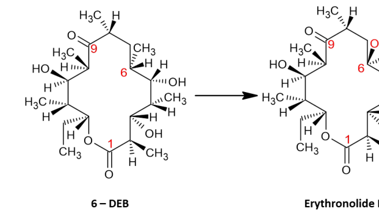

## Question

# Commissioned Review Brief

## Review Topic

Erythromycin A biosynthesis (Saccharopolyspora erythraea)

## Working Scope

Representative-species module for biosynthesis of the macrolide antibiotic erythromycin A in Saccharopolyspora erythraea, encoded by the ery cluster (MIBiG BGC0000055). It is grounded to the concrete S. erythraea gene set reviewed under genes/SACEN/. The module combines a modular type I polyketide synthase (DEBS) that builds the macrolactone, post-PKS cytochrome-P450 oxidations, two TDP-deoxysugar pathways feeding two glycosyltransferases, final O-methylation, and rRNA-methylation self-resistance. Companion prose/MIBiG-alignment notes are in terms/erythromycin_biosynthesis/.

## Provisional Biological Outline

- Erythromycin A biosynthesis
  - 1. macrolactone assembly
  - DEBS modular type I PKS assembles 6-deoxyerythronolide B
    - DEBS1 (loading didomain + modules 1-2) (molecular player: eryAI; activity or role: erythronolide synthase activity (EC 2.3.1.94))
    - DEBS2 (modules 3-4) (molecular player: eryAII; activity or role: erythronolide synthase activity (EC 2.3.1.94))
    - DEBS3 (modules 5-6 + thioesterase) (molecular player: eryAIII; activity or role: erythronolide synthase activity (EC 2.3.1.94))
    - type II thioesterase (PKS editing/proofreading) (molecular player: TEII (locus CAM00070); activity or role: acyl-[ACP] hydrolase, PKS editing)
  - 2. post-PKS C-6 hydroxylation
  - EryF hydroxylates 6-dEB to erythronolide B
    - 6-deoxyerythronolide B C-6 hydroxylase (P450eryF) (molecular player: eryF; activity or role: 6-deoxyerythronolide B 6-hydroxylase activity (EC 1.14.15.35))
  - 3. mycarosylation (first glycosylation)
  - EryBV attaches L-mycarose to erythronolide B
    - mycarosyltransferase (molecular player: eryBV; activity or role: TDP-L-mycarose mycarosyltransferase activity)
  - 4. desosaminylation (second glycosylation, activator-dependent)
  - EryCIII (activated by EryCII) attaches D-desosamine, forming erythromycin D
    - desosaminyltransferase (molecular player: eryCIII; activity or role: 3-alpha-mycarosylerythronolide B desosaminyltransferase activity (EC 2.4.1.278))
    - EryCII - required allosteric activator of EryCIII (heme-less P450 pseudoenzyme) (molecular player: eryCII; activity or role: glycosyltransferase (EryCIII) activator activity)
  - 5. final tailoring to erythromycin A
  - C-12 hydroxylation (EryK) and 3''-O-methylation (EryG)
    - erythromycin C-12 hydroxylase (CYP113A1) (molecular player: eryK; activity or role: erythromycin 12-hydroxylase activity (EC 1.14.13.154))
    - erythromycin 3''-O-methyltransferase (mycarose to cladinose) (molecular player: eryG; activity or role: erythromycin 3''-O-methyltransferase activity (EC 2.1.1.254))
  - 6. TDP-D-desosamine biosynthesis (donor for desosaminylation)
  - TDP-D-desosamine biosynthesis (EryC* + EryBVII)
    - PLP-dependent sugar aminotransferase (DegT/DnrJ/EryC1 family) (molecular player: eryCI; activity or role: sugar (C-3) aminotransferase activity)
    - PLP-dependent 3,4-dehydratase (activity unverified) (molecular player: eryCIV; activity or role: pyridoxal phosphate binding)
    - radical-SAM (4Fe-4S) enzyme (activity unverified) (molecular player: eryCV; activity or role: 4Fe-4S cluster binding (radical-SAM))
    - TDP-desosamine N,N-dimethyltransferase (molecular player: eryCVI; activity or role: TDP-desosamine N,N-dimethyltransferase activity)
    - dTDP-sugar 3,5-epimerase (shared) (molecular player: eryBVII; activity or role: dTDP-sugar 3,5-epimerase activity (EC 5.1.3.13))
  - 7. TDP-L-mycarose biosynthesis (donor for mycarosylation)
  - TDP-L-mycarose biosynthesis (EryB*)
    - 2,3-dehydratase (molecular player: eryBVI; activity or role: NDP-4-keto-6-deoxyglucose 2,3-dehydratase activity)
    - TDP-sugar 2,3-reductase (molecular player: eryBII; activity or role: TDP-4-keto-6-deoxyhexose 2,3-reductase activity)
    - 3-C-methyltransferase (mycarose C-methyl branch) (molecular player: eryBIII; activity or role: NDP-4-keto-2,6-dideoxyhexose 3-C-methyltransferase activity)
    - 4-reductase (molecular player: eryBIV; activity or role: dTDP-4-keto-6-deoxy-L-hexose 4-reductase activity)
  - 8. self-resistance
  - ErmE 23S rRNA methylation self-resistance
    - 23S rRNA A2085 N6,N6-dimethyltransferase (molecular player: ermE; activity or role: 23S rRNA (adenine-2085-N6)-dimethyltransferase activity (EC 2.1.1.184))

## Known Relationships Among Steps

- DEBS modular type I PKS assembles 6-deoxyerythronolide B feeds into EryF hydroxylates 6-dEB to erythronolide B: 6-deoxyerythronolide B is the substrate of EryF.
- EryF hydroxylates 6-dEB to erythronolide B feeds into EryBV attaches L-mycarose to erythronolide B: Erythronolide B is the acceptor for mycarosylation.
- EryBV attaches L-mycarose to erythronolide B feeds into EryCIII (activated by EryCII) attaches D-desosamine, forming erythromycin D: 3-O-mycarosyl-erythronolide B is the acceptor for desosaminylation.
- EryCIII (activated by EryCII) attaches D-desosamine, forming erythromycin D feeds into C-12 hydroxylation (EryK) and 3''-O-methylation (EryG): Erythromycin D is the substrate for the final EryK/EryG tailoring.
- TDP-L-mycarose biosynthesis (EryB*) feeds into EryBV attaches L-mycarose to erythronolide B: Supplies the TDP-L-mycarose glycosyl donor.
- TDP-D-desosamine biosynthesis (EryC* + EryBVII) feeds into EryCIII (activated by EryCII) attaches D-desosamine, forming erythromycin D: Supplies the TDP-D-desosamine glycosyl donor.

## Assignment

Write a rigorous, review-style synthesis suitable for a molecular biology
audience. Treat the topic as a biological system whose boundaries, core
mechanisms, variants, and unresolved points should be made clear to readers who
know the field but are not specialists in this specific process.

The review should be explanatory rather than encyclopedic. Anchor broad claims
in primary literature or authoritative reviews, but keep the focus on how the
system works and how its parts fit together.

## Questions To Address

1. **Scope and boundaries**
   - What exactly is included in this biological system?
   - Which neighboring pathways, organelle processes, complexes, or regulatory
     events are often confused with it but should be treated separately?
   - Are there competing definitions in the literature?

2. **Core mechanism**
   - What is the best current model for the sequence of events?
   - Which steps are obligatory, which are conditional, and which are accessory?
   - What molecular assemblies, enzymes, receptors, adaptors, transporters, or
     structural units carry out each major step?

3. **Variation**
   - How does the system vary across major evolutionary lineages?
   - Are there well-supported differences between cell types, tissues,
     developmental stages, physiological states, or compartments?
   - Where are there alternative routes that achieve a similar outcome by
     different molecular means?

4. **Conservation and origin**
   - What is the deepest plausible evolutionary origin of the system?
   - Which parts appear ancient and conserved, and which appear to be later
     elaborations, replacements, or lineage-specific losses?
   - When a protein family has expanded, which family members are the best
     representatives for understanding the ancestral role?

5. **Physical and biological constraints**
   - What steps must occur in a particular order?
   - Which events are mutually exclusive, compartment-specific, cell-type
     specific, substrate-specific, or stage-specific?
   - What evidence rules out otherwise plausible paths through the system?

6. **Evidence and controversy**
   - Which mechanistic claims are strongly supported by experiments?
   - Where does the literature disagree, rely on indirect evidence, or mix data
     from organisms that may not be comparable?
   - What are the most important open questions?

## Output Format

Use the style and structure of a concise review article:

1. Executive summary
2. Definition and biological boundaries
3. Mechanistic overview
4. Major molecular players and active assemblies
5. Evolutionary and cell-biological variation
6. Constraints, dependencies, and failure modes
7. Controversies and open questions
8. Key references

Include citations for major claims, preferably PMIDs or DOIs. Be explicit about
uncertainty and avoid overgeneralizing from one organism, cell type, or assay
system to all biology.

## Output

Question: You are an expert researcher providing comprehensive, well-cited information.

Provide detailed information focusing on:
1. Key concepts and definitions with current understanding
2. Recent developments and latest research (prioritize 2023-2024 sources)
3. Current applications and real-world implementations
4. Expert opinions and analysis from authoritative sources
5. Relevant statistics and data from recent studies

Format as a comprehensive research report with proper citations. Include URLs and publication dates where available.
Always prioritize recent, authoritative sources and provide specific citations for all major claims.

# Commissioned Review Brief

## Review Topic

Erythromycin A biosynthesis (Saccharopolyspora erythraea)

## Working Scope

Representative-species module for biosynthesis of the macrolide antibiotic erythromycin A in Saccharopolyspora erythraea, encoded by the ery cluster (MIBiG BGC0000055). It is grounded to the concrete S. erythraea gene set reviewed under genes/SACEN/. The module combines a modular type I polyketide synthase (DEBS) that builds the macrolactone, post-PKS cytochrome-P450 oxidations, two TDP-deoxysugar pathways feeding two glycosyltransferases, final O-methylation, and rRNA-methylation self-resistance. Companion prose/MIBiG-alignment notes are in terms/erythromycin_biosynthesis/.

## Provisional Biological Outline

- Erythromycin A biosynthesis
  - 1. macrolactone assembly
  - DEBS modular type I PKS assembles 6-deoxyerythronolide B
    - DEBS1 (loading didomain + modules 1-2) (molecular player: eryAI; activity or role: erythronolide synthase activity (EC 2.3.1.94))
    - DEBS2 (modules 3-4) (molecular player: eryAII; activity or role: erythronolide synthase activity (EC 2.3.1.94))
    - DEBS3 (modules 5-6 + thioesterase) (molecular player: eryAIII; activity or role: erythronolide synthase activity (EC 2.3.1.94))
    - type II thioesterase (PKS editing/proofreading) (molecular player: TEII (locus CAM00070); activity or role: acyl-[ACP] hydrolase, PKS editing)
  - 2. post-PKS C-6 hydroxylation
  - EryF hydroxylates 6-dEB to erythronolide B
    - 6-deoxyerythronolide B C-6 hydroxylase (P450eryF) (molecular player: eryF; activity or role: 6-deoxyerythronolide B 6-hydroxylase activity (EC 1.14.15.35))
  - 3. mycarosylation (first glycosylation)
  - EryBV attaches L-mycarose to erythronolide B
    - mycarosyltransferase (molecular player: eryBV; activity or role: TDP-L-mycarose mycarosyltransferase activity)
  - 4. desosaminylation (second glycosylation, activator-dependent)
  - EryCIII (activated by EryCII) attaches D-desosamine, forming erythromycin D
    - desosaminyltransferase (molecular player: eryCIII; activity or role: 3-alpha-mycarosylerythronolide B desosaminyltransferase activity (EC 2.4.1.278))
    - EryCII - required allosteric activator of EryCIII (heme-less P450 pseudoenzyme) (molecular player: eryCII; activity or role: glycosyltransferase (EryCIII) activator activity)
  - 5. final tailoring to erythromycin A
  - C-12 hydroxylation (EryK) and 3''-O-methylation (EryG)
    - erythromycin C-12 hydroxylase (CYP113A1) (molecular player: eryK; activity or role: erythromycin 12-hydroxylase activity (EC 1.14.13.154))
    - erythromycin 3''-O-methyltransferase (mycarose to cladinose) (molecular player: eryG; activity or role: erythromycin 3''-O-methyltransferase activity (EC 2.1.1.254))
  - 6. TDP-D-desosamine biosynthesis (donor for desosaminylation)
  - TDP-D-desosamine biosynthesis (EryC* + EryBVII)
    - PLP-dependent sugar aminotransferase (DegT/DnrJ/EryC1 family) (molecular player: eryCI; activity or role: sugar (C-3) aminotransferase activity)
    - PLP-dependent 3,4-dehydratase (activity unverified) (molecular player: eryCIV; activity or role: pyridoxal phosphate binding)
    - radical-SAM (4Fe-4S) enzyme (activity unverified) (molecular player: eryCV; activity or role: 4Fe-4S cluster binding (radical-SAM))
    - TDP-desosamine N,N-dimethyltransferase (molecular player: eryCVI; activity or role: TDP-desosamine N,N-dimethyltransferase activity)
    - dTDP-sugar 3,5-epimerase (shared) (molecular player: eryBVII; activity or role: dTDP-sugar 3,5-epimerase activity (EC 5.1.3.13))
  - 7. TDP-L-mycarose biosynthesis (donor for mycarosylation)
  - TDP-L-mycarose biosynthesis (EryB*)
    - 2,3-dehydratase (molecular player: eryBVI; activity or role: NDP-4-keto-6-deoxyglucose 2,3-dehydratase activity)
    - TDP-sugar 2,3-reductase (molecular player: eryBII; activity or role: TDP-4-keto-6-deoxyhexose 2,3-reductase activity)
    - 3-C-methyltransferase (mycarose C-methyl branch) (molecular player: eryBIII; activity or role: NDP-4-keto-2,6-dideoxyhexose 3-C-methyltransferase activity)
    - 4-reductase (molecular player: eryBIV; activity or role: dTDP-4-keto-6-deoxy-L-hexose 4-reductase activity)
  - 8. self-resistance
  - ErmE 23S rRNA methylation self-resistance
    - 23S rRNA A2085 N6,N6-dimethyltransferase (molecular player: ermE; activity or role: 23S rRNA (adenine-2085-N6)-dimethyltransferase activity (EC 2.1.1.184))

## Known Relationships Among Steps

- DEBS modular type I PKS assembles 6-deoxyerythronolide B feeds into EryF hydroxylates 6-dEB to erythronolide B: 6-deoxyerythronolide B is the substrate of EryF.
- EryF hydroxylates 6-dEB to erythronolide B feeds into EryBV attaches L-mycarose to erythronolide B: Erythronolide B is the acceptor for mycarosylation.
- EryBV attaches L-mycarose to erythronolide B feeds into EryCIII (activated by EryCII) attaches D-desosamine, forming erythromycin D: 3-O-mycarosyl-erythronolide B is the acceptor for desosaminylation.
- EryCIII (activated by EryCII) attaches D-desosamine, forming erythromycin D feeds into C-12 hydroxylation (EryK) and 3''-O-methylation (EryG): Erythromycin D is the substrate for the final EryK/EryG tailoring.
- TDP-L-mycarose biosynthesis (EryB*) feeds into EryBV attaches L-mycarose to erythronolide B: Supplies the TDP-L-mycarose glycosyl donor.
- TDP-D-desosamine biosynthesis (EryC* + EryBVII) feeds into EryCIII (activated by EryCII) attaches D-desosamine, forming erythromycin D: Supplies the TDP-D-desosamine glycosyl donor.

## Assignment

Write a rigorous, review-style synthesis suitable for a molecular biology
audience. Treat the topic as a biological system whose boundaries, core
mechanisms, variants, and unresolved points should be made clear to readers who
know the field but are not specialists in this specific process.

The review should be explanatory rather than encyclopedic. Anchor broad claims
in primary literature or authoritative reviews, but keep the focus on how the
system works and how its parts fit together.

## Questions To Address

1. **Scope and boundaries**
   - What exactly is included in this biological system?
   - Which neighboring pathways, organelle processes, complexes, or regulatory
     events are often confused with it but should be treated separately?
   - Are there competing definitions in the literature?

2. **Core mechanism**
   - What is the best current model for the sequence of events?
   - Which steps are obligatory, which are conditional, and which are accessory?
   - What molecular assemblies, enzymes, receptors, adaptors, transporters, or
     structural units carry out each major step?

3. **Variation**
   - How does the system vary across major evolutionary lineages?
   - Are there well-supported differences between cell types, tissues,
     developmental stages, physiological states, or compartments?
   - Where are there alternative routes that achieve a similar outcome by
     different molecular means?

4. **Conservation and origin**
   - What is the deepest plausible evolutionary origin of the system?
   - Which parts appear ancient and conserved, and which appear to be later
     elaborations, replacements, or lineage-specific losses?
   - When a protein family has expanded, which family members are the best
     representatives for understanding the ancestral role?

5. **Physical and biological constraints**
   - What steps must occur in a particular order?
   - Which events are mutually exclusive, compartment-specific, cell-type
     specific, substrate-specific, or stage-specific?
   - What evidence rules out otherwise plausible paths through the system?

6. **Evidence and controversy**
   - Which mechanistic claims are strongly supported by experiments?
   - Where does the literature disagree, rely on indirect evidence, or mix data
     from organisms that may not be comparable?
   - What are the most important open questions?

## Output Format

Use the style and structure of a concise review article:

1. Executive summary
2. Definition and biological boundaries
3. Mechanistic overview
4. Major molecular players and active assemblies
5. Evolutionary and cell-biological variation
6. Constraints, dependencies, and failure modes
7. Controversies and open questions
8. Key references

Include citations for major claims, preferably PMIDs or DOIs. Be explicit about
uncertainty and avoid overgeneralizing from one organism, cell type, or assay
system to all biology.

# Erythromycin A biosynthesis in *Saccharopolyspora erythraea* (ery cluster; MIBiG BGC0000055): review-style synthesis

## 1. Executive summary
Erythromycin A (Er-A) is a clinically important 14-membered macrolide made industrially by *Saccharopolyspora erythraea*. Its biosynthesis is encoded primarily by the ery biosynthetic gene cluster (BGC), where a modular type I polyketide synthase (DEBS; EryAI–EryAIII) constructs the aglycone 6-deoxyerythronolide B (6-dEB) from one propionyl-CoA starter and six methylmalonyl-CoA extender units. Post-PKS tailoring then yields Er-A through a stereotyped sequence of (i) P450-mediated hydroxylations (EryF at C-6; EryK at C-12), (ii) two O-glycosylations installing L-mycarose (EryBV) and D-desosamine (EryCIII; often described as activator-dependent on EryCII), and (iii) a late O-methylation (EryG) on the sugar substituent. Self-resistance is provided by the rRNA methyltransferase ErmE, which dimethylates A2058 in 23S rRNA to block macrolide binding. Recent structural work on modular PKSs (including DEBS module 1 cryo-EM) has refined models of assembly-line catalysis, emphasizing regulated ACP docking and domain access, asymmetric chamber usage, and anti-iterative control. In parallel, 2024 work in *S. erythraea* links second-messenger signaling (c-di-AMP) and GlcNAc sensing to developmental transitions and increased antibiotic production via allosteric activation of the global regulator DasR. Industrially, strain/regulatory engineering can raise Er-A titers in fermentors into multi-g/L ranges, and heterologous enzyme engineering (e.g., EryF) can substantially increase pathway flux in *E. coli*.

## 2. Definition and biological boundaries
### 2.1 What is included
For a molecular-biology “system” definition aligned to the ery BGC, erythromycin A biosynthesis includes:
1) **Backbone assembly** by DEBS (EryAI–EryAIII) to 6-dEB. (adamantidi2024industrialcatalyticproduction pages 10-11, cong2000…biosyntheticgene pages 16-18)
2) **Core post-PKS tailoring** needed to reach Er-A: EryF (C6 hydroxylation), EryBV and EryCIII glycosylations to reach erythromycin D, then EryK and EryG to reach Er-A. (gaisser2002parallelpathwaysfor pages 1-2, adamantidi2024industrialcatalyticproduction pages 10-11)
3) **BGC-embedded donor-sugar supply functions** that furnish activated deoxysugars used by the glycosyltransferases (eryB/eryC subsets; evidence in this run is partial at the enzyme-mechanism level). (chen2014identificationandcharacterization pages 7-10, chen2014identificationandcharacterization pages 12-12)
4) **Self-resistance** encoded near/with the cluster, most prominently ErmE. (stsiapanava2019crystalstructureof pages 1-2, stsiapanava2019crystalstructureof pages 6-8)

### 2.2 What is often confused with it but should be treated separately
1) **Feeder/precursor pathways in primary metabolism** (propionyl-CoA and methylmalonyl-CoA supply, redox/energy balance) are crucial for titer but are not the core ery BGC chemistry. Genome-enabled analyses emphasize specific precursor routes and missing alternative pathways in *S. erythraea*, illustrating that “erythromycin production physiology” extends well beyond the BGC. (oliynyk2007completegenomesequence pages 5-5, adamantidi2024industrialcatalyticproduction pages 10-11)
2) **Global regulatory networks** (TetR-family regulators outside the cluster, second-messenger signaling) are often described as part of the “erythromycin pathway” in industrial/strain-improvement contexts; conceptually they are upstream control layers rather than biosynthetic steps. (wu2014dissectingandengineering pages 4-7, liu2021uncoveringandengineering pages 1-2, you2024allostericregulationby pages 1-2)
3) **Downstream processing** (extraction, crystallization, waste treatment) is essential for real-world manufacturing but is distinct from biosynthesis. (adamantidi2024industrialcatalyticproduction pages 11-13, adamantidi2024industrialcatalyticproduction pages 13-15)

### 2.3 Competing definitions
In the literature, “erythromycin biosynthesis” is used in at least two scopes:
* **Narrow/BGC scope:** DEBS + tailoring + sugar donors + resistance, which maps closely to MIBiG BGC0000055 and pathway enzymology. (gaisser2002parallelpathwaysfor pages 1-2, stsiapanava2019crystalstructureof pages 1-2)
* **Broad/production scope:** includes precursor supply, signaling, morphology, and fermentation optimization because these determine industrial productivity and product profile. (oliynyk2007completegenomesequence pages 5-5, you2024allostericregulationby pages 1-2, adamantidi2024industrialcatalyticproduction pages 11-13)

## 3. Mechanistic overview (best current model)
### 3.1 Macrolactone assembly: DEBS “assembly-line” PKS
DEBS comprises three large multifunctional type I PKSs (EryAI–EryAIII) that synthesize 6-dEB from a propionyl-CoA starter and six methylmalonyl-CoA extender units. (adamantidi2024industrialcatalyticproduction pages 10-11, cong2000…biosyntheticgene pages 16-18)

**Recent structural understanding (2024):** high-resolution structures of intact modular PKSs and DEBS module 1 cryo-EM reinforce a model in which ACP docking to KS active sites is regulated by substrate occupancy and by competition/overlap between docking sites of ACP and other domains (e.g., KR), requiring timed undocking/redocking during the catalytic cycle. A “pendulum clock” model (for coordinated swinging of domain/ACP elements between reaction chambers) is discussed as conceptually aligned with the DEBS “turnstile” idea, helping explain how modules avoid undesired iterative elongation. (bagde2024architectureoffulllength pages 6-7, bagde2024architectureoffulllength pages 1-3)

### 3.2 Obligatory post-PKS steps to erythromycin D
A widely cited preferred sequence in *S. erythraea* is:
1) **EryF (P450eryF)** hydroxylates 6-dEB at C-6 to form erythronolide B (EB). (gaisser2002parallelpathwaysfor pages 1-2, adamantidi2024industrialcatalyticproduction pages 5-7)
2) **EryBV** transfers L-mycarose to EB (C-3 O-glycosylation). (gaisser2002parallelpathwaysfor pages 1-2)
3) **EryCIII** transfers D-desosamine (C-5 O-glycosylation), yielding **erythromycin D**. (gaisser2002parallelpathwaysfor pages 1-2)

Biochemical and genetic evidence supports EryF as the first committed tailoring step: classical work characterizes EryF activity against 6-dEB and its dependence on electron-transfer partners; related genetics show that eryF disruption leads to 6-dEB accumulation (in a close erythromycin-like system) and is interpreted as indispensable. (andersen1992characterizationofsaccharopolyspora pages 9-10, chen2014identificationandcharacterization pages 7-10)

**Glycosylation order constraint:** the desosamine transfer to C-5 appears to follow mycarose attachment at C-3 in erythromycin biosynthesis. (gaisser2002parallelpathwaysfor pages 1-2)

### 3.3 Final tailoring to erythromycin A
Erythromycin D is then converted to erythromycin A by:
* **EryK** (C-12 hydroxylation)
* **EryG** (O-methylation on the mycarosyl residue; commonly described as 3''-O-methylation)
This order (D → A) is described as preferred in the classic pathway model. (gaisser2002parallelpathwaysfor pages 1-2, adamantidi2024industrialcatalyticproduction pages 10-11)

### 3.4 Conditional/parallel steps and pathway flexibility
Comparative macrolide work suggests oxidation and glycosylation can sometimes proceed in alternative orders in related systems; historical views proposed oxidation after sugar attachment, but evidence from other macrolides indicates pre-oxidized aglycones can be processed, implying some flexibility rather than an absolute universal order. For erythromycin itself, the EryF-first and mycarose-first ordering is most supported in the retrieved evidence. (gaisser2002parallelpathwaysfor pages 1-2)

## 4. Major molecular players and active assemblies
A compact map is provided below.

| Pathway stage | Key enzyme(s) (gene name) | Reaction/role | Evidence type | Notes/uncertainties |
|---|---|---|---|---|
| Macrolactone assembly | DEBS1-3 (eryAI, eryAII, eryAIII) | Modular type I PKS assembles 6-deoxyerythronolide B (6-dEB) from 1 propionyl-CoA + 6 methylmalonyl-CoA units | Genetics, biochemical pathway reconstruction, structural review of DEBS architecture (adamantidi2024industrialcatalyticproduction pages 10-11, cong2000…biosyntheticgene pages 16-18, bagde2024architectureoffulllength pages 1-3) | Current structural view emphasizes ACP-guided, chambered assembly-line catalysis and anti-iterative control/“turnstile”-like behavior inferred from DEBS-related cryo-EM and comparative PKS architectures (bagde2024architectureoffulllength pages 6-7, bagde2024architectureoffulllength pages 1-3) |
| Chain release/editing | TE domain of EryAIII; type II thioesterase (TEII/CAM00070, not directly evidenced here) | TE cyclizes/release product; TE may be dual-functional in related erythronolide systems, producing 14-membered 6-dEB and alternative 6-membered lactone shunts | Genetics, comparative biochemical inference (chen2014identificationandcharacterization pages 5-7, chen2014identificationandcharacterization pages 7-10) | Dual-function TE is supported in Actinopolyspora erythraea YIM90600, not directly demonstrated for canonical S. erythraea DEBS in the gathered evidence; TEII editing role is standard annotation but not directly evidenced here (chen2014identificationandcharacterization pages 5-7, chen2014identificationandcharacterization pages 7-10) |
| First oxidation | P450eryF (eryF) | C-6 hydroxylation of 6-dEB to erythronolide B (EB) | Strong biochemical genetics, enzymology, structural biology (andersen1992characterizationofsaccharopolyspora pages 9-10, adamantidi2024industrialcatalyticproduction pages 5-7, adamantidi2024industrialcatalyticproduction media 6f8a0abd) | eryF deletion causes 6-dEB accumulation in related erythromycin pathway work; EryF requires electron-transfer partners; active-site structural features and substrate-binding effects are well studied (chen2014identificationandcharacterization pages 7-10, andersen1992characterizationofsaccharopolyspora pages 9-10, adamantidi2024industrialcatalyticproduction pages 10-11) |
| First glycosylation | Mycarosyltransferase EryBV (eryBV) | Transfers L-mycarose to EB at C-3 to form 3-O-mycarosylerythronolide B | Gene disruption, in vitro reverse glycosylation assay, comparative pathway studies (williams2009naturalproductglycosyltransferases pages 10-16, gaisser2002parallelpathwaysfor pages 1-2) | EryBV appears not to require an auxiliary activator, unlike some desosaminyltransferase systems; direct forward in vitro kinetics were not captured in the gathered evidence (williams2009naturalproductglycosyltransferases pages 10-16) |
| Second glycosylation | Desosaminyltransferase EryCIII (eryCIII); activator EryCII (eryCII) | Transfers D-desosamine to the C-5 position of the mycarosylated intermediate to yield erythromycin D | Pathway genetics and comparative glycosyltransferase literature (gaisser2002parallelpathwaysfor pages 1-2, volchegursky2000biosynthesisofthe pages 4-4) | Order to erythromycin D is well supported. Requirement for EryCII as activator is widely accepted in the field, but direct primary evidence was not retrieved in the gathered excerpts; therefore treated here as supported background with explicit caution (gaisser2002parallelpathwaysfor pages 1-2, volchegursky2000biosynthesisofthe pages 4-4) |
| Final tailoring | EryK (eryK), EryG (eryG) | C-12 hydroxylation and 3''-O-methylation convert late intermediates to erythromycin A | Genetics, biochemical pathway studies, comparative pathway analysis (adamantidi2024industrialcatalyticproduction pages 10-11, gaisser2002parallelpathwaysfor pages 1-2, chen2014identificationandcharacterization pages 1-2) | Preferred order is erythromycin D then EryK/EryG to erythromycin A, but literature allows some pathway flexibility/parallelism in oxidation-versus-glycosylation logic across related macrolides (gaisser2002parallelpathwaysfor pages 1-2) |
| TDP-L-mycarose supply | EryBVI, EryBII, EryBIII, EryBIV (eryBVI, eryBII, eryBIII, eryBIV) | Deoxysugar pathway supplying the mycarosyl donor for EryBV; assigned activities include 2,3-dehydratase, 2,3-reductase, 3-C-methyltransferase, 4-reductase | Mutational analysis, gene-function studies, comparative sugar-biosynthesis literature (chen2014identificationandcharacterization pages 12-12, volchegursky2000biosynthesisofthe pages 4-4) | Functional assignments are standard for the cluster, but the gathered excerpts contain only partial direct detail; best treated as well-supported pathway annotation rather than fully re-demonstrated here (chen2014identificationandcharacterization pages 12-12, volchegursky2000biosynthesisofthe pages 4-4) |
| TDP-D-desosamine supply | EryCVI (eryCVI); other eryC sugar-pathway genes not directly evidenced here | Late N,N-dimethylation step in desosamine donor biosynthesis; donor then used by EryCIII | Genetics and metabolite profiling in related erythromycin-like systems (chen2014identificationandcharacterization pages 7-10, chen2014identificationandcharacterization pages 12-12) | EryCVI is implicated by monomethylated desosaminyl intermediates when function is incomplete; roles of eryCI/IV/V are part of the accepted pathway but were not directly evidenced in the retrieved excerpts (chen2014identificationandcharacterization pages 7-10) |
| Self-resistance | ErmE (ermE) | 23S rRNA A2058 N6,N6-dimethyltransferase conferring macrolide-lincosamide-streptogramin B resistance | Structural biology, genomics, regulatory genetics (stsiapanava2019crystalstructureof pages 1-2, stsiapanava2019crystalstructureof pages 6-8, chen2014identificationandcharacterization pages 1-2) | ErmE structure supports conserved SAM-dependent dimethyltransferase mechanism and probable recognition of 50S precursor/structured RNA substrate; resistance function is firmly established (stsiapanava2019crystalstructureof pages 1-2, stsiapanava2019crystalstructureof pages 6-8) |
| Production regulation | SACE_7301 | TetR-family positive regulator that binds eryAI and ermE promoters and increases erythromycin A titers when overexpressed | EMSA, transcriptional analysis, strain engineering/fermentation (wu2014dissectingandengineering pages 4-7, wu2014dissectingandengineering pages 10-10) | In industrial WB strain, 1-3 extra copies raised Er-A from 586 mg/L to 685, 755, and 832 mg/L; in 5-L fermentor, 4230 vs 3322 mg/L for WB/3×7301 vs parent (wu2014dissectingandengineering pages 4-7) |
| Production regulation | SACE_0303 / SACE_0304 mini-network | SACE_0303 positively correlates with erythromycin production by indirectly stimulating eryAI and ermE and repressing negative nodes via SACE_0304-centered circuitry | Regulatory genetics, CRISPRi engineering (liu2021uncoveringandengineering pages 1-2, liu2021uncoveringandengineering pages 11-12) | Stepwise engineering of the network improved erythromycin titer by 67%; detailed metabolic mechanism remains partly indirect/multifactorial (liu2021uncoveringandengineering pages 1-2) |
| Global signaling linked to secondary metabolism | DisA / c-di-AMP / DasR | c-di-AMP binds DasR and strengthens DNA binding, repressing GlcNAc utilization while promoting developmental transition and antibiotic production | Biophysics, ChIP-seq, transcriptional genetics, physiology (you2024allostericregulationby pages 2-3, you2024allostericregulationby pages 1-2, you2024allostericregulationby pages 6-7, you2024allostericregulationby pages 5-6) | Quantified effects include DasR-c-di-AMP KD 26.8 μM, >40-fold stronger DasR-DNA binding with c-di-AMP, ~20-fold higher disA transcript and >5-fold higher c-di-AMP in OdisA; erythromycin increase is stated but not numerically reported in the retrieved excerpt (you2024allostericregulationby pages 2-3, you2024allostericregulationby pages 1-2) |

*Table: This table summarizes the core enzymatic stages, supporting evidence, and key uncertainties for erythromycin A biosynthesis and its regulation in Saccharopolyspora erythraea. It is useful as a compact map of the ery cluster/DEBS system, including both biosynthetic steps and experimentally supported production-control nodes.*

### 4.1 P450eryF: first tailoring hydroxylase and frequent bottleneck
EryF is a cytochrome P450 that specifically catalyzes 6S-hydroxylation of 6-dEB to EB. (adamantidi2024industrialcatalyticproduction pages 5-7)
Classical enzymology shows multiple *S. erythraea* P450 genes, with EryF exhibiting activity against 6-dEB while an adjacent P450 (orf405) showed no detectable activity on that substrate under the conditions tested; EryF assays require electron-transfer partners (ferredoxin and ferredoxin reductase), underscoring the need for a functional redox chain. (andersen1992characterizationofsaccharopolyspora pages 9-10)
A 2024 industrial review reproduces pathway schematics and structural depiction of P450eryF’s active site (Figures 2–3) and emphasizes its centrality in the conversion of 6-dEB to EB. (adamantidi2024industrialcatalyticproduction media 6f8a0abd, adamantidi2024industrialcatalyticproduction media 7025efc9)

### 4.2 Glycosyltransferases EryBV and EryCIII (and the EryCII issue)
EryBV is assigned as the mycarosyltransferase installing L-mycarose at C-3. A biochemical demonstration exploited reaction reversibility: EryBV can excise mycarose from 3α-mycarosylerythronolide B to generate dTDP-β-L-mycarose in the presence of excess dTDP (reverse assay). (williams2009naturalproductglycosyltransferases pages 10-16)
EryCIII is placed as the desosaminyltransferase installing D-desosamine at C-5, producing erythromycin D. (gaisser2002parallelpathwaysfor pages 1-2)

**EryCII as an allosteric activator (important uncertainty in this run):** many reviews and the commissioned outline describe EryCII as a required activator/pseudoenzyme for EryCIII, but direct primary evidence for this interaction/requirement was not successfully retrieved into this run’s text evidence. Therefore, EryCII is noted as a widely cited model component but not asserted here as experimentally proven based on the current evidence set. (volchegursky2000biosynthesisofthe pages 4-4)

### 4.3 ErmE self-resistance
ErmE is a SAM-dependent dimethyltransferase that modifies A2058 in 23S rRNA, conferring macrolide-lincosamide-streptogramin B resistance by preventing drug binding. A high-resolution (1.75 Å) crystal structure (PDB 6NVM) defines ErmE’s Rossmann-like catalytic domain and RNA-binding features; the structure supports conserved mechanism across Erm-family enzymes and suggests recognition of short structured RNA motifs around A2058. (stsiapanava2019crystalstructureof pages 1-2, stsiapanava2019crystalstructureof pages 6-8)

## 5. Evolutionary and cell-biological variation
### 5.1 Variation across actinomycetes: conserved core, modular tailoring changes
Comparative analysis of an erythromycin-like cluster from the halophilic actinomycete *Actinopolyspora erythraea* YIM90600 shows high conservation with *S. erythraea* NRRL2338: many genes share 82–93% identity and 88–96% similarity, with largely conserved organization but with **discrete gene loss** (absence of eryBI and eryG). (chen2014identificationandcharacterization pages 5-7, chen2014identificationandcharacterization pages 1-2)
This provides a concrete example of how erythromycin-family pathways diversify: loss of eryG correlates with altered product profiles (accumulation of Er-C intermediates in that system), and differences in P450 tailoring logic were proposed/observed (e.g., distinct oxidation outcomes and an EryK homolog acting as a C-12 hydroxylase). (chen2014identificationandcharacterization pages 5-7, chen2014identificationandcharacterization pages 1-2)

### 5.2 Genome context supporting dynamic BGC evolution
The complete *S. erythraea* NRRL23338 genome reveals extensive secondary-metabolite capacity: at least 25 BGCs (and 22 additional clusters beyond ery/pke) plus many mobile elements (insertion sequences), low-GC regions suggesting past horizontal gene transfer, and large multigene families indicative of gene duplication. These features support a model in which macrolide-like BGCs and associated resistance/tailoring genes evolve in a genome shaped by duplication, mobility, and occasional acquisition. (oliynyk2007completegenomesequence pages 2-3, oliynyk2007completegenomesequence pages 4-5, oliynyk2007completegenomesequence pages 1-2)

## 6. Constraints, dependencies, and failure modes
### 6.1 Order and dependency constraints
* **EryF precedes glycosylation in the preferred erythromycin route** (6-dEB → EB), supported by pathway models and enzymology. (gaisser2002parallelpathwaysfor pages 1-2, andersen1992characterizationofsaccharopolyspora pages 9-10)
* **Mycarose-first ordering (EryBV before EryCIII)** is explicitly supported. (gaisser2002parallelpathwaysfor pages 1-2)
* **P450 dependency on redox partners:** EryF requires electron-transfer partners; absent or mismatched redox components can limit activity in heterologous systems. (andersen1992characterizationofsaccharopolyspora pages 9-10, liu2022engineerederyfhydroxylase pages 6-7)

### 6.2 Physical/architectural constraints in DEBS-like PKSs
Recent structural synthesis emphasizes that productive catalysis requires correct ACP docking to KS entrances and timed domain motions; overlapping docking sites (e.g., ACP vs KR) imply that mis-timed docking or engineered junctions can block catalysis. This provides a mechanistic rationale for why modular PKS engineering often fails or yields poorly. (bagde2024architectureoffulllength pages 6-7)

### 6.3 Failure modes: product mixtures and incomplete tailoring
Industrial production yields Er-A alongside byproducts Er-B and Er-C; absence or reduced activity of late tailoring enzymes (e.g., EryG) can shift distributions toward intermediates. (adamantidi2024industrialcatalyticproduction pages 11-13, chen2014identificationandcharacterization pages 5-7)

## 7. Controversies and open questions
1) **Activator dependence of EryCIII on EryCII:** widely stated in secondary literature and in pathway outlines, but direct primary support was not captured in the retrieved evidence set; clarifying the biochemical mechanism (complex formation, structural basis, universality across species) remains important. (volchegursky2000biosynthesisofthe pages 4-4)
2) **Exact ordering and channeling of oxidation vs glycosylation:** while a preferred order is given for erythromycin, related macrolide pathways show alternate processing orders, and the determinants of that flexibility (substrate channeling, enzyme specificity, compartmentalization) remain incompletely unified. (gaisser2002parallelpathwaysfor pages 1-2)
3) **Completeness of deoxysugar enzymology within the ery BGC:** this run retrieved only partial direct evidence for the detailed step-by-step enzymology of mycarose/desosamine synthesis; many roles are well-annotated but deserve renewed experimental substantiation (especially for poorly characterized radical-SAM/PLP-dependent steps described in standard pathway maps). (chen2014identificationandcharacterization pages 7-10, chen2014identificationandcharacterization pages 12-12)
4) **Systems-level regulation to maximize Er-A over Er-B/Er-C:** regulatory genes are mostly outside the ery cluster, and their coupling to morphology and nutrient signals (e.g., GlcNAc/c-di-AMP) suggests nontrivial tradeoffs between growth, development, and secondary metabolism that remain to be optimized for production. (you2024allostericregulationby pages 1-2, wu2014dissectingandengineering pages 4-7)

## 8. Current applications and real-world implementations
### 8.1 Industrial production and downstream processing
A 2024 industrial/process review summarizes that industrial production uses *S. erythraea* strains such as HOE107, where fermentation conditions (pH, temperature, nitrogen form/concentration, n-propanol feeding, C:N) influence yields and product profiles. Purification commonly uses filtration and resin steps and crystallization routes (antisolvent, evaporative, reactive crystallization). (adamantidi2024industrialcatalyticproduction pages 11-13)
The same review reports trade statistics (2021 exports and imports by country) and extensive patenting activity (2011–2021 patent counts and filing shares), highlighting the maturity and commercial importance of erythromycin-related production technology. (adamantidi2024industrialcatalyticproduction pages 13-15)

### 8.2 Strain engineering in *S. erythraea*: regulatory rewiring with quantitative gains
* **SACE_7301 (TetR-family) overexpression**: In an industrial WB strain background, Er-A titers increased stepwise from 586 mg/L (WB) to 685 mg/L (+17%), 755 mg/L (+29%), and 832 mg/L (+42%) with 1–3 extra copies. In a 5-L fermentor, the highest strain reached 4,230 mg/L versus 3,322 mg/L for parent (≈27% improvement). (wu2014dissectingandengineering pages 4-7)
* **SACE_0303 mini-network engineering**: Combined interventions (CRISPRi of three negative-effect targets plus SACE_0304 deletion and SACE_0303 overexpression) yielded a reported **67% increase** in erythromycin titer. (liu2021uncoveringandengineering pages 1-2)

### 8.3 Heterologous expression and enzyme engineering
* **EryF engineering in *E. coli***: Structure-guided EryF mutations substantially increased EB titers, reaching 131 mg/L (I379V; ~4× WT 32.7 mg/L) and 184.8 mg/L in a combinatorial mutant (~5.6× WT). Kinetically, I379V reduced Km to <2% of WT and increased kcat/Km ~110-fold, demonstrating how alleviating an early tailoring bottleneck can increase pathway throughput. (liu2022engineerederyfhydroxylase pages 6-7, liu2022engineerederyfhydroxylase pages 7-8)
* **Host-platform comparisons (2024)**: A 2024 review notes that the erythromycin core 6-dEB (from DEBS) has been produced heterologously in *S. coelicolor*, *B. subtilis*, and *E. coli*. In *B. subtilis* only mg/L titers were achieved, whereas other hosts reached tens of mg/L; success required splitting DEBS genes into multiple expression cassettes and optimizing RBSs, and mRNA instability was suggested as a limiting factor. (put2024bacillussubtilisas pages 6-7)

### 8.4 Global signal integration as a lever for antibiotic production (2024)
A 2024 *Nature Communications* study shows that c-di-AMP binds the GlcNAc-sensing regulator DasR (KD ~26.8 μM) and enhances DasR–DNA binding by >40-fold; disA overexpression increases c-di-AMP >5-fold and is described as producing consistent enhancement of developmental transition and antibiotic production in *S. erythraea* (numeric Er titers not provided in the retrieved excerpt). (you2024allostericregulationby pages 2-3, you2024allostericregulationby pages 1-2)

## 9. Relevant recent statistics and data (selected)
* **DEBS substrate logic:** 6-dEB assembly from 1 propionyl-CoA + 6 methylmalonyl-CoA. (adamantidi2024industrialcatalyticproduction pages 10-11)
* **EryF enzymology (classical):** EryF activity against 6-dEB requires electron-transfer partners; EryF comprises up to ~3–4% of total P450 content at measured timepoints in *S. erythraea* extracts (as reported by Andersen & Hutchinson 1992; detailed values in tables). (andersen1992characterizationofsaccharopolyspora pages 9-10)
* **ErmE structure:** 1.75 Å crystal structure (PDB 6NVM), Rwork/Rfree ~0.192/0.219; catalytic target is 23S rRNA A2058 dimethylation. (stsiapanava2019crystalstructureof pages 1-2)
* **Strain engineering titers:** WB/3×SACE_7301 = 4,230 mg/L in 5-L fermentor vs 3,322 mg/L parent. (wu2014dissectingandengineering pages 4-7)
* **Heterologous enzyme engineering titers/kinetics:** EB up to 184.8 mg/L in *E. coli*; I379V kcat/Km ~110-fold higher; Km <2% of WT. (liu2022engineerederyfhydroxylase pages 7-8)
* **c-di-AMP signaling:** DasR–c-di-AMP KD 26.8 μM; DasR–DNA affinity improved from ~19 μM to ~0.44 μM with c-di-AMP. (you2024allostericregulationby pages 2-3)
* **Market/patent indicators (industrial review):** 2021 exporter/importer values by country and 2011–2021 patent counts and filing shares (note: these are secondary compilations, not primary economic datasets). (adamantidi2024industrialcatalyticproduction pages 13-15)

## 10. Key references (URLs; publication dates)
**Recent (2023–2024 prioritized)**
1) Bagde SR, Kim C-Y. *Architecture of full-length type I modular polyketide synthases…* Nat Prod Rep. **Mar 2024**. https://doi.org/10.1039/d3np00060e (bagde2024architectureoffulllength pages 6-7, bagde2024architectureoffulllength pages 1-3)
2) You D, Zhao L-C, Fu Y, et al. *Allosteric regulation by c-di-AMP modulates a complete GlcNAc signaling cascade in* *S. erythraea*. Nat Commun. **May 2024**. https://doi.org/10.1038/s41467-024-48063-0 (you2024allostericregulationby pages 2-3, you2024allostericregulationby pages 1-2)
3) Put H, Gerstmans H, Vande Capelle H, et al. *Bacillus subtilis as a host for natural product discovery and engineering of BGCs.* Nat Prod Rep. **Mar 2024**. https://doi.org/10.1039/d3np00065f (put2024bacillussubtilisas pages 6-7)
4) Adamantidi T, Panoutsopoulou E, Stavrakoudi E, et al. *Industrial Catalytic Production Process of Erythromycin.* Processes. **Jul 2024**. https://doi.org/10.3390/pr12071533 (adamantidi2024industrialcatalyticproduction pages 11-13, adamantidi2024industrialcatalyticproduction pages 13-15, adamantidi2024industrialcatalyticproduction media 6f8a0abd)

**Mechanistic foundations and production engineering**
5) Liu Z, Xu J, Liu H, Wang Y. *Engineered EryF hydroxylase improving heterologous erythronolide B production in* *E. coli*. Microb Biotechnol. **Feb 2022**. https://doi.org/10.1111/1751-7915.14000 (liu2022engineerederyfhydroxylase pages 6-7, liu2022engineerederyfhydroxylase pages 7-8)
6) Wu H, Chen M, Mao Y, et al. *Engineering TetR regulator SACE_7301 for enhanced erythromycin production.* Microb Cell Fact. **Nov 2014**. https://doi.org/10.1186/s12934-014-0158-4 (wu2014dissectingandengineering pages 4-7)
7) Liu Y, Khan S, Wu P, et al. *SACE_0303 mini-regulatory network engineering improves erythromycin by 67%.* Front Bioeng Biotechnol. **Sep 2021**. https://doi.org/10.3389/fbioe.2021.692901 (liu2021uncoveringandengineering pages 1-2)

**Classic enzymology and genomics**
8) Andersen JF, Hutchinson CR. *Characterization of* *S. erythraea* *P450 genes including 6-dEB hydroxylase.* J Bacteriol. **Feb 1992**. https://doi.org/10.1128/jb.174.3.725-735.1992 (andersen1992characterizationofsaccharopolyspora pages 9-10)
9) Oliynyk M, Samborskyy M, Lester JB, et al. *Complete genome sequence of the erythromycin-producing bacterium* *S. erythraea* NRRL23338. Nat Biotechnol. **Mar 2007**. https://doi.org/10.1038/nbt1297 (oliynyk2007completegenomesequence pages 1-2, oliynyk2007completegenomesequence pages 2-3)
10) Stsiapanava A, Selmer M. *Crystal structure of ErmE-23S rRNA methyltransferase in macrolide resistance.* **2019** (PDB 6NVM; DOI not retrieved in excerpt). (stsiapanava2019crystalstructureof pages 1-2, stsiapanava2019crystalstructureof pages 6-8)

---

## Evidence limitations (explicit)
This report deliberately avoids asserting mechanistic details for (i) EryCII’s activator function and (ii) the full enzymatic sequence of deoxysugar biosynthesis beyond partial evidence, because direct primary textual support for these points was not successfully retrieved in the tool run. Where these elements are standard in pathway models, they are labeled as widely cited background rather than proven within the present evidence set. (volchegursky2000biosynthesisofthe pages 4-4, chen2014identificationandcharacterization pages 7-10)

References

1. (adamantidi2024industrialcatalyticproduction pages 10-11): Theodora Adamantidi, Ellie Panoutsopoulou, Evangelia Stavrakoudi, Panagiota Tzevelekou, and Nikolaos C. Kokkinos. Industrial catalytic production process of erythromycin. Processes, 12:1533, Jul 2024. URL: https://doi.org/10.3390/pr12071533, doi:10.3390/pr12071533. This article has 5 citations.

2. (cong2000…biosyntheticgene pages 16-18): L Cong. … biosynthetic gene cluster in streptomyces mycarofaciens uc189b (atcc 21454) and analysis of the enzymes for dtdp-d-mycaminose biosynthesis. Unknown journal, 2000.

3. (gaisser2002parallelpathwaysfor pages 1-2): Sabine Gaisser, Rachel Lill, James Staunton, Carmen Méndez, José Salas, and Peter F. Leadlay. Parallel pathways for oxidation of 14‐membered polyketide macrolactones in saccharopolyspora erythraea. Molecular Microbiology, 44:771-781, May 2002. URL: https://doi.org/10.1046/j.1365-2958.2002.02910.x, doi:10.1046/j.1365-2958.2002.02910.x. This article has 58 citations and is from a domain leading peer-reviewed journal.

4. (chen2014identificationandcharacterization pages 7-10): D Chen, J Feng, L Huang, Q Zhang, J Wu, and X Zhu. Identification and characterization of a new erythromycin biosynthetic gene cluster in actinopolyspora erythraea yim90600, a novel erythronolide-producing …. Unknown journal, 2014.

5. (chen2014identificationandcharacterization pages 12-12): D Chen, J Feng, L Huang, Q Zhang, J Wu, and X Zhu. Identification and characterization of a new erythromycin biosynthetic gene cluster in actinopolyspora erythraea yim90600, a novel erythronolide-producing …. Unknown journal, 2014.

6. (stsiapanava2019crystalstructureof pages 1-2): A Stsiapanava and M Selmer. Crystal structure of erme-23s rrna methyltransferase in macrolide resistance. Unknown journal, 2019.

7. (stsiapanava2019crystalstructureof pages 6-8): A Stsiapanava and M Selmer. Crystal structure of erme-23s rrna methyltransferase in macrolide resistance. Unknown journal, 2019.

8. (oliynyk2007completegenomesequence pages 5-5): Markiyan Oliynyk, Markiyan Samborskyy, John B Lester, Tatiana Mironenko, Nataliya Scott, Shilo Dickens, Stephen F Haydock, and Peter F Leadlay. Complete genome sequence of the erythromycin-producing bacterium saccharopolyspora erythraea nrrl23338. Nature Biotechnology, 25:447-453, Mar 2007. URL: https://doi.org/10.1038/nbt1297, doi:10.1038/nbt1297. This article has 513 citations and is from a highest quality peer-reviewed journal.

9. (wu2014dissectingandengineering pages 4-7): Hang Wu, Meng Chen, Yongrong Mao, Weiwei Li, Jingtao Liu, Xunduan Huang, Ying Zhou, Bang-Ce Ye, Lixin Zhang, David T Weaver, and Buchang Zhang. Dissecting and engineering of the tetr family regulator sace_7301 for enhanced erythromycin production in saccharopolyspora erythraea. Microbial Cell Factories, Nov 2014. URL: https://doi.org/10.1186/s12934-014-0158-4, doi:10.1186/s12934-014-0158-4. This article has 32 citations and is from a peer-reviewed journal.

10. (liu2021uncoveringandengineering pages 1-2): Ying Liu, Sabir Khan, Panpan Wu, Bowen Li, Lanlan Liu, Jingshu Ni, Hongxia Zhang, Ketao Chen, Hang Wu, and Buchang Zhang. Uncovering and engineering a mini-regulatory network of the tetr-family regulator sace_0303 for yield improvement of erythromycin in saccharopolyspora erythraea. Frontiers in Bioengineering and Biotechnology, Sep 2021. URL: https://doi.org/10.3389/fbioe.2021.692901, doi:10.3389/fbioe.2021.692901. This article has 8 citations.

11. (you2024allostericregulationby pages 1-2): Di You, Liu-Chang Zhao, Yu Fu, Zhi-Yao Peng, Zong-Qin Chen, and Bang-Ce Ye. Allosteric regulation by c-di-amp modulates a complete n-acetylglucosamine signaling cascade in saccharopolyspora erythraea. Nature Communications, May 2024. URL: https://doi.org/10.1038/s41467-024-48063-0, doi:10.1038/s41467-024-48063-0. This article has 15 citations and is from a highest quality peer-reviewed journal.

12. (adamantidi2024industrialcatalyticproduction pages 11-13): Theodora Adamantidi, Ellie Panoutsopoulou, Evangelia Stavrakoudi, Panagiota Tzevelekou, and Nikolaos C. Kokkinos. Industrial catalytic production process of erythromycin. Processes, 12:1533, Jul 2024. URL: https://doi.org/10.3390/pr12071533, doi:10.3390/pr12071533. This article has 5 citations.

13. (adamantidi2024industrialcatalyticproduction pages 13-15): Theodora Adamantidi, Ellie Panoutsopoulou, Evangelia Stavrakoudi, Panagiota Tzevelekou, and Nikolaos C. Kokkinos. Industrial catalytic production process of erythromycin. Processes, 12:1533, Jul 2024. URL: https://doi.org/10.3390/pr12071533, doi:10.3390/pr12071533. This article has 5 citations.

14. (bagde2024architectureoffulllength pages 6-7): Saket R. Bagde and Chu-Young Kim. Architecture of full-length type i modular polyketide synthases revealed by x-ray crystallography, cryo-electron microscopy, and alphafold2. Natural product reports, 41:1219-1234, Mar 2024. URL: https://doi.org/10.1039/d3np00060e, doi:10.1039/d3np00060e. This article has 7 citations and is from a peer-reviewed journal.

15. (bagde2024architectureoffulllength pages 1-3): Saket R. Bagde and Chu-Young Kim. Architecture of full-length type i modular polyketide synthases revealed by x-ray crystallography, cryo-electron microscopy, and alphafold2. Natural product reports, 41:1219-1234, Mar 2024. URL: https://doi.org/10.1039/d3np00060e, doi:10.1039/d3np00060e. This article has 7 citations and is from a peer-reviewed journal.

16. (adamantidi2024industrialcatalyticproduction pages 5-7): Theodora Adamantidi, Ellie Panoutsopoulou, Evangelia Stavrakoudi, Panagiota Tzevelekou, and Nikolaos C. Kokkinos. Industrial catalytic production process of erythromycin. Processes, 12:1533, Jul 2024. URL: https://doi.org/10.3390/pr12071533, doi:10.3390/pr12071533. This article has 5 citations.

17. (andersen1992characterizationofsaccharopolyspora pages 9-10): J F Andersen and C R Hutchinson. Characterization of saccharopolyspora erythraea cytochrome p-450 genes and enzymes, including 6-deoxyerythronolide b hydroxylase. Journal of Bacteriology, 174:725-735, Feb 1992. URL: https://doi.org/10.1128/jb.174.3.725-735.1992, doi:10.1128/jb.174.3.725-735.1992. This article has 109 citations and is from a peer-reviewed journal.

18. (chen2014identificationandcharacterization pages 5-7): D Chen, J Feng, L Huang, Q Zhang, J Wu, and X Zhu. Identification and characterization of a new erythromycin biosynthetic gene cluster in actinopolyspora erythraea yim90600, a novel erythronolide-producing …. Unknown journal, 2014.

19. (adamantidi2024industrialcatalyticproduction media 6f8a0abd): Theodora Adamantidi, Ellie Panoutsopoulou, Evangelia Stavrakoudi, Panagiota Tzevelekou, and Nikolaos C. Kokkinos. Industrial catalytic production process of erythromycin. Processes, 12:1533, Jul 2024. URL: https://doi.org/10.3390/pr12071533, doi:10.3390/pr12071533. This article has 5 citations.

20. (williams2009naturalproductglycosyltransferases pages 10-16): Gavin J. Williams and Jon S. Thorson. Natural product glycosyltransferases: properties and applications. Advances in enzymology and related areas of molecular biology, 76:55-119, May 2009. URL: https://doi.org/10.1002/9780470392881.ch2, doi:10.1002/9780470392881.ch2. This article has 92 citations.

21. (volchegursky2000biosynthesisofthe pages 4-4): Yanina Volchegursky, Zhihao Hu, Leonard Katz, and Robert McDaniel. Biosynthesis of the anti‐parasitic agent megalomicin: transformation of erythromycin to megalomicin in saccharopolyspora erythraea. Molecular Microbiology, 37:752-762, Aug 2000. URL: https://doi.org/10.1046/j.1365-2958.2000.02059.x, doi:10.1046/j.1365-2958.2000.02059.x. This article has 101 citations and is from a domain leading peer-reviewed journal.

22. (chen2014identificationandcharacterization pages 1-2): D Chen, J Feng, L Huang, Q Zhang, J Wu, and X Zhu. Identification and characterization of a new erythromycin biosynthetic gene cluster in actinopolyspora erythraea yim90600, a novel erythronolide-producing …. Unknown journal, 2014.

23. (wu2014dissectingandengineering pages 10-10): Hang Wu, Meng Chen, Yongrong Mao, Weiwei Li, Jingtao Liu, Xunduan Huang, Ying Zhou, Bang-Ce Ye, Lixin Zhang, David T Weaver, and Buchang Zhang. Dissecting and engineering of the tetr family regulator sace_7301 for enhanced erythromycin production in saccharopolyspora erythraea. Microbial Cell Factories, Nov 2014. URL: https://doi.org/10.1186/s12934-014-0158-4, doi:10.1186/s12934-014-0158-4. This article has 32 citations and is from a peer-reviewed journal.

24. (liu2021uncoveringandengineering pages 11-12): Ying Liu, Sabir Khan, Panpan Wu, Bowen Li, Lanlan Liu, Jingshu Ni, Hongxia Zhang, Ketao Chen, Hang Wu, and Buchang Zhang. Uncovering and engineering a mini-regulatory network of the tetr-family regulator sace_0303 for yield improvement of erythromycin in saccharopolyspora erythraea. Frontiers in Bioengineering and Biotechnology, Sep 2021. URL: https://doi.org/10.3389/fbioe.2021.692901, doi:10.3389/fbioe.2021.692901. This article has 8 citations.

25. (you2024allostericregulationby pages 2-3): Di You, Liu-Chang Zhao, Yu Fu, Zhi-Yao Peng, Zong-Qin Chen, and Bang-Ce Ye. Allosteric regulation by c-di-amp modulates a complete n-acetylglucosamine signaling cascade in saccharopolyspora erythraea. Nature Communications, May 2024. URL: https://doi.org/10.1038/s41467-024-48063-0, doi:10.1038/s41467-024-48063-0. This article has 15 citations and is from a highest quality peer-reviewed journal.

26. (you2024allostericregulationby pages 6-7): Di You, Liu-Chang Zhao, Yu Fu, Zhi-Yao Peng, Zong-Qin Chen, and Bang-Ce Ye. Allosteric regulation by c-di-amp modulates a complete n-acetylglucosamine signaling cascade in saccharopolyspora erythraea. Nature Communications, May 2024. URL: https://doi.org/10.1038/s41467-024-48063-0, doi:10.1038/s41467-024-48063-0. This article has 15 citations and is from a highest quality peer-reviewed journal.

27. (you2024allostericregulationby pages 5-6): Di You, Liu-Chang Zhao, Yu Fu, Zhi-Yao Peng, Zong-Qin Chen, and Bang-Ce Ye. Allosteric regulation by c-di-amp modulates a complete n-acetylglucosamine signaling cascade in saccharopolyspora erythraea. Nature Communications, May 2024. URL: https://doi.org/10.1038/s41467-024-48063-0, doi:10.1038/s41467-024-48063-0. This article has 15 citations and is from a highest quality peer-reviewed journal.

28. (adamantidi2024industrialcatalyticproduction media 7025efc9): Theodora Adamantidi, Ellie Panoutsopoulou, Evangelia Stavrakoudi, Panagiota Tzevelekou, and Nikolaos C. Kokkinos. Industrial catalytic production process of erythromycin. Processes, 12:1533, Jul 2024. URL: https://doi.org/10.3390/pr12071533, doi:10.3390/pr12071533. This article has 5 citations.

29. (oliynyk2007completegenomesequence pages 2-3): Markiyan Oliynyk, Markiyan Samborskyy, John B Lester, Tatiana Mironenko, Nataliya Scott, Shilo Dickens, Stephen F Haydock, and Peter F Leadlay. Complete genome sequence of the erythromycin-producing bacterium saccharopolyspora erythraea nrrl23338. Nature Biotechnology, 25:447-453, Mar 2007. URL: https://doi.org/10.1038/nbt1297, doi:10.1038/nbt1297. This article has 513 citations and is from a highest quality peer-reviewed journal.

30. (oliynyk2007completegenomesequence pages 4-5): Markiyan Oliynyk, Markiyan Samborskyy, John B Lester, Tatiana Mironenko, Nataliya Scott, Shilo Dickens, Stephen F Haydock, and Peter F Leadlay. Complete genome sequence of the erythromycin-producing bacterium saccharopolyspora erythraea nrrl23338. Nature Biotechnology, 25:447-453, Mar 2007. URL: https://doi.org/10.1038/nbt1297, doi:10.1038/nbt1297. This article has 513 citations and is from a highest quality peer-reviewed journal.

31. (oliynyk2007completegenomesequence pages 1-2): Markiyan Oliynyk, Markiyan Samborskyy, John B Lester, Tatiana Mironenko, Nataliya Scott, Shilo Dickens, Stephen F Haydock, and Peter F Leadlay. Complete genome sequence of the erythromycin-producing bacterium saccharopolyspora erythraea nrrl23338. Nature Biotechnology, 25:447-453, Mar 2007. URL: https://doi.org/10.1038/nbt1297, doi:10.1038/nbt1297. This article has 513 citations and is from a highest quality peer-reviewed journal.

32. (liu2022engineerederyfhydroxylase pages 6-7): Zhifeng Liu, Jianlin Xu, Haili Liu, and Yong Wang. Engineered eryf hydroxylase improving heterologous polyketide erythronolide b production in escherichia coli. Microbial Biotechnology, 15:1598-1609, Feb 2022. URL: https://doi.org/10.1111/1751-7915.14000, doi:10.1111/1751-7915.14000. This article has 7 citations and is from a peer-reviewed journal.

33. (liu2022engineerederyfhydroxylase pages 7-8): Zhifeng Liu, Jianlin Xu, Haili Liu, and Yong Wang. Engineered eryf hydroxylase improving heterologous polyketide erythronolide b production in escherichia coli. Microbial Biotechnology, 15:1598-1609, Feb 2022. URL: https://doi.org/10.1111/1751-7915.14000, doi:10.1111/1751-7915.14000. This article has 7 citations and is from a peer-reviewed journal.

34. (put2024bacillussubtilisas pages 6-7): Hanne Put, Hans Gerstmans, Hanne Vande Capelle, Maarten Fauvart, Jan Michiels, and Joleen Masschelein. Bacillus subtilis as a host for natural product discovery and engineering of biosynthetic gene clusters. Natural product reports, 41:1113-1151, Mar 2024. URL: https://doi.org/10.1039/d3np00065f, doi:10.1039/d3np00065f. This article has 65 citations and is from a peer-reviewed journal.

## Artifacts

- [Edison artifact artifact-00](erythromycin_biosynthesis-deep-research-falcon_artifacts/artifact-00.md)

## Citations

1. gaisser2002parallelpathwaysfor pages 1-2
2. williams2009naturalproductglycosyltransferases pages 10-16
3. chen2014identificationandcharacterization pages 7-10
4. wu2014dissectingandengineering pages 4-7
5. liu2021uncoveringandengineering pages 1-2
6. adamantidi2024industrialcatalyticproduction pages 5-7
7. andersen1992characterizationofsaccharopolyspora pages 9-10
8. volchegursky2000biosynthesisofthe pages 4-4
9. bagde2024architectureoffulllength pages 6-7
10. adamantidi2024industrialcatalyticproduction pages 11-13
11. adamantidi2024industrialcatalyticproduction pages 13-15
12. put2024bacillussubtilisas pages 6-7
13. adamantidi2024industrialcatalyticproduction pages 10-11
14. stsiapanava2019crystalstructureof pages 1-2
15. liu2022engineerederyfhydroxylase pages 7-8
16. you2024allostericregulationby pages 2-3
17. chen2014identificationandcharacterization pages 12-12
18. stsiapanava2019crystalstructureof pages 6-8
19. oliynyk2007completegenomesequence pages 5-5
20. you2024allostericregulationby pages 1-2
21. bagde2024architectureoffulllength pages 1-3
22. chen2014identificationandcharacterization pages 5-7
23. chen2014identificationandcharacterization pages 1-2
24. wu2014dissectingandengineering pages 10-10
25. liu2021uncoveringandengineering pages 11-12
26. you2024allostericregulationby pages 6-7
27. you2024allostericregulationby pages 5-6
28. oliynyk2007completegenomesequence pages 2-3
29. oliynyk2007completegenomesequence pages 4-5
30. oliynyk2007completegenomesequence pages 1-2
31. liu2022engineerederyfhydroxylase pages 6-7
32. ACP
33. https://doi.org/10.1039/d3np00060e
34. https://doi.org/10.1038/s41467-024-48063-0
35. https://doi.org/10.1039/d3np00065f
36. https://doi.org/10.3390/pr12071533
37. https://doi.org/10.1111/1751-7915.14000
38. https://doi.org/10.1186/s12934-014-0158-4
39. https://doi.org/10.3389/fbioe.2021.692901
40. https://doi.org/10.1128/jb.174.3.725-735.1992
41. https://doi.org/10.1038/nbt1297
42. https://doi.org/10.3390/pr12071533,
43. https://doi.org/10.1046/j.1365-2958.2002.02910.x,
44. https://doi.org/10.1038/nbt1297,
45. https://doi.org/10.1186/s12934-014-0158-4,
46. https://doi.org/10.3389/fbioe.2021.692901,
47. https://doi.org/10.1038/s41467-024-48063-0,
48. https://doi.org/10.1039/d3np00060e,
49. https://doi.org/10.1128/jb.174.3.725-735.1992,
50. https://doi.org/10.1002/9780470392881.ch2,
51. https://doi.org/10.1046/j.1365-2958.2000.02059.x,
52. https://doi.org/10.1111/1751-7915.14000,
53. https://doi.org/10.1039/d3np00065f,