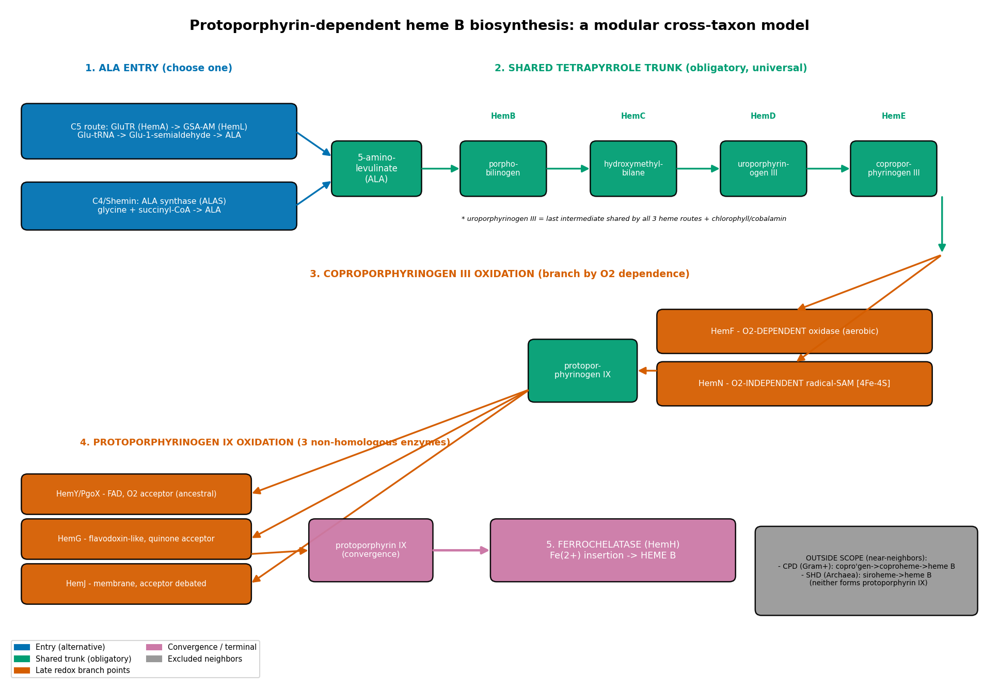

## Question

# Commissioned Review Brief

## Review Topic

Heme B biosynthesis through alternative entry and oxidation routes

## Working Scope

A reusable cross-taxon model of protoporphyrin-dependent heme B biosynthesis. C5 glutamyl-tRNA and C4/Shemin reactions are alternative routes to 5-aminolevulinate (ALA). A shared tetrapyrrole trunk then feeds independently selected oxygen-dependent or oxygen-independent coproporphyrinogen oxidases and HemJ-, HemG-, or HemY/PPOX-family protoporphyrinogen oxidases. All realizations converge at protoporphyrin IX, which a species-neutral ferrochelatase reaction converts to heme B.

## Provisional Biological Outline

- Protoporphyrin-dependent heme B biosynthesis
  - 1. formation of protoporphyrin IX
  - Formation of protoporphyrin IX
    - 1. route-specific formation of 5-aminolevulinate
    - Alternative formation of 5-aminolevulinate
      - Alternative versions by precursor route: 5-Aminolevulinate entry chemistry
        - C5 glutamyl-tRNA formation of ALA
          - Glutamyl-tRNA reductase (molecular player: glutamyl-tRNA reductase family; activity or role: glutamyl-tRNA reductase (NADP+) activity)
          - Glutamate-1-semialdehyde 2,1-aminomutase (molecular player: glutamate-1-semialdehyde 2,1-aminomutase family; activity or role: glutamate-1-semialdehyde 2,1-aminomutase activity)
        - C4/Shemin ALA formation
          - 5-Aminolevulinate synthase (molecular player: 5-aminolevulinate synthase family; activity or role: 5-aminolevulinate synthase activity)
    - 2. shared ALA-to-coproporphyrinogen III trunk
    - Shared tetrapyrrole trunk
      - 1. condensation of ALA to porphobilinogen
      - ALA condensation
        - Porphobilinogen synthase (molecular player: delta-aminolevulinate dehydratase family; activity or role: porphobilinogen synthase activity)
      - 2. polymerization to hydroxymethylbilane
      - Hydroxymethylbilane formation
        - Hydroxymethylbilane synthase (molecular player: porphobilinogen deaminase family; activity or role: hydroxymethylbilane synthase activity)
      - 3. cyclization to uroporphyrinogen III
      - Uroporphyrinogen III formation
        - Uroporphyrinogen-III synthase (molecular player: uroporphyrinogen-III synthase family; activity or role: uroporphyrinogen-III synthase activity)
      - 4. decarboxylation to coproporphyrinogen III
      - Coproporphyrinogen III formation
        - Uroporphyrinogen decarboxylase (molecular player: uroporphyrinogen decarboxylase lineage; activity or role: uroporphyrinogen decarboxylase activity)
    - 3. formation of protoporphyrinogen IX
    - Coproporphyrinogen III oxidation
      - Alternative versions by oxygen dependence: Coproporphyrinogen oxidation chemistry
        - Oxygen-dependent HemF route
          - Oxygen-dependent coproporphyrinogen oxidase (molecular player: oxygen-dependent coproporphyrinogen oxidase lineage; activity or role: coproporphyrinogen oxidase activity)
        - Oxygen-independent HemN route
          - Oxygen-independent coproporphyrinogen dehydrogenase (molecular player: oxygen-independent coproporphyrinogen oxidase lineage; activity or role: coproporphyrinogen dehydrogenase activity)
    - 4. formation of protoporphyrin IX
    - Protoporphyrinogen IX oxidation
      - Alternative versions by enzyme family and terminal electron acceptor: Protoporphyrinogen oxidase chemistry
        - HemJ acceptor-dependent route
          - HemJ-family protoporphyrinogen oxidase (molecular player: HemJ protoporphyrinogen IX oxidase lineage; activity or role: protoporphyrinogen oxidase activity)
        - HemG quinone-acceptor route
          - HemG quinone-acceptor protoporphyrinogen dehydrogenase (molecular player: HemG quinone-acceptor protoporphyrinogen dehydrogenase lineage; activity or role: protoporphyrinogen oxidase activity, quinone as acceptor)
        - HemY oxygen-acceptor route
          - HemY/PgoX oxygen-dependent protoporphyrinogen oxidase (molecular player: HemY/PPOX protoporphyrinogen oxidase lineage; activity or role: protoporphyrinogen oxidase activity, oxygen as acceptor)
  - 2. insertion of ferrous iron to form heme B
  - Species-neutral ferrochelation of protoporphyrin IX
    - Protoporphyrin ferrochelatase (molecular player: ferrochelatase family; activity or role: protoporphyrin ferrochelatase activity)

## Known Relationships Among Steps

- Formation of protoporphyrin IX feeds into Species-neutral ferrochelation of protoporphyrin IX: Every valid combination of entry and late-step variants supplies protoporphyrin IX to ferrochelatase.
- Alternative formation of 5-aminolevulinate feeds into Shared tetrapyrrole trunk: Either entry route supplies 5-aminolevulinate to the shared trunk.
- Shared tetrapyrrole trunk feeds into Coproporphyrinogen III oxidation: Coproporphyrinogen III feeds an applicable oxygen-dependent or oxygen-independent oxidase.
- Coproporphyrinogen III oxidation feeds into Protoporphyrinogen IX oxidation: Protoporphyrinogen IX feeds an applicable HemJ-, HemG-, or HemY/PPOX-family oxidase.
- Glutamyl-tRNA reductase feeds into Glutamate-1-semialdehyde 2,1-aminomutase: HemA supplies glutamate-1-semialdehyde to HemL.
- ALA condensation feeds into Hydroxymethylbilane formation: Porphobilinogen feeds HemC.
- Hydroxymethylbilane formation feeds into Uroporphyrinogen III formation: Hydroxymethylbilane feeds HemD.
- Uroporphyrinogen III formation feeds into Coproporphyrinogen III formation: Uroporphyrinogen III feeds HemE.

## Assignment

Write a rigorous, review-style synthesis suitable for a molecular biology
audience. Treat the topic as a biological system whose boundaries, core
mechanisms, variants, and unresolved points should be made clear to readers who
know the field but are not specialists in this specific process.

The review should be explanatory rather than encyclopedic. Anchor broad claims
in primary literature or authoritative reviews, but keep the focus on how the
system works and how its parts fit together.

## Questions To Address

1. **Scope and boundaries**
   - What exactly is included in this biological system?
   - Which neighboring pathways, organelle processes, complexes, or regulatory
     events are often confused with it but should be treated separately?
   - Are there competing definitions in the literature?

2. **Core mechanism**
   - What is the best current model for the sequence of events?
   - Which steps are obligatory, which are conditional, and which are accessory?
   - What molecular assemblies, enzymes, receptors, adaptors, transporters, or
     structural units carry out each major step?

3. **Variation**
   - How does the system vary across major evolutionary lineages?
   - Are there well-supported differences between cell types, tissues,
     developmental stages, physiological states, or compartments?
   - Where are there alternative routes that achieve a similar outcome by
     different molecular means?

4. **Conservation and origin**
   - What is the deepest plausible evolutionary origin of the system?
   - Which parts appear ancient and conserved, and which appear to be later
     elaborations, replacements, or lineage-specific losses?
   - When a protein family has expanded, which family members are the best
     representatives for understanding the ancestral role?

5. **Physical and biological constraints**
   - What steps must occur in a particular order?
   - Which events are mutually exclusive, compartment-specific, cell-type
     specific, substrate-specific, or stage-specific?
   - What evidence rules out otherwise plausible paths through the system?

6. **Evidence and controversy**
   - Which mechanistic claims are strongly supported by experiments?
   - Where does the literature disagree, rely on indirect evidence, or mix data
     from organisms that may not be comparable?
   - What are the most important open questions?

## Output Format

Use the style and structure of a concise review article:

1. Executive summary
2. Definition and biological boundaries
3. Mechanistic overview
4. Major molecular players and active assemblies
5. Evolutionary and cell-biological variation
6. Constraints, dependencies, and failure modes
7. Controversies and open questions
8. Key references

Include citations for major claims, preferably PMIDs or DOIs. Be explicit about
uncertainty and avoid overgeneralizing from one organism, cell type, or assay
system to all biology.

## Output

# Heme B Biosynthesis Through Alternative Entry and Oxidation Routes: A Cross-Taxon Review of the Protoporphyrin-Dependent System

*A review-style synthesis for a molecular-biology audience. Search date: 2026-07-21. Primary anchor references are Dailey et al. 2017 (PMID 28123057) and Dailey et al. 2015 (PMID 25646457).*

---

## 1. Executive summary

Heme B (protoheme IX, Fe(II)–protoporphyrin IX) is an ancient, near-universal cofactor. This review treats one coherent biological system: the **protoporphyrin-dependent (PPD)** route to heme B, in which a shared tetrapyrrole "trunk" builds coproporphyrinogen III, this is converted through **protoporphyrinogen IX** to **protoporphyrin IX**, and a single, mechanistically conserved ferrochelatase inserts ferrous iron to make heme B. The system is best understood as a *reusable modular scaffold*: two mutually exclusive **entry chemistries** to 5-aminolevulinate (ALA) — the C5 glutamyl-tRNA route (GluTR + GSA-aminomutase) and the C4/Shemin route (ALA synthase) — feed an invariant six-enzyme trunk, after which two **redox branch points** (coproporphyrinogen oxidation; protoporphyrinogen oxidation) are each solved by *non-orthologous, convergently evolved* enzyme families selected largely by oxygen availability. All valid combinations converge on protoporphyrin IX and then on a species-neutral ferrochelatase (PMID 28123057).

Three points dominate the modern picture. **(i)** The PPD route is only one of three natural terminal architectures; the **siroheme-dependent (SHD)** route of Archaea/sulfate reducers and the **coproporphyrin-dependent (CPD)** route of Gram-positive bacteria are separate systems that must not be conflated with it (PMID 28123057, 25646457). **(ii)** At the two late redox steps, evolution has repeatedly *replaced the protein without changing the reaction* — HemF vs HemN at coproporphyrinogen oxidation, and HemG vs HemJ vs HemY at protoporphyrinogen oxidation — the clearest examples of non-orthologous gene displacement in cofactor metabolism (PMID 25108393). **(iii)** The endpoints are deeply conserved (the uroporphyrinogen III core and ferrochelatase), whereas the entry and late steps are the parts that vary, are lost, or are laterally transferred across lineages.

## 2. Definition and biological boundaries

**What is inside the system.** The PPD system comprises every enzymatic step required to build heme B *via protoporphyrin IX*:

- **Entry (route-specific ALA formation):** either C5 (glutamyl-tRNA reductase, HemA/GluTR → glutamate-1-semialdehyde 2,1-aminomutase, HemL/GSA-AM) or C4/Shemin (5-aminolevulinate synthase, ALAS/HemA-of-α-proteobacteria).
- **Shared trunk (ALA → coproporphyrinogen III):** porphobilinogen synthase (ALA dehydratase, HemB); hydroxymethylbilane synthase (porphobilinogen deaminase, HemC); uroporphyrinogen-III synthase (HemD); uroporphyrinogen decarboxylase (HemE).
- **Late redox module:** coproporphyrinogen III oxidase — O2-dependent HemF **or** O2-independent HemN; then protoporphyrinogen IX oxidase — HemG **or** HemJ **or** HemY.
- **Convergence/terminal step:** protoporphyrin ferrochelatase (HemH), Fe(II) insertion → heme B.

**What is outside the system (near-neighbors and common confusions).**

- **The coproporphyrin-dependent (CPD) pathway** of Actinobacteria and Firmicutes. These Gram-positive lineages **cannot make protoporphyrin**; they oxidize coproporphyrinogen to coproporphyrin (CgoX, confusingly also called "HemY"), insert iron to make coproheme, and *then* decarboxylate coproheme to heme B via coproheme decarboxylase (ChdC/HemQ) (PMID 25646457, 41106177). Because it inverts the order of ferrochelation and side-chain decarboxylation and never forms protoporphyrin IX, CPD is a **separate system** that shares only the early trunk. The shared "HemY" name and shared trunk enzymes make this the single most important boundary to police.
- **The siroheme-dependent (SHD) / "alternative" pathway** of Archaea and many sulfate-reducing bacteria, which routes uroporphyrinogen III → precorrin-2 → siroheme → (Fe-coproporphyrin/didecarboxysiroheme) → heme B by oxygen-independent Ahb/Nir enzymes, bypassing both coproporphyrinogen oxidase and PPOX entirely (PMID 28123057). This is the deepest branch and is outside PPD scope.
- **Downstream and sibling tetrapyrrole branches:** heme *o*/heme *a* (heme O synthase, heme A synthase), siroheme, chlorophyll/bacteriochlorophyll (Mg-chelatase branch at protoporphyrin IX), cobalamin, coenzyme F430, and phycobilins. Protoporphyrin IX is the *last* intermediate shared with the chlorophyll branch (via Mg-chelatase), so the chlorophyll branch shares the trunk but diverges before ferrochelatase.
- **Heme trafficking, degradation, and regulation:** heme oxygenases (HMOX1/2), heme transporters and chaperones, heme-regulated transcription (e.g., Irr, HemA proteolysis), and disease states (the human porphyrias) are physiologically intertwined but are *not* biosynthetic steps of the PPD system and are treated as adjacent processes here.

**Competing definitions in the literature.** Two definitional tensions recur. First, older reviews assumed a *single* universal heme pathway; this is now known to be wrong — three pathways exist (PMID 28123057), so any "heme biosynthesis" claim must specify the branch. Second, enzyme names are overloaded across branches (**HemY** = PPOX in PPD but = coproporphyrinogen oxidase CgoX in CPD; **HemA** = GluTR in most bacteria but historically = ALAS in α-proteobacteria; **HemH** = protoporphyrin ferrochelatase in PPD but coproporphyrin ferrochelatase CpfC in CPD). Mixing organism data under one gene label is a frequent error.

## 3. Mechanistic overview

**Figure 1** summarizes the modular architecture: two alternative ALA-entry routes feed one obligatory trunk, which passes through two oxygen-selected redox branch points before all realizations converge at protoporphyrin IX and ferrochelatase; the coproporphyrin- and siroheme-dependent neighbors are shown as out-of-scope.

{{figure:plot_1.png|caption=Figure 1. Modular architecture of protoporphyrin-dependent heme B biosynthesis. Two mutually exclusive entry routes (C5 glutamyl-tRNA via GluTR/HemL; C4/Shemin via ALAS) converge at 5-aminolevulinate and feed a conserved six-enzyme trunk (HemB-HemE) to coproporphyrinogen III. Two oxygen-selected redox branch points - coproporphyrinogen oxidation (O2-dependent HemF vs radical-SAM HemN) and protoporphyrinogen oxidation (the non-homologous HemG, HemJ, and HemY) - converge on protoporphyrin IX, which a species-neutral ferrochelatase (HemH) metalates to heme B. The coproporphyrin-dependent (Gram-positive) and siroheme-dependent (archaeal) routes are shown as excluded near-neighbors that reach heme B without forming protoporphyrin IX.}}

**Best current model (sequence of events).** The obligatory backbone, in order, is:

`ALA → (×2) porphobilinogen → (×4, linear tetrapyrrole) hydroxymethylbilane → uroporphyrinogen III → coproporphyrinogen III → protoporphyrinogen IX → protoporphyrin IX → heme B.`

1. **ALA formation (conditional, route-specific).** *Either* ALAS condenses glycine + succinyl-CoA (a PLP-dependent, decarboxylative Claisen-type condensation; product release is rate-limiting; PMID 31345668) *or* GluTR reduces glutamyl-tRNA(Glu) to glutamate-1-semialdehyde (NADPH-dependent) and GSA-aminomutase (also PLP-dependent) isomerizes it to ALA (PMID 40315358). These are alternatives; an organism runs one.
2. **ALA condensation (obligatory).** Porphobilinogen synthase (HemB) asymmetrically condenses two ALA molecules to the monopyrrole porphobilinogen. It is a classic morpheein — its oligomeric equilibrium and metal usage vary phylogenetically: mammalian/E. coli enzymes are Zn-dependent octamers (with a stimulatory Mg in E. coli/plants), whereas some enzymes are metal-independent hexamers (PMID 7819203, 15555082, 21383008).
3. **Hydroxymethylbilane formation (obligatory).** Hydroxymethylbilane synthase / porphobilinogen deaminase (HemC) uses a unique dipyrromethane cofactor to processively polymerize four porphobilinogens into the linear tetrapyrrole hydroxymethylbilane.
4. **Ring closure (obligatory).** Uroporphyrinogen-III synthase (HemD) inverts ring D and cyclizes to the physiological, asymmetric uroporphyrinogen III. (Non-enzymatic closure yields the "wrong" uroporphyrinogen I — a spontaneous side reaction the cell must suppress.) Uroporphyrinogen III is the **last intermediate shared by all three heme pathways** and by the corrin/siroheme branches.
5. **Peripheral decarboxylation (obligatory).** Uroporphyrinogen decarboxylase (HemE) sequentially removes four acetate carboxyls → coproporphyrinogen III. This is the last step of the universal bacterial core before the PPD/CPD split.
6. **Coproporphyrinogen oxidation (obligatory step, alternative enzymes).** Two propionates on rings A and B are oxidatively decarboxylated to vinyls → protoporphyrinogen IX. Aerobically by **HemF** (O2-dependent); anaerobically by **HemN**, a [4Fe-4S] radical-SAM enzyme that generates a 5′-deoxyadenosyl radical to abstract hydrogen and drive decarboxylation without O2 (PMID 12114526, 14633981).
7. **Protoporphyrinogen oxidation (obligatory step, alternative enzymes).** Six-electron aromatization of the macrocycle → protoporphyrin IX, by one of three unrelated enzymes: **HemY** (FAD, O2 as acceptor), **HemG** (flavodoxin-like, quinone as acceptor, anaerobic-competent), or **HemJ** (membrane protein, mechanism least understood) (PMID 25108393, 29925590).
8. **Ferrochelation (obligatory, convergence).** Ferrochelatase (HemH) distorts (saddles) protoporphyrin IX, deprotonates the pyrrole nitrogens, inserts Fe(II), and releases a flatter metalated product; metal specificity is set at the product-release step through a conserved π-helix switch (PMID 21776189, 29481781).

**Obligatory vs conditional vs accessory.** Steps 2–8 (the trunk + late module + ferrochelatase) are **obligatory** for PPD heme B. The *choice* of enzyme at steps 1, 6, and 7 is **conditional** (set by lineage and by oxygen tension). Genuinely **accessory** elements include regulatory appendages (e.g., the ALAS C-terminal extension; the FLU/GluTR feedback module in plants) and lineage-specific fusion or targeting domains, none of which change the chemistry.

## 4. Major molecular players and active assemblies

| Step | Enzyme (gene) | Family / cofactor | Notable structural/mechanistic feature | Key refs (PMID) |
|---|---|---|---|---|
| ALA (C4) | ALA synthase (ALAS/hemA in α-proteobacteria) | PLP, homodimer | Glycine + succinyl-CoA condensation; active-site loop gates turnover; product release rate-limiting | 31345668, 26605136 |
| ALA (C5) | Glutamyl-tRNA reductase (hemA/GluTR) | NADPH; binds Glu-tRNA | V-shaped dimer; substrate channeling to HemL; feedback target (heme, FLU) | 40315358, 30863751 |
| ALA (C5) | Glutamate-1-semialdehyde 2,1-aminomutase (hemL) | PLP aminomutase | Intramolecular amino transfer to ALA; gabaculine-sensitive (diagnostic of C5 route); inhibitor-resistant point mutants map to hemL | 28123057, 9267435, 10350057 |
| Trunk 1 | Porphobilinogen synthase (hemB/ALAD) | Zn and/or Mg; morpheein | Octamer/hexamer equilibrium; variable metal usage | 7819203, 15555082, 21383008 |
| Trunk 2 | Hydroxymethylbilane synthase (hemC/PBGD) | Dipyrromethane cofactor | Processive tetramerization of PBG | 28123057 |
| Trunk 3 | Uroporphyrinogen-III synthase (hemD) | — | Ring-D inversion/cyclization to III isomer | 28123057 |
| Trunk 4 | Uroporphyrinogen decarboxylase (hemE) | — | Four sequential decarboxylations | 28123057 |
| CPO | O2-dependent coproporphyrinogen oxidase (hemF) | O2 as oxidant | Aerobic vinyl formation | 28123057 |
| CPO | O2-independent coproporphyrinogen dehydrogenase (hemN) | Radical SAM, [4Fe-4S], 2× SAM, NAD(P)H | First radical-SAM crystal structure; CXXXCXXC cluster motif | 12114526, 14633981, 16218869 |
| PPOX | HemY / PgoX (PPOX) | FAD; O2 acceptor | Ancestral, ubiquitous, only eukaryotic PPOX; acifluorfen-sensitive | 25108393, 20823222 |
| PPOX | HemG | Flavodoxin-like; quinone acceptor | γ-Proteobacterial; couples to respiratory quinone pool | 25108393 |
| PPOX | HemJ | Integral-membrane; heme *b*/*b*-type | α-Proteobacterial/cyanobacterial; mosaic distribution | 25108393, 29925590, 20823222 |
| Terminal | Protoporphyrin ferrochelatase (hemH) | Some carry [2Fe-2S] | Porphyrin saddling; π-helix product-release switch controls metal specificity | 21776189, 19703464, 29481781 |

**Assemblies and channeling.** Several steps are physically coupled. GluTR and GSA-aminomutase form a complex/channel that hands off the reactive glutamate-1-semialdehyde (PMID 30863751). In many organisms the late, membrane-associated steps (HemN/HemG/HemJ and ferrochelatase) are localized near the membrane and, in α-proteobacteria/mitochondria, spatially organized to hand protoporphyrinogen/protoporphyrin/iron along the inner membrane. HemG and HemJ tie the aromatization step directly to the respiratory chain by using quinone or membrane redox as the electron sink.

## 5. Evolutionary and cell-biological variation

**Across lineages.**
- **Entry chemistry:** C5 (GluTR/GSA-AM) is the broad ancestral bacterial/archaeal/plant route; C4/ALAS is restricted to **α-proteobacteria, fungi, and animals** and is generally regarded as the derived route (PMID 31345668). Because mitochondria descend from α-proteobacteria, animals/fungi inherited ALAS; plants retained the cyanobacteria-derived C5 route in the plastid.
- **Late redox module:** HemF (aerobes) vs HemN (facultative/anaerobes); many facultative organisms encode **both** and switch by oxygen tension. At PPOX, HemG is largely confined to γ-Proteobacteria, HemJ appears to have originated in α-Proteobacteria and spread to Cyanobacteria, and HemY is ubiquitous and the sole eukaryotic form (PMID 25108393). Cyanobacteria are a natural experiment: all three PPOX types occur across the phylum in a mosaic, occasionally two in one genome, with cross-complementation demonstrated experimentally (PMID 36357749).
- **Losses:** Many host-associated bacteria and some eukaryotes (e.g., certain parasites, and organisms auxotrophic for heme) have lost part or all of the pathway and import heme; malaria parasites present a chimeric "nested" heme economy combining parasite synthesis, truncated host-erythrocyte capacity, and host-hemoglobin-derived heme (PMID 42198604).

**Compartments, cell types, and states (eukaryotes).** In animals the pathway is split between **mitochondrion** (ALAS, and the terminal HemN-absent module: coproporphyrinogen oxidase, PPOX-HemY, ferrochelatase — all mitochondrial/inner-membrane) and **cytosol** (HemB–HemE), requiring transport of intermediates across the mitochondrial membranes. In plants the entire pathway is largely **plastidic**. Tissue/stage specialization is pronounced: erythroid cells use the dedicated **ALAS2** isoform under iron/erythroid control, whereas housekeeping **ALAS1** serves other tissues; gain-of-function ALAS2 causes X-linked protoporphyria and loss-of-function causes X-linked sideroblastic anemia (PMID 38888931). In legume nodules, plant GluTRs (notably GluTR2) dominate heme supply for leghemoglobin, coordinating host and symbiont pathways (PMID 40315358). These distinctions caution against extrapolating one cell type's regulation to all biology.

**Alternative routes to the same outcome.** Within PPD, the O2-dependence branches at CPO and PPOX are alternative molecular means to identical chemical outcomes. Zooming out, CPD and SHD are wholly alternative *routes to heme B itself*, underscoring that "make heme B" has been solved at least three times.

## 6. Conservation, origin, and best ancestral representatives

**Deepest origin.** Tetrapyrrole biosynthesis is ancient, predating the divergence of the domains; the shared core to **uroporphyrinogen III** is common to heme, chlorophyll, siroheme, cobalamin, and F430 synthesis and is therefore among the oldest conserved biosynthetic modules (PMID 28123057). The **SHD/siroheme route is argued to be the most ancient route to heme**, consistent with an anaerobic origin, with the bacterial coproporphyrinogen-forming step (HemE) added later, and the PPD "protoporphyrin" terminus emerging with (or adapting to) oxygenic conditions (PMID 28123057, 25646457).

**Ancient/conserved vs derived parts.**
- *Ancient and conserved:* the trunk (HemB–HemE) and **ferrochelatase**, which share deep homology and mechanism across the tree; the C5 entry route.
- *Later elaborations/replacements:* the C4/ALAS entry (α-proteobacterial/eukaryotic); the O2-dependent enzymes HemF and HemY as adaptations to aerobic environments; HemG and HemJ as lineage-specific **non-orthologous replacements** of PPOX.

**Best representatives for the ancestral role.** For PPOX, **HemY is the best proxy for the ancestral function** (ubiquitous; sole eukaryotic form) (PMID 25108393). For the O2-independent chemistry that likely predates the Great Oxidation Event, **HemN** (radical SAM) exemplifies the ancestral anaerobic solution at CPO; radical-SAM chemistry is itself an ancient enzyme superfamily (PMID 16218869). For ferrochelatase, bacterial and human enzymes are structurally congruent, so either serves to understand the conserved distortion/π-helix mechanism (PMID 21776189, 29481781).

## 7. Constraints, dependencies, and failure modes

**Ordering constraints.** The backbone is a strict linear dependency chain: each intermediate is the substrate of the next (ALA→PBG→HMB→uro'gen III→copro'gen III→proto'gen IX→proto IX→heme B), so steps cannot be reordered. Ring closure (HemD) must precede decarboxylation, and coproporphyrinogen oxidation must precede protoporphyrinogen oxidation — the substrate identities enforce order.

**Mutually exclusive / conditional choices.**
- **Entry:** an organism runs C4 *or* C5, not both (the choice is genomically fixed).
- **Oxygen dependence:** HemF/HemY require O2; HemN/HemG operate anaerobically. In strict anaerobes the O2-dependent enzymes are non-viable options; in facultative organisms the redundant pair is regulated by oxygen. This is the strongest evidence *ruling out* otherwise plausible paths: an obligate anaerobe cannot use HemF or O2-coupled HemY, so those combinations are excluded on thermodynamic/mechanistic grounds.
- **Compartmentalization (eukaryotes):** the split between cytosolic and mitochondrial/plastidic steps forces transport dependencies; failure of an intermediate transporter phenocopies enzyme loss.
- **Branch exclusivity at protoporphyrin IX:** protoporphyrin IX is partitioned between ferrochelatase (Fe → heme) and Mg-chelatase (Mg → chlorophyll) in phototrophs; misallocation is a regulated, competitive node.

**Failure modes.** Blockages cause accumulation of the upstream intermediate. In humans, each enzyme deficiency defines a **porphyria** with a characteristic biochemical signature (e.g., PBGD deficiency → acute intermittent porphyria; PPOX deficiency → variegate porphyria; coproporphyrinogen oxidase deficiency → hereditary coproporphyria; ferrochelatase deficiency → erythropoietic protoporphyria) (PMID 42213346). Accumulated porphyrinogens auto-oxidize to phototoxic porphyrins generating reactive oxygen species (PMID 42213346, 42197273). The reactivity of protoporphyrin IX itself — heme's "dark twin" — makes flux completion, not merely pathway presence, the key constraint (PMID 42197273). This chemistry is exploited therapeutically: exogenous ALA drives PpIX accumulation for photodynamic therapy and fluorescence-guided surgery (PMID 41070141, 38852796).

## 8. Controversies and open questions

- **HemJ mechanism and cofactor.** HemJ is the least understood PPOX; its precise redox mechanism, cofactor/heme content, and terminal electron acceptor remain incompletely defined despite functional confirmation in cyanobacteria (PMID 29925590, 20823222). Whether it is truly O2-dependent, quinone-coupled, or flexible is unresolved.
- **The [2Fe-2S] cluster of ferrochelatases.** Present in human and some bacterial ferrochelatases, its role (catalytic, structural, redox/iron-sensing) is still debated (PMID 42184855, 34402499).
- **Iron delivery to ferrochelatase.** How Fe(II) is channeled to the buried active site (a putative iron channel, chaperone hand-off, or membrane-coupled delivery) is not settled (PMID 22897320, 34402499).
- **Evolutionary polarity and lateral transfer.** The intricate, partly conflicting phylogenies of HemG/HemJ/HemY (mosaic distributions, apparent horizontal transfer) complicate simple ancestral reconstructions (PMID 25108393, 36357749). The rooting of the three heme pathways (SHD-first model) rests substantially on genome distribution/parsimony rather than direct ancestral-state experiments (PMID 28123057, 25646457).
- **Cross-organism generalization.** Much mechanistic detail comes from a few models (E. coli HemN; human/yeast ferrochelatase and ALAS2; cyanobacterial PPOX). PBGS metal usage and oligomeric state vary enough between organisms (PMID 21383008, 15555082) that assay conditions and organism choice materially affect conclusions — a caution against universal claims.
- **Channeling and metabolon organization.** The degree to which late membrane steps form a physical metabolon (and whether intermediates are ever free) is largely inferential.

**Most important open questions:** (1) a definitive HemJ mechanism; (2) the physiological role of the ferrochelatase Fe–S cluster and the iron-delivery route; (3) experimentally grounded ancestral reconstruction of the entry and late-step modules; (4) how flux is partitioned at protoporphyrin IX between Fe- and Mg-chelation in phototrophs under stress.

## 9. Key references

- Dailey HA, Dailey TA, Gerdes S, Jahn D, Jahn M, O'Brian MR, Warren MJ. **Prokaryotic Heme Biosynthesis: Multiple Pathways to a Common Essential Product.** *Microbiol Mol Biol Rev* 2017. PMID 28123057. — Definitive three-pathway framework (SHD/CPD/PPD).
- Dailey HA, Gerdes S, Dailey TA, Burch JS, Phillips JD. **Noncanonical coproporphyrin-dependent bacterial heme biosynthesis pathway that does not use protoporphyrin.** *PNAS* 2015. PMID 25646457. — Establishes the CPD boundary.
- Kobayashi K, Masuda T, Tajima N, Wada H, Sato N. **Molecular phylogeny and intricate evolutionary history of the three isofunctional enzymes involved in the oxidation of protoporphyrinogen IX.** 2014. PMID 25108393. — HemG/HemJ/HemY distribution and ancestry.
- Kohata et al. **Heterologous complementation… mosaic distribution of three distinct protoporphyrinogen IX oxidase in the cyanobacterial phylum.** 2023. PMID 36357749.
- Skotnicová P et al. **The cyanobacterial protoporphyrinogen oxidase HemJ…** 2018. PMID 29925590; Kato et al., HemJ (slr1790) identification, 2010. PMID 20823222.
- Layer G, Moser J, Heinz DW, Jahn D, Schubert WD. **Crystal structure of coproporphyrinogen III oxidase (HemN)…** 2003. PMID 14633981; Layer et al. 2002 (PMID 12114526); Layer et al. 2005 (PMID 16218869). — Radical-SAM CPO.
- Stojanovski BM et al. **5-Aminolevulinate synthase catalysis.** 2019. PMID 31345668; Stojanovski & Ferreira 2015 (PMID 26605136); Taylor et al. ALAS2 disease variants 2024 (PMID 38888931).
- Wang et al. **Plant glutamyl-tRNA reductases coordinate plant and rhizobial heme biosynthesis in nitrogen-fixing nodules.** 2025. PMID 40315358; Nardella et al. GluTR–GSA-AM complex 2019 (PMID 30863751). GSA-aminomutase (HemL) genetics/gabaculine sensitivity: Allison et al. 1997 (PMID 9267435); Bishop et al. 1999 (PMID 10350057).
- Jaffe EK et al. PBGS structure/metal usage: TgPBGS 2011 (PMID 21383008); R. capsulatus hexamer 2004 (PMID 15555082); E. coli stimulatory Mg 1995 (PMID 7819203).
- Ferrochelatase mechanism: Franco et al. 2011 (PMID 21776189); Medlock et al. 2009 (PMID 19703464); Gillam et al. 2018 (PMID 29481781); Medlock et al. 2021 (PMID 34402499); Asuru et al. 2012 (PMID 22897320); Cassiani et al. 2026 (PMID 42184855, CdCpfC [2Fe2S]).
- Clinical/physiological context: Porphyrias review 2026 (PMID 42213346); hepatic heme "dark twin" framework 2026 (PMID 42197273); malaria nested heme metabolism 2026 (PMID 42198604); ALA-PpIX in medicine 2025 (PMID 41070141); 5-ALA-PDT 2024 (PMID 38852796).

---

*Scope caveat: This review is deliberately restricted to the protoporphyrin-dependent route to heme B. Statements about mechanism are anchored where possible in the model organism from which they derive; the coproporphyrin-dependent and siroheme-dependent routes, the chlorophyll/siroheme/cobalamin sibling branches, and heme trafficking/degradation are treated as adjacent systems and are not covered in mechanistic depth.*

## Artifacts

- [OpenScientist final report](heme_biosynthesis-deep-research-openscientist_artifacts/final_report.html)
- [OpenScientist final report](heme_biosynthesis-deep-research-openscientist_artifacts/final_report.pdf)
- [OpenScientist plot 1](heme_biosynthesis-deep-research-openscientist_artifacts/provenance_plot_1.json)
