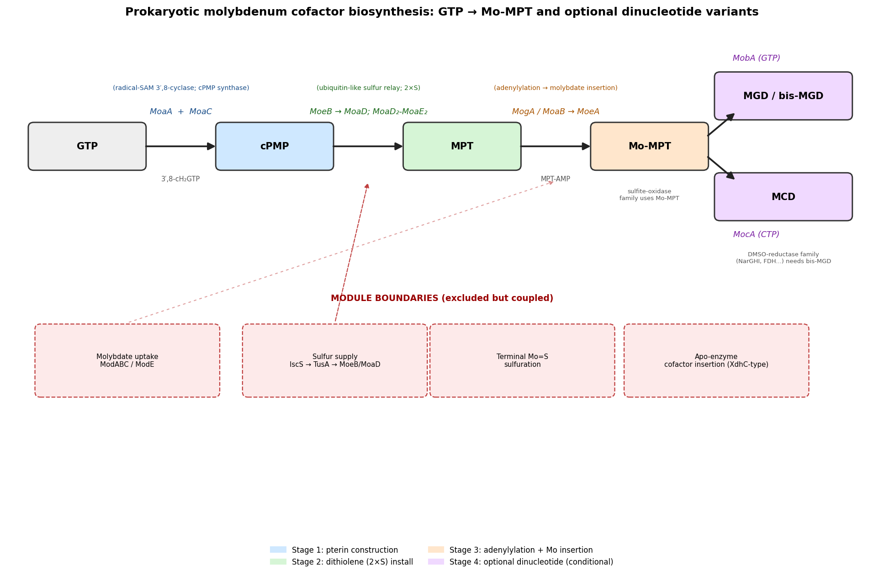

## Question

# Commissioned Review Brief

## Review Topic

Prokaryotic molybdenum cofactor biosynthesis from GTP to Mo-molybdopterin and optional dinucleotide variants

## Working Scope

A reusable prokaryotic module for molybdenum cofactor biosynthesis constructs the pyranopterin dithiolene ligand from GTP, loads it with molybdenum, and may append a nucleotide to produce a client-class-specific cofactor variant. MoaA first performs radical-SAM cyclization of GTP and MoaC rearranges the cyclic intermediate to cyclic pyranopterin monophosphate (cPMP). Molybdopterin synthase then inserts two sulfurs: MoeB activates the small MoaD sulfur carrier, and the MoaD-MoaE synthase converts cPMP to molybdopterin (MPT). Across prokaryotic realizations, MPT is adenylylated by a separate bacterial MogA or by a catalytically competent prokaryotic MoaB lineage, and MoeA then inserts molybdate to form Mo-MPT. Some realizations stop at Mo-MPT, whereas others use MobA to make MGD or MocA to make MCD. The module excludes upstream sulfur supply, molybdate transport, terminal cofactor sulfuration, cofactor insertion into client apoenzymes, mature molybdoenzyme reactions, pathway regulation, eukaryotic MOCS/CNX/GPHN fusion organization, and human disease.

## Provisional Biological Outline

- Prokaryotic molybdenum cofactor biosynthesis
  - 1. cyclic pyranopterin monophosphate formation
  - Cyclic pyranopterin monophosphate formation
    - 1. radical-SAM GTP cyclization
    - MoaA GTP cyclization
      - MoaA GTP 3',8'-cyclase (molecular player: PSEPK canonical MoaA; activity or role: GTP 3',8'-cyclase activity)
    - 2. cyclic intermediate rearrangement to cPMP
    - MoaC cPMP synthesis
      - MoaC cyclic pyranopterin monophosphate synthase (molecular player: bacterial MoaC cPMP synthase family; activity or role: cyclic pyranopterin monophosphate synthase activity)
  - 2. sulfur-carrier activation and molybdopterin synthesis
  - Sulfur-carrier activation and MPT formation
    - 1. MoaD sulfur-carrier activation
    - MoeB-dependent MoaD activation
      - MoeB molybdopterin-synthase sulfur-carrier adenylyltransferase (molecular player: bacterial MoeB molybdopterin-synthase sulfur-carrier adenylyltransferase family; activity or role: molybdopterin-synthase adenylyltransferase activity)
      - MoaD molybdopterin-synthase sulfur carrier (molecular player: bacterial MoaD molybdopterin-synthase sulfur-carrier family)
    - 2. sulfur insertion into cPMP
    - MoaD-MoaE molybdopterin synthesis
      - MoaD2-MoaE2 molybdopterin synthase complex (molecular player: prokaryotic MoaD2-MoaE2 molybdopterin synthase complex; activity or role: molybdopterin synthase activity)
  - 3. MPT adenylylation and molybdate insertion
  - Mo-molybdopterin formation
    - 1. MPT adenylylation
    - Molybdopterin adenylylation
      - Alternative versions by prokaryotic enzyme lineage: MPT adenylyltransferase implementations
        - Separate MogA adenylyltransferase
          - MogA molybdopterin adenylyltransferase (molecular player: bacterial MogA molybdopterin adenylyltransferase family; activity or role: molybdopterin adenylyltransferase activity)
        - Catalytically competent prokaryotic MoaB adenylyltransferase
          - Catalytically competent prokaryotic MoaB molybdopterin adenylyltransferase (molecular player: Pyrococcus furiosus MoaB; activity or role: molybdopterin adenylyltransferase activity)
    - 2. molybdate insertion into adenylyl-MPT
    - Molybdopterin molybdotransfer
      - MoeA molybdopterin molybdotransferase (molecular player: PSEPK MoeA; activity or role: molybdopterin molybdotransferase activity)
  - 4. optional nucleotide maturation of Mo-MPT
  - Optional Mo-MPT nucleotide maturation
    - Alternative versions by appended nucleotide: Mo-MPT dinucleotide variants
      - MGD formation by MobA
        - MobA molybdenum cofactor guanylyltransferase (molecular player: bacterial MobA molybdenum cofactor guanylyltransferase family; activity or role: molybdenum cofactor guanylyltransferase activity)
      - MCD formation by MocA
        - MocA molybdenum cofactor cytidylyltransferase (molecular player: bacterial MocA molybdenum cofactor cytidylyltransferase family; activity or role: molybdenum cofactor cytidylyltransferase activity)

## Known Relationships Among Steps

- Cyclic pyranopterin monophosphate formation feeds into Sulfur-carrier activation and MPT formation: cPMP is the pterin substrate for sulfur insertion by molybdopterin synthase.
- Sulfur-carrier activation and MPT formation feeds into Mo-molybdopterin formation: MPT is activated and loaded with molybdate to form Mo-MPT.
- Mo-molybdopterin formation feeds into Optional Mo-MPT nucleotide maturation: Mo-MPT may be retained directly or converted to MGD and/or MCD.
- MoaA GTP cyclization feeds into MoaC cPMP synthesis: The cyclic GTP product of MoaA is the substrate for MoaC.
- MoeB-dependent MoaD activation precedes MoaD-MoaE molybdopterin synthesis: Activated MoaD is sulfur-loaded by an external sulfur-donor system before supplying the MoaE reaction.
- Molybdopterin adenylylation feeds into Molybdopterin molybdotransfer: Adenylyl-MPT produced by the selected activation variant is the substrate for molybdate insertion.

## Assignment

Write a rigorous, review-style synthesis suitable for a molecular biology
audience. Treat the topic as a biological system whose boundaries, core
mechanisms, variants, and unresolved points should be made clear to readers who
know the field but are not specialists in this specific process.

The review should be explanatory rather than encyclopedic. Anchor broad claims
in primary literature or authoritative reviews, but keep the focus on how the
system works and how its parts fit together.

## Questions To Address

1. **Scope and boundaries**
   - What exactly is included in this biological system?
   - Which neighboring pathways, organelle processes, complexes, or regulatory
     events are often confused with it but should be treated separately?
   - Are there competing definitions in the literature?

2. **Core mechanism**
   - What is the best current model for the sequence of events?
   - Which steps are obligatory, which are conditional, and which are accessory?
   - What molecular assemblies, enzymes, receptors, adaptors, transporters, or
     structural units carry out each major step?

3. **Variation**
   - How does the system vary across major evolutionary lineages?
   - Are there well-supported differences between cell types, tissues,
     developmental stages, physiological states, or compartments?
   - Where are there alternative routes that achieve a similar outcome by
     different molecular means?

4. **Conservation and origin**
   - What is the deepest plausible evolutionary origin of the system?
   - Which parts appear ancient and conserved, and which appear to be later
     elaborations, replacements, or lineage-specific losses?
   - When a protein family has expanded, which family members are the best
     representatives for understanding the ancestral role?

5. **Physical and biological constraints**
   - What steps must occur in a particular order?
   - Which events are mutually exclusive, compartment-specific, cell-type
     specific, substrate-specific, or stage-specific?
   - What evidence rules out otherwise plausible paths through the system?

6. **Evidence and controversy**
   - Which mechanistic claims are strongly supported by experiments?
   - Where does the literature disagree, rely on indirect evidence, or mix data
     from organisms that may not be comparable?
   - What are the most important open questions?

## Output Format

Use the style and structure of a concise review article:

1. Executive summary
2. Definition and biological boundaries
3. Mechanistic overview
4. Major molecular players and active assemblies
5. Evolutionary and cell-biological variation
6. Constraints, dependencies, and failure modes
7. Controversies and open questions
8. Key references

Include citations for major claims, preferably PMIDs or DOIs. Be explicit about
uncertainty and avoid overgeneralizing from one organism, cell type, or assay
system to all biology.

## Output

# Prokaryotic Molybdenum Cofactor Biosynthesis from GTP to Mo-Molybdopterin and Optional Dinucleotide Variants

*A commissioned review-style synthesis. Search date: 2026-07-21. Literature accessed via PubMed.*

---

## 1. Executive Summary

Nearly all molybdenum- and tungsten-dependent enzymes require a common prosthetic group, the **molybdenum cofactor (Moco)**, in which the catalytic metal is held by the *cis*-dithiolene of a tricyclic pyranopterin called **molybdopterin (MPT)**. In prokaryotes this cofactor is built by a compact, evolutionarily ancient biosynthetic module that begins with a single common metabolite — **GTP** — and ends either at **Mo-MPT** or at a nucleotide-capped variant (**MGD** or **MCD**) tailored to a particular class of client enzyme. This review treats that module as a self-contained biological system: four ordered stages, each catalyzed by a small set of dedicated enzymes, with two well-documented points of lineage-specific variation (the adenylyltransferase step and the optional dinucleotide-capping step).

The best-supported mechanistic model is a strictly ordered relay. First, the radical-SAM enzyme **MoaA**, carrying two [4Fe–4S] clusters, performs a 3′,8-cyclization of GTP, and **MoaC** carries out the majority of the ensuing rearrangement to **cyclic pyranopterin monophosphate (cPMP)**. Second, a **ubiquitin-like sulfur relay** installs the dithiolene: the E1-like activating enzyme **MoeB** adenylylates the small sulfur-carrier protein **MoaD**, which — after being charged to a C-terminal thiocarboxylate by an external cysteine-desulfurase system — donates two sulfur atoms to cPMP within the **MoaD–MoaE molybdopterin synthase** to yield MPT. Third, MPT is **adenylylated** (by a dedicated **MogA**, or by a catalytically competent **MoaB** in certain lineages) and **MoeA** inserts molybdate to produce Mo-MPT. Fourth and optionally, **MobA** appends GMP to make molybdopterin guanine dinucleotide (MGD/bis-MGD), or **MocA** appends CMP to make molybdopterin cytosine dinucleotide (MCD), each serving specific molybdoenzyme families.

Three conclusions organize the field. (i) The **core chemistry is obligatory and deeply conserved** — pterin construction, ubiquitin-like sulfur insertion, and two-step metal insertion trace to the last universal common ancestor (LUCA). (ii) The **principal prokaryotic variation is combinatorial**, not architectural: which adenylyltransferase implements MPT activation, and whether/which dinucleotide cap is appended, are the two decision points. (iii) The system is **metabolically embedded** — its sulfur supply is shared with Fe–S cluster assembly and tRNA thiolation, so it cannot be understood as a fully autonomous cassette. Below we lay out the boundaries, mechanism, players, variation, constraints, and open questions, and flag where claims rest on strong biochemistry versus indirect or organism-specific evidence.

---

## 2. Definition and Biological Boundaries

### 2.1 What is included

The system as defined here is the prokaryotic pathway that converts **GTP → cPMP → MPT → Mo-MPT (→ MGD or MCD)**. It comprises four functional stages:

1. **cPMP formation** — MoaA (radical-SAM GTP 3′,8-cyclase) and MoaC (cPMP synthase).
2. **Sulfur-carrier activation and MPT synthesis** — MoeB (E1-like adenylyltransferase), MoaD (ubiquitin-fold sulfur carrier), and the MoaD–MoaE molybdopterin synthase.
3. **Mo-MPT formation** — MPT adenylylation (MogA or a competent MoaB) followed by molybdate insertion (MoeA).
4. **Optional dinucleotide maturation** — MobA (guanylyltransferase → MGD) or MocA (cytidylyltransferase → MCD).

### 2.2 What is deliberately excluded, and what is commonly confused with it

Several neighboring processes are frequently conflated with the pathway but are mechanistically and definitionally separate:

- **Upstream sulfur mobilization** — The cysteine-desulfurase/persulfide relay (IscS, TusA and relatives) that *charges* MoaD is not part of the core module; it is a shared cellular resource (see §5.4). Only the *activated* thiocarboxylated MoaD enters the pathway proper.
- **Molybdate transport** — High-affinity molybdate uptake by the ModABC ABC transporter, and its ModE-mediated regulation, supply the substrate for MoeA but are transport/regulatory events, not biosynthetic steps [PMID: 27196733](https://pubmed.ncbi.nlm.nih.gov/27196733/).
- **Terminal cofactor sulfuration** — Conversion of Mo-MPT to the *sulfido* form needed by xanthine-oxidase–family enzymes is a client-specific maturation event downstream of this module.
- **Cofactor insertion into apoenzymes and the mature molybdoenzyme reactions** — DMSO reductase, nitrate reductase, formate dehydrogenase, sulfite oxidase, xanthine oxidoreductase, etc., are *consumers* of the cofactor, not part of its synthesis.
- **Pathway regulation** — Molybdenum- and iron-responsive transcriptional control (FNR, ModE, Fur, NarXL) governs expression but is outside the enzymatic pathway itself [PMID: 31517366](https://pubmed.ncbi.nlm.nih.gov/31517366/).
- **Eukaryotic fusion organization and human disease** — The multidomain eukaryotic enzymes (MOCS1/2/3, CNX1, gephyrin) and Moco deficiency in humans are explicitly out of scope, though they are informative comparators (see §5.1).

### 2.3 Competing definitions

Two nomenclature/definition issues recur in the literature. First, the earliest pterin intermediate has historically been called **"precursor Z"**; it is now recognized as **cPMP** (cyclic pyranopterin monophosphate), and the two terms are used interchangeably in older and newer papers. Second, the boundary between "Moco biosynthesis" and "Moco *maturation*" is drawn differently by different authors: some treat molybdate insertion (MoeA) as the terminal step and regard MGD/MCD formation as a separate "dinucleotide" pathway, whereas others fold the dinucleotide-capping enzymes into the core pathway. This review adopts the inclusive definition (stages 1–4) because the dinucleotide caps are obligatory for whole classes of client enzymes and therefore functionally continuous with the rest of the module.

---

## 3. Mechanistic Overview

{{figure:moco_pathway_schematic.png|caption=Schematic of the prokaryotic molybdenum cofactor biosynthesis module. GTP is cyclized by the radical-SAM enzyme MoaA and rearranged by MoaC to cyclic pyranopterin monophosphate (cPMP). A ubiquitin-like sulfur relay (MoeB activating the MoaD carrier for the MoaD–MoaE synthase) installs the dithiolene to make molybdopterin (MPT). MPT is adenylylated (by MogA or a competent MoaB) and MoeA inserts molybdate to form Mo-MPT. Optionally, MobA appends GMP (MGD) or MocA appends CMP (MCD) for client-specific molybdoenzyme families.}}

The pathway is best described as a **strictly ordered, four-stage relay** in which the product of each stage is the obligate substrate of the next.

### 3.1 Stage 1 — cPMP formation (obligatory)

MoaA and MoaC together convert GTP into cPMP. The modern mechanistic picture revises the classic division of labor: **MoaA generates a cyclic nucleotide intermediate, 3′,8-cyclo-7,8-dihydro-GTP (3′,8-cH₂GTP), and MoaC then catalyzes the majority of the complex rearrangement that forms the pyranopterin ring** and yields cPMP [PMID: 26575208](https://pubmed.ncbi.nlm.nih.gov/26575208/). MoaA is a radical-SAM enzyme with an N-terminal [4Fe–4S] cluster that reductively cleaves SAM to a 5′-deoxyadenosyl radical, and a C-terminal [4Fe–4S] cluster that binds substrate [PMID: 16632608](https://pubmed.ncbi.nlm.nih.gov/16632608/). ENDOR spectroscopy established that the guanine **N1** nitrogen ligates the unique iron of the C-terminal cluster, constraining the geometry of radical attack [PMID: 19566093](https://pubmed.ncbi.nlm.nih.gov/19566093/).

### 3.2 Stage 2 — sulfur insertion to make MPT (obligatory)

cPMP contains the pyranopterin skeleton but lacks the metal-binding **dithiolene**. Two sulfur atoms are inserted at C1′ and C2′ by **molybdopterin synthase**, a heterotetramer of two MoaE (large) and two MoaD (small) subunits. The chemistry is a **ubiquitin-like sulfur relay** [PMID: 17223713](https://pubmed.ncbi.nlm.nih.gov/17223713/):

- MoaD is a ubiquitin-fold protein with a C-terminal **Gly-Gly motif** that, in its active form, carries a transferable sulfur as a **C-terminal thiocarboxylate**.
- Only the **thiocarboxylated** synthase converts cPMP (precursor Z) to MPT in vitro [PMID: 11459846](https://pubmed.ncbi.nlm.nih.gov/11459846/).
- After discharging its sulfur, MoaD is **regenerated** by MoeB, an E1-like enzyme that adenylylates the MoaD C-terminus so an external sulfur donor can re-form the thiocarboxylate. MoaD thus cycles between the MoaE (transfer) and MoeB (recharge) complexes [PMID: 17223713](https://pubmed.ncbi.nlm.nih.gov/17223713/).
- Structural work places cPMP in a conserved pocket at the MoaE dimer interface near the MoaD C-terminal glycine, and indicates the first dithiolene sulfur is added at the **C2′** position [PMID: 18092812](https://pubmed.ncbi.nlm.nih.gov/18092812/), consistent with sulfur atoms being added sequentially (C2′ first, then C1′).

### 3.3 Stage 3 — Mo-MPT formation (obligatory)

MPT must be activated before the metal can be inserted. The activation is an **adenylylation** of the MPT phosphate to form **MPT-AMP (adenylyl-MPT)**, catalyzed by a MogA-family protein (or a competent MoaB; see §4 and §5.2). **MoeA** then uses adenylyl-MPT as substrate, hydrolyzing the AMP and inserting molybdate to yield **Mo-MPT** [PMID: 11428898](https://pubmed.ncbi.nlm.nih.gov/11428898/). Structurally, MoeA and MogA are related — the MogA-like fold corresponds to domain 3 of MoeA — and are thought to bind similar ligands, which underlies the eukaryotic fusion of the two activities into a single protein (§5.1).

### 3.4 Stage 4 — optional dinucleotide maturation (conditional/accessory)

Some organisms and some client enzymes use Mo-MPT directly; others append a nucleotide. **MobA** transfers GMP from GTP to form **molybdopterin guanine dinucleotide (MGD)**, which for many enzymes is assembled into the **bis-MGD** cofactor of the DMSO-reductase family (including nitrate reductase NarGHI) [PMID: 25404027](https://pubmed.ncbi.nlm.nih.gov/25404027/). **MocA** transfers CMP from CTP to form **molybdopterin cytosine dinucleotide (MCD)** for enzymes such as the xanthine-oxidase-family CO dehydrogenase and aldehyde oxidoreductases [PMID: 21081498](https://pubmed.ncbi.nlm.nih.gov/21081498/).

### 3.5 Step classification

| Step | Enzyme(s) | Class | Product |
|------|-----------|-------|---------|
| GTP → 3′,8-cH₂GTP | MoaA (radical-SAM, 2×[4Fe–4S]) | Obligatory | cyclic nucleotide |
| 3′,8-cH₂GTP → cPMP | MoaC | Obligatory | cPMP |
| MoaD recharge | MoeB (E1-like) + external S donor | Obligatory (accessory input) | thiocarboxyl-MoaD |
| cPMP → MPT | MoaD–MoaE synthase | Obligatory | MPT |
| MPT → adenylyl-MPT | MogA **or** competent MoaB | Obligatory (variant implementations) | MPT-AMP |
| adenylyl-MPT → Mo-MPT | MoeA | Obligatory | Mo-MPT |
| Mo-MPT → MGD | MobA | Conditional | MGD/bis-MGD |
| Mo-MPT → MCD | MocA | Conditional | MCD |

---

## 4. Major Molecular Players and Active Assemblies

**MoaA** — A radical-SAM enzyme and one of the most conserved members of the family. It harbors two [4Fe–4S] clusters: an N-terminal cluster for reductive SAM cleavage (generating the 5′-deoxyadenosyl radical) and a C-terminal cluster that binds GTP through guanine N1 [PMID: 16632608](https://pubmed.ncbi.nlm.nih.gov/16632608/); [PMID: 19566093](https://pubmed.ncbi.nlm.nih.gov/19566093/). Its product is the cyclic nucleotide 3′,8-cH₂GTP.

**MoaC** — A cPMP synthase that catalyzes the majority of the pyranopterin-forming rearrangement, converting 3′,8-cH₂GTP to cPMP [PMID: 26575208](https://pubmed.ncbi.nlm.nih.gov/26575208/). This reassignment of the "heavy lifting" from MoaA to MoaC is a key mechanistic revision of the last decade.

**MoeB** — An E1-like (ubiquitin-activating-enzyme-like) adenylyltransferase that regenerates the transferable sulfur on MoaD by adenylylating its C-terminus, enabling re-formation of the thiocarboxylate [PMID: 17223713](https://pubmed.ncbi.nlm.nih.gov/17223713/).

**MoaD** — A small ubiquitin-fold sulfur carrier with a C-terminal Gly-Gly motif; in its active state the terminal glycine is a thiocarboxylate. MoaD is a paradigm for ancient ubiquitin-like protein modifiers that double as sulfur donors (alongside ThiS and archaeal SAMPs) [PMID: 24995873](https://pubmed.ncbi.nlm.nih.gov/24995873/).

**MoaD–MoaE molybdopterin synthase** — A heterotetramer (MoaE₂–MoaD₂) in which each MoaD C-terminus inserts deep into a MoaE subunit to form the active site; two such sites transfer two sulfurs to cPMP [PMID: 12571227](https://pubmed.ncbi.nlm.nih.gov/12571227/); [PMID: 18092812](https://pubmed.ncbi.nlm.nih.gov/18092812/).

**MogA / competent MoaB** — The MPT adenylyltransferase. In *E. coli* this is the dedicated MogA protein; in some lineages a **catalytically competent MoaB** performs the same reaction (§5.2) [PMID: 18154309](https://pubmed.ncbi.nlm.nih.gov/18154309/).

**MoeA** — The molybdotransferase that inserts molybdate into adenylyl-MPT. Its four-domain structure includes a MogA-like domain, and a cleft at the dimer interface is the likely functional site [PMID: 11428898](https://pubmed.ncbi.nlm.nih.gov/11428898/).

**MobA / MocA** — Dinucleotide transferases with a two-domain modular architecture: the **N-terminal domain sets nucleotide specificity** (GTP vs. CTP) and the **C-terminal domain sets client-enzyme (acceptor) specificity** [PMID: 21081498](https://pubmed.ncbi.nlm.nih.gov/21081498/).

---

## 5. Evolutionary and Cell-Biological Variation

### 5.1 Deep antiquity and eukaryotic fusion

Because Moco-dependent metabolism underlies core nitrogen, sulfur, and carbon transformations across all three domains of life, Moco is traced to **LUCA**, while the biosynthetic genes subsequently diverged and acquired additional functions [PMID: 33017596](https://pubmed.ncbi.nlm.nih.gov/33017596/). The clearest structural signature of this divergence is the **prokaryote-to-eukaryote consolidation of monofunctional enzymes into multidomain proteins**. The plant **Cnx1** protein (and its animal/insect homologs gephyrin and cinnamon) fuses an N-terminal **MoeA-homologous** domain with a C-terminal **MoaB/MogA-homologous** domain, thereby combining into one polypeptide two steps carried out by separate proteins in *E. coli* [PMID: 8528286](https://pubmed.ncbi.nlm.nih.gov/8528286/). The ubiquitin-fold sulfur carriers (MoaD/ThiS/SAMP) are regarded as among the **most ancient protein modifiers**, linking Moco biosynthesis to the deep evolutionary origins of both sulfur transfer and ubiquitin-like signaling [PMID: 24995873](https://pubmed.ncbi.nlm.nih.gov/24995873/).

### 5.2 Lineage-specific variation at the adenylylation step

The MPT-adenylylation step has (at least) two experimentally validated prokaryotic implementations. The dedicated **MogA** is the canonical solution. However, Bevers et al. showed that **MoaB from the hyperthermophilic archaeon *Pyrococcus furiosus* reconstitutes the function of *E. coli* MogA**, catalyzing Mg²⁺/ATP-dependent MPT adenylylation — at a rate comparable to the Cnx1 G-domain at room temperature and up to ~20-fold faster at 80 °C [PMID: 18154309](https://pubmed.ncbi.nlm.nih.gov/18154309/). Critically, this competence is **lineage-specific, not universal**: in a direct comparison, **only MogA is active in *E. coli*, whereas *E. coli* MoaB is inactive** for this reaction [PMID: 18154309](https://pubmed.ncbi.nlm.nih.gov/18154309/). The competent *P. furiosus* MoaB is also hexameric, in contrast to trimeric mesophilic MogA. The same study noted conservation of metal/nucleotide specificity between molybdenum and tungsten cofactor synthesis, underscoring that the adenylylation chemistry is shared by the W-cofactor branch.

| Property | *E. coli* MogA | *E. coli* MoaB | *P. furiosus* MoaB |
|----------|----------------|----------------|--------------------|
| MPT adenylyltransferase activity | Yes | **No** | **Yes** |
| Role in pathway | Dedicated | Inactive paralog | Functional substitute for MogA |
| Oligomeric state | Trimeric | — | Hexameric |
| Reference | [PMID: 18154309](https://pubmed.ncbi.nlm.nih.gov/18154309/) | [PMID: 18154309](https://pubmed.ncbi.nlm.nih.gov/18154309/) | [PMID: 18154309](https://pubmed.ncbi.nlm.nih.gov/18154309/) |

The practical implication is that **MoaB annotation alone does not predict function**: only some MoaB proteins are catalytically competent adenylyltransferases, and *P. furiosus* MoaB — not *E. coli* MoaB — is the better representative of the ancestral/competent role.

### 5.3 Client-specific dinucleotide capping

The optional dinucleotide step is where the module is tuned to the downstream molybdoenzyme repertoire. MobA and MocA share only ~22% identity yet have exchangeable specificity modules: swapping five N-terminal residues confers dual GTP/CTP activity, and **exchanging the entire N-terminal domain fully inverts nucleotide specificity**, while the **C-terminal domain dictates acceptor (client-enzyme) binding** [PMID: 21081498](https://pubmed.ncbi.nlm.nih.gov/21081498/). This modularity explains how a single fold family can produce cofactor variants matched to distinct enzyme classes. The physiological stakes are real: in *Mycobacterium tuberculosis*, MobA-derived **bis-MGD is required for NarGHI nitrate reductase activity and for persistence in guinea pigs** [PMID: 25404027](https://pubmed.ncbi.nlm.nih.gov/25404027/), directly linking a "downstream, optional" biosynthetic step to a virulence phenotype. Beyond MGD and MCD, the DMSO-reductase family (subfamily 2) that uses the Mo-bis-MGD cofactor spans dissimilatory nitrate reductases, DMSO/DMS dehydrogenases, chlorate/perchlorate reductases, and anaerobic hydroxylases such as ethylbenzene dehydrogenase, illustrating the breadth of client classes served by the MGD branch [PMID: 26960184](https://pubmed.ncbi.nlm.nih.gov/26960184/).

### 5.4 Physiological-state variation via shared sulfur supply

The pathway's sulfur input is not private. In *E. coli*, conversion of cPMP to MPT requires the **L-cysteine desulfurase IscS**, the same enzyme that builds Fe–S clusters [PMID: 38631442](https://pubmed.ncbi.nlm.nih.gov/38631442/). The persulfide carrier **TusA** partitions sulfur between Moco biosynthesis and tRNA thiomodification, and different TusA-like paralogs are specialized to particular pathways in different organisms [PMID: 31655739](https://pubmed.ncbi.nlm.nih.gov/31655739/); [PMID: 28098827](https://pubmed.ncbi.nlm.nih.gov/28098827/). Consequently, MPT synthesis competes with Fe–S assembly and tRNA thiolation for a shared sulfur pool, and cofactor output is expected to vary with cellular redox and iron/sulfur status. Consistent with this embedding, *moaABCDE* and *moeAB* expression is controlled by the O₂-sensing [4Fe–4S] regulator **FNR** [PMID: 38631442](https://pubmed.ncbi.nlm.nih.gov/38631442/); [PMID: 31517366](https://pubmed.ncbi.nlm.nih.gov/31517366/).

---

## 6. Constraints, Dependencies, and Failure Modes

**Obligatory ordering.** The four stages are strictly sequential because each enzyme requires the specific product of the preceding step. cPMP is the only substrate for the synthase; MPT is the only substrate for adenylylation; adenylyl-MPT (not free MPT) is the substrate for MoeA-catalyzed molybdate insertion; and only Mo-MPT can be dinucleotide-capped. This is not merely a kinetic preference but a chemical requirement — for example, MoeA acts on the adenylylated species, so **skipping adenylylation blocks molybdate insertion**, and the pathway cannot "shortcut" from MPT directly to Mo-MPT.

**Activation-before-transfer within the sulfur relay.** MoaD must be recharged to its thiocarboxylate form before it can donate sulfur; only thiocarboxylated synthase converts cPMP to MPT [PMID: 11459846](https://pubmed.ncbi.nlm.nih.gov/11459846/). The MoeB-catalyzed adenylylation of MoaD therefore necessarily precedes each round of MoaE-catalyzed sulfur transfer, and MoaD physically cycles between the two complexes [PMID: 17223713](https://pubmed.ncbi.nlm.nih.gov/17223713/).

**Mutually exclusive capping.** MGD and MCD formation are alternative fates of the same Mo-MPT pool, selected by which transferase (MobA vs. MocA) and which client acceptor are present. The N-domain/C-domain modularity means the choice is encoded in the transferase itself and in its acceptor-protein contacts [PMID: 21081498](https://pubmed.ncbi.nlm.nih.gov/21081498/).

**Shared-resource failure modes.** Because IscS/TusA supply sulfur to multiple pathways, perturbations to Fe–S metabolism or to tRNA thiolation can indirectly starve MPT synthesis, and vice versa [PMID: 38631442](https://pubmed.ncbi.nlm.nih.gov/38631442/); [PMID: 28098827](https://pubmed.ncbi.nlm.nih.gov/28098827/). Likewise, loss of molybdate uptake (ModABC) removes the substrate for MoeA even when the entire enzymatic pathway is intact [PMID: 27196733](https://pubmed.ncbi.nlm.nih.gov/27196733/). These dependencies mean the module can fail without any mutation in its own genes.

**Evidence that rules out alternative paths.** The requirement for thiocarboxylated MoaD [PMID: 11459846](https://pubmed.ncbi.nlm.nih.gov/11459846/) rules out a "free-sulfide" route to the dithiolene under physiological synthase catalysis. The demonstration that MoaC, not MoaA, performs most of the rearrangement [PMID: 26575208](https://pubmed.ncbi.nlm.nih.gov/26575208/) rules out the older model in which MoaA alone produced the pyranopterin. The N1-binding ENDOR result [PMID: 19566093](https://pubmed.ncbi.nlm.nih.gov/19566093/) constrains the site of radical chemistry on GTP.

---

## 7. Controversies and Open Questions

1. **The exact MoaA/MoaC division of labor and intermediate structures.** While it is now established that MoaC does the bulk of the rearrangement via a discrete cyclic nucleotide [PMID: 26575208](https://pubmed.ncbi.nlm.nih.gov/26575208/), the complete atomic-resolution trajectory from 3′,8-cH₂GTP to cPMP — and the precise fate of every atom — remains an active area rather than a settled picture.

2. **Which MoaB proteins are competent, and why.** The demonstration that *P. furiosus* MoaB is an active adenylyltransferase while *E. coli* MoaB is inactive [PMID: 18154309](https://pubmed.ncbi.nlm.nih.gov/18154309/) raises an unresolved question: what sequence/structural determinants (and oligomeric differences) distinguish competent from inactive MoaB lineages, and how widely is the competent variant distributed across bacteria and archaea? Genome annotation currently cannot answer this.

3. **Regiochemistry and order of dithiolene sulfur insertion.** Structural and biochemical data indicate the first sulfur is added at C2′ [PMID: 18092812](https://pubmed.ncbi.nlm.nih.gov/18092812/), but the details of the second insertion and the conformational changes coupling the two events are only partially resolved.

4. **Organismal comparability.** Much of the mechanistic detail is stitched together from different organisms — *E. coli* (MogA, IscS/TusA, regulation), *Staphylococcus aureus* (synthase structures), *P. furiosus* (competent MoaB), *M. tuberculosis* (bis-MGD physiology). Mixing data across such divergent taxa risks overgeneralization; lineage-specific differences (e.g., the adenylyltransferase implementation) show this is not merely a theoretical concern.

5. **Regulation of flux and sulfur partitioning.** How cells dynamically allocate the shared IscS/TusA sulfur pool between Moco, Fe–S, and tRNA thiolation under changing conditions is not quantitatively understood [PMID: 28098827](https://pubmed.ncbi.nlm.nih.gov/28098827/); [PMID: 31655739](https://pubmed.ncbi.nlm.nih.gov/31655739/).

6. **Extent of the tungsten-cofactor overlap.** The adenylylation machinery is shared between Mo- and W-cofactor synthesis [PMID: 18154309](https://pubmed.ncbi.nlm.nih.gov/18154309/), but where the pathways diverge to select metal identity in vivo is not fully defined by this module alone.

---

## 8. Limitations and Knowledge Gaps

- **Model-organism bias.** The strongest biochemistry is from a handful of tractable organisms; the review's four-stage model is best validated in *E. coli* and should be applied to other prokaryotes with caution.
- **In vitro vs. in vivo.** Several mechanistic assignments (e.g., thiocarboxylate requirement, MoaB competence) rest on reconstituted assays; in vivo flux, channeling between enzymes, and complex formation are less well characterized.
- **Structural coverage is uneven.** High-resolution structures exist for the synthase and MoeA, but a comprehensive structural view of the full assembly line — especially transient MoaD-handoff complexes and the MoeA molybdate-insertion state — is incomplete.
- **Distribution of variants.** The genomic prevalence of the MogA-vs-competent-MoaB choice, and of MobA/MocA capping, across bacterial and archaeal phyla has not been systematically mapped here.

---

## 9. Proposed Follow-up Experiments / Actions

1. **Comparative genomics of MoaB competence.** Build a phylogenetic and structural classifier that distinguishes competent (*P. furiosus*-like) from inactive (*E. coli*-like) MoaB proteins, validated by heterologous complementation of a *mogA* mutant. This would resolve open question §7.2.
2. **Reconstitute the full pathway in vitro with defined sulfur input.** Combine MoaA/MoaC, the MoeB/MoaD/MoaE relay charged by IscS/TusA, MogA/MoeA, and MobA/MocA to measure step-wise kinetics, channeling, and rate-limiting steps under a single controlled system.
3. **Time-resolved structural studies of sulfur handoff.** Capture the MoaD-thiocarboxylate → MoaE transfer and the MoaD → MoeB recharge complexes (cryo-EM/time-resolved crystallography) to nail down the two-sulfur insertion order and coupling, building on [PMID: 18092812](https://pubmed.ncbi.nlm.nih.gov/18092812/).
4. **Quantitative sulfur-partitioning studies.** Use isotope tracing to measure how the shared IscS/TusA pool is allocated between Moco, Fe–S, and tRNA thiolation under varying O₂, iron, and molybdate availability [PMID: 28098827](https://pubmed.ncbi.nlm.nih.gov/28098827/).
5. **Map dinucleotide-cap requirements across client families.** Systematically test which molybdoenzyme classes require MGD, bis-MGD, MCD, or bare Mo-MPT, and correlate with the presence/absence of MobA/MocA in each genome, extending the *M. tuberculosis* bis-MGD paradigm [PMID: 25404027](https://pubmed.ncbi.nlm.nih.gov/25404027/).

---

## 10. Key References

- MoaA/MoaC mechanism and cPMP formation — [PMID: 26575208](https://pubmed.ncbi.nlm.nih.gov/26575208/); [PMID: 16632608](https://pubmed.ncbi.nlm.nih.gov/16632608/); [PMID: 19566093](https://pubmed.ncbi.nlm.nih.gov/19566093/); [PMID: 35480226](https://pubmed.ncbi.nlm.nih.gov/35480226/); [PMID: 30097104](https://pubmed.ncbi.nlm.nih.gov/30097104/).
- Ubiquitin-like sulfur relay and molybdopterin synthase — [PMID: 17223713](https://pubmed.ncbi.nlm.nih.gov/17223713/); [PMID: 11459846](https://pubmed.ncbi.nlm.nih.gov/11459846/); [PMID: 12571227](https://pubmed.ncbi.nlm.nih.gov/12571227/); [PMID: 18092812](https://pubmed.ncbi.nlm.nih.gov/18092812/); [PMID: 24995873](https://pubmed.ncbi.nlm.nih.gov/24995873/).
- MPT adenylylation and molybdate insertion (MogA/MoaB/MoeA) — [PMID: 18154309](https://pubmed.ncbi.nlm.nih.gov/18154309/); [PMID: 11428898](https://pubmed.ncbi.nlm.nih.gov/11428898/).
- Dinucleotide variants (MobA/MocA, MGD/MCD) and client families — [PMID: 21081498](https://pubmed.ncbi.nlm.nih.gov/21081498/); [PMID: 25404027](https://pubmed.ncbi.nlm.nih.gov/25404027/); [PMID: 26960184](https://pubmed.ncbi.nlm.nih.gov/26960184/).
- Evolution, LUCA origin, and eukaryotic fusion — [PMID: 33017596](https://pubmed.ncbi.nlm.nih.gov/33017596/); [PMID: 8528286](https://pubmed.ncbi.nlm.nih.gov/8528286/); [PMID: 35956883](https://pubmed.ncbi.nlm.nih.gov/35956883/).
- Shared sulfur supply and metabolic embedding — [PMID: 38631442](https://pubmed.ncbi.nlm.nih.gov/38631442/); [PMID: 28098827](https://pubmed.ncbi.nlm.nih.gov/28098827/); [PMID: 31655739](https://pubmed.ncbi.nlm.nih.gov/31655739/); [PMID: 36403141](https://pubmed.ncbi.nlm.nih.gov/36403141/).
- Boundaries: transport and regulation — [PMID: 27196733](https://pubmed.ncbi.nlm.nih.gov/27196733/); [PMID: 31517366](https://pubmed.ncbi.nlm.nih.gov/31517366/).

---

*Prepared as a synthesis of a multi-iteration literature investigation (6 confirmed findings, 39 papers reviewed). Uncertainty is flagged throughout; mechanistic claims are attributed to the specific organisms and assays in which they were established, and cross-organism generalizations are identified as such.*

## Artifacts

- [OpenScientist final report](molybdenum_cofactor_biosynthesis-deep-research-openscientist_artifacts/final_report.html)
- [OpenScientist final report](molybdenum_cofactor_biosynthesis-deep-research-openscientist_artifacts/final_report.pdf)
- [OpenScientist moco pathway schematic](molybdenum_cofactor_biosynthesis-deep-research-openscientist_artifacts/provenance_moco_pathway_schematic.json)

## Citations

1. PMID:27196733
2. PMID:31517366
3. PMID:26575208
4. PMID:16632608
5. PMID:19566093
6. PMID:17223713
7. PMID:11459846
8. PMID:18092812
9. PMID:11428898
10. PMID:25404027
11. PMID:21081498
12. PMID:24995873
13. PMID:12571227
14. PMID:18154309
15. PMID:33017596
16. PMID:8528286
17. PMID:26960184
18. PMID:38631442
19. PMID:31655739
20. PMID:28098827
21. PMID:35480226
22. PMID:30097104
23. PMID:35956883
24. PMID:36403141