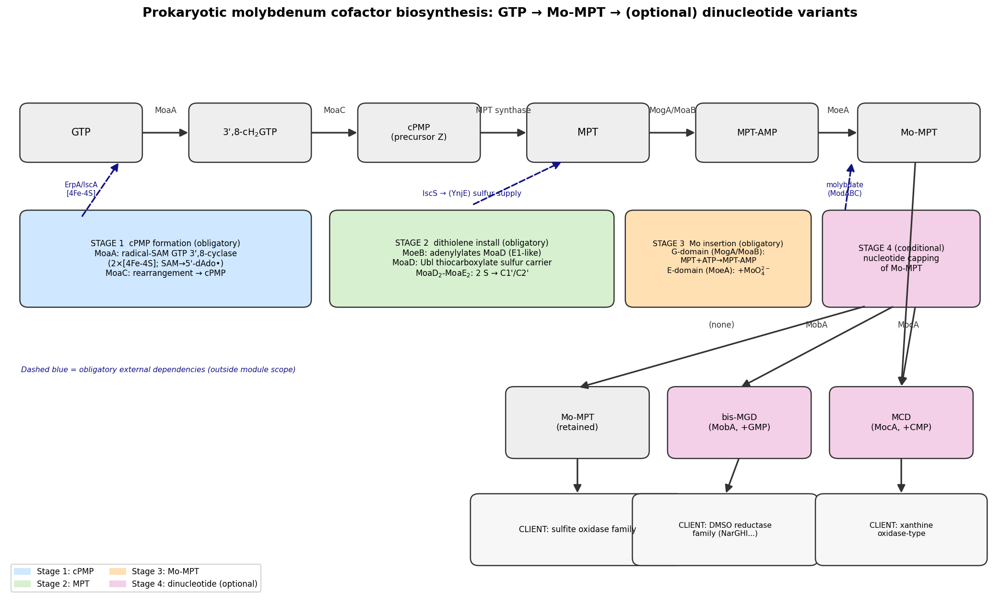

## Question

# Commissioned Review Brief

## Review Topic

Prokaryotic molybdenum cofactor biosynthesis from GTP to Mo-molybdopterin and optional dinucleotide variants

## Working Scope

A reusable prokaryotic module for molybdenum cofactor biosynthesis constructs the pyranopterin dithiolene ligand from GTP, loads it with molybdenum, and may append a nucleotide to produce a client-class-specific cofactor variant. MoaA first performs radical-SAM cyclization of GTP and MoaC rearranges the cyclic intermediate to cyclic pyranopterin monophosphate (cPMP). Molybdopterin synthase then inserts two sulfurs: MoeB activates the small MoaD sulfur carrier, and the MoaD-MoaE synthase converts cPMP to molybdopterin (MPT). Across prokaryotic realizations, MPT is adenylylated by a separate bacterial MogA or by a catalytically competent prokaryotic MoaB lineage, and MoeA then inserts molybdate to form Mo-MPT. Some realizations stop at Mo-MPT, whereas others use MobA to make MGD or MocA to make MCD. The module excludes upstream sulfur supply, molybdate transport, terminal cofactor sulfuration, cofactor insertion into client apoenzymes, mature molybdoenzyme reactions, pathway regulation, eukaryotic MOCS/CNX/GPHN fusion organization, and human disease.

## Provisional Biological Outline

- Prokaryotic molybdenum cofactor biosynthesis
  - 1. cyclic pyranopterin monophosphate formation
  - Cyclic pyranopterin monophosphate formation
    - 1. radical-SAM GTP cyclization
    - MoaA GTP cyclization
      - MoaA GTP 3',8'-cyclase (molecular player: PSEPK canonical MoaA; activity or role: GTP 3',8'-cyclase activity)
    - 2. cyclic intermediate rearrangement to cPMP
    - MoaC cPMP synthesis
      - MoaC cyclic pyranopterin monophosphate synthase (molecular player: bacterial MoaC cPMP synthase family; activity or role: cyclic pyranopterin monophosphate synthase activity)
  - 2. sulfur-carrier activation and molybdopterin synthesis
  - Sulfur-carrier activation and MPT formation
    - 1. MoaD sulfur-carrier activation
    - MoeB-dependent MoaD activation
      - MoeB molybdopterin-synthase sulfur-carrier adenylyltransferase (molecular player: bacterial MoeB molybdopterin-synthase sulfur-carrier adenylyltransferase family; activity or role: molybdopterin-synthase adenylyltransferase activity)
      - MoaD molybdopterin-synthase sulfur carrier (molecular player: bacterial MoaD molybdopterin-synthase sulfur-carrier family)
    - 2. sulfur insertion into cPMP
    - MoaD-MoaE molybdopterin synthesis
      - MoaD2-MoaE2 molybdopterin synthase complex (molecular player: prokaryotic MoaD2-MoaE2 molybdopterin synthase complex; activity or role: molybdopterin synthase activity)
  - 3. MPT adenylylation and molybdate insertion
  - Mo-molybdopterin formation
    - 1. MPT adenylylation
    - Molybdopterin adenylylation
      - Alternative versions by prokaryotic enzyme lineage: MPT adenylyltransferase implementations
        - Separate MogA adenylyltransferase
          - MogA molybdopterin adenylyltransferase (molecular player: bacterial MogA molybdopterin adenylyltransferase family; activity or role: molybdopterin adenylyltransferase activity)
        - Catalytically competent prokaryotic MoaB adenylyltransferase
          - Catalytically competent prokaryotic MoaB molybdopterin adenylyltransferase (molecular player: Pyrococcus furiosus MoaB; activity or role: molybdopterin adenylyltransferase activity)
    - 2. molybdate insertion into adenylyl-MPT
    - Molybdopterin molybdotransfer
      - MoeA molybdopterin molybdotransferase (molecular player: PSEPK MoeA; activity or role: molybdopterin molybdotransferase activity)
  - 4. optional nucleotide maturation of Mo-MPT
  - Optional Mo-MPT nucleotide maturation
    - Alternative versions by appended nucleotide: Mo-MPT dinucleotide variants
      - MGD formation by MobA
        - MobA molybdenum cofactor guanylyltransferase (molecular player: bacterial MobA molybdenum cofactor guanylyltransferase family; activity or role: molybdenum cofactor guanylyltransferase activity)
      - MCD formation by MocA
        - MocA molybdenum cofactor cytidylyltransferase (molecular player: bacterial MocA molybdenum cofactor cytidylyltransferase family; activity or role: molybdenum cofactor cytidylyltransferase activity)

## Known Relationships Among Steps

- Cyclic pyranopterin monophosphate formation feeds into Sulfur-carrier activation and MPT formation: cPMP is the pterin substrate for sulfur insertion by molybdopterin synthase.
- Sulfur-carrier activation and MPT formation feeds into Mo-molybdopterin formation: MPT is activated and loaded with molybdate to form Mo-MPT.
- Mo-molybdopterin formation feeds into Optional Mo-MPT nucleotide maturation: Mo-MPT may be retained directly or converted to MGD and/or MCD.
- MoaA GTP cyclization feeds into MoaC cPMP synthesis: The cyclic GTP product of MoaA is the substrate for MoaC.
- MoeB-dependent MoaD activation precedes MoaD-MoaE molybdopterin synthesis: Activated MoaD is sulfur-loaded by an external sulfur-donor system before supplying the MoaE reaction.
- Molybdopterin adenylylation feeds into Molybdopterin molybdotransfer: Adenylyl-MPT produced by the selected activation variant is the substrate for molybdate insertion.

## Assignment

Write a rigorous, review-style synthesis suitable for a molecular biology
audience. Treat the topic as a biological system whose boundaries, core
mechanisms, variants, and unresolved points should be made clear to readers who
know the field but are not specialists in this specific process.

The review should be explanatory rather than encyclopedic. Anchor broad claims
in primary literature or authoritative reviews, but keep the focus on how the
system works and how its parts fit together.

## Questions To Address

1. **Scope and boundaries**
   - What exactly is included in this biological system?
   - Which neighboring pathways, organelle processes, complexes, or regulatory
     events are often confused with it but should be treated separately?
   - Are there competing definitions in the literature?

2. **Core mechanism**
   - What is the best current model for the sequence of events?
   - Which steps are obligatory, which are conditional, and which are accessory?
   - What molecular assemblies, enzymes, receptors, adaptors, transporters, or
     structural units carry out each major step?

3. **Variation**
   - How does the system vary across major evolutionary lineages?
   - Are there well-supported differences between cell types, tissues,
     developmental stages, physiological states, or compartments?
   - Where are there alternative routes that achieve a similar outcome by
     different molecular means?

4. **Conservation and origin**
   - What is the deepest plausible evolutionary origin of the system?
   - Which parts appear ancient and conserved, and which appear to be later
     elaborations, replacements, or lineage-specific losses?
   - When a protein family has expanded, which family members are the best
     representatives for understanding the ancestral role?

5. **Physical and biological constraints**
   - What steps must occur in a particular order?
   - Which events are mutually exclusive, compartment-specific, cell-type
     specific, substrate-specific, or stage-specific?
   - What evidence rules out otherwise plausible paths through the system?

6. **Evidence and controversy**
   - Which mechanistic claims are strongly supported by experiments?
   - Where does the literature disagree, rely on indirect evidence, or mix data
     from organisms that may not be comparable?
   - What are the most important open questions?

## Output Format

Use the style and structure of a concise review article:

1. Executive summary
2. Definition and biological boundaries
3. Mechanistic overview
4. Major molecular players and active assemblies
5. Evolutionary and cell-biological variation
6. Constraints, dependencies, and failure modes
7. Controversies and open questions
8. Key references

Include citations for major claims, preferably PMIDs or DOIs. Be explicit about
uncertainty and avoid overgeneralizing from one organism, cell type, or assay
system to all biology.

## Output

# Prokaryotic Molybdenum Cofactor Biosynthesis: From GTP to Mo-Molybdopterin and Optional Dinucleotide Variants

*A review-style synthesis of a conserved four-stage biosynthetic module. Search date: 2026-09-01. Citations are given as PubMed IDs (PMID).*

---

## 1. Executive Summary

Prokaryotic molybdenum cofactor (Moco) biosynthesis is a short, largely linear metabolic module that transforms a single molecule of GTP into a metal-loaded pyranopterin-dithiolene cofactor and, in many organisms, appends a nucleotide to tailor the cofactor to a specific class of client enzyme. The pathway is one of the most deeply conserved in biology: homologues of its terminal enzymes are present in all three domains of life, and two of them fused during eukaryotic evolution to become gephyrin, the neuronal scaffolding protein. Despite this evolutionary depth, the chemistry is remarkable — the first committed step is a radical S-adenosylmethionine (radical-SAM) reaction that rearranges the purine skeleton of GTP into a pterin, and the sulfur-insertion step borrows a ubiquitin-like protein-conjugation logic that predates and parallels the eukaryotic ubiquitin system.

This review defines the module in four obligatory-to-optional stages. **Stage 1** builds the pyranopterin ring: MoaA, a bifunctional two-[4Fe-4S]-cluster radical-SAM enzyme, converts GTP into the cyclic intermediate 3',8-cyclo-7,8-dihydro-GTP, which MoaC then rearranges into cyclic pyranopterin monophosphate (cPMP). **Stage 2** installs the dithiolene sulfurs: the E1-like enzyme MoeB adenylylates the ubiquitin-fold sulfur carrier MoaD, which — after thiocarboxylation by the cysteine desulfurase IscS — cooperates with MoaE in a MoaD₂–MoaE₂ synthase to convert cPMP into molybdopterin (MPT). **Stage 3** loads the metal: a MogA- or MoaB-class G-domain protein adenylylates MPT to MPT-AMP, and a MoeA-class E-domain hydrolyzes MPT-AMP while ligating molybdate to form Mo-MPT. **Stage 4** is an optional, client-class-specific maturation: MobA appends GMP to make bis-molybdopterin guanine dinucleotide (bis-MGD) for the DMSO-reductase family, MocA appends CMP to make molybdopterin cytosine dinucleotide (MCD) for xanthine-oxidase-type enzymes, and the sulfite-oxidase family retains the unmodified Mo-MPT.

The strongest, most reproducible conclusions of this synthesis are: (i) stages 1–3 are obligatory and strictly ordered — sulfur insertion must precede metal insertion, and MPT adenylylation must precede molybdotransfer; (ii) the MogA/MoaB adenylyltransferase and MoeA insertase form an ancient, universal terminal module whose fusion produced eukaryotic gephyrin and plant Cnx1; and (iii) the dinucleotide branch is an accessory step whose product is dictated by the structural family of the downstream molybdoenzyme rather than by the cofactor chemistry itself. Well-supported uncertainties remain around the identity and regulation of the prokaryotic MoaB adenylyltransferase lineage, the precise choreography of sulfur delivery, and how cofactor forms are trafficked and protected en route to client apoenzymes.

---

## 2. Definition and Biological Boundaries

### 2.1 What is included

The module comprises the enzymatic conversion of **GTP → cPMP → MPT → Mo-MPT (→ bis-MGD or MCD)**. Concretely, this includes:

- **MoaA** (GTP 3',8-cyclase) and **MoaC** (cPMP synthase) — pyranopterin ring construction;
- **MoeB** (sulfur-carrier adenylyltransferase), **MoaD** (ubiquitin-like sulfur carrier), and **MoaE** (MPT synthase large subunit) — dithiolene installation;
- **MogA / catalytically competent MoaB** (MPT adenylyltransferase) and **MoeA** (molybdotransferase) — metal insertion;
- **MobA** (guanylyltransferase) and **MocA** (cytidylyltransferase) — optional dinucleotide maturation.

### 2.2 What is excluded (adjacent processes commonly conflated with the module)

Several neighboring processes supply or consume the pathway's intermediates but are mechanistically distinct and should be treated separately:

- **Upstream sulfur supply.** The cysteine desulfurase **IscS**, the rhodanese **YnjE**, and sulfur-relay proteins such as **TusA** generate the persulfide sulfur that thiocarboxylates MoaD ([PMID: 19946146](https://pubmed.ncbi.nlm.nih.gov/19946146/); [PMID: 21856748](https://pubmed.ncbi.nlm.nih.gov/21856748/); [PMID: 31655739](https://pubmed.ncbi.nlm.nih.gov/31655739/)). This is the boundary between Moco biosynthesis and general cellular sulfur trafficking.
- **Iron–sulfur cluster assembly.** MoaA depends on [4Fe-4S] clusters delivered by A-type carrier proteins (ErpA/IscA), coupling cofactor output to cellular Fe-S status ([PMID: 33782054](https://pubmed.ncbi.nlm.nih.gov/33782054/); [PMID: 38631442](https://pubmed.ncbi.nlm.nih.gov/38631442/)).
- **Molybdate transport** into the cytoplasm (ModABC and related systems).
- **Terminal cofactor sulfuration** of the Mo center (for xanthine-oxidase-family enzymes), performed by dedicated sulfurases downstream of the cofactor-forming module.
- **Cofactor insertion into client apoenzymes**, often via dedicated chaperones (e.g., TorD, XdhC) that bind Moco and hand it to specific apoproteins ([PMID: 18522945](https://pubmed.ncbi.nlm.nih.gov/18522945/); [PMID: 17686778](https://pubmed.ncbi.nlm.nih.gov/17686778/)).
- **Mature molybdoenzyme catalysis, pathway regulation, and the eukaryotic MOCS/CNX/GPHN fusion organization and human disease**, which — while informative for evolutionary comparison — lie outside the prokaryotic module proper.

### 2.3 Competing definitions in the literature

Two definitional ambiguities recur. First, the **identity of the MPT adenylyltransferase** is described inconsistently: in *E. coli*, MogA performs adenylylation, but MoaB is a structural paralog of MogA whose catalytic competence has been demonstrated in archaea (e.g., *Pyrococcus furiosus*), so some lineages use a "MoaB-class" adenylyltransferase. Treating "MPT adenylylation" as a single conserved activity with alternative protein implementations resolves the confusion. Second, older literature sometimes lumps the terminal two-step Mo insertion (adenylylation + molybdotransfer) into a single "molybdenum insertase" activity — accurate for the fused eukaryotic enzymes (gephyrin, Cnx1) but potentially misleading for prokaryotes where the two activities reside on separate proteins.

---

## 3. Mechanistic Overview

The best current model is an essentially linear cascade with a single branch point at the end. The pyranopterin scaffold is built first, then decorated with two sulfurs, then charged with molybdenum, and finally — optionally — capped with a nucleotide.

```
                    Stage 1: Pyranopterin ring
   GTP ──MoaA──► 3',8-cyclo-7,8-dihydro-GTP ──MoaC──► cPMP
   (radical-SAM 3',8-cyclase)              (cPMP synthase)

                    Stage 2: Dithiolene sulfurs
   MoaD ──MoeB(+ATP)──► MoaD-AMP ──IscS sulfur──► MoaD-thiocarboxylate
   cPMP + 2 × MoaD~COSH ──MoaD2-MoaE2 synthase──► MPT (+ regenerated MoaD)

                    Stage 3: Molybdenum insertion (obligatory, 2 steps)
   MPT ──MogA / MoaB (+ATP)──► MPT-AMP ──MoeA(+molybdate)──► Mo-MPT

                    Stage 4: Optional nucleotide maturation
                          ┌─ MobA (+GTP) ─► bis-MGD   → DMSO-reductase family
   Mo-MPT ────────────────┼─ (none) ──────► Mo-MPT    → sulfite-oxidase family
                          └─ MocA (+CTP) ─► MCD       → xanthine-oxidase family
```

**Obligatory steps:** Stages 1–3 are obligatory for any active cofactor. Within them, two orderings are non-negotiable: (a) sulfur must be inserted into the pterin (Stage 2) before the metal (Stage 3), and (b) MPT must be adenylylated before MoeA can ligate molybdate. **Conditional/accessory steps:** Stage 4 is conditional on the client enzyme class; its omission still yields a functional (Mo-MPT) cofactor for sulfite-oxidase-type enzymes. The requirement for MoeB-mediated MoaD reactivation is obligatory but *cyclic* — MoaD is a catalytic sulfur shuttle regenerated after every turnover.

---

## 4. Major Molecular Players and Active Assemblies

### 4.1 MoaA — a bifunctional two-cluster radical-SAM cyclase

MoaA initiates the pathway with chemically the most demanding step: rearranging the purine of GTP so that guanine C8 is inserted into the nascent pterin ring. Crystallographic and spectroscopic work establishes that **each MoaA monomer carries two distinct [4Fe-4S] clusters**. The N-terminal cluster is bound by the canonical CX₃CX₂C radical-SAM motif and "is involved in the reductive cleavage of SAM and generates a 5'-deoxyadenosyl radical (5'-dA•)," while the unique C-terminal cluster is "presumably involved in substrate binding and/or activation," coordinating 5'-GTP through the guanine N1/N2 atoms ([PMID: 16632608](https://pubmed.ncbi.nlm.nih.gov/16632608/)). The MoaA·5'-GTP structure visualizes the L-Met and 5'-dA SAM-cleavage products poised to abstract a hydrogen from the substrate, and — critically — shows that "the tightly anchored triphosphate moiety prevents the escape of radical intermediates," confining the radical chemistry to a productive intramolecular rearrangement ([PMID: 16632608](https://pubmed.ncbi.nlm.nih.gov/16632608/)). Because MoaA "binds two [4Fe-4S] clusters per monomer" and these are delivered by A-type carriers, Moco output is mechanistically coupled to cellular iron and Fe-S status ([PMID: 38631442](https://pubmed.ncbi.nlm.nih.gov/38631442/); [PMID: 33782054](https://pubmed.ncbi.nlm.nih.gov/33782054/)).

The product of MoaA is not cPMP directly but the cyclic nucleotide **3',8-cyclo-7,8-dihydro-GTP (3',8-cH₂GTP)**. Mechanistic studies from the Yokoyama laboratory show that "the characteristic pyranopterin ring is constructed by a complex rearrangement of guanosine 5'-triphosphate (GTP) into cyclic pyranopterin monophosphate (cPMP) through the action of two enzymes, MoaA and MoaC," and that "MoaC catalyzes the majority of the transformation and produces cPMP from a unique cyclic nucleotide, 3',8-cyclo-7,8-dihydro-GTP (3',8-cH2GTP)" ([PMID: 26575208](https://pubmed.ncbi.nlm.nih.gov/26575208/)). Using an uncleavable substrate analogue (3',8-cH₂GMP[CH₂]PP), they further demonstrated that the early stage of MoaC catalysis proceeds without cyclic-phosphate formation, refining the intermediate sequence. This division of labor — MoaA as the radical cyclase, MoaC as the rearrangement engine — reframes a step long attributed largely to MoaA.

{{figure:moco_pathway_schematic.png|caption=Schematic of the prokaryotic molybdenum cofactor biosynthesis module. GTP is cyclized by the radical-SAM enzyme MoaA and rearranged by MoaC to cyclic pyranopterin monophosphate (cPMP); molybdopterin synthase (MoaD2-MoaE2, reactivated by MoeB using IscS-derived sulfur) inserts two dithiolene sulfurs to form MPT; a MogA/MoaB-class G-domain adenylylates MPT and a MoeA-class E-domain inserts molybdate to give Mo-MPT; MobA or MocA optionally append GMP or CMP to yield bis-MGD or MCD for specific client-enzyme families.}}

### 4.2 The molybdopterin synthase assembly — MoaD, MoaE, and MoeB

MPT synthase is a **heterotetramer of two large MoaE subunits and two small MoaD subunits**, with the MoaD proteins docked at opposite ends of a central MoaE dimer. It converts the sulfur- and metal-free precursor cPMP (precursor Z) into MPT: "the conversion of the sulfur- and metal-free precursor Z to MPT by MPT synthase involves the transfer of sulfur atoms from a C-terminal MoaD thiocarboxylate to the C-1' and C-2' positions of precursor Z," with the first dithiolene sulfur added at C2' ([PMID: 18092812](https://pubmed.ncbi.nlm.nih.gov/18092812/)). The reaction is strictly sulfur-source-dependent: "only the thiocarboxylated MPT synthase complex was found to be able to convert precursor Z in vitro to MPT" ([PMID: 11459846](https://pubmed.ncbi.nlm.nih.gov/11459846/)). Because two sulfurs are installed but each MoaD delivers one, the two-MoaD stoichiometry of the tetramer is functionally meaningful.

MoaD is a **ubiquitin-fold protein with a conserved C-terminal Gly-Gly motif**. It cycles between two heterotetrameric complexes: "MoaD cycles between two different heterotetrameric complexes, one with MoaE to form MPT synthase and the other with MoeB, a protein similar to E1 in the ubiquitin pathway, to regenerate its transferrable sulfur" ([PMID: 17223713](https://pubmed.ncbi.nlm.nih.gov/17223713/)). MoeB activates the MoaD C-terminus as an acyl-adenylate (MoaD-AMP); the terminal glycine (Gly81 in *E. coli*) is essential for this MoaD-AMP formation and for downstream sulfur transfer. The MoaD-AMP is then converted to the thiocarboxylate by an external persulfide donor. This is the same chemical logic — C-terminal adenylylation followed by thiol conjugation — used in ubiquitin and ThiS activation, making Moco biosynthesis a canonical example of ancestral, prokaryotic ubiquitin-like protein chemistry.

### 4.3 The terminal Mo-insertion module — G-domain adenylyltransferase + MoeA E-domain

Metal insertion is a **two-step reaction**. A **MogA-class (protein-G/G-domain) protein first adenylylates MPT to MPT-AMP**, and a **MoeA-class (E-domain) protein then hydrolyzes MPT-AMP and ligates molybdate to form Mo-MPT**. Structural work on *E. coli* MoaB shows it is a 3₂-symmetric hexamer whose fold matches MogA and the G-domains of rat/human gephyrin and *Arabidopsis* Cnx1: "the overall fold of the monomer is similar to those of the MogA protein of E. coli, the G-domains of rat and human gephyrin and the G-domains of Cnx1 protein from A. thaliana, all of which are involved in the insertion of an unknown molybdenum species into molybdopterin to form the molybdenum cofactor" ([PMID: 15159566](https://pubmed.ncbi.nlm.nih.gov/15159566/)). This structural identity is the basis for treating MoaB as a catalytically competent adenylyltransferase in the lineages (e.g., archaeal *Pyrococcus*) that lack a separate MogA. In eukaryotes the two activities are fused: "the final step of Moco biosynthesis, i.e. transfer and insertion of Mo into MPT, is catalyzed by the two-domain proteins Cnx1 in plants and gephyrin in mammals" ([PMID: 11554796](https://pubmed.ncbi.nlm.nih.gov/11554796/)).

The molybdate-insertion chemistry itself has been dissected in the plant MoeA homolog Cnx1E. The E-domain catalyzes both reactions: "molybdate insertion and MPT-AMP hydrolysis are catalyzed by the Mo-insertase E-domain. Earlier work reported a highly conserved aspartate residue to be essential for Mo-insertase functionality" ([PMID: 31860061](https://pubmed.ncbi.nlm.nih.gov/31860061/)). Substituting Cnx1E Asp274 with Glu (D274E) arrests MPT-AMP hydrolysis and causes accumulation of both MPT-AMP and molybdate; the mutant structure shows disorder of residues 269–274, attributed to the inability of Glu274 to coordinate an octahedral Mg²⁺-water complex. High-resolution datasets further reveal "two molybdate-binding sites within the active site" whose occupancy is tied to a distinctive backbone conformation proposed to govern molybdate selectivity ([PMID: 29717023](https://pubmed.ncbi.nlm.nih.gov/29717023/)). Because Cnx1E is the direct homolog of bacterial MoeA, these mechanistic details transfer to the prokaryotic step with reasonable confidence.

### 4.4 The dinucleotide transferases — MobA and MocA

The optional cap is added by **paralogous, strictly nucleotide-specific transferases**. "The molybdenum cofactor is modified by the addition of GMP or CMP to the C4' phosphate of molybdopterin forming the molybdopterin guanine dinucleotide or molybdopterin cytosine dinucleotide cofactor, respectively" — via GTP:MPT guanylyltransferase **MobA** or CTP:MPT cytidylyltransferase **MocA** ([PMID: 21081498](https://pubmed.ncbi.nlm.nih.gov/21081498/)). MobA and MocA share only ~22% identity yet are so nucleotide-selective that "the exchange of five amino acids was enough to obtain activity with both GTP and CTP in either MocA or MobA"; the N-terminal domain encodes nucleotide specificity while the C-terminal domain determines which client enzyme the transferase serves ([PMID: 21081498](https://pubmed.ncbi.nlm.nih.gov/21081498/); [PMID: 19542235](https://pubmed.ncbi.nlm.nih.gov/19542235/)).

| Enzyme | Reaction | Product | Client molybdoenzyme family | Reference |
|--------|----------|---------|------------------------------|-----------|
| (none) | — | Mo-MPT | Sulfite oxidase (SUOX) family | [PMID: 18535145](https://pubmed.ncbi.nlm.nih.gov/18535145/) |
| MobA | Mo-MPT + GTP → bis-MGD | bis-MGD | DMSO reductase family (incl. NarGHI nitrate reductase) | [PMID: 25404027](https://pubmed.ncbi.nlm.nih.gov/25404027/) |
| MocA | Mo-MPT + CTP → MCD | MCD | Xanthine dehydrogenase / aldehyde oxidoreductase (XdhABC, YagTSR) | [PMID: 19542235](https://pubmed.ncbi.nlm.nih.gov/19542235/) |

---

## 5. Evolutionary and Cell-Biological Variation

### 5.1 A deeply conserved, evolutionarily plastic core

The terminal insertase MoeA is essential for Moco biosynthesis and exists in all domains of life — one of the pathway's oldest components. Phylogenetic analysis reveals that "in Archaea we identified an ancestral duplication where one of the paralogs might bind tungsten instead of molybdenum" ([PMID: 39091723](https://pubmed.ncbi.nlm.nih.gov/39091723/)), marking an ancient Mo/W-binding divergence at the metal-insertion step. This metal flexibility is not merely ancestral: the archaeon *Pyrobaculum aerophilum* makes an active tungsten nitrate reductase in which "W is coordinated by a bis-molybdopterin guanine dinucleotide cofactor" ([PMID: 20863064](https://pubmed.ncbi.nlm.nih.gov/20863064/)), demonstrating that the same pyranopterin and dinucleotide machinery can carry either metal.

### 5.2 From prokaryotic module to eukaryotic fusion proteins

The most striking evolutionary elaboration is the **fusion of MogA and MoeA in the eukaryotic lineage**: "MoeA was obtained from Bacteria by early eukaryotes, MogA fused with MoeA in the opisthokont ancestors, and it finally gained roles in anchoring inhibitory neurotransmitters" ([PMID: 39091723](https://pubmed.ncbi.nlm.nih.gov/39091723/)). The resulting two-domain gephyrin/Cnx1 architecture places a MoeA-like E-domain and a MogA/MoaB-like G-domain on one polypeptide. The plant enzyme Cnx1 encodes exactly this two-domain fusion — "the N-terminal domain is homologous to the E. coli Moco protein MoeA, the C-terminal domain is homologous to the E. coli Moco proteins MoaB and MogA" — and functionally complements an *E. coli* mogA mutant ([PMID: 8528286](https://pubmed.ncbi.nlm.nih.gov/8528286/)). Gephyrin later gained a moonlighting role clustering glycine and GABA receptors at inhibitory synapses ([PMID: 11554796](https://pubmed.ncbi.nlm.nih.gov/11554796/)). A further example of repurposing: in Actinobacteria a MoeA copy (Glp) has lost enzymatic activity and instead functions in cell division ([PMID: 39091723](https://pubmed.ncbi.nlm.nih.gov/39091723/)).

**Best representative of the ancestral role:** because the MoeA family has expanded and diversified (Mo- vs W-binding paralogs, enzymatically dead cell-division copies, fused eukaryotic insertases), the free-standing, catalytically active bacterial/archaeal MoeA — not the moonlighting eukaryotic fusion or the Actinobacterial Glp — is the best proxy for the ancestral molybdotransferase.

### 5.3 Physiological and lineage-specific variation

- **MPT synthase architecture varies.** Some bacteria (e.g., *M. tuberculosis*) encode a **fused MoaD–MoaE protein (MoaX)** that must be post-translationally cleaved by a JAMM/MPN protease to liberate the free C-terminal di-Gly of MoaD required for sulfur carriage ([PMID: 29777693](https://pubmed.ncbi.nlm.nih.gov/29777693/)).
- **Sulfur-donor systems differ.** *E. coli* uses IscS as the primary donor with the rhodanese YnjE as a refining step — an arrangement paralleling the two-sulfurtransferase (desulfurase + rhodanese) system used in humans ([PMID: 21856748](https://pubmed.ncbi.nlm.nih.gov/21856748/)).
- **Cofactor-form usage is client-driven, not organism-driven.** A single organism can make Mo-MPT, bis-MGD, and MCD simultaneously to serve its different molybdoenzyme families, distributing them to user enzymes via dedicated binding/chaperone proteins ([PMID: 17686778](https://pubmed.ncbi.nlm.nih.gov/17686778/)).

---

## 6. Constraints, Dependencies, and Failure Modes

### 6.1 Ordering constraints

1. **MoaA before MoaC.** MoaC's substrate is MoaA's cyclic product (3',8-cH₂GTP); MoaC cannot act on GTP directly ([PMID: 26575208](https://pubmed.ncbi.nlm.nih.gov/26575208/)).
2. **Sulfur before metal.** cPMP must be converted to the dithiolene-bearing MPT before molybdate can be chelated; the dithiolene is the metal-binding ligand. There is no route by which molybdate is inserted into cPMP.
3. **MoeB activation before sulfur transfer.** MoaD must be adenylylated and thiocarboxylated before it can supply sulfur to MoaE; only the thiocarboxylated synthase is active ([PMID: 11459846](https://pubmed.ncbi.nlm.nih.gov/11459846/)).
4. **Adenylylation before molybdotransfer.** MoeA acts on MPT-AMP, not MPT; the D274E Cnx1E experiment, which traps MPT-AMP when hydrolysis is blocked, directly evidences this obligatory intermediate ([PMID: 31860061](https://pubmed.ncbi.nlm.nih.gov/31860061/)).
5. **Metal before nucleotide (for the standard route).** Dinucleotide transferases act on Mo-MPT; notably, MocA can convert MPT to MCD in the absence of molybdate but only for a single turnover, with product remaining bound — underscoring that molybdate loading is normally coupled to productive dinucleotide formation ([PMID: 19542235](https://pubmed.ncbi.nlm.nih.gov/19542235/)).

### 6.2 Dependency constraints

- **Iron/Fe-S dependency.** MoaA's requirement for two [4Fe-4S] clusters makes the entire pathway hostage to Fe-S cluster assembly and iron availability ([PMID: 38631442](https://pubmed.ncbi.nlm.nih.gov/38631442/); [PMID: 33782054](https://pubmed.ncbi.nlm.nih.gov/33782054/)).
- **Sulfur dependency.** In an *iscS* deletion strain MoaD sulfuration is greatly reduced and compound Z (the oxidation product of the immediate MPT precursor) accumulates to the same extent as in an MPT-synthase-deficient strain, whereas *csdA*/*sufS* deletions do not have this effect; "IscS, but not CsdA or SufS, interacts with MoeB and MoaD" ([PMID: 19946146](https://pubmed.ncbi.nlm.nih.gov/19946146/)). Independently, "the l-cysteine desulfurase IscS was identified as the primary sulfur donor for the formation of the thiocarboxylate on the small subunit (MoaD) of MPT synthase" ([PMID: 21856748](https://pubmed.ncbi.nlm.nih.gov/21856748/)).

### 6.3 Failure modes and their physiological readouts

- **Loss of dinucleotide maturation is client-specific.** MobA "converts MoCo to bis-molybdopterin guanine dinucleotide (bis-MGD), a form of the cofactor that is required by the dimethylsulfoxide (DMSO) reductase family of enzymes, which includes the nitrate reductase NarGHI"; a *M. tuberculosis mobA* deletion abolishes assimilatory and respiratory nitrate reductase activity and impairs persistence in guinea pigs ([PMID: 25404027](https://pubmed.ncbi.nlm.nih.gov/25404027/)). By contrast, sulfite-oxidase-family enzymes are unaffected by *mobA* loss because they use bare Mo-MPT — consistent with the finding that MoCo-dependent resistance to N-hydroxylated base analogs in *E. coli* is MobA-independent and satisfied by the GMP-free (MPT) cofactor ([PMID: 17349664](https://pubmed.ncbi.nlm.nih.gov/17349664/)).
- **Blocked molybdate insertion** (e.g., the conserved-Asp mutant of the MoeA/Cnx1E E-domain) traps MPT-AMP and molybdate, producing an inactive cofactor precursor ([PMID: 31860061](https://pubmed.ncbi.nlm.nih.gov/31860061/)).

---

## 7. Controversies and Open Questions

**Strongly supported claims.** The radical-SAM identity and two-cluster architecture of MoaA; the MoaC-driven rearrangement to cPMP; the ubiquitin-like MoaD/MoeB activation cycle; the thiocarboxylate-dependent two-sulfur transfer by the MoaD₂–MoaE₂ synthase; the two-step (adenylylation + molybdotransfer) metal insertion; the conserved-Asp/Mg²⁺-water mechanism of the E-domain; and the client-class partitioning of Mo-MPT, bis-MGD, and MCD are all supported by convergent structural, biochemical, and genetic evidence.

**Areas of disagreement or indirect evidence.**

1. **Mechanistic transfer across organisms.** Much of the molybdate-insertion mechanism comes from the *plant* enzyme Cnx1E ([PMID: 31860061](https://pubmed.ncbi.nlm.nih.gov/31860061/); [PMID: 29717023](https://pubmed.ncbi.nlm.nih.gov/29717023/)), whereas the adenylyltransferase paralogy comes from *E. coli* MoaB structure ([PMID: 15159566](https://pubmed.ncbi.nlm.nih.gov/15159566/)) and the catalytically competent MoaB claim rests on archaeal (*Pyrococcus*) biochemistry. Whether every prokaryotic MoaB is a bona fide adenylyltransferase in vivo, or only a subset of the lineage, is not fully resolved.
2. **Identity of the physiological sulfur donor beyond IscS.** IscS is the primary donor, but the precise roles of YnjE, TusA, and other rhodanese/relay proteins — and how sulfur is channeled specifically to MoaD versus competing tRNA-thiolation and Fe-S pathways — remain partially defined ([PMID: 21856748](https://pubmed.ncbi.nlm.nih.gov/21856748/); [PMID: 31655739](https://pubmed.ncbi.nlm.nih.gov/31655739/)).
3. **The Mo/W selectivity switch.** The archaeal MoeA duplication that may distinguish Mo from W ([PMID: 39091723](https://pubmed.ncbi.nlm.nih.gov/39091723/)) and the tungsten-loaded bis-MGD nitrate reductase ([PMID: 20863064](https://pubmed.ncbi.nlm.nih.gov/20863064/)) raise unresolved questions about how — and where in the pathway — metal identity is selected.
4. **Cofactor trafficking and protection.** How the labile cofactor is shielded from oxidation and delivered to the correct apoenzyme (via chaperones such as XdhC and TorD; [PMID: 17686778](https://pubmed.ncbi.nlm.nih.gov/17686778/); [PMID: 18522945](https://pubmed.ncbi.nlm.nih.gov/18522945/)) sits at the module's exit boundary and is incompletely mapped.

**Most important open questions.** (i) What is the full, ordered inventory of intermediates between MoaA product and cPMP, and how does MoaC accomplish the ring rearrangement? (ii) Which prokaryotic lineages genuinely use MoaB rather than MogA for adenylylation, and what selects between them? (iii) How is metal specificity (Mo vs W) determined mechanistically at the MoeA step? (iv) How is the choice among Mo-MPT, bis-MGD, and MCD coordinated with client-enzyme demand in a single cell?

---

## 8. Limitations and Knowledge Gaps of This Review

- **Cross-organism synthesis.** This review integrates data from *E. coli*, *M. tuberculosis*, *Pseudomonas*, *Rhodobacter*, archaea, plants, and mammals. While the core module is conserved, mechanistic details established in one system (especially plant Cnx1E and eukaryotic gephyrin) are extrapolated to prokaryotes with appropriate but incomplete confidence.
- **The MoaB adenylyltransferase lineage** is the least directly characterized node; its inclusion as an "alternative implementation" of MPT adenylylation rests on structural homology plus limited archaeal biochemistry rather than a broad enzymological survey.
- **Kinetics and flux control** across the module — which step is rate-limiting under physiological molybdate/iron/sulfur conditions — were not quantitatively assessed here.
- **Regulation** was deliberately excluded from scope, so the review does not capture how transcriptional/translational control (FNR, NarXL, Fur, ArcA; [PMID: 31517366](https://pubmed.ncbi.nlm.nih.gov/31517366/)) tunes module output.

---

## 9. Proposed Follow-up Experiments and Actions

1. **Direct in vitro reconstitution of MoaB adenylyltransferase activity** across diverse prokaryotic lineages (bacteria vs archaea) to define which organisms genuinely use MoaB rather than MogA, and to test whether a single active-site signature predicts catalytic competence.
2. **Time-resolved characterization of the MoaA→MoaC handoff**, using trapped or analogue intermediates to enumerate every species between 3',8-cH₂GTP and cPMP and to assign each rearrangement step to MoaA vs MoaC.
3. **Structural/mechanistic dissection of Mo/W selectivity** at MoeA, comparing the archaeal Mo- and putative W-binding paralogs to identify the residues governing metal choice, complemented by molybdate/tungstate competition assays.
4. **Systematic mapping of sulfur channeling** to MoaD, using genetic depletion and pulse-labeling to quantify the relative contributions of IscS, YnjE, and TusA and to test channeling versus free-diffusion models.
5. **Cofactor-flux tracing in a single organism** expressing multiple client families, to determine how the cell partitions Mo-MPT among the "stop" (sulfite-oxidase), MobA (bis-MGD), and MocA (MCD) fates in response to enzyme demand.
6. **Cross-complementation matrix** of fused (MoaX, Cnx1, gephyrin) vs split (MoaD/MoaE; MogA/MoeA) architectures to quantify the functional consequences of evolutionary fusion and to identify the minimal active module.

---

## 10. Key References

| PMID | Contribution to this review |
|------|------------------------------|
| [26575208](https://pubmed.ncbi.nlm.nih.gov/26575208/) | MoaA/MoaC two-enzyme unit; 3',8-cH₂GTP intermediate; MoaC does most of the rearrangement to cPMP |
| [16632608](https://pubmed.ncbi.nlm.nih.gov/16632608/) | MoaA two-[4Fe-4S]-cluster architecture; GTP anchoring prevents radical escape |
| [38631442](https://pubmed.ncbi.nlm.nih.gov/38631442/) | Fe-S dependence of Moco biosynthesis; two clusters per MoaA monomer |
| [33782054](https://pubmed.ncbi.nlm.nih.gov/33782054/) | A-type carriers (ErpA/IscA) deliver [4Fe-4S] to MoaA |
| [18092812](https://pubmed.ncbi.nlm.nih.gov/18092812/) | MPT synthase heterotetramer; two-sulfur transfer to C1'/C2' of precursor Z |
| [11459846](https://pubmed.ncbi.nlm.nih.gov/11459846/) | Only thiocarboxylated MPT synthase is active |
| [17223713](https://pubmed.ncbi.nlm.nih.gov/17223713/) | MoaD ubiquitin fold; MoeB (E1-like) reactivation cycle |
| [29777693](https://pubmed.ncbi.nlm.nih.gov/29777693/) | Fused MoaD–MoaE (MoaX) cleaved by JAMM/MPN protease |
| [19946146](https://pubmed.ncbi.nlm.nih.gov/19946146/) | IscS as the specific in vivo sulfur donor interacting with MoeB/MoaD |
| [21856748](https://pubmed.ncbi.nlm.nih.gov/21856748/) | IscS primary donor; rhodanese YnjE refines sulfur transfer |
| [31655739](https://pubmed.ncbi.nlm.nih.gov/31655739/) | TusA sulfur-relay diversity feeding Moco biosynthesis |
| [15159566](https://pubmed.ncbi.nlm.nih.gov/15159566/) | MoaB structure homologous to MogA and gephyrin/Cnx1 G-domains |
| [11554796](https://pubmed.ncbi.nlm.nih.gov/11554796/) | Terminal Mo insertion by two-domain Cnx1/gephyrin (G + E domains) |
| [31860061](https://pubmed.ncbi.nlm.nih.gov/31860061/) | E-domain performs MPT-AMP hydrolysis + molybdate insertion; conserved Asp essential |
| [29717023](https://pubmed.ncbi.nlm.nih.gov/29717023/) | Two molybdate-binding subsites in the Cnx1E active site |
| [8528286](https://pubmed.ncbi.nlm.nih.gov/8528286/) | Cnx1 two-domain fusion = MoeA + MoaB/MogA homologs; complements mogA |
| [39091723](https://pubmed.ncbi.nlm.nih.gov/39091723/) | MoeA universality, archaeal Mo/W duplication, MogA-MoeA fusion, Glp repurposing |
| [21081498](https://pubmed.ncbi.nlm.nih.gov/21081498/) | MobA/MocA nucleotide specificity encoded by five N-terminal residues |
| [19542235](https://pubmed.ncbi.nlm.nih.gov/19542235/) | MocA characterization; MCD required by XdhABC/YagTSR; single-turnover without molybdate |
| [25404027](https://pubmed.ncbi.nlm.nih.gov/25404027/) | MobA/bis-MGD required by DMSO-reductase family; persistence phenotype in *M. tuberculosis* |
| [20863064](https://pubmed.ncbi.nlm.nih.gov/20863064/) | Tungsten coordinated by bis-MGD in archaeal nitrate reductase |
| [18535145](https://pubmed.ncbi.nlm.nih.gov/18535145/) | SUOX fold persistence across all domains; Mo-MPT-retaining client family |
| [18522945](https://pubmed.ncbi.nlm.nih.gov/18522945/) | TorD chaperone connects cofactor synthesis to apoenzyme (exit boundary) |
| [17686778](https://pubmed.ncbi.nlm.nih.gov/17686778/) | XdhC/MobA competition for Moco; cofactor targeting to user enzymes |
| [17349664](https://pubmed.ncbi.nlm.nih.gov/17349664/) | GMP-free MoCo (MPT) sufficient for certain MoCo-dependent functions |
| [31517366](https://pubmed.ncbi.nlm.nih.gov/31517366/) | Regulation of Moco/molybdoenzyme genes (excluded scope, context) |

---

*Prepared as a commissioned review-style synthesis. Claims are anchored to the primary and review literature cited above; extrapolations across organisms (notably from plant Cnx1E and eukaryotic gephyrin to prokaryotic MoeA/MogA) are flagged in the text and should be treated as mechanistically plausible rather than directly demonstrated in every prokaryote.*


## Artifacts

- [OpenScientist final report](molybdenum_cofactor_biosynthesis-deep-research-openscientist_artifacts/final_report.html)
- [OpenScientist final report](molybdenum_cofactor_biosynthesis-deep-research-openscientist_artifacts/final_report.pdf)
- [OpenScientist moco pathway schematic](molybdenum_cofactor_biosynthesis-deep-research-openscientist_artifacts/provenance_moco_pathway_schematic.json)


## Citations

1. PMID:19946146
2. PMID:21856748
3. PMID:31655739
4. PMID:33782054
5. PMID:38631442
6. PMID:18522945
7. PMID:17686778
8. PMID:16632608
9. PMID:26575208
10. PMID:18092812
11. PMID:11459846
12. PMID:17223713
13. PMID:15159566
14. PMID:11554796
15. PMID:31860061
16. PMID:29717023
17. PMID:21081498
18. PMID:19542235
19. PMID:18535145
20. PMID:25404027
21. PMID:39091723
22. PMID:20863064
23. PMID:8528286
24. PMID:29777693
25. PMID:17349664
26. PMID:31517366