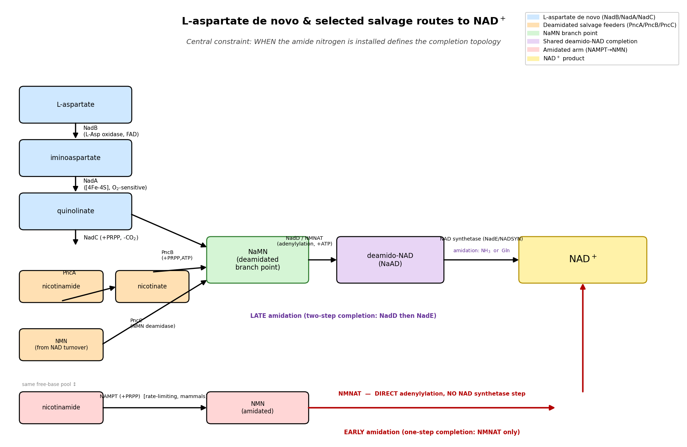

## Question

# Commissioned Review Brief

## Review Topic

L-aspartate de novo and selected salvage routes to NAD+

## Working Scope

A reusable, scope-limited route set for organisms that use the L-aspartate de novo pathway and/or selected nicotinate, nicotinamide, and NMN salvage alternatives. Every realization is end-to-end: NaMN made by L-aspartate de novo synthesis, PncB, or PncC must pass through deamido-NAD to NAD+, whereas NMN made by NAMPT must be adenylylated directly to NAD+. Alternative adenylyltransferase families and NAD synthetase nitrogen donors are modeled as variants. This is not a universal NAD+ biosynthesis hub: de novo synthesis through L-tryptophan and the kynurenine pathway is owned by the existing MODULE:kynurenine_nad_de_novo module and is not duplicated here. Nicotinate degradation, pyridine-nucleotide transhydrogenases, NAD kinase and NADP formation, NAD-consuming reactions, and unrelated aldehyde metabolism are outside the boundary.

## Provisional Biological Outline

- L-aspartate de novo and selected salvage routes to NAD+
  - Alternative versions by precursor deamidation state and completion chemistry: Complete NAD+ route realization
    - NaMN-producing routes with deamido-NAD completion
      - 1. produce NaMN by de novo synthesis or deamidated salvage
      - NaMN-producing precursor alternatives
        - Alternative versions by source precursor and deamidation sequence: NaMN-producing route
          - De novo NaMN synthesis from L-aspartate
            - 1. L-aspartate oxidation
            - L-aspartate oxidase step
              - L-aspartate oxidase (molecular player: L-aspartate oxidase family; activity or role: L-aspartate oxidase activity)
            - 2. quinolinate formation
            - Quinolinate synthase step
              - Quinolinate synthase A (molecular player: quinolinate synthase A family; activity or role: quinolinate synthetase A activity)
            - 3. quinolinate phosphoribosylation to NaMN
            - Quinolinate phosphoribosyltransferase step
              - Nicotinate-nucleotide diphosphorylase (carboxylating) (molecular player: quinolinate phosphoribosyltransferase family; activity or role: nicotinate-nucleotide diphosphorylase (carboxylating) activity)
          - Direct nicotinate Preiss-Handler entry
            - Nicotinate phosphoribosyltransferase (molecular player: nicotinate phosphoribosyltransferase family; activity or role: nicotinate phosphoribosyltransferase activity)
          - Nicotinamide deamidation followed by Preiss-Handler entry
            - 1. nicotinamide deamidation
            - Nicotinamidase step
              - Nicotinamidase (molecular player: nicotinamidase family; activity or role: nicotinamidase activity)
            - 2. nicotinate phosphoribosylation
            - PncB step after PncA
              - Nicotinate phosphoribosyltransferase (molecular player: nicotinate phosphoribosyltransferase family; activity or role: nicotinate phosphoribosyltransferase activity)
          - NMN deamidation to NaMN
            - Nicotinamide-nucleotide amidase PncC (molecular player: PncC/CinA C-terminal NMN deamidase family; activity or role: nicotinamide-nucleotide amidase activity)
      - 2. complete NaMN through deamido-NAD to NAD+
      - Shared NaMN completion through deamido-NAD
        - 1. NaMN adenylylation to deamido-NAD
        - NaMN adenylylation alternatives
          - Alternative versions by enzyme family: NaMN adenylyltransferase family
            - Bacterial NadD-family NaMN adenylyltransferase
              - Nicotinate-nucleotide adenylyltransferase (molecular player: bacterial NadD family; activity or role: nicotinate-nucleotide adenylyltransferase activity)
            - Bifunctional NMNAT-family NaMN adenylylation
              - NMNAT nicotinate-nucleotide adenylyltransferase activity (molecular player: eukaryotic NMN adenylyltransferase family; activity or role: nicotinate-nucleotide adenylyltransferase activity)
        - 2. deamido-NAD amidation to NAD+
        - NAD synthetase nitrogen-donor alternatives
          - Alternative versions by nitrogen donor and enzyme architecture: NAD synthetase nitrogen donor
            - Ammonia-dependent NAD synthetase
              - Ammonia-dependent NAD+ synthase (molecular player: ammonia-dependent NAD synthetase subfamily; activity or role: NAD+ synthase activity)
            - Glutamine-dependent NAD synthetase
              - Glutamine-dependent NAD+ synthase (molecular player: human glutamine-dependent NAD synthetase NADSYN1; activity or role: NAD+ synthase (glutamine-hydrolyzing) activity)
    - NAMPT-produced NMN with direct NAD+ completion
      - 1. produce NMN from nicotinamide
      - Nicotinamide phosphoribosylation to NMN
        - Nicotinamide phosphoribosyltransferase (molecular player: nicotinamide phosphoribosyltransferase family; activity or role: nicotinamide phosphoribosyltransferase activity)
      - 2. adenylylate NMN directly to NAD+
      - Direct amidated NMN completion
        - Nicotinamide-nucleotide adenylyltransferase (molecular player: eukaryotic NMN adenylyltransferase family; activity or role: nicotinamide-nucleotide adenylyltransferase activity)

## Known Relationships Among Steps

- De novo NaMN synthesis from L-aspartate feeds into Shared NaMN completion through deamido-NAD: The L-aspartate de novo route supplies NaMN to shared completion.
- Direct nicotinate Preiss-Handler entry feeds into Shared NaMN completion through deamido-NAD: Direct nicotinate phosphoribosylation supplies NaMN to shared completion.
- Nicotinamide deamidation followed by Preiss-Handler entry feeds into Shared NaMN completion through deamido-NAD: PncA followed by PncB supplies NaMN to shared completion.
- NMN deamidation to NaMN feeds into Shared NaMN completion through deamido-NAD: PncC deamidation supplies NaMN to shared completion.
- L-aspartate oxidase step feeds into Quinolinate synthase step: NadB supplies iminoaspartate to NadA.
- Quinolinate synthase step feeds into Quinolinate phosphoribosyltransferase step: NadA supplies quinolinate to NadC.
- Nicotinamidase step feeds into PncB step after PncA: PncA supplies nicotinate to PncB.
- NaMN adenylylation alternatives feeds into NAD synthetase nitrogen-donor alternatives: NaMN adenylylation supplies deamido-NAD to NAD synthetase.
- Nicotinamide phosphoribosylation to NMN feeds into Direct amidated NMN completion: NAMPT supplies NMN specifically to direct NMN adenylylation.

## Assignment

Write a rigorous, review-style synthesis suitable for a molecular biology
audience. Treat the topic as a biological system whose boundaries, core
mechanisms, variants, and unresolved points should be made clear to readers who
know the field but are not specialists in this specific process.

The review should be explanatory rather than encyclopedic. Anchor broad claims
in primary literature or authoritative reviews, but keep the focus on how the
system works and how its parts fit together.

## Questions To Address

1. **Scope and boundaries**
   - What exactly is included in this biological system?
   - Which neighboring pathways, organelle processes, complexes, or regulatory
     events are often confused with it but should be treated separately?
   - Are there competing definitions in the literature?

2. **Core mechanism**
   - What is the best current model for the sequence of events?
   - Which steps are obligatory, which are conditional, and which are accessory?
   - What molecular assemblies, enzymes, receptors, adaptors, transporters, or
     structural units carry out each major step?

3. **Variation**
   - How does the system vary across major evolutionary lineages?
   - Are there well-supported differences between cell types, tissues,
     developmental stages, physiological states, or compartments?
   - Where are there alternative routes that achieve a similar outcome by
     different molecular means?

4. **Conservation and origin**
   - What is the deepest plausible evolutionary origin of the system?
   - Which parts appear ancient and conserved, and which appear to be later
     elaborations, replacements, or lineage-specific losses?
   - When a protein family has expanded, which family members are the best
     representatives for understanding the ancestral role?

5. **Physical and biological constraints**
   - What steps must occur in a particular order?
   - Which events are mutually exclusive, compartment-specific, cell-type
     specific, substrate-specific, or stage-specific?
   - What evidence rules out otherwise plausible paths through the system?

6. **Evidence and controversy**
   - Which mechanistic claims are strongly supported by experiments?
   - Where does the literature disagree, rely on indirect evidence, or mix data
     from organisms that may not be comparable?
   - What are the most important open questions?

## Output Format

Use the style and structure of a concise review article:

1. Executive summary
2. Definition and biological boundaries
3. Mechanistic overview
4. Major molecular players and active assemblies
5. Evolutionary and cell-biological variation
6. Constraints, dependencies, and failure modes
7. Controversies and open questions
8. Key references

Include citations for major claims, preferably PMIDs or DOIs. Be explicit about
uncertainty and avoid overgeneralizing from one organism, cell type, or assay
system to all biology.

## Output

# L-Aspartate *de novo* and Selected Salvage Routes to NAD⁺

*A scope-limited review of the routes that converge on nicotinate mononucleotide (NaMN) and complete NAD⁺ through deamido-NAD, plus the topologically distinct NAMPT→NMN direct-completion route.*

---

## 1. Executive summary

Nicotinamide adenine dinucleotide (NAD⁺) is assembled from a small pyridine
mononucleotide (NaMN or NMN) by a two-reaction "completion" chemistry —
adenylylation of the mononucleotide to a dinucleotide, then installation of the
amide nitrogen. The system reviewed here is the set of routes that (i) build or
recover the **deamidated** mononucleotide **nicotinate mononucleotide (NaMN)**,
and (ii) carry NaMN through **deamido-NAD (nicotinate adenine dinucleotide,
NaAD)** to NAD⁺. NaMN is made by four routings of three chemistries: *de novo* from
**L-aspartate** (NadB → NadA → NadC); by **Preiss–Handler** phosphoribosylation
of nicotinate (PncB) either directly or after **nicotinamide deamidation** by
PncA; or by **deamidation of NMN** (PncC). All three converge on a single obligatory node: NaMN must be
adenylylated (NadD, or a bifunctional NMNAT) to deamido-NAD and then amidated by
**NAD synthetase (NadE/NADSYN)** to NAD⁺.

Standing apart from this deamidated arm is one **amidated** route that is
included here because it shares the same terminal adenylyltransferase family but
uses a different completion topology: **NAMPT** phosphoribosylates nicotinamide
to **NMN**, and NMN is adenylylated **directly** to NAD⁺ by NMNAT, with **no NAD
synthetase step**. The central organizing principle of the entire system is
therefore *when the amide nitrogen is installed*: **late** (deamidated arm,
NadE-dependent) versus **early** (NAMPT arm, NadE-independent).

The review deliberately excludes the L-tryptophan/kynurenine *de novo* route
(owned by a separate module), nicotinate degradation, transhydrogenases, NAD
kinase/NADP formation, and NAD-consuming reactions.

**Figure 1.** The scope-limited route set. Four sources feed the deamidated
branch point **NaMN** (L-aspartate *de novo* via NadB/NadA/NadC; nicotinate via
PncB; nicotinamide via PncA→PncB; NMN via PncC), which is obligatorily completed
in **two steps** — adenylylation to deamido-NAD (NadD or NMNAT) then amidation
by NAD synthetase (NadE/NADSYN). The **amidated arm** (bottom, red) is
topologically separate: NAMPT makes NMN already bearing the amide, and NMNAT
adenylylates it **directly** to NAD⁺ with no NAD synthetase step. The organizing
variable is the *timing of amide-nitrogen installation* — late (deamidated arm)
versus early (amidated arm).

---

## 2. Definition and biological boundaries

### 2.1 What is inside the boundary

The system comprises exactly these reactions:

**A. NaMN production**
1. **L-aspartate *de novo***: L-aspartate → iminoaspartate (**NadB**,
   L-aspartate oxidase) → quinolinate (**NadA**, quinolinate synthase) → NaMN
   (**NadC**, quinolinate phosphoribosyltransferase, decarboxylating).
2. **Direct Preiss–Handler entry**: nicotinate → NaMN (**PncB**, nicotinate
   phosphoribosyltransferase).
3. **Nicotinamide deamidation then Preiss–Handler**: nicotinamide → nicotinate
   (**PncA**, nicotinamidase) → NaMN (**PncB**).
4. **NMN deamidation**: NMN → NaMN (**PncC**, NMN deamidase).

**B. Deamidated completion (shared)**
5. NaMN → deamido-NAD (**NadD** bacterial family, or bifunctional **NMNAT**).
6. deamido-NAD → NAD⁺ (**NadE/NADSYN**, ammonia- or glutamine-dependent).

**C. Amidated direct completion (separate topology)**
7. nicotinamide → NMN (**NAMPT**).
8. NMN → NAD⁺ directly (**NMNAT**).

### 2.2 What is outside the boundary (and often confused with it)

- **L-tryptophan / kynurenine *de novo* route.** In fungi and animals,
  quinolinate — the same intermediate produced by NadA — is generated instead
  from tryptophan via kynurenine (TDO/IDO, KMO, kynureninase KYNU, HAAO). This
  produces the identical NaMN branch point but by entirely different upstream
  chemistry and is treated in the separate `kynurenine_nad_de_novo` module. It
  is important not to double-count quinolinate → NaMN → NAD⁺: NadC and the
  completion enzymes are shared, but the aspartate and tryptophan arms are
  parallel, mutually alternative sources of quinolinate. Human Congenital NAD
  Deficiency Disorder maps to the *tryptophan* arm (KYNU, HAAO) **and** to the
  shared completion enzyme NADSYN1 (PMID 33942433, 35491967).
- **Nicotinate degradation** (the *nic* catabolic cluster) — consumes, rather
  than salvages, nicotinate.
- **Pyridine-nucleotide transhydrogenases**, **NAD kinase** (NAD⁺ → NADP⁺), and
  **NAD-consuming enzymes** (sirtuins, PARPs, ADP-ribosyl cyclases, bacterial
  DNA ligase). These define the demand side and the NADP pool, not NAD⁺
  synthesis, and are excluded.
- **Nicotinamide riboside (NR) salvage** via nicotinamide riboside kinases
  (NRK1/2) feeds NMN and is adjacent, but is not itemized in this scope's
  provisional outline; it is mentioned only where it clarifies the NMN node.

### 2.3 Competing definitions in the literature

Two framing conventions coexist. The **microbial** literature (Osterman,
Rodionov, Raffaelli and colleagues) treats NAD homeostasis as a **pyridine
nucleotide cycle**: NAD is consumed to nicotinamide/NMN and *recycled* through
PncA/PncB/PncC back to NaMN (PMID 7592458, 21953451). The **mammalian**
literature emphasizes the **NAMPT-centred salvage** loop (nicotinamide → NMN →
NAD⁺) as the dominant flux (PMID 35903330). These are not contradictory: they
describe organisms that install the amide nitrogen at opposite ends of the
pathway. A recurring source of confusion is the word "salvage," which is used
for both the deamidated (PncA/PncB/PncC) and amidated (NAMPT/NRK) routes even
though they complete NAD⁺ by different topologies.

---

## 3. Mechanistic overview

### 3.1 The two completion topologies

The unifying insight is that NAD⁺ completion is a **mononucleotide →
dinucleotide adenylylation** followed (or not) by an **amidation**:

- **Deamidated arm.** NaMN (carries a carboxylate at the pyridine 3-position) is
  adenylylated to deamido-NAD (NaAD), which still carries the carboxylate. A
  dedicated **NAD synthetase (NadE)** then converts the carboxylate to the amide
  using ATP activation and an ammonia donor. Two chemical steps of nitrogen
  handling are required overall (the pyridine ring enters already deamidated).
- **Amidated arm.** NMN already carries the amide. A single adenylylation by
  **NMNAT** yields NAD⁺ directly. No NadE step exists or is needed.

Consequently, **the oxidation/deamidation state of the mononucleotide dictates
the number of downstream steps**: anything at the NaMN state is committed to
the two-step NadD + NadE completion; anything at the NMN state can be completed
in one step. This is the single most important constraint in the system
(Section 6).

### 3.2 Obligatory, conditional, and accessory steps

- **Obligatory for any organism using this system:** the adenylylation step
  (NadD or NMNAT) and, for the deamidated arm, the amidation step (NadE). NaMN
  → deamido-NAD → NAD⁺ has no known bypass.
- **Conditional (route-selecting):** which NaMN source operates depends on
  genotype and nutrient supply. *De novo* NadABC is used when no exogenous
  pyridine is available; Preiss–Handler (PncB) is used when nicotinate is
  available; PncA precedes PncB when the supplied vitamer is nicotinamide;
  PncC operates where NMN accumulates from NAD turnover.
- **Accessory / recycling:** PncA, PncB, and PncC are dispensable in a
  minimal-medium *de novo* organism but essential for pyridine-nucleotide
  cycling and for growth on specific vitamers. Regulatory proteins (NiaR, NrtR,
  Rex) tune expression but are not catalytic.

### 3.3 Step-by-step

1. **L-aspartate oxidation (NadB).** An FAD-dependent desaturating dehydrogenase
   converts L-aspartate to iminoaspartate, reducing FAD; the flavin is reoxidized
   by **fumarate anaerobically** and by **molecular O₂ aerobically**, the latter
   releasing H₂O₂ as an adventitious by-product (eliminating NadB turnover cut
   endogenous H₂O₂ by ~25–30 % in an E. coli scavenger-null strain) (PMID
   20149100). NadB is homologous to the flavoprotein subunit of succinate
   dehydrogenase/fumarate reductase — a deeply conserved respiratory-flavoprotein
   lineage. This redox flexibility lets the *de novo* arm's first step operate
   across oxygen tensions, complementing the O₂-**sensitivity** of the downstream
   [4Fe-4S] NadA.
2. **Quinolinate synthase (NadA).** Condenses iminoaspartate with
   dihydroxyacetone phosphate (DHAP) and cyclizes/dehydrates to quinolinate
   (PMID 31390192). NadA carries a **[4Fe-4S]²⁺ cluster** ligated by only three
   conserved cysteines, leaving a unique non-cysteinyl fourth iron that binds
   substrate/intermediate and is central to catalysis (PMID 18959769, 31390192).
   The cluster makes NadA **oxygen-sensitive**, a physiologically important
   liability.
3. **Quinolinate phosphoribosyltransferase (NadC).** Transfers the
   phosphoribosyl group from PRPP to quinolinate and decarboxylates, giving
   NaMN + CO₂. This is a type-II PRTase and is the point at which the aspartate
   and tryptophan *de novo* arms merge.
4. **Preiss–Handler / deamidation feeders.** PncA (nicotinamidase) hydrolyzes
   nicotinamide → nicotinate + NH₃; PncB (nicotinate PRTase) uses PRPP and ATP
   to make NaMN (ATP hydrolysis raises the effective equilibrium toward NaMN);
   PncC deamidates NMN → NaMN directly.
5. **NaMN adenylylation (NadD or NMNAT).** ATP + NaMN → NaAD + PPi.
6. **Amidation (NadE/NADSYN).** NaAD is adenylylated on its carboxylate (forming
   an NaAD-adenylate), then attacked by ammonia (ammonia-dependent NadE) or by
   ammonia liberated in-situ from glutamine (glutamine-dependent NADSYN), giving
   NAD⁺ + AMP + PPi.
7. **NAMPT arm.** NAMPT + PRPP convert nicotinamide → NMN; NMNAT adenylylates
   NMN → NAD⁺ directly.

---

## 4. Major molecular players and active assemblies

| Step | Enzyme (gene) | Family / fold | Cofactor / donor | Notable assembly features |
|------|---------------|---------------|------------------|---------------------------|
| Asp oxidation | L-aspartate oxidase (**nadB**) | SDH/FRD flavoprotein | FAD; fumarate (anaerobic) or O₂ (aerobic, H₂O₂) | Interacts with NadA (not species-specific); O₂ use adventitious (PMID 18959769, 20149100) |
| Quinolinate synthesis | Quinolinate synthase (**nadA**) | [4Fe-4S] enzyme | [4Fe-4S]²⁺, 3-Cys + unique Fe | O₂-sensitive; three-domain pseudo-symmetric fold (PMID 18959769, 31390192) |
| Quinolinate → NaMN | Quinolinate PRTase (**nadC**) | Type-II PRTase | PRPP; Mg²⁺ | Often hexameric; decarboxylating |
| Nicotinamide → nicotinate | Nicotinamidase (**pncA**) | Cys-His-Asp metalloamidohydrolase | Zn/Mn/Fe | Same enzyme = pyrazinamidase in mycobacteria (PMID 8726014, 18201201) |
| Nicotinate → NaMN | Nicotinate PRTase (**pncB**) | Type-II PRTase, ATPase-assisted | PRPP; ATP | Facultative ATPase (Ap4 synthesis/degradation) (PMID 28416276) |
| NMN → NaMN | NMN deamidase (**pncC**) | Novel Ser/Lys amidohydrolase (CinA C-term) | none | Distinct fold; often fused to COG1058 ADP-ribose pyrophosphatase (PMID 24530526, 23776507) |
| NaMN → NaAD | NaMN adenylyltransferase (**nadD**) | Nucleotidyltransferase α/β phosphodiesterase (HxGH) | ATP; Mg²⁺ | Bacterial NadD is nicotinate-selective; dimeric in some species (PMID 11704676, 16784754) |
| NaMN/NMN → (Na)AD | NMNAT (**NMNAT1/2/3**) | Same NT superfamily | ATP; Mg²⁺ | Dual-specificity; 3 compartmentalized human isoforms (PMID 16118205, 17402747) |
| NaAD → NAD⁺ | NAD synthetase (**nadE / NADSYN1/2**) | ATP-pyrophosphatase (N-type) ± CN-hydrolase | ATP; NH₃ or Gln | Glutamine form adds glutaminase domain + ~40 Å ammonia tunnel (PMID 12547821, 22280445) |
| Nicotinamide → NMN | NAMPT (**NAMPT/PBEF/visfatin**) | Type-II PRTase (dimeric) | PRPP; ATP-assisted | Rate-limiting in mammals; FK866-inhibited (PMID 35903330, 28416276) |

**Active-assembly highlights.**

- **NadA/NadB coupling.** The two *de novo* enzymes form a functional pair;
  cross-species reconstitution (B. subtilis NadA with E. coli NadB) works,
  indicating a conserved interaction interface for iminoaspartate channelling
  (PMID 18959769). Iminoaspartate is unstable, so hand-off limits its escape.
- **NadD as a fold archetype.** NadD, NMNAT, and phosphopantetheine
  adenylyltransferase share the nucleotidyltransferase α/β phosphodiesterase
  superfamily with the (T/H)xGH motif; bacterial NadD and human NMNAT are
  structurally similar yet pharmacologically separable, which is why NadD is an
  antibacterial target (PMID 19716475, 20578699).
- **Glutamine-dependent NadE as a channeling machine.** The synthetase and
  glutaminase active sites are separated by a ~40 Å ammonia tunnel with three
  constriction points that gate transfer and enforce kinetic synergism between
  the two active sites (PMID 22280445, 31911602).

---

## 5. Evolutionary and cell-biological variation

### 5.1 Across major lineages

- **Bacteria (and plants, and many archaea).** Predominantly use the
  **L-aspartate *de novo*** arm (NadB/NadA/NadC) plus NadD (nicotinate-specific)
  and NadE. The amide nitrogen is installed **late**. Deamidated salvage
  (PncA/PncB/PncC) recycles pyridines back to NaMN. Comparative-genomic
  reconstructions across hundreds of bacteria show extensive lineage-specific
  presence/absence of these genes and multiple transcriptional strategies (NiaR
  in Firmicutes/Thermotogales; NrtR/Nudix regulators broadly; Rex for redox
  balance) (PMID 18276644, 18276643, 22210771).
- **Fungi and animals.** Lack NadB/NadA; make quinolinate from **tryptophan**
  (outside this scope) and rely heavily on **amidated NAMPT salvage**, with NMN
  completed directly by **NMNAT** — the amide nitrogen is installed **early**.
  Humans have both an ammonia-dependent (NADSYN2-like) and glutamine-dependent
  (NADSYN1) NAD synthetase for the deamido-NAD produced by their tryptophan/
  Preiss–Handler flux (PMID 12547821).
- **Pathogen reductive loss.** *Shigella*/EIEC illustrate pathoadaptive loss of
  the *de novo* arm: silencing of *nadA/nadB* yields a nicotinic-acid–requiring
  (Nic⁻) phenotype, apparently because quinolinate attenuates invasion (PMID
  24120364). This is a clean natural experiment showing the *de novo* arm is
  dispensable when salvage substrate is available.
- **Mobile/large genetic elements.** Some gut "jumbo" phages encode complete NAD
  synthesis gene sets, an extreme case of horizontal acquisition of this module
  (PMID 39707494).

### 5.2 Enzyme-family variation that achieves the same outcome

- **Adenylyltransferase families:** bacterial **NadD** (nicotinate-selective,
  deamidated arm only) versus eukaryotic **NMNAT** (dual NaMN/NMN specificity,
  serves both arms). These are the "alternative adenylyltransferase families" of
  the brief.
- **NAD synthetase nitrogen donors:** **ammonia-dependent** (synthetase core
  only) versus **glutamine-dependent** (added CN-hydrolase glutaminase domain +
  ammonia tunnel). The glutamine dependence is a modular add-on: mutating the
  glutaminase catalytic Cys reverts NADSYN1 to ammonia-only behaviour (PMID
  12547821).

### 5.3 Cell-type, compartment, and physiological state (eukaryotes)

The three human NMNAT isoforms are compartmentalized — **NMNAT1 (nucleus),
NMNAT2 (Golgi/cytosol), NMNAT3 (mitochondria)** — with distinct kinetics,
metal preferences, and substrate-binding order, arguing for **compartment-
specific NAD pools** rather than one freely mixing cellular pool (PMID 16118205,
17402747, 29748257). NMNAT2 is a labile axon-survival factor whose loss triggers
Wallerian-type axon degeneration (a major reason this branch is biomedically
prominent). NAMPT is rate-limiting and stress-regulated, coupling NAD⁺ supply to
metabolic and inflammatory state (PMID 35903330).

### 5.4 Deepest plausible origin and what is ancient vs. derived

NAD⁺ itself is among the very small set of coenzymes assigned to the core
metabolism of the **last universal common ancestor (LUCA)** — alongside ADP and
pyridoxal phosphate — and all three have been shown to be catalytically active
in their metabolic reactions **in the absence of enzymes**, implying a prebiotic
contribution to abiogenesis (PMID 39292780). The pressure to synthesize and
regenerate NAD is therefore essentially as old as cellular life, and the
**completion chemistry** — mononucleotide → dinucleotide adenylylation followed
by amidation — is best read as the ancient, conserved core of the system.

Reading the parts by apparent age:

- **Ancient / conserved:** (i) the adenylylation step, catalyzed by the
  nucleotidyltransferase α/β-phosphodiesterase superfamily that also produced
  phosphopantetheine adenylyltransferase — a fold shared by NadD and NMNAT and
  therefore predating the bacterial/eukaryotic split; (ii) NAD synthetase, an
  ancestral member of the ATP-pyrophosphatase (N-type amidotransferase) clan;
  (iii) the **L-aspartate *de novo* arm** — NadB belongs to the deeply conserved
  succinate-dehydrogenase/fumarate-reductase flavoprotein family and works
  anaerobically (fumarate) as readily as aerobically (PMID 20149100), while
  NadA's **[4Fe-4S]** chemistry is a hallmark of ancient, anaerobe-compatible
  metallo-enzymes. The aspartate route's anaerobic compatibility fits an early,
  low-oxygen biosphere.
- **Later elaborations / replacements / losses:** (i) the **glutaminase domain +
  ammonia tunnel** appended to NAD synthetase is a modular add-on to an
  ammonia-dependent core (mutating the glutaminase Cys reverts human NADSYN1 to
  ammonia-only; PMID 12547821), and phylogenetics identify a *poorly*
  synergistic glutamine-dependent enzyme (T. maritima) as closer to the
  ancestral state, with tight coupling being derived (PMID 19647806); (ii) the
  **amidated NAMPT→NMN→NMNAT** topology, dominant in animals, is a lineage
  where the *de novo* aspartate arm was lost and replaced by tryptophan-derived
  quinolinate plus heavy amidated salvage; (iii) **reductive losses** of *de
  novo* genes (*Shigella nadA/nadB*; obligate host-associated bacteria) recur
  wherever pyridine vitamers are reliably available.

**Best representatives for the ancestral role.** Because these families expanded,
the least specialized members are the most informative: for the
adenylyltransferase fold, **bacterial NadD** (single-domain, nicotinate-specific)
better reflects the ancestral adenylylation than the compartment-specialized,
dual-specificity eukaryotic NMNAT isoforms; for the amidation step, a
**poorly-coupled glutamine-dependent NadE** such as *T. maritima*'s, or a plain
**ammonia-dependent NadE**, better represents the ancestral synthetase than the
highly synergistic human/mycobacterial enzymes (PMID 19647806).

---

## 6. Constraints, dependencies, and failure modes

### 6.1 Ordering constraints (hard)

1. **Amide-timing determines topology.** A nucleotide at the **NaMN** state can
   *only* reach NAD⁺ via NadD → NadE (two nitrogen-handling operations). A
   nucleotide at the **NMN** state reaches NAD⁺ via NMNAT alone. There is no
   productive "NaMN → NAD⁺ direct amidated adenylylation" and no "NMN →
   deamido-NAD → NAD⁺" *within the completion step* — the only way to move NMN
   into the deamidated arm is to **deamidate it first (PncC)**. This mutual
   exclusivity is the backbone constraint of the system.
2. **Adenylylation precedes amidation.** NadE acts on deamido-**NAD**, not on
   NaMN; the ribose-adenylyl dinucleotide must exist before the ring amide can
   be installed. Order is fixed.
3. **NadB precedes NadA precedes NadC.** Iminoaspartate (NadB product) is the
   NadA substrate; quinolinate (NadA product) is the NadC substrate. The
   instability of iminoaspartate enforces tight kinetic/physical coupling of
   NadB–NadA.
4. **PncA precedes PncB** when the entering vitamer is nicotinamide (must be
   deamidated to nicotinate before phosphoribosylation by PncB).

### 6.2 Substrate/compartment specificity

- Bacterial **NadD is nicotinate-selective**: it will not efficiently complete
  amidated NMN, so bacteria relying on NadD must deamidate (PncC) any NMN they
  wish to reuse (PMID 11704676, 7592458). Eukaryotic **NMNAT is permissive** and
  therefore removes this constraint, which is part of why the amidated arm
  dominates in animals.
- **O₂ sensitivity of NadA** restricts robust *de novo* flux under aerobiosis
  unless the cluster is protected/repaired; this is one plausible selective
  pressure favouring salvage in some aerobes.

### 6.3 Failure modes

- **Loss of completion enzymes is lethal/near-lethal.** NadD and NadE are
  essential in most bacteria (validated antibacterial targets; PMID 19716475,
  33372865). In humans, biallelic **NADSYN1** loss-of-function causes
  **Congenital NAD Deficiency Disorder** (VACTERL-like vertebral, cardiac,
  renal, limb malformations; NAD pools partially rescuable by nicotinamide
  supplementation), demonstrating that the amidation node is developmentally
  indispensable (PMID 33942433, 35491967, 36649848, 42153968).
- **Loss of a NaMN source is conditionally lethal.** *nadA/nadB* silencing is
  tolerated only when nicotinate/nicotinamide is supplied (Nic⁻ phenotype; PMID
  24120364).
- **NMN toxicity/regulatory coupling.** Accumulated NMN can inhibit essential
  enzymes (e.g., DNA ligase in *Salmonella*); PncC recycling relieves this,
  linking the deamidated arm to genome maintenance (PMID 7592458).

### 6.4 Evidence that rules out otherwise-plausible paths

- There is no enzyme that amidates NaMN directly to NMN in this system; the
  amide is installed either at the free base (NAMPT uses nicotinamide) or at the
  dinucleotide (NadE on NaAD) — never on the deamidated mononucleotide. The
  strict NaMN→NaAD→NAD⁺ order is supported by the substrate specificity of NadE
  (acts on NaAD) and of NadD (acts on NaMN) (PMID 16784754, 11704676).

---

## 7. Controversies and open questions

1. **NadA catalytic mechanism and cluster ligation.** The role of the unique
   non-cysteinyl iron and the identity of on-pathway intermediates remain
   partly unsettled; a crystallographically trapped species has been argued to
   be an intermediate but its assignment is debated (PMID 31390192). How the
   O₂-sensitive cluster is protected/repaired in aerobes is unresolved.
2. **Regulation of the glutaminase↔synthetase coupling in NadE.** Kinetic
   synergism and ammonia-tunnel gating are documented, but the degree of
   "leak" (uncoupled glutamine hydrolysis) varies by organism, and an
   *ancestral*, poorly-synergistic glutamine-dependent enzyme (T. maritima) has
   been proposed — implying the tight coupling seen in M. tuberculosis/human is
   a derived optimization (PMID 19647806, 22280445, 31911602). Whether the
   ancestral NadE was ammonia- or glutamine-dependent is not fully settled.
3. **One NAD pool or many (eukaryotes).** Compartmentalized NMNAT isoforms
   argue for distinct nuclear/Golgi/mitochondrial pools, but the extent of
   inter-compartment NAD/NMN transport is still being mapped (PMID 16118205,
   29748257).
4. **Moonlighting activities.** NAMPT and PncB/NAPT catalyze a facultative
   ATPase / adenosine-5′-tetraphosphate (Ap4) metabolism of uncertain
   physiological weight (PMID 28416276); the PncC-associated COG1058 domain is
   an ADP-ribose pyrophosphatase whose functional link to NAD recycling is
   proposed but not fully defined (PMID 23776507).
5. **Organism-mixing caution.** Much mechanism is stitched from different
   organisms (B. subtilis NadA, S. aureus/B. anthracis NadD, M. tuberculosis
   NadE, human NMNAT/NADSYN, S. typhimurium PncC). Substrate specificity and
   essentiality are not safely transferable across these without checking — a
   recurring interpretive risk in this literature.

---

## 8. Key references

- Marinoni et al. 2008, *FEBS J* — B. subtilis NadA/NadB; NadA [4Fe-4S], 3-Cys ligation; cross-species NadA–NadB interaction. **PMID 18959769**
- Korshunov & Imlay 2010, *Mol Microbiol* — NadB uses fumarate (anaerobic) / O₂ (aerobic, H₂O₂ by-product); homology to fumarate reductase flavoprotein. **PMID 20149100**
- Dherbassy, Mayer & Moran 2024 — NAD among LUCA-essential coenzymes active non-enzymatically; prebiotic origin of NAD chemistry. **PMID 39292780**
- Esakova et al. 2019, *Biochemistry* — NadA condenses DHAP + iminoaspartate; trapped putative intermediate. **PMID 31390192**
- Di Martino et al. 2013 — *Shigella*/EIEC pathoadaptive silencing of *nadA/nadB*, Nic⁻ phenotype. **PMID 24120364**
- Olland et al. 2002, *JBC* — B. subtilis NadD structure; nicotinate specificity; dimeric functional unit. **PMID 11704676**
- Han et al. 2006 — S. aureus NaMNAT–NaAD complex; conserved NT fold; adenylylation of NaMN → NaAD. **PMID 16784754**
- Sorci et al. 2009 / Huang et al. 2010 — NadD as essential, druggable antibacterial target; inhibitor complexes. **PMID 19716475, 20578699**
- Hara et al. 2003, *JBC* — human NADSYN1 (Gln+NH₃) vs NADSYN2 (NH₃-only); CN-hydrolase domain confers glutamine dependence (Cys-175). **PMID 12547821**
- Chuenchor et al. 2012 / 2020 — M. tuberculosis glutamine-dependent NadE; ~40 Å ammonia tunnel and its regulation. **PMID 22280445, 31911602**
- Resto et al. 2009 — ancestral, poorly-synergistic glutamine-dependent NAD synthetase (T. maritima). **PMID 19647806**
- Teixeira et al. 2021 — NadE among validated multifunctional anti-TB targets. **PMID 33372865**
- Galeazzi et al. 2011 — identification of *pncC*/NMN deamidase; broadly conserved amidohydrolase family. **PMID 21953451**
- Sorci et al. 2014 — PncC is a Ser/Lys serine-amidohydrolase (novel fold). **PMID 24530526**
- Cialabrini et al. 2013 — PncC-fused COG1058 is an ADP-ribose pyrophosphatase; recycling link. **PMID 23776507**
- Cheng & Roth 1995 — pyridine nucleotide cycle; PncC is the predominant NMN→NaMN recycling reaction; NMN toxicity to DNA ligase. **PMID 7592458**
- Frothingham et al. 1996 / Zhang et al. 2008 — E. coli and M. tuberculosis PncA (nicotinamidase = pyrazinamidase). **PMID 8726014, 18201201**
- Berger et al. 2005 / Sorci et al. 2007 — three compartmentalized human NMNAT isoforms; kinetics and dual NaMN/NMN specificity. **PMID 16118205, 17402747**
- Zhu et al. 2022 / Wen et al. 2024 — NAMPT as rate-limiting mammalian salvage enzyme; drug target. **PMID 35903330, 38244254**
- Amici et al. 2017 — NAMPT/NAPT facultative ATPase and Ap4 metabolism. **PMID 28416276**
- Rodionov et al. 2008 (×2) / Ravcheev et al. 2012 — NiaR, NrtR, and Rex regulation of NAD metabolism across bacteria. **PMID 18276644, 18276643, 22210771**
- Szot et al. 2021 and related — Congenital NAD Deficiency Disorder (KYNU/HAAO/NADSYN1). **PMID 33942433, 35491967, 36649848, 42153968**
- Li et al. 2024 — jumbo phages encoding complete NAD synthesis gene sets. **PMID 39707494**

---

### Limitations of this review

Mechanistic detail is unevenly distributed across model organisms, and several
claims are inferred from comparative genomics rather than direct biochemistry.
Structural snapshots of NadA intermediates and of the NadE ammonia tunnel are
powerful but come from single organisms. The amidated (NAMPT/NMNAT) arm is
included for topological contrast but its upstream tryptophan-derived
quinolinate flux is deliberately not treated here. Quantitative flux
partitioning among the four NaMN sources in any single organism under defined
conditions remains an open experimental target.

## Artifacts

- [OpenScientist final report](nad_biosynthesis_salvage-deep-research-openscientist_artifacts/final_report.html)
- [OpenScientist final report](nad_biosynthesis_salvage-deep-research-openscientist_artifacts/final_report.pdf)
- [OpenScientist nad route architecture](nad_biosynthesis_salvage-deep-research-openscientist_artifacts/provenance_nad_route_architecture.json)
