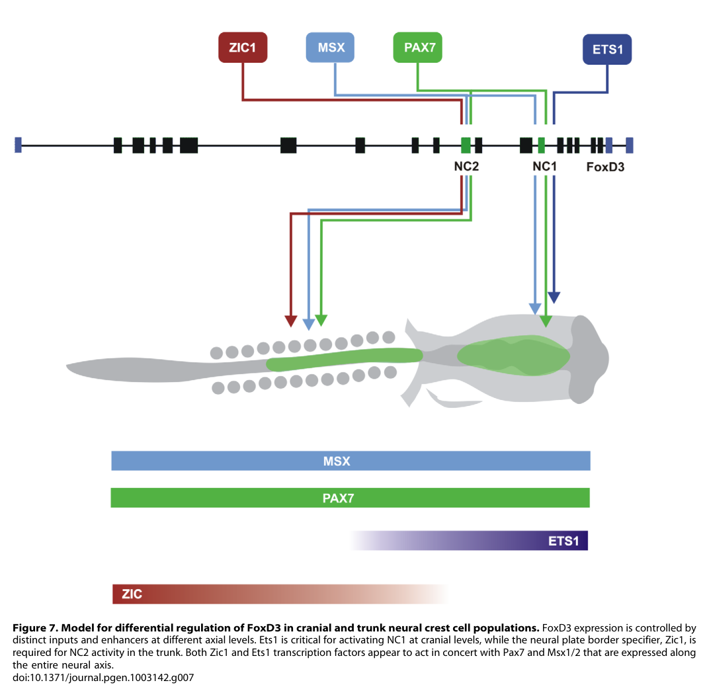

## Question

# Commissioned Review Brief

## Review Topic

Neural crest gene regulatory network module

## Working Scope

The vertebrate neural crest gene regulatory network: the transcriptional program by which signals at the edge of the neural plate are converted, through a neural plate border layer and a crest specifier layer, into migratory multipotent crest cells, of which the cranial population forms skeletogenic ectomesenchyme. A parallel competence layer, shared with pluripotent blastula cells, keeps progenitors undifferentiated. Border specifiers (Gbx2, Msx1, AP-2alpha, Pax3, Zic1) are largely ancestral chordate genes already expressed at the amphioxus neural plate border; most crest specifiers were recruited at the base of vertebrates, mainly by changes in where they are expressed, and some cranial circuit components (Ets1) were added later in jawed vertebrates. Inducing signals (Wnt, BMP, FGF) are covered by the wnt_signaling, bmp_signaling and FGF modules and are treated here as upstream context.

## Provisional Biological Outline

- Neural crest gene regulatory network
  - 1. define the neural plate border competence territory
  - Neural plate border specification
    - Gbx2 border specifier (molecular player: gbx2; activity or role: DNA-binding transcription repressor activity, RNA polymerase II-specific)
    - Msx1 border specifier (molecular player: MSX1; activity or role: DNA-binding transcription factor activity, RNA polymerase II-specific)
    - AP-2alpha border initiator (molecular player: TFAP2A; activity or role: DNA-binding transcription activator activity, RNA polymerase II-specific)
    - Pax3 border specifier (molecular player: pax3-a; activity or role: DNA-binding transcription activator activity, RNA polymerase II-specific)
    - Zic1 border specifier (molecular player: zic1; activity or role: DNA-binding transcription activator activity, RNA polymerase II-specific)
  - 1. keep border and crest progenitors undifferentiated and proliferative
  - Maintenance of border/crest progenitor competence
    - c-Myc competence factor (molecular player: myc-a; activity or role: DNA-binding transcription factor activity, RNA polymerase II-specific)
    - Id3 bHLH inhibitor (molecular player: id3-a; activity or role: transcription regulator inhibitor activity)
    - Hairy2 border repressor (molecular player: hes4-a; activity or role: DNA-binding transcription repressor activity, RNA polymerase II-specific)
  - 2. specify neural crest identity
  - Neural crest fate specification
    - FoxD3 crest specifier (molecular player: foxd3-a; activity or role: DNA-binding transcription repressor activity, RNA polymerase II-specific)
    - Snai2 crest specifier (molecular player: snai2; activity or role: DNA-binding transcription repressor activity, RNA polymerase II-specific)
    - AP-2alpha crest specifier (molecular player: TFAP2A; activity or role: DNA-binding transcription activator activity, RNA polymerase II-specific)
    - Twist1 restraint of Snai2 (molecular player: twist1; activity or role: transcription regulator inhibitor activity)
    - Alternative versions by SoxE paralog / vertebrate lineage: SoxE crest specifier (paralog deployment differs by lineage)
      - Sox8 (first-wave SoxE in frog)
        - Sox8 crest specifier (molecular player: sox8; activity or role: DNA-binding transcription factor activity, RNA polymerase II-specific)
      - Sox9
        - Sox9 crest specifier (molecular player: sox9-a; activity or role: DNA-binding transcription activator activity, RNA polymerase II-specific)
      - Sox10
        - Sox10 crest specifier (molecular player: sox10; activity or role: DNA-binding transcription factor activity, RNA polymerase II-specific)
  - 3. delaminate and migrate
  - Neural crest delamination and migration
    - Ets1 delamination effector (molecular player: ets1-a; activity or role: DNA-binding transcription activator activity, RNA polymerase II-specific)
    - Snai2 migration effector (molecular player: snai2; activity or role: DNA-binding transcription repressor activity, RNA polymerase II-specific)
  - 4. form cranial skeletogenic ectomesenchyme
  - Cranial crest ectomesenchyme and skeletogenesis
    - Twist1 ectomesenchyme driver (molecular player: twist1; activity or role: DNA-binding transcription factor activity, RNA polymerase II-specific)
    - Sox9 crest chondrogenesis (molecular player: sox9-a; activity or role: DNA-binding transcription activator activity, RNA polymerase II-specific)
    - AP-2alpha craniofacial morphogenesis (molecular player: TFAP2A; activity or role: DNA-binding transcription activator activity, RNA polymerase II-specific)

## Known Relationships Among Steps

- Neural plate border specification precedes Neural crest fate specification: Border specifiers are expressed first and are required for crest specifier expression.
- Maintenance of border/crest progenitor competence feeds into Neural crest fate specification: Competence factors keep border progenitors undifferentiated so that specifier inputs can act.
- Neural crest fate specification precedes Neural crest delamination and migration: Specified crest cells delaminate and migrate.
- Neural crest delamination and migration precedes Cranial crest ectomesenchyme and skeletogenesis: Migrating cranial crest populates the pharyngeal arches and forms skeletogenic ectomesenchyme.
- Gbx2 border specifier promotes Pax3 border specifier: Gbx2 acts upstream of Pax3.
- Gbx2 border specifier promotes Msx1 border specifier: Gbx2 acts upstream of Msx1.
- AP-2alpha border initiator promotes Pax3 border specifier: AP-2alpha activates pax3 at the border.
- Msx1 border specifier promotes Pax3 border specifier: Msx1 induces Pax3 cell-autonomously.
- Msx1 border specifier promotes Zic1 border specifier: Msx1 induces ZicR1/Zic cell-autonomously.
- Pax3 border specifier promotes Snai2 crest specifier: Pax3 binds and activates snail2 directly.
- Pax3 border specifier promotes FoxD3 crest specifier: Pax3/Zic1 directly activate foxd3.
- Zic1 border specifier promotes FoxD3 crest specifier: Pax3/Zic1 directly activate foxd3.
- Pax3 border specifier promotes Sox8 crest specifier: Pax3/Zic1 activate sox8 with snail1 and myc.
- Pax3 border specifier promotes Twist1 ectomesenchyme driver: Pax3 activates twist1 directly.
- Twist1 restraint of Snai2 inhibits Snai2 crest specifier: Twist binds Snai2 and reduces its chromatin occupancy.
- Hairy2 border repressor feeds into Id3 bHLH inhibitor: Hairy2 and Id3 act together (with Stat3) to keep progenitors undifferentiated.

## Assignment

Write a rigorous, review-style synthesis suitable for a molecular biology
audience. Treat the topic as a biological system whose boundaries, core
mechanisms, variants, and unresolved points should be made clear to readers who
know the field but are not specialists in this specific process.

The review should be explanatory rather than encyclopedic. Anchor broad claims
in primary literature or authoritative reviews, but keep the focus on how the
system works and how its parts fit together.

## Questions To Address

1. **Scope and boundaries**
   - What exactly is included in this biological system?
   - Which neighboring pathways, organelle processes, complexes, or regulatory
     events are often confused with it but should be treated separately?
   - Are there competing definitions in the literature?

2. **Core mechanism**
   - What is the best current model for the sequence of events?
   - Which steps are obligatory, which are conditional, and which are accessory?
   - What molecular assemblies, enzymes, receptors, adaptors, transporters, or
     structural units carry out each major step?

3. **Variation**
   - How does the system vary across major evolutionary lineages?
   - Are there well-supported differences between cell types, tissues,
     developmental stages, physiological states, or compartments?
   - Where are there alternative routes that achieve a similar outcome by
     different molecular means?

4. **Conservation and origin**
   - What is the deepest plausible evolutionary origin of the system?
   - Which parts appear ancient and conserved, and which appear to be later
     elaborations, replacements, or lineage-specific losses?
   - When a protein family has expanded, which family members are the best
     representatives for understanding the ancestral role?

5. **Physical and biological constraints**
   - What steps must occur in a particular order?
   - Which events are mutually exclusive, compartment-specific, cell-type
     specific, substrate-specific, or stage-specific?
   - What evidence rules out otherwise plausible paths through the system?

6. **Evidence and controversy**
   - Which mechanistic claims are strongly supported by experiments?
   - Where does the literature disagree, rely on indirect evidence, or mix data
     from organisms that may not be comparable?
   - What are the most important open questions?

## Output Format

Use the style and structure of a concise review article:

1. Executive summary
2. Definition and biological boundaries
3. Mechanistic overview
4. Major molecular players and active assemblies
5. Evolutionary and cell-biological variation
6. Constraints, dependencies, and failure modes
7. Controversies and open questions
8. Key references

Include citations for major claims, preferably PMIDs or DOIs. Be explicit about
uncertainty and avoid overgeneralizing from one organism, cell type, or assay
system to all biology.

## Output

Question: You are an expert researcher providing comprehensive, well-cited information.

Provide detailed information focusing on:
1. Key concepts and definitions with current understanding
2. Recent developments and latest research (prioritize 2023-2024 sources)
3. Current applications and real-world implementations
4. Expert opinions and analysis from authoritative sources
5. Relevant statistics and data from recent studies

Format as a comprehensive research report with proper citations. Include URLs and publication dates where available.
Always prioritize recent, authoritative sources and provide specific citations for all major claims.

# Commissioned Review Brief

## Review Topic

Neural crest gene regulatory network module

## Working Scope

The vertebrate neural crest gene regulatory network: the transcriptional program by which signals at the edge of the neural plate are converted, through a neural plate border layer and a crest specifier layer, into migratory multipotent crest cells, of which the cranial population forms skeletogenic ectomesenchyme. A parallel competence layer, shared with pluripotent blastula cells, keeps progenitors undifferentiated. Border specifiers (Gbx2, Msx1, AP-2alpha, Pax3, Zic1) are largely ancestral chordate genes already expressed at the amphioxus neural plate border; most crest specifiers were recruited at the base of vertebrates, mainly by changes in where they are expressed, and some cranial circuit components (Ets1) were added later in jawed vertebrates. Inducing signals (Wnt, BMP, FGF) are covered by the wnt_signaling, bmp_signaling and FGF modules and are treated here as upstream context.

## Provisional Biological Outline

- Neural crest gene regulatory network
  - 1. define the neural plate border competence territory
  - Neural plate border specification
    - Gbx2 border specifier (molecular player: gbx2; activity or role: DNA-binding transcription repressor activity, RNA polymerase II-specific)
    - Msx1 border specifier (molecular player: MSX1; activity or role: DNA-binding transcription factor activity, RNA polymerase II-specific)
    - AP-2alpha border initiator (molecular player: TFAP2A; activity or role: DNA-binding transcription activator activity, RNA polymerase II-specific)
    - Pax3 border specifier (molecular player: pax3-a; activity or role: DNA-binding transcription activator activity, RNA polymerase II-specific)
    - Zic1 border specifier (molecular player: zic1; activity or role: DNA-binding transcription activator activity, RNA polymerase II-specific)
  - 1. keep border and crest progenitors undifferentiated and proliferative
  - Maintenance of border/crest progenitor competence
    - c-Myc competence factor (molecular player: myc-a; activity or role: DNA-binding transcription factor activity, RNA polymerase II-specific)
    - Id3 bHLH inhibitor (molecular player: id3-a; activity or role: transcription regulator inhibitor activity)
    - Hairy2 border repressor (molecular player: hes4-a; activity or role: DNA-binding transcription repressor activity, RNA polymerase II-specific)
  - 2. specify neural crest identity
  - Neural crest fate specification
    - FoxD3 crest specifier (molecular player: foxd3-a; activity or role: DNA-binding transcription repressor activity, RNA polymerase II-specific)
    - Snai2 crest specifier (molecular player: snai2; activity or role: DNA-binding transcription repressor activity, RNA polymerase II-specific)
    - AP-2alpha crest specifier (molecular player: TFAP2A; activity or role: DNA-binding transcription activator activity, RNA polymerase II-specific)
    - Twist1 restraint of Snai2 (molecular player: twist1; activity or role: transcription regulator inhibitor activity)
    - Alternative versions by SoxE paralog / vertebrate lineage: SoxE crest specifier (paralog deployment differs by lineage)
      - Sox8 (first-wave SoxE in frog)
        - Sox8 crest specifier (molecular player: sox8; activity or role: DNA-binding transcription factor activity, RNA polymerase II-specific)
      - Sox9
        - Sox9 crest specifier (molecular player: sox9-a; activity or role: DNA-binding transcription activator activity, RNA polymerase II-specific)
      - Sox10
        - Sox10 crest specifier (molecular player: sox10; activity or role: DNA-binding transcription factor activity, RNA polymerase II-specific)
  - 3. delaminate and migrate
  - Neural crest delamination and migration
    - Ets1 delamination effector (molecular player: ets1-a; activity or role: DNA-binding transcription activator activity, RNA polymerase II-specific)
    - Snai2 migration effector (molecular player: snai2; activity or role: DNA-binding transcription repressor activity, RNA polymerase II-specific)
  - 4. form cranial skeletogenic ectomesenchyme
  - Cranial crest ectomesenchyme and skeletogenesis
    - Twist1 ectomesenchyme driver (molecular player: twist1; activity or role: DNA-binding transcription factor activity, RNA polymerase II-specific)
    - Sox9 crest chondrogenesis (molecular player: sox9-a; activity or role: DNA-binding transcription activator activity, RNA polymerase II-specific)
    - AP-2alpha craniofacial morphogenesis (molecular player: TFAP2A; activity or role: DNA-binding transcription activator activity, RNA polymerase II-specific)

## Known Relationships Among Steps

- Neural plate border specification precedes Neural crest fate specification: Border specifiers are expressed first and are required for crest specifier expression.
- Maintenance of border/crest progenitor competence feeds into Neural crest fate specification: Competence factors keep border progenitors undifferentiated so that specifier inputs can act.
- Neural crest fate specification precedes Neural crest delamination and migration: Specified crest cells delaminate and migrate.
- Neural crest delamination and migration precedes Cranial crest ectomesenchyme and skeletogenesis: Migrating cranial crest populates the pharyngeal arches and forms skeletogenic ectomesenchyme.
- Gbx2 border specifier promotes Pax3 border specifier: Gbx2 acts upstream of Pax3.
- Gbx2 border specifier promotes Msx1 border specifier: Gbx2 acts upstream of Msx1.
- AP-2alpha border initiator promotes Pax3 border specifier: AP-2alpha activates pax3 at the border.
- Msx1 border specifier promotes Pax3 border specifier: Msx1 induces Pax3 cell-autonomously.
- Msx1 border specifier promotes Zic1 border specifier: Msx1 induces ZicR1/Zic cell-autonomously.
- Pax3 border specifier promotes Snai2 crest specifier: Pax3 binds and activates snail2 directly.
- Pax3 border specifier promotes FoxD3 crest specifier: Pax3/Zic1 directly activate foxd3.
- Zic1 border specifier promotes FoxD3 crest specifier: Pax3/Zic1 directly activate foxd3.
- Pax3 border specifier promotes Sox8 crest specifier: Pax3/Zic1 activate sox8 with snail1 and myc.
- Pax3 border specifier promotes Twist1 ectomesenchyme driver: Pax3 activates twist1 directly.
- Twist1 restraint of Snai2 inhibits Snai2 crest specifier: Twist binds Snai2 and reduces its chromatin occupancy.
- Hairy2 border repressor feeds into Id3 bHLH inhibitor: Hairy2 and Id3 act together (with Stat3) to keep progenitors undifferentiated.

## Assignment

Write a rigorous, review-style synthesis suitable for a molecular biology
audience. Treat the topic as a biological system whose boundaries, core
mechanisms, variants, and unresolved points should be made clear to readers who
know the field but are not specialists in this specific process.

The review should be explanatory rather than encyclopedic. Anchor broad claims
in primary literature or authoritative reviews, but keep the focus on how the
system works and how its parts fit together.

## Questions To Address

1. **Scope and boundaries**
   - What exactly is included in this biological system?
   - Which neighboring pathways, organelle processes, complexes, or regulatory
     events are often confused with it but should be treated separately?
   - Are there competing definitions in the literature?

2. **Core mechanism**
   - What is the best current model for the sequence of events?
   - Which steps are obligatory, which are conditional, and which are accessory?
   - What molecular assemblies, enzymes, receptors, adaptors, transporters, or
     structural units carry out each major step?

3. **Variation**
   - How does the system vary across major evolutionary lineages?
   - Are there well-supported differences between cell types, tissues,
     developmental stages, physiological states, or compartments?
   - Where are there alternative routes that achieve a similar outcome by
     different molecular means?

4. **Conservation and origin**
   - What is the deepest plausible evolutionary origin of the system?
   - Which parts appear ancient and conserved, and which appear to be later
     elaborations, replacements, or lineage-specific losses?
   - When a protein family has expanded, which family members are the best
     representatives for understanding the ancestral role?

5. **Physical and biological constraints**
   - What steps must occur in a particular order?
   - Which events are mutually exclusive, compartment-specific, cell-type
     specific, substrate-specific, or stage-specific?
   - What evidence rules out otherwise plausible paths through the system?

6. **Evidence and controversy**
   - Which mechanistic claims are strongly supported by experiments?
   - Where does the literature disagree, rely on indirect evidence, or mix data
     from organisms that may not be comparable?
   - What are the most important open questions?

## Output Format

Use the style and structure of a concise review article:

1. Executive summary
2. Definition and biological boundaries
3. Mechanistic overview
4. Major molecular players and active assemblies
5. Evolutionary and cell-biological variation
6. Constraints, dependencies, and failure modes
7. Controversies and open questions
8. Key references

Include citations for major claims, preferably PMIDs or DOIs. Be explicit about
uncertainty and avoid overgeneralizing from one organism, cell type, or assay
system to all biology.

# Neural crest gene regulatory network: a stage- and region-dependent review

## 1. Executive summary

The neural crest gene regulatory network (NC-GRN) is a set of **developmental transcriptional circuits**, not a single protein complex or invariant sequence of gene activations. At the vertebrate neural plate border, broadly deployed transcription factors establish a territory capable of producing several ectodermal lineages. Overlapping competence and crest-specification programs then enable some border cells to acquire neural crest identity; subsequent regulatory changes permit delamination, migration and lineage differentiation. Cranial crest can additionally acquire skeletogenic ectomesenchymal identity. The strongest mechanistic evidence comes from perturbation and cis-regulatory experiments in *Xenopus* and chick; single-cell studies show that the corresponding cell states emerge gradually rather than as sharply separated compartments. (plouhinec2014pax3andzic1 pages 1-2, simoescosta2012dynamicanddifferential pages 1-2, williams2022singlecellatlasof pages 1-2)

Two refinements are essential. First, **border specification is not itself crest specification**: amphioxus has much of the border program but lacks the vertebrate deployment of most crest-specifier genes at that border. Second, there is no universally obligatory *PAX3 → SNAI2 → SOX8 → ETS1* chain: paralogue choice, enhancer use, axial position and timing differ among vertebrates. (yu2008insightsfromthe pages 3-4, york2024sharedfeaturesof pages 4-6, schock2020sortingsoxdiverse pages 4-5)

## 2. Definition and biological boundaries

Here, the NC-GRN includes the regulatory transition from a competent neural/non-neural ectodermal boundary through premigratory and migratory crest to, specifically, the cranial ectomesenchymal program. Its components include sequence-specific transcription factors, their partner-dependent assemblies, cis-regulatory elements and chromatin-regulatory inputs. **WNT, BMP and FGF signaling are upstream inputs**, not interchangeable with the transcriptional network they induce; cadherin turnover, cytoskeletal mechanics and extracellular guidance execute aspects of delamination and migration but are not themselves the entire NC-GRN. Placodes arise from neighboring border ectoderm and have a related but distinct specification network. Likewise, craniofacial patterning after crest reaches the arches depends on signals from other tissues; the resulting skeleton should not be attributed exclusively to an autonomous crest transcriptional program. (thawani2020buildingtheborder pages 9-10, williams2022singlecellatlasof pages 1-2, seto2024invitroinduction pages 1-2, kessler2023amultiplesuperenhancer pages 1-2)

There are two useful, partly competing usages of “neural crest specification.” The **classical hierarchical usage** distinguishes border specifiers, crest specifiers and migration/differentiation effectors. A **cell-state usage** emphasizes heterogeneous border progenitors and gradual allocation to crest or placodal trajectories. Chick single-cell data place detectable lineage segregation at early neurulation, not at gastrulation, and show that *Pax7*-expressing border cells are not exclusively crest-fated. The hierarchy is therefore a useful description of regulatory dependencies, not proof that every cell passes through identical, discrete states. (plouhinec2014pax3andzic1 pages 1-2, williams2022singlecellatlasof pages 1-2)

## 3. Mechanistic overview

**Border establishment.** AP-2α/TFAP2A, MSX1, PAX3/7, ZIC factors and GBX2 participate in overlapping border circuits. In *Xenopus*, Gbx2 is positioned upstream of *msx1* and *pax3* by epistasis, **not** by demonstrated direct binding to both loci. Msx1 induces *pax3* and *ZicR1* cell-autonomously; Pax3 with Zic activity supports subsequent crest-marker induction. A stronger direct edge is AP-2α → *pax3*: inducible AP-2α acts without new protein synthesis, and promoter-reporter, electrophoretic mobility-shift and antibody-supershift experiments support binding to *pax3* regulatory DNA. Border factors subsequently reinforce one another rather than forming a strictly one-way chain. (betancur2010cisregulatoryanalysisof pages 27-31, monsoroburq2005msx1andpax3 pages 1-2, croze2011reiterativeap2aactivity pages 2-3)

**Competence alongside specification.** The *Xenopus* MYC–ID3 module maintains progenitor potential: Id3 depletion eliminates crest, whereas sustained Id3 prolongs progenitor-marker expression and blocks differentiation. This does **not** mean Id3 simply accelerates proliferation. HAIRY2 also has a physical signaling-interface role: it promotes assembly of a membrane-associated FGFR4–STAT3 complex and STAT3 Tyr705 phosphorylation; ID3 antagonizes this assembly. In the experimentally studied frog circuit, higher STAT3 activity favors an undifferentiated state, whereas appropriately lowered activity permits proliferation and differentiation. These are overlapping, dynamically balanced activities, not a required interval in which all progenitors must stop dividing. (light2005xenopusid3is pages 1-2, nichane2010self‐regulationofstat3 pages 1-2, nichane2010self‐regulationofstat3 pages 5-6)

**Crest identity.** In frog, combined PAX3/ZIC1 activity elicits *snai1/2, foxd3, twist1* and *tfap2b*. A translation-blockade screen identified **25 immediate-response candidates** within an expanded border/crest transcriptional signature. Calling these “direct targets” in that assay means their induction does not require newly synthesized intermediary proteins; direct binding at a particular enhancer requires separate occupancy and functional-site evidence. Chick *FOXD3* supplies such evidence for spatially distinct inputs: its **NC1 enhancer** initiates cranial expression with PAX7, MSX1/2 and ETS1 inputs; **NC2** initiates vagal/trunk expression with PAX7, MSX1/2 and directly bound ZIC1, and becomes active later in migrating cranial cells. The experimentally derived regional enhancer model is shown in the source figure. (plouhinec2014pax3andzic1 pages 1-2, simoescosta2012dynamicanddifferential pages 1-2, simoescosta2012dynamicanddifferential media 226fd0b2)

**Delamination and differentiation.** Specified cells must subsequently change adhesion and motility, but specification need not immediately produce a fully mesenchymal cell. Mouse single-cell and spatial studies identify intermediate cranial-crest EMT states and delamination associated with either **S phase or G2/M**, with a functional contribution from *Dlc1*. A cranial subset then enters ectomesenchymal programs involving TWIST1 and, for cartilage, SOX9. TWIST’s physical interaction with SNAI2 can *reduce SNAI2 recruitment to chromatin*, while TWIST activity later supports cranial mesenchymal outcomes: these observations are compatible when stage, molecular target and cell context are kept distinct. (zhao2024identificationandcharacterization pages 1-2, lander2013interactionsbetweentwist pages 4-4, fan2021twist1andchromatin pages 1-2)

The following table separates the major states and the strength and limits of their supporting evidence.

| Developmental state | Primary molecular regulators or assemblies | Best-supported concrete evidence | Model/context limits |
|---|---|---|---|
| **Ancestral neural border** | **AP-2, Msx, Pax3/7 and Zic**; vertebrates add **Gbx2** and stage-specific TFAP2 assemblies. In chick, pioneer-factor pairing changes from **TFAP2A–TFAP2C** at border induction to **TFAP2A–TFAP2B** during crest specification. | Amphioxus deploys AP-2, Msx, Pax3/7 and Zic around the neural–non-neural boundary, whereas most vertebrate crest specifiers are absent there; an amphioxus *FoxD* element drives chick mesodermal but not crest expression, supporting later cis-regulatory recruitment (yu2008insightsfromthe pages 3-4, yu2008insightsfromthe pages 1-2). In *Xenopus*, AP2α directly activates *pax3*: translation blockade, a 0.5-kb promoter reporter, AP2-site mutation and EMSA/supershift support direct binding (croze2011reiterativeap2aactivity pages 2-3). Chick CUT&RUN/ATAC-seq, co-IP and proximity ligation support the TFAP2 partner switch; TFAP2A/C occupies 5,863/7,021 TFAP2A peaks at HH6, whereas TFAP2A/B occupies 12,762/18,009 at HH9 (rothstein2020heterodimerizationoftfap2 pages 7-9, rothstein2020heterodimerizationoftfap2 pages 5-7). | Homologue presence is not equivalent to conserved deployment: amphioxus supports an ancestral **border**, not bona fide migratory neural crest, and the data do not establish amphioxus *Gbx2* specifically. TFAP2 partner switching is best demonstrated in chick and should not be assumed universal. |
| **Border/crest progenitor competence** | **Myc–Id3** progenitor module; **Hairy2–FGFR4–STAT3** complex opposed by Id3; repurposed pluripotency factors, including **OCT4–SOX2–TFAP2A**. | In *Xenopus*, Id3 loss eliminates crest, whereas sustained Id3 prolongs progenitor markers and blocks differentiation, placing Id3 functionally downstream of Myc (light2005xenopusid3is pages 1-2). Hairy2 physically promotes an FGFR4–STAT3 complex and STAT3 Tyr705 phosphorylation; Id3 antagonizes complex formation. High STAT3 preserves an undifferentiated state, whereas lower activity favours proliferation and differentiation (nichane2010self‐regulationofstat3 pages 1-2, nichane2010self‐regulationofstat3 pages 5-6). In human/chick systems, OCT4–SOX2 is redirected from NANOG toward TFAP2A-bound crest enhancers; TFAP2A depletion reduces SOX2 occupancy, whereas persistent OCT4/SOX2 preserves accessibility at approximately 700 peaks (hovland2022pluripotencyfactorsare pages 7-9). Lamprey–frog comparisons reveal shared blastula/crest factors, with transcript correlations of *r*=0.60 at blastula but only *r*=0.28–0.29 in neurula crest (york2024sharedfeaturesof pages 3-4). | “Competence” means delayed differentiation and maintained responsiveness, not unrestricted pluripotency. Lamprey animal-pole cells have not been proven functionally pluripotent, and Myc–Id3/Hairy2–STAT3 circuitry is characterized chiefly in frog. Persistent pluripotency-factor activity can become inhibitory if not developmentally redirected. |
| **Neural crest identity** | Frog **Pax3–Zic1** feed-forward module activating *snai1/2, foxd3, twist1* and *tfap2b*; **FOXD3, SNAI1/2**, TFAP2 factors and lineage-variable **SOX8/SOX9/SOX10**. Chick *FoxD3* uses cranial **NC1: Pax7–Msx1/2–ETS1** versus vagal/trunk **NC2: Pax7–Msx1/2–Zic1**. | *Xenopus* translation-blockade experiments identified 25 Pax3/Zic1-responsive “direct” targets, including *snail1/2, foxd3, twist1* and *tfap2b*; this establishes immediate transcriptional dependence but not, by itself, physical DNA occupancy (plouhinec2014pax3andzic1 pages 1-2). By contrast, chick *FoxD3* NC1/NC2 enhancer mutation, in-vivo ChIP and knockdown directly resolve cranial ETS1 and trunk Zic1 inputs (simoescosta2012dynamicanddifferential pages 1-2, simoescosta2012dynamicanddifferential media 226fd0b2). SoxE deployment varies: Sox8 precedes Sox9/10 in frog; chick and mouse initiate Sox9 first; zebrafish do not deploy Sox8 in crest. Any SoxE can rescue early frog Sox8 loss, but Sox8 cannot replace later mouse Sox10 enteric and melanocyte functions (schock2020sortingsoxdiverse pages 4-5). | There is no universal “crest-specifier cassette.” Pax3/Zic1 results are primarily frog data; chick often uses Pax7. “Direct” must distinguish translation-independent induction from demonstrated enhancer occupancy. SoxE paralogue order, redundancy and derivative-specific functions differ markedly among vertebrates. |
| **EMT, delamination and migration** | **SNAI1/2, ETS1, SOX9/10** and **FOXD3**; cadherin and extracellular-matrix effectors; metabolism–chromatin coupling through **LDHA/B → histone lactylation**, supported by **SOX9–YAP/TEAD**; cell-cycle-associated intermediate states. | TWIST binds SNAI1/2 directly through its WR domain and diminishes SNAI2 recruitment to chromatin; GSK3-dependent WR-domain phosphorylation regulates this inhibitory interaction (lander2013interactionsbetweentwist pages 1-2, lander2013interactionsbetweentwist pages 4-4). In mouse cranial crest, single-cell and spatial analyses identify intermediate EMT states and at least two delamination routes, occurring in S phase or G2/M; *Dlc1* perturbation impairs delamination and migration (zhao2024identificationandcharacterization pages 1-2). LDHA/B depletion lowers enhancer lactylation, crest-gene expression and migration; SOX9/YAP1 occupancy overlaps lactylated enhancers, although occupancy–lactylation associations are not all demonstrably causal (merkuri2024histonelactylationcouples pages 9-10, merkuri2024histonelactylationcouples pages 1-2). | Delamination is not a binary EMT and is not necessarily fate-restricted. ETS1 is a strong cranial regulator in chick but is not a universal vertebrate delamination factor. SNAI paralogue use and cadherin targets vary by species and axial level. TWIST–SNAI2 restraint coexists with TWIST’s later pro-mesenchymal functions, making timing decisive. |
| **Cranial ectomesenchyme and skeletogenesis** | **TWIST1** with chromatin regulators **CHD7, CHD8 and WHSC1**; DNA-guided **TWIST1–homeodomain** Coordinator complexes; **SOX9** chondrogenic program; TFAP2 factors and cranial **SOX8–TFAP2B–ETS1** subcircuit. | TWIST1 BioID identified CHD7/CHD8/WHSC1; combinatorial perturbation in cell models and mouse embryos disrupted crest differentiation and craniofacial patterning, supporting a cooperative chromatin-regulatory module (fan2021twist1andchromatin pages 1-2). A 17-bp Coordinator motif mediates TWIST1–homeodomain cooperation: TWIST1 is required for accessibility and homeodomain-factor binding, whereas homeodomain factors stabilize and redistribute TWIST1 occupancy (kim2024dnaguidedtranscriptionfactor pages 1-3). TWIST perturbation alters branchial-arch SOX9 and cartilage, with phosphomutants shifting glial versus chondrogenic outputs (lander2013interactionsbetweentwist pages 4-4, lander2013interactionsbetweentwist pages 5-7). Ectopic Sox8, Tfap2b and Ets1 together reprogram chick trunk crest toward cranial identity and ectopic cartilage, showing conditional rather than absolute axial restriction (martik2017regulatorylogicunderlying pages 4-6). | Craniofacial skeleton is not exclusively crest-derived: cranial mesoderm contributes regionally, and pharyngeal ectoderm/endoderm provide essential patterning signals. SOX9 is necessary for chondrogenesis but does not alone encode skeletal position. TWIST1 also acts in cranial mesoderm; lineage-restricted perturbation is required to assign crest-autonomous effects. |

*Table: A stage-resolved comparison of the ancestral border, competence, specification, migration and cranial ectomesenchyme modules. The table distinguishes direct molecular evidence from induced expression and highlights species-, axial-level- and paralogue-specific limits.*

## 4. Major molecular players and active assemblies

**TFAP2 partner exchange.** In chick, the pioneer transcription factor TFAP2A occupies different enhancer repertoires with **TFAP2C during border induction** and **TFAP2B during crest specification**. At HH6, TFAP2C co-occupied **5,863 of 7,021** assayed TFAP2A peaks; at HH9, TFAP2B co-occupied **12,762 of 18,009**. Co-immunoprecipitation and proximity-ligation experiments support protein association and its developmental change; knockdowns and occupancy measurements support distinct functions. TFAP2B-mediated repression of *TFAP2C* offers a mechanism that stabilizes the later assembly. This is a chick-supported enhancer-selection mechanism, not evidence that TFAP2A alone irreversibly commits every vertebrate border cell. (rothstein2020heterodimerizationoftfap2 pages 7-9, rothstein2020heterodimerizationoftfap2 pages 5-7, rothstein2020heterodimerizationoftfap2 pages 10-11)

**Crest and cranial enhancer complexes.** FOXD3, SNAI factors and SOXE factors are recurring crest regulators, but their binding partners and targets change across stages. In cranial mesenchyme, TWIST1 associates with chromatin regulators **CHD7, CHD8 and WHSC1**; combined perturbations disrupt crest differentiation and craniofacial patterning in experimental models. A distinct **17-base-pair Coordinator** sequence organizes DNA-dependent cooperation between TWIST1 and regional homeodomain transcription factors: TWIST1 helps establish accessibility and homeodomain-factor binding, while those factors stabilize and redistribute TWIST1 binding. These are functionally supported regulatory assemblies, not a single constitutive “crest complex.” (fan2021twist1andchromatin pages 1-2, kim2024dnaguidedtranscriptionfactor pages 1-3)

**Chromatin and metabolic inputs.** TFAP2 proteins can act as pioneer factors; pluripotency-associated OCT4/SOX2 can also be repurposed at TFAP2A-associated crest enhancers rather than simply maintaining a blastula state. In one experimental setting, prolonged OCT4/SOX2 expression preserved accessibility at approximately **700 genomic peaks**. A 2024 study connected glycolytic **LDHA/B** activity to histone lactylation at crest regulatory regions: LDHA/B perturbation reduced crest-gene expression and migration, while SOX9 and YAP/TEAD were implicated in enhancer-associated lactylation. Lactylation and transcription-factor occupancy correlate at many loci, but that does not demonstrate the biochemical deposition mechanism at every enhancer. (hovland2022pluripotencyfactorsare pages 7-9, rothstein2020heterodimerizationoftfap2 pages 1-2, merkuri2024histonelactylationcouples pages 9-10, merkuri2024histonelactylationcouples pages 1-2)

## 5. Evolutionary and cell-biological variation

**Origin: old border, newly assembled crest program.** Amphioxus deploys homologues of AP-2, MSX, PAX3/7 and ZIC around the neural/non-neural interface; BMP perturbation changes their expression. It also possesses many genes homologous to vertebrate crest genes. Nevertheless, most tested crest specifiers are **not deployed as a coordinated border program**, and an amphioxus *FoxD* regulatory fragment reproduces chick mesodermal, but not crest, expression. This supports recruitment through changes in gene regulation rather than de novo invention of all relevant proteins. The evidence supports an ancient chordate **border** and a vertebrate **crest assembly**; it does not establish an amphioxus migratory crest or specifically verify that every named vertebrate border gene—including *Gbx2*—has the same amphioxus border deployment. (yu2008insightsfromthe pages 3-4, yu2008insightsfromthe pages 2-3, yu2008insightsfromthe pages 1-2)

**Jawless and jawed vertebrates.** Lamprey and frog share blastula-associated and crest-associated transcriptional features, supporting substantial assembly of the crest program near the vertebrate base. Their transcript-abundance correlations were **r = 0.60** at blastula but **r = 0.28–0.29** at sampled neurula-crest stages, indicating both shared features and divergence. *Twist1*, *ets1* and *snai2* show frog-specific or altered developmental dynamics in this comparison; this supports later rewiring but, by itself, does not date each gene’s first crest function precisely to the origin of jawed vertebrates. Lamprey animal-pole transcriptional similarity also does not establish functional pluripotency. (york2024sharedfeaturesof pages 3-4, york2024sharedfeaturesof pages 1-3, york2024sharedfeaturesof pages 4-6)

**Paralogue and axial alternatives.** SOX8 is expressed before SOX9/10 in frog crest, whereas chick and mouse initiate SOX9 first; zebrafish do not deploy *sox8* in crest. Early frog Sox8 loss is rescuable with other SoxE factors, but mouse Sox8 cannot replace all later Sox10-dependent enteric and melanocyte functions. SOXE is therefore the appropriate family-level comparison for early crest function; a universal SOX8-specific first step is not. Cranial versus vagal/trunk *FOXD3* enhancers provide a second alternative route to a similar gene-expression outcome. Furthermore, chick trunk crest can be redirected toward cranial-like cartilage-producing behavior by experimentally providing **SOX8, TFAP2B and ETS1**: normal axial restrictions reflect circuitry and environment, not an absolute absence of latent competence. (schock2020sortingsoxdiverse pages 4-5, simoescosta2012dynamicanddifferential pages 1-2, martik2017regulatorylogicunderlying pages 4-6)

## 6. Constraints, dependencies and failure modes

The **logical order** is establishment of border competence before induction of a stable crest program, and acquisition of an emigration-capable state before normal dispersal to cranial destinations. But border factors and competence factors overlap in time; individual EMT and cell-cycle trajectories are not unique. Sustaining ID3 past its normal window prevents differentiation, illustrating that a factor required to produce progenitors can become inhibitory to their descendants. Similarly, a PAX7-positive border cell is not automatically committed crest, and an expression change following overexpression is not proof of direct enhancer binding. (monsoroburq2005msx1andpax3 pages 1-2, light2005xenopusid3is pages 1-2, williams2022singlecellatlasof pages 1-2, zhao2024identificationandcharacterization pages 1-2, bae2014identificationofpax3 pages 3-4)

Regional enhancers constrain plausible wiring: the chick early cranial *FOXD3* input is not simply interchangeable with its early vagal/trunk input. A TWIST1–SNAI2 interaction can restrain SNAI2 chromatin recruitment even though TWIST1 promotes some later mesenchymal outputs; thus a permanently activating or permanently inhibiting “TWIST → SNAI2” arrow misstates the mechanism. Finally, because TWIST1 also acts in cranial mesoderm, craniofacial phenotypes after an unrestricted perturbation cannot automatically be assigned to crest-autonomous action. (simoescosta2012dynamicanddifferential pages 1-2, simoescosta2012dynamicanddifferential media 226fd0b2, lander2013interactionsbetweentwist pages 4-4, lander2013interactionsbetweentwist pages 2-4)

## 7. Controversies, recent developments and open questions

**State versus lineage.** Whether border progenitors are individually multipotent, mixed-identity cells, or a shifting mixture of more restricted precursors remains incompletely resolved by transcriptomes and inferred trajectories. Chick single-cell work establishes gradual molecular segregation but does not by itself establish each cell’s complete fate repertoire. Direct lineage tracing combined with timed perturbation remains necessary. (williams2022singlecellatlasof pages 1-2)

**What constitutes conservation?** Amphioxus gene homology, lamprey–frog expression similarity and a heterologous enhancer assay measure different properties. They cannot alone prove identical cellular functions, enhancer wiring or full pluripotency. The identity and timing of lineage-specific regulatory recruitment—particularly cranial skeletogenic competence—remain important comparative questions. (yu2008insightsfromthe pages 3-4, york2024sharedfeaturesof pages 6-7, york2024sharedfeaturesof pages 3-4, york2024sharedfeaturesof pages 4-6)

**Recent molecular and practical advances.** A **2023** mouse study identified **2,232 putative cranial-crest super-enhancers**; deletion of the HIRE1/HIRE2 regulatory region demonstrated pharyngeal-arch-specific long-range control of *Hoxa2*, including ear malformations in a dosage-sensitive setting. A **2024** human craniofacial atlas reported temporal profiles for approximately **14,000 enhancers**: **56%** shared chromatin accessibility with mouse, and **28 of 60** tested human candidates showed transgenic mouse reporter activity. These resources help prioritize noncoding variants but are not counts of enhancers specific solely to premigratory crest. Separately, **2024** human pluripotent-cell aggregates generated neural-plate-border-like and cranial-crest-like states followed by maxillary-arch-like mesenchyme; EDN1/BMP4 exposure produced mandibular-like identity, and timed exposure yielded separated arch-marker domains. This is an experimental model for testing patterning, not an established clinical reconstruction of a human face. (kessler2023amultiplesuperenhancer pages 1-2, rajderkar2024dynamicenhancerlandscapes pages 1-2, seto2024invitroinduction pages 1-2)

The central unresolved mechanistic task is to connect **time-resolved enhancer occupancy, chromatin and metabolic state, protein interactions, and prospective lineage fate in the same cells**, while testing whether a regulatory edge demonstrated in frog, chick or cultured human cells actually operates at the corresponding stage in another vertebrate. (rothstein2020heterodimerizationoftfap2 pages 7-9, merkuri2024histonelactylationcouples pages 9-10, williams2022singlecellatlasof pages 1-2)

## 8. Key references

- Yu *et al.* **2008**. Amphioxus genome and evolutionary assembly of the NC-GRN. *Genome Research*. https://doi.org/10.1101/gr.076208.108 (yu2008insightsfromthe pages 1-2)
- Monsoro-Burq *et al.* **2005**. MSX1–PAX3 cooperation in *Xenopus*. *Developmental Cell*. https://doi.org/10.1016/j.devcel.2004.12.017 (monsoroburq2005msx1andpax3 pages 1-2)
- de Crozé *et al.* **2011**. Reiterative AP-2α activity and direct *pax3* regulation. *PNAS*. https://doi.org/10.1073/pnas.1010740107 (croze2011reiterativeap2aactivity pages 2-3)
- Simões-Costa *et al.* **2012**. Region-specific *FOXD3* enhancers. *PLoS Genetics*. https://doi.org/10.1371/journal.pgen.1003142 (simoescosta2012dynamicanddifferential pages 1-2, simoescosta2012dynamicanddifferential media 226fd0b2)
- Plouhinec *et al.* **2014**. PAX3/ZIC1-responsive early crest network. *Developmental Biology*. https://doi.org/10.1016/j.ydbio.2013.12.010 (plouhinec2014pax3andzic1 pages 1-2)
- Rothstein and Simões-Costa **2020**. TFAP2 dimer exchange and enhancer remodeling. *Genome Research*. https://doi.org/10.1101/gr.249680.119 (rothstein2020heterodimerizationoftfap2 pages 7-9, rothstein2020heterodimerizationoftfap2 pages 5-7)
- Williams *et al.* **2022**. Single-cell analysis of gradual chick border-lineage segregation. *eLife*. https://doi.org/10.7554/elife.74464 (williams2022singlecellatlasof pages 1-2)
- Kessler *et al.* **2023**. Cranial-crest *Hoxa* super-enhancers. *Nature Communications*. https://doi.org/10.1038/s41467-023-38953-0 (kessler2023amultiplesuperenhancer pages 1-2)
- York *et al.* **2024**. Shared blastula and crest programs in frog and lamprey. *Nature Ecology & Evolution*. https://doi.org/10.1038/s41559-024-02476-8 (york2024sharedfeaturesof pages 3-4, york2024sharedfeaturesof pages 1-3)
- Merkuri *et al.* **2024**. Glycolysis-linked histone lactylation in crest development. *Nature Communications*. https://doi.org/10.1038/s41467-023-44121-1 (merkuri2024histonelactylationcouples pages 9-10, merkuri2024histonelactylationcouples pages 1-2)
- Kim *et al.* **2024**. DNA-guided TWIST1 cooperation in facial mesenchyme. *Cell*. https://doi.org/10.1016/j.cell.2023.12.032 (kim2024dnaguidedtranscriptionfactor pages 1-3)
- Rajderkar *et al.* **2024**. Human craniofacial enhancer atlas. *Nature Communications*. https://doi.org/10.1038/s41467-024-46396-4 (rajderkar2024dynamicenhancerlandscapes pages 1-2)
- Seto *et al.* **2024**. Human branchial-arch-like aggregates. *Nature Communications*. https://doi.org/10.1038/s41467-024-45285-0 (seto2024invitroinduction pages 1-2)

References

1. (plouhinec2014pax3andzic1 pages 1-2): Jean-Louis Plouhinec, Daniel D. Roche, Caterina Pegoraro, Ana Leonor Figueiredo, Frédérique Maczkowiak, Lisa J. Brunet, Cécile Milet, Jean-Philippe Vert, Nicolas Pollet, Richard M. Harland, and Anne H. Monsoro-Burq. Pax3 and zic1 trigger the early neural crest gene regulatory network by the direct activation of multiple key neural crest specifiers. Developmental biology, 386 2:461-72, Feb 2014. URL: https://doi.org/10.1016/j.ydbio.2013.12.010, doi:10.1016/j.ydbio.2013.12.010. This article has 150 citations and is from a peer-reviewed journal.

2. (simoescosta2012dynamicanddifferential pages 1-2): Marcos S. Simões-Costa, Sonja J. McKeown, Joanne Tan-Cabugao, Tatjana Sauka-Spengler, and Marianne E. Bronner. Dynamic and differential regulation of stem cell factor foxd3 in the neural crest is encrypted in the genome. PLoS Genetics, 8:e1003142, Dec 2012. URL: https://doi.org/10.1371/journal.pgen.1003142, doi:10.1371/journal.pgen.1003142. This article has 169 citations and is from a domain leading peer-reviewed journal.

3. (williams2022singlecellatlasof pages 1-2): Ruth M Williams, Martyna Lukoseviciute, Tatjana Sauka-Spengler, and Marianne E Bronner. Single-cell atlas of early chick development reveals gradual segregation of neural crest lineage from the neural plate border during neurulation. eLife, Jan 2022. URL: https://doi.org/10.7554/elife.74464, doi:10.7554/elife.74464. This article has 78 citations and is from a domain leading peer-reviewed journal.

4. (yu2008insightsfromthe pages 3-4): Jr-Kai Yu, Daniel Meulemans, Sonja J. McKeown, and Marianne Bronner-Fraser. Insights from the amphioxus genome on the origin of vertebrate neural crest. Genome research, 18 7:1127-32, Jul 2008. URL: https://doi.org/10.1101/gr.076208.108, doi:10.1101/gr.076208.108. This article has 178 citations and is from a highest quality peer-reviewed journal.

5. (york2024sharedfeaturesof pages 4-6): Joshua R. York, Anjali Rao, Paul B. Huber, Elizabeth N. Schock, Andrew Montequin, Sara Rigney, and Carole LaBonne. Shared features of blastula and neural crest stem cells evolved at the base of vertebrates. Nature ecology & evolution, 8:1680-1692, Jul 2024. URL: https://doi.org/10.1038/s41559-024-02476-8, doi:10.1038/s41559-024-02476-8. This article has 15 citations and is from a highest quality peer-reviewed journal.

6. (schock2020sortingsoxdiverse pages 4-5): Elizabeth N. Schock and Carole LaBonne. Sorting sox: diverse roles for sox transcription factors during neural crest and craniofacial development. Frontiers in Physiology, Dec 2020. URL: https://doi.org/10.3389/fphys.2020.606889, doi:10.3389/fphys.2020.606889. This article has 87 citations.

7. (thawani2020buildingtheborder pages 9-10): Ankita Thawani and Andrew K. Groves. Building the border: development of the chordate neural plate border region and its derivatives. Frontiers in Physiology, Dec 2020. URL: https://doi.org/10.3389/fphys.2020.608880, doi:10.3389/fphys.2020.608880. This article has 65 citations.

8. (seto2024invitroinduction pages 1-2): Yusuke Seto, Ryoma Ogihara, Kaori Takizawa, and Mototsugu Eiraku. In vitro induction of patterned branchial arch-like aggregate from human pluripotent stem cells. Nature Communications, Feb 2024. URL: https://doi.org/10.1038/s41467-024-45285-0, doi:10.1038/s41467-024-45285-0. This article has 12 citations and is from a highest quality peer-reviewed journal.

9. (kessler2023amultiplesuperenhancer pages 1-2): Sandra Kessler, Maryline Minoux, Onkar Joshi, Yousra Ben Zouari, Sebastien Ducret, Fiona Ross, Nathalie Vilain, Adwait Salvi, Joachim Wolff, Hubertus Kohler, Michael B. Stadler, and Filippo M. Rijli. A multiple super-enhancer region establishes inter-tad interactions and controls hoxa function in cranial neural crest. Nature Communications, Jun 2023. URL: https://doi.org/10.1038/s41467-023-38953-0, doi:10.1038/s41467-023-38953-0. This article has 38 citations and is from a highest quality peer-reviewed journal.

10. (betancur2010cisregulatoryanalysisof pages 27-31): Paola A. Betancur. Cis-regulatory analysis of the key developmental gene, sox10, in neural crest and ear. ArXiv, 2010. URL: https://doi.org/10.7907/fvx3-es42., doi:10.7907/fvx3-es42. This article has 1 citations.

11. (monsoroburq2005msx1andpax3 pages 1-2): Anne-Hélène Monsoro-Burq, Estee Wang, and Richard Harland. Msx1 and pax3 cooperate to mediate fgf8 and wnt signals during xenopus neural crest induction. Developmental cell, 8 2:167-78, Feb 2005. URL: https://doi.org/10.1016/j.devcel.2004.12.017, doi:10.1016/j.devcel.2004.12.017. This article has 405 citations and is from a highest quality peer-reviewed journal.

12. (croze2011reiterativeap2aactivity pages 2-3): Noémie de Crozé, Frédérique Maczkowiak, and Anne H. Monsoro-Burq. Reiterative ap2a activity controls sequential steps in the neural crest gene regulatory network. Proceedings of the National Academy of Sciences, 108:155-160, Dec 2011. URL: https://doi.org/10.1073/pnas.1010740107, doi:10.1073/pnas.1010740107. This article has 196 citations and is from a highest quality peer-reviewed journal.

13. (light2005xenopusid3is pages 1-2): William Light, Ann E. Vernon, Anna Lasorella, Antonio Iavarone, and Carole LaBonne. Xenopus id3 is required downstream of myc for the formation of multipotent neural crest progenitor cells. Development, 132:1831-1841, Apr 2005. URL: https://doi.org/10.1242/dev.01734, doi:10.1242/dev.01734. This article has 124 citations and is from a domain leading peer-reviewed journal.

14. (nichane2010self‐regulationofstat3 pages 1-2): Massimo Nichane, Xi Ren, and Eric J Bellefroid. Self‐regulation of stat3 activity coordinates cell‐cycle progression and neural crest specification. The EMBO Journal, 29:55-67, Jan 2010. URL: https://doi.org/10.1038/emboj.2009.313, doi:10.1038/emboj.2009.313. This article has 73 citations.

15. (nichane2010self‐regulationofstat3 pages 5-6): Massimo Nichane, Xi Ren, and Eric J Bellefroid. Self‐regulation of stat3 activity coordinates cell‐cycle progression and neural crest specification. The EMBO Journal, 29:55-67, Jan 2010. URL: https://doi.org/10.1038/emboj.2009.313, doi:10.1038/emboj.2009.313. This article has 73 citations.

16. (simoescosta2012dynamicanddifferential media 226fd0b2): Marcos S. Simões-Costa, Sonja J. McKeown, Joanne Tan-Cabugao, Tatjana Sauka-Spengler, and Marianne E. Bronner. Dynamic and differential regulation of stem cell factor foxd3 in the neural crest is encrypted in the genome. PLoS Genetics, 8:e1003142, Dec 2012. URL: https://doi.org/10.1371/journal.pgen.1003142, doi:10.1371/journal.pgen.1003142. This article has 169 citations and is from a domain leading peer-reviewed journal.

17. (zhao2024identificationandcharacterization pages 1-2): Ruonan Zhao, Emma L. Moore, Madelaine M Gogol, Jay R. Unruh, Zulin Yu, Allison Scott, Yan Wang, Naresh Kumar Rajendran, and Paul A. Trainor. Identification and characterization of intermediate states in mammalian neural crest cell epithelial to mesenchymal transition and delamination. Apr 2024. URL: https://doi.org/10.7554/elife.92844.2, doi:10.7554/elife.92844.2.

18. (lander2013interactionsbetweentwist pages 4-4): Rachel Lander, Talia Nasr, Stacy D. Ochoa, Kara Nordin, Maneeshi S. Prasad, and Carole LaBonne. Interactions between twist and other core epithelial–mesenchymal transition factors are controlled by gsk3-mediated phosphorylation. Nature Communications, Feb 2013. URL: https://doi.org/10.1038/ncomms2543, doi:10.1038/ncomms2543. This article has 100 citations and is from a highest quality peer-reviewed journal.

19. (fan2021twist1andchromatin pages 1-2): Xiaochen Fan, Pragathi Masamsetti, V. Sun, Jane Q. J. Engholm-Keller, Kasper Osteil, Pierre Studdert, Joshua Graham, Mark E. Fossat, Nicolas Tam, M. Bronner, Jane Q. J. Sun, Kasper Engholm-Keller, P. Osteil, Joshua B. Studdert, M. Graham, Nicolas Fossat, P. Tam, Chromatin Organization Chromatin Organization Chromatin Orga Organization, G. Patrick, PL Tam, N. Health, Author ORCIDs Xiaochen, and Fan. Twist1 and chromatin regulatory proteins interact to guide neural crest cell differentiation. eLife, Feb 2021. URL: https://doi.org/10.7554/elife.62873, doi:10.7554/elife.62873. This article has 62 citations and is from a domain leading peer-reviewed journal.

20. (yu2008insightsfromthe pages 1-2): Jr-Kai Yu, Daniel Meulemans, Sonja J. McKeown, and Marianne Bronner-Fraser. Insights from the amphioxus genome on the origin of vertebrate neural crest. Genome research, 18 7:1127-32, Jul 2008. URL: https://doi.org/10.1101/gr.076208.108, doi:10.1101/gr.076208.108. This article has 178 citations and is from a highest quality peer-reviewed journal.

21. (rothstein2020heterodimerizationoftfap2 pages 7-9): Megan Rothstein and Marcos Simoes-Costa. Heterodimerization of tfap2 pioneer factors drives epigenomic remodeling during neural crest specification. Genome Research, 30:35-48, Dec 2020. URL: https://doi.org/10.1101/gr.249680.119, doi:10.1101/gr.249680.119. This article has 127 citations and is from a highest quality peer-reviewed journal.

22. (rothstein2020heterodimerizationoftfap2 pages 5-7): Megan Rothstein and Marcos Simoes-Costa. Heterodimerization of tfap2 pioneer factors drives epigenomic remodeling during neural crest specification. Genome Research, 30:35-48, Dec 2020. URL: https://doi.org/10.1101/gr.249680.119, doi:10.1101/gr.249680.119. This article has 127 citations and is from a highest quality peer-reviewed journal.

23. (hovland2022pluripotencyfactorsare pages 7-9): Austin S. Hovland, Debadrita Bhattacharya, Ana Paula Azambuja, Dimitrius Pramio, Jacqueline Copeland, Megan Rothstein, and Marcos Simoes-Costa. Pluripotency factors are repurposed to shape the epigenomic landscape of neural crest cells. Developmental Cell, 57:2257-2272.e5, Oct 2022. URL: https://doi.org/10.1016/j.devcel.2022.09.006, doi:10.1016/j.devcel.2022.09.006. This article has 64 citations and is from a highest quality peer-reviewed journal.

24. (york2024sharedfeaturesof pages 3-4): Joshua R. York, Anjali Rao, Paul B. Huber, Elizabeth N. Schock, Andrew Montequin, Sara Rigney, and Carole LaBonne. Shared features of blastula and neural crest stem cells evolved at the base of vertebrates. Nature ecology & evolution, 8:1680-1692, Jul 2024. URL: https://doi.org/10.1038/s41559-024-02476-8, doi:10.1038/s41559-024-02476-8. This article has 15 citations and is from a highest quality peer-reviewed journal.

25. (lander2013interactionsbetweentwist pages 1-2): Rachel Lander, Talia Nasr, Stacy D. Ochoa, Kara Nordin, Maneeshi S. Prasad, and Carole LaBonne. Interactions between twist and other core epithelial–mesenchymal transition factors are controlled by gsk3-mediated phosphorylation. Nature Communications, Feb 2013. URL: https://doi.org/10.1038/ncomms2543, doi:10.1038/ncomms2543. This article has 100 citations and is from a highest quality peer-reviewed journal.

26. (merkuri2024histonelactylationcouples pages 9-10): Fjodor Merkuri, Megan Rothstein, and Marcos Simoes-Costa. Histone lactylation couples cellular metabolism with developmental gene regulatory networks. Nature Communications, Jan 2024. URL: https://doi.org/10.1038/s41467-023-44121-1, doi:10.1038/s41467-023-44121-1. This article has 185 citations and is from a highest quality peer-reviewed journal.

27. (merkuri2024histonelactylationcouples pages 1-2): Fjodor Merkuri, Megan Rothstein, and Marcos Simoes-Costa. Histone lactylation couples cellular metabolism with developmental gene regulatory networks. Nature Communications, Jan 2024. URL: https://doi.org/10.1038/s41467-023-44121-1, doi:10.1038/s41467-023-44121-1. This article has 185 citations and is from a highest quality peer-reviewed journal.

28. (kim2024dnaguidedtranscriptionfactor pages 1-3): Seungsoo Kim, E. Morgunova, S. Naqvi, Seppe Goovaerts, Maram Bader, Mervenaz Koska, Alexander Popov, Christy Luong, Angela Pogson, T. Swigut, Peter Claes, J. Taipale, and Joanna Wysocka. Dna-guided transcription factor cooperativity shapes face and limb mesenchyme. Cell, 187:692-711.e26, Jan 2024. URL: https://doi.org/10.1016/j.cell.2023.12.032, doi:10.1016/j.cell.2023.12.032. This article has 107 citations and is from a highest quality peer-reviewed journal.

29. (lander2013interactionsbetweentwist pages 5-7): Rachel Lander, Talia Nasr, Stacy D. Ochoa, Kara Nordin, Maneeshi S. Prasad, and Carole LaBonne. Interactions between twist and other core epithelial–mesenchymal transition factors are controlled by gsk3-mediated phosphorylation. Nature Communications, Feb 2013. URL: https://doi.org/10.1038/ncomms2543, doi:10.1038/ncomms2543. This article has 100 citations and is from a highest quality peer-reviewed journal.

30. (martik2017regulatorylogicunderlying pages 4-6): Megan L. Martik and Marianne E. Bronner. Regulatory logic underlying diversification of the neural crest. Trends in genetics : TIG, 33 10:715-727, Oct 2017. URL: https://doi.org/10.1016/j.tig.2017.07.015, doi:10.1016/j.tig.2017.07.015. This article has 252 citations.

31. (rothstein2020heterodimerizationoftfap2 pages 10-11): Megan Rothstein and Marcos Simoes-Costa. Heterodimerization of tfap2 pioneer factors drives epigenomic remodeling during neural crest specification. Genome Research, 30:35-48, Dec 2020. URL: https://doi.org/10.1101/gr.249680.119, doi:10.1101/gr.249680.119. This article has 127 citations and is from a highest quality peer-reviewed journal.

32. (rothstein2020heterodimerizationoftfap2 pages 1-2): Megan Rothstein and Marcos Simoes-Costa. Heterodimerization of tfap2 pioneer factors drives epigenomic remodeling during neural crest specification. Genome Research, 30:35-48, Dec 2020. URL: https://doi.org/10.1101/gr.249680.119, doi:10.1101/gr.249680.119. This article has 127 citations and is from a highest quality peer-reviewed journal.

33. (yu2008insightsfromthe pages 2-3): Jr-Kai Yu, Daniel Meulemans, Sonja J. McKeown, and Marianne Bronner-Fraser. Insights from the amphioxus genome on the origin of vertebrate neural crest. Genome research, 18 7:1127-32, Jul 2008. URL: https://doi.org/10.1101/gr.076208.108, doi:10.1101/gr.076208.108. This article has 178 citations and is from a highest quality peer-reviewed journal.

34. (york2024sharedfeaturesof pages 1-3): Joshua R. York, Anjali Rao, Paul B. Huber, Elizabeth N. Schock, Andrew Montequin, Sara Rigney, and Carole LaBonne. Shared features of blastula and neural crest stem cells evolved at the base of vertebrates. Nature ecology & evolution, 8:1680-1692, Jul 2024. URL: https://doi.org/10.1038/s41559-024-02476-8, doi:10.1038/s41559-024-02476-8. This article has 15 citations and is from a highest quality peer-reviewed journal.

35. (bae2014identificationofpax3 pages 3-4): Chang-Joon Bae, Byung-Yong Park, Young-Hoon Lee, John W. Tobias, Chang-Soo Hong, and Jean-Pierre Saint-Jeannet. Identification of pax3 and zic1 targets in the developing neural crest. Developmental biology, 386 2:473-83, Feb 2014. URL: https://doi.org/10.1016/j.ydbio.2013.12.011, doi:10.1016/j.ydbio.2013.12.011. This article has 65 citations and is from a peer-reviewed journal.

36. (lander2013interactionsbetweentwist pages 2-4): Rachel Lander, Talia Nasr, Stacy D. Ochoa, Kara Nordin, Maneeshi S. Prasad, and Carole LaBonne. Interactions between twist and other core epithelial–mesenchymal transition factors are controlled by gsk3-mediated phosphorylation. Nature Communications, Feb 2013. URL: https://doi.org/10.1038/ncomms2543, doi:10.1038/ncomms2543. This article has 100 citations and is from a highest quality peer-reviewed journal.

37. (york2024sharedfeaturesof pages 6-7): Joshua R. York, Anjali Rao, Paul B. Huber, Elizabeth N. Schock, Andrew Montequin, Sara Rigney, and Carole LaBonne. Shared features of blastula and neural crest stem cells evolved at the base of vertebrates. Nature ecology & evolution, 8:1680-1692, Jul 2024. URL: https://doi.org/10.1038/s41559-024-02476-8, doi:10.1038/s41559-024-02476-8. This article has 15 citations and is from a highest quality peer-reviewed journal.

38. (rajderkar2024dynamicenhancerlandscapes pages 1-2): Sudha Sunil Rajderkar, Kitt Paraiso, Maria Luisa Amaral, Michael Kosicki, Laura E. Cook, Fabrice Darbellay, Cailyn H. Spurrell, Marco Osterwalder, Yiwen Zhu, Han Wu, Sarah Yasmeen Afzal, Matthew J. Blow, Guy Kelman, Iros Barozzi, Yoko Fukuda-Yuzawa, Jennifer A. Akiyama, Veena Afzal, Stella Tran, Ingrid Plajzer-Frick, Catherine S. Novak, Momoe Kato, Riana D. Hunter, Kianna von Maydell, Allen Wang, Lin Lin, Sebastian Preissl, Steven Lisgo, Bing Ren, Diane E. Dickel, Len A. Pennacchio, and Axel Visel. Dynamic enhancer landscapes in human craniofacial development. Nature Communications, Mar 2024. URL: https://doi.org/10.1038/s41467-024-46396-4, doi:10.1038/s41467-024-46396-4. This article has 29 citations and is from a highest quality peer-reviewed journal.

## Artifacts

- [Edison artifact artifact-00](neural_crest_gene_regulatory_network-deep-research-falcon_artifacts/artifact-00.md)

## Citations

1. hovland2022pluripotencyfactorsare pages 7-9
2. york2024sharedfeaturesof pages 3-4
3. schock2020sortingsoxdiverse pages 4-5
4. zhao2024identificationandcharacterization pages 1-2
5. kim2024dnaguidedtranscriptionfactor pages 1-3
6. martik2017regulatorylogicunderlying pages 4-6
7. williams2022singlecellatlasof pages 1-2
8. yu2008insightsfromthe pages 1-2
9. kessler2023amultiplesuperenhancer pages 1-2
10. rajderkar2024dynamicenhancerlandscapes pages 1-2
11. seto2024invitroinduction pages 1-2
12. simoescosta2012dynamicanddifferential pages 1-2
13. yu2008insightsfromthe pages 3-4
14. york2024sharedfeaturesof pages 4-6
15. thawani2020buildingtheborder pages 9-10
16. betancur2010cisregulatoryanalysisof pages 27-31
17. lander2013interactionsbetweentwist pages 4-4
18. lander2013interactionsbetweentwist pages 1-2
19. merkuri2024histonelactylationcouples pages 9-10
20. merkuri2024histonelactylationcouples pages 1-2
21. lander2013interactionsbetweentwist pages 5-7
22. yu2008insightsfromthe pages 2-3
23. york2024sharedfeaturesof pages 1-3
24. lander2013interactionsbetweentwist pages 2-4
25. york2024sharedfeaturesof pages 6-7
26. https://doi.org/10.1101/gr.076208.108
27. https://doi.org/10.1016/j.devcel.2004.12.017
28. https://doi.org/10.1073/pnas.1010740107
29. https://doi.org/10.1371/journal.pgen.1003142
30. https://doi.org/10.1016/j.ydbio.2013.12.010
31. https://doi.org/10.1101/gr.249680.119
32. https://doi.org/10.7554/elife.74464
33. https://doi.org/10.1038/s41467-023-38953-0
34. https://doi.org/10.1038/s41559-024-02476-8
35. https://doi.org/10.1038/s41467-023-44121-1
36. https://doi.org/10.1016/j.cell.2023.12.032
37. https://doi.org/10.1038/s41467-024-46396-4
38. https://doi.org/10.1038/s41467-024-45285-0
39. https://doi.org/10.1016/j.ydbio.2013.12.010,
40. https://doi.org/10.1371/journal.pgen.1003142,
41. https://doi.org/10.7554/elife.74464,
42. https://doi.org/10.1101/gr.076208.108,
43. https://doi.org/10.1038/s41559-024-02476-8,
44. https://doi.org/10.3389/fphys.2020.606889,
45. https://doi.org/10.3389/fphys.2020.608880,
46. https://doi.org/10.1038/s41467-024-45285-0,
47. https://doi.org/10.1038/s41467-023-38953-0,
48. https://doi.org/10.7907/fvx3-es42.,
49. https://doi.org/10.1016/j.devcel.2004.12.017,
50. https://doi.org/10.1073/pnas.1010740107,
51. https://doi.org/10.1242/dev.01734,
52. https://doi.org/10.1038/emboj.2009.313,
53. https://doi.org/10.7554/elife.92844.2,
54. https://doi.org/10.1038/ncomms2543,
55. https://doi.org/10.7554/elife.62873,
56. https://doi.org/10.1101/gr.249680.119,
57. https://doi.org/10.1016/j.devcel.2022.09.006,
58. https://doi.org/10.1038/s41467-023-44121-1,
59. https://doi.org/10.1016/j.cell.2023.12.032,
60. https://doi.org/10.1016/j.tig.2017.07.015,
61. https://doi.org/10.1016/j.ydbio.2013.12.011,
62. https://doi.org/10.1038/s41467-024-46396-4,