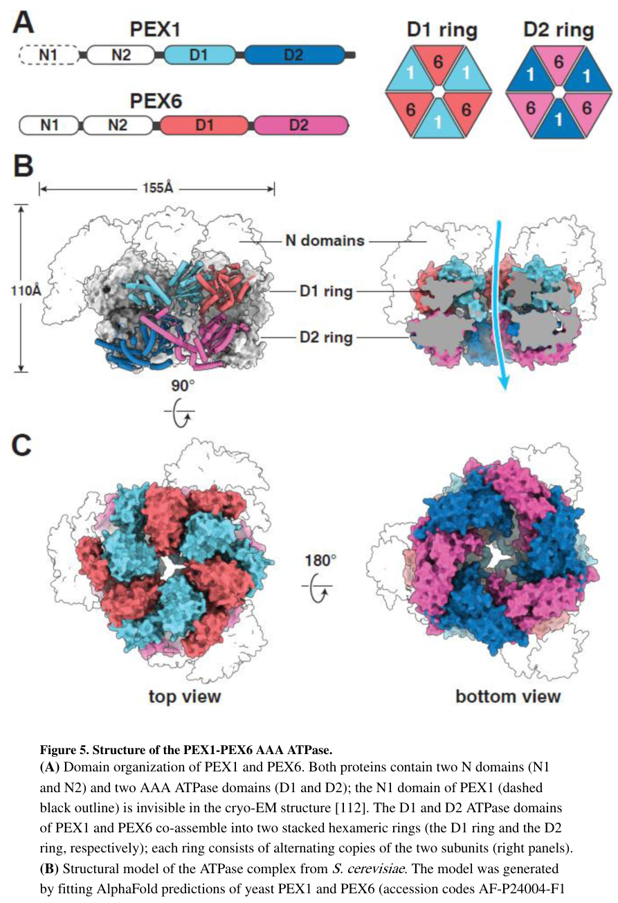

## Question

# Commissioned Review Brief

## Review Topic

Peroxisome lifecycle and matrix protein import module

## Working Scope

Peroxisomes are maintained by coordinated membrane-protein delivery, matrix cargo recognition, receptor docking and translocation at the importomer, ubiquitin-dependent receptor recycling, membrane growth and division, and import of resident metabolic enzymes. This module captures the conserved peroxin roles and the major route variants that support peroxisome assembly, inheritance, and function across eukaryotes.

## Provisional Biological Outline

- Peroxisome lifecycle and matrix protein import
  - 1. membrane protein biogenesis
  - Peroxisomal membrane protein biogenesis
    - Alternative versions by lineage-retained membrane insertion machinery: Peroxisomal membrane protein insertion route variants
      - Pex3/Pex19 membrane protein targeting route
        - Pex19-family membrane protein cargo recognition (molecular player: Pex19 family; activity or role: peroxisome membrane targeting sequence binding)
        - Pex3-family membrane docking unit (molecular player: Pex3 family; activity or role: membrane docking for peroxisomal membrane protein import)
      - Pex16-supported membrane biogenesis route
        - Pex16-family membrane biogenesis factor (molecular player: Pex16 family; activity or role: peroxisomal membrane assembly factor)
  - 2. matrix protein targeting
  - Matrix protein cargo targeting
    - Alternative versions by targeting signal repertoire: Matrix targeting signal repertoire variants
      - PTS1-dependent cargo targeting
        - Pex5-family PTS1 cargo recognition (molecular player: Pex5 family; activity or role: peroxisome matrix targeting signal-1 binding)
      - PTS2-dependent cargo targeting
        - Pex7-family PTS2 cargo recognition (molecular player: Pex7 family; activity or role: peroxisome matrix targeting signal-2 binding)
  - 3. docking and translocation
  - Matrix protein docking and translocation
    - Conserved peroxisomal importomer active units (molecular player: conserved peroxisomal importomer; activity or role: receptor-coupled matrix cargo docking and translocation)
  - 4. receptor ubiquitination and recycling
  - Matrix import receptor ubiquitination and recycling
    - 1. receptor monoubiquitination
    - Matrix import receptor monoubiquitination
      - RING peroxin receptor ubiquitination activity (molecular player: Pex2/Pex10/Pex12 RING peroxin module; activity or role: ubiquitin-protein transferase activity toward matrix import receptor)
    - 2. ATP-dependent extraction
    - ATP-dependent receptor extraction
      - Pex1/Pex6 ATPase receptor extraction module (molecular player: Pex1/Pex6 receptor extraction ATPase with membrane adaptor; activity or role: ATP hydrolysis-coupled receptor extraction)
  - 5. proliferation and division
  - Peroxisome elongation and division
    - Pex11-like peroxisome membrane remodeling (molecular player: Pex11-like membrane remodeling family; activity or role: peroxisome membrane remodeling for elongation and division)
  - 6. metabolic operation
  - Peroxisomal matrix metabolic operation

## Known Relationships Among Steps

- Peroxisomal membrane protein biogenesis precedes Matrix protein cargo targeting: A competent peroxisomal membrane is needed for matrix cargo targeting and import.
- Matrix protein cargo targeting feeds into Matrix protein docking and translocation: Cargo-loaded matrix import receptors dock at the importomer.
- Matrix protein docking and translocation feeds into Matrix import receptor ubiquitination and recycling: Importomer engagement creates receptor states that must be recycled.
- Matrix protein docking and translocation feeds into Peroxisomal matrix metabolic operation: Matrix import provides enzymes required for mature peroxisome metabolic function.
- Peroxisome elongation and division promotes Peroxisomal membrane protein biogenesis: Proliferation and membrane biogenesis are coupled in peroxisome growth and maintenance.
- Pex19-family membrane protein cargo recognition feeds into Pex3-family membrane docking unit: Pex19-bound cargo is delivered to a Pex3-family membrane docking/insertion step.
- Matrix import receptor monoubiquitination feeds into ATP-dependent receptor extraction: Receptor monoubiquitination marks the import receptor for ATP-dependent extraction.

## Assignment

Write a rigorous, review-style synthesis suitable for a molecular biology
audience. Treat the topic as a biological system whose boundaries, core
mechanisms, variants, and unresolved points should be made clear to readers who
know the field but are not specialists in this specific process.

The review should be explanatory rather than encyclopedic. Anchor broad claims
in primary literature or authoritative reviews, but keep the focus on how the
system works and how its parts fit together.

## Questions To Address

1. **Scope and boundaries**
   - What exactly is included in this biological system?
   - Which neighboring pathways, organelle processes, complexes, or regulatory
     events are often confused with it but should be treated separately?
   - Are there competing definitions in the literature?

2. **Core mechanism**
   - What is the best current model for the sequence of events?
   - Which steps are obligatory, which are conditional, and which are accessory?
   - What molecular assemblies, enzymes, receptors, adaptors, transporters, or
     structural units carry out each major step?

3. **Variation**
   - How does the system vary across major evolutionary lineages?
   - Are there well-supported differences between cell types, tissues,
     developmental stages, physiological states, or compartments?
   - Where are there alternative routes that achieve a similar outcome by
     different molecular means?

4. **Conservation and origin**
   - What is the deepest plausible evolutionary origin of the system?
   - Which parts appear ancient and conserved, and which appear to be later
     elaborations, replacements, or lineage-specific losses?
   - When a protein family has expanded, which family members are the best
     representatives for understanding the ancestral role?

5. **Physical and biological constraints**
   - What steps must occur in a particular order?
   - Which events are mutually exclusive, compartment-specific, cell-type
     specific, substrate-specific, or stage-specific?
   - What evidence rules out otherwise plausible paths through the system?

6. **Evidence and controversy**
   - Which mechanistic claims are strongly supported by experiments?
   - Where does the literature disagree, rely on indirect evidence, or mix data
     from organisms that may not be comparable?
   - What are the most important open questions?

## Output Format

Use the style and structure of a concise review article:

1. Executive summary
2. Definition and biological boundaries
3. Mechanistic overview
4. Major molecular players and active assemblies
5. Evolutionary and cell-biological variation
6. Constraints, dependencies, and failure modes
7. Controversies and open questions
8. Key references

Include citations for major claims, preferably PMIDs or DOIs. Be explicit about
uncertainty and avoid overgeneralizing from one organism, cell type, or assay
system to all biology.

## Output

Question: You are an expert researcher providing comprehensive, well-cited information.

Provide detailed information focusing on:
1. Key concepts and definitions with current understanding
2. Recent developments and latest research (prioritize 2023-2024 sources)
3. Current applications and real-world implementations
4. Expert opinions and analysis from authoritative sources
5. Relevant statistics and data from recent studies

Format as a comprehensive research report with proper citations. Include URLs and publication dates where available.
Always prioritize recent, authoritative sources and provide specific citations for all major claims.

# Commissioned Review Brief

## Review Topic

Peroxisome lifecycle and matrix protein import module

## Working Scope

Peroxisomes are maintained by coordinated membrane-protein delivery, matrix cargo recognition, receptor docking and translocation at the importomer, ubiquitin-dependent receptor recycling, membrane growth and division, and import of resident metabolic enzymes. This module captures the conserved peroxin roles and the major route variants that support peroxisome assembly, inheritance, and function across eukaryotes.

## Provisional Biological Outline

- Peroxisome lifecycle and matrix protein import
  - 1. membrane protein biogenesis
  - Peroxisomal membrane protein biogenesis
    - Alternative versions by lineage-retained membrane insertion machinery: Peroxisomal membrane protein insertion route variants
      - Pex3/Pex19 membrane protein targeting route
        - Pex19-family membrane protein cargo recognition (molecular player: Pex19 family; activity or role: peroxisome membrane targeting sequence binding)
        - Pex3-family membrane docking unit (molecular player: Pex3 family; activity or role: membrane docking for peroxisomal membrane protein import)
      - Pex16-supported membrane biogenesis route
        - Pex16-family membrane biogenesis factor (molecular player: Pex16 family; activity or role: peroxisomal membrane assembly factor)
  - 2. matrix protein targeting
  - Matrix protein cargo targeting
    - Alternative versions by targeting signal repertoire: Matrix targeting signal repertoire variants
      - PTS1-dependent cargo targeting
        - Pex5-family PTS1 cargo recognition (molecular player: Pex5 family; activity or role: peroxisome matrix targeting signal-1 binding)
      - PTS2-dependent cargo targeting
        - Pex7-family PTS2 cargo recognition (molecular player: Pex7 family; activity or role: peroxisome matrix targeting signal-2 binding)
  - 3. docking and translocation
  - Matrix protein docking and translocation
    - Conserved peroxisomal importomer active units (molecular player: conserved peroxisomal importomer; activity or role: receptor-coupled matrix cargo docking and translocation)
  - 4. receptor ubiquitination and recycling
  - Matrix import receptor ubiquitination and recycling
    - 1. receptor monoubiquitination
    - Matrix import receptor monoubiquitination
      - RING peroxin receptor ubiquitination activity (molecular player: Pex2/Pex10/Pex12 RING peroxin module; activity or role: ubiquitin-protein transferase activity toward matrix import receptor)
    - 2. ATP-dependent extraction
    - ATP-dependent receptor extraction
      - Pex1/Pex6 ATPase receptor extraction module (molecular player: Pex1/Pex6 receptor extraction ATPase with membrane adaptor; activity or role: ATP hydrolysis-coupled receptor extraction)
  - 5. proliferation and division
  - Peroxisome elongation and division
    - Pex11-like peroxisome membrane remodeling (molecular player: Pex11-like membrane remodeling family; activity or role: peroxisome membrane remodeling for elongation and division)
  - 6. metabolic operation
  - Peroxisomal matrix metabolic operation

## Known Relationships Among Steps

- Peroxisomal membrane protein biogenesis precedes Matrix protein cargo targeting: A competent peroxisomal membrane is needed for matrix cargo targeting and import.
- Matrix protein cargo targeting feeds into Matrix protein docking and translocation: Cargo-loaded matrix import receptors dock at the importomer.
- Matrix protein docking and translocation feeds into Matrix import receptor ubiquitination and recycling: Importomer engagement creates receptor states that must be recycled.
- Matrix protein docking and translocation feeds into Peroxisomal matrix metabolic operation: Matrix import provides enzymes required for mature peroxisome metabolic function.
- Peroxisome elongation and division promotes Peroxisomal membrane protein biogenesis: Proliferation and membrane biogenesis are coupled in peroxisome growth and maintenance.
- Pex19-family membrane protein cargo recognition feeds into Pex3-family membrane docking unit: Pex19-bound cargo is delivered to a Pex3-family membrane docking/insertion step.
- Matrix import receptor monoubiquitination feeds into ATP-dependent receptor extraction: Receptor monoubiquitination marks the import receptor for ATP-dependent extraction.

## Assignment

Write a rigorous, review-style synthesis suitable for a molecular biology
audience. Treat the topic as a biological system whose boundaries, core
mechanisms, variants, and unresolved points should be made clear to readers who
know the field but are not specialists in this specific process.

The review should be explanatory rather than encyclopedic. Anchor broad claims
in primary literature or authoritative reviews, but keep the focus on how the
system works and how its parts fit together.

## Questions To Address

1. **Scope and boundaries**
   - What exactly is included in this biological system?
   - Which neighboring pathways, organelle processes, complexes, or regulatory
     events are often confused with it but should be treated separately?
   - Are there competing definitions in the literature?

2. **Core mechanism**
   - What is the best current model for the sequence of events?
   - Which steps are obligatory, which are conditional, and which are accessory?
   - What molecular assemblies, enzymes, receptors, adaptors, transporters, or
     structural units carry out each major step?

3. **Variation**
   - How does the system vary across major evolutionary lineages?
   - Are there well-supported differences between cell types, tissues,
     developmental stages, physiological states, or compartments?
   - Where are there alternative routes that achieve a similar outcome by
     different molecular means?

4. **Conservation and origin**
   - What is the deepest plausible evolutionary origin of the system?
   - Which parts appear ancient and conserved, and which appear to be later
     elaborations, replacements, or lineage-specific losses?
   - When a protein family has expanded, which family members are the best
     representatives for understanding the ancestral role?

5. **Physical and biological constraints**
   - What steps must occur in a particular order?
   - Which events are mutually exclusive, compartment-specific, cell-type
     specific, substrate-specific, or stage-specific?
   - What evidence rules out otherwise plausible paths through the system?

6. **Evidence and controversy**
   - Which mechanistic claims are strongly supported by experiments?
   - Where does the literature disagree, rely on indirect evidence, or mix data
     from organisms that may not be comparable?
   - What are the most important open questions?

## Output Format

Use the style and structure of a concise review article:

1. Executive summary
2. Definition and biological boundaries
3. Mechanistic overview
4. Major molecular players and active assemblies
5. Evolutionary and cell-biological variation
6. Constraints, dependencies, and failure modes
7. Controversies and open questions
8. Key references

Include citations for major claims, preferably PMIDs or DOIs. Be explicit about
uncertainty and avoid overgeneralizing from one organism, cell type, or assay
system to all biology.

# Peroxisome lifecycle and matrix protein import module (2023–2024 synthesis)

## 1. Executive summary
Peroxisome maintenance is governed by a modular, highly conserved “PEX system” that (i) builds a competent peroxisomal membrane (PMP biogenesis), (ii) recognizes matrix cargos in the cytosol via peroxisomal targeting signals (PTS1/PTS2), (iii) docks and translocates receptor–cargo complexes through an importomer centered on PEX13/PEX14, (iv) recycles the import receptor through ubiquitin-dependent extraction by the PEX1–PEX6 AAA+ ATPase, and (v) couples membrane growth with division (PEX11 family with DRP1/MFF/FIS1 in metazoa). Recent (2023–2024) work increasingly frames matrix import as a nuclear-pore-like, selective phase/meshwork mechanism (PEX13 YG repeats) and reveals additional regulatory axes (e.g., RNF146–TNKS/2 control of import via PEX14) and new biogenesis factors (e.g., RRBP1) with translational potential (e.g., PEX3–PEX19 inhibition as an anti-melanoma strategy). (skowyra2024towardssolvingthe pages 1-3, skowyra2024towardssolvingthe pages 4-6, vu2024agenomewidescreen pages 1-2, fatima2024ribosomebindingprotein1 pages 1-2, huang2023peroxisomedisruptionalters pages 1-2)

## 2. Definition and biological boundaries

### 2.1 What is included in this module
This commissioned module includes:

1) **Peroxisomal membrane protein (PMP) biogenesis and membrane growth**: delivery/insertion of PMPs via PEX19 with membrane docking/insertion by PEX3 and support from PEX16, including de novo pathways involving ER/mitochondrial pre-peroxisomal vesicles. (fatima2024ribosomebindingprotein1 pages 1-2, kumar2024theperoxisomean pages 9-10)

2) **Matrix protein targeting and import**: PTS1/PTS2 signal recognition by shuttling receptors PEX5 (PTS1) and PEX7 (PTS2, often with PEX5-related co-receptor functions), receptor docking at PEX13/PEX14, and receptor-coupled translocation into the matrix. (skowyra2024towardssolvingthe pages 1-3, kumar2024theperoxisomean pages 1-3)

3) **Import receptor ubiquitination and recycling**: receptor monoubiquitination by the peroxisomal RING E3 ligase complex PEX2/PEX10/PEX12 and ATP-dependent extraction by the PEX1/PEX6 AAA+ motor (anchored by PEX26 in metazoa or Pex15 in fungi), followed by deubiquitination and reuse. (skowyra2024towardssolvingthe pages 15-17, kumar2024theperoxisomean pages 11-13)

4) **Proliferation and division**: membrane elongation/remodeling (PEX11 family) and scission via dynamin-related GTPases (DRP1 in mammals) with adaptors such as MFF and FIS1, plus the supporting lipid supply and contact-site control that enables membrane growth prior to division. (kumar2024theperoxisomean pages 11-13, kumar2024theperoxisomean pages 13-14, kumar2024theperoxisomean pages 14-17)

### 2.2 What is often confused with the module but should be treated separately
* **Pexophagy (selective autophagy of peroxisomes)** is an important neighboring pathway controlling organelle abundance/quality, but it is not part of the core matrix import module; it intersects through ubiquitin signals on PMPs and can be triggered by import dysfunction. (germain2024upregulatedpexophagylimits pages 1-2)
* **Peroxisome–organelle contact sites** (ER, mitochondria, lipid droplets, Golgi) are increasingly recognized as essential for lipid supply and regulation of dynamics, but should be treated as upstream/parallel regulatory infrastructure rather than the importomer itself. (kumar2024theperoxisomean pages 14-17)

### 2.3 Competing definitions and terminology
A recurring nomenclature issue is whether “importomer” refers narrowly to the docking/translocation machinery (PEX13/PEX14 plus receptor interfaces) or more broadly to include the ubiquitin ligase/extraction “exportomer” modules. Mechanistic syntheses increasingly treat matrix import as a **coupled import–export cycle**, where export (PEX1/PEX6-driven extraction) supplies directionality/energy for net accumulation, conceptually expanding what counts as “the import system.” (skowyra2024towardssolvingthe pages 1-3, skowyra2024towardssolvingthe pages 15-17)

## 3. Mechanistic overview (best current model)

### 3.1 Stepwise sequence of events
**Step A — PMP biogenesis establishes an import-competent membrane.**
* PEX19 functions as a PMP receptor/chaperone; PEX3 is a docking/insertion factor for class I PMPs; PEX16 participates in de novo membrane biogenesis and PMP trafficking. (fatima2024ribosomebindingprotein1 pages 13-13, kumar2024theperoxisomean pages 9-10)
* In human cells, a 2024 study identified **RRBP1** as a peroxisome biogenesis factor that supports peroxisome number and peroxisomal protein levels and implicates ER-linked stabilization/insertion steps early in biogenesis. Publication date: Dec 2024. URL: https://doi.org/10.1242/jcs.264075 (fatima2024ribosomebindingprotein1 pages 1-2)

**Step B — Matrix cargo recognition in the cytosol.**
* Most matrix proteins carry a **C-terminal PTS1** (classically “SKL-like”) recognized by PEX5 via its C-terminal TPR domain; PEX5 also contains an unstructured N-terminus that mediates interactions with importomer components. (skowyra2024towardssolvingthe pages 1-3)
* The **PTS2** pathway uses PEX7, often interfacing with PEX5 or PEX5-like co-receptor functions depending on lineage. (skowyra2024towardssolvingthe pages 1-3, ghosh2024molecularcharacterizationof pages 19-22)

**Step C — Docking/translocation at the importomer (PEX13/PEX14).**
* Cargo-bound PEX5 is recruited to peroxisomes by PEX13 and PEX14, and evidence supports full entry of PEX5 into the matrix during import. (skowyra2024towardssolvingthe pages 6-8)
* A leading 2024 model proposes that **PEX13 forms a membrane-embedded conduit** that is filled by a YG-repeat meshwork (analogous to nucleoporin FG repeats), through which PEX5 diffuses with cargo (nuclear pore-like selectivity). (skowyra2024towardssolvingthe pages 4-6, skowyra2024towardssolvingthe media de7e05fa)
* PEX13’s **dual topology** (insertion in two orientations) reconciles earlier conflicting topology experiments and supports a “ring-like” pore architecture with multiple amphipathic helices (AHs) forming the wall around the aqueous meshwork. (skowyra2024towardssolvingthe pages 4-6)
* A 2024 structural/biophysical study in Nature Communications supports an interaction network whereby the **PEX13 SH3 domain** binds diaromatic motifs (including PEX5 WxxxF/Y motifs) and can modulate import through intramolecular and intermolecular interactions with PEX5 and PEX14. Publication date: Apr 2024. URL: https://doi.org/10.1038/s41467-024-47605-w (gaussmann2024modulationofperoxisomal pages 14-15)

**Step D — Receptor ubiquitination and ATP-dependent recycling.**
* After cargo release, PEX5 is **monoubiquitinated on a conserved cysteine** by a membrane RING ligase composed of **PEX2/PEX10/PEX12**. (skowyra2024towardssolvingthe pages 1-3)
* The receptor is then extracted by the **hexameric PEX1–PEX6 AAA+ ATPase motor** and deubiquitinated to reset the cycle. (skowyra2024towardssolvingthe pages 15-17)
* High-level mechanistic parallels with ERAD/p97 systems are emphasized, including models where the ubiquitin ligase complex forms an **open pore spanning the membrane** for retrotranslocation of PEX5. (skowyra2024towardssolvingthe pages 27-31, kumar2024theperoxisomean pages 11-13)

**Step E — Peroxisome growth and division (lifecycle integration).**
* Peroxisomes multiply through **membrane growth → elongation/tubulation → constriction → scission**, with DRP1-mediated fission in mammals. (kumar2024theperoxisomean pages 11-13)
* PEX11β drives membrane expansion and contributes to fission complex assembly/activation; DRP1 recruitment involves adaptors **MFF** and **FIS1**. (kumar2024theperoxisomean pages 11-13)
* A key 2024 synthesis proposes **two alternative division pathways**: an MFF-dependent route and a PEX11β/FIS1-dependent route, with MFF being metazoa-specific and thus the PEX11β/FIS1 route potentially more ancient. Publication date: Jan 2024. URL: https://doi.org/10.1007/s00418-023-02259-5 (kumar2024theperoxisomean pages 11-13)

### 3.2 Obligatory vs conditional/accessory steps
* **Obligatory (core conserved)**: PEX3/PEX19 (PMP targeting), PEX5 (PTS1 import), PEX13/PEX14 (docking/translocation), PEX2/10/12 (receptor ubiquitination), PEX1/PEX6 (receptor extraction), PEX11 family (membrane remodeling for proliferation) are broadly conserved across eukaryotes. (kumar2024theperoxisomean pages 7-9, skowyra2024towardssolvingthe pages 1-3)
* **Conditional/accessory**: PTS2 machinery composition (co-receptors), detailed division adaptors (e.g., metazoan MFF), and specialized regulatory proteins (e.g., RNF146–TNKS/2, RRBP1) vary by lineage/cell type and physiological context. (aguirrelopez2024theperoxisomeprotein pages 1-2, kumar2024theperoxisomean pages 13-14, vu2024agenomewidescreen pages 1-2, fatima2024ribosomebindingprotein1 pages 1-2)

## 4. Major molecular players and active assemblies

### 4.1 Import receptor and docking/translocation module
* **PEX5**: soluble PTS1 receptor with unstructured N-terminus (WxxxF/Y motifs) and C-terminal TPR domain for PTS1 binding; shuttles into/out of peroxisomes carrying folded/oligomeric cargo. (skowyra2024towardssolvingthe pages 1-3)
* **PEX13**: key membrane component; current evidence supports dual topology and assembly of a conduit filled by a YG-repeat meshwork; contains an SH3 domain in opisthokonts that can participate in receptor docking/modulation. (skowyra2024towardssolvingthe pages 4-6, gaussmann2024modulationofperoxisomal pages 14-15)
* **PEX14**: docking component that binds PEX5 motifs and contributes to directional bias and receptor engagement. (skowyra2024towardssolvingthe pages 1-3)

**Visual evidence**: Skowyra et al. (2024) provide a schematic comparison of the proposed PEX13/YG conduit with the nuclear pore and other translocons (Figure 6). (skowyra2024towardssolvingthe media de7e05fa)

### 4.2 Ubiquitin ligase complex (receptor recycling “exportomer”)
* **PEX2/PEX10/PEX12**: membrane-embedded RING E3 ligase complex; proposed to form a retrotranslocation channel with a constitutively open pore for receptor recycling. (skowyra2024towardssolvingthe pages 15-17, skowyra2024towardssolvingthe pages 27-31)

### 4.3 AAA+ extraction motor
* **PEX1–PEX6 AAA+ ATPase**: heterohexameric motor that recognizes ubiquitinated receptor and performs ATP-driven extraction; recent structural interpretations align its action with processive threading/unfolding mechanisms analogous to Cdc48/p97. (skowyra2024towardssolvingthe pages 15-17, kumar2024theperoxisomean pages 11-13)

**Visual evidence**: Skowyra et al. (2024) depict the PEX1–PEX6 domain organization and hexameric ring architecture (Figure 5). (skowyra2024towardssolvingthe media e9dad219)

### 4.4 Proliferation/division machinery
* **PEX11β**: peroxisomal membrane remodeling protein; N-terminal amphipathic helices support elongation; C-terminus supports division complex formation. (kumar2024theperoxisomean pages 11-13)
* **DRP1**: dynamin-related GTPase; recruited by adaptors **MFF** and **FIS1**; assembles into ring-like structures to execute scission on GTP hydrolysis. (kumar2024theperoxisomean pages 11-13)
* **Tool development (2024)**: nanobodies/chromobodies enable enrichment and live-cell imaging of endogenous DRP1 dynamics, supporting mechanistic dissection of shared mitochondrial–peroxisomal fission logic. Publication date: May 2024. URL: https://doi.org/10.26508/lsa.202402608 (froehlich2024nanobodiesasnovel pages 1-2)

## 5. Evolutionary and cell-biological variation

### 5.1 Conserved core and lineage-specific factors
A 2024 update emphasizes that the **human genome encodes 14 core peroxins**, while the total set of described peroxins has expanded to **~39** (reflecting lineage-specific additions, especially in fungi/protists). Publication date: Jan 2024. URL: https://doi.org/10.1007/s00418-023-02259-5 (kumar2024theperoxisomean pages 6-7)

Examples of lineage variation documented in 2024 syntheses:
* **PEX4** is present broadly in eukaryotes **except metazoa** (implying alternative E2 logic in animals). (kumar2024theperoxisomean pages 7-9)
* **Pex15 (yeast)** versus **PEX26 (metazoa and some fungi)** as membrane anchors for the PEX1/PEX6 extraction motor. (aguirrelopez2024theperoxisomeprotein pages 1-2)
* **PEX16 functional homolog PEX36** in fungi. (kumar2024theperoxisomean pages 9-10)
* **PEX9** as a Saccharomyces-specific PEX5-like receptor variant. (kumar2024theperoxisomean pages 6-7)
* **PEX38** in Trypanosoma brucei proposed as a PEX19-binding co-chaperone. (kumar2024theperoxisomean pages 6-7)

### 5.2 Developmental/cell-state rewiring
Peroxisome import requirements can be developmentally tuned. In the fungus *Podospora anserina*, **PEX13 is required for meiotic induction but PEX14 is (partially) dispensable for import during meiotic development**, implying regulated reliance on specific docking/translocation components. Publication date: Jan 2024. URL: https://doi.org/10.1128/spectrum.02139-23 (aguirrelopez2024theperoxisomeprotein pages 1-2)

### 5.3 Tissue-level specialization (metabolic context)
A 2024 meta-analysis highlights that peroxisomal metabolic roles can be tissue-specialized: in heart, enzymes for peroxisomal fatty acid oxidation show marginal expression compared with liver, while peroxisome biogenesis proteins remain broadly expressed, suggesting peroxisomes may contribute via other pathways (e.g., PTS2-linked functions and plasmalogen biosynthesis). Publication date: Feb 2024. URL: https://doi.org/10.1186/s13062-024-00458-1 (plessner2024tissuespecificrolesof pages 1-2)

## 6. Constraints, dependencies, and failure modes

### 6.1 Ordering constraints
* **Membrane competence precedes matrix import**: PMP biogenesis (PEX3/PEX19/PEX16) is required to build the docking/translocation and recycling machinery that allows matrix enzyme import. (kumar2024theperoxisomean pages 9-10, skowyra2024towardssolvingthe pages 1-3)
* **Translocation is coupled to recycling**: receptor import states must be resolved by monoubiquitination and PEX1/PEX6 extraction; failure shifts receptors toward polyubiquitination and degradation pathways. (kumar2024theperoxisomean pages 11-13, skowyra2024towardssolvingthe pages 15-17)
* **Membrane growth precedes division**: PEX11β-driven elongation and lipid supply via ER contacts enable DRP1-mediated scission. (kumar2024theperoxisomean pages 11-13, kumar2024theperoxisomean pages 14-17)

### 6.2 Failure modes with clinical phenotypes
Defects in DRP1/MFF/PEX11β yield elongated peroxisomes and neurological abnormalities in patients, and MFF deficiency can generate tubules emanating from an import-competent “mother” peroxisome body, reducing the number of mature functional organelles. (kumar2024theperoxisomean pages 11-13)

## 7. Controversies and open questions

### 7.1 What is the “pore” and what provides selectivity?
* **Nuclear pore-like PEX13/YG mesh model**: supported by PEX13 dual topology, predicted oligomeric rings of amphipathic helices, and analogy to FG-repeat barriers. This remains partly speculative because direct EM visualization of a native PEX13 pore is still lacking. (skowyra2024towardssolvingthe pages 4-6)
* **Alternative PEX5/PEX14 transient pore models** exist, but are challenged by the lack of obvious hydrophobic segments in PEX5 and by evidence that the essential amphipathic helices in PEX5 function mainly in recycling rather than translocation. (skowyra2024towardssolvingthe pages 4-6, skowyra2024towardssolvingthe pages 6-8)

### 7.2 How is energy coupled to net accumulation?
A key conceptual shift emphasized in 2024 is that ATP-driven receptor export (PEX1/PEX6 extraction of ubiquitinated PEX5) may be the principal energy-coupling step that biases the cycle to concentrate cargo in the matrix, analogous to directional nuclear transport. (skowyra2024towardssolvingthe pages 1-3, skowyra2024towardssolvingthe pages 15-17)

### 7.3 Interface with organelle turnover and global cellular resource limits
A 2024 Nature Communications study shows that increased pexophagy can deplete shared autophagy initiation capacity (ULK1), thereby reducing mitophagy/aggrephagy; importantly, co-depletion of **PEX2** with **PEX13** could rescue peroxisome loss and restore aggrephagy in a PEX13-depletion model, indicating actionable cross-talk between biogenesis/import factors and autophagy capacity. Publication date: Jan 2024. URL: https://doi.org/10.1038/s41467-023-44005-4 (germain2024upregulatedpexophagylimits pages 1-2)

## 8. Current applications and real-world implementations

### 8.1 Therapeutic targeting of peroxisome biogenesis/import
A 2023 JCI study in melanoma models reports that compromising peroxisome biogenesis by targeting **PEX3** potentiated MAPK inhibitor response via ceramide induction; the authors further describe a **small-molecule inhibitor of the PEX3–PEX19 interaction** and demonstrate potent anti-tumor activity when combined with UGCG inhibition and MAPK-pathway inhibitors in preclinical models. Publication date: Oct 2023. URL: https://doi.org/10.1172/jci166644 (huang2023peroxisomedisruptionalters pages 1-2)

### 8.2 Systems-level discovery platforms for peroxisome regulators
A 2024 genome-wide CRISPRi approach that couples PTS1 import to Zeocin resistance (mVenus–ZeoR–PTS1 reporter) identified **1,717 genes** with significant effects (p<0.05 at day 14) and strongly recovered canonical PEX genes, validating the platform and uncovering regulatory links to Wnt signaling via **RNF146** and **TNKS/2** (PARylation-linked control proposed to impinge on PEX14 and import). Publication date: Jul 2024. URL: https://doi.org/10.1083/jcb.202312069 (vu2024thegenomewideelucidation pages 13-18, vu2024agenomewidescreen pages 1-2)

### 8.3 Enabling technologies for dynamic peroxisome biology
Nanobody-based probes against DRP1 (2024) enable live imaging and proteomics of an essential fission factor shared by mitochondria and peroxisomes, directly supporting real-world implementation in cell biology workflows (super-resolution microscopy, endogenous enrichment, dynamic perturbation assays). Publication date: May 2024. URL: https://doi.org/10.26508/lsa.202402608 (froehlich2024nanobodiesasnovel pages 1-2)

## 9. Key statistics and quantitative data points from recent studies
* **Peroxin repertoire**: Human genome encodes **14 core peroxins**, while the catalog of identified peroxins has grown to **39** (as of the 2024 update), highlighting extensive lineage-specific additions beyond the conserved core. (kumar2024theperoxisomean pages 6-7)
* **Genome-scale regulatory landscape**: a human CRISPRi screen for peroxisomal import regulators found **1,717 genes** significantly altered at a major timepoint (day 14; p<0.05), with canonical PEX genes enriched among hits. (vu2024thegenomewideelucidation pages 13-18)
* **Disease genetics framing**: Zellweger spectrum disorder is described as being caused by mutations in **one of 13 PEX genes** (as framed in the 2024 autophagy/pexophagy study), illustrating continued variability in how gene counts are operationally defined across subfields/datasets. (germain2024upregulatedpexophagylimits pages 1-2)

## 10. Summary table of the module
The following table is a compact reference linking steps, conserved players, lineage variants, and representative recent sources.

| Process step | Core conserved players | Key mechanistic notes | Major lineage variants | Representative recent sources (2023–2024) |
|---|---|---|---|---|
| PMP biogenesis | PEX19, PEX3, PEX16; early ER-linked factors; newly implicated RRBP1 | PEX19 acts as PMP receptor/chaperone; PEX3 is the membrane docking/insertion factor for class I PMPs; PEX16 supports early membrane assembly/de novo biogenesis; de novo formation can involve ER- and mitochondria-derived preperoxisomal vesicles that later fuse; RRBP1 was identified in human cells as a factor that stabilizes early peroxisomal components at the ER (fatima2024ribosomebindingprotein1 pages 1-2, fatima2024ribosomebindingprotein1 pages 13-13, kumar2024theperoxisomean pages 9-10) | PEX36 is a fungal functional homolog of PEX16; PEX38 is a trypanosome PEX19-binding co-chaperone; metazoa retain canonical PEX16 route more broadly (kumar2024theperoxisomean pages 6-7, kumar2024theperoxisomean pages 9-10) | Kumar et al., 2024, Histochem Cell Biol, doi:10.1007/s00418-023-02259-5, https://doi.org/10.1007/s00418-023-02259-5; Fatima et al., 2024, J Cell Sci, doi:10.1242/jcs.264075, https://doi.org/10.1242/jcs.264075 (fatima2024ribosomebindingprotein1 pages 1-2, kumar2024theperoxisomean pages 9-10) |
| Matrix targeting | PEX5 (PTS1 receptor), PEX7 (PTS2 receptor), cargo PTS1/PTS2 motifs; PEX5L/PTS2 co-receptor functions in some lineages | Most matrix proteins use C-terminal PTS1 (e.g., SKL-like) recognized by PEX5 TPR domain; PTS2 cargo uses PEX7, often with a PEX5-related co-receptor; receptors bind folded cargo in the cytosol and shuttle to the membrane (ghosh2024molecularcharacterizationof pages 19-22, skowyra2024towardssolvingthe pages 1-3, kumar2024theperoxisomean pages 1-3) | Yeast can use Pex9 as a condition-specific PTS1 receptor; fungi often use Pex20 or Pex18/Pex21 as PTS2 co-receptors; PEX39 has emerged as a conserved factor linked to the PTS2 route (ghosh2024molecularcharacterizationof pages 19-22, kumar2024theperoxisomean pages 6-7, kumar2024theperoxisomean pages 7-9, aguirrelopez2024theperoxisomeprotein pages 1-2) | Skowyra et al., 2024, Trends Cell Biol, doi:10.1016/j.tcb.2023.08.005, https://doi.org/10.1016/j.tcb.2023.08.005; Kumar et al., 2024, doi:10.1007/s00418-023-02259-5, https://doi.org/10.1007/s00418-023-02259-5 (skowyra2024towardssolvingthe pages 1-3, kumar2024theperoxisomean pages 1-3) |
| Docking / translocation | PEX13, PEX14, receptor-bound PEX5/PEX7; in some fungi PEX8; importomer/docking-translocation machinery | Current leading model emphasizes a PEX13-based conduit with a YG-repeat meshwork analogous to nuclear FG-repeat selectivity barriers; PEX5 N-terminal WxxxF/Y motifs bind PEX14 and PEX13-associated surfaces; full PEX5 can enter the matrix; alternative/transitional models include PEX14-centered channels and phase-separated PEX13/PEX14 condensates (skowyra2024towardssolvingthe pages 11-13, skowyra2024towardssolvingthe pages 1-3, skowyra2024towardssolvingthe pages 6-8, skowyra2024towardssolvingthe pages 4-6, gaussmann2024modulationofperoxisomal pages 14-15) | SH3-mediated PEX13 interactions differ between yeast and mammals; some fungi show developmental rewiring of PEX13/PEX14 dependence; opisthokont PEX13 has SH3-domain features not universal across eukaryotes (aguirrelopez2024theperoxisomeprotein pages 1-2, skowyra2024towardssolvingthe pages 14-15, gaussmann2024modulationofperoxisomal pages 14-15) | Skowyra et al., 2024, doi:10.1016/j.tcb.2023.08.005, https://doi.org/10.1016/j.tcb.2023.08.005; Gaussmann et al., 2024, Nat Commun, doi:10.1038/s41467-024-47605-w, https://doi.org/10.1038/s41467-024-47605-w (skowyra2024towardssolvingthe pages 11-13, skowyra2024towardssolvingthe pages 6-8, gaussmann2024modulationofperoxisomal pages 14-15) |
| Ubiquitination / recycling | RING complex PEX2/PEX10/PEX12; E2s including Pex4/Pex22 in fungi; AAA+ ATPases PEX1/PEX6 with membrane anchor PEX26 or Pex15; deubiquitinases | After cargo release, PEX5 is monoubiquitinated on a conserved cysteine by the membrane RING ligase complex; the ligase complex likely forms a retrotranslocation pore; PEX1/PEX6 recognizes Ub-PEX5 and extracts it via ATP-dependent threading/unfolding; failed recycling can trigger polyubiquitination and RADAR/proteasomal degradation (skowyra2024towardssolvingthe pages 15-17, aguirrelopez2024theperoxisomeprotein pages 1-2, skowyra2024towardssolvingthe pages 6-8, skowyra2024towardssolvingthe pages 27-31, kumar2024theperoxisomean pages 11-13) | Fungal systems commonly use Pex4/Pex22 for monoubiquitination and Pex15 as the Pex1/Pex6 membrane anchor; metazoa use PEX26; polyubiquitination versus monoubiquitination logic is broadly conserved but enzyme complements differ (aguirrelopez2024theperoxisomeprotein pages 1-2, kumar2024theperoxisomean pages 11-13) | Skowyra et al., 2024, doi:10.1016/j.tcb.2023.08.005, https://doi.org/10.1016/j.tcb.2023.08.005; Kumar et al., 2024, doi:10.1007/s00418-023-02259-5, https://doi.org/10.1007/s00418-023-02259-5 (skowyra2024towardssolvingthe pages 15-17, skowyra2024towardssolvingthe pages 27-31, kumar2024theperoxisomean pages 11-13) |
| Proliferation / division | PEX11 family (especially PEX11β in mammals), DRP1/Dnm1-related GTPases, MFF, FIS1, NME3/DYNAMO1; ER-contact tethers ACBD4/5–VAP | Peroxisomes grow by membrane expansion, elongation, constriction, and DRP1-mediated scission; PEX11β remodels/elongates membrane and helps assemble the fission machinery; MFF and FIS1 recruit DRP1; NME3/DYNAMO1 can supply local GTP; ER-peroxisome lipid transfer via ACBD5/4–VAP contacts supports membrane growth (kumar2024theperoxisomean pages 11-13, kumar2024theperoxisomean pages 13-14, kumar2024theperoxisomean pages 14-17, froehlich2024nanobodiesasnovel pages 1-2) | MFF is metazoa-specific; a PEX11β/FIS1 route may be the more ancient pathway; fungi use Dnm1-related division logic with lineage-specific PEX11-family expansions; tissue dependence is substantial despite broadly similar biogenesis-factor expression (kumar2024theperoxisomean pages 11-13, plessner2024tissuespecificrolesof pages 1-2, kumar2024theperoxisomean pages 6-7, kumar2024theperoxisomean pages 9-10) | Kumar et al., 2024, doi:10.1007/s00418-023-02259-5, https://doi.org/10.1007/s00418-023-02259-5; Froehlich et al., 2024, Life Sci Alliance, doi:10.26508/lsa.202402608, https://doi.org/10.26508/lsa.202402608 (kumar2024theperoxisomean pages 11-13, kumar2024theperoxisomean pages 13-14, froehlich2024nanobodiesasnovel pages 1-2) |
| Turnover / quality control | PEX2, ubiquitinated PMPs, NBR1, SQSTM1/p62, MARCH5; p97/VCP-FAF2/UBXD8; ULK1-limited autophagy machinery | Peroxisome number is also controlled by pexophagy; import defects or PMP ubiquitination can mark organelles for degradation; excessive pexophagy can suppress other selective autophagy pathways by consuming ULK1; p97/VCP-FAF2 suppresses basal mammalian pexophagy by extracting ubiquitylated PMPs; RNF146–TNKS/2 signaling modulates import via PEX14 PARylation-linked control (germain2024upregulatedpexophagylimits pages 1-2, vu2024thegenomewideelucidationa pages 13-18, vu2024thegenomewideelucidation pages 13-18, vu2024agenomewidescreen pages 1-2) | Mammalian pexophagy networks are better tied to ubiquitinated PMPs and OPTN/NBR1-like adaptors; yeast/fungi use related but non-identical pexophagy machinery; disease models prominently involve Zellweger-spectrum PEX defects (germain2024upregulatedpexophagylimits pages 1-2, kosir2024integrativeomicsreveals pages 1-4) | Germain et al., 2024, Nat Commun, doi:10.1038/s41467-023-44005-4, https://doi.org/10.1038/s41467-023-44005-4; Vu et al., 2024, J Cell Biol, doi:10.1083/jcb.202312069, https://doi.org/10.1083/jcb.202312069 (germain2024upregulatedpexophagylimits pages 1-2, vu2024agenomewidescreen pages 1-2) |

*Table: This table condenses the core steps, conserved machinery, mechanistic models, lineage variants, and recent sources for the peroxisome lifecycle and matrix protein import module. It is useful as a high-density reference for comparing obligatory import steps with accessory or lineage-specific routes.*

## 11. Key references (prioritizing 2023–2024)
1. Skowyra ML, Feng P, Rapoport TA. **Towards solving the mystery of peroxisomal matrix protein import.** *Trends in Cell Biology.* May 2024. DOI: 10.1016/j.tcb.2023.08.005. URL: https://doi.org/10.1016/j.tcb.2023.08.005 (skowyra2024towardssolvingthe pages 1-3)
2. Kumar R, Islinger M, Worthy H, Carmichael R, Schrader M. **The peroxisome: an update on mysteries 3.0.** *Histochemistry and Cell Biology.* Jan 2024. DOI: 10.1007/s00418-023-02259-5. URL: https://doi.org/10.1007/s00418-023-02259-5 (kumar2024theperoxisomean pages 1-3)
3. Gaussmann S, et al. **Modulation of peroxisomal import by the PEX13 SH3 domain and a proximal FxxxF binding motif.** *Nature Communications.* Apr 2024. DOI: 10.1038/s41467-024-47605-w. URL: https://doi.org/10.1038/s41467-024-47605-w (gaussmann2024modulationofperoxisomal pages 14-15)
4. Fatima K, et al. **Ribosome-binding protein 1 maintains peroxisome biogenesis.** *Journal of Cell Science.* Dec 2024. DOI: 10.1242/jcs.264075. URL: https://doi.org/10.1242/jcs.264075 (fatima2024ribosomebindingprotein1 pages 1-2)
5. Vu JT, et al. **A genome-wide screen links peroxisome regulation with Wnt signaling through RNF146 and TNKS/2.** *Journal of Cell Biology.* Jul 2024. DOI: 10.1083/jcb.202312069. URL: https://doi.org/10.1083/jcb.202312069 (vu2024agenomewidescreen pages 1-2)
6. Huang F, et al. **Peroxisome disruption alters lipid metabolism and potentiates antitumor response with MAPK-targeted therapy in melanoma.** *Journal of Clinical Investigation.* Oct 2023. DOI: 10.1172/jci166644. URL: https://doi.org/10.1172/jci166644 (huang2023peroxisomedisruptionalters pages 1-2)
7. Germain K, et al. **Upregulated pexophagy limits the capacity of selective autophagy.** *Nature Communications.* Jan 2024. DOI: 10.1038/s41467-023-44005-4. URL: https://doi.org/10.1038/s41467-023-44005-4 (germain2024upregulatedpexophagylimits pages 1-2)
8. Aguirre-López B, Suaste-Olmos F, Peraza-Reyes L. **The peroxisome protein translocation machinery is developmentally regulated in the fungus *Podospora anserina*.** *Microbiology Spectrum.* Jan 2024. DOI: 10.1128/spectrum.02139-23. URL: https://doi.org/10.1128/spectrum.02139-23 (aguirrelopez2024theperoxisomeprotein pages 1-2)
9. Froehlich T, et al. **Nanobodies as novel tools to monitor the mitochondrial fission factor Drp1.** *Life Science Alliance.* May 2024. DOI: 10.26508/lsa.202402608. URL: https://doi.org/10.26508/lsa.202402608 (froehlich2024nanobodiesasnovel pages 1-2)

References

1. (skowyra2024towardssolvingthe pages 1-3): Michael L. Skowyra, Peiqiang Feng, and Tom A. Rapoport. Towards solving the mystery of peroxisomal matrix protein import. Trends in Cell Biology, 34:388-405, May 2024. URL: https://doi.org/10.1016/j.tcb.2023.08.005, doi:10.1016/j.tcb.2023.08.005. This article has 36 citations and is from a domain leading peer-reviewed journal.

2. (skowyra2024towardssolvingthe pages 4-6): Michael L. Skowyra, Peiqiang Feng, and Tom A. Rapoport. Towards solving the mystery of peroxisomal matrix protein import. Trends in Cell Biology, 34:388-405, May 2024. URL: https://doi.org/10.1016/j.tcb.2023.08.005, doi:10.1016/j.tcb.2023.08.005. This article has 36 citations and is from a domain leading peer-reviewed journal.

3. (vu2024agenomewidescreen pages 1-2): Jonathan T. Vu, Katherine U. Tavasoli, Connor J. Sheedy, Soham P. Chowdhury, Lori Mandjikian, Julien Bacal, Meghan A. Morrissey, Chris D. Richardson, and Brooke M. Gardner. A genome-wide screen links peroxisome regulation with wnt signaling through rnf146 and tnks/2. The Journal of Cell Biology, Jul 2024. URL: https://doi.org/10.1083/jcb.202312069, doi:10.1083/jcb.202312069. This article has 5 citations.

4. (fatima2024ribosomebindingprotein1 pages 1-2): Kaneez Fatima, Helena Vihinen, Ani Akpinar, Tamara Somborac, Anja Paatero, Eija Jokitalo, Ville Paavilainen, Pekka Katajisto, and Svetlana Konovalova. Ribosome-binding protein 1 maintains peroxisome biogenesis. Journal of Cell Science, Dec 2024. URL: https://doi.org/10.1242/jcs.264075, doi:10.1242/jcs.264075. This article has 1 citations and is from a domain leading peer-reviewed journal.

5. (huang2023peroxisomedisruptionalters pages 1-2): Fan Huang, Feiyang Cai, Michael S. Dahabieh, Kshemaka Gunawardena, Ali Talebi, Jonas Dehairs, Farah El-Turk, Jae Yeon Park, Mengqi Li, Christophe Goncalves, Natascha Gagnon, Jie Su, Judith H. LaPierre, Perrine Gaub, Jean-Sébastien Joyal, John J. Mitchell, Johannes V. Swinnen, Wilson H. Miller, and Sonia V. del Rincón. Peroxisome disruption alters lipid metabolism and potentiates antitumor response with mapk-targeted therapy in melanoma. Journal of Clinical Investigation, Oct 2023. URL: https://doi.org/10.1172/jci166644, doi:10.1172/jci166644. This article has 40 citations and is from a highest quality peer-reviewed journal.

6. (kumar2024theperoxisomean pages 9-10): Rechal Kumar, Markus Islinger, Harley Worthy, Ruth Carmichael, and Michael Schrader. The peroxisome: an update on mysteries 3.0. Histochemistry and Cell Biology, 161:99-132, Jan 2024. URL: https://doi.org/10.1007/s00418-023-02259-5, doi:10.1007/s00418-023-02259-5. This article has 87 citations and is from a peer-reviewed journal.

7. (kumar2024theperoxisomean pages 1-3): Rechal Kumar, Markus Islinger, Harley Worthy, Ruth Carmichael, and Michael Schrader. The peroxisome: an update on mysteries 3.0. Histochemistry and Cell Biology, 161:99-132, Jan 2024. URL: https://doi.org/10.1007/s00418-023-02259-5, doi:10.1007/s00418-023-02259-5. This article has 87 citations and is from a peer-reviewed journal.

8. (skowyra2024towardssolvingthe pages 15-17): Michael L. Skowyra, Peiqiang Feng, and Tom A. Rapoport. Towards solving the mystery of peroxisomal matrix protein import. Trends in Cell Biology, 34:388-405, May 2024. URL: https://doi.org/10.1016/j.tcb.2023.08.005, doi:10.1016/j.tcb.2023.08.005. This article has 36 citations and is from a domain leading peer-reviewed journal.

9. (kumar2024theperoxisomean pages 11-13): Rechal Kumar, Markus Islinger, Harley Worthy, Ruth Carmichael, and Michael Schrader. The peroxisome: an update on mysteries 3.0. Histochemistry and Cell Biology, 161:99-132, Jan 2024. URL: https://doi.org/10.1007/s00418-023-02259-5, doi:10.1007/s00418-023-02259-5. This article has 87 citations and is from a peer-reviewed journal.

10. (kumar2024theperoxisomean pages 13-14): Rechal Kumar, Markus Islinger, Harley Worthy, Ruth Carmichael, and Michael Schrader. The peroxisome: an update on mysteries 3.0. Histochemistry and Cell Biology, 161:99-132, Jan 2024. URL: https://doi.org/10.1007/s00418-023-02259-5, doi:10.1007/s00418-023-02259-5. This article has 87 citations and is from a peer-reviewed journal.

11. (kumar2024theperoxisomean pages 14-17): Rechal Kumar, Markus Islinger, Harley Worthy, Ruth Carmichael, and Michael Schrader. The peroxisome: an update on mysteries 3.0. Histochemistry and Cell Biology, 161:99-132, Jan 2024. URL: https://doi.org/10.1007/s00418-023-02259-5, doi:10.1007/s00418-023-02259-5. This article has 87 citations and is from a peer-reviewed journal.

12. (germain2024upregulatedpexophagylimits pages 1-2): Kyla Germain, Raphaella W. L. So, Laura F DiGiovanni, J. Watts, Robert H. J. Bandsma, and Peter K. Kim. Upregulated pexophagy limits the capacity of selective autophagy. Nature Communications, Jan 2024. URL: https://doi.org/10.1038/s41467-023-44005-4, doi:10.1038/s41467-023-44005-4. This article has 33 citations and is from a highest quality peer-reviewed journal.

13. (fatima2024ribosomebindingprotein1 pages 13-13): Kaneez Fatima, Helena Vihinen, Ani Akpinar, Tamara Somborac, Anja Paatero, Eija Jokitalo, Ville Paavilainen, Pekka Katajisto, and Svetlana Konovalova. Ribosome-binding protein 1 maintains peroxisome biogenesis. Journal of Cell Science, Dec 2024. URL: https://doi.org/10.1242/jcs.264075, doi:10.1242/jcs.264075. This article has 1 citations and is from a domain leading peer-reviewed journal.

14. (ghosh2024molecularcharacterizationof pages 19-22): Mausumi Ghosh. Molecular characterization of protein translocation pores. ArXiv, 2024. URL: https://doi.org/10.53846/goediss-10355, doi:10.53846/goediss-10355. This article has 0 citations.

15. (skowyra2024towardssolvingthe pages 6-8): Michael L. Skowyra, Peiqiang Feng, and Tom A. Rapoport. Towards solving the mystery of peroxisomal matrix protein import. Trends in Cell Biology, 34:388-405, May 2024. URL: https://doi.org/10.1016/j.tcb.2023.08.005, doi:10.1016/j.tcb.2023.08.005. This article has 36 citations and is from a domain leading peer-reviewed journal.

16. (skowyra2024towardssolvingthe media de7e05fa): Michael L. Skowyra, Peiqiang Feng, and Tom A. Rapoport. Towards solving the mystery of peroxisomal matrix protein import. Trends in Cell Biology, 34:388-405, May 2024. URL: https://doi.org/10.1016/j.tcb.2023.08.005, doi:10.1016/j.tcb.2023.08.005. This article has 36 citations and is from a domain leading peer-reviewed journal.

17. (gaussmann2024modulationofperoxisomal pages 14-15): Stefan Gaussmann, Rebecca Peschel, Julia Ott, Krzysztof M. Zak, Judit Sastre, Florent Delhommel, Grzegorz M. Popowicz, Job Boekhoven, Wolfgang Schliebs, Ralf Erdmann, and Michael Sattler. Modulation of peroxisomal import by the pex13 sh3 domain and a proximal fxxxf binding motif. Nature Communications, Apr 2024. URL: https://doi.org/10.1038/s41467-024-47605-w, doi:10.1038/s41467-024-47605-w. This article has 17 citations and is from a highest quality peer-reviewed journal.

18. (skowyra2024towardssolvingthe pages 27-31): Michael L. Skowyra, Peiqiang Feng, and Tom A. Rapoport. Towards solving the mystery of peroxisomal matrix protein import. Trends in Cell Biology, 34:388-405, May 2024. URL: https://doi.org/10.1016/j.tcb.2023.08.005, doi:10.1016/j.tcb.2023.08.005. This article has 36 citations and is from a domain leading peer-reviewed journal.

19. (kumar2024theperoxisomean pages 7-9): Rechal Kumar, Markus Islinger, Harley Worthy, Ruth Carmichael, and Michael Schrader. The peroxisome: an update on mysteries 3.0. Histochemistry and Cell Biology, 161:99-132, Jan 2024. URL: https://doi.org/10.1007/s00418-023-02259-5, doi:10.1007/s00418-023-02259-5. This article has 87 citations and is from a peer-reviewed journal.

20. (aguirrelopez2024theperoxisomeprotein pages 1-2): Beatriz Aguirre-López, Fernando Suaste-Olmos, and Leonardo Peraza-Reyes. The peroxisome protein translocation machinery is developmentally regulated in the fungus <i>podospora anserina</i>. Jan 2024. URL: https://doi.org/10.1128/spectrum.02139-23, doi:10.1128/spectrum.02139-23. This article has 4 citations and is from a domain leading peer-reviewed journal.

21. (skowyra2024towardssolvingthe media e9dad219): Michael L. Skowyra, Peiqiang Feng, and Tom A. Rapoport. Towards solving the mystery of peroxisomal matrix protein import. Trends in Cell Biology, 34:388-405, May 2024. URL: https://doi.org/10.1016/j.tcb.2023.08.005, doi:10.1016/j.tcb.2023.08.005. This article has 36 citations and is from a domain leading peer-reviewed journal.

22. (froehlich2024nanobodiesasnovel pages 1-2): Theresa Froehlich, Andreas Jenner, Claudia Cavarischia-Rega, Funmilayo O Fagbadebo, Yannic Lurz, Desiree I Frecot, Philipp D Kaiser, Stefan Nueske, Armin M Scholz, Erik Schäffer, Ana J Garcia-Saez, Boris Macek, and Ulrich Rothbauer. Nanobodies as novel tools to monitor the mitochondrial fission factor drp1. Life Science Alliance, 7:e202402608, May 2024. URL: https://doi.org/10.26508/lsa.202402608, doi:10.26508/lsa.202402608. This article has 4 citations and is from a peer-reviewed journal.

23. (kumar2024theperoxisomean pages 6-7): Rechal Kumar, Markus Islinger, Harley Worthy, Ruth Carmichael, and Michael Schrader. The peroxisome: an update on mysteries 3.0. Histochemistry and Cell Biology, 161:99-132, Jan 2024. URL: https://doi.org/10.1007/s00418-023-02259-5, doi:10.1007/s00418-023-02259-5. This article has 87 citations and is from a peer-reviewed journal.

24. (plessner2024tissuespecificrolesof pages 1-2): Matthias Plessner, Leonie Thiele, Julia Hofhuis, and Sven Thoms. Tissue-specific roles of peroxisomes revealed by expression meta-analysis. Biology Direct, Feb 2024. URL: https://doi.org/10.1186/s13062-024-00458-1, doi:10.1186/s13062-024-00458-1. This article has 7 citations and is from a peer-reviewed journal.

25. (vu2024thegenomewideelucidation pages 13-18): JT Vu. The genome-wide elucidation of genes involved in peroxisome homeostasis and its consequences on interlinked cell regulation pathways. Unknown journal, 2024.

26. (skowyra2024towardssolvingthe pages 11-13): Michael L. Skowyra, Peiqiang Feng, and Tom A. Rapoport. Towards solving the mystery of peroxisomal matrix protein import. Trends in Cell Biology, 34:388-405, May 2024. URL: https://doi.org/10.1016/j.tcb.2023.08.005, doi:10.1016/j.tcb.2023.08.005. This article has 36 citations and is from a domain leading peer-reviewed journal.

27. (skowyra2024towardssolvingthe pages 14-15): Michael L. Skowyra, Peiqiang Feng, and Tom A. Rapoport. Towards solving the mystery of peroxisomal matrix protein import. Trends in Cell Biology, 34:388-405, May 2024. URL: https://doi.org/10.1016/j.tcb.2023.08.005, doi:10.1016/j.tcb.2023.08.005. This article has 36 citations and is from a domain leading peer-reviewed journal.

28. (vu2024thegenomewideelucidationa pages 13-18): JT Vu. The genome-wide elucidation of genes involved in peroxisome homeostasis and its consequences on interlinked cell regulation pathways. Unknown journal, 2024.

29. (kosir2024integrativeomicsreveals pages 1-4): Tjasa Kosir, Hirak Das, Marc Pilegaard Pedersen, Marco Anteghini, Silke Oeljeklaus, Vitor Martins dos Santos, Ida J. van der Klei, and Bettina Warscheid. Integrative omics reveals changes in the cellular landscape of yeast without peroxisomes. bioRxiv, Mar 2024. URL: https://doi.org/10.1101/2024.03.20.585854, doi:10.1101/2024.03.20.585854. This article has 3 citations.

## Artifacts

- [Edison artifact artifact-00](peroxisome-lifecycle-deep-research-falcon_artifacts/artifact-00.md)

## Citations

1. germain2024upregulatedpexophagylimits pages 1-2
2. kumar2024theperoxisomean pages 14-17
3. skowyra2024towardssolvingthe pages 1-3
4. skowyra2024towardssolvingthe pages 6-8
5. skowyra2024towardssolvingthe pages 4-6
6. gaussmann2024modulationofperoxisomal pages 14-15
7. skowyra2024towardssolvingthe pages 15-17
8. kumar2024theperoxisomean pages 11-13
9. froehlich2024nanobodiesasnovel pages 1-2
10. kumar2024theperoxisomean pages 6-7
11. kumar2024theperoxisomean pages 7-9
12. aguirrelopez2024theperoxisomeprotein pages 1-2
13. kumar2024theperoxisomean pages 9-10
14. plessner2024tissuespecificrolesof pages 1-2
15. huang2023peroxisomedisruptionalters pages 1-2
16. vu2024thegenomewideelucidation pages 13-18
17. kumar2024theperoxisomean pages 1-3
18. vu2024agenomewidescreen pages 1-2
19. kumar2024theperoxisomean pages 13-14
20. ghosh2024molecularcharacterizationof pages 19-22
21. skowyra2024towardssolvingthe pages 27-31
22. skowyra2024towardssolvingthe pages 11-13
23. skowyra2024towardssolvingthe pages 14-15
24. vu2024thegenomewideelucidationa pages 13-18
25. kosir2024integrativeomicsreveals pages 1-4
26. https://doi.org/10.1242/jcs.264075
27. https://doi.org/10.1038/s41467-024-47605-w
28. https://doi.org/10.1007/s00418-023-02259-5
29. https://doi.org/10.26508/lsa.202402608
30. https://doi.org/10.1128/spectrum.02139-23
31. https://doi.org/10.1186/s13062-024-00458-1
32. https://doi.org/10.1038/s41467-023-44005-4
33. https://doi.org/10.1172/jci166644
34. https://doi.org/10.1083/jcb.202312069
35. https://doi.org/10.1007/s00418-023-02259-5;
36. https://doi.org/10.1016/j.tcb.2023.08.005;
37. https://doi.org/10.1038/s41467-023-44005-4;
38. https://doi.org/10.1016/j.tcb.2023.08.005
39. https://doi.org/10.1016/j.tcb.2023.08.005,
40. https://doi.org/10.1083/jcb.202312069,
41. https://doi.org/10.1242/jcs.264075,
42. https://doi.org/10.1172/jci166644,
43. https://doi.org/10.1007/s00418-023-02259-5,
44. https://doi.org/10.1038/s41467-023-44005-4,
45. https://doi.org/10.53846/goediss-10355,
46. https://doi.org/10.1038/s41467-024-47605-w,
47. https://doi.org/10.1128/spectrum.02139-23,
48. https://doi.org/10.26508/lsa.202402608,
49. https://doi.org/10.1186/s13062-024-00458-1,
50. https://doi.org/10.1101/2024.03.20.585854,