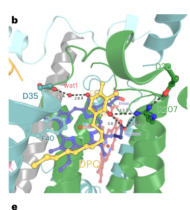

## Question

# Commissioned Review Brief

## Review Topic

Oxygenic photosynthesis module

## Working Scope

A taxon-neutral decomposition of oxygenic photosynthesis as a recursively decomposable module. The module separates the thylakoid light reactions (light harvesting, water oxidation at photosystem II, the cytochrome b6f complex, photosystem I, mobile electron carriers, ferredoxin-NADP+ reductase, and the ATP synthase) from carbon fixation by the Calvin-Benson-Bassham reductive pentose-phosphate cycle, and adds optional photoprotection/electron balancing, the inorganic carbon-concentrating mechanism, and chlorophyll supply. It is phrased as functions, complexes, and pathway segments rather than a fixed gene list so it can represent cyanobacterial, algal, and plant implementations. Anoxygenic photosynthesis (single reaction center, non-water electron donors) is explicitly out of scope.

## Provisional Biological Outline

- Oxygenic photosynthesis
  - 1. light reactions (electron transport and photophosphorylation)
  - Thylakoid light reactions
    - 1. light harvesting / antenna
    - Light-harvesting antenna
      - Antenna chlorophyll/carotenoid light capture (molecular player: light-harvesting chlorophyll a/b binding (LHC) family; activity or role: chlorophyll binding for excitation energy transfer)
    - 2. water oxidation (photosystem II)
    - Photosystem II (water:plastoquinone oxidoreductase)
      - Light-driven water oxidation / oxygen evolution (molecular player: photosystem II complex; activity or role: oxygen evolving activity)
    - 3. plastoquinol oxidation and proton translocation (cytochrome b6f)
    - Cytochrome b6f complex
      - Plastoquinol--plastocyanin reductase (Q-cycle) (molecular player: cytochrome b6f complex; activity or role: plastoquinol--plastocyanin reductase activity)
    - 4. inter-photosystem mobile electron carrier
    - Mobile carrier from b6f to PSI
      - Alternative versions by lineage / metal availability: Plastocyanin vs cytochrome c6
        - Plastocyanin (copper carrier)
          - Plastocyanin electron transfer (molecular player: plastocyanin; activity or role: electron transfer activity)
        - Cytochrome c6 (iron carrier)
          - Cytochrome c6 electron transfer (molecular player: cytochrome c6; activity or role: electron transfer activity)
    - 5. P700 photo-oxidation and ferredoxin reduction (photosystem I)
    - Photosystem I (plastocyanin:ferredoxin oxidoreductase)
      - Light-driven ferredoxin reduction (molecular player: photosystem I complex; activity or role: light-driven plastocyanin:ferredoxin oxidoreduction)
    - 6. NADPH production
    - Ferredoxin-NADP+ reductase
      - Ferredoxin-NADP+ reductase (molecular player: ferredoxin-NADP+ reductase activity; activity or role: ferredoxin-NADP+ reductase activity)
    - 7. ATP synthesis from the proton-motive force
    - Thylakoid (chloroplast/cyanobacterial) ATP synthase
      - Proton-motive-force-driven ATP synthesis (molecular player: thylakoid ATP synthase (CF1FO); activity or role: proton-transporting ATP synthase activity, rotational mechanism)
  - 2. carbon fixation (Calvin-Benson-Bassham cycle)
  - Calvin-Benson-Bassham reductive pentose-phosphate cycle
    - 1. carboxylation
    - Rubisco carboxylation of RuBP
      - Ribulose-bisphosphate carboxylase (molecular player: ribulose-bisphosphate carboxylase activity; activity or role: ribulose-bisphosphate carboxylase activity)
    - 2. reduction phase
    - Reduction of 3-phosphoglycerate to triose phosphate
      - NADP-dependent glyceraldehyde-3-phosphate dehydrogenase (molecular player: chloroplastic GAPDH (GapA/GapB); activity or role: glyceraldehyde-3-phosphate dehydrogenase (NADP+) (phosphorylating) activity)
    - 3. regeneration phase
    - Regeneration of ribulose 1,5-bisphosphate
      - Phosphoribulokinase (molecular player: phosphoribulokinase activity; activity or role: phosphoribulokinase activity)
      - Bisphosphatase regeneration steps (FBPase, SBPase) (molecular player: chloroplast FBPase / SBPase; activity or role: bisphosphatase regeneration steps)
    - 4. Rubisco activation and inhibitor repair
    - Rubisco activase and inhibitor removal
      - Rubisco activase (molecular player: Rubisco activase (Rca); activity or role: ATP-dependent removal of inhibitory sugar phosphates from Rubisco)
    - 5. redox gating of the CBB cycle
    - CP12-mediated redox regulation
      - CP12 redox scaffold (molecular player: CP12; activity or role: redox-dependent scaffolding of the PRK-GAPDH-CP12 ternary complex)
  - 3. photoprotection and ATP/NADPH balancing
  - Photoprotection and electron/energy balancing
    - Alternative versions by regulatory mechanism: Photoprotection and balancing mechanisms
      - Non-photochemical quenching (qE)
        - PsbS- and xanthophyll-cycle-dependent quenching (molecular player: PsbS and xanthophyll-cycle enzymes (VDE/ZEP); activity or role: heat dissipation of excess PSII excitation)
      - State transitions
        - STN7/Stt7-dependent LHCII redistribution (molecular player: state-transition kinase (STN7/Stt7) and TAP38/PPH1 phosphatase; activity or role: redox-controlled LHCII phosphorylation balancing PSII/PSI)
      - Cyclic electron flow around PSI
        - PGR5/PGRL1- and NDH-dependent cyclic electron flow (molecular player: PGR5/PGRL1 and NDH(-1) complex; activity or role: cyclic electron transfer generating extra proton-motive force)
  - 4. inorganic carbon-concentrating mechanism (CCM)
  - Carbon-concentrating mechanism
    - Carbonic anhydrase (CO2/HCO3- interconversion) (molecular player: carbonate dehydratase activity; activity or role: carbonate dehydratase activity)
    - Alternative versions by lineage / compartment: CCM compartmentation strategy
      - Cyanobacterial carboxysome CCM
        - Carboxysome microcompartment with encapsulated Rubisco/CA (molecular player: carboxysome shell and cargo (Ccm/Cso))
      - Algal pyrenoid CCM
        - Pyrenoid and bicarbonate transporter network (molecular player: pyrenoid CCM components (HLA3, LCIA, LCI1, LCIB, CAH3, CCM1/CIA5))
  - 5. chlorophyll supply (supporting context)
  - Chlorophyll biosynthesis (supporting)
    - Magnesium chelatase (committed step) (molecular player: magnesium chelatase (CHLH/CHLD/CHLI); activity or role: magnesium chelatase activity)
    - Protochlorophyllide reductase (molecular player: protochlorophyllide reductase activity; activity or role: protochlorophyllide reductase activity)

## Known Relationships Among Steps

- Thylakoid light reactions feeds into Calvin-Benson-Bassham reductive pentose-phosphate cycle: The light reactions supply the ATP and NADPH consumed by the Calvin-Benson-Bassham cycle.
- Carbon-concentrating mechanism promotes Rubisco carboxylation of RuBP: The CCM raises CO2 around Rubisco, favoring carboxylation over oxygenation.
- Photosystem II (water:plastoquinone oxidoreductase) feeds into Cytochrome b6f complex: PSII reduces plastoquinone to plastoquinol, the substrate oxidized by b6f.
- Cytochrome b6f complex feeds into Mobile carrier from b6f to PSI: b6f reduces the mobile lumenal carrier (plastocyanin or cyt c6).
- Mobile carrier from b6f to PSI feeds into Photosystem I (plastocyanin:ferredoxin oxidoreductase): The reduced carrier re-reduces photo-oxidized P700 in PSI.
- Photosystem I (plastocyanin:ferredoxin oxidoreductase) feeds into Ferredoxin-NADP+ reductase: PSI-reduced ferredoxin is the electron donor for FNR.
- Ferredoxin-NADP+ reductase precedes Thylakoid (chloroplast/cyanobacterial) ATP synthase: Linear electron flow and water oxidation build the proton-motive force used by the ATP synthase (coupling, not a metabolite hand-off).
- CP12 redox scaffold inhibits Phosphoribulokinase: CP12 inhibits PRK in the dark/oxidized state.
- CP12 redox scaffold inhibits NADP-dependent glyceraldehyde-3-phosphate dehydrogenase: CP12 inhibits GAPDH in the dark/oxidized state.

## Assignment

Write a rigorous, review-style synthesis suitable for a molecular biology
audience. Treat the topic as a biological system whose boundaries, core
mechanisms, variants, and unresolved points should be made clear to readers who
know the field but are not specialists in this specific process.

The review should be explanatory rather than encyclopedic. Anchor broad claims
in primary literature or authoritative reviews, but keep the focus on how the
system works and how its parts fit together.

## Questions To Address

1. **Scope and boundaries**
   - What exactly is included in this biological system?
   - Which neighboring pathways, organelle processes, complexes, or regulatory
     events are often confused with it but should be treated separately?
   - Are there competing definitions in the literature?

2. **Core mechanism**
   - What is the best current model for the sequence of events?
   - Which steps are obligatory, which are conditional, and which are accessory?
   - What molecular assemblies, enzymes, receptors, adaptors, transporters, or
     structural units carry out each major step?

3. **Variation**
   - How does the system vary across major evolutionary lineages?
   - Are there well-supported differences between cell types, tissues,
     developmental stages, physiological states, or compartments?
   - Where are there alternative routes that achieve a similar outcome by
     different molecular means?

4. **Conservation and origin**
   - What is the deepest plausible evolutionary origin of the system?
   - Which parts appear ancient and conserved, and which appear to be later
     elaborations, replacements, or lineage-specific losses?
   - When a protein family has expanded, which family members are the best
     representatives for understanding the ancestral role?

5. **Physical and biological constraints**
   - What steps must occur in a particular order?
   - Which events are mutually exclusive, compartment-specific, cell-type
     specific, substrate-specific, or stage-specific?
   - What evidence rules out otherwise plausible paths through the system?

6. **Evidence and controversy**
   - Which mechanistic claims are strongly supported by experiments?
   - Where does the literature disagree, rely on indirect evidence, or mix data
     from organisms that may not be comparable?
   - What are the most important open questions?

## Output Format

Use the style and structure of a concise review article:

1. Executive summary
2. Definition and biological boundaries
3. Mechanistic overview
4. Major molecular players and active assemblies
5. Evolutionary and cell-biological variation
6. Constraints, dependencies, and failure modes
7. Controversies and open questions
8. Key references

Include citations for major claims, preferably PMIDs or DOIs. Be explicit about
uncertainty and avoid overgeneralizing from one organism, cell type, or assay
system to all biology.

## Output

Question: You are an expert researcher providing comprehensive, well-cited information.

Provide detailed information focusing on:
1. Key concepts and definitions with current understanding
2. Recent developments and latest research (prioritize 2023-2024 sources)
3. Current applications and real-world implementations
4. Expert opinions and analysis from authoritative sources
5. Relevant statistics and data from recent studies

Format as a comprehensive research report with proper citations. Include URLs and publication dates where available.
Always prioritize recent, authoritative sources and provide specific citations for all major claims.

# Commissioned Review Brief

## Review Topic

Oxygenic photosynthesis module

## Working Scope

A taxon-neutral decomposition of oxygenic photosynthesis as a recursively decomposable module. The module separates the thylakoid light reactions (light harvesting, water oxidation at photosystem II, the cytochrome b6f complex, photosystem I, mobile electron carriers, ferredoxin-NADP+ reductase, and the ATP synthase) from carbon fixation by the Calvin-Benson-Bassham reductive pentose-phosphate cycle, and adds optional photoprotection/electron balancing, the inorganic carbon-concentrating mechanism, and chlorophyll supply. It is phrased as functions, complexes, and pathway segments rather than a fixed gene list so it can represent cyanobacterial, algal, and plant implementations. Anoxygenic photosynthesis (single reaction center, non-water electron donors) is explicitly out of scope.

## Provisional Biological Outline

- Oxygenic photosynthesis
  - 1. light reactions (electron transport and photophosphorylation)
  - Thylakoid light reactions
    - 1. light harvesting / antenna
    - Light-harvesting antenna
      - Antenna chlorophyll/carotenoid light capture (molecular player: light-harvesting chlorophyll a/b binding (LHC) family; activity or role: chlorophyll binding for excitation energy transfer)
    - 2. water oxidation (photosystem II)
    - Photosystem II (water:plastoquinone oxidoreductase)
      - Light-driven water oxidation / oxygen evolution (molecular player: photosystem II complex; activity or role: oxygen evolving activity)
    - 3. plastoquinol oxidation and proton translocation (cytochrome b6f)
    - Cytochrome b6f complex
      - Plastoquinol--plastocyanin reductase (Q-cycle) (molecular player: cytochrome b6f complex; activity or role: plastoquinol--plastocyanin reductase activity)
    - 4. inter-photosystem mobile electron carrier
    - Mobile carrier from b6f to PSI
      - Alternative versions by lineage / metal availability: Plastocyanin vs cytochrome c6
        - Plastocyanin (copper carrier)
          - Plastocyanin electron transfer (molecular player: plastocyanin; activity or role: electron transfer activity)
        - Cytochrome c6 (iron carrier)
          - Cytochrome c6 electron transfer (molecular player: cytochrome c6; activity or role: electron transfer activity)
    - 5. P700 photo-oxidation and ferredoxin reduction (photosystem I)
    - Photosystem I (plastocyanin:ferredoxin oxidoreductase)
      - Light-driven ferredoxin reduction (molecular player: photosystem I complex; activity or role: light-driven plastocyanin:ferredoxin oxidoreduction)
    - 6. NADPH production
    - Ferredoxin-NADP+ reductase
      - Ferredoxin-NADP+ reductase (molecular player: ferredoxin-NADP+ reductase activity; activity or role: ferredoxin-NADP+ reductase activity)
    - 7. ATP synthesis from the proton-motive force
    - Thylakoid (chloroplast/cyanobacterial) ATP synthase
      - Proton-motive-force-driven ATP synthesis (molecular player: thylakoid ATP synthase (CF1FO); activity or role: proton-transporting ATP synthase activity, rotational mechanism)
  - 2. carbon fixation (Calvin-Benson-Bassham cycle)
  - Calvin-Benson-Bassham reductive pentose-phosphate cycle
    - 1. carboxylation
    - Rubisco carboxylation of RuBP
      - Ribulose-bisphosphate carboxylase (molecular player: ribulose-bisphosphate carboxylase activity; activity or role: ribulose-bisphosphate carboxylase activity)
    - 2. reduction phase
    - Reduction of 3-phosphoglycerate to triose phosphate
      - NADP-dependent glyceraldehyde-3-phosphate dehydrogenase (molecular player: chloroplastic GAPDH (GapA/GapB); activity or role: glyceraldehyde-3-phosphate dehydrogenase (NADP+) (phosphorylating) activity)
    - 3. regeneration phase
    - Regeneration of ribulose 1,5-bisphosphate
      - Phosphoribulokinase (molecular player: phosphoribulokinase activity; activity or role: phosphoribulokinase activity)
      - Bisphosphatase regeneration steps (FBPase, SBPase) (molecular player: chloroplast FBPase / SBPase; activity or role: bisphosphatase regeneration steps)
    - 4. Rubisco activation and inhibitor repair
    - Rubisco activase and inhibitor removal
      - Rubisco activase (molecular player: Rubisco activase (Rca); activity or role: ATP-dependent removal of inhibitory sugar phosphates from Rubisco)
    - 5. redox gating of the CBB cycle
    - CP12-mediated redox regulation
      - CP12 redox scaffold (molecular player: CP12; activity or role: redox-dependent scaffolding of the PRK-GAPDH-CP12 ternary complex)
  - 3. photoprotection and ATP/NADPH balancing
  - Photoprotection and electron/energy balancing
    - Alternative versions by regulatory mechanism: Photoprotection and balancing mechanisms
      - Non-photochemical quenching (qE)
        - PsbS- and xanthophyll-cycle-dependent quenching (molecular player: PsbS and xanthophyll-cycle enzymes (VDE/ZEP); activity or role: heat dissipation of excess PSII excitation)
      - State transitions
        - STN7/Stt7-dependent LHCII redistribution (molecular player: state-transition kinase (STN7/Stt7) and TAP38/PPH1 phosphatase; activity or role: redox-controlled LHCII phosphorylation balancing PSII/PSI)
      - Cyclic electron flow around PSI
        - PGR5/PGRL1- and NDH-dependent cyclic electron flow (molecular player: PGR5/PGRL1 and NDH(-1) complex; activity or role: cyclic electron transfer generating extra proton-motive force)
  - 4. inorganic carbon-concentrating mechanism (CCM)
  - Carbon-concentrating mechanism
    - Carbonic anhydrase (CO2/HCO3- interconversion) (molecular player: carbonate dehydratase activity; activity or role: carbonate dehydratase activity)
    - Alternative versions by lineage / compartment: CCM compartmentation strategy
      - Cyanobacterial carboxysome CCM
        - Carboxysome microcompartment with encapsulated Rubisco/CA (molecular player: carboxysome shell and cargo (Ccm/Cso))
      - Algal pyrenoid CCM
        - Pyrenoid and bicarbonate transporter network (molecular player: pyrenoid CCM components (HLA3, LCIA, LCI1, LCIB, CAH3, CCM1/CIA5))
  - 5. chlorophyll supply (supporting context)
  - Chlorophyll biosynthesis (supporting)
    - Magnesium chelatase (committed step) (molecular player: magnesium chelatase (CHLH/CHLD/CHLI); activity or role: magnesium chelatase activity)
    - Protochlorophyllide reductase (molecular player: protochlorophyllide reductase activity; activity or role: protochlorophyllide reductase activity)

## Known Relationships Among Steps

- Thylakoid light reactions feeds into Calvin-Benson-Bassham reductive pentose-phosphate cycle: The light reactions supply the ATP and NADPH consumed by the Calvin-Benson-Bassham cycle.
- Carbon-concentrating mechanism promotes Rubisco carboxylation of RuBP: The CCM raises CO2 around Rubisco, favoring carboxylation over oxygenation.
- Photosystem II (water:plastoquinone oxidoreductase) feeds into Cytochrome b6f complex: PSII reduces plastoquinone to plastoquinol, the substrate oxidized by b6f.
- Cytochrome b6f complex feeds into Mobile carrier from b6f to PSI: b6f reduces the mobile lumenal carrier (plastocyanin or cyt c6).
- Mobile carrier from b6f to PSI feeds into Photosystem I (plastocyanin:ferredoxin oxidoreductase): The reduced carrier re-reduces photo-oxidized P700 in PSI.
- Photosystem I (plastocyanin:ferredoxin oxidoreductase) feeds into Ferredoxin-NADP+ reductase: PSI-reduced ferredoxin is the electron donor for FNR.
- Ferredoxin-NADP+ reductase precedes Thylakoid (chloroplast/cyanobacterial) ATP synthase: Linear electron flow and water oxidation build the proton-motive force used by the ATP synthase (coupling, not a metabolite hand-off).
- CP12 redox scaffold inhibits Phosphoribulokinase: CP12 inhibits PRK in the dark/oxidized state.
- CP12 redox scaffold inhibits NADP-dependent glyceraldehyde-3-phosphate dehydrogenase: CP12 inhibits GAPDH in the dark/oxidized state.

## Assignment

Write a rigorous, review-style synthesis suitable for a molecular biology
audience. Treat the topic as a biological system whose boundaries, core
mechanisms, variants, and unresolved points should be made clear to readers who
know the field but are not specialists in this specific process.

The review should be explanatory rather than encyclopedic. Anchor broad claims
in primary literature or authoritative reviews, but keep the focus on how the
system works and how its parts fit together.

## Questions To Address

1. **Scope and boundaries**
   - What exactly is included in this biological system?
   - Which neighboring pathways, organelle processes, complexes, or regulatory
     events are often confused with it but should be treated separately?
   - Are there competing definitions in the literature?

2. **Core mechanism**
   - What is the best current model for the sequence of events?
   - Which steps are obligatory, which are conditional, and which are accessory?
   - What molecular assemblies, enzymes, receptors, adaptors, transporters, or
     structural units carry out each major step?

3. **Variation**
   - How does the system vary across major evolutionary lineages?
   - Are there well-supported differences between cell types, tissues,
     developmental stages, physiological states, or compartments?
   - Where are there alternative routes that achieve a similar outcome by
     different molecular means?

4. **Conservation and origin**
   - What is the deepest plausible evolutionary origin of the system?
   - Which parts appear ancient and conserved, and which appear to be later
     elaborations, replacements, or lineage-specific losses?
   - When a protein family has expanded, which family members are the best
     representatives for understanding the ancestral role?

5. **Physical and biological constraints**
   - What steps must occur in a particular order?
   - Which events are mutually exclusive, compartment-specific, cell-type
     specific, substrate-specific, or stage-specific?
   - What evidence rules out otherwise plausible paths through the system?

6. **Evidence and controversy**
   - Which mechanistic claims are strongly supported by experiments?
   - Where does the literature disagree, rely on indirect evidence, or mix data
     from organisms that may not be comparable?
   - What are the most important open questions?

## Output Format

Use the style and structure of a concise review article:

1. Executive summary
2. Definition and biological boundaries
3. Mechanistic overview
4. Major molecular players and active assemblies
5. Evolutionary and cell-biological variation
6. Constraints, dependencies, and failure modes
7. Controversies and open questions
8. Key references

Include citations for major claims, preferably PMIDs or DOIs. Be explicit about
uncertainty and avoid overgeneralizing from one organism, cell type, or assay
system to all biology.

## Oxygenic photosynthesis module — research report (2024-focused)

### 1. Executive summary
Oxygenic photosynthesis can be decomposed as a recursively decomposable *module* comprising (i) thylakoid light reactions that convert light energy into ATP and NADPH while oxidizing water to O2, and (ii) the Calvin–Benson–Bassham (CBB) cycle that uses ATP/NADPH to fix CO2 into carbohydrates. Optional but functionally coupled extensions include (iii) photoprotection and electron/energy balancing (e.g., NPQ, state transitions, cyclic electron flow), (iv) inorganic carbon-concentrating mechanisms (CCMs) that elevate CO2 near Rubisco (carboxysomes in cyanobacteria; pyrenoids in many algae), and (v) chlorophyll/tetrapyrrole supply and its quality-control logic (e.g., Mg-chelatase commitment, protochlorophyllide reduction, flux control to prevent phototoxic intermediates). This functional decomposition is taxon-neutral and maps cleanly onto cyanobacterial, algal, and plant implementations while keeping anoxygenic photosynthesis explicitly out of scope. (kılıcUnknownyearphotosyntheticsignalingupon pages 16-19, kılıcUnknownyearphotosyntheticsignalingupon pages 12-16, karthick2024improvingcropyield pages 6-8)

Recent advances (2024) that materially refine mechanistic understanding include: (a) near-atomic cryo-EM structures of plant cytochrome b6f that revise the substrate geometry at the plastoquinone-reduction (Qn) site and propose a quinone–water exchange mechanism with defined proton/water channels; (b) proteomics of Chlamydomonas pyrenoid-traversing thylakoid tubules that expands the candidate parts list for the pyrenoid CCM; and (c) discovery of a membrane-anchored tetratricopeptide repeat scaffold (TTP1) that assembles tetrapyrrole biosynthetic enzymes (GluTR/POR/CHL27/GBP/FLU), tuning ALA/chlorophyll flux and greening/ROS phenotypes. (pintscher2024molecularbasisof pages 4-5, franklin2024proteomicanalysisof pages 13-16, herbst2024anoveltetratricopeptiderepeat pages 1-2)

### 2. Definition and biological boundaries
#### 2.1 Included in the module
**Core (obligatory in oxygenic phototrophs):**
- **Thylakoid light reactions / photosynthetic electron transport**: PSII-driven water oxidation, plastoquinone pool reduction/oxidation, cytochrome b6f, mobile lumenal carrier (plastocyanin or cytochrome c6), PSI-driven ferredoxin reduction, ferredoxin–NADP+ reductase (FNR), and ATP synthase driven by proton-motive force (pmf). (kılıcUnknownyearphotosyntheticsignalingupon pages 16-19, kılıcUnknownyearphotosyntheticsignalingupon pages 12-16)
- **CBB cycle carbon fixation**: Rubisco carboxylation, reduction of 3-phosphoglycerate to triose phosphate, and regeneration of ribulose-1,5-bisphosphate (RuBP) via PRK and bisphosphatases (FBPase/SBPase), plus activation/regulation layers such as Rubisco activase and CP12-mediated redox gating. (meloni2024studyofphotosynthetic pages 110-111, karthick2024improvingcropyield pages 6-8)

**Optional/accessory extensions (context-dependent):**
- **Photoprotection and ATP/NADPH balancing** (NPQ, state transitions, cyclic electron flow and auxiliary electron sinks). (milrad2024regulationofmicroalgal pages 19-20, kılıcUnknownyearphotosyntheticsignalingupon pages 16-19)
- **Inorganic CCM** (carboxysomes or pyrenoids plus CA/transport network) to raise CO2 around Rubisco. (fakhimi2024photosyntheticelectronflows pages 14-16, karthick2024improvingcropyield pages 6-8)
- **Chlorophyll/tetrapyrrole supply and assembly-linked regulation** (e.g., Mg-chelatase commitment and POR-dependent greening logic). (herbst2024anoveltetratricopeptiderepeat pages 1-2, liu2024brchli1mutationinduces pages 1-2)

#### 2.2 Excluded / adjacent processes that should be treated separately
- **Anoxygenic photosynthesis** (single reaction center, non-water electron donors) is excluded by definition.
- **Photorespiration** and broader central carbon metabolism (e.g., starch/sucrose partitioning, mitochondrial interactions) are adjacent systems. They strongly influence net carbon gain but are not part of the oxygenic photosynthesis core module as defined here. (fakhimi2024photosyntheticelectronflows pages 14-16, karthick2024improvingcropyield pages 6-8)
- **Chloroplast biogenesis, thylakoid ultrastructure control, and organellar gene expression** regulate photosynthesis capacity but are separable; only the subset directly enabling module function (e.g., pigment supply quality control) is included. (herbst2024anoveltetratricopeptiderepeat pages 1-2, milrad2024regulationofmicroalgal pages 19-20)

#### 2.3 Competing definitions in the literature
Many sources treat “photosynthesis” broadly to include photorespiration, whole-chloroplast metabolism, and plant development/yield. For a molecular-systems decomposition, it is more operationally consistent to define oxygenic photosynthesis as **energy transduction in the thylakoid plus CO2 fixation in the CBB cycle**, with optional *add-on* modules for protection/balancing, CCMs, and pigment supply. This boundary is also the most useful for comparative biology (cyanobacteria ↔ algae ↔ plants) and synthetic-biology transfer. (karthick2024improvingcropyield pages 6-8, fakhimi2024photosyntheticelectronflows pages 14-16)

### 3. Mechanistic overview (best current model)
#### 3.1 Sequence of events in the light reactions (linear electron flow as backbone)
A consensus chain (taxon-neutral) is:
1) **PSII photochemistry and water oxidation**: light drives charge separation at PSII; electrons are extracted from water at the oxygen-evolving complex and transferred to plastoquinone via QA/QB, forming plastoquinol (PQH2). (kılıcUnknownyearphotosyntheticsignalingupon pages 12-16)
2) **Cytochrome b6f and the Q-cycle**: PQH2 oxidation at the Qo/Qp site releases protons into the lumen and splits electrons; one electron goes via the Rieske 2Fe–2S cluster to cytochrome f and onward to the lumenal mobile carrier, while the other electron cycles through b hemes to support quinone reduction at Qn/Qi, contributing to proton uptake from the stroma side. (kılıcUnknownyearphotosyntheticsignalingupon pages 16-19)
3) **Inter-photosystem mobile carrier**: **plastocyanin (Cu)** or **cytochrome c6 (Fe)** carries electrons in the lumen from cytochrome f to PSI; lineage/metal availability influences which carrier dominates. (kılıcUnknownyearphotosyntheticsignalingupon pages 12-16)
4) **PSI photochemistry**: excitation funnels to P700; electrons traverse A0/A1 and Fe–S centers (FX/FA/FB) to ferredoxin (Fd). (kılıcUnknownyearphotosyntheticsignalingupon pages 16-19)
5) **NADPH production**: Fd reduces NADP+ to NADPH via FNR. (kılıcUnknownyearphotosyntheticsignalingupon pages 12-16)
6) **ATP synthesis**: pmf (ΔpH + Δψ) generated by water oxidation and b6f proton translocation drives CF1FO ATP synthase rotary catalysis to produce ATP. (kılıcUnknownyearphotosyntheticsignalingupon pages 16-19)

This backbone is *obligatory* for oxygenic photosynthesis, while cyclic electron flow and alternative sinks are conditional (see §3.3). (kılıcUnknownyearphotosyntheticsignalingupon pages 16-19, milrad2024regulationofmicroalgal pages 19-20)

#### 3.2 CBB cycle (carbon fixation module)
The CBB cycle consumes ATP and NADPH produced by the light reactions and can be decomposed into:
- **Carboxylation**: Rubisco fixes CO2 onto RuBP.
- **Reduction**: 3-PGA is reduced to triose phosphate (via PGK and NADP-dependent GAPDH in chloroplasts).
- **Regeneration**: RuBP regeneration requires PRK and bisphosphatases including SBPase/FBPase.

Regulatory layers commonly highlighted in contemporary synthesis include (i) **Rubisco activase** (Rca) as a key determinant of Rubisco activation state, particularly under temperature stress, and (ii) **CP12** as a redox-dependent scaffold that forms inhibitory complexes with GAPDH and PRK (dark/oxidized state), linking thioredoxin redox to CBB gating. (karthick2024improvingcropyield pages 6-8, meloni2024studyofphotosynthetic pages 110-111)

#### 3.3 Photoprotection and balancing (conditional but often essential in fluctuating environments)
In variable light, oxygenic phototrophs deploy a portfolio of adjustments:
- **Non-photochemical quenching (NPQ)** dissipates excess excitation as heat; its localization and components vary across algae/diatoms/plants, but the shared system-level role is to prevent over-reduction and photodamage. (milrad2024regulationofmicroalgal pages 19-20)
- **State transitions** redistribute antenna excitation between PSII and PSI via redox-linked protein phosphorylation (e.g., Stt7 kinase in algae), described as rebalancing rather than dissipation. (milrad2024regulationofmicroalgal pages 19-20)
- **Cyclic electron flow around PSI (CEF)** increases pmf/ATP without net NADPH formation, helping tune the ATP:NADPH ratio and supporting lumen acidification-dependent control points. (kılıcUnknownyearphotosyntheticsignalingupon pages 16-19, odoom2024roleofphosphorus pages 12-15)

### 4. Major molecular players and active assemblies (2024 highlights)
#### 4.1 Cytochrome b6f: revised Qn-site mechanism from near-atomic cryo-EM
A major 2024 advance is the near-atomic cryo-EM characterization of spinach cytochrome b6f captured at **1.9 Å** (DPQ-supplemented) and **2.2 Å** (“during catalysis”), enabling explicit placement of hundreds of water molecules (**329 waters at 1.9 Å** and **214 at 2.2 Å** in the authors’ models). (pintscher2024molecularbasisof pages 3-4)

Key mechanistic implications:
- **Unexpected PQ orientation and lack of direct heme ligation**: plastoquinone at Qn is tilted (~**37° relative to the heme cn plane**) and does **not** bind the heme iron directly; this distinguishes substrate binding from inhibitor binding modes. (pintscher2024molecularbasisof pages 3-4)
- **Water-mediated proton donation**: a specific water molecule (**wat1**) is coordinated between the PQ carbonyl (O4) and **Asp35 of subunit IV (D35suIV)**, positioned to serve as an immediate proton donor during PQ reduction; on the opposite side, **Arg207 of cyt b6 (R207b6)** and heme propionates interact with the other carbonyl (O1), supporting a two-sided proton/electron choreography. (pintscher2024molecularbasisof pages 3-4, pintscher2024molecularbasisof pages 5-6)
- **Water channels and “quinone–water exchange” model**: the authors map multiple water-filled channels linking the Qn niche to the aqueous exterior and propose a multi-state mechanism in which PQ binding displaces waters through channels and PQH2 exit allows refilling, coupling substrate/product exchange to proton availability. These features are depicted directly in the paper’s figures. (pintscher2024molecularbasisof pages 4-5, pintscher2024molecularbasisof media a9bca432)

These structural refinements matter system-wide because cytochrome b6f is a dominant kinetic control point (“photosynthetic control”) and a key interface where lumen pH/pmf can throttle electron throughput in fluctuating light. (milrad2024regulationofmicroalgal pages 19-20, pintscher2024molecularbasisof pages 4-5)

#### 4.2 Pyrenoid CCM (algae): pyrenoid-traversing membranes as a distinct functional submodule
Algal CCMs often center on a **pyrenoid**: a Rubisco-rich condensate/microcompartment functionally analogous to carboxysomes, with thylakoid membranes traversing the pyrenoid and hosting carbonic anhydrase activity that generates CO2 near Rubisco. (fakhimi2024photosyntheticelectronflows pages 14-16, karthick2024improvingcropyield pages 6-8)

A 2024 New Phytologist study provides the **first proteomic map of pyrenoid-traversing membranes** in *Chlamydomonas reinhardtii* using membrane-fragment affinity purification rather than detergent solubilization. The approach recovered known tubule-associated proteins including **RBMP1/2**, **MITH1**, and importantly the **luminal carbonic anhydrase CAH3**, demonstrating capture of lumen-proximal factors. (franklin2024proteomicanalysisof pages 11-13)

New candidate components:
- The proteome identified two under-characterized proteins as high-confidence tubule-associated factors: **LCI16/ELI4** (an LHC-like 3-helix domain protein related to ELIP/stress LHC families) and a novel protein **PME1 (Pyrenoid Membrane–Enriched 1)**; LCI16 physically associates with PME1 and RBMP2 in affinity purifications. (franklin2024proteomicanalysisof pages 13-16, franklin2024proteomicanalysisof pages 16-18)
- **Phenotypic interpretation**: insertional **lci16** and **pme1** mutants retained wild-type tubule morphology and largely normal growth under CO2-limiting conditions, implying these are not strictly required for baseline CCM function under the tested conditions; however, proteomic signatures suggested broader regulatory coupling to CCM-related protein expression. (franklin2024proteomicanalysisof pages 13-16, franklin2024proteomicanalysisof pages 16-18)

#### 4.3 Chlorophyll supply and tetrapyrrole flux control: TTP1 as an organizing scaffold
Chlorophyll supply is not simply a “biosynthetic pathway” but a controlled module that must balance pigment production with avoidance of phototoxic intermediates.

A 2024 Journal of Experimental Botany study identifies **TTP1** (a plastid-localized, membrane-bound 5-TPR protein with an N-terminal transmembrane segment) as a scaffold that interacts with **GluTR** (rate-limiting ALA synthesis), **PORB/PORC** (protochlorophyllide oxidoreductases), **CHL27**, **GBP**, and (more weakly/conditionally) **FLU**—connecting early ALA control and later chlorophyll synthesis steps at thylakoid-associated “hot spots.” (herbst2024anoveltetratricopeptiderepeat pages 11-14, herbst2024anoveltetratricopeptiderepeat pages 1-2)

Quantitative/phenotypic observations reported include:
- **Delayed greening**: after transfer from etiolation to continuous light, only about **40–50%** of *ttp1* seedlings green by 48 h versus nearly all wild type; overexpression rescues greening delay. (herbst2024anoveltetratricopeptiderepeat pages 8-11)
- **Protein-level control**: PORB protein is reduced by **~31–63%** in *ttp1* alleles, while GluTR and GBP increase, indicating post-transcriptional stability/localization control rather than simple gene-expression effects. (herbst2024anoveltetratricopeptiderepeat pages 5-6)
- **Biophysical binding**: microscale thermophoresis indicates tight association of TTP1 with GluTR/GBP/POR (reported as **Kd < 1 μM** for several interactions), consistent with a bona fide complex-forming role. (herbst2024anoveltetratricopeptiderepeat pages 11-14)

Together these data support a model in which oxygenic photosynthesis requires an **auxiliary pigment-supply quality-control layer** that coordinates enzyme localization/complex formation to match photosystem assembly/repair demand and minimize ROS risk. (herbst2024anoveltetratricopeptiderepeat pages 1-2, herbst2024anoveltetratricopeptiderepeat pages 14-15)

#### 4.4 Mg-chelatase commitment step and failure modes
Mg-chelatase commits tetrapyrrole flux toward chlorophyll by inserting Mg2+ into protoporphyrin IX; disruption yields classic chlorosis and reduced photosynthetic capacity.

A 2024 *Frontiers in Plant Science* study in Chinese cabbage reports that an EMS-derived **CHLI (Mg-chelatase I subunit)** point mutation (Asp→Asn) causes a bright-yellow leaf phenotype, **reduced chlorophyll content**, **lower net photosynthetic rate (Pn)**, and **decreased NPQ**, with incomplete chloroplast development; severity is light-dependent (partial recovery under weak light). The mechanistic interpretation is consistent with CHLI functioning as an **AAA+ ATP-dependent** subunit whose oligomeric interactions are necessary for Mg-chelatase activity; the mutation weakened CHLI self-interaction while retaining interaction with CHLD. (liu2024brchli1mutationinduces pages 9-11, liu2024brchli1mutationinduces pages 2-3)

### 5. Evolutionary and cell-biological variation
#### 5.1 Lineage-level architectural variants (taxon-neutral mapping)
- **Antennae**: cyanobacteria often use phycobilisomes, while green lineage plants use LHC antennae; algae exhibit diverse antenna architectures and dynamic remodeling. (kılıcUnknownyearphotosyntheticsignalingupon pages 12-16, milrad2024regulationofmicroalgal pages 19-20)
- **PSI oligomerization**: PSI is described as monomeric in plants and trimeric in cyanobacteria, with associated differences in antenna coupling and supercomplex formation. (kılıcUnknownyearphotosyntheticsignalingupon pages 16-19)
- **Mobile lumenal electron carriers**: plastocyanin vs cytochrome c6 represents a modular interchange shaped by metal availability and lineage history. (kılıcUnknownyearphotosyntheticsignalingupon pages 12-16)
- **CCM strategies**: cyanobacteria employ carboxysomes; many algae employ pyrenoids with traversing thylakoid tubules and localized CAH3; C3 plants lack a native biophysical CCM but are targets for engineering pyrenoid/carboxysome-like systems. (fakhimi2024photosyntheticelectronflows pages 14-16, karthick2024improvingcropyield pages 6-8)

#### 5.2 State/compartment dependence
- Thylakoid lumen pH and pmf are central state variables that simultaneously influence NPQ induction, cytochrome b6f kinetics, and ATP synthase conductance; in microalgae, repression of ATP synthase can overacidify the lumen and restrict electron transport and CO2 assimilation. (milrad2024regulationofmicroalgal pages 19-20)
- Chlorophyll/tetrapyrrole synthesis exhibits strong developmental-state dependence (etiolation → greening), with POR-dependent control and auxiliary scaffolds (e.g., TTP1) affecting greening success and ROS sensitivity. (herbst2024anoveltetratricopeptiderepeat pages 8-11, herbst2024anoveltetratricopeptiderepeat pages 1-2)

### 6. Constraints, dependencies, and failure modes
#### 6.1 Ordering constraints
- PSII must oxidize water and deliver electrons to the PQ pool before cytochrome b6f can operate at high flux; b6f must reduce the lumenal carrier before PSI can sustain ferredoxin/NADPH production in linear flow. (kılıcUnknownyearphotosyntheticsignalingupon pages 12-16)
- Proton translocation (water oxidation + Q-cycle) must precede and sustain ATP synthase turnover because ATP synthesis is directly driven by pmf. (kılıcUnknownyearphotosyntheticsignalingupon pages 16-19)

#### 6.2 Coupling constraints between submodules
- CBB flux is constrained by ATP/NADPH supply and by activation state of Rubisco and RuBP regeneration enzymes; engineering SBPase/Rubisco activase is repeatedly identified as a leverage point for increasing carbon gain and yield. (karthick2024improvingcropyield pages 6-8)
- CCMs increase CO2 near Rubisco but impose energetic and structural requirements; reaction–diffusion modeling cited in crop-focused synthesis highlights that effective pyrenoid CCM function requires a set of modules (Ci uptake, lumenal conversion, diffusion barriers and Rubisco condensation), and omitting a module increases ATP cost per CO2 and reduces achievable concentration. (karthick2024improvingcropyield pages 8-9)

#### 6.3 Failure modes
- Impairing Mg-chelatase (CHLI) reduces chlorophyll supply, causing chloroplast developmental defects and reduced NPQ/Pn; phenotype severity can be light-dependent due to excitation pressure and photodamage risk. (liu2024brchli1mutationinduces pages 9-11)
- Disrupting tetrapyrrole flux control (TTP1) destabilizes POR pools and alters ALA synthesis/localization, yielding delayed greening and increased ROS sensitivity—illustrating that pigment supply is a controlled safety-critical module, not a passive feedstock pathway. (herbst2024anoveltetratricopeptiderepeat pages 1-2, herbst2024anoveltetratricopeptiderepeat pages 8-11)

### 7. Controversies and open questions (expert synthesis from 2024 sources)
1) **How universal are specific regulatory architectures across taxa?** Microalgae show both ubiquitous protective mechanisms and lineage-specific regulatory strategies; caution is required when extrapolating plant NPQ/state-transition logic to diatoms or other algae. (milrad2024regulationofmicroalgal pages 19-20)
2) **Mechanistic closure for b6f catalysis and photosynthetic control**: even with atomic structures, translating static conformations into a complete kinetic/proton-transfer mechanism remains nontrivial; the 2024 Qn-site revision strongly suggests water-channel coupling but leaves open how these states interconvert in vivo under changing pmf and redox poise. (pintscher2024molecularbasisof pages 4-5, pintscher2024molecularbasisof pages 9-10)
3) **Minimal parts list for an algal pyrenoid CCM**: proteomics adds candidate tubule components (LCI16/PME1), yet mutants show mild phenotypes under baseline tests, suggesting redundancy, conditional importance, or regulatory rather than structural roles. (franklin2024proteomicanalysisof pages 13-16, franklin2024proteomicanalysisof pages 18-21)
4) **Engineering transferability**: reviews aimed at yield improvement emphasize pyrenoid/carboxysome transfer as a major opportunity for C3 crops, but note unresolved requirements for full pyrenoid assembly and field-level validation gaps. (karthick2024improvingcropyield pages 6-8)

### 8. Current applications and real-world implementations
#### 8.1 Crop photosynthesis improvement and climate resilience
- Contemporary applied strategies focus on boosting carbon gain by engineering **Rubisco/Rubisco activase** (including thermostability), enhancing **RuBP regeneration** (e.g., SBPase), and introducing **CO2-concentrating mechanisms** into C3 crops (pyrenoid/carboxysome-inspired). These are framed as yield-relevant levers with ongoing progress but incomplete field validation. (karthick2024improvingcropyield pages 6-8)

#### 8.2 Algal biotechnology and CCM-informed strain design
- Algal CCM understanding (transporters such as HLA3/LCIA/BSTs and localized CAH3 function in pyrenoid-traversing thylakoids) is directly relevant to microalgal productivity engineering and to interpreting metabolic trafficking demands across chloroplast and mitochondrion. (fakhimi2024photosyntheticelectronflows pages 14-16)

### 9. Key quantitative data points from recent studies (2024)
- **Cytochrome b6f cryo-EM**: 1.9 Å and 2.2 Å structures; 329 waters (1.9 Å model) and 214 waters (2.2 Å model); PQ tilt ~37°; proposed wat1-mediated proton donation with mapped water channels. (pintscher2024molecularbasisof pages 3-4, pintscher2024molecularbasisof media a9bca432)
- **TTP1 scaffold**: Kd < 1 μM for several interactions (TTP1 with GluTR/GBP/POR); PORB reduction ~31–63% in *ttp1* alleles; greening success ~40–50% at 48 h (ttp1) vs near-complete wild-type greening under the tested conditions. (herbst2024anoveltetratricopeptiderepeat pages 11-14, herbst2024anoveltetratricopeptiderepeat pages 5-6, herbst2024anoveltetratricopeptiderepeat pages 8-11)
- **CCM magnitude (context)**: C4-like concentrating contexts are described as reaching ~10× higher inorganic carbon around Rubisco (not a universal oxygenic-photosynthesis value, but a commonly cited order-of-magnitude for CO2 concentrating effects). (karthick2024improvingcropyield pages 6-8)

### 10. Systems decomposition table
The following table summarizes the module’s functional decomposition, lineage variants, and 2024 evidence anchors.

| Submodule | Core function/output | Key molecular assemblies/players (taxon-neutral) | Major lineage variants (cyanobacteria vs algae vs plants) | Selected recent evidence (2024) with DOI/URL |
|---|---|---|---|---|
| Thylakoid light harvesting and linear electron flow | Capture light; oxidize water; transfer electrons from H2O to NADP+; build proton-motive force for ATP synthesis | Antenna systems; PSII with oxygen-evolving complex; plastoquinone/plastoquinol pool; cytochrome b6f; lumenal mobile carrier (plastocyanin or cytochrome c6); PSI; ferredoxin; FNR; CF1FO ATP synthase (kılıcUnknownyearphotosyntheticsignalingupon pages 16-19, kılıcUnknownyearphotosyntheticsignalingupon pages 12-16) | Cyanobacteria: phycobilisome antennae, carboxysome-containing cells, plastocyanin and/or cytochrome c6; Algae: mixed antenna strategies, plastocyanin/cytochrome c6 usage varies with metal availability; Plants: LHC antennae, strong grana/stroma-lamella segregation, plastocyanin dominant (kılıcUnknownyearphotosyntheticsignalingupon pages 16-19, kılıcUnknownyearphotosyntheticsignalingupon pages 12-16) | Milrad et al. 2024 review microalgal tuning of electron transfer and thylakoid regulation, doi:10.3390/plants13152103, https://doi.org/10.3390/plants13152103 (milrad2024regulationofmicroalgal pages 19-20); core chain description in Kılıç text (kılıcUnknownyearphotosyntheticsignalingupon pages 16-19, kılıcUnknownyearphotosyntheticsignalingupon pages 12-16) |
| Cytochrome b6f Q-cycle / PQH2 oxidation and PQ reduction | Couples electron transfer between PSII and PSI to lumen acidification; major control point for photosynthetic electron transport | Cytochrome b6f dimer; Qo/Qp and Qn/Qi quinone sites; Rieske ISP head domain; hemes bL, bH, f, cn; subunit IV; bound waters/proton channels (pintscher2024molecularbasisof pages 4-5, pintscher2024molecularbasisof pages 1-2, pintscher2024molecularbasisof pages 5-6, pintscher2024molecularbasisof pages 3-4) | Conserved core architecture across cyanobacteria, algae, plants; recent structural revision reported for plant Qn site with distinct substrate vs inhibitor binding geometry and water-mediated proton delivery (pintscher2024molecularbasisof pages 4-5, pintscher2024molecularbasisof pages 3-4) | Pintscher et al. 2024 resolved spinach b6f at 1.9/2.2 Å, showing PQ tilted ~37 degrees, no direct heme-cn ligation, wat1 as immediate proton donor, and water channels linked to D35sIV/R207b6; doi:10.1038/s41477-024-01804-x, https://doi.org/10.1038/s41477-024-01804-x (pintscher2024molecularbasisof pages 4-5, pintscher2024molecularbasisof pages 1-2, pintscher2024molecularbasisof pages 5-6, pintscher2024molecularbasisof pages 3-4, pintscher2024molecularbasisof media a9bca432) |
| PSI acceptor-side reduction and NADPH formation | Re-reduce photooxidized P700 and produce reduced ferredoxin/NADPH for downstream metabolism | PSI reaction center; LHCI/associated antenna; plastocyanin or cytochrome c6 donor; Fe-S chain (A0/A1/FX/FA/FB); ferredoxin; FNR (kılıcUnknownyearphotosyntheticsignalingupon pages 16-19, kılıcUnknownyearphotosyntheticsignalingupon pages 12-16) | Cyanobacteria often use PSI trimers/oligomers and can interface with flavodiiron proteins; Plants have monomeric PSI with LHCI; Algae show lineage-specific PSI supercomplex remodeling under dynamic light (milrad2024regulationofmicroalgal pages 19-20, kılıcUnknownyearphotosyntheticsignalingupon pages 16-19) | Milrad et al. 2024 summarize microalgal PSI-linked regulatory adaptations and supercomplex remodeling, doi:10.3390/plants13152103, https://doi.org/10.3390/plants13152103 (milrad2024regulationofmicroalgal pages 19-20); core PSI electron path in Kılıç text (kılıcUnknownyearphotosyntheticsignalingupon pages 16-19, kılıcUnknownyearphotosyntheticsignalingupon pages 12-16) |
| ATP synthesis from pmf | Convert trans-thylakoid proton-motive force into ATP for carbon fixation and chloroplast metabolism | Thylakoid CF1FO ATP synthase; c-ring rotor; F1 catalytic head; pmf generated by PSII water oxidation and b6f proton translocation (kılıcUnknownyearphotosyntheticsignalingupon pages 16-19, kılıcUnknownyearphotosyntheticsignalingupon pages 12-16) | All oxygenic lineages use homologous rotary ATP synthase; relative ATP demand and regulation differ with CCM strength, cyclic flow, and chloroplast architecture (milrad2024regulationofmicroalgal pages 19-20, odoom2024roleofphosphorus pages 12-15) | Milrad et al. 2024 note ATP synthase repression can overacidify lumen and restrict electron transport/CO2 assimilation in algae, doi:10.3390/plants13152103, https://doi.org/10.3390/plants13152103 (milrad2024regulationofmicroalgal pages 19-20); ATP synthase mechanism summarized in Kılıç text (kılıcUnknownyearphotosyntheticsignalingupon pages 16-19) |
| Calvin-Benson-Bassham cycle | Fix CO2 into triose phosphate using ATP and NADPH; regenerate RuBP | Rubisco; phosphoribulokinase (PRK); GAPDH; FBPase/SBPase; ancillary redox/regulatory factors such as Rubisco activase and CP12 (module boundary: fixation separate from thylakoid electron transport, though dependent on its ATP/NADPH output) (meloni2024studyofphotosynthetic pages 110-111, karthick2024improvingcropyield pages 6-8) | Present in cyanobacteria, algae, and plants; implementation differs in compartmentation and regulatory overlay, especially where CCMs condense Rubisco into carboxysomes or pyrenoids (meloni2024studyofphotosynthetic pages 110-111, karthick2024improvingcropyield pages 6-8) | Karthick et al. 2024 discuss engineering SBPase, Rubisco, and Rubisco activase to raise carbon gain and yield, doi:10.3390/plants13101317, https://doi.org/10.3390/plants13101317 (karthick2024improvingcropyield pages 6-8); Meloni 2024 compiles CP12/PRK/GAPDH regulatory literature (meloni2024studyofphotosynthetic pages 110-111) |
| Photoprotection and ATP/NADPH balancing | Prevent photodamage and rebalance excitation/electron flux under changing light or metabolic demand | Non-photochemical quenching machinery; state-transition kinase/phosphatase systems; cyclic electron flow routes around PSI; redox-responsive thylakoid phosphorylation and lumen-pH control (milrad2024regulationofmicroalgal pages 19-20, kılıcUnknownyearphotosyntheticsignalingupon pages 16-19) | Cyanobacteria rely on distinct antenna regulation and alternative electron sinks; Algae often show strong dynamic-light acclimation and lineage-specific NPQ localization; Plants emphasize PsbS/xanthophyll-cycle qE, STN7/TAP38 state transitions, PGR5/PGRL1 and NDH cyclic flow (milrad2024regulationofmicroalgal pages 19-20, kılıcUnknownyearphotosyntheticsignalingupon pages 16-19) | Milrad et al. 2024 review microalgal NPQ tuning, Stt7-mediated state transitions, and lumen-pH/b6f control, doi:10.3390/plants13152103, https://doi.org/10.3390/plants13152103 (milrad2024regulationofmicroalgal pages 19-20); Kılıç text summarizes NPQ, STN7, PGR5/PGRL1 placement in the system (kılıcUnknownyearphotosyntheticsignalingupon pages 16-19, kılıcUnknownyearphotosyntheticsignalingupon pages 12-16) |
| Inorganic carbon-concentrating mechanism (CCM) | Raise CO2 around Rubisco to favor carboxylation over oxygenation and improve carbon gain | Carbonic anhydrases; bicarbonate/CO2 transporters; diffusion barriers; Rubisco-condensing compartments; pyrenoid- or carboxysome-associated thylakoid/envelope transport network (karthick2024improvingcropyield pages 6-8, karthick2024improvingcropyield pages 8-9, fakhimi2024photosyntheticelectronflows pages 14-16) | Cyanobacteria: carboxysomes plus Ci transporters; Algae: pyrenoid matrix with traversing thylakoid tubules, CAH3, HLA3/LCIA/LCIB/BST network; Plants: no native biophysical CCM in C3 chloroplasts, but active engineering target (karthick2024improvingcropyield pages 6-8, karthick2024improvingcropyield pages 8-9, fakhimi2024photosyntheticelectronflows pages 14-16) | Karthick et al. 2024 summarize pyrenoid and carboxysome engineering logic, transporters, and estimated ~10-fold CO2 elevation in C4-like concentrating contexts, doi:10.3390/plants13101317, https://doi.org/10.3390/plants13101317 (karthick2024improvingcropyield pages 6-8); Fakhimi & Grossman 2024 review CAH1/CAH3, HLA3, LCIA, BST-mediated trafficking, doi:10.3390/plants13213015, https://doi.org/10.3390/plants13213015 (fakhimi2024photosyntheticelectronflows pages 14-16) |
| Algal pyrenoid tubule submodule | Deliver concentrated Ci through pyrenoid-traversing thylakoids and support local CO2 generation near Rubisco | Pyrenoid-traversing membrane network; CAH3; RBMP1/2; MITH1; LCI16/ELI4; PME1 (franklin2024proteomicanalysisof pages 13-16, franklin2024proteomicanalysisof pages 16-18, franklin2024proteomicanalysisof pages 1-3, franklin2024proteomicanalysisof pages 11-13) | Specific to many algae; no direct equivalent in plants; functionally analogous to cyanobacterial carboxysome shell-and-cargo organization but structurally more diverse (franklin2024proteomicanalysisof pages 13-16, fakhimi2024photosyntheticelectronflows pages 14-16) | Franklin et al. 2024 provide the first proteomic map of Chlamydomonas pyrenoid-traversing membranes and identify LCI16 plus novel PME1; CAH3 recovered as a luminal marker, doi:10.1111/nph.70669, https://doi.org/10.1111/nph.70669 (franklin2024proteomicanalysisof pages 13-16, franklin2024proteomicanalysisof pages 1-3, franklin2024proteomicanalysisof pages 11-13, franklin2024proteomicanalysisof pages 18-21) |
| Chlorophyll supply / tetrapyrrole support | Supply chlorophyll while minimizing buildup of phototoxic intermediates; support photosystem biogenesis/repair | Magnesium chelatase (CHLH/CHLD/CHLI); protochlorophyllide reductase (POR); upstream ALA/GluTR system; auxiliary scaffold/regulatory proteins such as GBP, FLU, TTP1 (herbst2024anoveltetratricopeptiderepeat pages 1-2, herbst2024anoveltetratricopeptiderepeat pages 15-16, liu2024brchli1mutationinduces pages 1-2) | Conserved chlorophyll pathway across oxygenic lineages with lineage-specific regulatory accessories; plants show strong greening-stage and light-dependent POR control; cyanobacterial homologs include related POR-interacting factors (herbst2024anoveltetratricopeptiderepeat pages 1-2, herbst2024anoveltetratricopeptiderepeat pages 14-15) | Herbst et al. 2024 show Arabidopsis TTP1 is a plastid membrane scaffold linking GluTR, POR, CHL27, GBP, and FLU, affecting ALA synthesis, POR stability, ROS sensitivity, and greening; doi:10.1093/jxb/erad491, https://doi.org/10.1093/jxb/erad491 (herbst2024anoveltetratricopeptiderepeat pages 8-11, herbst2024anoveltetratricopeptiderepeat pages 11-14, herbst2024anoveltetratricopeptiderepeat pages 1-2, herbst2024anoveltetratricopeptiderepeat pages 15-16) |
| Magnesium-chelatase commitment step | Commit tetrapyrrole flux to chlorophyll branch by inserting Mg2+ into protoporphyrin IX | Mg-chelatase H/D/I subunits; CHLI AAA+ ATPase/self-assembly functions important for catalysis (liu2024brchli1mutationinduces pages 9-11, liu2024brchli1mutationinduces pages 2-3, liu2024brchli1mutationinduces pages 1-2) | Conserved across oxygenic phototrophs; mutant phenotypes in plants commonly include chlorosis/yellowing, chloroplast defects, lower NPQ and photosynthetic capacity; light sensitivity can modulate severity (liu2024brchli1mutationinduces pages 9-11, liu2024brchli1mutationinduces pages 1-2) | Liu et al. 2024 show BrCHLI1 Asp→Asn mutation causes bright-yellow leaves, incomplete chloroplast development, and reduced chlorophyll, Pn, and NPQ in Chinese cabbage; doi:10.3389/fpls.2024.1450242, https://doi.org/10.3389/fpls.2024.1450242 (liu2024brchli1mutationinduces pages 9-11, liu2024brchli1mutationinduces pages 2-3, liu2024brchli1mutationinduces pages 1-2) |

*Table: This table decomposes oxygenic photosynthesis into functional submodules and highlights major taxon-level variants, recent mechanistic findings, and selected 2024 sources. It is useful as a compact systems-level map separating obligatory core steps from optional or accessory modules such as CCMs and chlorophyll-supply regulation.*

### 11. Key references (2024 prioritized; includes URLs, dates, DOIs)
- Pintscher S. et al. **Molecular basis of plastoquinone reduction in plant cytochrome b6f.** *Nature Plants* (Oct 2024). DOI: **10.1038/s41477-024-01804-x**. URL: https://doi.org/10.1038/s41477-024-01804-x (pintscher2024molecularbasisof pages 1-2)
- Milrad Y. et al. **Regulation of Microalgal Photosynthetic Electron Transfer.** *Plants* (Jul 2024). DOI: **10.3390/plants13152103**. URL: https://doi.org/10.3390/plants13152103 (milrad2024regulationofmicroalgal pages 19-20)
- Franklin E. et al. **Proteomic analysis of the pyrenoid-traversing membranes of Chlamydomonas reinhardtii reveals novel components.** *New Phytologist* (Oct 2024). DOI: **10.1111/nph.70669**. URL: https://doi.org/10.1111/nph.70669 (franklin2024proteomicanalysisof pages 1-3)
- Herbst J. et al. **A novel tetratricopeptide-repeat protein, TTP1, forms complexes with glutamyl-tRNA reductase and protochlorophyllide oxidoreductase during tetrapyrrole biosynthesis.** *J Exp Bot* (Dec 2024; vol 75). DOI: **10.1093/jxb/erad491**. URL: https://doi.org/10.1093/jxb/erad491 (herbst2024anoveltetratricopeptiderepeat pages 1-2)
- Karthick P.V. et al. **Improving Crop Yield through Increasing Carbon Gain and Reducing Carbon Loss.** *Plants* (May 2024). DOI: **10.3390/plants13101317**. URL: https://doi.org/10.3390/plants13101317 (karthick2024improvingcropyield pages 6-8)
- Fakhimi N., Grossman A.R. **Photosynthetic Electron Flows and Networks of Metabolite Trafficking to Sustain Metabolism in Photosynthetic Systems.** *Plants* (Oct 2024). DOI: **10.3390/plants13213015**. URL: https://doi.org/10.3390/plants13213015 (fakhimi2024photosyntheticelectronflows pages 14-16)
- Liu C. et al. **Brchli1 mutation induces bright yellow leaves by disrupting magnesium chelatase I subunit function in Chinese cabbage.** *Frontiers in Plant Science* (Aug 2024). DOI: **10.3389/fpls.2024.1450242**. URL: https://doi.org/10.3389/fpls.2024.1450242 (liu2024brchli1mutationinduces pages 1-2)

### Evidence limitations
Some core mechanistic statements (especially PSII water oxidation chemistry and full CBB enzyme-by-enzyme kinetics) are supported here primarily by general mechanistic summaries and review-level synthesis rather than by direct extraction from 2023–2024 primary PSII/CBB structural papers, because those specific primary sources were not available in the retrieved full-text set for this run. The strongest 2024 primary-mechanism anchor in the current evidence base is cytochrome b6f Qn-site catalysis (Nature Plants 2024), supplemented by 2024 primary work on pyrenoid membranes (New Phytologist) and tetrapyrrole regulation (J Exp Bot). (pintscher2024molecularbasisof pages 4-5, franklin2024proteomicanalysisof pages 1-3, herbst2024anoveltetratricopeptiderepeat pages 1-2)

References

1. (kılıcUnknownyearphotosyntheticsignalingupon pages 16-19): M Kılıç. Photosynthetic signaling upon changes in light conditions. Unknown journal, Unknown year.

2. (kılıcUnknownyearphotosyntheticsignalingupon pages 12-16): M Kılıç. Photosynthetic signaling upon changes in light conditions. Unknown journal, Unknown year.

3. (karthick2024improvingcropyield pages 6-8): Palanivelu Vikram Karthick, Alagarswamy Senthil, Maduraimuthu Djanaguiraman, Kuppusamy Anitha, Ramalingam Kuttimani, Parasuraman Boominathan, Ramasamy Karthikeyan, and Muthurajan Raveendran. Improving crop yield through increasing carbon gain and reducing carbon loss. Plants, 13:1317, May 2024. URL: https://doi.org/10.3390/plants13101317, doi:10.3390/plants13101317. This article has 15 citations.

4. (pintscher2024molecularbasisof pages 4-5): Sebastian Pintscher, Rafał Pietras, Bohun Mielecki, Mateusz Szwalec, Anna Wójcik-Augustyn, Paulina Indyka, Michał Rawski, Łukasz Koziej, Marcin Jaciuk, Grzegorz Ważny, Sebastian Glatt, and Artur Osyczka. Molecular basis of plastoquinone reduction in plant cytochrome b6f. Nature Plants, 10:1814-1825, Oct 2024. URL: https://doi.org/10.1038/s41477-024-01804-x, doi:10.1038/s41477-024-01804-x. This article has 15 citations and is from a highest quality peer-reviewed journal.

5. (franklin2024proteomicanalysisof pages 13-16): Eric Franklin, Lian-li Wang, E. R. Cruz, Keenan Duggal, Sabrina L. Ergun, Aastha Garde, Alice Lunardon, Weronika Patena, Cole Pacini, and M. Jonikas. Proteomic analysis of the pyrenoid‐traversing membranes of chlamydomonas reinhardtii reveals novel components. The New Phytologist, 249:359-372, Oct 2024. URL: https://doi.org/10.1111/nph.70669, doi:10.1111/nph.70669. This article has 4 citations.

6. (herbst2024anoveltetratricopeptiderepeat pages 1-2): Josephine Herbst, Xiaoqing Pang, Lena Roling, and Bernhard Grimm. A novel tetratricopeptide-repeat protein, ttp1, forms complexes with glutamyl-trna reductase and protochlorophyllide oxidoreductase during tetrapyrrole biosynthesis. Journal of Experimental Botany, 75:2027-2045, Dec 2024. URL: https://doi.org/10.1093/jxb/erad491, doi:10.1093/jxb/erad491. This article has 13 citations and is from a domain leading peer-reviewed journal.

7. (meloni2024studyofphotosynthetic pages 110-111): Maria Meloni. Study of photosynthetic and stress-related enzymes: from functional characterization to physiological roles. Text, Jan 2024. URL: https://doi.org/10.48676/unibo/amsdottorato/11658, doi:10.48676/unibo/amsdottorato/11658. This article has 0 citations and is from a peer-reviewed journal.

8. (milrad2024regulationofmicroalgal pages 19-20): Yuval Milrad, Laura Mosebach, and Felix Buchert. Regulation of microalgal photosynthetic electron transfer. Plants, 13:2103, Jul 2024. URL: https://doi.org/10.3390/plants13152103, doi:10.3390/plants13152103. This article has 12 citations.

9. (fakhimi2024photosyntheticelectronflows pages 14-16): Neda Fakhimi and Arthur R. Grossman. Photosynthetic electron flows and networks of metabolite trafficking to sustain metabolism in photosynthetic systems. Plants, 13:3015, Oct 2024. URL: https://doi.org/10.3390/plants13213015, doi:10.3390/plants13213015. This article has 9 citations.

10. (liu2024brchli1mutationinduces pages 1-2): Chuanhong Liu, Yi Chai, Chong Tan, Fengyan Shi, Yun Zhang, and Zhiyong Liu. Brchli1 mutation induces bright yellow leaves by disrupting magnesium chelatase i subunit function in chinese cabbage (brassica rapa l. ssp. pekinensis). Frontiers in Plant Science, Aug 2024. URL: https://doi.org/10.3389/fpls.2024.1450242, doi:10.3389/fpls.2024.1450242. This article has 3 citations.

11. (odoom2024roleofphosphorus pages 12-15): Alex Odoom and Wilfred Ofosu. Role of phosphorus in the photosynthetic dark phase biochemical pathways. Phosphorus in Soils and Plants, Jan 2024. URL: https://doi.org/10.5772/intechopen.112573, doi:10.5772/intechopen.112573. This article has 23 citations.

12. (pintscher2024molecularbasisof pages 3-4): Sebastian Pintscher, Rafał Pietras, Bohun Mielecki, Mateusz Szwalec, Anna Wójcik-Augustyn, Paulina Indyka, Michał Rawski, Łukasz Koziej, Marcin Jaciuk, Grzegorz Ważny, Sebastian Glatt, and Artur Osyczka. Molecular basis of plastoquinone reduction in plant cytochrome b6f. Nature Plants, 10:1814-1825, Oct 2024. URL: https://doi.org/10.1038/s41477-024-01804-x, doi:10.1038/s41477-024-01804-x. This article has 15 citations and is from a highest quality peer-reviewed journal.

13. (pintscher2024molecularbasisof pages 5-6): Sebastian Pintscher, Rafał Pietras, Bohun Mielecki, Mateusz Szwalec, Anna Wójcik-Augustyn, Paulina Indyka, Michał Rawski, Łukasz Koziej, Marcin Jaciuk, Grzegorz Ważny, Sebastian Glatt, and Artur Osyczka. Molecular basis of plastoquinone reduction in plant cytochrome b6f. Nature Plants, 10:1814-1825, Oct 2024. URL: https://doi.org/10.1038/s41477-024-01804-x, doi:10.1038/s41477-024-01804-x. This article has 15 citations and is from a highest quality peer-reviewed journal.

14. (pintscher2024molecularbasisof media a9bca432): Sebastian Pintscher, Rafał Pietras, Bohun Mielecki, Mateusz Szwalec, Anna Wójcik-Augustyn, Paulina Indyka, Michał Rawski, Łukasz Koziej, Marcin Jaciuk, Grzegorz Ważny, Sebastian Glatt, and Artur Osyczka. Molecular basis of plastoquinone reduction in plant cytochrome b6f. Nature Plants, 10:1814-1825, Oct 2024. URL: https://doi.org/10.1038/s41477-024-01804-x, doi:10.1038/s41477-024-01804-x. This article has 15 citations and is from a highest quality peer-reviewed journal.

15. (franklin2024proteomicanalysisof pages 11-13): Eric Franklin, Lian-li Wang, E. R. Cruz, Keenan Duggal, Sabrina L. Ergun, Aastha Garde, Alice Lunardon, Weronika Patena, Cole Pacini, and M. Jonikas. Proteomic analysis of the pyrenoid‐traversing membranes of chlamydomonas reinhardtii reveals novel components. The New Phytologist, 249:359-372, Oct 2024. URL: https://doi.org/10.1111/nph.70669, doi:10.1111/nph.70669. This article has 4 citations.

16. (franklin2024proteomicanalysisof pages 16-18): Eric Franklin, Lian-li Wang, E. R. Cruz, Keenan Duggal, Sabrina L. Ergun, Aastha Garde, Alice Lunardon, Weronika Patena, Cole Pacini, and M. Jonikas. Proteomic analysis of the pyrenoid‐traversing membranes of chlamydomonas reinhardtii reveals novel components. The New Phytologist, 249:359-372, Oct 2024. URL: https://doi.org/10.1111/nph.70669, doi:10.1111/nph.70669. This article has 4 citations.

17. (herbst2024anoveltetratricopeptiderepeat pages 11-14): Josephine Herbst, Xiaoqing Pang, Lena Roling, and Bernhard Grimm. A novel tetratricopeptide-repeat protein, ttp1, forms complexes with glutamyl-trna reductase and protochlorophyllide oxidoreductase during tetrapyrrole biosynthesis. Journal of Experimental Botany, 75:2027-2045, Dec 2024. URL: https://doi.org/10.1093/jxb/erad491, doi:10.1093/jxb/erad491. This article has 13 citations and is from a domain leading peer-reviewed journal.

18. (herbst2024anoveltetratricopeptiderepeat pages 8-11): Josephine Herbst, Xiaoqing Pang, Lena Roling, and Bernhard Grimm. A novel tetratricopeptide-repeat protein, ttp1, forms complexes with glutamyl-trna reductase and protochlorophyllide oxidoreductase during tetrapyrrole biosynthesis. Journal of Experimental Botany, 75:2027-2045, Dec 2024. URL: https://doi.org/10.1093/jxb/erad491, doi:10.1093/jxb/erad491. This article has 13 citations and is from a domain leading peer-reviewed journal.

19. (herbst2024anoveltetratricopeptiderepeat pages 5-6): Josephine Herbst, Xiaoqing Pang, Lena Roling, and Bernhard Grimm. A novel tetratricopeptide-repeat protein, ttp1, forms complexes with glutamyl-trna reductase and protochlorophyllide oxidoreductase during tetrapyrrole biosynthesis. Journal of Experimental Botany, 75:2027-2045, Dec 2024. URL: https://doi.org/10.1093/jxb/erad491, doi:10.1093/jxb/erad491. This article has 13 citations and is from a domain leading peer-reviewed journal.

20. (herbst2024anoveltetratricopeptiderepeat pages 14-15): Josephine Herbst, Xiaoqing Pang, Lena Roling, and Bernhard Grimm. A novel tetratricopeptide-repeat protein, ttp1, forms complexes with glutamyl-trna reductase and protochlorophyllide oxidoreductase during tetrapyrrole biosynthesis. Journal of Experimental Botany, 75:2027-2045, Dec 2024. URL: https://doi.org/10.1093/jxb/erad491, doi:10.1093/jxb/erad491. This article has 13 citations and is from a domain leading peer-reviewed journal.

21. (liu2024brchli1mutationinduces pages 9-11): Chuanhong Liu, Yi Chai, Chong Tan, Fengyan Shi, Yun Zhang, and Zhiyong Liu. Brchli1 mutation induces bright yellow leaves by disrupting magnesium chelatase i subunit function in chinese cabbage (brassica rapa l. ssp. pekinensis). Frontiers in Plant Science, Aug 2024. URL: https://doi.org/10.3389/fpls.2024.1450242, doi:10.3389/fpls.2024.1450242. This article has 3 citations.

22. (liu2024brchli1mutationinduces pages 2-3): Chuanhong Liu, Yi Chai, Chong Tan, Fengyan Shi, Yun Zhang, and Zhiyong Liu. Brchli1 mutation induces bright yellow leaves by disrupting magnesium chelatase i subunit function in chinese cabbage (brassica rapa l. ssp. pekinensis). Frontiers in Plant Science, Aug 2024. URL: https://doi.org/10.3389/fpls.2024.1450242, doi:10.3389/fpls.2024.1450242. This article has 3 citations.

23. (karthick2024improvingcropyield pages 8-9): Palanivelu Vikram Karthick, Alagarswamy Senthil, Maduraimuthu Djanaguiraman, Kuppusamy Anitha, Ramalingam Kuttimani, Parasuraman Boominathan, Ramasamy Karthikeyan, and Muthurajan Raveendran. Improving crop yield through increasing carbon gain and reducing carbon loss. Plants, 13:1317, May 2024. URL: https://doi.org/10.3390/plants13101317, doi:10.3390/plants13101317. This article has 15 citations.

24. (pintscher2024molecularbasisof pages 9-10): Sebastian Pintscher, Rafał Pietras, Bohun Mielecki, Mateusz Szwalec, Anna Wójcik-Augustyn, Paulina Indyka, Michał Rawski, Łukasz Koziej, Marcin Jaciuk, Grzegorz Ważny, Sebastian Glatt, and Artur Osyczka. Molecular basis of plastoquinone reduction in plant cytochrome b6f. Nature Plants, 10:1814-1825, Oct 2024. URL: https://doi.org/10.1038/s41477-024-01804-x, doi:10.1038/s41477-024-01804-x. This article has 15 citations and is from a highest quality peer-reviewed journal.

25. (franklin2024proteomicanalysisof pages 18-21): Eric Franklin, Lian-li Wang, E. R. Cruz, Keenan Duggal, Sabrina L. Ergun, Aastha Garde, Alice Lunardon, Weronika Patena, Cole Pacini, and M. Jonikas. Proteomic analysis of the pyrenoid‐traversing membranes of chlamydomonas reinhardtii reveals novel components. The New Phytologist, 249:359-372, Oct 2024. URL: https://doi.org/10.1111/nph.70669, doi:10.1111/nph.70669. This article has 4 citations.

26. (pintscher2024molecularbasisof pages 1-2): Sebastian Pintscher, Rafał Pietras, Bohun Mielecki, Mateusz Szwalec, Anna Wójcik-Augustyn, Paulina Indyka, Michał Rawski, Łukasz Koziej, Marcin Jaciuk, Grzegorz Ważny, Sebastian Glatt, and Artur Osyczka. Molecular basis of plastoquinone reduction in plant cytochrome b6f. Nature Plants, 10:1814-1825, Oct 2024. URL: https://doi.org/10.1038/s41477-024-01804-x, doi:10.1038/s41477-024-01804-x. This article has 15 citations and is from a highest quality peer-reviewed journal.

27. (franklin2024proteomicanalysisof pages 1-3): Eric Franklin, Lian-li Wang, E. R. Cruz, Keenan Duggal, Sabrina L. Ergun, Aastha Garde, Alice Lunardon, Weronika Patena, Cole Pacini, and M. Jonikas. Proteomic analysis of the pyrenoid‐traversing membranes of chlamydomonas reinhardtii reveals novel components. The New Phytologist, 249:359-372, Oct 2024. URL: https://doi.org/10.1111/nph.70669, doi:10.1111/nph.70669. This article has 4 citations.

28. (herbst2024anoveltetratricopeptiderepeat pages 15-16): Josephine Herbst, Xiaoqing Pang, Lena Roling, and Bernhard Grimm. A novel tetratricopeptide-repeat protein, ttp1, forms complexes with glutamyl-trna reductase and protochlorophyllide oxidoreductase during tetrapyrrole biosynthesis. Journal of Experimental Botany, 75:2027-2045, Dec 2024. URL: https://doi.org/10.1093/jxb/erad491, doi:10.1093/jxb/erad491. This article has 13 citations and is from a domain leading peer-reviewed journal.

## Artifacts

- [Edison artifact artifact-00](photosynthesis-deep-research-falcon_artifacts/artifact-00.md)

## Citations

1. milrad2024regulationofmicroalgal pages 19-20
2. pintscher2024molecularbasisof pages 3-4
3. franklin2024proteomicanalysisof pages 11-13
4. herbst2024anoveltetratricopeptiderepeat pages 8-11
5. herbst2024anoveltetratricopeptiderepeat pages 5-6
6. herbst2024anoveltetratricopeptiderepeat pages 11-14
7. karthick2024improvingcropyield pages 6-8
8. karthick2024improvingcropyield pages 8-9
9. fakhimi2024photosyntheticelectronflows pages 14-16
10. meloni2024studyofphotosynthetic pages 110-111
11. pintscher2024molecularbasisof pages 1-2
12. franklin2024proteomicanalysisof pages 1-3
13. herbst2024anoveltetratricopeptiderepeat pages 1-2
14. pintscher2024molecularbasisof pages 4-5
15. franklin2024proteomicanalysisof pages 13-16
16. odoom2024roleofphosphorus pages 12-15
17. pintscher2024molecularbasisof pages 5-6
18. franklin2024proteomicanalysisof pages 16-18
19. herbst2024anoveltetratricopeptiderepeat pages 14-15
20. pintscher2024molecularbasisof pages 9-10
21. franklin2024proteomicanalysisof pages 18-21
22. herbst2024anoveltetratricopeptiderepeat pages 15-16
23. https://doi.org/10.3390/plants13152103
24. https://doi.org/10.1038/s41477-024-01804-x
25. https://doi.org/10.3390/plants13101317
26. https://doi.org/10.3390/plants13213015
27. https://doi.org/10.1111/nph.70669
28. https://doi.org/10.1093/jxb/erad491
29. https://doi.org/10.3389/fpls.2024.1450242
30. https://doi.org/10.3390/plants13101317,
31. https://doi.org/10.1038/s41477-024-01804-x,
32. https://doi.org/10.1111/nph.70669,
33. https://doi.org/10.1093/jxb/erad491,
34. https://doi.org/10.48676/unibo/amsdottorato/11658,
35. https://doi.org/10.3390/plants13152103,
36. https://doi.org/10.3390/plants13213015,
37. https://doi.org/10.3389/fpls.2024.1450242,
38. https://doi.org/10.5772/intechopen.112573,