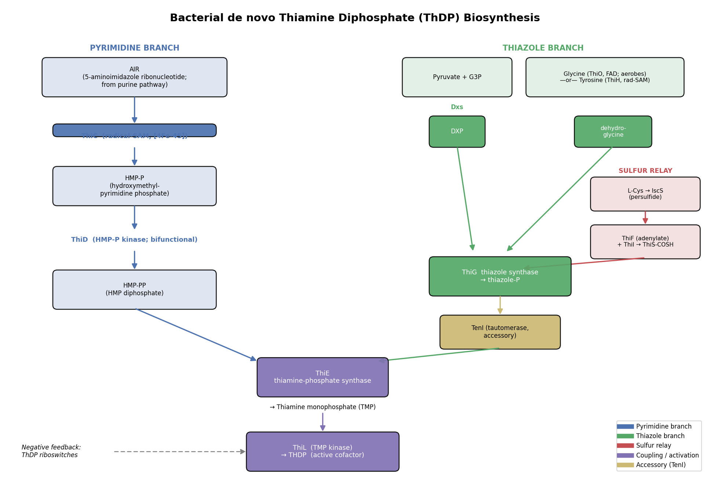

## Question

# Commissioned Review Brief

## Review Topic

Bacterial thiamine diphosphate biosynthesis

## Working Scope

Species-neutral bacterial pathway for de novo synthesis of thiamine diphosphate (ThDP), the active thiamine cofactor. The pathway has two converging branches: a hydroxymethylpyrimidine branch in which ThiC converts an AIR-derived precursor to HMP phosphate and ThiD phosphorylates it to the diphosphate, and a thiazole branch in which Dxs, ThiO, sulfur-relay proteins, and ThiG form the thiazole phosphate moiety. ThiE couples the pyrimidine and thiazole moieties to thiamine phosphate, and ThiL phosphorylates thiamine phosphate to ThDP.

## Provisional Biological Outline

- Thiamine diphosphate biosynthesis
  - 1. hydroxymethylpyrimidine branch
  - Hydroxymethylpyrimidine diphosphate branch
    - 1. HMP phosphate formation
    - AIR-derived precursor to HMP phosphate
      - ThiC: phosphomethylpyrimidine synthase (molecular player: ThiC phosphomethylpyrimidine synthase family; activity or role: phosphomethylpyrimidine synthase activity)
    - 2. HMP phosphate activation
    - HMP phosphate to HMP diphosphate
      - ThiD: phosphomethylpyrimidine kinase (molecular player: ThiD hydroxymethylpyrimidine/phosphomethylpyrimidine kinase family; activity or role: phosphomethylpyrimidine kinase activity)
  - 2. thiazole branch
  - Thiazole phosphate branch
    - 1. DXP precursor supply
    - DXP formation
      - Dxs: 1-deoxy-D-xylulose-5-phosphate synthase (molecular player: Dxs 1-deoxy-D-xylulose-5-phosphate synthase family; activity or role: 1-deoxy-D-xylulose-5-phosphate synthase activity)
    - 2. glyoxyl imine supply
    - Glycine oxidation to glyoxyl imine
      - ThiO: glycine oxidase (molecular player: ThiO glycine oxidase family; activity or role: glycine oxidase activity)
    - 3. sulfur mobilization and ThiS thiocarboxylation
    - ThiS sulfur-carrier thiocarboxylation
      - IscS: cysteine desulfurase sulfur donor (molecular player: IscS cysteine desulfurase family; activity or role: cysteine desulfurase activity)
      - ThiI: sulfur transfer to ThiS (molecular player: ThiI tRNA/ThiS sulfurtransferase family)
      - ThiS: sulfur carrier protein (molecular player: ThiS sulfur carrier protein (Pseudomonas putida KT2440))
    - 4. thiazole phosphate formation
    - Thiazole phosphate synthesis
      - ThiG: thiazole synthase (molecular player: ThiG thiazole synthase family; activity or role: thiazole synthase activity)
  - 3. pyrimidine-thiazole coupling
  - HMP diphosphate plus thiazole phosphate to thiamine phosphate
    - ThiE: thiamine-phosphate diphosphorylase (molecular player: ThiE thiamine-phosphate synthase family; activity or role: thiamine-phosphate diphosphorylase activity)
  - 4. thiamine diphosphate activation
  - Thiamine phosphate to thiamine diphosphate
    - ThiL: thiamine-phosphate kinase (molecular player: ThiL thiamine-phosphate kinase family; activity or role: thiamine-phosphate kinase activity)

## Known Relationships Among Steps

- AIR-derived precursor to HMP phosphate precedes HMP phosphate to HMP diphosphate
- DXP formation feeds into Thiazole phosphate synthesis
- Glycine oxidation to glyoxyl imine feeds into Thiazole phosphate synthesis
- IscS: cysteine desulfurase sulfur donor feeds into ThiI: sulfur transfer to ThiS
- ThiI: sulfur transfer to ThiS feeds into ThiS: sulfur carrier protein
- ThiS: sulfur carrier protein feeds into Thiazole phosphate synthesis
- HMP phosphate to HMP diphosphate feeds into HMP diphosphate plus thiazole phosphate to thiamine phosphate
- Thiazole phosphate synthesis feeds into HMP diphosphate plus thiazole phosphate to thiamine phosphate
- HMP diphosphate plus thiazole phosphate to thiamine phosphate precedes Thiamine phosphate to thiamine diphosphate

## Assignment

Write a rigorous, review-style synthesis suitable for a molecular biology
audience. Treat the topic as a biological system whose boundaries, core
mechanisms, variants, and unresolved points should be made clear to readers who
know the field but are not specialists in this specific process.

The review should be explanatory rather than encyclopedic. Anchor broad claims
in primary literature or authoritative reviews, but keep the focus on how the
system works and how its parts fit together.

## Questions To Address

1. **Scope and boundaries**
   - What exactly is included in this biological system?
   - Which neighboring pathways, organelle processes, complexes, or regulatory
     events are often confused with it but should be treated separately?
   - Are there competing definitions in the literature?

2. **Core mechanism**
   - What is the best current model for the sequence of events?
   - Which steps are obligatory, which are conditional, and which are accessory?
   - What molecular assemblies, enzymes, receptors, adaptors, transporters, or
     structural units carry out each major step?

3. **Variation**
   - How does the system vary across major evolutionary lineages?
   - Are there well-supported differences between cell types, tissues,
     developmental stages, physiological states, or compartments?
   - Where are there alternative routes that achieve a similar outcome by
     different molecular means?

4. **Conservation and origin**
   - What is the deepest plausible evolutionary origin of the system?
   - Which parts appear ancient and conserved, and which appear to be later
     elaborations, replacements, or lineage-specific losses?
   - When a protein family has expanded, which family members are the best
     representatives for understanding the ancestral role?

5. **Physical and biological constraints**
   - What steps must occur in a particular order?
   - Which events are mutually exclusive, compartment-specific, cell-type
     specific, substrate-specific, or stage-specific?
   - What evidence rules out otherwise plausible paths through the system?

6. **Evidence and controversy**
   - Which mechanistic claims are strongly supported by experiments?
   - Where does the literature disagree, rely on indirect evidence, or mix data
     from organisms that may not be comparable?
   - What are the most important open questions?

## Output Format

Use the style and structure of a concise review article:

1. Executive summary
2. Definition and biological boundaries
3. Mechanistic overview
4. Major molecular players and active assemblies
5. Evolutionary and cell-biological variation
6. Constraints, dependencies, and failure modes
7. Controversies and open questions
8. Key references

Include citations for major claims, preferably PMIDs or DOIs. Be explicit about
uncertainty and avoid overgeneralizing from one organism, cell type, or assay
system to all biology.

## Output

# Bacterial de novo Biosynthesis of Thiamine Diphosphate (ThDP)

*A review-style synthesis for a molecular-biology audience*
*Search date: 2026-07-15. Literature accessed via PubMed.*

---

## 1. Executive summary

Thiamine diphosphate (ThDP, also thiamine pyrophosphate/TPP) is the catalytically
active form of vitamin B1 and an obligatory cofactor for enzymes that break or
form C–C bonds adjacent to a carbonyl (pyruvate dehydrogenase, 2-oxoglutarate
dehydrogenase, transketolase, pyruvate decarboxylase, DXP synthase). Most
bacteria synthesize ThDP de novo, whereas humans cannot — making the pathway a
long-standing reservoir of antibacterial and herbicide targets.

The bacterial pathway is best understood as **two independently produced ring
systems that are welded together and then activated**:

1. A **hydroxymethylpyrimidine (HMP) branch**, in which the radical-SAM enzyme
   **ThiC** rearranges the purine-pathway intermediate AIR into HMP-phosphate,
   and the kinase **ThiD** raises it to HMP-pyrophosphate (HMP-PP).
2. A **thiazole branch**, in which **Dxs** supplies the five-carbon skeleton
   (DXP), a glycine/tyrosine-derived enzyme supplies **dehydroglycine**, a
   protein-borne **sulfur relay (IscS → ThiI/ThiF → ThiS-thiocarboxylate)**
   supplies sulfur, and **ThiG** condenses all three into thiazole phosphate.

**ThiE** (thiamine-phosphate synthase) then couples HMP-PP + thiazole-P into
thiamine monophosphate (TMP), and **ThiL** (thiamine-monophosphate kinase)
phosphorylates TMP to ThDP. The chemistry is remarkable for two of the most
unusual reactions in cofactor biology (ThiC's radical rearrangement and ThiG's
convergent ring assembly) and for the use of an **ubiquitin-like sulfur-carrier
protein (ThiS)** rather than free sulfide.

The pathway's most important **variation** is in how sulfur and dehydroglycine
are supplied: aerobes such as *Bacillus subtilis* use the flavoenzyme **ThiO**
(glycine oxidase), while facultative anaerobes such as *Escherichia coli* use the
oxygen-sensitive radical-SAM enzyme **ThiH** (tyrosine lyase). ThiI's domain
architecture and even its necessity differ between Gammaproteobacteria and
Firmicutes, and redundant sulfur routes exist. The **final activation step also
diverges from eukaryotes**: bacteria make ThDP in one ThiL step from TMP, whereas
eukaryotes hydrolyze TMP to free thiamine and pyrophosphorylate it (TPK/ThiN).

*Figure 1. Overview of bacterial de novo ThDP biosynthesis. Two independently synthesized rings (pyrimidine, blue; thiazole, green) are joined by ThiE and activated by ThiL. The thiazole branch integrates three inputs onto ThiG: the DXP carbon skeleton (Dxs), dehydroglycine (ThiO in aerobes or ThiH in anaerobes), and protein-carried sulfur (red relay). TenI (accessory) tautomerizes the thiazole product. ThDP riboswitches provide end-product feedback.*

---

## 2. Definition and biological boundaries

### What is inside the system

The system is the **cytoplasmic, de novo enzymatic route that converts central
metabolites into ThDP** in bacteria. Its obligatory members are:

| Branch | Step | Enzyme | Reaction |
|---|---|---|---|
| Pyrimidine | HMP-P formation | **ThiC** | AIR → HMP-P (radical SAM) |
| Pyrimidine | HMP-P activation | **ThiD** | HMP-P → HMP-PP (two kinase steps) |
| Thiazole | C5 skeleton | **Dxs** | pyruvate + G3P → DXP |
| Thiazole | glyoxyl imine | **ThiO** *or* **ThiH** | glycine *or* tyrosine → dehydroglycine |
| Thiazole | sulfur mobilization | **IscS**, **ThiI**, **ThiF**, **ThiS** | Cys → ThiS-thiocarboxylate |
| Thiazole | ring assembly | **ThiG** | DXP + dehydroglycine + S → thiazole-P |
| Coupling | condensation | **ThiE** | HMP-PP + thiazole-P → TMP |
| Activation | final phosphorylation | **ThiL** | TMP → ThDP |

### Neighboring processes that are often conflated but should be treated separately

- **Thiamine salvage and transport.** Uptake of exogenous thiamine (e.g., YuaJ/PnuT
  permeases, ABC transporters) and salvage enzymes feed ThDP pools by routes that
  **bypass** de novo synthesis. Salvage recycles the two rings: **ThiM** (thiazole
  kinase) rephosphorylates recovered thiazole (THZ) (PMID 26634770, 23816351) and
  **TenA** (thiaminase II) regenerates the aminopyrimidine, while HMP kinase feeds
  HMP-P. Crucially, salvage and de novo **share ThiD and ThiE**, so these two are common
  nodes; ThiM and TenA are salvage-specific. In *S. aureus* the salvage genes
  (TenA–ThiD–ThiM–ThiE) form one operon and TPK another, both under TPP-riboswitch and
  enzymatic control (PMID 19888457). In *B. subtilis*, thiamine is not a pathway
  intermediate but is salvaged and pyrophosphorylated by a separate ThiN (TPK) route
  (PMID 16291685). These are adjacent modules, not part of de novo synthesis.
- **The MEP/isoprenoid pathway.** **Dxs is shared**: DXP is simultaneously the first
  committed intermediate of the methylerythritol-phosphate (MEP) pathway for
  isoprenoids and a thiazole precursor. Dxs is therefore a **branch-point enzyme**,
  not a thiamine-dedicated one (PMID 41994131, 40845551). Attributing Dxs solely to
  thiamine biology is a common oversimplification.
- **The IscS/SUF sulfur-trafficking network.** IscS (cysteine desulfurase) is a hub
  serving Fe–S cluster assembly, thio-modification of tRNA (4-thiouridine),
  molybdopterin, biotin, lipoic acid and NAD in addition to thiamine
  (PMID 12382038). ThiI likewise is shared between thiamine and 4-thiouridine
  synthesis. The sulfur machinery **overlaps** the thiamine pathway but is not
  exclusive to it.
- **Purine biosynthesis.** ThiC consumes AIR (5-aminoimidazole ribonucleotide), a
  purine-pathway intermediate. The pyrimidine ring of thiamine thus derives from
  **purine**, not pyrimidine-nucleotide, metabolism — a frequent point of confusion.

### Competing definitions

Gene nomenclature is not uniform: *E. coli* thiazole synthase is a **ThiGH**
heterodimer, whereas *Bacillus* uses **ThiG + ThiO**; ThiD is sometimes annotated as
the bifunctional **ThiDIJ** (HMP kinase + HMP-P kinase) (PMID 10075431). Eukaryotic
thiazole synthesis (fungal/plant **THI4**) is mechanistically unrelated and should
not be merged with the bacterial ThiG system (see §5).

---

## 3. Mechanistic overview (best current model)

**Pyrimidine branch.**
ThiC catalyzes one of the most complex known rearrangements in cofactor biology:
the near-complete reorganization of AIR into HMP-P. It is an iron–sulfur,
radical-S-adenosylmethionine (SAM) enzyme; a C-terminal CX2CX4C motif ligates a
[4Fe-4S] cluster that reductively cleaves SAM to a 5'-deoxyadenosyl radical,
abstracting a hydrogen to initiate rearrangement. HMP-P and 5'-deoxyadenosine are
the products (PMID 18953358). **ThiD** then performs two sequential
phosphorylations — HMP → HMP-P and HMP-P → HMP-PP — and in *E. coli* is a single
bifunctional protein (ThiD/J) (PMID 10075431, 8885414). Only HMP-PP is competent
for coupling.

**Thiazole branch (three converging inputs onto ThiG).**
1. *Carbon skeleton:* **Dxs** condenses pyruvate and glyceraldehyde-3-phosphate to
   **DXP** (a ThDP-dependent reaction — the pathway partly bootstraps on its own
   product).
2. *Glyoxyl imine / dehydroglycine:* generated by **ThiO** (FAD-dependent glycine
   oxidase; oxidizes glycine to the imine) in aerobes, or by **ThiH** (radical-SAM
   tyrosine lyase that cleaves tyrosine's Cα–Cβ bond, releasing p-cresol) in
   *E. coli* (PMID 12627963, 19923213).
3. *Sulfur:* **IscS** abstracts sulfane sulfur from L-cysteine as a protein persulfide
   (PMID 12382038); **ThiF** adenylates the C-terminal glycine of **ThiS** with ATP;
   with **ThiI** participation the acyl-adenylate is converted to a **C-terminal
   thiocarboxylate** on ThiS (PMID 9632726). ThiS-COSH is the immediate sulfur donor.

**ThiG** then condenses DXP, dehydroglycine and the ThiS-thiocarboxylate sulfur into
**thiazole phosphate**. Isotope labeling shows the ThiS sulfur is delivered into the
ring and a thioenolate intermediate is trapped; strikingly, the sulfur that leaves
ThiS is replaced by an oxygen derived from DXP (PMID 15489164). The complete E. coli
system has been reconstituted: thiazole synthase activity requires the **ThiGH complex,
tyrosine, DXP and cysteine plus IscS and ThiI** (six structural proteins in total),
and is stimulated by SAM and NADPH — directly confirming the multi-protein,
tyrosine-fed assembly in this organism (PMID 14757766). In many bacteria an
accessory tautomerase, **TenI**, then isomerizes the ThiG product to the
thermodynamically favored thiazole tautomer that is the true ThiE substrate; TenI is a
ThiE-like (βα)8 fold that has *lost* thiamine-phosphate synthase activity and instead
uses phosphate/His122 as acid–base catalysts (PMID 21534620).

**Coupling and activation.**
**ThiE** (thiamine-phosphate synthase), a (β/α)8-barrel enzyme, condenses HMP-PP and
thiazole-P with loss of pyrophosphate to give **thiamine monophosphate (TMP)**
(PMID 22226942). **ThiL** phosphorylates TMP to **ThDP** using ATP, the final and
committed activation step (PMID 30867460, 32404369).

**Obligatory vs conditional vs accessory.**
- *Obligatory:* ThiC, ThiD, Dxs, ThiG, ThiE, ThiL, and a sulfur source. Loss of any
  abolishes de novo ThDP.
- *Conditional / interchangeable:* the dehydroglycine-generating step (ThiO vs ThiH)
  and the sulfur-relay architecture (ThiI ± rhodanese domain; alternative desulfurases)
  are lineage- and oxygen-dependent (PMID 22773787, 21724998).
- *Accessory / shared:* the **TenI** thiazole tautomerase optimizes but is not strictly
  required for coupling; Dxs and IscS also serve other pathways; salvage enzymes and
  transporters (§2) support ThDP pools but are not de novo steps.

---

## 4. Major molecular players and active assemblies

- **ThiC — phosphomethylpyrimidine synthase.** Homodimer; N-terminal novel domain +
  central (βα)8 barrel + C-terminal [4Fe-4S]-binding CX2CX4C. Radical-SAM
  superfamily; evolutionarily related to adenosylcobalamin radical enzymes
  (PMID 18953358). Oxygen-sensitive.
- **ThiD (ThiD/J) — HMP/HMP-P kinase.** Bifunctional; ribokinase-like fold; delivers
  HMP-PP (PMID 10075431).
- **Dxs — DXP synthase.** ThDP-dependent transketolase-family enzyme; branch point
  with the MEP isoprenoid pathway; rate-limiting for MEP flux and an antibacterial
  target (PMID 41994131, 40845551).
- **ThiO — glycine oxidase.** FAD-dependent; homotetramer in *B. subtilis*
  (structurally akin to D-amino-acid/sarcosine oxidase; hydride-transfer mechanism)
  (PMID 12627963). Species-variable oligomer/substrate preference — *P. putida* ThiO
  is monomeric and glycine-preferring, whereas *Bacillus*/*Geobacillus* prefer
  D-proline (PMID 26875494).
- **ThiH — tyrosine lyase.** Radical-SAM [4Fe-4S] enzyme; forms a ThiGH heterodimer
  in *E. coli*; converts tyrosine to dehydroglycine + p-cresol (PMID 19923213).
- **IscS — cysteine desulfurase.** PLP-dependent homodimer; persulfide on a conserved
  Cys; central sulfur hub (PMID 12382038).
- **ThiF / ThiS — ubiquitin-like sulfur-carrier system.** ThiF (E1-like
  adenylyltransferase) activates the C-terminal Gly of ThiS (PMID 9632726). The
  2.0 Å ThiS–ThiF co-structure shows ThiS structurally resembles **ubiquitin and MoaD**
  and ThiF resembles the **ubiquitin-activating E1 and MoeB**; sulfur transfer proceeds
  via a ThiS–ThiI acyl-disulfide and a ThiF-Cys184 disulfide-interchange (PMID 16388576).
- **TenI — thiazole tautomerase (accessory).** A ThiE-paralog fold that isomerizes the
  ThiG product to the correct tautomer for coupling; not universally essential
  (PMID 21534620).
- **ThiI — sulfurtransferase.** In Gammaproteobacteria, an adenyltransferase +
  C-terminal rhodanese domain (Cys persulfide relay); in Firmicutes, lacks the
  rhodanese domain and partners a distinct desulfurase (NifZ) (PMID 22773787,
  21724998, 10722656).
- **ThiG — thiazole synthase.** (βα)8 barrel; convergent condensation node
  (PMID 15489164).
- **ThiE — thiamine-phosphate synthase.** (βα)8 barrel; couples the two moieties
  (PMID 22226942). Not universal at the sequence level: most archaea instead use a
  **ThiN** domain fused to ThiD that catalyzes the same reaction but shares no sequence
  similarity with ThiE (an analog, not an ortholog) (PMID 24583237); eukaryotes fuse the
  coupling activity with a salvage HET-kinase in bifunctional **THI6** (PMID 20968298).
- **ThiL — thiamine-monophosphate kinase.** ATP-grasp/AIRS-like fold; in-line
  phosphoryl transfer with metal (Mg2+) coordination; validated drug target
  (PMID 30867460, 32404369, 42103215).

**Regulation.** Thiamine genes are governed by **ThDP riboswitches** that sense the
end product and repress transcription/translation of thi operons (e.g., thiC, thiM),
providing negative feedback (PMID 26932506). The pyrithiamine sensitivity of these
riboswitches makes them themselves antibacterial targets (PMID 21234302).

---

## 5. Evolutionary and cell-biological variation

- **Deep, mosaic ancestry.** The pathway assembles several ancient protein families
  independently recruited to thiamine: the **radical-SAM superfamily** (ThiC, ThiH),
  **PLP desulfurases** (IscS), **ThDP-transketolase** enzymes (Dxs), and the
  **ubiquitin-like β-grasp sulfur carriers** (ThiS/ThiF). The 2.0 Å ThiS–ThiF structure
  shows ThiS resembles ubiquitin/MoaD and ThiF resembles E1/MoeB (PMID 16388576), and
  archaeal noncanonical E1 enzymes (UbaA) with ubiquitin-like SAMPs use the same
  E1/MoeB/ThiF superfamily chemistry for both molybdopterin/tRNA sulfur transfer and
  protein conjugation (PMID 21368171, 27459543). ThiS/ThiF chemistry is thus a molecular
  fossil of pre-ubiquitin sulfur biochemistry, and ThiS/MoaD/Urm1 are the best
  representatives of the ancestral sulfur-carrier role.
- **Aerobic vs anaerobic wiring of dehydroglycine.** ThiO (flavin, O2-using) is
  favored by aerobes; ThiH (radical-SAM, O2-sensitive) by facultative/anaerobes. Both
  converge on the same dehydroglycine substrate for ThiG — a striking example of
  non-homologous enzymes solving the same supply problem under different redox
  regimes (PMID 12627963, 19923213).
- **Sulfur-relay divergence.** Gammaproteobacterial ThiI carries a rhodanese domain
  and uses IscS; most Firmicutes ThiI lack this domain and use NifZ, and additional
  ThiI/IscS-independent, cysteine-dependent routes to thiazole exist
  (PMID 22773787, 21724998). Archaea can incorporate sulfide directly.
- **The coupling enzyme is not universal.** Pyrimidine–thiazole condensation is a fixed
  chemical requirement met by at least three different protein solutions: standalone
  **ThiE** in most bacteria; a **ThiN** domain fused onto ThiD in most archaea, which is
  functionally analogous but non-homologous to ThiE (PMID 24583237); and a bifunctional
  **THI6** fusion (coupling + salvage HET-kinase) in eukaryotes (PMID 20968298). Sequence
  orthology of ThiE therefore under-reports pathway presence.
- **Final-step divergence from eukaryotes.** Bacteria typically make ThDP directly by
  ThiL phosphorylation of TMP; eukaryotes and some bacteria instead dephosphorylate
  TMP to free thiamine and then pyrophosphorylate it via thiamine pyrophosphokinase
  (TPK/ThiN) (PMID 26639844, 16291685). This is the sharpest bacterial/eukaryotic
  contrast and underlies ThiL's appeal as a selective target.
- **Thiazole synthesis is not universal.** The bacterial ThiG/ThiS route is entirely
  distinct from the eukaryotic **THI4** route, in which a single "suicide" enzyme uses
  an active-site Cys as sacrificial sulfur donor for one catalytic cycle and is then
  degraded — an energetically costly design (PMID 30337452, 36920242). Some
  prokaryotic THI4s are non-suicidal, sulfide-dependent enzymes, informing the ancestral
  reconstruction and bioengineering of low-cost thiazole synthesis.
- **Genome reduction and auxotrophy.** Streamlined and host-associated bacteria
  frequently lose de novo steps and rely on transport/salvage; e.g., some anaerobes
  and *Dehalococcoides* require thiamine as a growth supplement (PMID 23479751).

---

## 6. Constraints, dependencies, and failure modes

**Obligatory ordering.**
- HMP-P (ThiC) must precede HMP-PP (ThiD): only the diphosphate is a ThiE substrate.
- All three thiazole inputs (DXP via Dxs; dehydroglycine via ThiO/ThiH; sulfur via the
  IscS→ThiI/ThiF→ThiS relay) must be available for ThiG.
- Within the sulfur relay the order is fixed: IscS persulfide → ThiF adenylation of
  ThiS → ThiS-thiocarboxylate → ThiG.
- Both branches must complete before ThiE coupling; ThiE must precede ThiL.

**Mutually exclusive / condition-specific choices.**
- ThiO (aerobic, flavin) vs ThiH (anaerobic, radical-SAM) are alternative, essentially
  mutually exclusive solutions selected by oxygen availability and lineage.
- The oxygen-sensitivity of the [4Fe-4S] enzymes ThiC and ThiH constrains when/where
  those steps operate and complicates in vitro reconstitution.

**Evidence that rules out otherwise plausible paths.**
- The thiamine pyrimidine does **not** come from pyrimidine-nucleotide metabolism:
  ThiC's substrate is the purine intermediate AIR (PMID 18953358).
- Sulfur is delivered as a **protein-bound thiocarboxylate**, not free sulfide:
  ThiS-thiocarboxylate is the immediate donor, and 18O labeling shows ring oxygen comes
  from DXP, not buffer (PMID 15489164, 9632726).
- ThiL, not TPK, performs the final step in most bacteria — de novo bacterial ThDP does
  not transit free thiamine (PMID 26639844).

**Failure modes / vulnerabilities.**
- Loss of any obligatory enzyme yields thiamine auxotrophy (or bradytrophy where
  salvage compensates, e.g., *B. subtilis* ΔthiL; PMID 16291685).
- ThiL is essential for both biosynthesis and salvage and its inhibition/destabilization
  is bactericidal in pathogens (*Acinetobacter*, *Pseudomonas*) (PMID 32404369,
  42103215).
- Dxs and ThiE are proposed broad-spectrum targets; the ThDP riboswitch is targeted by
  pyrithiamine (PMID 21234302).

---

## 7. Controversies and open questions

- **ThiC mechanism.** The radical-SAM rearrangement of AIR→HMP-P is chemically
  extraordinary and the complete sequence of radical intermediates is still not fully
  resolved; the enzyme's oxygen sensitivity limits mechanistic study (PMID 18953358).
- **ThiI's exact role in thiazole synthesis.** Genetic data show the rhodanese domain
  is sufficient in *Salmonella*, yet residues needed for 4-thiouridine differ from
  those for thiazole, and ThiI/IscS-independent sulfur routes exist — implying current
  annotations over-generalize a single mechanism (PMID 21724998, 22773787). How sulfur
  reaches thiazole in Firmicutes and archaea remains partly open.
- **Organism-mixing in the literature.** Much mechanistic detail is stitched together
  from *E. coli*, *B. subtilis*, *Salmonella*, and *Pseudomonas*, which differ in the
  ThiO/ThiH choice, ThiI architecture, and salvage wiring. Claims should be qualified
  by organism; the "canonical" pathway is a composite.
- **Sulfur-donor identity in vivo.** Whether cysteine-derived persulfide, free sulfide,
  or alternative carriers dominate varies with organism and redox state; redundant
  routes complicate clean genetic assignment (PMID 21724998).
- **Evolutionary origin of the ThiS/ubiquitin connection.** ThiS/ThiF strongly resemble
  ubiquitin/MoaD-MoeB; whether thiamine sulfur transfer or molybdopterin synthesis is
  the more ancestral use of this β-grasp chemistry is unsettled.
- **Engineering low-cost thiazole synthesis.** The energetic cost of eukaryotic suicide
  THI4 versus catalytic bacterial ThiG has driven efforts to install non-suicidal /
  sulfide-dependent thiazole synthases, but these are slow and O2-sensitive — an open
  bioengineering problem (PMID 30337452, 36920242).

---

## 8. Key references

- Chatterjee A, et al. *Reconstitution of ThiC in thiamine pyrimidine biosynthesis
  expands the radical SAM superfamily.* Nat Chem Biol. 2008. **PMID 18953358.**
- Dorrestein PC, Zhai H, McLafferty FW, Begley TP. *The biosynthesis of the thiazole
  phosphate moiety of thiamin: sulfur transfer mediated by ThiS.* Chem Biol. 2004.
  **PMID 15489164.**
- Leonardi R, Roach PL. *Thiamine biosynthesis in E. coli: in vitro reconstitution of
  thiazole synthase activity (ThiFSGH, IscS, ThiI).* J Biol Chem. 2004.
  **PMID 14757766.**
- Taylor SV, et al. *Thiamin biosynthesis in E. coli: ThiS thiocarboxylate as the
  immediate sulfur donor in thiazole formation.* J Biol Chem. 1998. **PMID 9632726.**
- Mihara H, Esaki N. *Bacterial cysteine desulfurases: function and mechanisms.* Appl
  Microbiol Biotechnol. 2002. **PMID 12382038.**
- Settembre EC, et al. *Structural and mechanistic studies on ThiO, a glycine oxidase
  essential for thiamin biosynthesis in B. subtilis.* Biochemistry. 2003.
  **PMID 12627963.**
- Challand MR, Martins FT, Roach PL. *Catalytic activity of the anaerobic tyrosine
  lyase (ThiH) required for thiamine biosynthesis in E. coli.* J Biol Chem. 2010.
  **PMID 19923213.**
- Equar MY, Tani Y, Mihara H. *Purification and properties of glycine oxidase from
  Pseudomonas putida KT2440.* 2015. **PMID 26875494.**
- Palenchar PM, et al. *ThiI as a sulfurtransferase proceeding through a persulfide
  intermediate.* J Biol Chem. 2000. **PMID 10722656.**
- Rajakovich LJ, Tomlinson J, Dos Santos PC. *B. subtilis genes in 4-thiouridine
  biosynthesis (ThiI/NifZ).* J Bacteriol. 2012. **PMID 22773787.**
- Martinez-Gomez NC, et al. *Rhodanese domain of ThiI necessary and sufficient for
  thiazole synthesis in Salmonella.* J Bacteriol. 2011. **PMID 21724998.**
- Mizote T, et al. *thiD/J of E. coli encodes bifunctional HMP kinase/HMP-P kinase.*
  FEMS Microbiol Lett. 1999. **PMID 10075431.**
- Saab-Rincón G, et al. *Catalytic migration from triosephosphate isomerase to thiamin
  phosphate synthase (ThiE, (β/α)8 barrel).* 2012. **PMID 22226942.**
- Lehmann C, Begley TP, Ealick SE. *Structure of the E. coli ThiS–ThiF complex; ThiS
  resembles ubiquitin/MoaD, ThiF resembles E1/MoeB.* Biochemistry. 2006.
  **PMID 16388576.**
- Hazra A, et al. *TenI is a thiazole tautomerase completing the major bacterial
  thiamin pathway.* J Am Chem Soc. 2011. **PMID 21534620.**
- Hayashi M, et al. *Archaeal thiamin phosphate synthase: ThiN domain (fused to ThiD)
  is a non-homologous analog of ThiE.* 2014. **PMID 24583237.**
- Paul D, Chatterjee A, Begley TP, Ealick SE. *Bifunctional eukaryotic THI6 (coupling +
  HET kinase).* Biochemistry. 2010. **PMID 20968298.**
- Miranda HV, et al. *E1- and ubiquitin-like proteins link protein conjugation and
  sulfur transfer in archaea (UbaA/SAMP; E1/MoeB/ThiF superfamily).* 2011.
  **PMID 21368171.**
- Hayashi M, Nosaka K. *Thiamin phosphate kinase (ThiL) in Pyrobaculum; bacterial vs
  eukaryotic final step.* 2015. **PMID 26639844.**
- Kim et al. *ThiL as a valid antibacterial target essential for biosynthesis and
  salvage.* 2020. **PMID 32404369.**
- Sullivan et al. *Crystal structures of ThiL from A. baumannii.* 2019. **PMID 30867460.**
- Li et al. *ThiL destabilization inhibits P. aeruginosa (VP3.15).* 2026.
  **PMID 42103215.**
- Schyns G, et al. *Thiamine-deregulated mutants of B. subtilis (ThiN, salvage).* 2005.
  **PMID 16291685.**
- Müller IB, et al. *Vitamin B1 metabolism of Staphylococcus aureus controlled at
  enzymatic and transcriptional levels (TenA/ThiD/ThiM/ThiE operon; TPK).* 2009.
  **PMID 19888457.**
- Tani Y, Kimura K, Mihara H. *4-Methyl-5-hydroxyethylthiazole kinase (ThiM) from E.
  coli.* 2016. **PMID 26634770.**
- Yazdani M, et al. *Thiamin salvage thiazole kinase (ThiM homologs) in plants.* 2013.
  **PMID 23816351.**
- Guedich S, et al. *Kinetic regulation by E. coli TPP riboswitches (thiM/thiC).* 2016.
  **PMID 26932506.**
- Du Q, Wang H, Xie J. *Thiamin biosynthesis and regulation as antimicrobial targets.*
  2011. **PMID 21234302.**
- Koenigsknecht MJ, Downs DM. *Thiamine biosynthesis to dissect metabolic integration.*
  2010. **PMID 20382023.**
- Sun/Gelder et al. *THI4 suicide vs non-suicidal thiazole synthases; engineering.*
  2019/2023. **PMID 30337452, 36920242.**
- DXPS inhibitor / MEP-branch structural studies. 2025–2026. **PMID 41994131, 40845551.**

---

### Explicit statements of uncertainty

- The "canonical" pathway described here is a **composite** across model organisms; the
  ThiO/ThiH choice, ThiI architecture, salvage wiring, and final activation step differ
  by lineage and should not be generalized to all bacteria.
- Several claims (radical intermediates of ThiC; in vivo sulfur-donor identity; ThiI's
  precise catalytic role in thiazole) rest on partial or indirect evidence.
- This synthesis is literature-based; no primary experimental data were generated here.

## Artifacts

- [OpenScientist final report](thiamine_diphosphate_biosynthesis-deep-research-openscientist_artifacts/final_report.html)
- [OpenScientist final report](thiamine_diphosphate_biosynthesis-deep-research-openscientist_artifacts/final_report.pdf)
- [OpenScientist thdp pathway schematic](thiamine_diphosphate_biosynthesis-deep-research-openscientist_artifacts/provenance_thdp_pathway_schematic.json)

