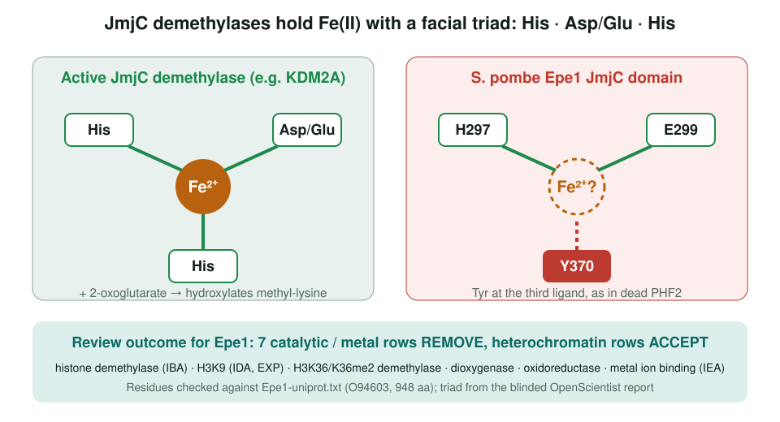
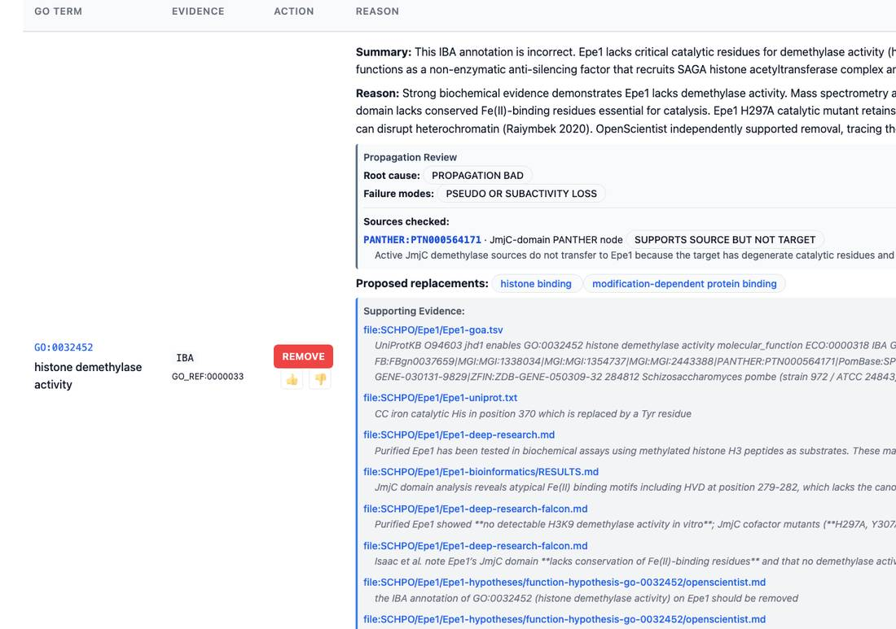

<!-- _class: lead -->

# Ad-hoc bioinformatics in gene review

Small computations that test a domain-based GO annotation

AI Gene Review · projects/AD_HOC_BIOINFORMATICS · 2026

---

<!-- _class: bluf -->

## Bottom line

- A domain hit says what a protein's **ancestors** did. A residue-level check says whether this protein can still do it.
- Four early cases, one per analysis type: **Epe1** (active site), **PHYKPL** (substrate), **LPL1** (localization), **AcrF8** (domain architecture).
- Epe1: inherited/electronic JmjC catalytic rows are **REMOVE**, while experimental H3K9me rows stay **UNDECIDED**. The repo now has **278** `-bioinformatics/` folders.

---

## Why compute, not just look up

- Many enzyme annotations are **IEA/IBA from domain or family membership**.
- A pseudo-enzyme keeps the fold but loses the catalytic residues, and the annotation still propagates.
- The review agent can write and run code: fetch sequences, align to active controls, check residues, read AlphaFold models.
- Rule in this repo: scripts must be reproducible, results never hardcoded, inconclusive is allowed.

---

## Epe1: a JmjC domain that cannot hold iron

---

## What the review did with it

Epe1 review: IBA histone demethylase activity is REMOVE, with UniProt ("iron catalytic His in position 370 ... replaced by a Tyr"), the local RESULTS.md and a blinded OpenScientist report as support.

---

## Four analysis types, four genes

| Gene | Species | Analysis | Review outcome (verified in YAML) |
|---|---|---|---|
| Epe1 | SCHPO | Active site, cofactor | IBA/IEA catalytic rows REMOVE |
| PHYKPL | human | Substrate specificity | IEA `transaminase activity` REMOVE |
| LPL1 | CANAL | Localization signal | IEA `membrane` REMOVE; lipid droplet kept |
| AcrF8 | BPZF4 | Domain architecture | no analysis folder |

Only Epe1 has a scripted <code>-bioinformatics/</code> folder; PHYKPL and LPL1 were argued in the review text.

---

## What we learned

1. **Active-site validation** is the highest-yield check: one missing ligand can retire a whole block of IEA/IBA enzyme rows.
2. The first Epe1 script flagged "HVD", which actually fits HxD. The real defect, **Y370** at the third ligand, came from a later blinded OpenScientist run and matches UniProt.
3. Early ad-hoc scripts were heuristic. The **pmp20** workflow (see BIOINFORMATICS) is now the template: active controls, tested on a second target.

---

## Status and next steps

- Catalogue frozen at 4 cases (Jan 2026); **278** analysis folders exist across `genes/`.
- ⬜ Create `PHYKPL-bioinformatics/` and `LPL1-bioinformatics/` (#4028).
- ⬜ Replace the hand table with an index generated from the folders (#4029).

**Read more:** `projects/AD_HOC_BIOINFORMATICS.md` · `projects/BIOINFORMATICS.md` · `genes/SCHPO/Epe1/Epe1-bioinformatics/`
