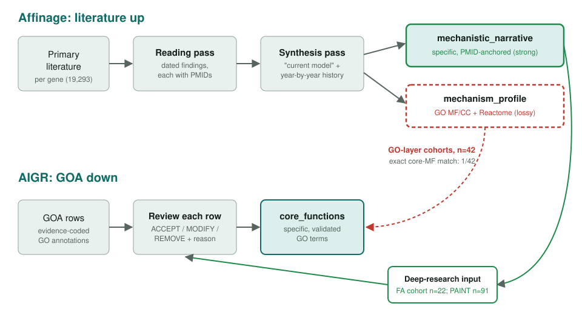
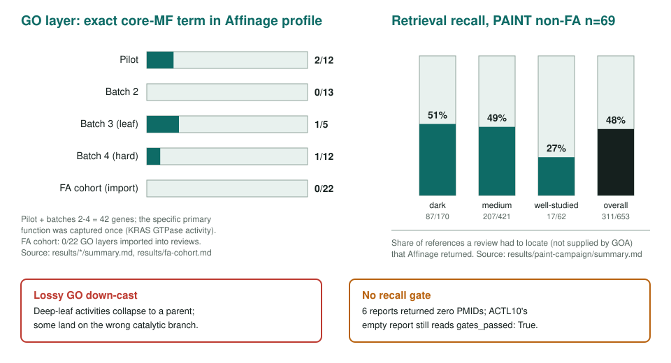
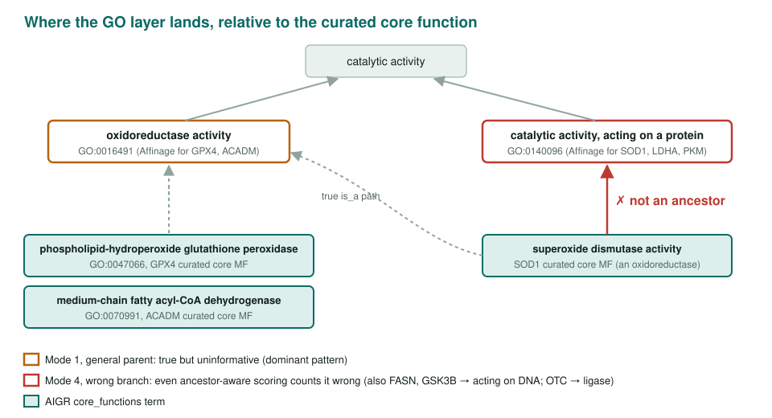

<!-- _class: lead -->

# Evaluating Affinage

What a literature-first function annotator gets right, and where its GO layer fails

AI Gene Review · projects/AFFINAGE_EVALUATION · 2026

---

<!-- _class: bluf -->

## Bottom line

- **GO layer is lossy:** the specific curated molecular function appeared in Affinage's GO profile for **1 of 42** human genes (KRAS `GTPase activity`).
- **Narrative is useful:** on the 22 Fanconi anemia genes it contributed **59 papers** and **13 new GO annotations** across 10 genes, with **no** curation decision reversed.
- **Not a literature search:** it supplied **52%** of the 718 references 91 reviews had to find; `gates_passed` checks precision, not recall.

---

## Two pipelines, compared at two points

Affinage reasons bottom-up from papers and maps up to GO; AIGR starts from evidence-coded GOA rows. We scored the GO profile against our <code>core_functions</code>, and used the narrative as a deep-research input.

---

## Why evaluate it

- Affinage covers **all 19,293** human protein-coding genes with a PMID-anchored narrative plus GO/Reactome grounding.
- Three possible roles for AIGR: **GO-grounding source**, **deep-research input**, or **literature search**.
- Method: fetch each record from the Affinage JSON API, compare `mechanism_profile` GO ids with the local review's GOA rows and `core_functions` (exact-id; `compare_affinage.py`, nothing hard-coded).

---

## Results in numbers

---

## How the GO layer misses

---

## Other failure modes

- **Symbol collision (ADA):** the record is keyed to human adenosine deaminase (P00813), but the narrative is a chimera of *E. coli* Ada, the SAGA subunits ADA2/ADA3, and human ADA. `adenosine deaminase activity` (GO:0004000) is dropped from the profile.
- **GO contradicts its own narrative:** ROR1's narrative says "devoid of intrinsic catalytic activity"; its GO layer says `catalytic activity, acting on a protein`.
- **Narrative recency bias:** ADRB2's narrative omits cAMP, Gs and β-arrestin.
- Affinage's own `evaluation.pairwise` flags tracked these (ADA = loss, ADRB2 = tie).

---

## What the narrative adds (FA cohort)

- **59** Affinage-surfaced primary papers folded into the 22 reviews.
- **13 new GO annotations** on 10 genes, e.g. FANCA single-strand annealing; FANCD2 fork protection.
- Its cited evidence **reinforced** several non-core calls (RAD51C is not an endonuclease; SLX4 nuclease-dead).
- GO layer: **0/22** imported. It typed non-catalytic FANCB/E/I as `acting on a protein` and the helicase BRIP1 as `molecular adaptor activity`.

---

## Status and next steps

- ✅ 42 genes in four GO-layer cohorts; 22-gene forward test; 91-gene retrieval test.
- ⬜ Ontology-aware (ancestor/descendant) scoring instead of exact ids.
- ⬜ Score the narrative with a rubric and a blinded second rater.
- ⬜ Genome-wide symbol-collision sweep (accession vs described protein).

**Read more:** `projects/AFFINAGE_EVALUATION.md` · `projects/AFFINAGE_EVALUATION/results/` · `compare_affinage.py` · `retrieval_recall.py`
