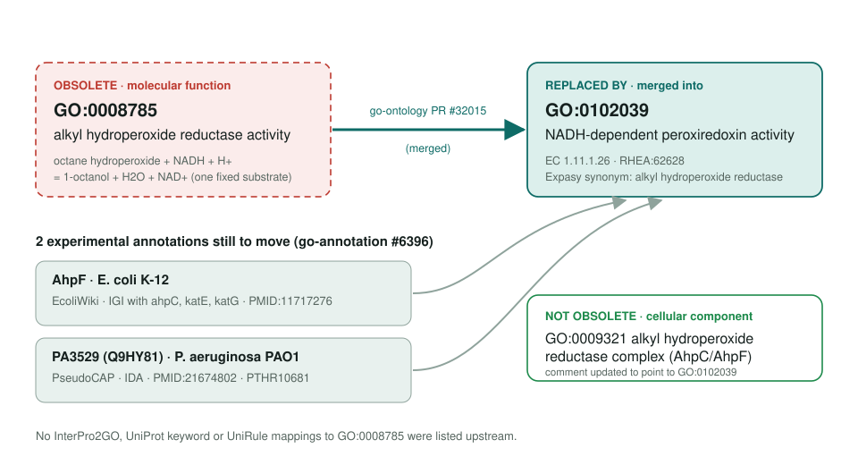
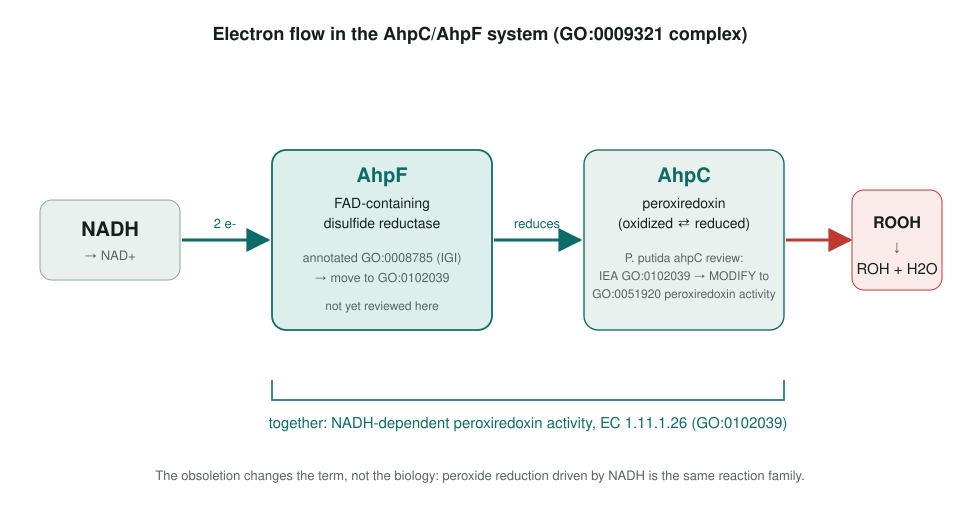

<!-- _class: lead -->

# Alkyl hydroperoxide reductase activity obsoletion

GO:0008785 → GO:0102039 NADH-dependent peroxiredoxin activity

AI Gene Review · projects/ALKYL_HYDROPEROXIDE_REDUCTASE_OBSOLETION · 2026

---

<!-- _class: bluf -->

## Bottom line

- GO **obsoleted GO:0008785**, a term tied to one substrate (octane hydroperoxide), and merged it into **GO:0102039** (EC 1.11.1.26).
- The ontology change is **merged**; the upstream tracker listed **2 experimental annotations** (E. coli AhpF, P. aeruginosa PA3529).
- **AhpF is now reviewed:** GOA has GO:0102039; the review scopes AhpF itself to **GO:0047134** and contributes to the system-level activity.
- **PA3529/Q9HY81 is still open:** it is the P. aeruginosa AhpC-type peroxiredoxin follow-on.

---

## Old term → replacement

---

## Why the term went

- GO:0008785 was defined by **one stoichiometry**: octane hydroperoxide + NADH → 1-octanol.
- No known gene product is that specific; the enzymes reduce a **range of peroxides**.
- Expasy lists "alkyl hydroperoxide reductase" as a **synonym of EC 1.11.1.26**, which is exactly GO:0102039.
- The **complex** term GO:0009321 stays; only its comment now points to GO:0102039.

---

## The biology does not change

---

## What is in the repo today

- `genes/ECOLI/AhpF/`: validated review of the reductase half.
- `modules/bacterial_alkyl_hydroperoxide_reductase`: concrete AhpF electron-transfer annoton; ECOLI ahpC is the remaining half.
- `genes/PSEPK/ahpC/`: IEA GO:0102039 **MODIFY → GO:0051920**, because AhpC alone is the peroxidase and AhpF supplies the NADH electrons.

---

## Next steps

1. Review **PA3529 / Q9HY81**; UniProt still only exposes the ordered locus name.
2. Review **ECOLI ahpC** and add the peroxide-attacking annoton to the AhpF module.
3. Defer PTHR10681 IBA review until GOA reflects the obsoletion.

**Upstream:** go-annotation#6396 · go-ontology#31961 · PR #32015
**Local:** `genes/ECOLI/AhpF` · `genes/PSEPK/ahpC` · #514 · #4032
