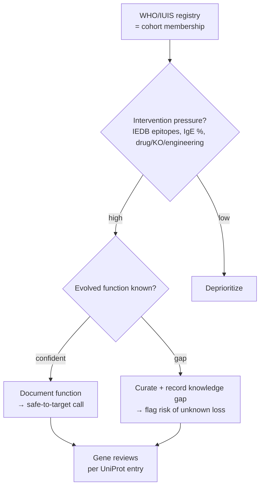

# Allergens Project

> Allergenicity is a **cross-species immunological property** — IgE reactivity in
> a sensitized human — **not** the protein's evolved molecular function. GO, and
> this project's reviews, stay focused on evolved function in the source organism.
> The "allergen" label is used here only as a **prioritization bucket**: a cohort
> of proteins worth reviewing because their function is medically actionable and
> often poorly understood.

## Why an allergens cohort

This is not a new kind of annotation. It is a triage layer that selects genes for
ordinary function review. The motivation is concrete and clinical:

**We increasingly intervene on allergens — so we should know what they do first.**
Major allergens are being knocked out, neutralized, or engineered:

- **CRISPR knockout** of the Fel d 1 genes (CH1/CH2) to make hypoallergenic cats
  [PMID:35386981].
- **Antibody neutralization** (anti–Fel d 1 in cat food; therapeutic IgG4 in
  patients).
- **Allergen-specific immunotherapy** with recombinant/peptide allergens.

Each of these abolishes or suppresses a protein. The obvious safety question —
**"what physiological function do we lose?"** — is exactly a gene-function-review
question. For the cat allergen Fel d 1 the honest answer is *largely unknown*, and
that is the single most decision-relevant finding, captured in each review's
`knowledge_gaps`.

## Scope and unit of analysis

The reviews are per **gene / UniProt entry**, but allergen databases are organized
per **allergen molecule** (e.g. WHO/IUIS *Fel d 1*, which spans two genes,
FELCA/CH1 + FELCA/CH2). The project therefore needs an index/mapping layer
that bridges that one-to-many relationship — the allergen molecule is the cohort
member; the genes are the review units.

## Prioritization metric

Rank candidates within the bucket on **intervention pressure × function
uncertainty**:

- **Intervention pressure** — is the protein being drugged, knocked out, or
  engineered? (IgE prevalence, epitope load, "therapeutic target" flag.)
- **Function uncertainty** — how confidently is the evolved function known? This is
  the axis already modelled in the [Function Knowledge Gaps](FUNCTION_KNOWLEDGE_GAPS.md)
  project.

Allergens score high on both, which is why they are a natural first cohort. The
per-gene deliverable is *"here is the evolved function, or here is the
sharply-bounded gap"* — not *"is it an allergen"* (WHO/IUIS already says so).



## External databases

These are **triage inputs and cross-references only** — they never change a GO
annotation. Build ETL only for sources with genuine APIs; for the rest, parse
downloads (do not write code that just points at a website).

| Facet | Database | Provides | Access |
|---|---|---|---|
| Identity / nomenclature | **WHO/IUIS Allergen Nomenclature** | Official allergen name, source taxon, MW, route, isoallergens | Download tables (no real API) |
| Aggregation | **Allergome** | Per-molecule records, isoforms, refs (already in UniProt DR lines) | Limited/legacy |
| Epitopes | **IEDB** | T-cell & B-cell/IgE epitopes mapped to sequence, assays, MHC | **REST/Query API + exports** |
| Structure + IgE epitopes + cross-reactivity | **SDAP** | Structures, IgE epitopes, FAO/WHO similarity tools | Web tools + downloads |
| Sequence allergenicity / cross-reactivity | **AllergenOnline**, **COMPARE** | Curated allergen FASTA sets | Registered download → local BLAST |
| Structure / fold | PDB, AlphaFoldDB | 3D structure | API (via UniProt) |

**Anchors:** WHO/IUIS (defines the cohort) + IEDB (rich, API-accessible epitope
data). Layer SDAP / AllergenOnline later for cross-reactivity. Treat Allergome as a
cross-reference resolver since UniProt already links it.

These fit the repo's existing patterns: cache-per-record (like `publications/`,
`reactome/`), an index TSV (like `gocams/index.tsv`) keying allergen → UniProt →
review, and SSSOM mapping sets (like the ARO→GO / RHEA→GO projects) for
allergen→UniProt links. Allergen-specific metadata (route of exposure, IgE
prevalence, epitopes) would live in a schema side-block, not in GO — note that
UniProt keyword `KW-0020 Allergen` exists but there is no clean "allergen activity"
GO molecular function, which is precisely why the side-channel is needed.

## Case study: the secretoglobin allergens

The first genes curated under this lens are all **secretoglobins**, which makes a
sharp point: the family shares a *"PLA2 modulation + hydrophobic-ligand binding +
immunomodulation"* theme, yet **no family member has a confirmed endogenous
function** — including the best-studied one.

| Gene | Allergen / protein | Evolved-function status (this project) |
|---|---|---|
| FELCA/CH1 | Fel d 1 chain 1 (major cat allergen) | Ca²⁺ binding (structural); LPS binding → TLR4/TLR2 enhancement; steroid/fatty-acid (pheromone?) binding. **Native cat role unknown.** |
| FELCA/CH2 | Fel d 1 chain 2 (glycosylated chain) | Same complex-level activities; contributes Ca²⁺-coordinating residues. **Native cat role unknown.** |
| mouse/Scgb1a1 | Uteroglobin / CC10 / CC16 (family prototype) | Potent **phospholipase A2 inhibitor**; phospholipid/PCB binding; suppresses Th2 cytokines (IL-4/5/13) via GATA-3 mRNA destabilization. Best-characterized member — yet its *primary* physiological role is still debated. |

The contrast is instructive for the "know before you knock out" thesis: even
uteroglobin, the archetype with decades of study, is annotated mainly through
*PLA2 inhibition* and *Th2 suppression* rather than a settled endogenous purpose;
the uteroglobin knockout mouse shows inflammation/cancer susceptibility, so
"harmless to remove" is not a safe default for Fel d 1 either.

The cat Fel d 1 reviews additionally drew on FutureHouse **Falcon** deep research,
which surfaced the experimentally-grounded LPS-binding / TLR4-enhancement activity
(Herre et al. 2013, [PMID:23878318]) and ligand-binding data
([PMID:34026578]); all such claims were verified against the cited primary
literature before annotation.

## Allergen → UniProt index

The cohort membership and the molecule→gene bridge are maintained as a generated
TSV, [ALLERGENS/allergen_index.tsv](ALLERGENS/allergen_index.tsv), built by
[ALLERGENS/build_allergen_index.py](ALLERGENS/build_allergen_index.py):

```bash
uv run python projects/ALLERGENS/build_allergen_index.py \
    -o projects/ALLERGENS/allergen_index.tsv
```

The builder is deliberately **download-honest**: it derives membership from the
already-cached UniProt records (the `Allergen=` name, the `Allergen` keyword, and
Allergome cross-references) and joins them to the local reviews. It does **not**
call or fake a WHO/IUIS API; to fold in the official registry, drop its downloaded
table into the folder and extend the merge step. Re-running picks up every allergen
gene present under `genes/`, so the index grows automatically as the cohort expands.

Columns: `allergen_molecule` (the WHO/IUIS unit), `allergome_id`, `source_taxon_id`,
`species_code`, `gene_symbol`, `uniprot`, `uniprot_allergen_name`, `review_path`,
`review_status`, `n_core_functions`, `n_knowledge_gaps`, `function_gap_flagged`.

The `function_gap_flagged` column operationalizes the prioritization metric: a
member with documented knowledge gaps is exactly a "intervention-relevant but
uncertain-function" candidate. Current contents (one row per gene):

| allergen molecule | genes (UniProt) | source | review | function gap? |
|---|---|---|---|---|
| Fel d 1 | CH1 (P30438) + CH2 (P30440) | cat (9685) | DRAFT | **yes** — native role unknown |
| Fel d 2 | ALB (P49064) | cat (9685) | DRAFT | no — serum albumin carrier |
| Fel d 3 | CSTA (Q8WNR9) | cat (9685) | DRAFT | no — cystatin protease inhibitor |
| Fel d 4 | Feld4 (Q5VFH6) | cat (9685) | DRAFT | no — lipocalin pheromone carrier |
| Hom s Trx | TXN (P10599) | human (9606) | COMPLETE | no — characterized (thioredoxin) |

The rows illustrate the spread the cohort is meant to capture, and it is striking
even within a single species: of the cat allergens, only **Fel d 1** has an
unresolved evolved function (high priority), whereas the secondary cat allergens are
each a well-understood protein family — Fel d 2 a serum-albumin carrier, Fel d 3 a
cystatin cysteine-protease inhibitor, Fel d 4 a lipocalin pheromone carrier — and
human thioredoxin is a characterized self-allergen (all low priority). `mouse/Scgb1a1`
is intentionally absent — it is the secretoglobin comparator, not a registered
allergen, so it does not appear in the membership-derived index.

### Registry coverage and fetch worklist

WHO/IUIS publishes no stable API, but UniProt's **`Allergen` keyword (KW-0020)** is
a curated, API-accessible proxy: each reviewed allergen entry carries its WHO/IUIS
designation inline in its protein names as `(allergen <name>)`
(e.g. `(allergen Fel d 1-A)`). [ALLERGENS/fetch_uniprot_allergens.py](ALLERGENS/fetch_uniprot_allergens.py)
snapshots that registry and cross-references it against `genes/` to produce a
prioritizable backlog:

```bash
uv run python projects/ALLERGENS/fetch_uniprot_allergens.py
```

Outputs (UniProt release **2026_02**):

- [ALLERGENS/uniprot_allergens.tsv](ALLERGENS/uniprot_allergens.tsv) — the registry
  snapshot: **1020** reviewed allergen entries spanning **624** allergen molecules,
  with accession, source organism/taxon, gene, WHO/IUIS name, molecule and Allergome id.
- [ALLERGENS/allergen_worklist.tsv](ALLERGENS/allergen_worklist.tsv) — the **1014**
  registry members **not yet fetched**, each with a ready-to-run `fetch-gene` command.

Coverage so far: **6 / 1020** entries are in the repo (Fel d 1 chains P30438/P30440;
cat Fel d 2/3/4 and human thioredoxin). This calls a real API (UniProt REST) and records the
release for provenance — it does not fabricate or fake-fetch a WHO/IUIS table.

The worklist is currently ordered by organism then allergen name; true
**intervention-pressure** ranking (IgE prevalence, epitope load) awaits the IEDB
epitope step. It is the backlog from which the cohort is grown by running the listed
`fetch-gene` commands and then reviewing each gene.

## Status

- **SCOPING.** Architecture and first secretoglobin cohort drafted.
- Curated: FELCA/CH1, FELCA/CH2, mouse/Scgb1a1.
- Done: allergen→UniProt index (molecule↔gene bridge) and a UniProt-KW-0020
  registry snapshot + 1017-entry fetch worklist (3/1020 covered).
- Next: prototype an IEDB epitope ETL to add the intervention-pressure ranking, then
  expand the cohort by working the backlog (lipocalins, profilins, PR-10, etc.).
