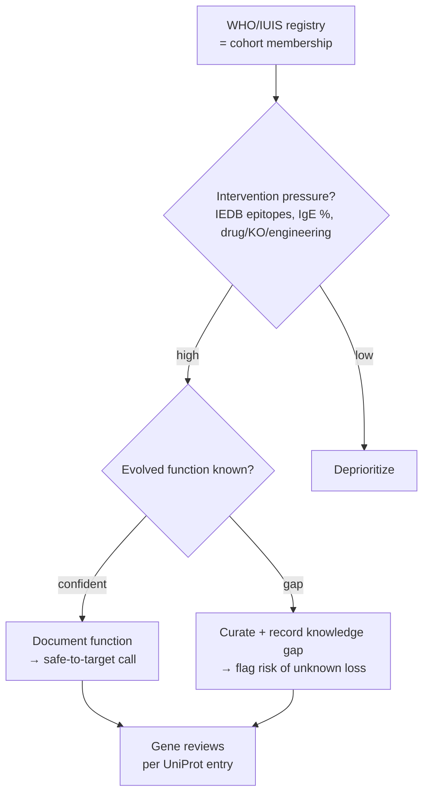

# Allergens Project

> Allergenicity is a **cross-species immunological property** — IgE reactivity in
> a sensitized human — **not** the protein's evolved molecular function. GO, and
> this project's reviews, stay focused on evolved function in the source organism.
> The "allergen" label is used here only as a **prioritization bucket**: a cohort
> of proteins worth reviewing because their function is medically actionable and
> often poorly understood.

## Why an allergens cohort

This is not a new kind of annotation. It is a triage layer that selects genes for
ordinary function review. The motivation is concrete and clinical:

**We increasingly intervene on allergens — so we should know what they do first.**
Major allergens are being knocked out, neutralized, or engineered:

- **CRISPR knockout** of the Fel d 1 genes (CH1/CH2) to make hypoallergenic cats
  [PMID:35386981].
- **Antibody neutralization** (anti–Fel d 1 in cat food; therapeutic IgG4 in
  patients).
- **Allergen-specific immunotherapy** with recombinant/peptide allergens.

Each of these abolishes or suppresses a protein. The obvious safety question —
**"what physiological function do we lose?"** — is exactly a gene-function-review
question. For the cat allergen Fel d 1 the honest answer is *largely unknown*, and
that is the single most decision-relevant finding, captured in each review's
`knowledge_gaps`.

## Scope and unit of analysis

The reviews are per **gene / UniProt entry**, but allergen databases are organized
per **allergen molecule** (e.g. WHO/IUIS *Fel d 1*, which spans two genes,
FELCA/CH1 + FELCA/CH2). The project therefore needs an index/mapping layer
that bridges that one-to-many relationship — the allergen molecule is the cohort
member; the genes are the review units.

## Prioritization metric

Rank candidates within the bucket on **intervention pressure × function
uncertainty**:

- **Intervention pressure** — is the protein being drugged, knocked out, or
  engineered? (IgE prevalence, epitope load, "therapeutic target" flag.)
- **Function uncertainty** — how confidently is the evolved function known? This is
  the axis already modelled in the [Function Knowledge Gaps](FUNCTION_KNOWLEDGE_GAPS.md)
  project.

Allergens score high on both, which is why they are a natural first cohort. The
per-gene deliverable is *"here is the evolved function, or here is the
sharply-bounded gap"* — not *"is it an allergen"* (WHO/IUIS already says so).



## External databases

These are **triage inputs and cross-references only** — they never change a GO
annotation. Build ETL only for sources with genuine APIs; for the rest, parse
downloads (do not write code that just points at a website).

| Facet | Database | Provides | Access |
|---|---|---|---|
| Identity / nomenclature | **WHO/IUIS Allergen Nomenclature** | Official allergen name, source taxon, MW, route, isoallergens | Download tables (no real API) |
| Aggregation | **Allergome** | Per-molecule records, isoforms, refs (already in UniProt DR lines) | Limited/legacy |
| Epitopes | **IEDB** | T-cell & B-cell/IgE epitopes mapped to sequence, assays, MHC | **REST/Query API + exports** |
| Structure + IgE epitopes + cross-reactivity | **SDAP** | Structures, IgE epitopes, FAO/WHO similarity tools | Web tools + downloads |
| Sequence allergenicity / cross-reactivity | **AllergenOnline**, **COMPARE** | Curated allergen FASTA sets | Registered download → local BLAST |
| Structure / fold | PDB, AlphaFoldDB | 3D structure | API (via UniProt) |

**Anchors:** WHO/IUIS (defines the cohort) + IEDB (rich, API-accessible epitope
data). Layer SDAP / AllergenOnline later for cross-reactivity. Treat Allergome as a
cross-reference resolver since UniProt already links it.

These fit the repo's existing patterns: cache-per-record (like `publications/`,
`reactome/`), an index TSV (like `gocams/index.tsv`) keying allergen → UniProt →
review, and SSSOM mapping sets (like the ARO→GO / RHEA→GO projects) for
allergen→UniProt links. Allergen-specific metadata (route of exposure, IgE
prevalence, epitopes) would live in a schema side-block, not in GO — note that
UniProt keyword `KW-0020 Allergen` exists but there is no clean "allergen activity"
GO molecular function, which is precisely why the side-channel is needed.

## Case study: the secretoglobin allergens

The first genes curated under this lens are all **secretoglobins**, which makes a
sharp point: the family shares a *"PLA2 modulation + hydrophobic-ligand binding +
immunomodulation"* theme, yet **no family member has a confirmed endogenous
function** — including the best-studied one.

| Gene | Allergen / protein | Evolved-function status (this project) |
|---|---|---|
| FELCA/CH1 | Fel d 1 chain 1 (major cat allergen) | Ca²⁺ binding (structural); LPS binding → TLR4/TLR2 enhancement; steroid/fatty-acid (pheromone?) binding. **Native cat role unknown.** |
| FELCA/CH2 | Fel d 1 chain 2 (glycosylated chain) | Same complex-level activities; contributes Ca²⁺-coordinating residues. **Native cat role unknown.** |
| mouse/Scgb1a1 | Uteroglobin / CC10 / CC16 (family prototype) | Potent **phospholipase A2 inhibitor**; phospholipid/PCB binding; suppresses Th2 cytokines (IL-4/5/13) via GATA-3 mRNA destabilization. Best-characterized member — yet its *primary* physiological role is still debated. |

The contrast is instructive for the "know before you knock out" thesis: even
uteroglobin, the archetype with decades of study, is annotated mainly through
*PLA2 inhibition* and *Th2 suppression* rather than a settled endogenous purpose;
the uteroglobin knockout mouse shows inflammation/cancer susceptibility, so
"harmless to remove" is not a safe default for Fel d 1 either.

The cat Fel d 1 reviews additionally drew on FutureHouse **Falcon** deep research,
which surfaced the experimentally-grounded LPS-binding / TLR4-enhancement activity
(Herre et al. 2013, [PMID:23878318]) and ligand-binding data
([PMID:34026578]); all such claims were verified against the cited primary
literature before annotation.

## Allergen → UniProt index

The cohort membership and the molecule→gene bridge are maintained as a generated
TSV, [ALLERGENS/allergen_index.tsv](ALLERGENS/allergen_index.tsv), built by
[ALLERGENS/build_allergen_index.py](ALLERGENS/build_allergen_index.py):

```bash
uv run python projects/ALLERGENS/build_allergen_index.py \
    -o projects/ALLERGENS/allergen_index.tsv
```

The builder is deliberately **download-honest**: it derives membership from the
already-cached UniProt records (the `Allergen=` name, the `Allergen` keyword, and
Allergome cross-references) and joins them to the local reviews. It does **not**
call or fake a WHO/IUIS API; to fold in the official registry, drop its downloaded
table into the folder and extend the merge step. Re-running picks up every allergen
gene present under `genes/`, so the index grows automatically as the cohort expands.

Columns: `allergen_molecule` (the WHO/IUIS unit), `allergome_id`, `source_taxon_id`,
`species_code`, `gene_symbol`, `uniprot`, `uniprot_allergen_name`, `review_path`,
`review_status`, `n_core_functions`, `n_knowledge_gaps`, `function_gap_flagged`,
`iedb_epitopes`, `iedb_has_ige` (the last two merged from the IEDB ETL below).

Membership is detected from the cached UniProt records either by the reviewed
`Allergen` keyword/`Allergen=` name **or** by an Allergome cross-reference (so
unreviewed TrEMBL allergens such as Fel d 7 and Fel d 8 are included). The index
currently holds **32 genes across 31 allergen molecules** — the cat, dog, horse,
cow, mouse and rat danders, the headline mite (Der p 1/2/23) and birch (Bet v 1/2)
allergens, and allergens already in the repo for other reasons (e.g. human GBA1,
INS, GLA; yeast SOD2).

### Cross-cohort priority (function gap × IEDB load)

With both axes populated, the index ranks the whole curated cohort. The highest-value
review targets are allergens that are **both** heavily IgE-targeted **and** of
uncertain evolved function:

| allergen | IEDB epitopes (IgE) | function gap | note |
|---|---|---|---|
| Bet v 1 | **450** (IgE+) | **yes** | PR-10 promiscuous ligand carrier; true in-planta ligand unresolved |
| Fel d 1 | 127 (IgE+) | **yes** | secretoglobin; native cat role unknown |
| Can f 1 | 83 (IgE+) | **yes** | tear-lipocalin homolog; specific ligand unknown |
| Der p 23 | 8 (IgE+) | **yes** | peritrophin domain but does **not** bind chitin |
| Der p 1 | 347 (IgE+) | no | characterized cysteine protease |
| Der p 2 | 210 (IgE+) | no | NPC2/MD-2-mimic auto-adjuvant (TLR4) |

The deprioritized rows (Der p 1, Der p 2) carry the *largest* epitope loads yet have
well-defined functions — exactly the "high data, low uncertainty" quadrant the metric
is meant to filter out. Conversely **Bet v 1** rises to the top: the single
most-IgE-targeted allergen in the set whose physiological function is still unresolved.

The index now carries **both axes of the prioritization metric**: `function_gap_flagged`
(uncertainty) and the IEDB epitope counts (`iedb_epitopes`, `iedb_has_ige` —
intervention pressure; see below). The complete domestic-cat set, ranked by the two
axes together:

| allergen molecule | genes (UniProt) | family | function gap? | IEDB epitopes (IgE) | priority |
|---|---|---|---|---|---|
| Fel d 1 | CH1 (P30438) + CH2 (P30440) | secretoglobin | **yes** — native role unknown | **127 (IgE+)** | **highest** |
| Fel d 7 | Feld7 (E5D2Z5) | lipocalin | **yes** — specific ligand unknown | 14 | high |
| Fel d 8 | Feld8 (F6K0R4) | BPI/LBP/PLUNC | **yes** — ligand family-inferred | 0 | medium (gap, low data) |
| Fel d 4 | Feld4 (Q5VFH6) | lipocalin | no — pheromone carrier | 14 (IgE+) | low (characterized) |
| Fel d 3 | CSTA (Q8WNR9) | cystatin | no — cysteine-protease inhibitor | 6 | low (characterized) |
| Fel d 2 | ALB (P49064) | serum albumin | no — multi-ligand carrier | 4 | low (characterized) |

(Fel d 5/6 are cat immunoglobulins, out of scope.) The ranking falls out cleanly:
**Fel d 1** tops it — heavily IgE-targeted (127 epitopes) *and* of unknown native
function — the textbook "know before you knock out" case. The two least-characterized
members (**Fel d 7, Fel d 8**, both unreviewed TrEMBL) also carry gaps, while the
well-understood Fel d 2/3/4 families are deprioritized despite real epitope load.
`mouse/Scgb1a1` is intentionally absent — it is the secretoglobin comparator, not a
registered allergen, so it does not appear in the membership-derived index.

### Registry coverage and fetch worklist

WHO/IUIS publishes no stable API, but UniProt's **`Allergen` keyword (KW-0020)** is
a curated, API-accessible proxy: each reviewed allergen entry carries its WHO/IUIS
designation inline in its protein names as `(allergen <name>)`
(e.g. `(allergen Fel d 1-A)`). [ALLERGENS/fetch_uniprot_allergens.py](ALLERGENS/fetch_uniprot_allergens.py)
snapshots that registry and cross-references it against `genes/` to produce a
prioritizable backlog:

```bash
uv run python projects/ALLERGENS/fetch_uniprot_allergens.py
```

Outputs (UniProt release **2026_02**):

- [ALLERGENS/uniprot_allergens.tsv](ALLERGENS/uniprot_allergens.tsv) — the registry
  snapshot: **1020** reviewed allergen entries spanning **624** allergen molecules,
  with accession, source organism/taxon, gene, WHO/IUIS name, molecule and Allergome id.
- [ALLERGENS/allergen_worklist.tsv](ALLERGENS/allergen_worklist.tsv) — the **1014**
  registry members **not yet fetched**, each with a ready-to-run `fetch-gene` command.

Coverage of this reviewed registry: **6 / 1020** entries (Fel d 1 chains
P30438/P30440; cat Fel d 2/3/4; human thioredoxin). Note this differs from the
local index count (16) above: the registry/worklist tracks only **reviewed**
UniProt entries, whereas the local index also counts unreviewed TrEMBL allergens
(Fel d 7, Fel d 8) and Allergome-listed entries that lack the UniProt `Allergen`
keyword. This calls a real API (UniProt REST) and records the release for
provenance — it does not fabricate or fake-fetch a WHO/IUIS table.

The worklist is currently ordered by organism then allergen name; true
**intervention-pressure** ranking (IgE prevalence, epitope load) awaits the IEDB
epitope step. It is the backlog from which the cohort is grown by running the listed
`fetch-gene` commands and then reviewing each gene.

### IEDB epitopes (intervention-pressure axis)

[ALLERGENS/fetch_iedb_epitopes.py](ALLERGENS/fetch_iedb_epitopes.py) populates the
second axis of the metric from the **IEDB IQ-API** (`query-api.iedb.org`, a real
PostgREST API), writing [ALLERGENS/iedb_epitopes.tsv](ALLERGENS/iedb_epitopes.tsv)
and merging epitope counts into the main index:

```bash
uv run python projects/ALLERGENS/fetch_iedb_epitopes.py
uv run python projects/ALLERGENS/build_allergen_index.py   # re-merge into the index
```

Per allergen molecule it records distinct epitope, B-cell-assay, T-cell-assay and
reference counts and an IgE flag (`has_ige` — the most allergy-relevant signal).

**Join caveat (handled honestly):** IEDB keys allergens under its *own* UniProt
accessions (Fel d 1 = `UNIPROT:A0ABI7XLA3`), which differ from the Swiss-Prot
accessions used here (`P30438`). IEDB does label them by WHO/IUIS **allergen name**,
so the ETL joins by *allergen-molecule name within source taxon* rather than by
accession. This works for WHO/IUIS-style names (`Fel d 1`); it does **not** match
allergens that IEDB labels by ordinary protein name (e.g. human self-allergens
catalogued here as `Hom s …`), which therefore show `0` — meaning *not matched*, not
necessarily *no epitopes*. The cat cohort matches cleanly:

| allergen | IEDB epitopes | IgE | refs |
|---|---|---|---|
| Fel d 1 | 127 | yes | 26 |
| Fel d 4 | 14 | yes | 2 |
| Fel d 7 | 14 | no | 2 |
| Fel d 3 | 6 | no | 3 |
| Fel d 2 | 4 | no | 1 |
| Fel d 8 | 0 | no | 0 |

The numbers track clinical reality (Fel d 1 dominates) and complete the metric:
crossing IEDB epitope load with the function-gap flag yields the priority column in
the cat table above.

**Worklist in action — the dog cohort (Can f 1, 2, 3, 6).** Working the worklist by
intervention pressure (rather than alphabetically) picked the dog allergens next.
The same two-axis ranking applies, and **Can f 1** is the standout:

| allergen | gene | family | function gap? | IEDB epitopes (IgE) | priority |
|---|---|---|---|---|---|
| Can f 1 | Canf1 (O18873) | lipocalin (tear-lipocalin homolog) | **yes** — specific ligand unknown | **83 (IgE+)** | **high** |
| Can f 2 | Canf2 (O18874) | lipocalin | no — odorant binding | 9 | low |
| Can f 6 | Canf6 (H2B3G5) | lipocalin | no — odorant binding | 5 (IgE+) | low |
| Can f 3 | ALB (P49822) | serum albumin | no — multi-ligand carrier | 0* | low |

Can f 1, the dominant dog allergen, mirrors Fel d 1 exactly: heavily IgE-targeted yet
of unknown specific ligand/function — the highest-value review target. (\*Can f 3 = 0
is the same name-join limitation: IEDB labels dog albumin epitopes under other names.)

Two robustness fixes were needed to cover dog: the ETL now **paginates** via the
PostgREST `Range` header (the API rejects `offset`; some taxa exceed 1000 antigens),
and matches the allergen designation by **regex** so embedded IEDB names
("Major allergen Can f 1", "Lipocalin Can f 6.0101") reduce correctly to the molecule.

## Status

- **SCOPING.** Architecture and first secretoglobin cohort drafted.
- Curated: FELCA/CH1, FELCA/CH2, mouse/Scgb1a1.
- Done: allergen→UniProt index (molecule↔gene bridge, now 16 genes / 15 molecules)
  and a UniProt-KW-0020 registry snapshot + fetch worklist (6/1020 reviewed-registry
  covered). The full domestic-cat allergen set (Fel d 1, 2, 3, 4, 7, 8) is curated.
- Done: IEDB epitope ETL — **both axes of the prioritization metric are now live**
  (function-gap flag × IEDB epitope/IgE load), realized in the cat priority ranking.
- Done: worked the worklist by priority — dog cohort (Can f 1/2/3/6), mammalian
  inhalants (horse Equ c 1/2/3/4, cow Bos d 2, mouse Mus m 1, rat Rat n 1), and the
  headline environmental allergens (mite Der p 1/2/23, birch Bet v 1/2). 32 genes /
  31 molecules now in the index with full IEDB load.
- Notable findings: Der p 2 is an MD-2-mimic TLR4 auto-adjuvant (direct Fel d 1
  parallel); MUP (Mus m 1 / Rat n 1) metabolic annotations are ISS over-propagation;
  Bet v 1 ABA-receptor annotations are fold-based over-propagation; Der p 23 chitin
  binding is correctly a negated GOA annotation.
- Next: extend the IEDB name-join to protein-name-labelled allergens (human `Hom s …`),
  then continue the backlog (other pollens, foods, molds, insects) by priority.
