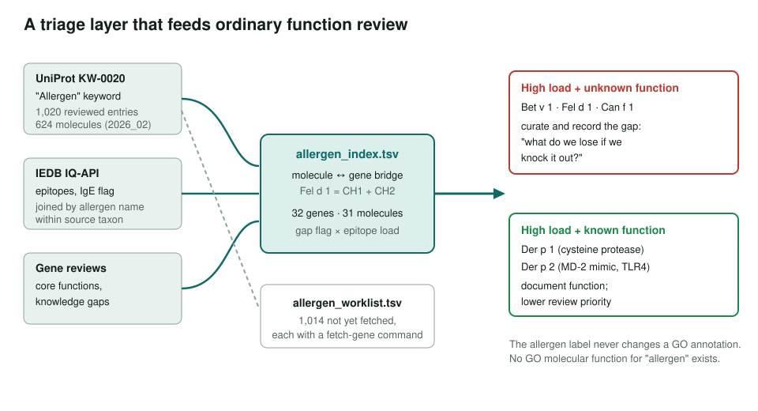
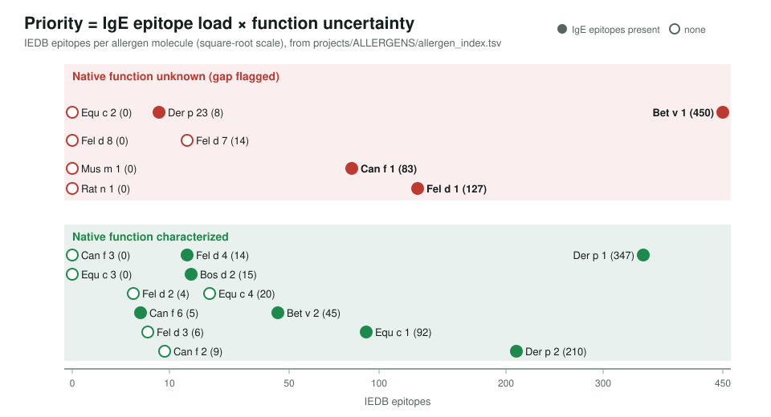
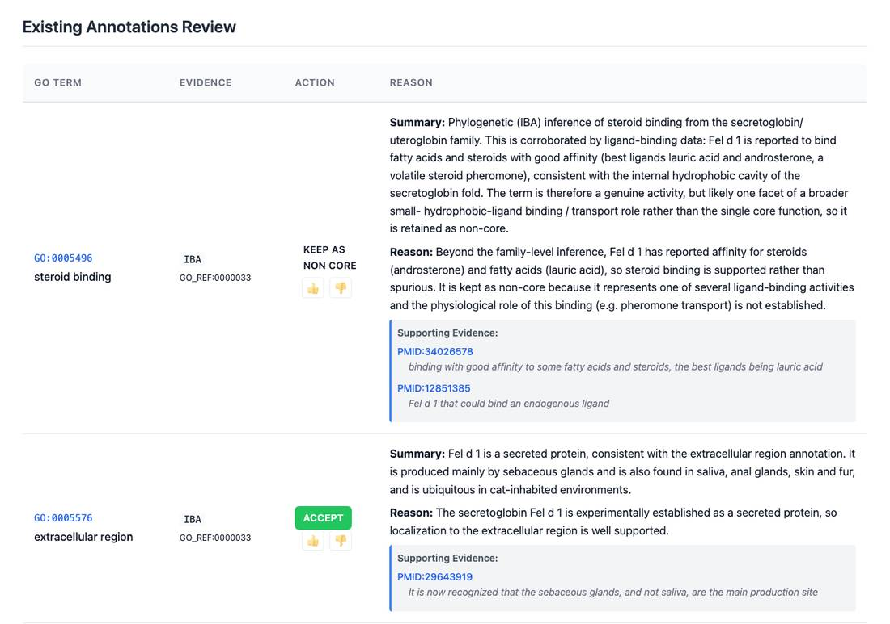

<!-- _class: lead -->

# Allergens

Know what a protein does before you knock it out

AI Gene Review · projects/ALLERGENS · 2026

---

<!-- _class: bluf -->

## Bottom line

- Allergens are being **knocked out, neutralized and engineered**, yet many have **no known native function**.
- We built an allergen→UniProt index, a UniProt registry worklist and an IEDB epitope ETL, then reviewed **24 genes** (cat, dog, horse, cow, mouse, rat, mite, birch + Scgb1a1): **219 existing rows (0 removed, 60 over-annotated) plus 18 new**.
- The top priorities, **Bet v 1, Fel d 1, Can f 1**, are heavily IgE-targeted and their native role is **still unknown**.

---

## Why an allergens cohort

- **CRISPR** knockout of Fel d 1 genes (CH1/CH2) for hypoallergenic cats (PMID:35386981); **antibody** neutralization; **immunotherapy**.
- Each intervention abolishes or suppresses a protein. The safety question is a gene-function question: **what do we lose?**
- Allergenicity is an IgE property of a sensitized human, **not an evolved function**. The label only selects genes; it never changes a GO annotation.

---

## The triage layer

---

## Where the priorities fall

---

## What a review looks like

Fel d 1 chain 1 (CH1): secretion accepted, IBA steroid binding kept as non-core; NEW rows add Ca²⁺ binding, LPS binding and TLR4 enhancement.

---

## Findings

- **Fel d 1** and **Der p 2** both get NEW `GO:0001530` LPS binding and `GO:0034145` positive regulation of TLR4 signalling: two unrelated allergens acting as **auto-adjuvants**.
- **Mus m 1 / Rat n 1** (MUPs): 20 over-annotated rows each, mostly ISS metabolic and insulin-signalling terms.
- **Bet v 1**: ABA-receptor, phosphatase-inhibitor and signalling-receptor rows marked over-annotated (fold-based IEA).
- **Der p 23**: GOA's NOT chitin binding (IDA) accepted; the peritrophin-like domain does not bind chitin.

---

## Status and next steps

- ✅ 24 gene reviews (all DRAFT); index 32 genes / 31 molecules; IEDB axis live.
- ⬜ Registry coverage is small: 6 of 1,020 reviewed UniProt allergen entries when last counted; 1,014 on the worklist.
- ⬜ Extend the IEDB name-join to protein-name-labelled allergens (human `Hom s …`).
- ⬜ Continue the backlog by priority: pollens, foods, molds, insects.

Open tracker: ai4curation/ai-gene-review#4033

**Read more:** `projects/ALLERGENS.md` · `projects/ALLERGENS/allergen_index.tsv`
