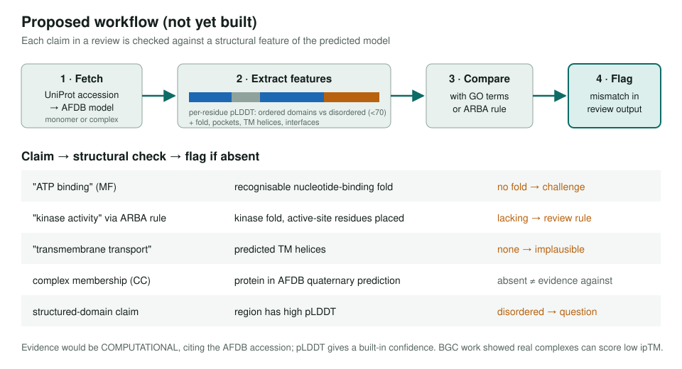
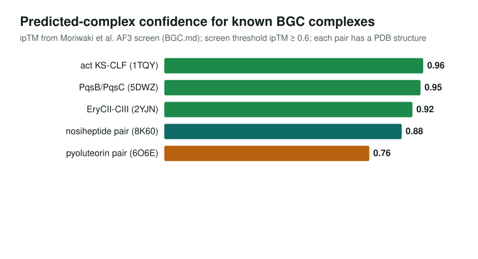

<!-- _class: lead -->

# AlphaFold Database for annotation review

Using predicted monomers and complexes to test GO claims. Scoped, not yet built.

AI Gene Review · projects/ALPHAFOLD · 2026

---

<!-- _class: bluf -->

## Bottom line

- **Scoped, not started as a pipeline**: 0 of 6 action items done; no AFDB fetch step, no schema field.
- Idea: check each GO or ARBA claim against the predicted model (pocket, active site, TM helices, disorder, complex interface).
- One worked use so far: in the **BGC project**, AF3-predicted complexes corroborated three known enzyme complexes.

---

## Why predicted structures

- AFDB now includes **proteome-scale quaternary predictions**, not only monomers.
- 1,580 of the 2,529 pipeline genes have **no deposited PDB structure** (PDB project inventory).
- Five use cases: binding-site checks, transfer confidence for ARBA rules, interface evidence instead of `protein binding`, pLDDT disorder context, flagging implausible rules.

---

## Proposed workflow

---

## The one worked example: BGC complexes

Used as corroboration, not to drive the call. The screen's own validation set shows real complexes can score low, so a missing prediction is not evidence against a complex.

---

## Next steps

- ⬜ Add an AFDB lookup to the bioinformatics pipeline (fetch by UniProt ID)
- ⬜ Script to extract features relevant to GO validation
- ⬜ Pilot on 5–10 ARBA rule reviews: does structure change the outcome?
- ⬜ Test quaternary predictions for complex membership; test pLDDT for domain claims
- ⬜ Consider a structural-evidence field in the review schema

Open tracker: ai4curation/ai-gene-review#3959

**Read more:** `projects/ALPHAFOLD.md` · `projects/BGC.md` · `projects/PDB.md`
