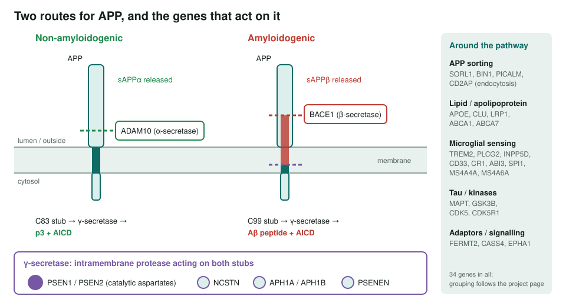
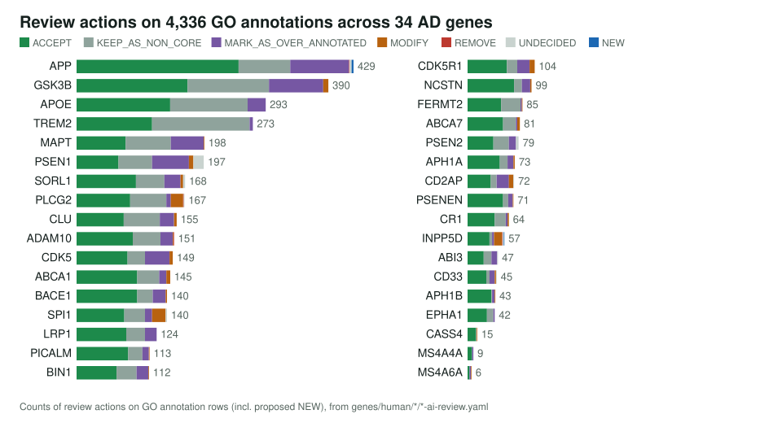
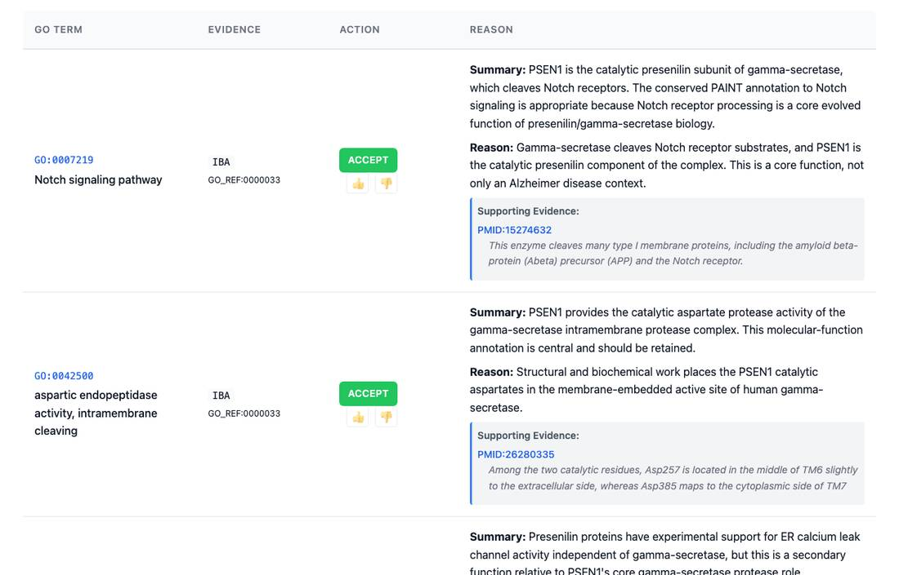
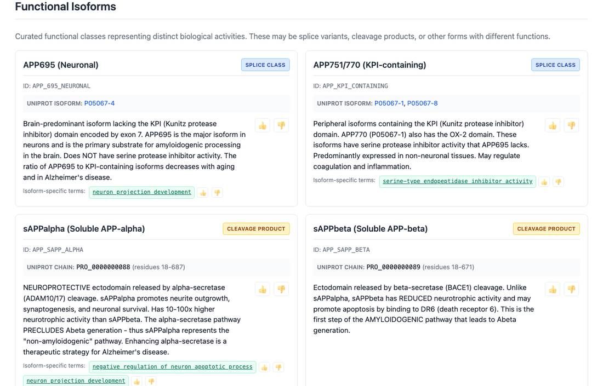

<!-- _class: lead -->

# Alzheimer disease genes

Reviewing every GO annotation on 34 human genes behind amyloid, tau, lipid and microglial biology

AI Gene Review · projects/ALZHEIMER_DISEASE · 2026

---

<!-- _class: bluf -->

## Bottom line

- AD genetics converges on **APP processing**, **tau**, **lipid transport**, **endocytosis** and **microglial immunity**.
- We reviewed **4,336 GO annotation rows** (4,332 existing plus 4 proposed NEW) on **34 human genes**; every review is **COMPLETE** and validates.
- **54% accepted as core**, 630 rows marked over-annotated, only **4 REMOVE**: abstract-only experimental rows were left **UNDECIDED** (34) rather than overruled. The proposed pathway modules are **not built yet**.

---

## The core mechanism: two routes for APP

---

## Why this gene set

- **Mixed on purpose**: familial genes (APP, PSEN1, PSEN2), GWAS and rare-variant risk genes (APOE, TREM2, SORL1, PLCG2, ABI3), and pathway genes (BACE1, the γ-secretase subunits, MAPT, GSK3B, CDK5).
- Anchored on Open Targets and GWAS Catalog for `MONDO:0004975`, plus Bellenguez 2022, Kunkle 2019 and Sims 2017.
- AD genes carry some of the **largest annotation sets** in human GO: APP 429 rows, GSK3B 390, APOE 293, TREM2 273.
- The test: can review separate each gene's **core molecular function** from pleiotropic and disease-context rows?

---

## Actions per gene

---

## What a review looks like

PSEN1 review page: IBA rows for Notch signalling and intramembrane aspartic endopeptidase activity accepted as core γ-secretase function.

---

## APP: isoforms and cleavage products

The APP review separates splice classes and cleavage products (sAPPα, sAPPβ, …) so fragment-specific functions are not pinned on the whole precursor.

---

## Findings

1. **Very few REMOVEs (4)**: APP Notch signalling (IEA keyword), ADAM10 *metallodipeptidase activity* (IEA; ADAM10 is an endopeptidase), PLCG2 Wnt signalling (TAS), INPP5D NKG2A `protein binding` (abstract says SHIP is not associated).
2. **UNDECIDED instead of overruling (34)**: e.g. PSEN1 unusual locations (16), CD33/CD2AP tau-secretion rows from an FRMD4A-centred screen.
3. **4 NEW** terms: APP *cell adhesion mediator activity*, *cell adhesion molecule binding*, *copper ion binding*; INPP5D *phosphotyrosine residue binding*.
4. **MODIFY concentrated in signalling genes**: SPI1 21, PLCG2 19, INPP5D 12.

---

## Status and next steps

- ✅ 34/34 gene reviews COMPLETE, most with a second-pass `reference_review` audit.
- ⬜ Reusable normal-biology modules: APP processing, γ-secretase intramembrane proteolysis, apolipoprotein transport, microglial lipid sensing, tau microtubule biology, endocytic adaptors.
- ⬜ Resolve the 34 UNDECIDED rows with full text.

**Read more:** `projects/ALZHEIMER_DISEASE.md` · `genes/human/<GENE>/`
