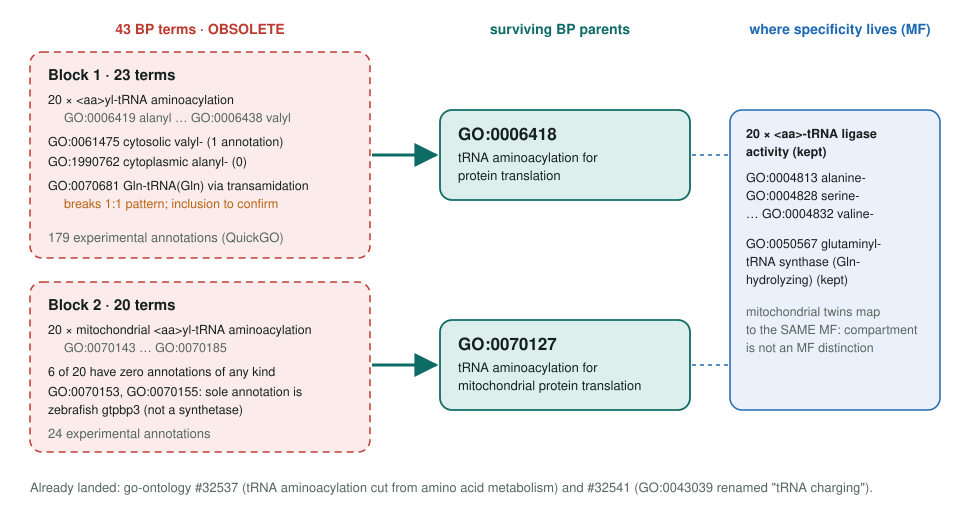
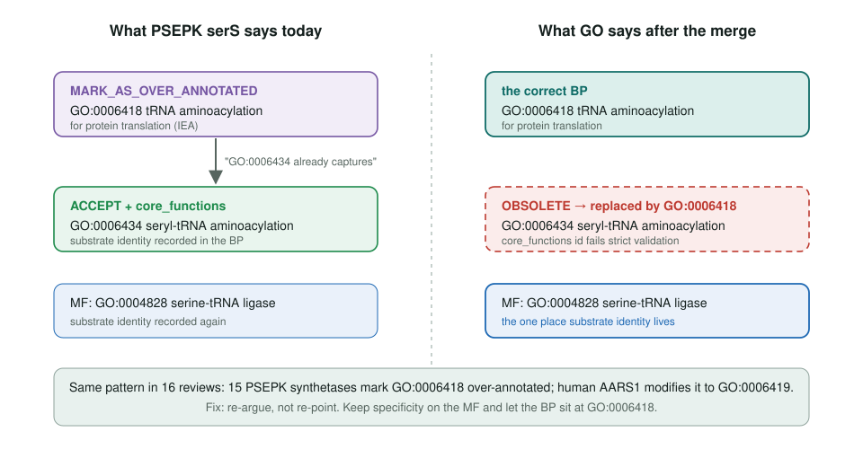
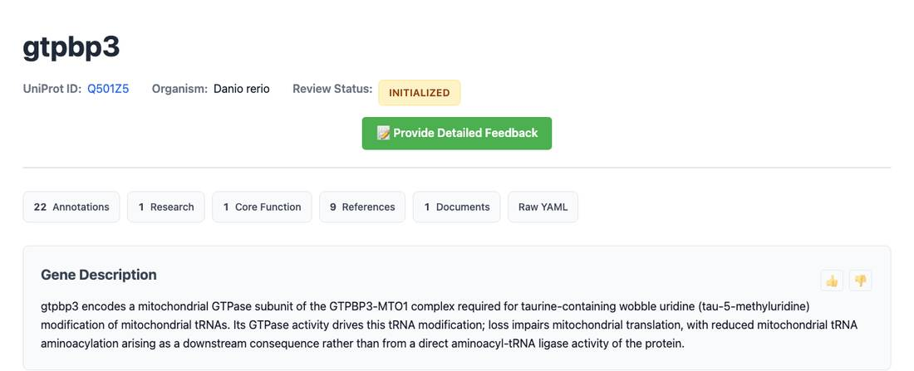

<!-- _class: lead -->

# 43 tRNA aminoacylation terms are going

Substrate-specific tRNA charging BPs merge into GO:0006418 and GO:0070127

AI Gene Review · projects/AMINO_ACID_ACTIVATION_OBSOLETION · 2026

---

<!-- _class: bluf -->

## Bottom line

- GO is obsoleting **43 BP terms** that name the amino acid charged onto tRNA; specificity already lives on the **`<aa>-tRNA ligase` MF** terms.
- **33 reviews** here touch the obsoleted terms, **26** inside strictly validated `core_functions`.
- **16 reviews** argue the opposite of GO: they mark **GO:0006418** over-annotated because the specific child "already captures" the process. No review has been edited yet.

---

## Old terms → replacements

---

## Why GO is doing this

- Each obsoleted BP has an exact **1:1 MF counterpart** (GO:0006419 ↔ GO:0004813 alanine-tRNA ligase).
- **Compartment** is not an MF distinction either: mitochondrial twins map to the same MF.
- The mitochondrial block is barely used: **24 experimental annotations** across 20 terms, **6 terms with none**.
- Surrounding hierarchy already fixed: #32537 and #32541 merged in August 2026.

---

## The inverted judgment

---

## gtpbp3: a laundering risk

- **GO:0070153** and **GO:0070155** each have **one annotation in all of GOA**: zebrafish **gtpbp3**, IMP, PMID:30916346.
- gtpbp3 is a **tRNA-modifying GTPase**, not a synthetase. Our review marks all six rows **MARK_AS_OVER_ANNOTATED**.
- A bulk merge would turn six visible over-annotations into one plausible GO:0070127 row. **Withdraw, don't migrate.**

---

## Repo impact today

| Group | Reviews | Note |
|---|---|---|
| PSEPK synthetases | 21 | 15 mark GO:0006418 over-annotated |
| PSEPK gatA/gatB/gatC | 3 | GO:0070681 row UNDECIDED |
| human AARS1, AARS2 | 2 | AARS2 proposes GO:0070143, itself obsolete |
| POPTR ALARS, GATC; METTP gatC | 3 | core_functions on obsoleted ids |
| DANRE gtpbp3 | 1 | six IMP rows, over-annotated |
| human AARSD1, DARS2; DROME TyrRS | 3 | annotation rows only |

Counted from genes/*/*/*-ai-review.yaml on 2026-09-26. The page's own tables predate the PSEPK batch (#2899).

---

## Status and next steps

1. **Wait** for go-ontology#15375 to land; module text notes QuickGO's 2026-09-22 snapshot already obsoletes GO:0006421, GO:0006425, GO:0070681.
2. **Comment on go-annotation#6525**: withdraw the gtpbp3 cluster; confirm GO:0070681 is in the batch.
3. **Re-argue** the 16 inverted reviews; re-point `core_functions` in 26.
4. Refresh `modules/bacterial_aminoacyl_trna_charging.yaml`.

**Read more:** `projects/AMINO_ACID_ACTIVATION_OBSOLETION.md`
