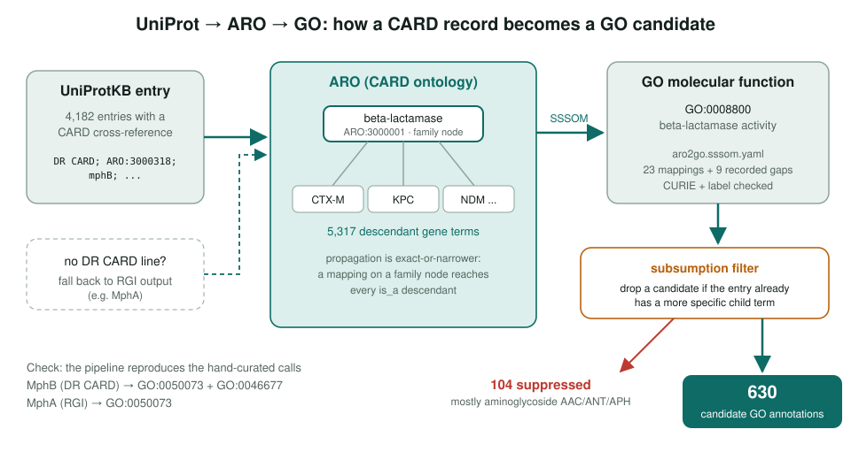
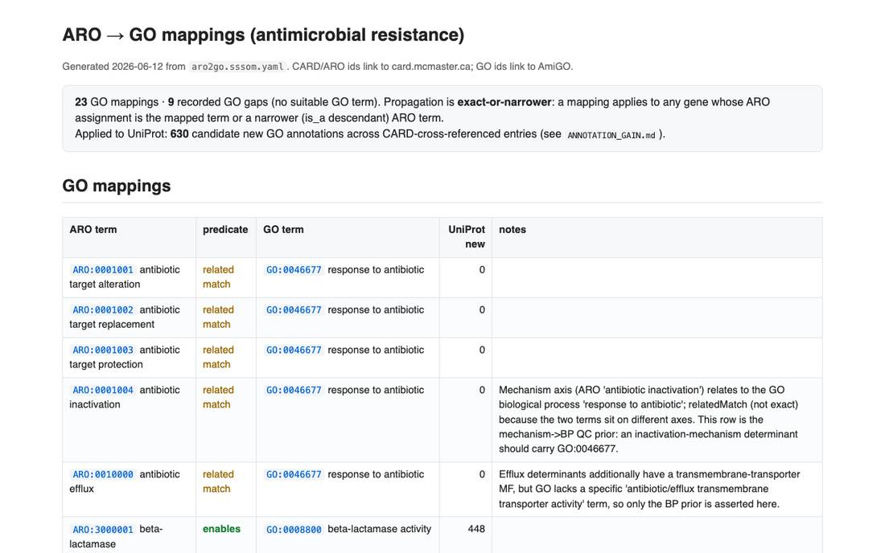
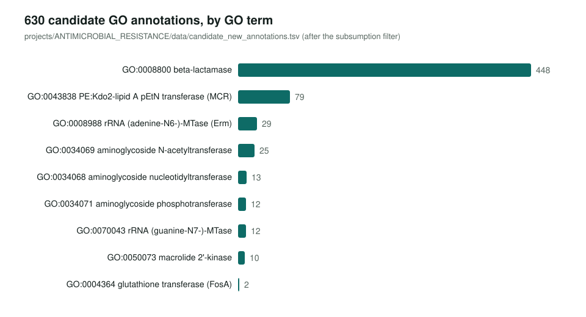
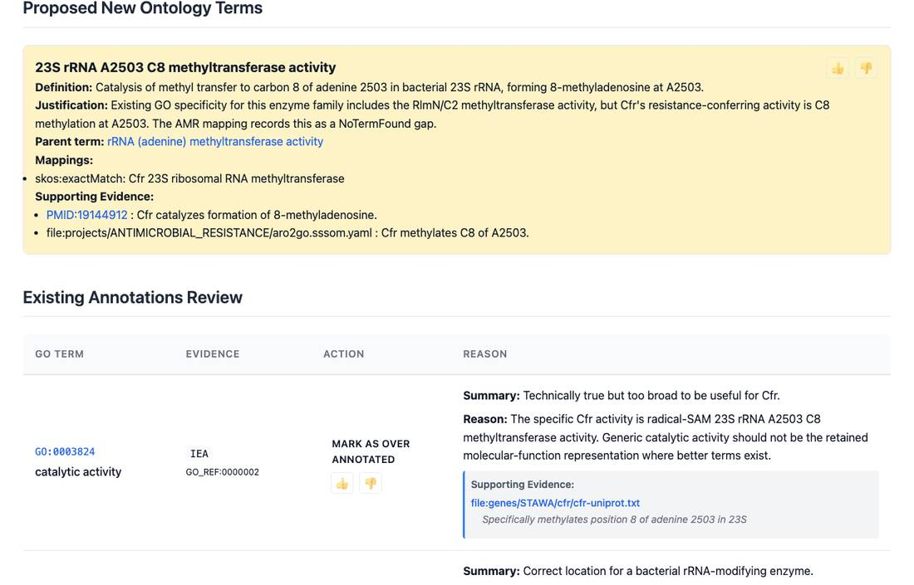

<!-- _class: lead -->

# Antimicrobial resistance

Reviewing 30 resistance determinants and bridging CARD's ontology to GO

AI Gene Review · projects/ANTIMICROBIAL_RESISTANCE · 2026

---

<!-- _class: bluf -->

## Bottom line

- Resistance enzymes are well understood, but GO usually holds only a generic term like **transferase activity**, or nothing.
- We reviewed **30 determinants** in 21 species (140 rows, **47 NEW**) and built a validated **ARO→GO mapping** (23 mappings, 9 gaps).
- Applied to **4,182** CARD-linked UniProt entries it yields **630 candidate GO annotations**; a spot check found 4/6 correct, so they are **curator leads**.

---

## Why AMR, and why CARD

- **Sparse GO, rich biochemistry**: e.g. MphA and MphB had empty GOA records.
- **CARD / ARO** already curates mechanism, drug class, gene family and PMIDs for each determinant (OBO Foundry, CC-BY 4.0).
- ARO has **no GO cross-references** (zero `GO:` xrefs in 8,602 classes), so the bridge has to be built here.
- `response to antibiotic` (`GO:0046677`) is usually present and true. The gain is the **missing enzyme chemistry**.

---

## The pipeline

---

## The mapping set

aro2go.html: curator view of the SSSOM mappings, gaps and UniProt impact. `just validate-mappings` checks every ARO/GO CURIE and label.

---

## Where the gains are

---

## Spot check of six candidates

| # | Entry | Candidate GO | Verdict |
|---|---|---|---|
| 1 | MCR-1 | GO:0043838 pEtN transferase | correct, high value |
| 2 | RmtE | GO:0070043 rRNA guanine-N7 MTase | correct refinement |
| 3 | ermZ/srm1 | GO:0052910 23S A-N6 diMTase | correct, more precise |
| 4 | AAC(6')-Ib8 | GO:0034069 | redundant: has child GO:0047663 |
| 5 | OXA-1090 | GO:0008800 beta-lactamase | questionable: may be a PBP |
| 6 | FosK | GO:0004364 | mapping over-generalises (FosB) |

Fixes that followed: subsumption filter (104 suppressed), fosfomycin mapping restricted to FosA, Erm mapped to family-safe GO:0008988.

---

## Gene reviews: where GO has no term

Cfr review: generic rows marked over-annotated, tRNA carryover removed, and a new term proposed. Six such full reviews (tetX, fosB, arr, ereB, lnuA, cfr) each propose a missing leaf MF.

---

## Results across 30 reviews

| Action | Rows |
|---|---|
| NEW | 47 |
| ACCEPT | 46 |
| MODIFY | 34 |
| KEEP_AS_NON_CORE | 6 |
| MARK_AS_OVER_ANNOTATED | 5 |
| REMOVE | 2 |

140 existing-annotation rows. NEW dominates because many TrEMBL accessions had no GOA at all. The 30-gene cohort is draft-level (curator leads).

---

## Status and next steps

- ✅ 30 gene reviews, SSSOM mapping set, pipeline, annotation-gain report and spot review.
- ⬜ Submit GO requests for the 9 no-match ARO rows plus FosB.
- ⬜ Next families: mph(C/E/G), erm(B/C), mef(A/E), ere(A), CTX-M / KPC — tracked in #4037.

**Read more:** `projects/ANTIMICROBIAL_RESISTANCE.md` · `projects/ANTIMICROBIAL_RESISTANCE/aro2go.sssom.yaml` · `uniprot2aro2go.py`
