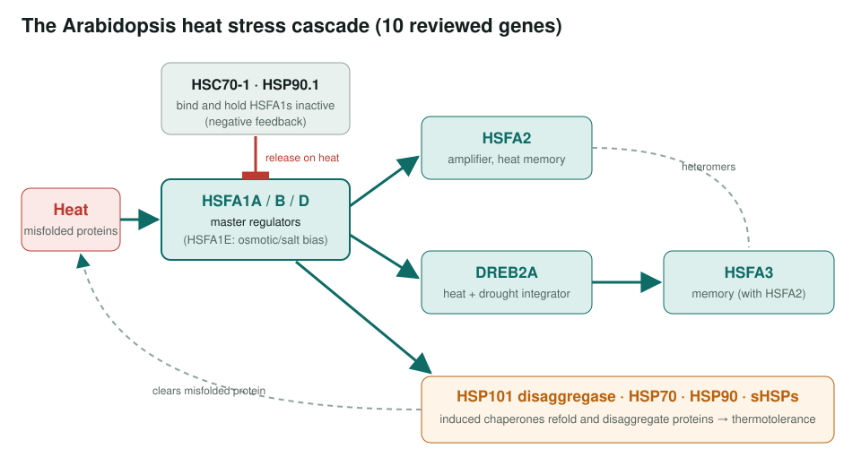
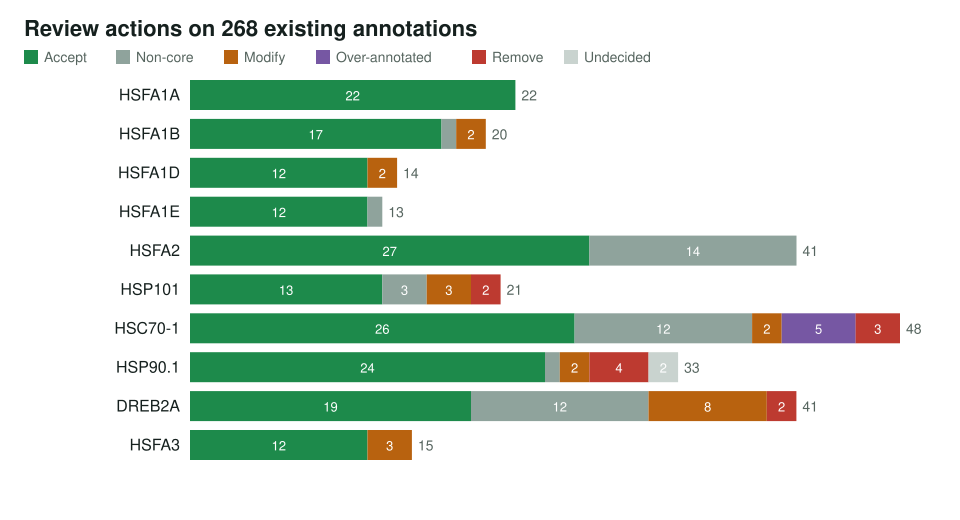
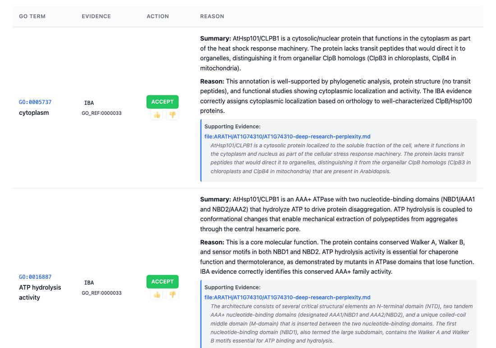

<!-- _class: lead -->

# Arabidopsis heat stress

Reviewing GO annotations for 10 genes of the heat stress response network

AI Gene Review · projects/ARATH_HEAT_STRESS · 2026

---

<!-- _class: bluf -->

## Bottom line

- Heat tolerance runs through a cascade: **HSFA1 master regulators** switch on **HSFA2 / DREB2A / HSFA3**, and **chaperones** protect proteins and feed back on the HSFs.
- We reviewed **all 266 existing GO annotations** on **10 genes**: 183 accepted, 36 non-core, 24 modified, 12 over-annotated, **9 removed**, 2 undecided, plus 10 new.
- **Main corrections:** `protein binding` → specific partner terms; chloroplast rows **removed** for cytosolic HSP101 and HSC70-1; sharper HSFA3 / DREB2A terms.

---

## The network we reviewed

---

## Why this network

- **Strong genetics**: the *hsfa1a/b/d* triple mutant and *hot1* (HSP101) mutants lose thermotolerance.
- **Distinct roles** that a review should keep apart:
  - master regulators (HSFA1A/B/D) vs amplifiers (HSFA2, HSFA3)
  - a positive chaperone effector (HSP101) vs a **negative** regulator (HSC70-1)
  - a cross-stress integrator (DREB2A)
- The failure mode to avoid: tagging every gene "response to heat" and stopping.

---

## Actions per gene

Counts from the current review files; the tables in projects/ARATH_HEAT_STRESS.md date from Nov 2025.

---

## What a review looks like

HSP101 (AT1G74310) review page: each GOA row gets an action, a reason and supporting text.

---

## Main corrections

1. **`protein binding` (GO:0005515)** IPI rows → specific terms: HSFA1B → *heat shock protein binding*, HSFA1D → *Hsp90 protein binding*, HSC70-1 → *DNA-binding TF binding*, HSP101 → *14-3-3 protein binding*; four HSP90.1 rows **removed**.
2. **Localization**: HSP101 *chloroplast stroma/envelope* (HDA) and HSC70-1 *chloroplast* rows **removed**; both proteins are cytosolic.
3. **Process**: HSFA3 *response to heat* → *heat acclimation* (GO:0010286); HSP101 *protein unfolding* → *protein refolding*.
4. **DREB2A**: six *cis-regulatory region binding* rows → *sequence-specific* DNA binding.

---

## Status and next steps

- ✅ 10/10 gene reviews complete (Tier 1 regulators, Tier 2 chaperones, Tier 3 integrators).
- ✅ Per-gene tables on the project page refreshed from the current files.
- ⬜ A second DREB2A review exists under `genes/ARATH/DREB2A/` alongside `AT5G05410/`; reconcile.
- ⬜ Network integration: capture HSF → target hierarchy (module or GO-CAM).

**Read more:** `projects/ARATH_HEAT_STRESS.md` · `genes/ARATH/<LOCUS>/`
