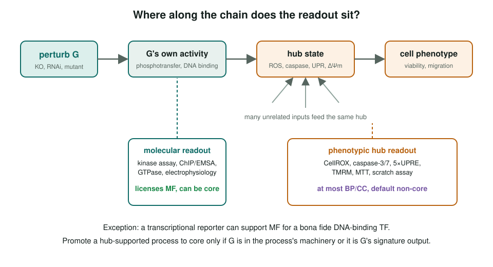
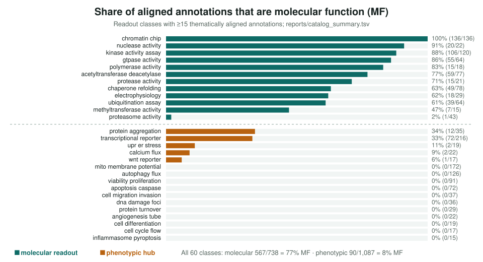

<!-- _class: lead -->

# Assay to function

Which experimental readouts support a GO annotation, and which inflate it

AI Gene Review · projects/ASSAY_TO_FUNCTION · 2026

---

<!-- _class: bluf -->

## Bottom line

- Evidence codes hide **how close a readout is to the gene's own activity**. We catalogued **60 readout classes** and mined the papers behind every PMID-backed reviewed annotation.
- Aligned annotations: molecular readouts **77% MF** (567/738), phenotypic hubs **8% MF** (90/1,087), nearly all of it TF reporters.
- Hub readouts are rarely wrong; they get **demoted to non-core**. Rubric + flagger → **6** rows in 4 genes moved to KEEP_AS_NON_CORE.

---

## The hidden axis

---

## How we measured it

- `mine_readouts.py`: regex catalogue over review prose. **Failed usefully**: curators write synthesis, not methods (CellROX/DCFDA/MitoSOX matched zero reviews).
- `mine_papers.py`: the same catalogue over the **cached publications**, joined to GO aspect and action; 36,660 PMID-backed annotations.
- **Thematic alignment**: keep only rows whose GO term is about the process the readout reports.
- QC on matched strings caught `HyPer`→"hyper-", `ERSE`→"diverse", `MTS`→"MTs", `OCR`→*ocr-2*.

---

## The proximity axis holds across 60 classes

---

## Correct but peripheral

| Readout (aligned) | Reviewed | ACCEPT | NON_CORE | rm/OA% |
|---|--:|--:|--:|--:|
| Viability / proliferation | 90 | 21 | **58** | 9% |
| Apoptosis / caspase | 63 | 25 | **34** | 3% |
| Mito. membrane potential | 165 | 98 | 20 | **21%** |
| Transcriptional reporter | 207 | 146 | 36 | 7% |
| Autophagy flux | 124 | 80 | 20 | 5% |

First publications pass. Hard removal rates are comparable to molecular controls; the signal is demotion to non-core.

---

## From rubric to edits

- **Rule:** a convergent phenotypic readout licenses at most a BP/CC term, never a regulatory MF, default non-core; promote only for machinery or a signature output.
- **Flagger:** Tier 1 = MF from a hub; Tier 2 = core hub-aligned BP/CC. Current file: **443** candidates (5 + 438).
- **Edits (verified in YAML):** PDGFB GO:0072126 ×2, HMGB1 GO:0007204, mouse Sirt2 GO:0051781, VEGFA GO:0043066 ×2 → KEEP_AS_NON_CORE.
- IL21 GO:0042102 → KEEP_AS_NON_CORE after an OpenScientist run (#1558); STAT3 GO:0030335 ×2 still **UNDECIDED** (#1422).

---

## What re-review taught us

1. All 7 original Tier-1 flags were **defensible**: binding MF is direct evidence (Calm2, HRC), and coregulator MF is fine for real coregulators.
2. Almost every standing-ACCEPT Tier-2 flag was **machinery** (CDK1, RB1, BRCA1, PSMA1) or a **signature output** (VEGFA → angiogenesis).
3. The flagger's value is on **unreviewed** annotations, not re-litigating accepted core calls.

---

## Status and next steps

- ✅ 60-class catalogue, rubric (`RUBRIC.md`, `rubric.yaml`), flagger, 6 edits. Mature.
- ⬜ Curator triage of `flagged_candidates.tsv`, starting with `indirect_ligand`.
- ⬜ Generalise the machinery discriminator beyond signalling ligands.
- ⬜ Decide STAT3 migration (#1422).

**Read more:** `projects/ASSAY_TO_FUNCTION.md` · `projects/ASSAY_TO_FUNCTION/RUBRIC.md` · `reports/catalog_table.md`
