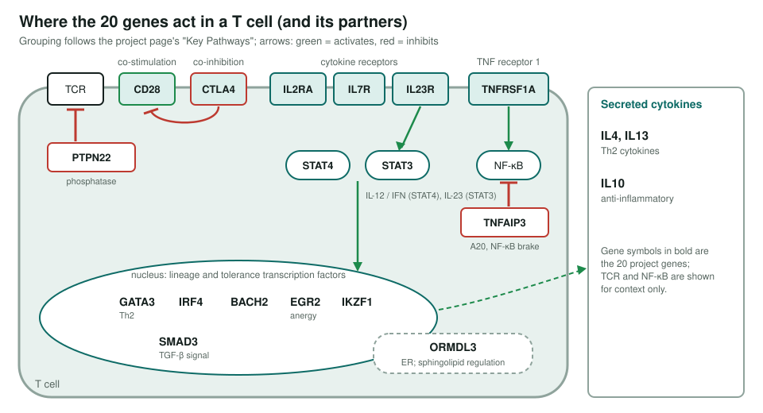
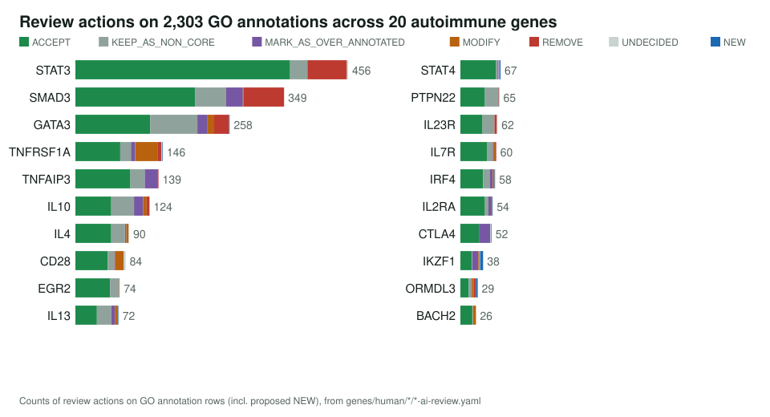
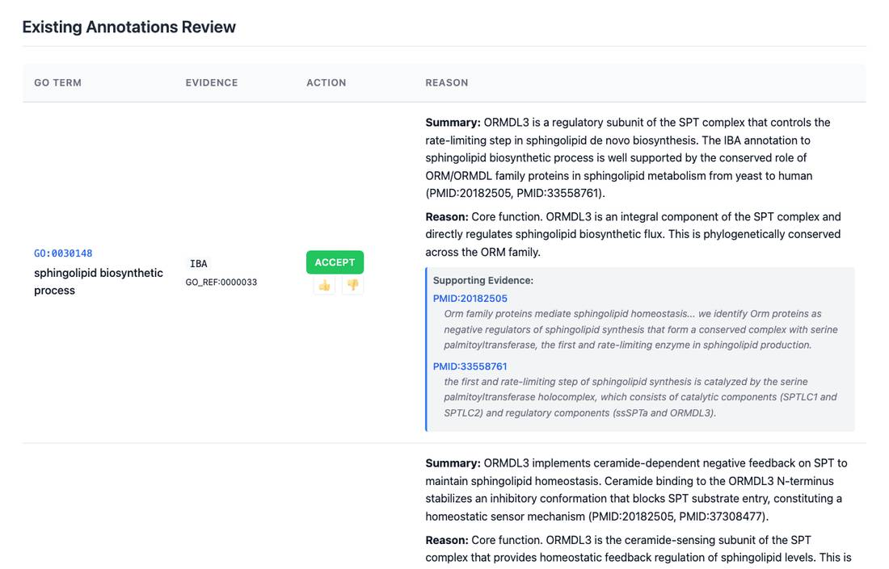

<!-- _class: lead -->

# Autoimmune genetics: greatest hits

Reviewing every GO annotation on 20 shared autoimmune risk genes

AI Gene Review · projects/AUTOIMMUNE · 2026

---

<!-- _class: bluf -->

## Bottom line

- 20 immune-regulation genes carry risk variants for **several autoimmune diseases at once** (T1D, RA, MS, IBD, SLE).
- We reviewed **2,303 GO annotation rows** (2,287 existing plus 16 proposed NEW); every row is actioned and all 20 reviews validate.
- **1,464 accepted**, **180 removed** (150 of them generic `protein binding`, mostly on STAT3 and SMAD3), **16 NEW**. Review files are not all finalised: 10 COMPLETE, 5 DRAFT, 5 IN_PROGRESS.

---

## Where the genes act

---

## Why these genes

- Chosen as the most strongly replicated, functionally validated autoimmune risk loci (Tier 1: 11 genes) plus well-established risk genes (Tier 2: 9).
- Six pathway groups: T cell activation and inhibition, Th1/Th2 polarisation, Th17/Treg balance, NF-kB/TNF, tolerance, ER sphingolipid control.
- Several are among the most heavily annotated immune genes: **STAT3 456 rows**, **SMAD3 349**, **GATA3 258**.

---

## Actions per gene

---

## What a review looks like

ORMDL3 review page: sphingolipid biosynthesis (IBA) accepted as core; ORMDL3 is the ceramide-sensing regulatory subunit of serine palmitoyltransferase.

---

## Findings

1. **`protein binding` IPI removed en masse**: 150 of 180 REMOVEs; STAT3 66, SMAD3 68, GATA3 7.
2. **Propagation errors removed**: IL23R *prolactin receptor activity* (IBA) and *prolactin signaling pathway* (IEA).
3. **ORMDL3 gets its real function** as NEW terms: *enzyme inhibitor activity*, *ceramide binding*, *negative regulation of sphingolipid biosynthetic process*; generic TAS membrane locations removed.
4. **UNDECIDED resolved** for IL4, IL7R, CD28 and IL10 once publications were cached; 11 remain.

---

## Status and next steps

- ✅ 20/20 reviews actioned and validating (0 errors).
- ⬜ Finalise review status: 5 DRAFT, 5 IN_PROGRESS (#4041).
- ⬜ Validator warnings: GO:0005515 policy, Falcon evidence links, BACH2/EGR2 core coverage.
- ✅ The STAT3 deep-research to-do is done (`STAT3-deep-research-falcon.md`).

**Read more:** `projects/AUTOIMMUNE.md` · `genes/human/<GENE>/`
