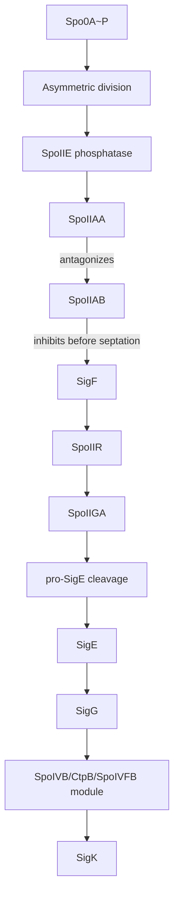

# Bacillus subtilis Sporulation Sigma Cascade (Pathway)

Focused pathway summary for the core sporulation regulatory cascade in *Bacillus subtilis* (BACSU), centered on the ordered activation of compartment-specific sigma factors.

## Scope

Core sigma cascade:
- spo0A
- spoIIE
- spoIIAA
- spoIIAB
- sigF
- spoIIR
- spoIIGA
- sigE
- sigG
- sigK

Related sporulation reviews:
- spo0J (chromosome partitioning)
- spoIIB (engulfment and polar septation)
- spoVAD (spore core maturation)
- spoVD (spore cortex synthesis)
- minC (septum site control)

ZagA/YciC is a zinc metallochaperone and not part of the sporulation cascade.

## Pathway Overview

Sporulation proceeds via a tightly ordered regulatory cascade that couples asymmetric division to sigma factor activation in distinct compartments.

Key logic:
1. Spo0A~P initiates sporulation program.
2. After asymmetric division, septal SpoIIE dephosphorylates SpoIIAA-P.
3. SpoIIAA antagonizes the SpoIIAB anti-sigma factor, freeing SigF in the forespore.
4. SigF induces SpoIIR, which signals to mother-cell SpoIIGA to cleave pro-SigE.
5. SigE activates the early mother-cell program and enables later SigG activation.
6. SigG drives late forespore transcription and signals back through the SpoIVB/CtpB/SpoIVFB module.
7. SpoIVFB cleavage of pro-SigK activates the late mother-cell program.

## Core Gene Roles (Concise)

| Gene | Role | Compartment/Stage |
|---|---|---|
| **spo0A** | Master response regulator; initiates sporulation | Pre-divisional |
| **spoIIE** | PP2C phosphatase; activates SigF via SpoIIAA dephosphorylation | Asymmetric septum |
| **spoIIAA** | Anti-anti-sigma factor that releases SigF from SpoIIAB | Forespore switch |
| **spoIIAB** | Anti-sigma factor and kinase that keeps SigF inactive before septation | Forespore switch |
| **sigF** | Early forespore sigma factor | Forespore (early) |
| **spoIIR** | Forespore-to-mother-cell signal for pro-SigE processing | Intercompartment signal |
| **spoIIGA** | Protease for pro-SigE processing | Mother cell (early) |
| **sigE** | Early mother-cell sigma factor | Mother cell (early) |
| **sigG** | Late forespore sigma factor | Forespore (late) |
| **sigK** | Late mother-cell sigma factor | Mother cell (late) |

## Cascade Diagram (Simplified)

## Suggested Review Order

1. spo0A
2. spoIIE
3. spoIIAA
4. spoIIAB
5. sigF
6. spoIIR
7. spoIIGA
8. sigE
9. sigG
10. sigK

## Link to Project Context

See broader B. subtilis notes and existing review status in:
- [projects/BACSU.md](../BACSU.md)
