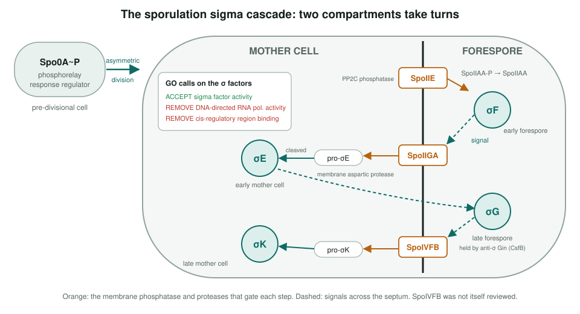
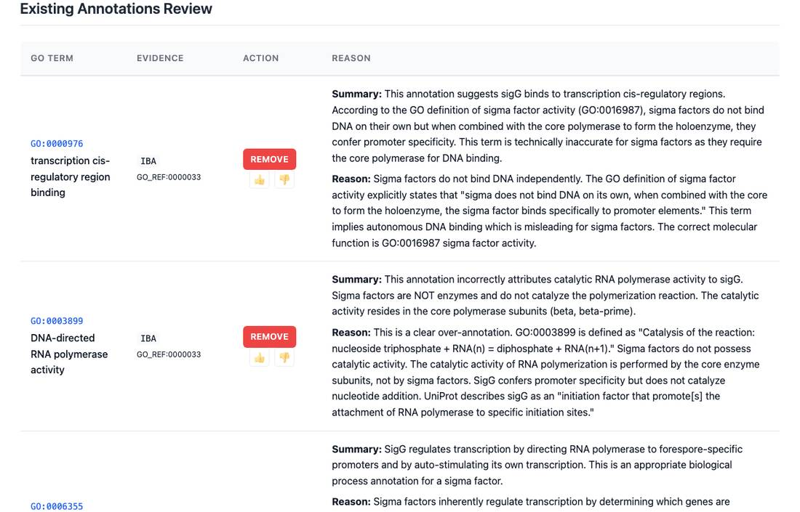
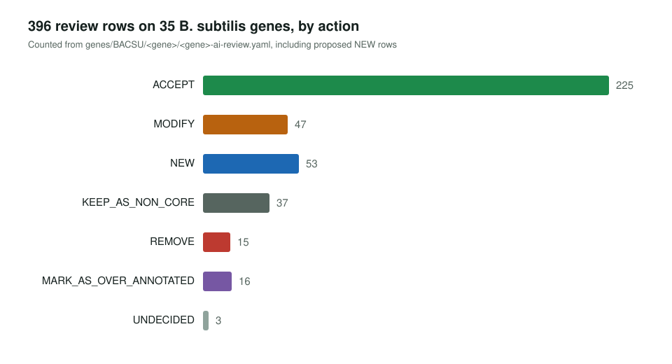

<!-- _class: lead -->

# *Bacillus subtilis*

Reviewing GO annotations on 29 genes of the model Gram-positive bacterium

AI Gene Review · projects/BACSU · 2026

---

<!-- _class: bluf -->

## Bottom line

- We reviewed **every GO annotation on 29 genes** in three rounds: CACAO-curated genes, key functional genes, and the **sporulation sigma cascade** plus industrial enzymes.
- **343 rows**: 200 accepted, 28 kept as non-core, 45 modified, 44 NEW, 14 removed, 10 over-annotated, 2 undecided.
- Recurring fixes: **sigma factors are not RNA polymerases**, a fold-based **acyltransferase** call on spoVAD removed, rows citing a paper that never mentions the gene removed.

---

## Why *B. subtilis*

- Model **Gram-positive** bacterium, the counterpart to *E. coli*.
- Model for **cell differentiation**: sporulation runs on a cascade of compartment-specific sigma factors.
- Naturally **competent**, and an industrial secretion host (subtilisin, amylase, levansucrase).
- Round 1 targeted genes where **CACAO** student curation had contributed heavily, to test those rows.

---

## The sporulation sigma cascade

---

## Sigma factors are not polymerases

sigG review: IBA rows for RNA polymerase activity (GO:0003899) and cis-regulatory region binding (GO:0000976) removed; the correct function is GO:0016987 sigma factor activity. Same calls on sigF and sigK.

---

## Results across 29 genes

---

## Notable findings

1. **PMID:25313396** lists the minimal FlgM-secretion components and does not include fliH, fliY or swrD. Rows citing it were **removed** (fliY, swrD) or left **UNDECIDED** (fliH).
2. **spoVAD**: `acyltransferase activity` came from a thiolase-like fold; it is a Ca-DPA channel component. **Removed**.
3. **yddE** is labelled uncharacterized in UniProt but is **ConE**, the VirB4-like ATPase of the ICEBs1 conjugation system.
4. Generic `metal ion binding` refined to **zinc / calcium binding** (nprE); `hydrolase activity` marked over-annotated where specific terms exist.

---

## Status and next steps

- ✅ 29/29 reviews present and rendered; sporulation cascade pathway summary written.
- ⬜ Most YAML files still say `status: DRAFT`; fliH has 2 UNDECIDED rows.
- ⬜ Fix the project tables: several UniProt IDs differ from the reviewed accessions (lipA is reviewed as lipoyl synthase O32129).

**Read more:** `projects/BACSU.md` · `projects/BACSU/BACSU_SPORULATION-pathway.md` · `genes/BACSU/<gene>/`
