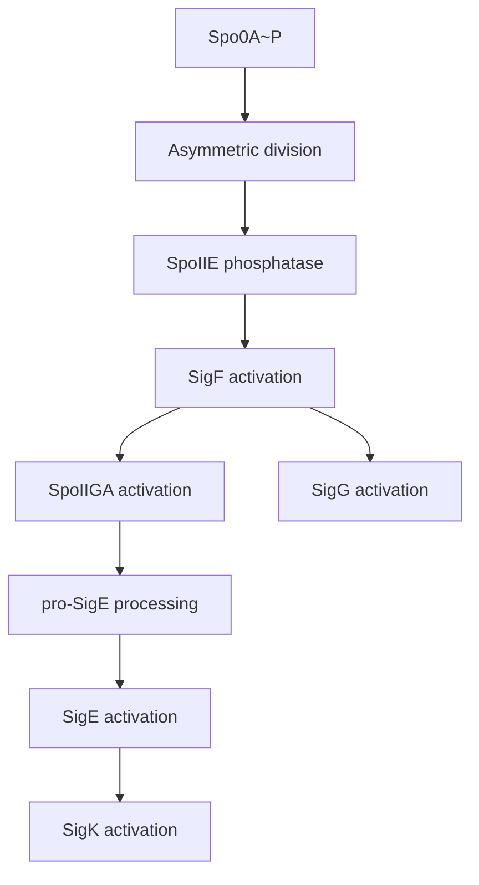

# Bacillus subtilis Sporulation Sigma Cascade (Pathway)

Focused pathway summary for the core sporulation regulatory cascade in *Bacillus subtilis* (BACSU), centered on the ordered activation of compartment-specific sigma factors.

## Scope (Core 5–7 genes)

Minimal core:
- spo0A
- spoIIE
- sigF
- spoIIGA
- sigE
- sigK

Optional add-ons (for process completeness):
- sigG (late forespore program)
- spo0J (chromosome partitioning)
- spoVAD (spore core maturation)
- minC (septum site control)

## Pathway Overview

Sporulation proceeds via a tightly ordered regulatory cascade that couples asymmetric division to sigma factor activation in distinct compartments.

Key logic:
1. Spo0A~P initiates sporulation program.
2. Asymmetric division triggers SpoIIE phosphatase activity.
3. SigF activates early forespore gene expression.
4. SpoIIGA processes pro-SigE in mother cell.
5. SigE activates early mother-cell program.
6. SigK activates late mother-cell program.
7. SigG (forespore) activates late forespore program (optional).

## Core Gene Roles (Concise)

| Gene | Role | Compartment/Stage |
|---|---|---|
| **spo0A** | Master response regulator; initiates sporulation | Pre-divisional |
| **spoIIE** | PP2C phosphatase; activates SigF via SpoIIAA dephosphorylation | Asymmetric septum |
| **sigF** | Early forespore sigma factor | Forespore (early) |
| **spoIIGA** | Protease for pro-SigE processing | Mother cell (early) |
| **sigE** | Early mother-cell sigma factor | Mother cell (early) |
| **sigK** | Late mother-cell sigma factor | Mother cell (late) |
| **sigG** | Late forespore sigma factor | Forespore (late) |

## Cascade Diagram (Simplified)

## Suggested Review Order

1. spo0A
2. spoIIE
3. sigF
4. spoIIGA
5. sigE
6. sigK
7. sigG (if included)

## Link to Project Context

See broader B. subtilis notes and existing review status in:
- [projects/BACSU.md](projects/BACSU.md)
