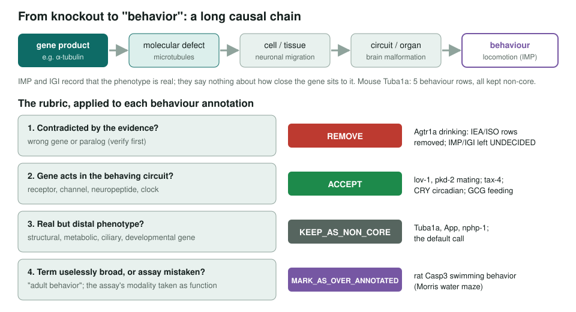
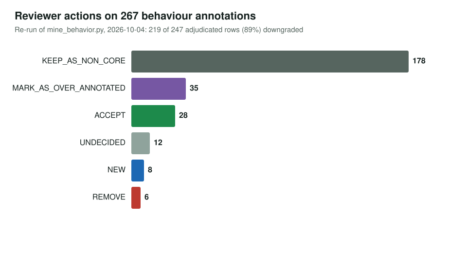
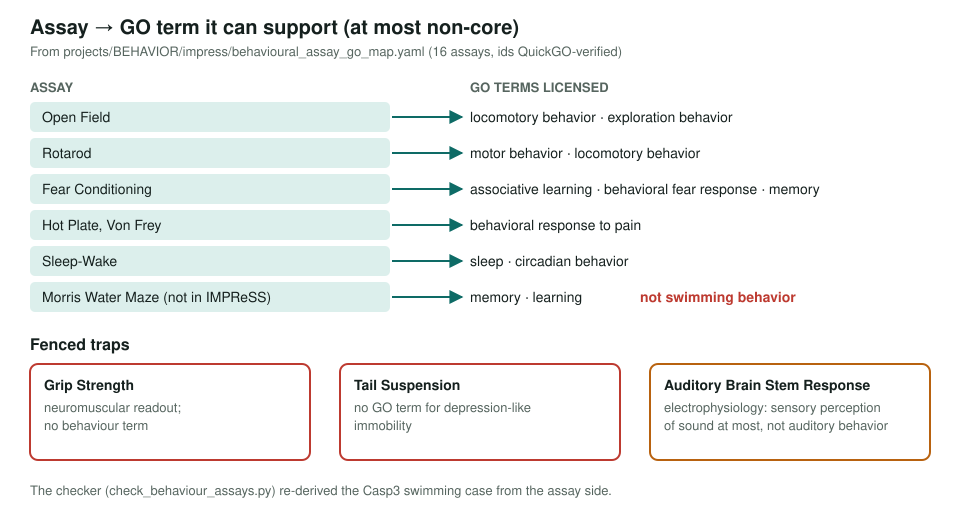

<!-- _class: lead -->

# Behaviour annotations

When a knockout changes behaviour, is behaviour the gene's function?

AI Gene Review · projects/BEHAVIOR · 2026

---

<!-- _class: bluf -->

## Bottom line

- Behaviour-label terms come mostly from **knockout phenotypes** (IMP, IGI), whatever the gene's molecular job.
- We mined the whole corpus, wrote a **four-step rubric**, and mapped **16 standard behavioural assays** to the GO terms they can support.
- **89%** of adjudicated behaviour rows (219 of 247) are **downgraded**; the 28 accepted are mostly sensory channels and receptors, plus CRY and GCG.

---

## Why behaviour is the hard case

- A behaviour integrates the whole nervous system, plus development, metabolism and basic cell biology.
- So almost any perturbation can move it: a tubulin, a lysosomal peptidase, a ciliary scaffold.
- In the [ASSAY_TO_FUNCTION](../../ASSAY_TO_FUNCTION.html) framing it is the **most distal, most convergent** readout.
- 2026-10-04 lexical snapshot: **268** behaviour-label annotations on **110** genes in GOA files; IMP 113, IEA 56, IGI 37, IDA 3.

---

## The chain and the rubric

---

## What reviewers decided

---

## Assays as evidence

---

## Status and next steps

- ✅ Corpus mined; rubric written; accepted rows spot-checked (9 missed downgrades fixed).
- ✅ IMPReSS ingested; assay→GO map and checker built; `BEHAVIORAL_ASSAY` class added to ASSAY_TO_FUNCTION.
- ✅ `reports/REPORT.md` regenerated (2026-10-04 lexical snapshot: 247 adjudicated, 89%).
- ⬜ Resolve 12 UNDECIDED rows in AKT1, BLOC1S6, Pde4, Agtr1a and GHSR; replace the lexical miner with a behavior-branch closure (#4046).
- ⬜ Record *which assay* drove each behaviour annotation so the check can run automatically.

**Read more:** `projects/BEHAVIOR.md` · `projects/BEHAVIOR/impress/` · `projects/BEHAVIOR/mine_behavior.py`
