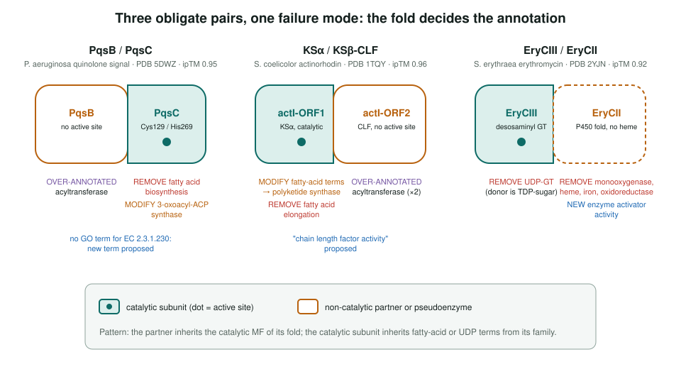
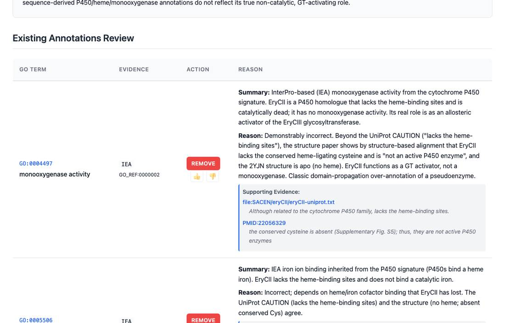

<!-- _class: lead -->

# Biosynthetic gene cluster complexes

Reviewing obligate enzyme pairs from natural-product clusters

AI Gene Review · projects/BGC · 2026

---

<!-- _class: bluf -->

## Bottom line

- Many BGC enzymes work only as **heteromeric pairs**, and GO often gives the pair's activity to the **wrong subunit**.
- Using an AlphaFold3 screen of **2,437 MIBiG clusters** as structural evidence, we reviewed **3 of 5** PDB-backed exemplar pairs (6 genes, 29 rows).
- Two reusable patterns: **non-catalytic partners inherit their fold's catalytic term**, and a **heme-less P450 pseudoenzyme** inherited a full P450 cofactor set (all removed).

---

## Why complexes, and the evidence used

- In a cluster, the product constrains each enzyme's function: a strong prior for checking annotations.
- **Moriwaki et al.** (bioRxiv 2025, v2 2026): AlphaFold3 with MMseqs2 over 487,828 protein pairs; **15,438** predicted heteromers at ipTM ≥ 0.6, **381** high-confidence structurally homologous pairs.
- Exemplars come from the paper's **PDB-backed validation set**, so each prediction matches a solved structure.
- Predictions are **hypotheses**: solved complexes can score low (PDB 7YN3 at ipTM 0.17).

---

## Three pairs, one failure mode

---

## A pseudoenzyme stripped of P450 terms

eryCII review: UniProt says it "lacks the heme-binding sites" and the 2YJN structure has no heme. Monooxygenase, heme, iron and oxidoreductase rows removed; GO:0008047 enzyme activator activity added.

---

## Results

| Gene | Role | Rows | Changes |
|---|---|---|---|
| pqsB | non-catalytic partner | 4 | acyltransferase over-annotated |
| pqsC | catalytic | 7 | fatty acid BP removed; KAS III MF modified |
| actI-ORF1 | KSα, catalytic | 5 | fatty-acid terms modified or removed |
| actI-ORF2 | CLF, no active site | 2 | both acyltransferase rows over-annotated |
| eryCIII | glycosyltransferase | 6 | UDP-GT removed (donor is TDP-sugar) |
| eryCII | pseudoenzyme activator | 5 | 4 P450 rows removed; activator NEW |

29 rows: 15 ACCEPT, 7 REMOVE, 3 MODIFY, 3 MARK_AS_OVER_ANNOTATED, 1 NEW. Proposed terms: 2-heptyl-4(1H)-quinolone synthase activity; polyketide chain length factor activity.

---

## Status and next steps

- ✅ PqsBC, actinorhodin KS-CLF, EryCIII/EryCII reviewed; erythromycin cluster captured as a pathway concept (`terms/erythromycin_biosynthesis/`).
- ⬜ Nosiheptide (RiPP) and pyoluteorin (low-ipTM control) pairs queued.
- ⬜ Novel, non-validation predictions go to `-predictions-review.yaml` files.
- ⬜ The status table on the project page still lists the ActVA and DEBS rows, which share PDB 1TQY and 2YJN with the reviewed pairs.

**Read more:** `projects/BGC.md` · `genes/PSEAE/pqsB/` · `genes/STRCO/actI-ORF2/` · `genes/SACEN/eryCII/`
