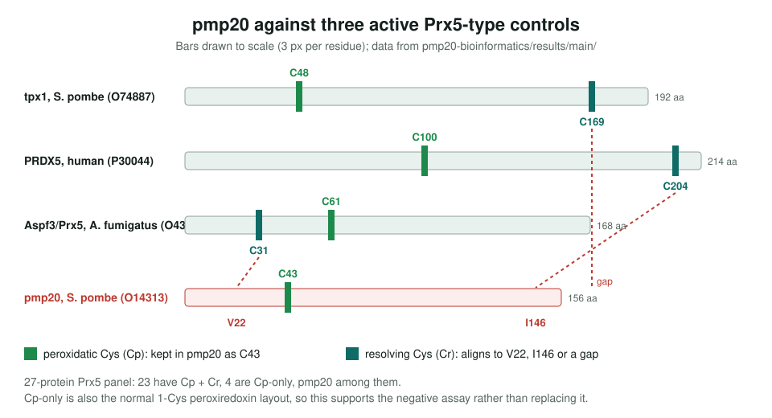
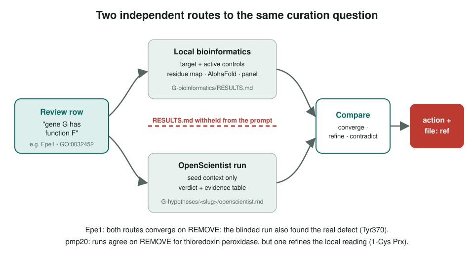

<!-- _class: lead -->

# Bioinformatics case studies

Reproducible sequence and structure checks, then a blinded second opinion

AI Gene Review · projects/BIOINFORMATICS · 2026

---

<!-- _class: bluf -->

## Bottom line

- Two *S. pombe* cases where a family-based function was tested by script: **pmp20** (peroxiredoxin) and **Epe1** (JmjC demethylase).
- pmp20: one cysteine (C43), no resolving Cys; review **REMOVEs** IBA *thioredoxin peroxidase activity* and keeps the curated NOT *peroxidase activity*. Epe1: **7** catalytic rows REMOVE.
- Both were re-tested as **blinded OpenScientist hypotheses** (July 2026); the workflow now has **264** `-hypotheses/` folders.

---

## Why a reproducible case, not a one-off

- A one-time analysis on one gene is weak evidence and hard to audit.
- `pmp20-bioinformatics` runs end to end with `just all`, takes table-driven inputs, and was **re-run on a second target** (tpx1) to prove the scripts are general.
- Every script compares the target with **active controls**, so "missing residue" is measured, not assumed.
- It is now the engineering template for new cases.

---

## pmp20: where the second cysteine should be

---

## Blinded second opinion

---

## What the reviews say now

| Gene | Row | Evidence | Action |
|---|---|---|---|
| pmp20 | obsolete thioredoxin peroxidase activity (GO:0008379) | IBA | REMOVE |
| pmp20 | NOT peroxidase activity (GO:0004601) | IDA | ACCEPT |
| pmp20 | unfolded protein holdase activity (GO:0140309) | IDA | ACCEPT |
| Epe1 | histone demethylase activity (GO:0032452) | IBA | REMOVE |
| Epe1 | histone H3K9 demethylase activity (GO:0032454) | IDA, EXP | REMOVE |

Read from genes/SCHPO/pmp20/pmp20-ai-review.yaml and genes/SCHPO/Epe1/Epe1-ai-review.yaml.

---

## Lessons

1. **Blinding pays**: the Epe1 run found the real defect (Tyr370 at the third Fe(II) ligand) that the older local script missed.
2. **A second run can disagree usefully**: one pmp20 run noted that Cp-only is the normal 1-Cys peroxiredoxin layout, so the case rests on the negative assay (PMID:20356456), with sequence evidence as support.
3. Structure models were used as **monomers only**; distances are context, not activity evidence.

---

## Status and next steps

- ✅ Two cases written up; both reviews cite their `file:` RESULTS and the OpenScientist reports.
- ⬜ The case-study page still lists the Epe1 run as "expected"; add its outcome as BIO-002 findings.
- ⬜ Add new cases using the template section of the page.

**Read more:** `projects/BIOINFORMATICS.md` · `genes/SCHPO/pmp20/pmp20-bioinformatics/RESULTS.md` · `genes/SCHPO/*/…-hypotheses/`
