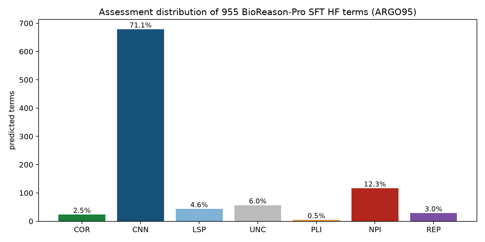

# BioReason-Pro Comparison Project

**Bottom line:** BioReason-Pro (Fallahpour et al. 2026,
[doi:10.64898/2026.03.19.712954](https://doi.org/10.64898/2026.03.19.712954)) is a
reasoning LLM that turns GO-GPT term predictions, InterPro domains and organism
context into a written functional summary. We collected its web reports for 139
genes from 14 organisms (ARGO139) and had an agent score each summary against
our local gene review, then assessed every SFT GO-term prediction for a 95-gene
subset (ARGO95) with the COR/CNN/LSP/UNC/PLI/NPI/REP taxonomy. As of the review
snapshot (2026-09-27, commit `c7551cb3db`), mean correctness on the 138-gene
performance set is 4.0/5 but completeness only 2.9/5, and most summaries restate
what InterPro domain labels already say. Of the 955 SFT terms, 682 were correct
but already known and only 23 were correct novel predictions. The model fails
systematically on localization, pseudoenzymes, paralogs and organism-specific
biology. The GO-GPT leaf-term review of ARGO139 is still a draft workspace.

We did this to answer the question a database curator actually faces: are a new
method's predictions good enough to import, and where do they break? The work was
presented at ISMB 2026 and is written up as a manuscript.

[Function prediction evaluation index](FUNCTION_PREDICTION_EVALUATION.md)

**[Browse BioReason comparison predictions](../app/predictions/index.html?projects=BIOREASON_COMPARISON)** — filter SFT and GO-GPT term predictions alongside RL narrative reviews, with each assessment scheme kept explicit.

**Where the numbers are.** Per-category and per-organism counts live in the
prediction browser rather than in this page; the facet counts are the tables.

- [RL narrative scores, performance set](../app/predictions/index.html?projects=BIOREASON_COMPARISON&cohorts=argo139_rl_narrative&performance_included=true) — correctness and completeness distributions, with a species facet for the per-organism breakdown.
- [ARGO95 SFT term assessments](../app/predictions/index.html?dataset=claims&cohorts=argo95_sft_terms) — the assessment and error-type facets give the full category split.
- [Supplemental SFT term cohorts](../app/predictions/index.html?dataset=claims&cohorts=supplement_sft_terms_union_all) and [HF SFT narrative reviews](../app/predictions/index.html?cohorts=supplement_sft_narrative_hf).
- [GO-GPT leaf claims (ARGO139)](../app/predictions/index.html?dataset=claims&source_method=GO-GPT&source_version=bioreason.net%2F2026-03%2Frl) — the pending review, including unresolved `UNC` terms.
- [GO-GPT three-level overlap](../app/predictions/index.html?dataset=overlap) — each specific GO-GPT term for 296 genes, flagged by whether it appears in raw GOA, in the post-review AIGR annotations, and in the AIGR core functions; for example, [terms matching an AIGR core function](../app/predictions/index.html?dataset=overlap&in_core=true).

The overlap view is fixed at the review snapshot and matches the manuscript. The
set and claim views read the current reviews, so their counts can move ahead of
the dated figures, which are recorded in [`benchmark-metrics.json`](BIOREASON_COMPARISON/benchmark-metrics.json).

**Bottom line:** across the ARGO139 collected cohort, BioReason-Pro's functional summaries mostly restate what InterPro domain labels already say. The model-performance denominator excludes the wrong-input `csr-1` case (n=138) and separately flags seven sequence-truncated cases. It adds real value mainly for proteins with distinctive multi-domain architectures. It fails repeatedly on localization, pseudoenzymes, paralogs, and organism-specific biology, but these are recurrent modes illustrated by selected cases, not measured prevalence rates. The [failure-mode section](#failure-mode-taxonomy) gives the counts that do exist, with denominators.

**Reference standard.** The references are local AIGR gene reviews. The first rater (the per-gene `*-bioreason-rl-review.md` scores) and the blinded second rater are LLM agents applying the rubric below. Scores therefore measure agreement with that review standard, fixed at the snapshot commit below, rather than with expert ground truth; no human expert has scored these summaries. The model behind the second rater is not recorded.


📄 **[Read the manuscript (PDF)](BIOREASON_COMPARISON/article/manuscript.pdf)** &nbsp;·&nbsp; 🖥 **[View the slide deck](BIOREASON_COMPARISON/article/slides.html)** &nbsp;·&nbsp; 📝 [Abstract](BIOREASON_COMPARISON/article/abstract.md)

🎤 **Presented at ISMB 2026** (Function COSI, Washington DC, 14 July 2026): Caufield JH, Joachimiak MP, Mungall CJ. *Agentic evaluation of AI function prediction pipelines.* Slides archived at [doi:10.5281/zenodo.21810552](https://doi.org/10.5281/zenodo.21810552)

**Explore the evaluations interactively:**
- [BioReason-Pro SFT evaluation](BIOREASON_COMPARISON/sft-eval.html) — ARGO95 primary cohort: 95 genes, 955 predictions; the browser also includes supplemental source cohorts
- [GO-GPT leaf evaluation](BIOREASON_COMPARISON/gogpt-eval.html) — ARGO139 collected cohort; unresolved terms are explicitly pending
- [GO-GPT leaf adjudication (OpenScientist)](BIOREASON_COMPARISON/gogpt-leaf-adjudication.md) — expert overlay: 7 specific-MF calls blind-tested; **0/7 novel-correct** — GO-GPT mirrors GOA
- [DeepECTransformer blinded recapitulation (ESR-ECOLI-DET-Mini)](BIOREASON_COMPARISON/deepectf-eval.html) — 7 E. coli genes; 4/7 match the published expert labels. The project's own calls are in the [E. coli project table](VALIDATING_ECOLI_PREDICTIONS/deepectf-eval.html).

<details>
<summary>Data, benchmarks, and reproducibility</summary>

- **Benchmarks.** [`genes.csv`](BIOREASON_COMPARISON/genes.csv) is **ARGO139** (Annotation Review GO), the fixed 139-gene collected cohort used for RL narrative review. **ARGO95** is the 95-gene subset with HuggingFace `wanglab/protein_catalogue` SFT GO-term predictions, used for the primary SFT term review. The [benchmark policy](BIOREASON_COMPARISON/benchmark-policy.yaml) freezes the audit baseline and scoring rules. Composition and provenance are recorded in [species counts](BIOREASON_COMPARISON/argo139-species-counts.csv), [curation-context counts](BIOREASON_COMPARISON/argo139-curation-context-counts.csv), [cohorts](BIOREASON_COMPARISON/benchmark-cohorts.csv), [per-gene sources](BIOREASON_COMPARISON/benchmark-genes.csv), [input/reference quality and checksums](BIOREASON_COMPARISON/benchmark-quality.csv), the authoritative generated [metrics](BIOREASON_COMPARISON/benchmark-metrics.json), and the [benchmark supplement](BIOREASON_COMPARISON/article/supplemental-benchmark-details.md).
- **ESR-ECOLI-DET-Mini** ([recap experiment](BIOREASON_COMPARISON/recapitulation-experiment/claude-expt-1/)): a 7-gene quick-check recap of the de Crécy-Lagard expert review of DeepECTransformer predictions. Dataset [`10.5281/zenodo.20751016`](https://doi.org/10.5281/zenodo.20751016). `ESR-ECOLI-DET-7` is a count-explicit alias.
- **Reproducible stats notebooks** ([`notebooks/`](BIOREASON_COMPARISON/notebooks/)) recompute the summary statistics below directly from the committed per-gene files, with no hard-coded numbers.

</details>

## Methods

We downloaded the reports for selected genes from https://app.bioreason.net/ (there is no API yet so this cannot be done in bulk). We assigned an AI agent to compare them with existing pipelines (for example, InterPro2GO) and with the agent-adjudicated local AIGR reference. These local references have mixed review maturity and are not independently expert-signed ground truth.

**Independence of the reference and the raters.** Every judgment on this page comes from an LLM agent:

- **Reference.** Each local `*-ai-review.yaml` was written by an LLM curation agent. Its maturity varies (see the status breakdown below).
- **First rater.** The correctness and completeness scores in each `*-bioreason-rl-review.md` were assigned by an LLM comparison agent that could read the reference.
- **Second rater.** The [blinded second rater](BIOREASON_COMPARISON/second-review-protocol.md) is also an LLM agent. Its model is not recorded.
- **Matched SFT/RL rater.** The [matched SFT-vs-RL comparison](#matched-sft-vs-rl-comparison-110-argo139-genes) was scored by a Claude Code agent (Claude Opus 5.5) on 2026-09-27.

The raters share a model family with the reference authors, so their agreement measures consistency between agents, not accuracy against expert judgment. A small human-rated anchor set would be needed to calibrate them.

## Notes on browsing results

Each individual gene review page, e.g. aprE, SlyD contains BOTH the bioreason results AND the detailed review of the bioreason results. You will need to search in the page for "bioreason" or scroll down to the sections:

- Deep Research Bioreason RL (we treat the bioreason outputs as a kind of preliminary research)
- Bioreason RL review


## Key findings (139 RL reviews)

1. **BioReason largely recapitulates InterPro labels in narrative form.** For most genes, the functional summary does not provide biological insight beyond what InterPro domain annotations already capture. Genuine value-add is modest and concentrated in proteins with distinctive, well-annotated domain architectures such as TOR1 (FRB domain enables pathway-level inference), PTEN, NOTCH1, and EGFR. For standard domain families like Src-family kinases, Fyn and Src receive essentially identical generic descriptions.

2. **Recurrent localization errors.** 16 of 138 RL reviews (12%) explicitly flag a wrong localization in the Functional Summary. This is a script-derived lower bound (see the [failure-mode counts](#failure-mode-taxonomy)). Most flagged cases describe a compartmentalized protein as cytoplasmic, cytosolic or soluble. Examples are periplasmic proteins (Skp, CpxP), a vacuolar protein (cps1), mitochondrial proteins (alo1, HSP60, CAT2) and ER-membrane proteins (IRE1, ETR1). Proteins whose InterPro domain names mention the compartment (KAR2, PDI1) are placed correctly.

3. **Pseudo-enzymes are a blind spot.** BioReason assumes catalytic activity from conserved but degenerate domains and cannot reliably identify inactive family members. Epe1 (pseudo-demethylase), cts2 (pseudo-chitinase missing catalytic glutamate), and pmp20 (a 1-Cys peroxiredoxin-family protein with an intact peroxidatic cysteine but directly assayed as peroxidase-inactive and functioning as a chaperone) are all incorrectly assigned ancestral enzymatic activity.

4. **Paralogs get identical generic descriptions.** Closely related paralogs such as Fyn/Src (mouse), sigF/sigG/sigK (B. subtilis sporulation sigma factors), and Hspa5/Hspa8 (rat Hsp70 family) receive interchangeable summaries with no gene-specific biology.

5. **Organism-specific biology is often absent.** Dauer formation and insulin/IGF-1 signaling in C. elegans (daf-16, daf-2), UPRmt master regulation (atfs-1), sporulation compartment specificity in B. subtilis (sigF forespore, sigK mother cell), prion propagation in yeast (HSP104), and cytoophidium biology (ura7) are all missed.

6. **Selected-case organism means differ.** Mouse scores highest on descriptive correctness and the selected S. pombe cases lowest among the organism groups with at least three genes; two single-gene groups score lower (select a species in the [RL narrative view](../app/predictions/index.html?projects=BIOREASON_COMPARISON&cohorts=argo139_rl_narrative&performance_included=true)). These differences are confounded by deliberate case selection: S. pombe is enriched for obscure proteins and pseudoenzymes, whereas several other groups contain more canonical proteins. InterPro informativeness and training distribution are hypotheses, not measured explanations.

Only one gene, rat Uggt1, scored 5/5 on both axes.

## Background

**Architecture:**
- **GO-GPT**: autoregressive transformer (ESM2 embeddings + organism -> GO terms). Upstream predictor.
- **BioReason-Pro**: Qwen3-based multimodal reasoning LLM. Takes GO-GPT predictions + InterPro + PPI + organism context -> chain-of-thought reasoning trace + functional summary. Two variants: **SFT** (richer mechanistic depth) and **RL** (fewer hallucinations).

The GO term list in web exports is raw GO-GPT output (input to reasoning). BioReason-Pro produces its own GO terms after the reasoning step, but the current web app does not separately expose these.

**Web app:** [app.bioreason.net](https://app.bioreason.net) | **Code:** [bowang-lab/BioReason-Pro](https://github.com/bowang-lab/BioReason-Pro) | **Models:** [HuggingFace wanglab collection](https://huggingface.co/collections/wanglab/bioreason-pro)

## Data

Per gene, the following files are available (example: [ECOLI/SlyD](https://github.com/ai4curation/ai-gene-review/tree/main/genes/ECOLI/SlyD)):

| File | Description |
|------|-------------|
| `{GENE}-bioreason-rl-predictions.md` | Raw BioReason-Pro RL web export (reasoning trace, functional summary, InterPro, GO-GPT terms) |
| `{GENE}-bioreason-rl-review.md` | Evaluation of the Functional Summary (correctness/completeness scores + InterPro domain-label comparison and, where present, InterPro2GO comparison) |
| `{GENE}-gogpt-leaf-predictions.yaml` | GO-GPT leaf terms as PredictionReview YAML |
| `{GENE}-sft-predictions.yaml` | BioReason-Pro SFT GO terms as PredictionReview YAML |
| `{GENE}-ai-review.yaml` | Agent-adjudicated local AIGR reference; completion status is recorded in `benchmark-quality.csv` |

## Evaluation rubric

### Correctness (1-5)
- 5: All material claims are supported; no substantive factual error
- 4: Core function is correct with one limited secondary error or overstatement
- 3: Core function is correct, but one or more substantive claims are wrong
- 2: Some relevant biology is present, but errors materially distort the function
- 1: Fundamental mischaracterization or predominantly unsupported account

### Completeness (1-5)
- 5: Covers established core functions, locations, complexes, and pathway context
- 4: Covers the core function and most major context, with a limited omission
- 3: Gets the basics but misses significant established biology
- 2: Captures only one important facet or remains substantially incomplete
- 1: Superficial, one-dimensional, or misses the core function

Correctness is scored only on claims the model makes; missing biology lowers completeness, not correctness. Each review also assesses whether the narrative adds information beyond InterPro domain/family labels. Only 92/139 genes have an actual `GO_REF:0000002` annotation in the committed GOA snapshot, so this qualitative domain-label comparison is not described as a universal InterPro2GO control.

## Benchmark integrity audit

ARGO139 names the **collected cohort** (139 exports), not an unconditional model-performance denominator. The current policy excludes `worm/csr-1` from model scoring because the export was generated from nhr-47/Q17370 rather than CSR-1. Seven otherwise retained exports are exact 2,000-residue prefixes of longer UniProt sequences (`Dscam1`, `BRCA2`, `HTT`, `LRRK2`, human and mouse `NOTCH1`, and `TOR1`) and are stratified as `TRUNCATED_AT_MODEL_LIMIT`.

The local AIGR references are also not represented as independently expert-signed ground truth: as of the review snapshot (2026-09-27, commit `c7551cb3db`), 79 are `COMPLETE`, 45 `DRAFT`, 11 `IN_PROGRESS`, and 4 `INITIALIZED`. `benchmark-quality.csv` records this status plus export/accession, sequence lengths, GOA dates, raw-export checksums, and separate counts/checksums for the InterPro and upstream GO-GPT sections. All 139 exports contain the GO-GPT section; three lack an InterPro section (`Shu1`, `atg16`, and `pgl-1`). Publication-facing analyses must disclose the reference-status and input-quality strata.

**Dated snapshot.** Numbers derived from the live AIGR reviews and SFT prediction assessments (the GO-GPT three-level overlap, the sidecars' reference statuses, checksums and ARGO95 assessment counts, the CAFA-style scores and NPI/PLI/REP GOA-overlap counts in `cafa-style/`, the second-review agreement, and the [ProtNLM cross-cohort summary](PROTNLM_EVALUATION/benchmark-results.md)) are computed from the repository at `review_snapshot_commit` in `benchmark-policy.yaml`, not from the working tree, so ordinary curation — including recoding a `*-sft-predictions.yaml` assessment — does not change them. Tests that only check live files are well-formed (every narrative review has two in-range scores; no deterministic category conflicts; `FREQUENCY_BIAS` only on `REP`) still read the working tree and pin no numbers. The frozen ARGO95/ARGO139 GOA inputs stay pinned separately at `baseline_commit`. A refresh is deliberate: `just refresh-benchmark-snapshot [COMMIT]` (default `origin/main`) bumps the snapshot, regenerates every derived file, and prints which headline numbers moved; then update the pinned test numbers and the "as of" dates, and review the diff.

RL scores by reference status (138-gene performance set; `csr-1` is the excluded `COMPLETE` reference):

| Reference status | n | Mean correctness | Mean completeness |
|------------------|---|------------------|-------------------|
| `COMPLETE` | 78 | 4.08 | 2.96 |
| `DRAFT` | 45 | 3.82 | 2.73 |
| `IN_PROGRESS` | 11 | 3.91 | 3.18 |
| `INITIALIZED` | 4 | 4.50 | 3.50 |
| all non-`COMPLETE` | 60 | 3.88 | 2.87 |
| all | 138 | 3.99 | 2.92 |

Scores against `COMPLETE` references are slightly higher on both axes. The four `INITIALIZED` references are one-line descriptions, so a generic summary can look complete against them.

The two rubric axes remain correlated, so they should not be read as statistically independent merely because the rubric defines different concepts. A [blinded second rater](BIOREASON_COMPARISON/second-review-protocol.md) scored a deterministic 20-gene subset balanced across first-rater correctness strata and agreed closely on correctness (quadratic-weighted kappa 0.95) and less well on completeness (kappa 0.74). Raw ratings and the [generated agreement metrics](BIOREASON_COMPARISON/second-review-agreement.json), including exact and within-one agreement, are committed.

**Caveats on the kappa values:**

- The sample has 4 genes per first-rater correctness stratum. It is not weighted by prevalence: 70 of 138 first-rater scores are 5, but only 4 of the 20 sampled genes are.
- Spreading the sample evenly across the 1-5 range increases between-gene variance, which inflates quadratic-weighted kappa. The kappa values above are therefore optimistic estimates of agreement on ARGO139 as a whole.
- Raw agreement moves the other way. Reweighting each stratum's exact agreement to first-rater prevalence gives 88% for correctness and 71% for completeness (`audit-followup.json`, `second_rater_reweighted`). With 4 genes per stratum, both estimates are very uncertain.
- Both raters are LLM agents (see [Methods](#methods)).

Most ARGO95 `CNN` calls are exact matches to the frozen GOA input; the rest are supported as non-novel by other established local evidence. The [claims view](../app/predictions/index.html?dataset=claims&cohorts=argo95_sft_terms) gives the category split. A frozen-ontology [ID/label adjudication](BIOREASON_COMPARISON/argo95-ontology-pair-adjudication.tsv) re-examined mismatched or unresolved raw pairs that were nonnegative either at the audit baseline or after manual biological reclassification, and changed most of them after separating ontology status from the biological rubric and assessing the canonical GO concept rather than an intended but incompatible label. Raw model pairs remain unchanged and are explicitly flagged in their review rationales. DnaK zinc ion binding (`GO:0008270`) moved from `NPI` to `CNN` during comprehensive review because PMID:11985624 directly identifies DnaK in a radioactive Zn(II)-binding screen and the term was already present in GOA as an IDA annotation; the observation remains non-core because its physiological relevance and binding mechanism are unresolved. The IRE1 nucleus prediction (GO:0005634) was also corrected from `NPI` to `CNN` after the gene review retained its existing IDA annotation (PMID:17035634) as `KEEP_AS_NON_CORE`; this reconciles the prediction assessment with the current review without making nuclear localization the core cellular location.

Annotation suitability and prediction correctness are distinct judgments. The rat/Casp3 death-receptor-binding prediction is now `UNC`: PMID:17518537 supports DISC association, while the accessible evidence does not settle direct receptor contact. Rat Uggt1's unfolded-protein-binding prediction remains `CNN` because the reference review and PMID:10764828 affirm non-native glycoprotein recognition; preferring a glucosyltransferase activity annotation does not refute that binding concept. Both decisions are explicit gene/term adjudications scoped to `MARK_AS_OVER_ANNOTATED`, with stronger rejection or negation requiring renewed review.



The ontology authority for this audit is the official archived 2026-03-25 `go-basic.obo`, pinned by SHA-256 in `benchmark-policy.yaml` and checked at load time with both obsolete and active sentinel terms. That release, and the current GO API, explicitly mark terms such as `GO:0005615` extracellular space and `GO:0005844` polysome obsolete. Committed GOA snapshots can lag those obsoletions, and the mixed-date legacy `cache/ontologies/go.tsv` flag is not used for benchmark adjudication.

The [external-authority verification](BIOREASON_COMPARISON/verify_ontology_authority.py) independently downloads the official archive and queries both QuickGO and OLS. On 2026-07-12, the remote archive matched the pinned SHA-256, and both services returned all five disputed sentinels as obsolete; OLS additionally states that `GO:0005615` duplicates `GO:0005576`. Ontology status is reported separately from the seven biological assessment categories: obsoletion alone does not turn a correct non-novel prediction into `LSP`. `LSP` remains reserved for a supplied ID whose canonical concept is more generic than the supported annotation. This distinction restores status-only cases such as `DROME/LysB` and `BACSU/aprE` `GO:0005615` to `CNN` while retaining the obsolete-ID warning.

The ARGO139 GO-GPT files were rebuilt from raw web exports with ontology-aware leaf pruning. Most of the cleaned terms are either `CNN` or still-unresolved `UNC`, and nearly every document remains `DRAFT`; only `BACSU/ftsZ` and `SCHPO/ral2` are fully resolved. This is a transparent pending review, not a completed GO-GPT performance result; the [GO-GPT leaf claims](../app/predictions/index.html?dataset=claims&source_method=GO-GPT&source_version=bioreason.net%2F2026-03%2Frl) show its current state.

## Leakage, novelty and scripted calls

*Computed on 2026-09-27 at commit `9891e5ffd` plus that day's uncommitted edits, with `uv run python projects/BIOREASON_COMPARISON/audit_followup.py --test-parquet <bioreason-pro-test-data parquet>`. Output: [`audit-followup.json`](BIOREASON_COMPARISON/audit-followup.json).*

**ARGO139 is almost entirely outside BioReason-Pro's held-out test split.** Most ARGO139 proteins are well characterized and were chosen for that reason. Only one ARGO139 accession (`SCHPO/alo1`) is in the public 8,630-protein temporal test split ([`wanglab/bioreason-pro-test-data`](https://huggingface.co/datasets/wanglab/bioreason-pro-test-data)). The other 138 were eligible to be in the training distribution. Across all 4,980 AIGR gene reviews, 28 accessions are in the test split.

120 of 139 genes have at least one experimental GOA annotation. For 117 of them, at least one experimental annotation line is dated on or before 2022-01-01.

**What the training cutoff means for CNN and CAFA-style precision.**

- **The cutoff is an assumption.** No file in this repository, and neither HuggingFace dataset card, states BioReason-Pro's training cutoff date. The only record is a "post-2022" temporal test split. We therefore use two labelled assumptions: 2022-01-01 (primary) and 2023-01-01 (sensitivity).
- **The GOA `DATE` is a last-modified date.** It records when an annotation line was created or last modified. IEA and IBA lines are regenerated routinely, so a post-cutoff date is an upper bound on post-cutoff knowledge. A pre-cutoff date shows the line existed before the cutoff.

| ARGO95 CNN calls (682) | 2022-01-01 cutoff | 2023-01-01 cutoff |
|---|---|---|
| Exact GO ID present in the gene's committed GOA TSV | 630 | 630 |
| ...where every matching line is dated after the cutoff | 71 (11%) | 63 (10%) |
| ...with at least one experimental line | 558 | 558 |
| ...where the earliest experimental line is dated after the cutoff | 33 (6%) | 23 (4%) |

At least 559 of the 630 exact-GOA CNN calls (89%) match an annotation line that already existed before the assumed cutoff. Under either assumption, **the 71% CNN rate and the propagated CAFA-style precision of 0.862 (the `hf_catalogue` row of [`cafa-style/argo139_cafa_style_summary.csv`](BIOREASON_COMPARISON/cafa-style/argo139_cafa_style_summary.csv)) mostly measure recall of annotations that predate training.** They are not evidence of prospective prediction. All 23 `COR` calls are absent from GOA by definition, so they have no GOA date to test.

**The current-snapshot audit relabelled 61 calls as `CNN`.** The audit script (`scripts/auto_review_sft_predictions.py`) reclassifies a call deterministically when an exact join to current GOA or AIGR makes its label inconsistent. Its rationales, counted from the ARGO95 files:

| Reclassification | Rationale | Calls |
|---|---|---|
| `UNC` → `CNN` | the current AIGR contains a positive exact action | 27 |
| `COR` → `CNN` | the exact GO ID is already present in current local GOA | 25 |
| `NPI` → `CNN` | the current AIGR contains a positive exact action | 9 |
| `CNN` → `NPI` | all exact AIGR actions are negative | 16 |
| `CNN` → `REP` | all exact AIGR actions reject or over-annotate generic protein binding | 4 |
| `UNC` → `NPI` | all exact AIGR actions are negative | 2 |
| `LSP` → `REP` | all exact AIGR actions reject or over-annotate generic protein binding | 1 |

For 21 of the 25 `COR` → `CNN` calls, a matching GOA line is dated before 2022. Those 21 were never novel, not even at the assumed training cutoff; they had been misclassified as `COR`.

**71 `CNN` calls carry a scripted rationale.** In nine ARGO95 genes (mouse Calm1 and Pten; rat Casp3, Hspa5, Rgn, Slc5a1, St13, Tp53 and Uggt1), 71 `CNN` calls carry the identical sentence "Term is in GOA — already a known curated annotation." A further 22 `UNC` calls carry the identical sentence "Generic or ancestor term not confirmed or refuted by GOA or AI gene review." Both sentences come from the original automated review pass, not from term-by-term reading.

For the 71 `CNN` calls this is acceptable. `CNN` is definitional for an exact in-GOA term, and all 71 have an exact line in the committed GOA TSV. It is still disclosed here because all 95 ARGO95 files are marked `COMPLETE`. The 22 scripted `UNC` calls have not been individually reviewed. The supplemental 198-file SFT union is dominated by these templates: 8,783 of 11,100 rationales. See [`article/TODO.md`](BIOREASON_COMPARISON/article/TODO.md).

## Results (138-gene performance set; 139 collected exports)

About half of the performance set scored 5/5 on correctness, while almost none
reached 5/5 on completeness; the typical summary gets the core function right and
leaves out established context. The score distributions are the facet counts in
the [RL narrative view](../app/predictions/index.html?projects=BIOREASON_COMPARISON&cohorts=argo139_rl_narrative&performance_included=true); select a species to see that organism's distribution.

Rows sum to 138. The three n=1 species (9CAUD dfrP, AGKCO fibrolase and ANOGA PGRPLB) were previously omitted. Values are computed by `audit_followup.py` (`rl_by_organism`).
### Top performers (correctness 5/5)

| Gene | Organism | Completeness | Why it works |
|------|----------|--------------|--------------|
| Uggt1 | rat | 5 | ER quality control enzyme with highly informative domain names |
| TP53 | human | 4 | Distinctive TAD-DBD-tetramerization architecture |
| PTEN | human | 4 | Dual-specificity phosphatase domains are unambiguous |
| EGFR | human | 4 | Canonical RTK architecture well-represented in InterPro |
| NOTCH1 | human | 4 | Proteolytic cascade well-encoded in domain layout |
| MYC | human | 4 | bHLH-LZ domains directly predict E-box binding |
| Akt1 | mouse | 4 | PH + AGC kinase architecture is diagnostic |
| Calm1 | mouse | 4 | EF-hand domains immediately predict calcium sensing |
| Pten | mouse | 4 | Same as human PTEN |
| Trp53 | mouse | 4 | Same as human TP53 |
| ftsZ | BACSU | 4 | Tubulin-like GTPase domain is highly specific |
| spo0A | BACSU | 4 | Response regulator + DNA-binding domains clearly predict phosphorelay TF |
| GroEL | ECOLI | 4 | Chaperonin domains are unambiguous |
| lgg-1 | worm | 4 | Atg8/ubiquitin-like fold directly predicts autophagy adaptor |
| bst1 | SCHPO | 3 | GPI inositol-deacylase function nailed from specific family annotation |

### Critical failures (correctness 1/5)

| Gene | Organism | Completeness | Failure mode |
|------|----------|--------------|--------------|
| atg16 | SCHPO | 1 | No InterPro domains available; confabulated carbohydrate metabolism |
| Epe1 | SCHPO | 1 | Degenerate JmjC pseudoenzyme described as an active histone demethylase |
| pmp20 | SCHPO | 2 | Neo-functionalized peroxiredoxin -> chaperone; model assumes ancestral function |
| pol5 | SCHPO | 1 | Predicted cytokinesis scaffold; actual function is pre-rRNA processing and ribosome biogenesis |
| Shu1 | SCHPO | 1 | Predicted HECT ubiquitin ligase; actually a GPI-anchored heme receptor |
| tam10 | SCHPO | 1 | Unsupported essential-growth scaffold narrative invents molecular and pathway roles for a protein of unknown function |
| pgl-1 | worm | 1 | Described as nuclear TF scaffold; actually cytoplasmic P granule component |

## Failure mode taxonomy

The prose failure modes below are encoded as controlled `error_type` values on the
discordant (NPI/PLI/REP) predictions in the per-gene `*-predictions.yaml` files, using the
same shared `PredictionErrorTypeEnum` as the [ProtNLM evaluation](PROTNLM_EVALUATION.md) so
the two projects are directly comparable. Four values were added for patterns Table 1 of de
Crécy-Lagard et al. does not name: `PSEUDOENZYME_OVERANNOTATION` (mode 1), `LOCALIZATION_DEFAULT`
(mode 2), `TAXON_CONSTRAINT_VIOLATION` (mode 7, cross-kingdom), and `WRONG_INPUT_SEQUENCE`
(mode 9). Paralog indistinguishability (mode 3) maps to the existing `PARALOG_OVERANNOTATION`
and neofunctionalization/moonlighting (mode 5) to `MULTIPLE_FUNCTIONS`. These tags are applied
where a *predicted GO term* embodies the failure; modes that are narrative-only (e.g. the model
calling a periplasmic protein "cytoplasmic" in prose while GO-GPT still predicts the periplasm
term) leave no discordant term to tag and are recorded only in the RL narrative reviews.

**Counts and denominators.** These were computed on 2026-09-27 at commit `9891e5ffd` plus that day's uncommitted edits, with `uv run python projects/BIOREASON_COMPARISON/failure_mode_counts.py`. Outputs are in [`failure-mode-counts.json`](BIOREASON_COMPARISON/failure-mode-counts.json) and [`failure-mode-rl-flags.csv`](BIOREASON_COMPARISON/failure-mode-rl-flags.csv).

- **ARGO95 SFT terms.** 147 of 955 terms are discordant: 113 `NPI`, 5 `PLI` and 29 `REP`. 85 of the 147 carry an `error_type`. **62 (all `NPI`) carry none.** They are reported as untagged rather than back-filled. The 85 tags are:

  | `error_type` | Terms |
  |---|---|
  | `FREQUENCY_BIAS` | 29 |
  | `PATHWAY_CONTEXT_IGNORED` | 14 |
  | `NAMING_INCONSISTENCY` | 13 |
  | `PSEUDOENZYME_OVERANNOTATION` | 9 |
  | `TAXON_CONSTRAINT_VIOLATION` | 7 |
  | `PARALOG_OVERANNOTATION` | 5 |
  | `LOCALIZATION_DEFAULT` | 4 |
  | `TRAINING_DATA_CONTAMINATION` | 2 |
  | `CURATION_MISTAKE` | 1 |
  | `MULTIPLE_FUNCTIONS` | 1 |

- **ARGO139 GO-GPT leaf terms.** 124 of 5,923 terms are `NPI`, and none carries an `error_type`. The GO-GPT review is still pending: 3,899 terms are `UNC`.
- **RL narratives.** The narrative reviews carry no controlled tag. A script flags a review only when its prose states the failure explicitly, so each flag count is a lower bound; recall is not measured. We flag the two modes whose wording is unambiguous:
  - Localization error: 16 of 138 performance-set reviews. In a hand check, 14 of the 16 describe a cytoplasmic, cytosolic or soluble placement. The other two are pgl-1 (called nuclear) and cts2 (called wall-associated).
  - Wrong input: 1 of 139 collected exports (`csr-1`).

  HSP60 shows that recall is incomplete: its review calls the "cytosolic" claim a significant error, but the wording does not match a marker.

| Mode | Controlled tag | ARGO95 SFT terms (genes) | RL narrative evidence |
|---|---|---|---|
| 1 Pseudo-enzyme | `PSEUDOENZYME_OVERANNOTATION` | 9 (3) | illustrative (selected cases) |
| 2 Localization default | `LOCALIZATION_DEFAULT` | 4 (4) | 16/138 explicit flags (lower bound) |
| 3 Paralog indistinguishability | `PARALOG_OVERANNOTATION` | 5 (3) | illustrative |
| 4 Organism-specific biology absent | none | none | illustrative |
| 5 Neo-functionalization / moonlighting | `MULTIPLE_FUNCTIONS` | 1 (1) | illustrative |
| 6 Narrative-GO disconnect | none | none | illustrative |
| 7 Cross-kingdom fold bias | `TAXON_CONSTRAINT_VIOLATION` | 7 (7) | illustrative |
| 8 Generated UniProt-style summary | none | none | 3/139 RL strings are exact UniProt substrings (see mode 8) |
| 9 Wrong input data | `WRONG_INPUT_SEQUENCE` | 0 (`csr-1` is not in ARGO95) | 1/139 |

None of these counts supports calling a mode "systematic" in the sense of a measured, high prevalence. The modes are recurrent patterns, documented with selected examples.

**Eight or nine modes.** Modes 1-8 are failures of the model's output. Mode 9 is a pipeline and data-provenance failure: BioReason correctly described the sequence it was given, and `csr-1` is excluded from the performance set. The manuscript and abstract therefore count eight model-output modes, while this page lists nine headings.

### 1. Pseudo-enzyme blind spot

BioReason assumes catalytic activity from conserved domains without checking whether catalytic residues are intact. This recurs for proteins that retain an ancestral fold but have lost enzymatic activity. Three S. pombe RL cases are shown below, and ARGO95 tags 9 SFT terms in 3 genes as `PSEUDOENZYME_OVERANNOTATION`. This is a set of examples, not a prevalence estimate.

**Examples:**
- **Epe1** (SCHPO, 1/5): BioReason claims *"JmjC catalytic center dictates a lysine demethylase mechanism"* but Epe1 has a degenerate Fe(II)-binding triad (H297-E299-Y370, with Tyr370 in place of the third iron-ligand His). No detectable demethylase activity in mass spec assays. Functions as anti-silencing factor through HP1/Swi6 binding.
- **cts2** (SCHPO, 2/5): Called an active chitinase, but the protein lacks the essential catalytic glutamate and is likely catalytically dead.
- **pmp20** (SCHPO, 1/5): Predicted as an active peroxidase, but this 1-Cys family member was directly assayed as peroxidase-inactive and functions as a molecular chaperone; absence of a resolving cysteine is not itself the mechanistic defect.

Notably, the BioReason paper highlights CFAP61 as a correctly identified pseudoenzyme, but this success does not generalize to our test set.

**Independent adjudication (OpenScientist).** Three predictions we had scored `UNC`
(genuinely on the fence) were re-tested as blinded gene-function hypotheses by an
independent OpenScientist agent (structure + comparative genomics; the suspected answer
was withheld from the prompt). Two were pseudoenzyme over-annotations, resolving the
`UNC` calls to `NPI` (full reports live under each gene's `*-hypotheses/` directory):
- **MJ1511** (METJA) predicted as a thiol-disulfide oxidoreductase (GO:0016671):
  **refuted** — no CxxC redox motif, no proton-relay histidines, and its two cysteines sit
  ~36.5 Å apart in the AlphaFold model.
- **cts2** (SCHPO) predicted to drive fungal cell-wall disassembly (GO:0031506):
  **refuted** — GH18 catalytic glutamate replaced by asparagine (E166N); the *S. japonicus*
  ortholog retains the intact motif.
- **DCAF12L2** (human) predicted to target proteasomal degradation via CRL4 (GO:0043161):
  **partially supported, kept as a lead** — the WD40 substrate-binding arm is intact but the
  DDB1-binding interface is degenerate and DDB1 is absent from all 43 experimental interactors,
  so the CRL4-assembly step is unconfirmed.

**Dispute confirmation (OpenScientist).** Separately, 12 SFT predictions we had *disputed*
(`NPI`/`PLI`) were re-tested the same blinded way to check our own rejections. Most incorrect-call
verdicts were upheld, with three important corrections. **pmp20**'s peroxiredoxin `NPI` stands but the rationale
was corrected (it is a 1-Cys peroxiredoxin with an intact peroxidatic site — not a "lost resolving
cysteine" — that is nonetheless directly assayed as inactive: GOA `NOT|enables` glutathione
peroxidase), and **SPAC8E11.10**'s NADP⁺-alcohol-dehydrogenase call was softened `NPI → LSP` (a
defensible broad activity class, less precise than its sorbose-reductase function). The
**DnaJ protein-disulfide reductase activity** call was corrected from `NPI` to `CNN`: the activity
has direct assay support
and the current AIGR keeps it as non-core. The remaining confirmed incorrect calls recapitulate the
same failure modes — pseudoenzyme/paralog over-annotation (LysB lysozyme≠chitinase; DnaK is not a
redox enzyme; alo1, mlcD, rdgBbeta wrong
paralog/substrate; comK/fliY misread domain labels), and wrong-input-sequence (**csr-1**, which
also surfaced a real accession bug: Q21992 is deleted and maps to larp-1). Full reports live under
each gene's `*-hypotheses/` directory.

### 2. Localization defaults to cytoplasm

When InterPro annotations lack transmembrane or signal-peptide information, BioReason often places the protein in the cytoplasm. The counts:

- 16 of 138 RL reviews explicitly flag a localization error (lower bound).
- 14 of those 16 involve a cytoplasmic, cytosolic or soluble placement.
- 4 ARGO95 SFT terms are tagged `LOCALIZATION_DEFAULT`.

These counts show a recurrent pattern, not a demonstrated systematic default. Examples:

- **Periplasmic proteins**: Skp and CpxP (E. coli) are called cytoplasmic despite having signal peptides. Spy is *not* an example of this mode. Its summary places it "at the cell envelope" and mentions "periplasmic stress". Its failure is misidentification: the Cpx-auxiliary family label (IPR052211) leads the model to describe Spy as a signaling component rather than a periplasmic chaperone.
- **Other periplasmic and envelope enzymes**: pedH (P. putida) is called "soluble" and "cytoplasmic". mrdA (E. coli) and mrcA (P. putida) are placed on the cytoplasmic face or side of the envelope.
- **ER membrane proteins**: ETR1 (Arabidopsis ethylene receptor) called "soluble cytoplasmic signal transducer" — actually an ER membrane integral protein with 3 TM helices. IRE1 (yeast) similarly mislocalised.
- **Mitochondrial proteins**: alo1 (SCHPO), HSP60 (yeast), CAT2 (yeast) all called cytosolic.
- **Vacuolar proteins**: cps1 (SCHPO) called cytoplasmic.
- **Wrong compartment in another direction** (not a cytoplasmic default): fibrolase (AGKCO) is claimed as "membrane-tethered" with neural/endocrine roles; it is actually a secreted venom fibrinolytic enzyme. pgl-1 is called a nuclear hub; it is a cytoplasmic P-granule component.

Proteins succeed when InterPro domain names explicitly contain the compartment (KAR2/BiP -> ER, PDI1 -> ER).

### 3. Paralog indistinguishability

Closely related family members receive essentially identical descriptions:

- **Fyn vs Src** (mouse): Both get a generic Src-family kinase description. No mention of Fyn-specific T-cell signaling, tau phosphorylation, or myelination. No mention of Src-specific osteoclast biology.
- **sigF vs sigG vs sigK** (BACSU): All three sporulation sigma factors treated as generic sigma factors. The curated reviews show sigF is forespore-specific with partner-switching (SpoIIAB), sigG is late-forespore with Gin anti-sigma regulation, sigK requires processing from pro-sigK and excision of the skin element.
- **Hspa5 vs Hspa8** (rat): Both described as generic Hsp70 chaperones. Hspa5 (BiP) is ER-specific with UPR regulation. Hspa8 (Hsc70) has distinctive constitutive functions in clathrin uncoating and chaperone-mediated autophagy.

### 4. Organism-specific biology absent

BioReason's domain-to-function reasoning cannot capture biology that is specific to a lineage or organism:

- **C. elegans**: daf-16 described as generic forkhead TF (misses IIS pathway, longevity, dauer biology). daf-2 described as generic RTK (misses insulin/IGF-1 receptor identity and aging). atfs-1 described as generic bZIP TF (misses UPRmt master regulator role). hlh-30 described as generic bHLH (misses TFEB ortholog identity and autophagy/lysosome biology).
- **B. subtilis**: Sporulation compartment specificity is never captured. aprE's role in quorum sensing/Phr peptide processing is missed. comK described via protein binding instead of competence regulation.
- **S. cerevisiae**: HSP104 misses prion propagation and thermotolerance. RAS2 fundamentally wrong (vesicle trafficking instead of cAMP/PKA signaling). TOR1 is the exception where FRB domain enables pathway identification.
- **S. pombe**: ura7 misses cytoophidium biology. pol5 completely wrong (cytokinesis scaffold instead of pre-rRNA processing/ribosome biogenesis).

### 5. Neo-functionalization and moonlighting

When a protein has acquired a function different from its ancestral domain prediction, BioReason defaults to the ancestral/family-typical function:

- **pmp20** (SCHPO): Peroxiredoxin fold -> predicted peroxidase; actual chaperone
- **Nmnat** (DROME): NAD+ biosynthesis enzyme fold -> misses moonlighting chaperone/neuroprotection function
- **LysB** (DROME): Lysozyme fold -> framed as immune defense; actually a digestive enzyme
- **GAPDH** (human): Correctly identifies glycolytic enzyme but misses all moonlighting functions
- **Casp3** (rat): Core protease/apoptosis correct but misses differentiation roles in neurons, keratinocytes, erythrocytes

### 6. Narrative-GO prediction disconnect

In multiple cases, the GO term predictions from the upstream ESM model are more accurate than BioReason's narrative functional summary. The two outputs appear to be generated somewhat independently:

- **RidA** (ECOLI): Narrative describes the correct chemistry ("accelerating hydrolysis of reactive intermediates") but calls it "non-enzymatic" and assigns protein binding (GO:0005515) instead of deaminase activity (GO:0019239).
- **atg2** (SCHPO): GO terms include correct autophagy terms but the narrative describes only scaffolding, missing the primary lipid transfer function.
- **BenR** (PSEPK): GO term predictions are reasonable but the narrative describes a CO/formate regulator instead of a benzoate pathway activator.

### 7. Cross-kingdom fold bias

Training data skewed toward well-studied organisms can bias predictions:

- **aprE** (BACSU), a term-level example, not an RL narrative one. The hemostasis and blood-coagulation terms for this B. subtilis subtilisin appear in two places. One is the upstream GO-GPT panel in the RL export: `GO:0030195` negative regulation of blood coagulation, `GO:1900047` negative regulation of hemostasis, and others. The other is the HF SFT term `GO:0030195`, which is tagged `NPI` / `TAXON_CONSTRAINT_VIOLATION`. The HF SFT narrative also says the protease "likely remodels host factors to dampen clot formation". The RL Functional Summary makes no coagulation claim and scored 5/5 correctness (3/5 completeness).
- **PGRPLB** (ANOGA): Called a "fruit fly" protein when it is actually from the mosquito Anopheles gambiae.
- **NFE2L2** (human): bZIP domain analysis erroneously emphasizes erythroid function (from the NF-E2 family name) over the protein's primary role in antioxidant response.

### 8. Generated UniProt-style summary fabrication

The export section titled `UniProt Summary` is generated by BioReason's instruction to summarize in UniProt format; it is not text imported from UniProt. Only 3/139 RL strings are exact substrings of the cached UniProt record. Incorrect text in this section is therefore a model-output error, not an upstream UniProt error. Clear examples include steroid-sulfate transport for `Slc5a1`, a protist/cytochrome-b6 context for human `CYCS`, and "probable glutamine amidotransferase" for `PARK7`.

### 9. Wrong input data

- **csr-1** (worm, 1/5): BioReason received the nhr-47 sequence instead of the CSR-1 Argonaute. All predictions are for the wrong protein.

## Comparison with InterPro domain/family labels and InterPro2GO

A central question is whether BioReason provides value beyond the InterPro domain/family information supplied to it. Our reviews assessed domain-label recapitulation for each gene and an actual InterPro2GO (`GO_REF:0000002`) baseline where present (92/139 genes).

**In most cases, BioReason is a narrative restatement of its InterPro inputs.** The functional summary translates domain and family labels into prose without adding new biological insight. Where an actual InterPro2GO mapping is present and wrong, or where the family label encourages an invalid extrapolation, BioReason typically recapitulates and sometimes amplifies the error.

**BioReason adds value in specific cases:**
- Proteins with distinctive multi-domain architectures where the combination is diagnostic (TOR1, NOTCH1, PTEN, EGFR, spo0A)
- Proteins where family-level InterPro names are highly informative (Uggt1, bst1, KAR2)

**BioReason inherits domain-label and mapping errors:**
- KEAP1: InterPro2GO assigns BTB-Kelch to actin binding; BioReason amplifies this into "actin remodeling" instead of the correct NRF2 regulation
- Ctnnb1: Armadillo repeat -> cell adhesion dominates; transcriptional co-activator role (Wnt/TCF-LEF) underweighted
- SecB: Chaperone family -> "protein folding" assigned, but SecB is an anti-folding holdase

## Paper case study proteins

Full reasoning traces in supplementary C.6-C.15:

| Protein | UniProt | Paper section | Key finding |
|---------|---------|---------------|-------------|
| eEFSec | P57772 | Fig. 5, S2.6 | De novo predicted SBP2 as binding partner, validated by cryo-EM |
| CFAP61 | Q8NHU2 | Fig. 6, S2.7 | Correctly identified pseudoenzyme scaffold despite catalytic domains |
| EvoAcr1 | synthetic | S2.8 | No homology/domains. Predictions varied by organism label. SFT fabricated InterPro. |
| EvoAcr2 | synthetic | S2.8 | RL predicted phage-encoded host modulator -- biologically coherent |

### CFAP61 vs Epe1: same class, opposite results

Both are pseudoenzymes with catalytic domain signatures. BioReason **correctly** identifies CFAP61 as non-enzymatic (paper's featured result) but **fails** on Epe1, confidently calling it an active demethylase. This suggests pseudoenzyme detection is not systematic but case-dependent.

## SFT vs RL comparison

### Paper findings (27 evaluators, 162 proteins)
- **SFT**: 8.0/10, preferred for mechanistic depth
- **RL**: 7.4/10, preferred for factual reliability
- SFT fabricated InterPro entries for novel proteins; RL never did

### Our data

- **Matched narrative comparison:** 110 ARGO139 genes, scored by the same rater. See [Matched SFT vs RL comparison](#matched-sft-vs-rl-comparison-110-argo139-genes). It replaces an early five-gene pilot, which is no longer reported.
- **SFT term cohort:** the primary structured SFT term cohort is ARGO95 (95 HF-catalogue genes, 955 terms). Mixed-source SFT views are supplemental.

## Paper evaluation sets

- **Test set**: 8,630 proteins ([HuggingFace](https://huggingface.co/datasets/wanglab/bioreason-pro-test-data)), temporal holdout post-2022
- **Human eval**: 192 proteins, 162 by external biologists. Protein list not published.
- **Overlap with AIGR**: 28 of the 4,980 current AIGR gene reviews are in the test split. Only 1 of the 139 ARGO139 genes is (`SCHPO/alo1`). These counts come from `audit_followup.py --test-parquet` on 2026-09-27; see [Leakage, novelty and scripted calls](#leakage-novelty-and-scripted-calls). The overlap is low by design: their test set is newly annotated, while ours is deeply characterized. An earlier version of this page gave "7 of 1,211" and said "99 additional genes are being reviewed". Both statements are stale and have been replaced.

## HuggingFace protein_catalogue analysis

The HF dataset [`wanglab/protein_catalogue`](https://huggingface.co/datasets/wanglab/protein_catalogue) contains 223,214 proteins across 8,439 organisms (Apache-2.0). All entries are **SFT model only** (the `model` column is uniformly `SFT`). There is no RL equivalent.

Local copy: `data/bioreason-hf/*.parquet` (3 shards, ~626MB total). Queryable with duckdb:

```sql
SELECT * FROM 'data/bioreason-hf/*.parquet' WHERE protein_id = 'P0A9K9'
```

### What the pipeline actually produces

| Component | Model | Output |
|-----------|-------|--------|
| GO-GPT (`wanglab/gogpt`) | Autoregressive transformer (ESM2 + organism) | GO term hierarchy (F_max 0.65-0.70) |
| BioReason-Pro SFT (`wanglab/bioreason-pro-sft`, 4B) | Qwen3 fine-tuned on GPT-5-generated reasoning traces (124K examples) | `<think>` trace + functional summary. *"More hypothesis, more hallucinations"* |
| BioReason-Pro RL (`wanglab/bioreason-pro-rl`, 4B) | Same base + GRPO (9.2K examples) | Same format. *"More accurate, less mechanistically deep"*. Never fabricated InterPro |

### GO term provenance: what comes from where

The web app shows "GO GPT" and "GO Leaf" panels regardless of SFT/RL selection. Those panels are **GO-GPT predictions** supplied to the reasoning model. The HuggingFace `protein_catalogue` is a different artifact: its structured GO section is documented as BioReason-Pro SFT model output. ARGO95 therefore evaluates the HF SFT output, while the web-export GO panels are reviewed separately as upstream GO-GPT output.

The HF catalogue's structured GO section (at the end of the `generation` column) substantially overlaps the GO-GPT input, but provenance follows the official catalogue description: it is model-generated SFT output, not an imported GO-GPT panel. Approximately 97% of entries have this structured section; approximately 3% are truncated.

**RL model GO predictions are not accessible anywhere.** The web app shows GO-GPT (input), the HF catalogue is SFT only, and the RL reasoning trace does not emit its own GO terms.

**How accurate are GO-GPT's specific leaf calls?** Because every downstream GO term originates here, we
blind-tested 7 of GO-GPT's most informative specific-MF predictions (one per gene, across
kinase/protease/transferase/lipid-transfer/adaptor/chaperone functions in 5 organisms) with an
independent OpenScientist agent — an **expert-adjudication overlay** on the deterministic ARGO139
benchmark, not a rewrite of it. **0/7 were novel-correct.** GO-GPT *mirrors GOA*: its 4 correct calls
all re-derive an annotation GOA already has (2 `CNN` exactly; 2 `LSP` as a coarse parent of an existing
curated child), and its 3 wrong calls (`NPI`) either reproduce an *anomalous* existing GOA annotation
(Akt1 inverted kinase-inhibitor; Prkaa2 a lone rat adaptor IDA that is really the β subunit's function)
or, in the single case that ventures beyond GOA (gaa1), commit a **subunit-level misattribution**
(assigning Gpi8's catalytic cysteine-protease chemistry to the non-catalytic gaa1). Where the benchmark's
deterministic action-matching already resolves a term, the overlay agrees; for the terms it leaves
`UNC`, the overlay supplies an expert verdict — details in the
[GO-GPT leaf adjudication](BIOREASON_COMPARISON/gogpt-leaf-adjudication.md).

| Source | GO-GPT (input) | BioReason SFT GO | BioReason RL GO |
|--------|----------------|------------------|-----------------|
| Web app panels | "GO GPT" + "GO Leaf" | Not shown separately | Not shown separately |
| HF `protein_catalogue` | In `<think>` block | Structured section at end | **Not available** |
| Scraped `-rl.md` files | Full hierarchy in GO Terms section | N/A | **Not emitted** |

### SlyD (P0A9K9) cross-source comparison

We compared GO terms for SlyD across three sources to understand the relationship between them:

**Legacy website SFT scrape** (deleted unsuffixed raw export; 9 terms -- leaf-pruned):
GO:0003755 (PPIase activity), GO:0016859, GO:0140096, GO:0016853, GO:0003824, GO:0006457, GO:0005737, GO:0005829, GO:0005622

**Website RL scrape** (`SlyD-bioreason-rl-predictions.md`, 58 terms -- full GO-GPT with all ancestors):
Includes the above plus metal binding (GO:0008270, GO:0005507, GO:0016151, GO:0050897), unfolded protein binding (GO:0051082), heat response (GO:0009408), refolding (GO:0042026), stabilization (GO:0050821), and all ancestor terms up to root.

**HF SFT catalogue** (structured section, 13 terms):
GO:0051082, GO:0003755, GO:0008270, GO:0005507, GO:0016151, GO:0050897 (MF);
GO:0009408, GO:0022417, GO:0042026, GO:0044008, GO:0050821, GO:0000413 (BP);
GO:0005829 (CC)

**Key finding**: 12 of 13 HF SFT terms are contained in the RL website GO-GPT output. The one HF-only term (GO:0044008, modulation by symbiont of host adenylate cyclase pathway) is a more specific descendant also present in the RL hierarchy. The website RL dump includes the full GO hierarchy (all ancestors up to root), while the HF SFT keeps leaf-ish terms. The website SFT scrape was pruned to very generic parent terms.

This shows strong cross-source dependence, but does not establish that all three artifacts are identical predictions. The HF catalogue remains the most useful bulk source because it retains informative leaf-like terms without the web panel's ancestor noise.

### Coverage gaps

Notable proteins NOT in the 223K catalogue: TP53 (P04637), EGFR (P00533), NOTCH1 (P46531), MTOR (P42345). Several well-known proteins that are present have truncated generations (cut off mid-sentence, never reaching the GO section): MYC (P01106), BCL2 (P10415), PTEN (P60484), CTNNB1 (P35222).

## SFT Catalogue Evaluation (45 proteins, 15 clades)

Full details: [research/bioreason-sft-evaluation.md](https://ai4curation.io/ai-gene-review/research/bioreason-sft-evaluation.md)

We evaluated 45 proteins from the HF SFT catalogue across 15 clades (DANRE, DICDI, METJA, MYCTU, PSEAE, ANOGA, ARATH, DROME, ECOLI, SCHPO, human, mouse, rat, worm, yeast), 3 proteins per clade, mixing well-characterized and poorly-characterized proteins.

Mean correctness was 3.0/5 and completeness 2.7/5. No protein scored 5/5 on either axis.

**The SFT-45 and RL-138 cohorts cannot be compared.** They share no genes. SFT-45 was chosen to mix well-characterized and uncharacterized proteins across 15 clades. ARGO139 is mostly well-characterized proteins. The two were also scored by different agents against references of different maturity. A difference in their means therefore says nothing about SFT versus RL. For the like-for-like comparison, see [Matched SFT vs RL comparison](#matched-sft-vs-rl-comparison-110-argo139-genes).

### Top failure modes (SFT catalogue)

1. **Fabricated UniProt summaries (7/45 = 16%)**. BioReason generates fake "UniProt Summary" text for uncharacterized proteins. All 7 cases are on proteins where UniProt says "Uncharacterized protein." The pattern recurs in this sample, and it is dangerous because it mimics an authoritative database.

2. **Paralog/family conflation (8/45 = 18%)**. Biology from well-characterized family members is applied to divergent paralogs: mlcD (calmodulin→myosin I LC), rdgBbeta (vibrator→Class II PITP), Ndufb1/NDUFAB1 confusion, Ifi204/AIM2 conflation, Hmgcs2/HMGCS1 mixing.

3. **Organism-specific biology usually absent**. Most reviews found no organism-specific insight beyond domain architecture. Mosquito eye pigmentation, Mtb drug targets, yeast cell wall biology, worm body size regulation, and plant cold stress were missed; `fen1` is a counterexample where the review credits a zebrafish retinal-phenotype link.

4. **Inverse quality vs characterization**. The orphan examples with 0-3 GOA annotations (mbiA, MJ1511, YGR117C) all score at the floor of the 1-5 scale; these are the proteins where BioReason could add the most value. mbiA was recorded as 0/0 in the source evaluation, which is outside the 1-5 rubric. It is counted as 1/1 in the table above. Well-characterized proteins, where BioReason scores 4/5, already have extensive annotations, so the narrative adds little.

5. **Hallucinated GO IDs**. BioReason cites specific GO IDs that map to completely different terms (e.g. GO:0047554 cited as caffeoyl-CoA O-methyltransferase, actually 2-pyrone-4,6-dicarboxylate lactonase).

6. **Directional errors**. Several errors get the mechanism exactly backwards: CRH1 donor-acceptor direction, Sstr5 ligand preference, gcl substrate clearance direction, CHL1 cell death promotion vs limitation.

### SFT-45 and RL-138 side by side (not comparable)

An earlier version of this page read the gap between the two cohorts as consistent with the paper's finding that SFT has "more hallucinations". That claim is withdrawn; the matched comparison below does not reproduce it. Generated UniProt-style prose is a concern in both modes: only 3 of the 139 collected RL strings are exact substrings of the cached UniProt record, and several contain clear factual conflicts. The RL model's claim to "never fabricate InterPro entries" does not extend to UniProt-style summaries.

### Key conclusion (SFT-45)

BioReason SFT is a **domain-interpretation narrative engine**, not a biological knowledge system.

- **Where it helps.** It adds modest value when domain architectures are diagnostic. In the 45-protein sample, 15/45 scored 4/5 correctness and none scored 5/5.
- **Where it fails.** Elsewhere it often fabricates or adds false specificity.
- **The inverse relationship.** The proteins where BioReason could add the most value (uncharacterized, with minimal annotations) are exactly where it performs worst in this sample.

## Matched SFT vs RL comparison (110 ARGO139 genes)

*Computed on 2026-09-27 at commit `9891e5ffd` plus that day's uncommitted edits. Reproduce with:*

```bash
uv run python projects/BIOREASON_COMPARISON/sft-rl-matched/extract_sft_summaries.py --parquet-dir <protein_catalogue/data>
uv run python projects/BIOREASON_COMPARISON/sft-rl-matched/compare_sft_rl.py
```

**Data.** The per-gene folders hold SFT narratives only for the 45 SFT-catalogue proteins, and those share no genes with ARGO139. The narrative does exist upstream, though: each HF `wanglab/protein_catalogue` entry carries a Functional Summary in its `generation` field. 110 of the 139 ARGO139 accessions are in the catalogue, all with a parseable Functional Summary. The 110 exclude `csr-1` and all seven truncated-input genes. `extract_sft_summaries.py` writes them, with a SHA-256 of each `generation`, to [`sft-functional-summaries.tsv`](BIOREASON_COMPARISON/sft-rl-matched/sft-functional-summaries.tsv).

**Protocol.**

- **Rater.** One LLM agent (Claude Code, Claude Opus 5.5; "rater B") scored the 110 SFT Functional Summaries against the current `*-ai-review.yaml` description and `core_functions`. It used the same 1-5 anchors as the RL reviews (the `bioreason-predictions` skill rubric).
- **Same-rater RL re-score.** Rater B then re-scored the 110 RL Functional Summaries in the same session. This separates the model difference from the rater difference.
- **Blinding.** Rater B was not blinded to model identity. It had already seen the project page, which names some first-rater RL scores. Before the RL re-score it also saw the first-rater scores of 25 genes (flagged in the ratings file).
- **Outputs.** Scores and one-line SFT rationales are in [`sft-rl-matched-ratings.csv`](BIOREASON_COMPARISON/sft-rl-matched/sft-rl-matched-ratings.csv). Statistics are in [`sft-rl-matched-summary.json`](BIOREASON_COMPARISON/sft-rl-matched/sft-rl-matched-summary.json).

**Results (n=110, paired; Wilcoxon signed-rank).**

| Comparison | Correctness (x vs y) | x>y / y>x / tie | p | Completeness (x vs y) | x>y / y>x / tie | p |
|---|---|---|---|---|---|---|
| **SFT vs RL, same rater (B)** | 3.96 vs 4.05 | 24 / 38 / 48 | 0.62 | 3.88 vs 2.75 | 80 / 1 / 29 | 2.5e-15 |
| RL rater B vs RL first rater (calibration) | 4.05 vs 3.95 | 13 / 5 / 92 | 0.041 | 2.75 vs 2.87 | 12 / 27 / 71 | 0.031 |
| SFT (B) vs RL (first rater), confounded | 3.96 vs 3.96 | 27 / 33 / 50 | 0.74 | 3.88 vs 2.87 | 74 / 2 / 34 | 3.9e-14 |

**Rater calibration.** On the same RL text, rater B agreed with the first rater exactly on 92/110 correctness scores (quadratic-weighted kappa 0.93) and 71/110 completeness scores (kappa 0.78). On the 85 genes whose first-rater score rater B had not seen, kappa was 0.92 and 0.78. The two raters are similar enough that the SFT-RL difference is not a rater artifact.

**Findings.**

- **Correctness.** SFT and RL narratives do not differ detectably on this matched set. The paper's claim that RL makes fewer factual errors is not reproduced at the level of the Functional Summary.
- **Completeness.** SFT narratives are substantially more complete: a mean 1.1 points higher, with SFT ahead on 80/110 genes and RL ahead on 1. This fits the paper's description of SFT as mechanistically richer.
- **Where SFT is better.** Several RL failures listed above have SFT summaries that get the core biology right: pol5, RAS2, KEAP1, drp-1, atg38, Spy and Skp.
- **Where SFT is worse.** Some SFT summaries are worse than the RL ones, for example sigK (called a primary sigma factor), CRY (stabilizes rather than degrades TIM), St13 and atfs-1.
- **Possible leakage.** Many SFT summaries restate highly specific GOA-like annotations, such as anther tapetum or UV-B response for BRI1. This is consistent with the [leakage section](#leakage-novelty-and-scripted-calls): well-characterized proteins may be recalled rather than predicted.

**Caveats.**

- One LLM rater, not blinded to model identity.
- References are LLM-authored, and 48 of the 110 are not `COMPLETE`.
- The SFT text comes from the HF catalogue and the RL text from the web app, so the two model versions and input panels may differ.
- By reference status, the SFT-RL correctness difference is near zero for `COMPLETE` references (4.18 vs 4.08, n=62) and favours RL for `DRAFT` references (3.54 vs 3.94, n=35, p=0.045 uncorrected). See the summary JSON.

**Still open.** A human-rated anchor subset and a rater blinded to model identity (for example with SFT and RL texts shuffled and unlabelled). An SFT narrative is also needed for the 29 ARGO139 genes absent from the catalogue; it would have to be generated with the released SFT model.

## Notes and changelog

### 2026-09-27: follow-up to the function-prediction evaluation review

This entry responds to the BioReason section of [the 2026-09-26 review](FUNCTION_PREDICTION_EVALUATION/REVIEW-2026-09-26.md). New numbers were computed at commit `9891e5ffd` plus that day's uncommitted edits. Per-gene sft, gogpt and rl assessments were not changed.

- **SFT vs RL.** The unmatched comparison (SFT-45 vs RL-138, no shared genes) and its claim to be "consistent with the paper" are withdrawn. They are replaced by a [matched 110-gene comparison](#matched-sft-vs-rl-comparison-110-argo139-genes) using HF-catalogue SFT Functional Summaries, with a same-rater RL re-score (`sft-rl-matched/`).
- **Failure modes.** Mode counts now have denominators (`failure_mode_counts.py`). The page reports that 62 of 147 ARGO95 discordant terms lack an `error_type`, and that `LOCALIZATION_DEFAULT` is tagged 4 times. "Systematic" is softened throughout. The RL narrative localization flags (16/138) are script-derived lower bounds (`failure-mode-rl-flags.csv`).
- **Mis-assigned examples.** Spy was removed as a "called cytoplasmic" example: its summary says cell envelope, and its failure is family-label misidentification. aprE's coagulation terms are now attributed to GO-GPT and HF SFT, not to the RL narrative, which scored 5/5.
- **Raters.** The page now states that the references and both raters are LLM agents. It adds the caveat that the kappa sample is balanced rather than prevalence-weighted, gives prevalence-reweighted agreement, and adds the promised table of scores by reference status.
- **Leakage and novelty.** New section covering the test-split overlap, GOA dates of CNN calls under two assumed cutoffs, the 61 `→CNN` audit reclassifications, and the scripted CNN/UNC rationales (`audit_followup.py`).
- **Stale text.** Fixed the by-organism table (it omitted three n=1 species), the frontmatter species list, "Our pilot (5 genes)", "7 of 1,211" / "99 additional genes", the mbiA 0/0 scale note, and the eight-versus-nine mode count.
