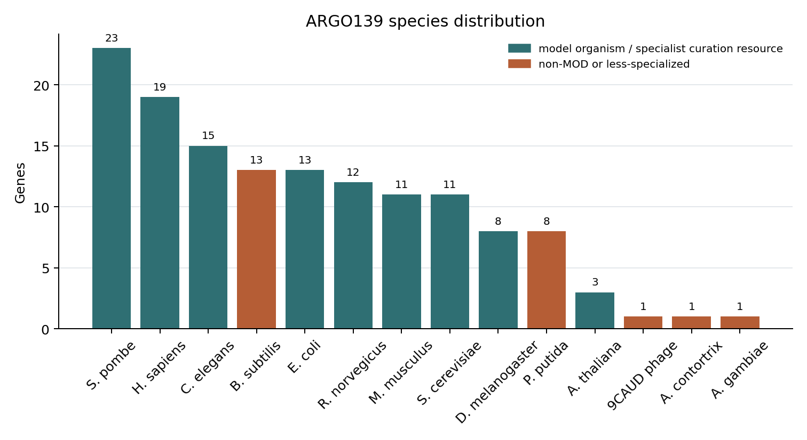

# Agentic evaluation of function prediction tools yields qualitative insights into systematic errors

## Abstract

New protein function prediction methods appear monthly, but annotation databases lack a scalable way to decide which ones are good enough to deploy. Aggregate metrics like CAFA's $F_{\max}$ track field-level progress, yet they reward predictions that match a biased ground truth, hide systematic errors behind averages, and cannot evaluate the free-text reasoning that modern agentic predictors now produce alongside their GO terms. We describe AI Gene Review (AIGR), an agentic curation pipeline in which LLM-based curator-agents synthesise literature, domain architecture, and existing annotations to evaluate predictions gene by gene, producing structured, human-readable assessments.

We apply AIGR to BioReason-Pro, a recent agentic function predictor, using a single paired BioReason-Pro benchmark: **ARGO139** (Annotation Review GO), a manually selected 139-gene set spanning proteins from eukaryotes, bacteria, and a phage, with edge cases such as a snake-venom metalloproteinase. On ARGO139, BioReason-Pro mostly tells databases what they already know. Its RL narratives largely restate InterPro2GO and show seven reproducible failure modes, while its SFT GO terms are dominated by existing GOA annotations. In the cleaner HuggingFace SFT source subset (95 ARGO139 genes, 955 terms), 67.5% of terms were correct-but-not-novel, 10.6% were incorrect, and 5.4% were correct novel annotations already known from the literature but absent from GOA. The model's narrative and GO-term outputs can also disagree, with each sometimes correct when the other is wrong.

These findings required a richer evaluation layer than aggregate metrics provide. We propose a three-tier framework — aggregate scoring, expert or agentic review, and prospective experiment — and argue that the middle tier, partially automated, is the most practical basis for deployment decisions. A retrospective reproduction of a published expert error taxonomy provides a positive-control check that AIGR can represent the same biological error classes. A follow-on answer-key-withheld recapitulation recovered 4/7 exact expert labels: useful as a smell test for sequence-AI outputs, but not a substitute for expert nuance. All data and code are publicly available.

## 1. Introduction

Functional annotation of gene products — determining, recording, and structuring what a protein does, where in the cell it does it, and in what biological process it participates — is one of the central tasks of modern molecular biology. Downstream analyses in genomics, systems biology, and biomedicine, from gene-set enrichment and pathway reconstruction to therapeutic target identification and biomarker discovery, all inherit the assumptions encoded in the Gene Ontology (GO) annotation graph. At the scale of modern sequence data, purely experimental characterisation is not tractable; functional knowledge is instead assembled from two complementary sources: **(i) literature-based expert curation**, in which professional curators read papers on experimentally tractable model organisms and encode the findings as structured, evidence-coded annotations; and **(ii) computational prediction**, which propagates function across the long tail of uncharacterised proteins.

For most of the last two decades the dominant production pipelines for computational annotation have been conservative: HMM- and family-based methods such as InterPro2GO (domain → GO term mappings), PANTHER phylogenetic inference (PAINT-curated ancestral-node → descendant GO terms [1]), and orthology-transfer tools (GOA electronic, Ensembl Compara, Reactome inference). These methods are attractive precisely because their outputs are interpretable and traceable: a hit to a well-defined protein family lands in a hand-curated mapping, producing a deterministic chain from the sequence evidence to the resulting annotation. A curator receiving one of these annotations can explain in seconds where it came from and what would have had to be true for it to be wrong.

In the past five years this landscape has changed rapidly. Protein language models (ESM1/2, ProtT5, ESM3, AlphaMissense) [2,3], generative models, and now agentic reasoning LLMs have been repurposed for function prediction. These methods are qualitatively different from their HMM-based predecessors in three ways that matter for evaluation. First, they consume sequence directly rather than matching to a curated family, so their provenance chain is opaque. Second, they are extremely productive: new methods are released monthly, faster than any annotation team can review them. Third, and most importantly for this paper, **they no longer emit only GO terms**. Modern agentic predictors such as BioReason-Pro [4] output a free-text functional summary and a chain-of-thought reasoning trace in addition to a predicted term list. Most of the scientific content of the prediction — the proposed mechanism, the cited domain evidence, the identification of a pseudoenzyme, the placement in a pathway — lives in the narrative, not in the term list.

This creates a concrete, recurring question for resources like GO: **when is a new, less-rule-like method good enough to trust in production?** The community's standard yardstick for answering this question has been the Critical Assessment of Functional Annotation (CAFA) series [5–7], which applies temporal holdout against GOA snapshots and reports aggregate GOA-agreement scores (most prominently $F_{\max}$ and $S_{\min}$). CAFA has been indispensable for tracking aggregate progress of the field, but there is a growing recognition that two problems make it insufficient as a deployment decision-support tool. First, **GOA itself is not ground truth**: it contains known over-annotations, paralog-inherited errors, and IEA/IBA annotations that the curation community already knows to be unreliable [8,9,14,17,18]. 58% of human GO annotations cover only 16% of genes [17], creating an ascertainment bias that rewards predictors for learning the annotation distribution rather than the underlying biology. Second, and more acute with the advent of agentic predictors, CAFA-style metrics operate on the bag-of-GO-terms projection of the prediction, while much of the scientific content now appears in free-text narrative and reasoning.

The most systematic recent illustration of the gap between aggregate scoring and biological validity comes from de Crécy-Lagard *et al.* (2025) [10], who manually reviewed all 453 EC predictions made by DeepECTransformer — a top-performing deep-learning enzyme function predictor — for uncharacterised *E. coli* proteins. The result was striking: only 3/453 predictions were genuinely novel and correct. The remainder fell into reproducible, biologically explicable error classes involving paralog over-propagation, missing pathway context, in-vitro/in-vivo ambiguity, and frequency-biased repetition.

Each rejection in the de Crécy-Lagard analysis required the reviewer to synthesise multiple lines of evidence: domain architecture, paralog subfamily context, pathway presence/absence in the organism, genetic evidence, and orthogonal primary literature. This is the **synthesis bottleneck**. Human experts can do it, but with new methods appearing monthly and prediction sets in the hundreds to thousands, exhaustive spot-checking by hand is no longer a scalable quality-control workflow.

Here we ask whether the synthesis step itself can be partially automated. We present the **AI Gene Review (AIGR)** framework, an agentic curation pipeline in which LLM curator-agents, grounded in a per-gene evidence package (UniProt record, the full GO annotation table, InterPro domain architecture, cached full-text publications, an orthogonal deep-research report, and a LinkML-defined review schema with GO best-practice constraints), produce structured, human-readable reviews of existing and predicted annotations. AIGR is explicitly designed as a *complement* to CAFA-style benchmarks rather than a replacement: it reviews narrative and reasoning content outside aggregate term metrics, surfaces systematic failure modes that metric aggregation hides, and distinguishes genuinely novel insight from a restatement of existing domain-based annotation.

We make five contributions: (1) the AIGR pipeline and its review schema, with a LinkML-based validation layer enforcing that every claim traces to a verbatim quote from a cached publication; (2) a 7-gene retrospective reproduction of the de Crécy-Lagard *et al.* [10] *E. coli* error taxonomy as a positive control, plus an answer-key-withheld recapitulation that recovers the major error calls but not all expert boundary judgments; (3) ARGO139, a manually selected 139-gene benchmark for paired BioReason-Pro SFT-term and RL-narrative review; (4) a BioReason-Pro evaluation showing that SFT GO terms and RL narratives mostly restate existing pipelines while failing in systematic, biologically diagnosable ways; and (5) all benchmarks released as open resources at `github.com/ai4curation/ai-gene-review`.

## 2. Background and related work

### 2.1 Protein function prediction and its production pipelines

Large-scale protein function annotation has been dominated for over a decade by a small set of family- and homology-based production pipelines. InterPro [11] aggregates HMMs and signature databases (Pfam, SMART, PANTHER, CDD, ProSite, TIGRFAM) into protein families and domains, and InterPro2GO provides manually curated mappings from these signatures to GO terms; the result is a deterministic annotation that can be traced back to a specific domain signature and a specific curator-authored mapping. The PANTHER/PAINT pipeline [1] takes this one step further: a trained curator inspects a phylogenetic tree of a family, annotates ancestral nodes with GO terms, and propagates those annotations to descendants via the IBA (Inferred from Biological ancestor) evidence code. Orthology-based pipelines (GOA electronic, Ensembl Compara, Reactome inference) operate similarly. These methods have a distinctive and valuable property for database deployment: **their failure modes are legible** — a curator who disagrees with an annotation can point to a specific upstream decision and fix it.

More recent methods have moved in the opposite direction. Deep-learning predictors such as DeepGO(Plus) [12], DeepFRI, NetGO3, and PFmulDL [13] consume sequence, structure, or network context directly and emit GO terms without an explicit provenance trail. Protein language models (ESM1/2/3 [2], ProtT5, ProstT5) provide unsupervised representations that outperform family-based features on several downstream tasks. Most recently, a wave of generative and agentic LLM-based systems has emerged: GO-GPT (ESM2 embeddings + organism → GO terms), BioReason-Pro [4], and related systems that wrap an LLM around a bioinformatics toolkit and emit reasoning traces together with predicted terms. These methods are often impressive on aggregate benchmarks but present a particular challenge for annotation databases, because their outputs are not straightforwardly traceable and they carry narrative content that is poorly represented by bag-of-GO-terms metrics.

### 2.2 CAFA and the evaluation of function prediction

The Critical Assessment of Functional Annotation (CAFA) challenges [5–7] have provided the standard benchmark for protein function prediction for more than a decade. CAFA uses a temporal-holdout design: method developers submit predictions for a pre-specified protein set before a date; the community then waits for experimental annotations to accumulate in GOA; and predictions are scored against the resulting annotation targets. The primary metrics are $F_{\max}$ (maximum F-measure across decision thresholds) and $S_{\min}$ (minimum semantic distance, an information-content-weighted Resnik-style metric). Predictions are stratified by aspect (Molecular Function, Biological Process, Cellular Component) and by a "No-Knowledge" vs "Limited-Knowledge" category depending on whether the target protein had any prior annotation in the aspect.

CAFA has unambiguously shaped the field: performance has improved round over round, method development is empirically grounded, and the community has a shared vocabulary for comparing approaches. But a growing body of work identifies structural limitations in CAFA-style evaluation that the rise of agentic predictors is making increasingly acute. We group these into three categories: metric-level, ground-truth, and holdout-set biases.

**Metric-level limitations.** $F_{\max}$ penalises specificity: a method that predicts only high-confidence, deep annotations for a small number of proteins is penalised in recall relative to one that blankets all proteins with frequent, generic terms [15]. $F_{\max}$ is also lenient toward false positives — over-prediction is less costly than under-prediction [15,16]. Kahanda *et al.* [15] showed that switching between protein-centric and term-centric $F_{\max}$ reshuffles method rankings, meaning "which method is best" depends on the evaluation protocol. Clark and Radivojac [16] proposed an information-theoretic alternative ($S_{\min}$, based on misinformation and remaining uncertainty), which addresses some of these issues but still operates on GO-term sets rather than narrative content.

**Ground-truth limitations.** CAFA takes the GOA state as ground truth, but GOA is neither complete nor unbiased. Škunca *et al.* [14] found that less than 1% of experimental annotations are negative, making false-positive detection inherently difficult (the "open-world assumption"). Haynes *et al.* [17] showed that 58% of human GO annotations cover only 16% of genes, creating a self-reinforcing cycle in which well-studied genes accumulate ever more annotations while poorly studied genes remain dark. Schnoes *et al.* [18] documented systematic biases in experimental annotations that distort our picture of protein function space. Tomczak *et al.* [19] demonstrated that GO enrichment results change with annotation version — the same experiment, re-analysed with a newer GOA release, yields different significant terms. For CAFA, this means the "correct answer" is a moving target: a prediction scored as a false positive in one round may become a true positive in the next.

**Holdout-set biases.** The temporal-holdout design means the benchmark set is determined by whichever proteins gain experimental annotations during the accumulation window. This is not random. GOA/EBI explicitly prioritises human disease-relevant proteins, proteins with no existing annotation, and proteins targeted by funded curation campaigns (e.g. Reference Genome Project, British Heart Foundation, Kidney Research UK grants) [20]. The CAFA3 paper [7] acknowledged that the prokaryotic benchmark was "heavily biased toward *Escherichia coli* K-12" and that "the process of acquiring GO annotations is highly biased, leading to a distribution of categories that changes over time." The NK/LK (No-Knowledge / Limited-Knowledge) split reflects this: CAFA3 had only 147 NK-MF benchmarks, a small and skewed sample of whatever happened to get characterised during the window. A method evaluated against one CAFA holdout is being tested against a sample of biology that reflects the funding landscape and curation priorities of that particular year, not the distribution of biology that a database actually needs to annotate. CAFA3 partially addressed this by commissioning genome-wide experimental screens for *Candida albicans*, *Pseudomonas aeruginosa*, and *Drosophila melanogaster* [7], but these organism-specific screens introduce their own term-distribution biases tied to the phenotypes assayed.

**Narrative and reasoning output require a different evaluation layer.** For classical family-based predictors this limitation was academic: there was nothing outside the term list to evaluate. For modern agentic predictors it is central. A prediction's narrative summary, its cited domain evidence, its mechanistic reasoning, and its identification (or non-identification) of edge cases such as pseudoenzymes are all outside the bag-of-GO-terms projection used by $F_{\max}$ and $S_{\min}$.

Complementary evaluation strategies have been proposed — pathway-level benchmarks, molecular-function specificity scoring, organism-aware evaluation, curator-in-the-loop spot-checking — but none has been operationalised as a scalable, reusable pipeline. The de Crécy-Lagard *et al.* [10] study is the most systematic attempt to date, but it relies on exhaustive manual review, which does not scale with the rate at which new methods are released.

### 2.3 BioReason-Pro: an agentic protein-function reasoner

BioReason-Pro [4] is the current flagship of the agentic-reasoner generation of function predictors. Architecturally, it is a narrow fine-tune of the Qwen3-4B foundation LLM, exposed in two variants: **BioReason-Pro SFT**, trained on ~124K reasoning traces synthesised by GPT-5, and **BioReason-Pro RL**, further trained from the SFT checkpoint with GRPO on ~9.2K curated examples. BioReason-Pro does not consume sequence directly: its upstream predictor, **GO-GPT** (an autoregressive transformer trained on ESM2 embeddings and organism context), produces an initial GO term hierarchy, which BioReason-Pro then receives as input together with the InterPro domain list, known protein–protein interaction partners, and organism label. BioReason-Pro emits a `<think>` reasoning trace followed by a free-text functional summary; the downstream GO term list presented to the user in the web app is the GO-GPT input, not an independent BioReason-Pro prediction [see §2.4 of 4].

This architecture has two consequences for evaluation. The first is that much of the scientific content of a BioReason-Pro output is in the narrative, which requires direct biological review rather than term-overlap scoring alone. The second is that BioReason-Pro's apparent skill is partially a function of how informative the upstream InterPro domain labels happen to be for a given protein: when a family name is already diagnostic of function (e.g., "Armadillo repeat-containing"), the reasoning trace can recover a plausible summary; when it is not (e.g., "DUF1234"), the model must either confabulate or rely on correlations from the training distribution. Both modes are visible to an expert reading the output but are flattened by a GO-term-overlap score.

The BioReason-Pro paper itself highlights several impressive case studies, including correct de novo identification of SBP2 as an eEFSec binding partner (later validated by cryo-EM), correct pseudoenzyme identification for CFAP61, and biologically coherent predictions for synthetic anti-CRISPR proteins. These case studies are promising. But they are individually chosen, they are not a basis for deployment decisions across tens of thousands of proteins, and as we show below, pseudoenzyme identification in particular does not generalise to a broader test set.

### 2.4 The de Crécy-Lagard *E. coli* synthetic review

The second central reference for this paper is de Crécy-Lagard *et al.* (2025) [10], who manually reviewed all 453 EC number predictions made by DeepECTransformer for *E. coli* proteins of unknown function. Their headline finding — only 3/453 predictions were genuinely novel and correct — is already significant. For deployment, however, the more reusable contribution is the error taxonomy developed during that review (**Table 1**). It separates true novelty from training-data recapitulation, lower-specificity predictions, paralog-subfamily mistakes, organism-context mistakes, frequency-biased default labels, and cases where the available evidence does not justify a confident call.

**Table 1.** de Crécy-Lagard prediction-review taxonomy used for AIGR prediction assessment.

| Code | Meaning | Biological question asked by the reviewer | Example pattern |
|---|---|---|---|
| COR | Correct novel prediction | Is the predicted activity supported and absent from existing curated annotation? | ygfF glucose 1-dehydrogenase, supported by SDR subgroup and biochemical evidence |
| CNN | Correct but not novel | Is the prediction correct but already present in the training or curated record? | Correct EC/GO calls already represented in existing annotations |
| LSP | Less precise | Is the prediction directionally correct but less specific than the existing annotation? | Broad family-level activity where a more specific substrate or reaction is known |
| PLI | Paralog incorrect | Does the activity belong to a related but non-isofunctional paralog or subfamily? | yciO assigned TsaC-like TC-AMP synthase activity; yegV assigned KdgK-like substrate specificity |
| NPI | Non-paralog incorrect | Is the prediction refuted by pathway, genome, compartment, or organism context? | yjhQ assigned mycothiol synthase although *E. coli* lacks mycothiol biosynthesis; yrhB assigned QueD activity |
| REP | Repetition / frequency bias | Does the model default to a common training label despite incompatible sequence evidence? | fepE predicted as histidine kinase despite no histidine-kinase domain or similarity |
| UNC | Uncertain | Is the evidence insufficient to validate or reject the predicted function? | yjdM phosphonoacetate hydrolase: in-vitro activity without clear in-vivo role |

The findings are useful because the same numerical verdict can arise for different biological reasons. yciO is a paralog problem: it is related to TsaC, but the measured TC-AMP production rate is orders of magnitude weaker and the protein does not complement the relevant in-vivo function. yjhQ and yrhB are pathway-context problems: the predicted reactions are assigned to proteins in a pathway or enzymatic role already absent or otherwise accounted for in *E. coli*. yjdM illustrates a boundary case, where an in-vitro activity is real but the physiological role remains unresolved. fepE is different again: it is a Wzz-family O-antigen chain-length regulator, so the histidine-kinase prediction is best understood as a high-frequency default rather than a plausible mechanistic hypothesis. This taxonomy provides both a motivation for the agentic-review approach and a positive-control target for checking whether AIGR can encode the same expert error classes.

## 3. Methods

### 3.1 The AIGR pipeline

AIGR is an agentic curation pipeline in which an LLM curator-agent processes a per-gene evidence package and emits a structured review validated against a LinkML schema. The pipeline has four stages: evidence assembly, review, validation, and, when applicable, prediction scoring.

**Evidence assembly.** For each gene, the pipeline automatically collects (i) the UniProt flat-file record, (ii) the full GO annotation table for the gene from QuickGO, (iii) the InterPro domain architecture and family membership, (iv) cached full-text Markdown versions of every publication cited in the GO annotation table, and (v) an orthogonal deep-research report generated by a separate literature-retrieval agent with web access. The deep-research step is treated as a preliminary research summary by the reviewing agent, not as a primary source. All evidence is cached locally, so that reviews are reproducible and verifiable. The `just fetch-gene` command encapsulates the assembly workflow for a single gene.

**Curator-agent review.** The curator-agent proceeds through three sequential phases. In the **annotation-level review** phase, the agent processes each existing GO annotation for the gene in turn, assigning a structured action from `{ACCEPT, KEEP_AS_NON_CORE, MODIFY, REMOVE, MARK_AS_OVER_ANNOTATED, UNDECIDED}` together with a supporting-text quote drawn verbatim from one of the cached publications. The quote must be literally present in the cache; this is enforced by the validator. In the **core-function synthesis** phase, the agent writes a free-text summary of the gene's molecular function, biological role, and cellular location, proposes any missing GO terms, and optionally flags experimental or curatorial questions for a human expert. In the **prediction review** phase (used when evaluating an external predictor, including in the BioReason-Pro and de Crécy-Lagard studies below), the agent examines each predicted annotation that is *not* already in GOA and classifies it using the de Crécy-Lagard error taxonomy (COR / CNN / LSP / PLI / NPI / REP / UNC) together with a set of structured error-type tags (e.g., `PARALOG_OVERANNOTATION`, `PATHWAY_CONTEXT_IGNORED`, `FREQUENCY_BIAS`, `IN_VITRO_NOT_IN_VIVO`, `TRAINING_DATA_CONTAMINATION`).

**Validation.** All review outputs are validated against the LinkML `GeneReview` and `PredictionReview` classes. In addition to structural schema conformance, a custom validator enforces biological best-practice rules: every GO term identifier must exist in the current ontology, every supporting-text quote must appear literally in one of the cached publications for that gene, and every action with type `MODIFY` or `REMOVE` must carry a justification paragraph. Invalid reviews are returned to the agent for repair. The `just validate` and `just validate-all` commands provide single-gene and whole-corpus validation.

**Implementation.** AIGR is implemented as a Python package (`ai-gene-review`) with a Typer-based CLI, `uv`-managed dependencies, and a set of `just` targets for common operations. Gene reviews, the schema, the validator, and all evaluation data are released at `github.com/ai4curation/ai-gene-review` under an open licence. A public browser at `https://ai4curation.io/ai-gene-review/` renders individual reviews as HTML for human inspection.

### 3.2 ARGO139 construction and BioReason-Pro evaluation

For the BioReason-Pro analyses we use a single paired benchmark, **ARGO139** (Annotation Review GO). ARGO139 contains 139 proteins selected manually from genes for which we could assemble an AIGR evidence package and a BioReason-Pro RL output. The selection was not intended to approximate a random UniProt sample. Instead, it was designed to test deployment-relevant biology: well-characterised model-organism proteins; species with specialist organism resources; species without comparable MOD-backed coverage, especially *Bacillus subtilis*; and edge cases such as pseudoenzymes, paralog families, sporulation sigma factors, organism-specific regulators, moonlighting proteins, a phage protein, and a snake-venom metalloproteinase.

ARGO139 spans 14 species labels. Most genes (115/139) come from species with model-organism or specialist curation resources; 24/139 come from non-MOD or less-specialized contexts, including *B. subtilis*, *Pseudomonas putida*, a phage entry, a southern copperhead venom enzyme, and a mosquito protein. The full member list is `projects/BIOREASON_COMPARISON/genes.csv`; derived composition files are `argo139-species-counts.csv` and `argo139-curation-context-counts.csv`.

**Table 2.** ARGO139 species composition.

| Species label | Display label | Genes | Curation context |
|---|---|---:|---|
| SCHPO | *S. pombe* | 23 | Model organism / specialist curation resource |
| human | *H. sapiens* | 19 | Model organism / specialist curation resource |
| worm | *C. elegans* | 15 | Model organism / specialist curation resource |
| BACSU | *B. subtilis* | 13 | Non-MOD or less-specialized species |
| ECOLI | *E. coli* | 13 | Model organism / specialist curation resource |
| rat | *R. norvegicus* | 12 | Model organism / specialist curation resource |
| mouse | *M. musculus* | 11 | Model organism / specialist curation resource |
| yeast | *S. cerevisiae* | 11 | Model organism / specialist curation resource |
| DROME | *D. melanogaster* | 8 | Model organism / specialist curation resource |
| PSEPK | *P. putida* | 8 | Non-MOD or less-specialized species |
| ARATH | *A. thaliana* | 3 | Model organism / specialist curation resource |
| 9CAUD | 9CAUD phage | 1 | Non-MOD or less-specialized species |
| AGKCO | *A. contortrix* | 1 | Non-MOD or less-specialized species |
| ANOGA | *A. gambiae* | 1 | Non-MOD or less-specialized species |

For each ARGO139 gene we obtained the BioReason-Pro RL functional summary and reasoning trace from the public BioReason-Pro web application (`app.bioreason.net`). We also ran the AIGR pipeline to produce a curated gene review, treated as local ground truth. A dedicated **comparison agent** then scored each BioReason-Pro RL output against the AIGR review along two axes, each on a 1–5 scale:

- **Correctness**: 5 = all claims supported by evidence; 3 = core function right but some wrong claims; 1 = fundamental mischaracterisation.
- **Completeness**: 5 = covers core functions, complexes, and pathway context; 3 = gets the basics, misses significant biology; 1 = superficial or one-dimensional.

The comparison agent was required to cite supporting-text quotes from the AIGR review or cached literature for each score, and was instructed to additionally write a qualitative comparison against the InterPro2GO pipeline (`GO_REF:0000002`) as a domain-based baseline: does BioReason-Pro add biological insight beyond what InterPro2GO already encodes, or does it narratively restate InterPro2GO's output? Reviews were stored per gene as `{GENE}-bioreason-rl-review.md`, with the raw BioReason-Pro export cached as `{GENE}-deep-research-bioreason-rl.md`.

For SFT GO-term review we kept the same ARGO139 membership. The public HuggingFace `wanglab/protein_catalogue` download contained SFT term predictions for 95/139 ARGO139 genes. For the remaining 44 ARGO139 genes, which were absent from that HuggingFace snapshot, we used BioReason-Pro SFT web-export predictions. Because the two sources expose different pruning levels — the web export includes many GO ancestor terms — all SFT results retain source labels and are interpreted source-stratified. Larger source-availability views, the SFT narrative cross-check, and a separate GO-GPT overlap review are retained only as supplemental material.

### 3.3 Case study 2: VDCL taxonomy reproduction and answer-key-withheld recapitulation

From the 453 DeepECTransformer predictions in de Crécy-Lagard *et al.* [10] we selected 7 genes spanning all error classes represented in the paper, specifically: **ygfF** (COR), **yciO** and **yegV** (PLI), **yjhQ** and **yrhB** (NPI), **yjdM** (UNC), and **fepE** (REP). Selection was deterministic from the published tables and used the published classes. The current repository artifacts are therefore not blinded: the project file lists the paper's verdicts, the gene reviews can cite PMID:40703034, and the structured prediction-review files quote the VDCL rationale directly. We treat this exercise as a positive-control reproduction of the taxonomy, not as an independent validation of AIGR accuracy.

For each gene we ran the full AIGR pipeline to produce a gene review, and separately produced a `predictions-review.yaml` for the DeepECTransformer prediction itself, using the same COR/CNN/LSP/PLI/NPI/REP/UNC taxonomy and structured error-type tags described in §3.1. After review completion we compared the agent's classification and rationale against the published classification in [10].

To probe how much of this result depends on label/rationale leakage, we also archived an independent answer-key-withheld recapitulation experiment. This run was performed on an ablated branch in which review content was regenerated, and the reviewer reported that VDCL sources, including PMID:40703034 and the published rationales, were not used. The evidence package was not restricted to curated annotations alone: it used UniProt, GOA, the DeepECTF paper, primary literature, and one in-house bioinformatics analysis for yciO. We therefore treat it as a literature- and bioinformatics-assisted synthetic review with the answer key withheld, not as a strict curated-annotation-only benchmark. The result bundle is preserved under `projects/BIOREASON_COMPARISON/recapitulation-experiment/claude-expt-1/`; all 7 copied gene reviews and all 7 copied prediction reviews validate against the LinkML schema.

### 3.4 Reproducibility

All reviews, raw predictions, curated ground truth, and validator configurations for both case studies are in the repository under `genes/{ORG}/{GENE}/` and `projects/BIOREASON_COMPARISON/`. `genes.csv` is the ARGO139 member list; `argo139-species-counts.csv`, `argo139-curation-context-counts.csv`, `benchmark-cohorts.csv`, and `benchmark-genes.csv` enumerate the cohort composition and source provenance. Supplemental source-availability details are in [supplemental-benchmark-details.md](supplemental-benchmark-details.md). `just` targets are provided for reproducing each stage. The full corpus of 139 BioReason-Pro reviews and 7 *E. coli* prediction reviews is also browsable at the public site.

## 4. Results

### 4.1 AIGR recapitulates major VDCL failure calls but not all expert nuance

We first asked whether AIGR can represent and apply an existing expert biological-validity taxonomy before using it to evaluate BioReason-Pro. In the original project artifacts, all 7 AIGR prediction-review classifications matched the published de Crécy-Lagard (VDCL) classifications and recorded substantially the same mechanistic rationale (**Table 3**). Because the paper's labels and rationales were available in those artifacts, this result is a positive control rather than a blinded benchmark.

The answer-key-withheld recapitulation gives a more realistic estimate of what an agentic synthetic reviewer can do. It recovered 4/7 exact labels: fepE (REP), yciO (PLI), yjhQ (NPI), and yrhB (NPI). The misses were biologically informative rather than random. For yegV and ygfF, the reviewer chose UNC rather than the expert PLI/COR calls, reflecting conservative uncertainty around substrate identity and in-vivo role. For yjdM, the reviewer called NPI rather than UNC, over-converting an in-vitro-versus-in-vivo ambiguity into a rejection. Thus the agent did not reach the same level of expert nuance, but it did identify several high-value smell-test failures: frequency-biased histidine-kinase overprediction, paralog overannotation, and pathway-context violations.

**Table 3.** Positive-control reproduction and answer-key-withheld recapitulation of de Crécy-Lagard *et al.* [10] on 7 *E. coli* DeepECTransformer predictions.

| Gene | Paper class | Positive-control AIGR class | Answer-key-withheld class | Interpretation |
|---|---|---|---|---|
| ygfF | COR | COR | UNC | Conservative miss; in-vitro SDR/glucose-DH evidence judged insufficient for in-vivo function |
| yciO | PLI | PLI | PLI | Paralog-overannotation call recovered |
| yegV | PLI | PLI | UNC | Conservative miss around sugar-kinase substrate identity |
| yjhQ | NPI | NPI | NPI | Pathway-absence call recovered |
| yrhB | NPI | NPI | NPI | Wrong-enzyme/pathway-context call recovered |
| yjdM | UNC | UNC | NPI | Overcalled an in-vitro/in-vivo ambiguity as incorrect |
| fepE | REP | REP | REP | Frequency-bias histidine-kinase call recovered |

The recorded rationales are important, not just the class labels. In the yciO case, both runs converged on a paralog-subfamily argument. In yjhQ and yrhB, the withheld run recovered organism/pathway-context failures. In fepE, it recognised the Wzz O-antigen length-regulator assignment and the absence of a histidine-kinase domain. These are precisely the kinds of triage signals a database team would want before spending expert time on a large sequence-AI prediction set. The disagreements also set the boundary: agentic review is useful for prioritising suspicious predictions and detecting recurring error modes, but current outputs should still be treated as curator-assistive rather than curator-equivalent.

### 4.2 ARGO139 SFT GO-term review

We next reviewed BioReason-Pro SFT GO-term predictions on ARGO139. Each predicted term was classified against GOA and the AIGR review using the VDCL taxonomy: terms already in GOA were assigned CNN; terms absent from GOA but supported by AIGR core functions or accepted annotations were reviewed as COR candidates; terms contradicted by the AIGR review were reviewed as NPI candidates; less precise terms were assigned LSP; high-frequency generic terms were assigned REP; and terms not supported or refuted by available evidence were assigned UNC.

ARGO139 SFT terms came from two sources. The cleaner HuggingFace `wanglab/protein_catalogue` source covered 95 ARGO139 genes and 955 terms. The web export covered the remaining 44 ARGO139 genes but exposed a much larger GO ancestor hierarchy (9,742 terms; mean 221 terms/gene). We therefore treat the source-stratified rows in **Table 4** as the interpretable result; the combined ARGO139 row is included only to show the complete paired benchmark accounting.

**Table 4.** ARGO139 SFT GO-term assessments by source.

| Source | Genes | Terms | CNN | NPI | COR | LSP | REP | UNC |
|---|---:|---:|---:|---:|---:|---:|---:|---:|
| HF catalogue | 95 | 955 | 645 (67.5%) | 101 (10.6%) | 52 (5.4%) | 37 (3.9%) | 21 (2.2%) | 99 (10.4%) |
| Web export | 44 | 9,742 | 2,321 (23.8%) | 42 (0.4%) | 7 (0.1%) | 388 (4.0%) | 1 (0.0%) | 6,983 (71.7%) |
| ARGO139 total | 139 | 10,697 | 2,966 (27.7%) | 143 (1.3%) | 59 (0.6%) | 425 (4.0%) | 22 (0.2%) | 7,082 (66.2%) |

The HF catalogue subset gives the cleanest estimate of term quality: about two-thirds of SFT terms restate GOA, roughly one in ten is wrong, and only 52/955 (5.4%) are correct novel terms that a database might consider importing. The COR calls are not discoveries of biology unknown to the literature. They are known functions missing from GOA or captured less precisely than the model's term, such as RAS2 activation of adenylate cyclase, CYCS activation of caspase signalling through the apoptosome, KEAP1 negative regulation of NRF2, and more precise peptidase or methyltransferase activities.

The web-export subset makes a different point. Because it includes many ancestor terms, most web-export predictions are UNC and structurally uninformative for deployment review. This is why ARGO139 keeps the 44 web-export genes for paired membership but does not pool the web percentages with the HF percentages as if they were the same assay.

The incorrect SFT terms recapitulate the same biological failure modes seen in the RL narratives: pseudoenzyme overcalls, holdase/foldase confusion in bacterial chaperones, wrong compartments, antibiotic-target/response confusion, and substrate/partner role reversal. The RAS2 and CpxP cases also show that the term and narrative arms can fail independently. RAS2's SFT GO terms include the core adenylate-cyclase activation biology that the RL narrative missed; CpxP's SFT terms place it in the periplasm while the RL narrative calls it cytoplasmic. For database deployment, neither output should be trusted without reviewing the other.

### 4.3 ARGO139 RL narrative review

Across ARGO139, BioReason-Pro RL achieved a mean correctness of **3.7/5** and a mean completeness of **2.9/5** against AIGR ground truth. The two axes are weakly correlated: predictions that state something correct are not necessarily complete. The score distribution is shown in **Table 5**.

**Table 5.** Score distribution for BioReason-Pro RL on ARGO139.

| Score | Correctness | Completeness |
|---|---:|---:|
| 5 | 38 (27%) | 1 (1%) |
| 4 | 48 (35%) | 40 (29%) |
| 3 | 32 (23%) | 51 (37%) |
| 2 | 15 (11%) | 40 (29%) |
| 1 | 6 (4%) | 7 (5%) |

The high-correctness tail is real: 38 genes scored 5/5 on correctness. But completeness is much weaker; only one gene scored 5/5 on both axes (Uggt1, whose InterPro family name is itself highly diagnostic). BioReason-Pro performs best on mammalian model organisms (mouse 4.7, rat 4.4, human 4.2 correctness) and worst on *S. pombe* (2.8), consistent with both training-distribution skew and the varying informativeness of InterPro family names.

The failures are not random. We identified seven reproducible modes in the RL narratives (**Table 6**). Recording them as error modes is immediately useful for curation triage, because each points to a specific missing capability: catalytic-residue checking, signal-peptide and transmembrane reasoning, paralog-subfamily discrimination, organism-context reasoning, and detection of training-set leakage.

**Table 6.** Representative ARGO139 RL narrative failure modes.

| Failure mode | Gene (organism) | Brief description of the failure |
|---|---|---|
| Pseudoenzyme blind spot | Epe1 (*S. pombe*) | Claims JmjC demethylase activity despite degenerate active site and no in-vitro activity |
| Pseudoenzyme blind spot | cts2 (*S. pombe*) | Called active chitinase despite lacking catalytic glutamate |
| Localisation default | CpxP (*E. coli*) | Called cytoplasmic; is periplasmic with a cleavable signal peptide |
| Localisation default | ETR1 (*A. thaliana*) | Called soluble cytoplasmic signal transducer; is an ER-membrane receptor |
| Paralog indistinguishability | Fyn / Src (mouse) | Generic Src-family kinase descriptions; misses paralog-specific biology |
| Paralog indistinguishability | sigF/sigG/sigK (*B. subtilis*) | Treated as generic sigma factors; compartment-stage sporulation biology absent |
| Organism-specific biology absent | daf-16 (*C. elegans*) | Generic FoxO; no IIS/longevity/dauer biology |
| Organism-specific biology absent | atfs-1 (*C. elegans*) | Generic bZIP; misses UPRmt master regulator identity |
| Neo-functionalisation missed | Nmnat (*Drosophila*) | NAD biosynthesis enzyme; moonlighting neuroprotection role missed |
| Narrative/GO disconnect | RidA (*E. coli*) | Narrative mechanism mostly right; emitted term is generic `protein binding` |
| Cross-kingdom fold bias | aprE (*B. subtilis*) | Subtilisin described with human hemostasis and blood-coagulation processes |
| Cross-kingdom fold bias | PGRPLB (*A. gambiae*) | Mosquito protein described as a fruit-fly protein |

The InterPro2GO comparison explains why the aggregate scores are misleading. Across ARGO139 the dominant mode is narrative restatement: BioReason-Pro translates InterPro domain annotations into prose without adding new biology. It succeeds when domain architecture is diagnostic (TOR1, NOTCH1, PTEN, EGFR, spo0A) and fails when the biology depends on catalytic-site loss, lineage-specific context, paralog identity, or compartmental signals not encoded in the family name. Where InterPro2GO is wrong or uninformative, BioReason-Pro usually repeats the problem rather than repairing it.

## 5. Discussion

### 5.1 What agentic review adds

Agentic review surfaces information absent from aggregate scores, and this information is what annotation database leads need for deployment decisions.

First, it can read the narrative. BioReason-Pro emits free-text summaries and reasoning traces whose scientific content cannot be projected onto a bag of GO terms. AIGR can grade those claims directly against cached literature and existing annotation.

Second, it surfaces reproducible failure modes. In ARGO139, the RL mean correctness of 3.7/5 hides failures that are biologically patterned: pseudoenzyme overcalls, localisation defaults, paralog indistinguishability, missing organism-specific biology, missed neo-functionalisation, narrative/GO disagreement, and cross-kingdom bias. These are not merely lower scores; they are deployment warnings.

Third, it distinguishes novelty from restatement. The SFT GO-term review shows that most terms are CNN, not new biology. The COR terms are useful curation candidates, but they are known functions absent from GOA, not discoveries unknown to the literature. A CAFA-style agreement score cannot make that distinction.

### 5.2 Why ARGO139

The earlier draft separated the RL narrative, SFT term, and GO-GPT overlap analyses into different denominators. That made the story unnecessarily fragile. ARGO139 is a clearer benchmark: it fixes one biological gene set for BioReason-Pro and asks two paired questions on that set, one about SFT GO terms and one about RL narratives.

ARGO139 is still not a population sample. It was deliberately constructed to span characterized biology, model-organism resources, and non-MOD or less-specialized contexts such as *B. subtilis*. That design is appropriate for deployment triage because it enriches for the edge cases where production databases most need review: pseudoenzymes, paralogs, lineage-specific biology, compartments, and moonlighting proteins. It should not be interpreted as an estimate of BioReason-Pro performance on a random UniProt draw.

The main remaining complexity is source availability. The HuggingFace SFT snapshot contains 95/139 ARGO139 genes; the remaining 44 require the web export, which includes many ancestor terms. We therefore keep one benchmark but report SFT term results source-stratified. The larger source-availability views and GO-GPT overlap review are useful reproducibility checks, but they belong in the supplement rather than in the main denominator story.

### 5.3 VDCL as a positive control and recapitulation stress test

A natural concern is that an LLM curator-agent might share failure modes with the predictor it evaluates. The original VDCL exercise does not eliminate that concern, because it was not blinded. Its value is narrower: it shows that AIGR can encode the same expert taxonomy and assemble the same kinds of mechanistic rationale for pathway-presence reasoning, paralog-subfamily reasoning, in-vitro/in-vivo distinction, and training-label-frequency-bias detection.

The answer-key-withheld recapitulation narrows this concern but does not remove it. Recovering 4/7 exact labels is not expert equivalence; the agent was conservative on ygfF and yegV and too severe on yjdM. But the run recovered the most operationally important incorrect-call patterns. For deployment triage, this is the relevant signal. A database team does not need an agent to be a final arbiter to benefit from it; it needs the agent to flag suspicious sequence-AI outputs, identify the likely failure mode, and route the case to a human curator with a traceable rationale. A true external-validity test still requires a fresh blinded set whose labels and rationales are withheld from both the evidence package and the reviewing agent.

### 5.4 Three tiers of function-prediction evaluation

It is useful to separate function-prediction evaluation into three tiers.

**Tier 1: aggregate metric evaluation.** CAFA-style $F_{\max}$ and $S_{\min}$ scale to large holdouts and enable method comparison, but they inherit GOA-as-ground-truth bias, metric bias toward generic terms, and do not directly grade narratives.

**Tier 2: expert or agentic biological-validity review.** A domain expert, or an LLM curator-agent grounded in primary evidence, reads the prediction and classifies it using a biological taxonomy such as COR/CNN/LSP/NPI/REP/UNC. This is the tier AIGR partially automates. It is the right level for deployment decisions.

**Tier 3: prospective experimental validation.** This is the strongest evidence but the least scalable. Protein function is multi-dimensional: validating MF, BP, and CC claims can require different assays, organisms, and conditions. Tier 3 is essential for discovery claims, but not a practical first-pass filter for every computational prediction.

### 5.5 What we learned about BioReason-Pro

BioReason-Pro is not ready for unsupervised import into a production annotation database. On ARGO139, its SFT terms mostly restate GOA, with a non-trivial incorrect fraction in the cleaner HF subset. Its RL narratives are often plausible prose versions of InterPro2GO, not independent biological reasoning. The model is useful when domain architecture is diagnostic, but fails when the answer depends on catalytic-site loss, organism context, paralog identity, or compartmental signals.

The model's best contribution may be format rather than current accuracy. A narrative can be reviewed, corrected, and triaged in ways that a naked GO-term list cannot. But the narrative and term arms must be reviewed independently, because they can disagree.

## 6. Limitations

**Agent bias.** AIGR itself depends on an LLM curator-agent. We mitigate this through cached evidence, literal-quote checking, and schema validation, but shared blind spots remain possible. The current VDCL reproduction is useful as a positive control, not as a blinded external validation. The answer-key-withheld recapitulation is more informative, but its 4/7 exact-label result shows that the agent still lacks expert-level boundary judgment.

**ARGO139 sample selection.** ARGO139 is manually selected for characterized biology and hard deployment cases. It is not random, and its estimates should not be read as population-level BioReason-Pro performance.

**SFT source heterogeneity.** ARGO139 keeps one gene set, but SFT terms come from two sources: 95 HF-catalogue genes and 44 web-export genes. The web export includes ancestor hierarchy, so source-stratified results are more meaningful than the combined total.

**Rubric subjectivity.** The 1-5 Correctness and Completeness scales involve judgement. We mitigate this by requiring supporting evidence and releasing the per-gene reviews for inspection. Inter-agent reliability remains future work.

**Single predictor in depth.** We evaluate BioReason-Pro in detail, plus DeepECTransformer through the VDCL positive-control reproduction. Comparative evaluation across multiple agentic reasoners is out of scope.

**VDCL label leakage and small recapitulation set.** The original 7-gene VDCL exercise was selected from the published tables and the repository artifacts include the published labels and rationales. It should not be described as blinded. The archived answer-key-withheld recapitulation removes the most direct leakage source, but it is still small, selected after the VDCL study was known, and literature/bioinformatics-assisted rather than a locked curated-annotation-only benchmark. A stronger follow-up would hold out VDCL labels, remove PMID:40703034 from the per-gene evidence package, pre-register the evidence mode, and score the agent's classifications before unblinding.

**Curator-ground-truth staleness.** AIGR reviews can become stale as literature and curation standards evolve. The pipeline is reproducible, and the browse site exposes generated review files for future reruns.

## 7. Conclusions

AIGR reproduces the VDCL expert taxonomy on a 7-gene positive-control set, showing that the schema and review workflow can encode biologically meaningful error classes. In an answer-key-withheld recapitulation, it recovered 4/7 exact expert labels and the main high-value incorrect-call patterns, but not all expert boundary judgments. Applying AIGR to ARGO139 shows that BioReason-Pro mostly restates existing annotation pipelines, occasionally names known biology missing from GOA, and makes systematic errors that aggregate metrics would hide.

The practical conclusion is not that CAFA-style metrics should be abandoned. It is that deployment decisions need a Tier 2 layer: expert or agentic review that can read narratives, classify novelty, and identify biologically meaningful failure modes. Agentic review is not yet a human-curator replacement, but it is already useful as a scalable smell test for sequence-AI predictions. ARGO139 is our first paired benchmark for that layer across BioReason-Pro SFT terms and RL narratives.

## Figures

Figures are embedded inline. Additional planned figures for final submission:

- **AIGR pipeline diagram.** Evidence assembly (UniProt, GOA, InterPro, cached literature, deep-research report) → curator-agent three-phase review → LinkML validation → structured output. *(To be created as a schematic.)*
- **CAFA evaluation context.** For representative CAFA $F_{\max}$ curves illustrating the aggregate evaluation paradigm, see Figure 2 of Radivojac *et al.* [5] and Figure 1 of Zhou *et al.* [7]. Our work addresses the gap between such aggregate curves and the per-protein biological validity that deployment decisions require.

## References

References are drafted in a mixed short format; a cleaned bibliography will accompany the final submission.

1. Gaudet P, Livstone MS, Lewis SE, Thomas PD. Phylogenetic-based propagation of functional annotations within the Gene Ontology consortium. *Brief. Bioinform.* 12, 449–462 (2011).
2. Lin Z *et al.* Evolutionary-scale prediction of atomic-level protein structure with a language model. *Science* 379, 1123–1130 (2023). [ESM2 reference for upstream GO-GPT]
3. Hayes T *et al.* Simulating 500 million years of evolution with a language model. *Science* (2025). [ESM3 reference; cited for broader PLM context]
4. Fallahpour A *et al.* BioReason-Pro: Advancing Protein Function Prediction with Multimodal Biological Reasoning. *bioRxiv* 10.64898/2026.03.19.712954 (2026). [Primary target of evaluation]
5. Radivojac P *et al.* A large-scale evaluation of computational protein function prediction. *Nat. Methods* 10, 221–227 (2013). [CAFA1]
6. Jiang Y *et al.* An expanded evaluation of protein function prediction methods shows an improvement in accuracy. *Genome Biol.* 17, 184 (2016). [CAFA2]
7. Zhou N *et al.* The CAFA challenge reports improved protein function prediction and new functional annotations for hundreds of genes through experimental screens. *Genome Biol.* 20, 244 (2019). [CAFA3]
8. Gaudet P, Dessimoz C. Gene Ontology: pitfalls, biases, and remedies. In *The Gene Ontology Handbook*, Methods Mol. Biol. 1446, 189–205 (2017).
9. The Gene Ontology Consortium. The Gene Ontology knowledgebase in 2023. *Genetics* 224, iyad031 (2023).
10. de Crécy-Lagard V *et al.* Limitations of current machine learning models in predicting enzymatic functions for uncharacterized proteins. *G3* 15(10), jkaf169 (2025). PMID: 40703034. [Expert taxonomy replicated in this work]
11. Paysan-Lafosse T *et al.* InterPro in 2022. *Nucleic Acids Res.* 51, D418–D427 (2023).
12. Kulmanov M, Hoehndorf R. DeepGOPlus: improved protein function prediction from sequence. *Bioinformatics* 36, 422–429 (2020).
13. Yuan Q *et al.* Structure-aware protein function prediction using graph convolutional networks. *Nat. Commun.* 14, 1234 (2023). [Representative structure-aware method; placeholder]
14. Škunca N, Altenhoff A, Dessimoz C. Quality of computationally inferred Gene Ontology annotations. *PLoS Comput. Biol.* 8, e1002533 (2012).
15. Kahanda I, Funk C, Ullah F, Verspoor K, Ben-Hur A. A close look at protein function prediction evaluation protocols. *GigaScience* 4, s13742-015-0082-5 (2015). [Metric-choice effects on method rankings]
16. Clark WT, Radivojac P. Information-theoretic evaluation of predicted ontological annotations. *Bioinformatics* 29, i53–i61 (2013). [$S_{\min}$ framework; misinformation and remaining uncertainty]
17. Haynes WA *et al.* Gene annotation bias impedes biomedical research. *Sci. Rep.* 8, 1362 (2018). [58% of annotations cover 16% of genes; self-reinforcing study bias]
18. Schnoes AM *et al.* Biases in the experimental annotations of protein function and their effect on our understanding of protein function space. *PLoS Comput. Biol.* 9, e1003063 (2013).
19. Tomczak A *et al.* Interpretation of biological experiments changes with evolution of the Gene Ontology and its annotations. *Sci. Rep.* 8, 5115 (2018). [GO enrichment results change with annotation version]
20. UniProt-GOA curation priorities. https://www.ebi.ac.uk/GOA/newto (accessed April 2026). [Disease-relevant, Reference Genome Project, grant-funded campaigns]

*Further references (Ryngajłło *et al.* on IBA propagation limits; the BioReason-Pro HuggingFace model cards; the ESM2/ProtT5 originals as dependencies of GO-GPT) to be added for final submission.*

## Data and code availability

*Repository:* `github.com/ai4curation/ai-gene-review` — ARGO139 BioReason-Pro RL narrative and SFT GO-term reviews, `article/supplemental-benchmark-details.md`, 7-gene VDCL *E. coli* positive-control reproduction, archived answer-key-withheld recapitulation results in `projects/BIOREASON_COMPARISON/recapitulation-experiment/claude-expt-1/`, AIGR pipeline, LinkML schema, and validator.
*Browsable reviews:* `https://ai4curation.io/ai-gene-review/`
*Correspondence:* (TBD before submission)
