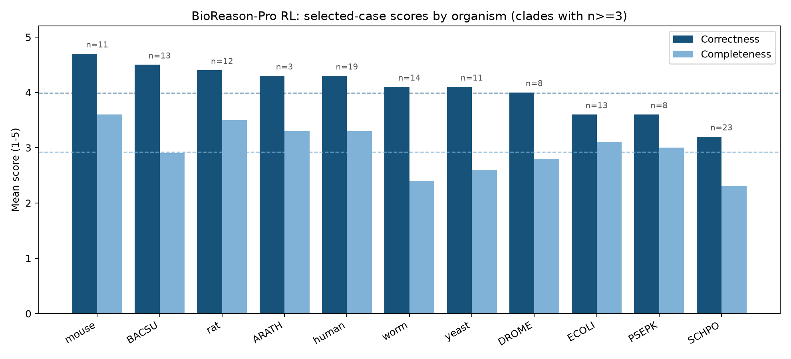
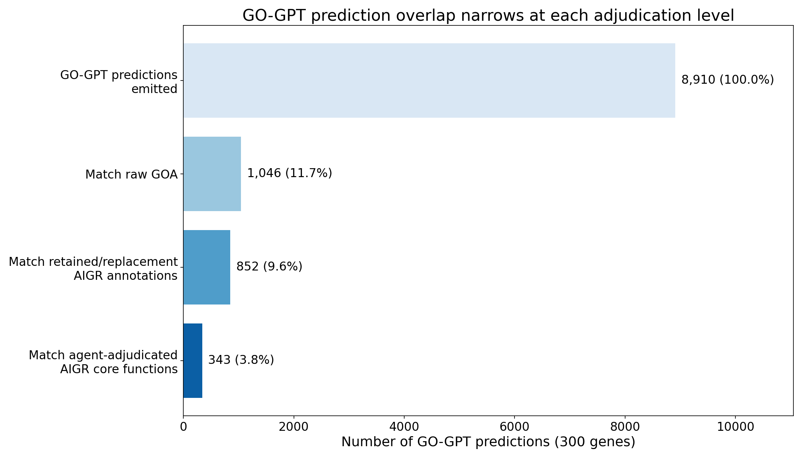
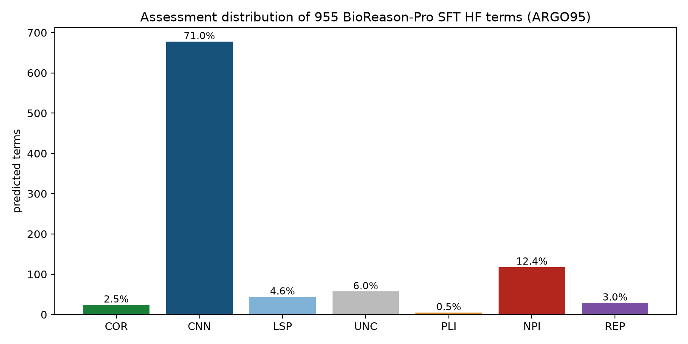

<!-- _class: lead -->

# Agentic evaluation of function prediction tools yields qualitative insights into systematic errors

## When is a new function-prediction method *good enough to deploy*?

A complement to CAFA built on **AI Gene Review (AIGR)**

ISMB 2026 · Function-COSI · github.com/ai4curation/ai-gene-review

<!-- Talk in one line: aggregate metrics tell you the field is improving; they don't tell a database lead whether to import a given method's predictions. We propose partially-automated agentic review to answer that. -->

---

## The deployment question

New function-prediction methods appear **monthly** — protein language models, generative models, agentic reasoning LLMs.

Annotation databases (GO, UniProt) face a concrete, recurring decision:

> **Should we import *this* method's predictions into production?**

Classical pipelines (InterPro2GO, PANTHER/PAINT, orthology transfer) are **traceable**: every annotation traces to a curated family → GO mapping.

The new methods are **opaque, prolific, and emit free text** — not just GO terms.

---

## CAFA is indispensable — but insufficient for *deployment*

CAFA ($F_{\max}$, $S_{\min}$ vs GOA temporal holdout) tracks **field-level progress**. Three structural gaps for a deployment decision:

- **Metric-level** — $F_{\max}$ rewards generic, high-frequency terms; lenient toward false positives; rankings flip with protein- vs term-centric scoring.
- **Ground-truth** — GOA is *not* truth: over-annotations, paralog-inherited errors, <1% negative annotations; 58% of human annotations cover 16% of genes.
- **Holdout-set** — benchmark composition is set by curation-campaign funding, not the biology you need to annotate.

**And the big one:** aggregate metrics operate on the *bag-of-GO-terms projection* — they leave narrative and reasoning unscored.

---

## The precedent: de Crécy-Lagard *et al.* 2025 (*G3*)

Manually reviewed **all 453** DeepECTransformer EC predictions for uncharacterised *E. coli* proteins.

> Only **3 / 453** were genuinely novel **and** correct.

The lasting contribution is the **error taxonomy** — the structure a curator needs after the aggregate score:

| | |
|---|---|
| **COR** correct novel | **CNN** correct but not novel |
| **LSP** less precise | **PLI** paralog-incorrect |
| **NPI** non-paralog-incorrect | **REP** frequency-biased |
| **UNC** uncertain | |

**Every rejection required synthesis** — domain architecture, paralog subfamily, pathway presence, in-vitro vs in-vivo, primary literature.

---

## The synthesis bottleneck

Each de Crécy-Lagard verdict needed a human expert to integrate **many lines of evidence**.

That does **not scale** when methods ship monthly and prediction sets run to the thousands.

### Our question

> Can the **synthesis step itself** be partially automated?

→ **AI Gene Review (AIGR)**: LLM curator-agents grounded in a per-gene evidence package, producing structured, traceable synthetic reviews.

AIGR is a **complement to**, not a replacement for, CAFA.

---

## The AIGR pipeline

**1 · Evidence assembly** (per gene, cached & reproducible)
UniProt record · full GO annotation table (QuickGO) · InterPro architecture · cached publications (**full text where available; abstract-level otherwise**) · orthogonal deep-research report

**2 · Curator-agent review** (three phases)
- *Annotation-level*: each GO term → `ACCEPT / KEEP_AS_NON_CORE / MODIFY / REMOVE / MARK_AS_OVER_ANNOTATED / UNDECIDED` + **verbatim supporting quote**
- *Core-function synthesis*: free-text summary + proposed terms
- *Prediction review*: classify each predicted term with the **Expert Synthetic Review taxonomy** + error-type tags

**3 · Validation** — LinkML schema + best-practice checks; **every quote must literally appear in a cached publication**

Open source · Typer CLI · `just` targets · browsable at ai4curation.io/ai-gene-review

---

## The system under test: BioReason-Pro

A two-stage agentic predictor (Fallahpour *et al.* 2026):

| Stage | What it is | Output |
|---|---|---|
| **GO-GPT** | Autoregressive transformer (ESM2 + organism) | GO term hierarchy *(upstream input)* |
| **BioReason-Pro** | Qwen3-4B fine-tune | `<think>` trace + **free-text functional summary** |

- **SFT** variant — more mechanistic depth, more hallucination
- **RL** variant — safer, shallower (never fabricates InterPro)

**Provenance:** the web app's GO panels are upstream GO-GPT output; the HuggingFace catalogue separately documents its structured GO section as BioReason-Pro SFT output.

---

## Case study 1 — ARGO139 design

- **139 proteins**, 14 species labels
- Spanning model-organism genes **and** non-MOD / less-specialized contexts: pseudoenzymes, sigma-factor paralogs, organism-specific regulators, moonlighting proteins, venom enzymes
- For each gene: BioReason-Pro RL summary + trace, ARGO95 SFT GO terms for the HF subset, **agent-adjudicated local AIGR reference**
- References are not independent expert ground truth: 64 `COMPLETE`, 48 `DRAFT`, 23 `IN_PROGRESS`, 4 `INITIALIZED`
- ARGO139 is the collected cohort; performance excludes the wrong-input `csr-1` case (n=138) and flags seven 2,000-aa truncations
- A dedicated **comparison agent** scores two axes (1–5), each with required supporting quotes:
  - **Correctness** — are the claims accurate?
  - **Completeness** — do they span the gene's core biology?
- Plus a per-gene **InterPro-label** comparison: novel insight, or restatement? (actual `GO_REF:0000002` annotations: 92/139)

---

## Overall scores: safe, but shallow

**Correctness 4.0 / 5 · Completeness 2.9 / 5** (n=138)

| Score | Correctness | Completeness |
|------:|------------:|-------------:|
| 5 | 70 (51%) | 1 (1%) |
| 4 | 25 (18%) | 40 (29%) |
| 3 | 22 (16%) | 51 (37%) |
| 2 | 14 (10%) | 39 (28%) |
| 1 | 7 (5%) | 7 (5%) |

51% score 5/5 on correctness, but **only one gene** (Uggt1) reaches 5/5 completeness.
The failure tail is small but **structurally distinctive** — not random noise.

Blinded n=20 second review: correctness **80% exact / kappa 0.950**; completeness **55% exact / kappa 0.744**.

---

## Selected-case scores differ by organism

Mouse has the highest selected-case mean (4.7), followed by ***B. subtilis*** (4.5), rat (4.4), and human (4.3); ***S. pombe*** is lowest (3.2). The panel is deliberately uneven, so this is descriptive, not an organism-level performance estimate.

---

## Eight reproducible model failure modes

Immediately diagnostic to a reader of the narrative.

| # | Failure mode | Example |
|---|---|---|
| 1 | **Pseudoenzyme blind spot** | Epe1 — "JmjC demethylase" despite degenerate active site |
| 2 | **Localisation defaults to cytoplasm** | CpxP periplasmic → called cytoplasmic |
| 3 | **Paralog indistinguishability** | Fyn ≡ Src; sigF ≡ sigG ≡ sigK |
| 4 | **Organism-specific biology absent** | daf-16 generic FoxO, no IIS/dauer/longevity |
| 5 | **Neo-functionalisation / moonlighting missed** | Nmnat NAD⁺ enzyme; chaperone role lost |
| 6 | **Narrative–GO disconnect** | RidA: `protein binding` not deaminase activity |
| 7 | **Cross-kingdom fold bias** | aprE subtilisin → "human blood coagulation" |
| 8 | **Generated UniProt-style fabrication** | Slc5a1 → steroid-sulfate transporter |

**The biases are architectural — they predict *where* the model will fail on deployment.**

---

## What the narratives actually look like

> **RAS2** *(yeast, 2/5)* — "a Ras-family GTPase … regulating intracellular **vesicle traffic** converging on the vacuole"
> ✗ Actually the primary activator of the **cAMP/PKA** pathway.

> **Epe1** *(S. pombe, 1/5)* — "a nuclear **histone demethylase** … JmjC oxygenase core"
> ✗ A **pseudoenzyme** (HVD not HXD); anti-silencing factor via HP1/Swi6.

> **TOR1** *(yeast, 4/4)* — "PIKK serine/threonine kinase … HEAT repeats scaffold regulatory assemblies … integrates nutrient & stress cues"
> ✓ Correct — the **FRB + multi-domain architecture** enabled pathway-level inference.

---

## Mostly a narrative restatement of InterPro labels

The dominant mode across 139 genes: **translate InterPro domains into prose**, no new biology. Where a family label or actual InterPro2GO mapping is misleading, BioReason-Pro can **recapitulate and amplify** it.

**Adds genuine value only when multi-domain architecture is diagnostic:**
TOR1 · NOTCH1 · PTEN · EGFR · spo0A · (informative family names: Uggt1, KAR2, bst1)

> A method can average 4.0/5 correctness while providing little net annotation value when it mainly restates supplied domain labels.

---

## Supplemental review: GOA agreement ≠ biological validity

GO-GPT run directly on 300 genes; overlap measured against three progressively stricter references:

The **3-fold gap** between raw-GOA agreement (11.7%) and agent-adjudicated core-function agreement (3.8%) illustrates the difference between snapshot agreement and coverage of the local core-function reference.

---

## ARGO95 SFT terms: most calls are not novel

955 SFT HF-catalogue terms (95 ARGO139 genes), audited against current GOA/AIGR and targeted biological review:

**71.0% CNN** (correct/non-novel; 631 exact GOA) · **15.9% NPI/PLI/REP** · **2.5% COR** · 4.6% LSP · 6.0% UNC

The 2.5% COR are known-literature gaps, not discoveries of previously unknown biology.

---

## The two arms fail *independently*

BioReason-Pro's narrative and its GO-term list are generated semi-independently — and can disagree:

- **RAS2** — GO terms correctly predict adenylate cyclase activation (GO:0007190); narrative wrongly describes vesicle trafficking.
- **CpxP** — GO terms correctly place it in the periplasm (GO:0030288); narrative wrongly says cytoplasm.

> Neither the narrative nor the term list can be trusted in isolation — a deployment protocol must evaluate **both**. CAFA metrics see only the term list.

*(SFT-specific risk: 16% of SFT outputs fabricate fake "UniProt Summary" text for uncharacterised proteins.)*

---

## Case study 2 — ESR-ECOLI-DET-Mini

7 *E. coli* genes spanning all classes; AIGR reproduces the published taxonomy.

Not blinded: the project artifacts include the published expert labels/rationales.

Dataset ID: `10.5281/zenodo.20751016`

| Gene | Paper | AIGR | Recovered rationale |
|---|---|---|---|
| ygfF | COR | **COR** | SDR family; GDH activity confirmed |
| yciO | PLI | **PLI** | TsaC paralog; ~10⁴× weaker activity |
| yegV | PLI | **PLI** | Correct sugar-kinase EC prefix; substrate unknown |
| yjhQ | NPI | **NPI** | Mycothiol pathway absent from *E. coli* |
| yrhB | NPI | **NPI** | QueD already encodes activity; Imm35 domain |
| yjdM | UNC | **UNC** | In-vitro activity, no in-vivo phenotype |
| fepE | REP | **REP** | No HK similarity; Wzz O-antigen regulator |

**7 / 7 classifications + mechanistic rationales reproduced.** This is a positive control for the schema/workflow, not a blinded accuracy estimate.

---

## Answer-key withheld recap: useful, not expert-equivalent

A separate literature/bioinformatics-assisted run excluded the de Crécy-Lagard paper and published rationales.

| Gene | Expert | Withheld run | Interpretation |
|---|---|---|---|
| fepE | REP | **REP** | Frequency-bias smell test recovered |
| yciO | PLI | **PLI** | Paralog-overannotation recovered |
| yjhQ / yrhB | NPI | **NPI** | Pathway-context failures recovered |
| yegV / ygfF | PLI / COR | **UNC** | Conservative misses |
| yjdM | UNC | **NPI** | Too harsh on in-vitro vs in-vivo boundary |

**4 / 7 exact labels.** Good enough to triage suspicious sequence-AI predictions; not a substitute for expert boundary judgments.

---

## A three-tier framework for evaluation

| Tier | What | Scales? | Grades narrative? |
|---|---|---|---|
| **1 · Aggregate** (CAFA $F_{\max}$/$S_{\min}$) | GOA temporal holdout | ✓ 10⁴ proteins | ✗ |
| **2 · Expert / agentic review** *(AIGR)* | Per-gene synthesis + taxonomy | **partially automated** | ✓ |
| **3 · Prospective experiment** | Assays, genetics, microscopy | ✗ no protocol | n/a |

- Tier 1 can't tell "adds new biology" from "restates supplied domain labels."
- Tier 3 doesn't scale — "function" is multi-dimensional & organism-specific.
- **Tier 2 is the practical level for deployment decisions** — AIGR brings its cost toward Tier 1.

**Recommendation:** report a Tier-1 score **and** a Tier-2 agentic biological-validity score.

---

## Conclusions

**BioReason-Pro** mostly tells you what you already know, occasionally something correct GOA has not recorded, and assigns **15.9% of ARGO95 terms to incorrect classes** in predictable, diagnosable ways.

- Narratives restate InterPro labels; **eight recurrent model-output failure modes**
- GO terms: 71.0% not novel, 15.9% NPI/PLI/REP, 2.5% correct and absent from frozen GOA in ARGO95
- Narrative and term arms **fail independently** → not ready for unsupervised import

**The most valuable thing a foundation model can produce is a well-reasoned *narrative*** — it can be reviewed, corrected, combined. Naked GO terms cannot.

**Agentic Tier-2 review** reads narratives, surfaces systematic failures, separates novelty from restatement — and is already useful as a triage/smell-test layer, even though expert-level nuance remains human.

---

<!-- _class: lead -->

# Thank you

**Data, reviews, pipeline, schema & validator — all open:**
`github.com/ai4curation/ai-gene-review`

Browse 139 BioReason-Pro reviews + `ESR-ECOLI-DET-Mini`:
`ai4curation.io/ai-gene-review`

de Crécy-Lagard et al. 2025 (G3, PMID:40703034) · Fallahpour et al. 2026 (bioRxiv 10.64898/2026.03.19.712954)
