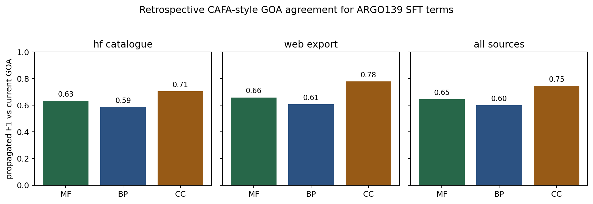

# Supplemental benchmark and source-availability details

This supplement documents analyses that are useful for reproducibility but are not part of the main paper's primary BioReason-Pro benchmark story. The main manuscript uses **ARGO139** for RL narrative review and **ARGO95** for SFT GO-term review, while `ESR-ECOLI-DET-Mini` is the separate Expert Synthetic Review recap positive control. The views below explain why earlier drafts used mixed SFT denominators and preserve those results for reproducibility.

## S1. Cohort accounting

The main RL benchmark is ARGO139, a fixed 139-gene set listed in `../genes.csv`. The main SFT term benchmark is ARGO95, the 95-gene ARGO139 subset present in the HuggingFace `wanglab/protein_catalogue` SFT download.

ARGO139 uses agent-adjudicated local AIGR references, not independently expert-signed ground truth: 64 are `COMPLETE`, 48 `DRAFT`, 23 `IN_PROGRESS`, and 4 `INITIALIZED` at the frozen audit baseline. The RL performance set excludes the wrong-input `csr-1` export (n=138) and separately flags seven retained exports truncated at the 2,000-residue model limit.

**Table S1.** Cohorts emitted by `write_benchmark_sidecars.py`.

| Cohort | Genes | Predictions | Role |
|---|---:|---:|---|
| `argo139_rl_narrative` | 139 | - | Main RL narrative benchmark |
| `argo95_sft_terms` | 95 | 955 | Main HF-catalogue SFT term benchmark |
| `supplement_sft_terms_argo139_mixed_sources` | 139 | 10,697 | Mixed-source ARGO139 diagnostic; not a primary benchmark |
| `supplement_sft_terms_web_export_44` | 44 | 9,742 | ARGO139 genes absent from HF; web source includes ancestor hierarchy |
| `supplement_sft_narrative_hf` | 45 | - | SFT narrative cross-check |
| `supplement_sft_terms_hf_catalogue_all` | 154 | 1,358 | Full HF catalogue view |
| `supplement_sft_terms_union_all` | 198 | 11,100 | ARGO139 plus 59 HF-only genes |
| `supplement_gogpt_overlap_300` | 300 | 8,910 | Separate GO-GPT overlap review |

The key availability issue is simple: the HuggingFace `wanglab/protein_catalogue` SFT download contained 95/139 ARGO139 genes. The remaining 44 ARGO139 genes were not present in that download. We do **not** fill those 44 into the primary SFT analysis, because the BioReason-Pro SFT web exports expose a much larger ancestor-rich term panel and are not comparable to the HF catalogue source.

## S2. Supplemental SFT term views

**Table S2.** ARGO95 SFT assessment distribution, repeated from the main paper.

| Benchmark | Genes | Terms | CNN | NPI | PLI | COR | LSP | REP | UNC |
|---|---:|---:|---:|---:|---:|---:|---:|---:|---:|
| ARGO95 (HF catalogue) | 95 | 955 | 678 (71.0%) | 118 (12.4%) | 5 (0.5%) | 24 (2.5%) | 44 (4.6%) | 29 (3.0%) | 57 (6.0%) |

For comparison, the mixed-source ARGO139 view is retained as a source-diagnostic table, not as a primary SFT benchmark.

**Table S3.** Supplemental mixed-source ARGO139 SFT assessment distribution.

| Source | Genes | Terms | CNN | NPI | PLI | COR | LSP | REP | UNC |
|---|---:|---:|---:|---:|---:|---:|---:|---:|---:|
| HF catalogue / ARGO95 | 95 | 955 | 678 (71.0%) | 118 (12.4%) | 5 (0.5%) | 24 (2.5%) | 44 (4.6%) | 29 (3.0%) | 57 (6.0%) |
| Web export | 44 | 9,742 | 2,321 (23.8%) | 42 (0.4%) | 0 (0.0%) | 7 (0.1%) | 388 (4.0%) | 1 (0.0%) | 6,983 (71.7%) |
| Mixed-source ARGO139 total | 139 | 10,697 | 2,999 (28.0%) | 160 (1.5%) | 5 (0.0%) | 31 (0.3%) | 432 (4.0%) | 30 (0.3%) | 7,040 (65.8%) |

**Table S4.** Terms per gene in the SFT source views.

| Source | Mean terms/gene | Median terms/gene | Max terms/gene |
|---|---:|---:|---:|
| ARGO95 / HF catalogue | 10.1 | 7.0 | 38 |
| Web export | 221.4 | 212.5 | 598 |
| Mixed-source ARGO139 total | 77.0 | 12.0 | 598 |

The all-HF view is still useful as the broadest single-source HF view, but it is not the main benchmark because 59 of those genes are outside ARGO139.

**Table S5.** Supplemental full HF catalogue view: 1,358 terms across 154 genes.

| Assessment | Count | % |
|---|---:|---:|
| CNN | 917 | 67.5 |
| NPI | 172 | 12.7 |
| UNC | 143 | 10.5 |
| LSP | 57 | 4.2 |
| COR | 31 | 2.3 |
| REP | 33 | 2.4 |
| PLI | 5 | 0.4 |

The all-source union is the broadest source-availability view, but it combines ARGO139 with 59 HF-only genes and is therefore not a paired benchmark.

**Table S6.** Supplemental all-source union: 11,100 terms across ARGO139 plus 59 HF-only genes.

| Assessment | Count | % |
|---|---:|---:|
| UNC | 7,126 | 64.2 |
| CNN | 3,238 | 29.2 |
| LSP | 445 | 4.0 |
| NPI | 214 | 1.9 |
| COR | 38 | 0.3 |
| REP | 34 | 0.3 |
| PLI | 5 | 0.0 |

## S3. CAFA-style retrospective GOA agreement

We computed a retrospective CAFA-style agreement score for ARGO95 SFT GO-term predictions using current local GOA as the reference. This is not a true CAFA benchmark: ARGO95 is retrospective, there is no temporal holdout, and the BioReason-Pro SFT files do not contain model confidence scores. The score therefore treats predictions as an unranked single-threshold set and reports propagated precision/recall/F1 rather than \(F_{\max}\). Both predictions and reference GOA annotations are propagated over `is_a` and `part_of` ancestors from the frozen 2026-03-25 `go-basic.obo`, excluding the three GO aspect roots. The archived file's SHA-256 is pinned in `benchmark-policy.yaml`; load-time sentinels verify release-specific active and obsolete terms. The reproducible `verify_ontology_authority.py` check independently downloads the official archive and queries QuickGO and OLS; on 2026-07-12 the remote checksum matched and both live services reported the five disputed sentinels as obsolete. GOA can retain identifiers after ontology obsoletion, so the mixed-date legacy `cache/ontologies/go.tsv` status flag is not used as the ontology authority. Ontology status is recorded separately from assessment: a status-only label mismatch retains its biological `CNN`, `COR`, or `UNC` call, while `LSP` remains reserved for a canonical concept that is more generic than the supported annotation. The mixed-source ARGO139 rows are retained only as diagnostics.

**Table S7.** Propagated all-aspect agreement against current GOA.

| Source | Genes | Scored direct predictions | Direct GOA terms | Precision | Recall | F1 |
|---|---:|---:|---:|---:|---:|---:|
| ARGO95 / HF catalogue | 95 | 952 | 2,382 | 0.865 | 0.479 | 0.617 |
| Web export | 44 | 9,730 | 3,885 | 0.780 | 0.533 | 0.633 |
| Mixed-source ARGO139 total | 139 | 10,682 | 6,267 | 0.810 | 0.511 | 0.627 |

The score shows why aggregate GOA agreement is useful but incomplete. In the HF catalogue subset, 53/152 terms classified by AI-AUGR as NPI, PLI, or REP are exact matches to current GOA, and 124/152 have propagated overlap with current GOA. A GOA-agreement metric would reward some of these predictions despite evidence-grounded review classifying them as wrong or frequency-biased.

Full derived tables are in `../cafa-style/`.

## S4. SFT narrative cross-check

The HuggingFace SFT narrative sample contains 45 proteins, all with parseable 1-5 correctness/completeness scores. It is not paired to ARGO139 and is not used as a main result. It remains a useful cross-check: mean SFT scores are 3.0/5 correctness and 2.7/5 completeness, and 7/45 SFT outputs contained generated "UniProt Summary" prose for proteins that UniProt describes only as uncharacterized.

## S5. Blinded RL second review

A second rater scored 20 RL Functional Summaries without access to the first-rater reviews or project metrics. The deterministic sample contains four genes from each first-rater correctness stratum. Correctness agreement was 80% exact, 100% within one point, and quadratic-weighted kappa 0.950. Completeness agreement was 55% exact, 95% within one point, and kappa 0.744. The full protocol, raw ratings, and generated metrics are in `../second-review-protocol.md`, `../second-review-ratings.csv`, and `../second-review-agreement.json`.

## S6. GO-GPT reviews

The ARGO139 web-export leaf review is explicitly pending rather than a completed benchmark. Ontology-aware rebuilding retained 5,923 terms: 1,900 exact positive AIGR matches (`CNN`), 129 exact rejected/over-annotated matches (`NPI`), and 3,894 unresolved terms (`UNC`). Accordingly, 138 documents are `DRAFT` and only the fully deterministic `BACSU/ftsZ` file is `COMPLETE`.

A distinct supplemental analysis, `supplement_gogpt_overlap_300`, contains 8,910 GO-GPT predictions across 300 genes. It is not the pending 5,923-term ARGO139 leaf set above and is not a paired ARGO139 BioReason-Pro result. This separate overlap analysis remains useful for showing how much apparent agreement changes when the reference set moves from raw GOA to AIGR core biology.

**Table S8.** GO-GPT prediction overlap at three reference levels (300 genes).

| Reference level | Terms in reference | Predictions overlapping | % of 8,910 predictions |
|---|---:|---:|---:|
| Raw GOA | 2,967 | 1,046 | 11.7 |
| Retained/replacement AIGR annotations | 2,712 | 852 | 9.6 |
| All GO-valued AIGR core-function slots | 1,199 | 343 | 3.8 |

GO-GPT emitted 8,910 predictions across 300 genes (mean 29.7 per gene). Raw GOA agreement was 11.7%; exact agreement with all GO-valued AIGR core-function slots was 3.8%. The post-review layer retains `ACCEPT`, `KEEP_AS_NON_CORE`, `UNDECIDED`, and pending annotations, substitutes proposed replacements for `MODIFY`, excludes negated and rejected annotations, and unions in the core-function terms. This is a useful illustration of the CAFA-style scoring gap, but it is not used as a main BioReason-Pro benchmark result.

## S7. Reproducibility files

- `../genes.csv`: ARGO139 member list.
- `../argo139-species-counts.csv`: ARGO139 species distribution.
- `../argo139-curation-context-counts.csv`: ARGO139 curation-context summary.
- `../benchmark-cohorts.csv`: cohort-level provenance and sizes.
- `../benchmark-genes.csv`: gene-level benchmark/source provenance.
- `../benchmark-quality.csv`: per-gene source presence, dates, and checksums.
- `../benchmark-metrics.json`: generated authoritative aggregate metrics.
- `../argo95-ontology-pair-adjudication.tsv`: independent adjudication of every ARGO95 ID-label mismatch that was nonnegative either at the audit baseline or after manual biological reclassification.
- `../cafa_style_argo139.py`: retrospective CAFA-style SFT scorer; ARGO95 is the primary HF-catalogue row.
- `../cafa-style/argo139_cafa_style_summary.csv`: propagated and exact precision/recall/F1 summary.
- `../cafa-style/argo139_cafa_style_per_gene_aspect.csv`: per-gene/per-aspect score components.
- `../cafa-style/argo139_prediction_goa_overlap.csv`: per-prediction exact and propagated GOA-overlap diagnostics.
- `../../../scripts/gogpt_compare_levels.py`: deterministic 300-gene GO-GPT overlap scorer across raw GOA, retained/replacement annotations, and all GO-valued AIGR core-function slots.
- `../../../reports/gogpt-comparison-levels.json`: per-gene output and aggregates from the 300-gene GO-GPT overlap scorer.
- `../notebooks/02_prediction_assessments.ipynb`: executable SFT term-assessment notebook.
