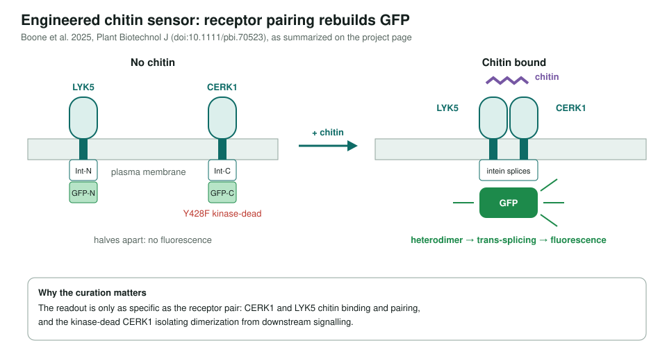
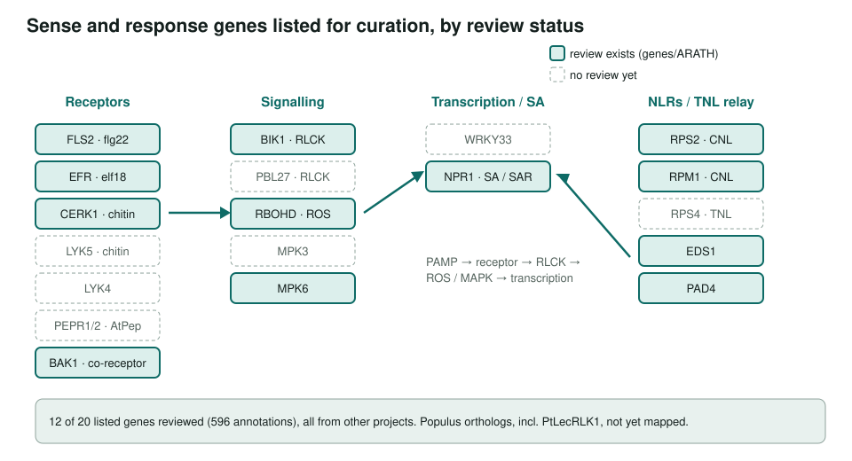

<!-- _class: lead -->

# Plant-encoded biosensors

Borrowing plant immune receptors to sense microbes (scoping notes)

AI Gene Review · projects/BIOSENSORS · 2026

---

<!-- _class: bluf -->

## Bottom line

- ORNL's **SEED SFA** builds plant biosensors that sense microbes through **immune receptors** and report or respond.
- Flagship: a **chitin sensor** that splits GFP across **LYK5** and kinase-dead **CERK1**; chitin pairing rebuilds fluorescence.
- **Scoped, not started** as curation: 12 of the 20 listed Arabidopsis genes already have reviews from other work; none of the TODOs is done.

---

## The engineered chitin sensor

---

## Why curate the parts

- A sensor inherits the **specificity of its receptors** and the **wiring of the pathway** it taps.
- Receptor classes of interest: LRR-RLKs (FLS2, EFR, BAK1), LysM-RLKs (CERK1, LYK5, LYK4), lectin RLKs (Populus PtLecRLK1).
- Downstream responses the page tracks: ROS burst (RBOHD), MAPK activation, SA/SAR genes (NPR1, PR genes); defense promoters can drive reporters.
- Other SEED designs noted: split-intein dimerization sensor, Plant RNA Vision RNA biosensor.

---

## Which parts have reviews

---

## Status and next steps

- ⬜ Map genes to UniProt/TAIR IDs.
- ⬜ Review the missing receptors first: **LYK5, LYK4** (the chitin sensor's own parts), PEPR1/2.
- ⬜ Cross-reference Arabidopsis defense pathway annotations; move EFR and BIK1 off `INITIALIZED`.
- ⬜ Identify orthologs in *Populus trichocarpa*.

**Read more:** `projects/BIOSENSORS.md` · `genes/ARATH/CERK1/`
