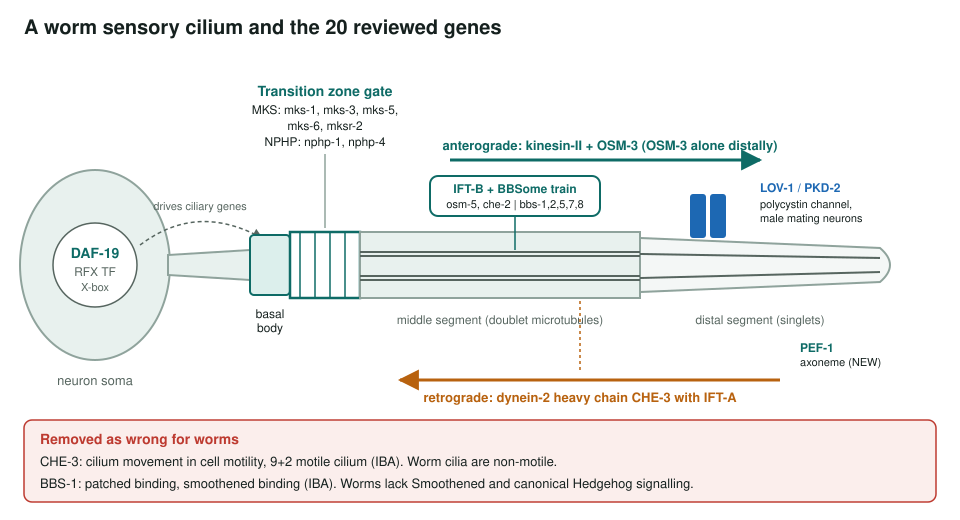
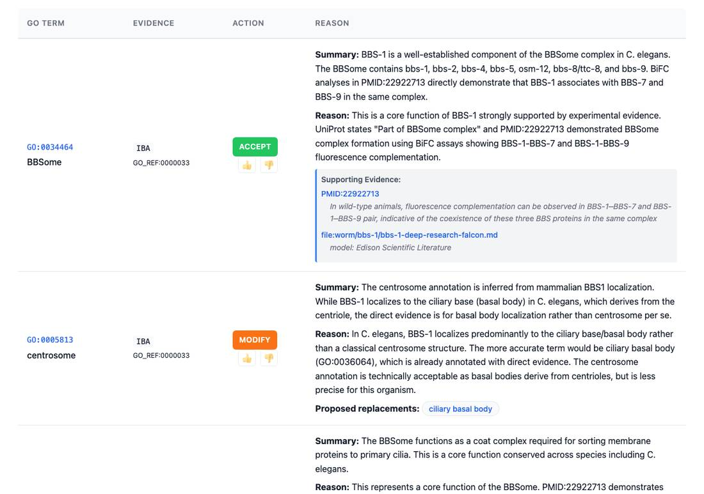
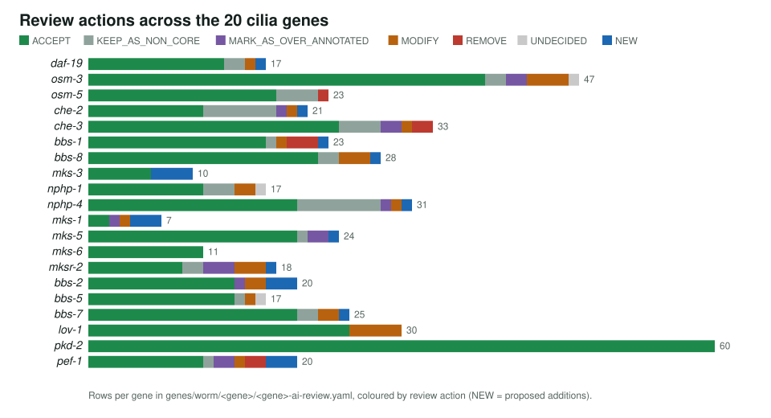

<!-- _class: lead -->

# *C. elegans* ciliopathy genes

Reviewing GO annotations for 20 genes that build and run worm sensory cilia

AI Gene Review · projects/CAEEL_CILIOPATHY · 2026

---

<!-- _class: bluf -->

## Bottom line

- Worm sensory cilia use the **same machinery that fails in human ciliopathies**: DAF-19, IFT motors and trains, the BBSome, the MKS/NPHP transition zone, LOV-1/PKD-2.
- We reviewed **every GO annotation on 20 genes**: **482 rows**, 366 ACCEPT, 29 MODIFY, 8 REMOVE, 21 NEW proposals.
- Most annotations are sound. Errors cluster in **over-general terms** and **propagation from vertebrate motile-cilium and Hedgehog biology**.

---

## Why the worm

- 60 of 302 neurons are ciliated; cilia are **non-motile**, like vertebrate primary cilia.
- Classic screens (Dyf, Osm, Che, Daf, Lov phenotypes) named much of the IFT machinery.
- Worm GO annotations feed **orthology-based inference** for human BBS, NPHP, MKS and PKD genes.
- Test: does per-gene review separate real worm biology from propagated vertebrate biology?

---

## Where the 20 genes act

---

## What a review looks like

bbs-1 review page: BBSome membership (GO:0034464) accepted; the IBA <em>centrosome</em> row modified to <em>ciliary basal body</em>.

---

## Actions per gene

---

## Typical corrections

| Gene | Existing term | Action | Replacement |
|---|---|---|---|
| osm-3 | microtubule-based movement (IEA) | MODIFY | intraciliary anterograde transport |
| che-3 | intracellular protein localization (IMP) | MODIFY | intraciliary retrograde transport |
| nphp-1 | ciliary basal body (IDA) | MODIFY | ciliary transition zone |
| mksr-2 | cilium (IEA) | MODIFY | ciliary transition zone |
| bbs-2 | motile cilium (IBA) | MODIFY | non-motile cilium |
| pef-1 | nucleus (IBA), iron ion binding (IEA) | REMOVE | none |

All rows verified in genes/worm/&lt;gene&gt;/&lt;gene&gt;-ai-review.yaml.

---

## Findings

1. **Species-inappropriate propagation**: motile-cilium rows on dynein CHE-3 and patched/smoothened binding on BBS-1 removed.
2. **Precision**: generic transport and localization terms sharpened to anterograde/retrograde IFT, basal body, transition zone.
3. **Missing functions proposed**: transition zone assembly for mks-1 and mks-3; axoneme and thermosensory behaviour for pef-1.
4. pkd-2 (60 rows) and mks-6 (11 rows): every row accepted.

---

## Status and next steps

- ✅ 20/20 gene reviews, pathway summary, curation recommendations.
- ⬜ Submit the MODIFY/REMOVE/NEW recommendations to WormBase/GO.
- ⬜ Fold in 8 IFT genes already reviewed outside this project (daf-10, che-11, dyf-2, che-13, xbx-1, dyf-1, osm-6, klp-11).

**Read more:** `projects/CAEEL_CILIOPATHY.md` · `projects/CAEEL_CILIOPATHY/` · `genes/worm/<gene>/`
