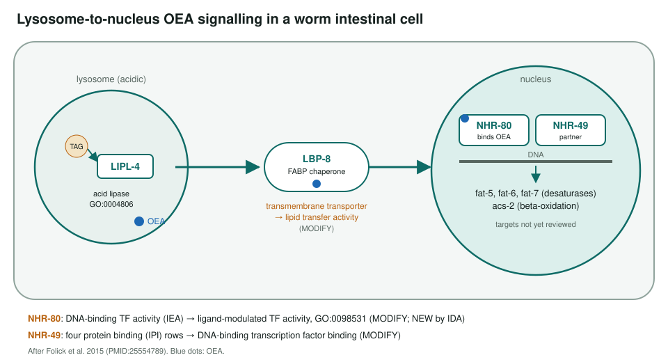
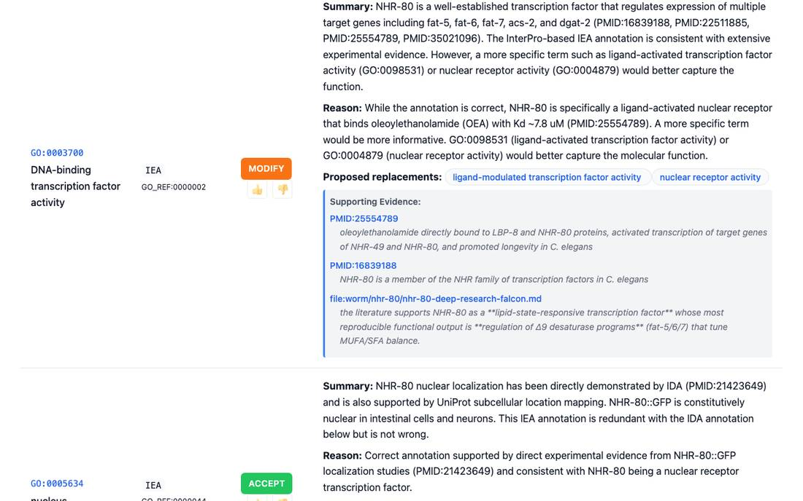

<!-- _class: lead -->

# Lysosome-to-nucleus lipid signalling in *C. elegans*

Reviewing GO annotations for the four genes of the OEA longevity pathway

AI Gene Review · projects/CAEEL_LYSOSOME_NUCLEUS_LIPID_SIGNALING · 2026

---

<!-- _class: bluf -->

## Bottom line

- **LIPL-4** releases OEA in the lysosome, **LBP-8** carries it to the nucleus, and **NHR-80** with **NHR-49** turns on lipid genes that extend lifespan (PMID:25554789).
- All four genes reviewed: **74 rows**, 60 ACCEPT, 6 MODIFY, 4 NEW.
- Corrections make the signal explicit: LBP-8 gets **lipid transfer activity** in place of a transmembrane transporter term, **ligand-modulated** TF activity for NHR-80. Downstream targets are not yet reviewed.

---

## The pathway

---

## Why this pathway

- Short and well characterised: one enzyme, one chaperone, one receptor pair.
- A direct binding measurement: NHR-80 binds OEA with Kd about 7.8 µM.
- Needed for germline-loss (glp-1) longevity, separable from insulin/IGF and dietary restriction.
- Test: can GO terms express a **lipid messenger** moving from lysosome to nucleus?

---

## A MODIFY in practice

nhr-80: the IEA DNA-binding transcription factor row is modified to ligand-modulated transcription factor activity or nuclear receptor activity.

---

## Results per gene

| Gene | Role | Rows | ACCEPT | Non-core | Over-ann. | MODIFY | NEW |
|---|---|---|---|---|---|---|---|
| lipl-4 | lysosomal acid lipase | 14 | 13 | 1 | 0 | 0 | 0 |
| lbp-8 | FABP lipid chaperone | 17 | 15 | 0 | 0 | 1 | 1 |
| nhr-80 | OEA receptor | 15 | 10 | 2 | 0 | 1 | 2 |
| nhr-49 | NHR-80 partner | 28 | 22 | 0 | 1 | 4 | 1 |

No REMOVE actions. NEW: intracellular lipid transport (lbp-8), ligand-modulated TF activity and nuclear receptor binding (nhr-80), cellular response to hypoxia (nhr-49).

---

## Status and next steps

- ✅ lipl-4, lbp-8, nhr-80, nhr-49 reviewed.
- ⬜ Review downstream targets fat-5, fat-6, fat-7, acs-2 and the glp-1 longevity context.
- Related reviews already in the repo: hlh-30 (TFEB, regulates lipl-4) and daf-16.

**Read more:** `projects/CAEEL_LYSOSOME_NUCLEUS_LIPID_SIGNALING.md` · `genes/worm/<gene>/`
