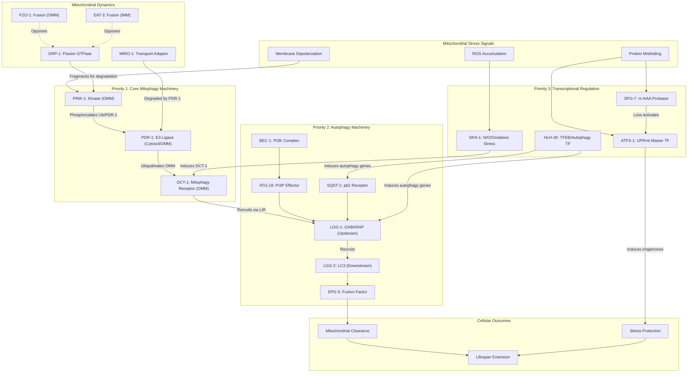

# Pathway Summary: C. elegans Mitophagy and Mitochondrial Quality Control

## Overview

Mitophagy in *Caenorhabditis elegans* represents a highly conserved quality control mechanism that selectively eliminates damaged or dysfunctional mitochondria through autophagy. This pathway integrates signals from mitochondrial damage sensors, the general autophagy machinery, and transcriptional regulators that coordinate stress responses with longevity. The core PINK-1/PDR-1/DCT-1 axis serves as the primary mitophagy initiation pathway, while mitochondrial dynamics (fission/fusion balance) determines which mitochondria are targeted for degradation. The UPRmt, regulated by ATFS-1, provides a parallel protective response that can either complement or antagonize mitophagy depending on the severity and duration of mitochondrial stress [PMID:22700657, PMID:25896323].

---

## Pathway Architecture

---

## Priority 1: Core Mitophagy Machinery

### PINK-1 - The Damage Sensor
**Gene file:** [genes/worm/pink-1/pink-1-ai-review.yaml](../genes/worm/pink-1/pink-1-ai-review.yaml)

PINK-1 (Q09298) is the C. elegans ortholog of mammalian PINK1, functioning as a mitochondrial serine/threonine kinase that senses mitochondrial damage and initiates the mitophagy cascade [PMID:19251702, PMID:25896323]. The protein contains:
- N-terminal mitochondrial targeting sequence (residues 1-74)
- Transmembrane domain
- Cytosol-facing kinase domain (residues 137-483)

Under normal conditions, PINK-1 is imported into mitochondria and degraded. Upon membrane depolarization, full-length PINK-1 accumulates on the outer mitochondrial membrane where it:
1. Autophosphorylates to become active
2. Phosphorylates ubiquitin at Ser65
3. Phosphorylates PDR-1 at Ser65 to activate its E3 ligase function

Loss of *pink-1* causes reduced mitochondrial cristae length, increased paraquat sensitivity, and defective mitophagy [PMID:19251702, PMID:26469957].

### PDR-1 - The Ubiquitin Ligase
**Gene file:** [genes/worm/pdr-1/pdr-1-ai-review.yaml](../genes/worm/pdr-1/pdr-1-ai-review.yaml)

PDR-1 (Q9XUS3) is the C. elegans Parkin ortholog, an RBR-family E3 ubiquitin-protein ligase containing Ubl-RING0-RING1-IBR-RING2 domains [PMID:16204351]. PDR-1 is:
- Primarily cytosolic under basal conditions
- Recruited to the mitochondrial outer membrane upon PINK-1 activation
- Responsible for K48-linked ubiquitination of OMM substrates including CED-10/Rac1 [PMID:24625979]

The PDR-1-mediated ubiquitination creates a feed-forward loop that amplifies the mitophagy signal and recruits autophagy receptors. Loss of *pdr-1* increases vulnerability to mitochondrial complex I inhibitors (rotenone, fenperoximate) but not to paraquat or sodium azide, suggesting specific sensitivity to ETC dysfunction [PMID:16239214].

### DCT-1 - The Mitophagy Receptor
**Gene file:** [genes/worm/dct-1/dct-1-ai-review.yaml](../genes/worm/dct-1/dct-1-ai-review.yaml)

DCT-1 (Q09969) is the C. elegans ortholog of mammalian BNIP3/NIX, serving as the key mitophagy receptor [PMID:25896323]. DCT-1 contains:
- C-terminal transmembrane domain for OMM localization
- Conserved WXXL LIR-like motif for LGG-1/Atg8 binding
- BH3-like domain (though kills via BH3-independent mechanism)

DCT-1 operates genetically with PINK-1 and PDR-1; under oxidative stress, DCT-1 is ubiquitinated at Lys-26 in a PINK-1-dependent manner. Critically, DCT-1 is transcriptionally regulated by both DAF-16/FOXO and SKN-1/Nrf2, forming a homeostatic feedback loop [PMID:16380712, PMID:25896323].

Loss of *dct-1* leads to:
- Accumulation of dysfunctional mitochondria
- Increased mitochondrial mass with decreased ATP
- Elevated ROS and membrane depolarization
- Shortened lifespan in long-lived mutants (daf-2, isp-1, clk-1)

---

## Mitochondrial Dynamics: Fission vs Fusion

### DRP-1 - The Fission GTPase
**Gene file:** [genes/worm/drp-1/drp-1-ai-review.yaml](../genes/worm/drp-1/drp-1-ai-review.yaml)

DRP-1 (Q8WQC9) is a dynamin-related GTPase that mediates mitochondrial outer membrane fission [PMID:10619028]. Key features:
- Recruited from cytosol to OMM at constriction sites
- Oligomerizes and uses GTP hydrolysis for membrane scission
- Cleaved by CED-3 caspase during apoptosis (required for pro-apoptotic but not fission function) [PMID:18722182]

The relationship between fission and mitophagy is critical: mitochondrial fragmentation by DRP-1 is required to segregate damaged portions for selective autophagy. Loss of *drp-1* causes:
- Enlarged, interconnected mitochondria with matrix retracted into blebs [PMID:10619028]
- Embryonic lethality (severe alleles)
- Altered mitophagy kinetics

### FZO-1 and EAT-3 - The Fusion Machinery
**Gene files:** [genes/worm/fzo-1/fzo-1-ai-review.yaml](../genes/worm/fzo-1/fzo-1-ai-review.yaml), [genes/worm/eat-3/eat-3-ai-review.yaml](../genes/worm/eat-3/eat-3-ai-review.yaml)

FZO-1 (C. elegans Mitofusin) and EAT-3 (C. elegans OPA1) mediate outer and inner mitochondrial membrane fusion, respectively. They oppose DRP-1-mediated fission:
- CED-9 overexpression causes interconnected mitochondria (pro-fusion)
- This phenotype is suppressed by increased DRP-1 expression [PMID:18827010]
- The balance between fission and fusion determines mitochondrial fate

### MIRO-1 - The Transport Adaptor
**Gene file:** [genes/worm/miro-1/miro-1-ai-review.yaml](../genes/worm/miro-1/miro-1-ai-review.yaml)

MIRO-1 (Q94263) is an outer mitochondrial membrane GTPase that couples mitochondria to motor proteins for transport along microtubules. Upon mitochondrial damage:
- MIRO-1 is degraded by Parkin/PDR-1
- This "quarantines" damaged mitochondria by preventing their transport
- Enables localized mitophagy

MIRO-1 also maintains mitochondrial membrane potential via interaction with VDAC-1 and is required for calcium-dependent mitochondrial fragmentation during stress.

---

## Priority 2: Autophagy Machinery

### LGG-1 and LGG-2 - The ATG8 Paralogs
**Gene files:** [genes/worm/lgg-1/lgg-1-ai-review.yaml](../genes/worm/lgg-1/lgg-1-ai-review.yaml), [genes/worm/lgg-2/lgg-2-ai-review.yaml](../genes/worm/lgg-2/lgg-2-ai-review.yaml)

A unique feature of C. elegans autophagy is the hierarchical relationship between LGG-1 (GABARAP family) and LGG-2 (LC3 family) [PMID:24374177]:

**LGG-1 (Q09490):**
- Acts upstream in autophagosome biogenesis
- Conjugated to PE at Gly-116 via ATG7-ATG3-ATG12/5/16 cascade
- Directly binds LIR motif-containing cargo receptors (SEPA-1, SQST-1, ALLO-1, DCT-1)
- GFP::LGG-1 puncta are the gold-standard autophagy marker

**LGG-2:**
- Acts downstream of LGG-1
- Controls autophagosome-lysosome fusion via VPS39 interaction
- Required for efficient cargo degradation

During mitophagy, LGG-1-positive autophagosomes enclose DCT-1-marked mitochondria, with LGG-2 subsequently recruited for fusion with lysosomes.

### BEC-1 - The PI3K Complex Core
**Gene file:** [genes/worm/bec-1/bec-1-ai-review.yaml](../genes/worm/bec-1/bec-1-ai-review.yaml)

BEC-1 is the C. elegans Beclin1 ortholog, a core component of the VPS34 PI3K complex that generates PI3P for autophagosome nucleation. Required for all autophagy including mitophagy.

### SQST-1 - The p62 Receptor
**Gene file:** [genes/worm/sqst-1/sqst-1-ai-review.yaml](../genes/worm/sqst-1/sqst-1-ai-review.yaml)

SQST-1 is the C. elegans p62/SQSTM1 ortholog that links ubiquitinated substrates (including PDR-1-ubiquitinated mitochondrial proteins) to the autophagy machinery via LGG-1 binding.

### ATG-18 - The PI3P Effector
**Gene file:** [genes/worm/atg-18/atg-18-ai-review.yaml](../genes/worm/atg-18/atg-18-ai-review.yaml)

ATG-18 (WIPI1/2 ortholog) binds PI3P generated by VPS34/BEC-1 and recruits downstream autophagy machinery to the phagophore.

### EPG-5 - The Fusion Factor
**Gene file:** [genes/worm/epg-5/epg-5-ai-review.yaml](../genes/worm/epg-5/epg-5-ai-review.yaml)

EPG-5 is required for autophagosome-lysosome fusion, the terminal step that enables degradation of engulfed mitochondria.

---

## Priority 3: Transcriptional Regulation and Longevity Integration

### ATFS-1 - The UPRmt Master Regulator
**Gene file:** [genes/worm/atfs-1/atfs-1-ai-review.yaml](../genes/worm/atfs-1/atfs-1-ai-review.yaml)

ATFS-1 (Q23272) represents a critical decision point between mitophagy and mitochondrial repair [PMID:22700657, PMID:25773600]. The protein contains dual targeting signals:
- N-terminal mitochondrial targeting sequence (MTS, residues 1-23)
- Nuclear localization signal (NLS, residues 436-441)

**The Import-Efficiency Sensing Model:**
Under normal conditions, ATFS-1 is efficiently imported into mitochondria and degraded by LONP-1. During mitochondrial stress:
1. Import efficiency is reduced
2. ATFS-1 accumulates in cytosol
3. ATFS-1 translocates to nucleus
4. Activates UPRmt target genes (hsp-6, hsp-60, chaperones, proteases)

ATFS-1 uniquely regulates both nuclear and mitochondrial transcription by binding to OXPHOS gene promoters in both genomes [PMID:25773600]. The UPRmt provides resistance to pathogen infection (P. aeruginosa), anoxia-reperfusion injury, and oxidative stress [PMID:25274306, PMID:27459203].

**Mitophagy vs UPRmt Decision:**
The balance between ATFS-1-mediated repair (UPRmt) and PINK-1/PDR-1-mediated clearance (mitophagy) depends on stress severity and duration. Mild/transient stress favors repair; severe/chronic stress favors clearance.

### HLH-30 - The TFEB Ortholog
**Gene file:** [genes/worm/hlh-30/hlh-30-ai-review.yaml](../genes/worm/hlh-30/hlh-30-ai-review.yaml)

HLH-30 (H2KZZ2) is the C. elegans TFEB ortholog, a master transcriptional regulator of autophagy, lysosomal biogenesis, and lipid metabolism [PMID:23925298, PMID:23604316]. Key features:
- bHLH transcription factor binding E-box motifs (CACGTG)
- Cytoplasmic under fed conditions; nuclear upon starvation/stress
- Directly activates lgg-1, lgg-2, sqst-1, and lysosomal genes

**Longevity Integration:**
HLH-30 is essential for lifespan extension in at least six distinct longevity paradigms:
1. Germline loss (glp-1)
2. TOR inhibition (let-363)
3. Dietary restriction (eat-2)
4. Reduced insulin/IGF signaling (daf-2)
5. Reduced mitochondrial respiration (clk-1, isp-1)
6. Reduced translation (rsks-1)

HLH-30 overexpression extends lifespan by 15-20%. Nuclear localization is enhanced in all six longevity models [PMID:23925298].

**Innate Immunity:**
HLH-30 is rapidly activated upon bacterial infection and drives approximately 80% of the host defense transcriptional response [PMID:24882217]. Required for survival during S. aureus infection.

### SKN-1 - The Nrf2 Ortholog
**Gene file:** [genes/worm/skn-1/skn-1-ai-review.yaml](../genes/worm/skn-1/skn-1-ai-review.yaml)

SKN-1 (P34707) is the C. elegans Nrf2 ortholog, a master regulator of oxidative stress responses and Phase II detoxification. Multiple isoforms (SKN-1A/B/C) function in different tissues:
- Regulates gst-4, gst-1, gcs-1, and other detoxification genes
- Required for lifespan extension in multiple paradigms
- Regulates DCT-1 expression, connecting oxidative stress to mitophagy
- Activated by mitophagy impairment as part of retrograde signaling [PMID:25896323]

### SPG-7 - The m-AAA Protease
**Gene file:** [genes/worm/spg-7/spg-7-ai-review.yaml](../genes/worm/spg-7/spg-7-ai-review.yaml)

SPG-7 (Q9N3T5) is the C. elegans ortholog of AFG3L2, a mitochondrial inner membrane m-AAA metalloprotease. SPG-7 functions in:
- Processing of imported mitochondrial proteins
- Mitochondrial protein quality control
- UPRmt activation: loss of SPG-7 triggers UPRmt via ATFS-1 nuclear accumulation
- Innate immunity gene activation during stress

---

## Key Mechanistic Insights

### 1. PINK-1/PDR-1/DCT-1 Axis
The canonical mitophagy pathway in C. elegans follows the conserved Parkinson's disease gene pathway: PINK-1 stabilizes on damaged mitochondria, phosphorylates ubiquitin and PDR-1, leading to ubiquitination of OMM proteins and recruitment of DCT-1 as the mitophagy receptor [PMID:25896323].

### 2. Fission Precedes Mitophagy
DRP-1-mediated fission is required to segregate damaged mitochondrial segments for selective removal. The fusion machinery (FZO-1/EAT-3) opposes this process, and the balance determines whether mitochondria are cleared or maintained [PMID:10619028, PMID:18722182].

### 3. C. elegans ATG8 Hierarchy
Unlike mammals, C. elegans has a clear hierarchy: LGG-1 (GABARAP) acts upstream and is required for LGG-2 (LC3) recruitment. LGG-2 then controls autophagosome-lysosome fusion [PMID:24374177].

### 4. ATFS-1 Import-Efficiency Model
Cells monitor mitochondrial health via ATFS-1 protein import efficiency. Reduced import during stress allows nuclear ATFS-1 accumulation and UPRmt activation - a simple yet elegant sensing mechanism [PMID:22700657].

### 5. Mitophagy-UPRmt Coordination
ATFS-1 and the mitophagy machinery represent parallel but interconnected responses. Mild stress activates UPRmt for repair; severe stress activates mitophagy for clearance. SKN-1 provides retrograde signaling when mitophagy is impaired [PMID:25896323].

### 6. HLH-30 Integration Hub
HLH-30/TFEB integrates autophagy, lysosomal biogenesis, lipid metabolism, and innate immunity into a unified transcriptional response essential for longevity across multiple genetic backgrounds [PMID:23925298].

### 7. MIRO-1 Quarantine Mechanism
PDR-1-mediated degradation of MIRO-1 stops mitochondrial transport, quarantining damaged organelles at their current location for local mitophagy rather than allowing spread throughout the cell.

---

## Disease Relevance

### Parkinson's Disease
The PINK-1/PDR-1 pathway directly models Parkinson's disease genetics:
- PINK1 and Parkin (PRKN) mutations cause familial PD
- C. elegans models recapitulate dopaminergic neuron vulnerability
- Mitochondrial complex I inhibitor sensitivity mirrors PD pathophysiology [PMID:16239214]

### Aging and Longevity
Mitophagy is essential for healthy aging:
- Loss of mitophagy genes shortens lifespan
- Overexpression of mitophagy components extends lifespan
- All tested longevity paradigms require functional autophagy/mitophagy [PMID:23925298, PMID:25896323]

### Mitochondrial Disease
The UPRmt provides protection against mitochondrial dysfunction:
- ATFS-1 activation protects against anoxia-reperfusion injury [PMID:27459203]
- SPG-7 loss (modeling hereditary spastic paraplegia) activates compensatory UPRmt

---

## Cross-References

| Gene | UniProt ID | Priority | Primary Function | Gene Review |
|------|------------|----------|------------------|-------------|
| pink-1 | Q09298 | 1 | Kinase/Damage Sensor | [Link](../genes/worm/pink-1/pink-1-ai-review.yaml) |
| pdr-1 | Q9XUS3 | 1 | E3 Ubiquitin Ligase | [Link](../genes/worm/pdr-1/pdr-1-ai-review.yaml) |
| dct-1 | Q09969 | 1 | Mitophagy Receptor | [Link](../genes/worm/dct-1/dct-1-ai-review.yaml) |
| drp-1 | Q8WQC9 | 1 | Fission GTPase | [Link](../genes/worm/drp-1/drp-1-ai-review.yaml) |
| fzo-1 | - | 1 | OMM Fusion | [Link](../genes/worm/fzo-1/fzo-1-ai-review.yaml) |
| eat-3 | - | 1 | IMM Fusion | [Link](../genes/worm/eat-3/eat-3-ai-review.yaml) |
| bec-1 | - | 2 | PI3K Complex | [Link](../genes/worm/bec-1/bec-1-ai-review.yaml) |
| lgg-1 | Q09490 | 2 | GABARAP/Autophagy | [Link](../genes/worm/lgg-1/lgg-1-ai-review.yaml) |
| lgg-2 | - | 2 | LC3/Autophagy | [Link](../genes/worm/lgg-2/lgg-2-ai-review.yaml) |
| sqst-1 | - | 2 | p62 Receptor | [Link](../genes/worm/sqst-1/sqst-1-ai-review.yaml) |
| atg-18 | - | 2 | PI3P Effector | [Link](../genes/worm/atg-18/atg-18-ai-review.yaml) |
| epg-5 | - | 2 | Fusion Factor | [Link](../genes/worm/epg-5/epg-5-ai-review.yaml) |
| atfs-1 | Q23272 | 3 | UPRmt Master TF | [Link](../genes/worm/atfs-1/atfs-1-ai-review.yaml) |
| hlh-30 | H2KZZ2 | 3 | TFEB/Autophagy TF | [Link](../genes/worm/hlh-30/hlh-30-ai-review.yaml) |
| skn-1 | P34707 | 3 | Nrf2/Oxidative Stress | [Link](../genes/worm/skn-1/skn-1-ai-review.yaml) |
| miro-1 | Q94263 | 3 | Transport Adaptor | [Link](../genes/worm/miro-1/miro-1-ai-review.yaml) |
| spg-7 | Q9N3T5 | 3 | m-AAA Protease | [Link](../genes/worm/spg-7/spg-7-ai-review.yaml) |

---

## Key References

1. **Palikaras K, et al. (2015)** Coordination of mitophagy and mitochondrial biogenesis during ageing in C. elegans. *Nature* [PMID:25896323]
2. **Nargund AM, et al. (2012)** Mitochondrial import efficiency of ATFS-1 regulates mitochondrial UPR activation. *Science* [PMID:22700657]
3. **Lapierre LR, et al. (2013)** The TFEB orthologue HLH-30 regulates autophagy and modulates longevity in Caenorhabditis elegans. *Nat Commun* [PMID:23925298]
4. **Manil-Segalen M, et al. (2014)** The C. elegans LC3 acts downstream of GABARAP to degrade autophagosomes by interacting with the HOPS subunit VPS39. *Dev Cell* [PMID:24374177]
5. **Labrousse AM, et al. (1999)** C. elegans dynamin-related protein DRP-1 controls severing of the mitochondrial outer membrane. *Mol Cell* [PMID:10619028]
6. **Nargund AM, et al. (2015)** Mitochondrial and nuclear accumulation of the transcription factor ATFS-1 promotes OXPHOS recovery during the UPR(mt). *Mol Cell* [PMID:25773600]
7. **Visvikis O, et al. (2014)** Innate host defense requires TFEB-mediated transcription of cytoprotective and antimicrobial genes. *Immunity* [PMID:24882217]

---

*Generated from AI Gene Review Project: C. elegans Mitophagy*
