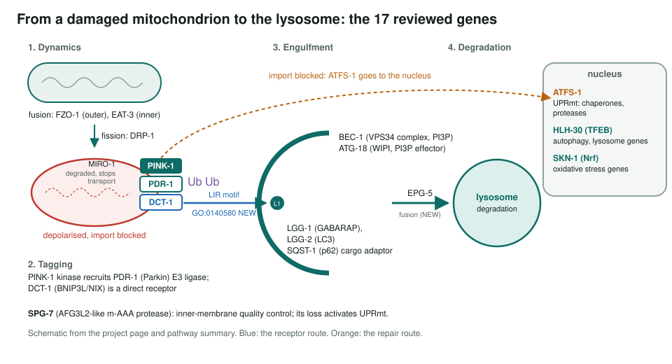
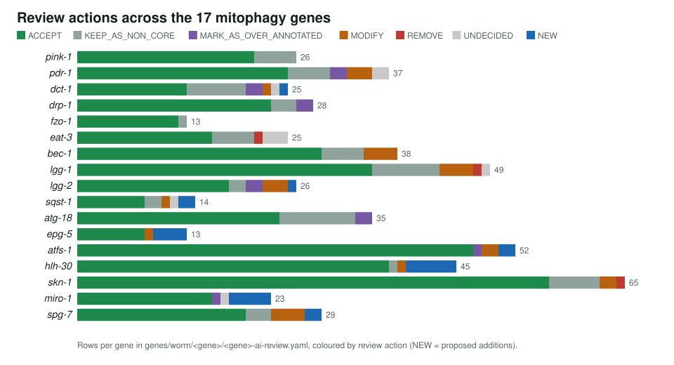
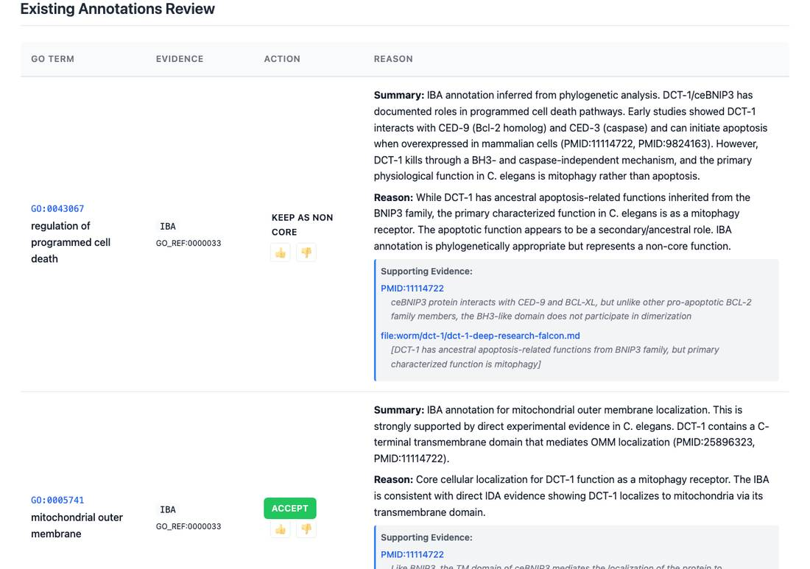

<!-- _class: lead -->

# Mitophagy in *C. elegans*

Reviewing GO annotations for 17 genes of mitochondrial quality control

AI Gene Review · projects/CAEEL_MITOPHAGY · 2026

---

<!-- _class: bluf -->

## Bottom line

- PINK-1, PDR-1 (Parkin) and the DCT-1 receptor mark damaged mitochondria for LGG-1/LGG-2 autophagy; ATFS-1 chooses **repair (UPRmt) or removal**.
- We reviewed **every GO annotation on 17 genes**: **543 rows**, 408 ACCEPT, 26 MODIFY, 3 REMOVE, 23 NEW.
- Main outputs: a **NEW mitophagy receptor function for DCT-1**, specific terms replacing `protein binding`, and new transport and fission terms for MIRO-1.

---

## Why mitophagy in the worm

- PINK1 and Parkin were found through **Parkinson's disease** genetics; both are conserved in the worm.
- The worm links mitochondrial quality control to **lifespan** (daf-2, hlh-30, skn-1).
- Worm annotations feed **orthology-based inference** for the human pathway.
- Three review tiers: core mitophagy and dynamics (6), autophagy machinery (6), regulators (5).

---

## The pathway and the 17 genes

---

## Actions per gene

---

## What a review looks like

dct-1: the ancestral BNIP3-family cell-death row is kept as non-core; mitochondrial outer membrane is accepted.

---

## Typical changes

| Gene | Existing term | Action | Proposed |
|---|---|---|---|
| dct-1 | (none) | NEW | mitochondrion autophagosome adaptor activity (IDA) |
| pdr-1 | autophagy (IEA) | MODIFY | mitophagy |
| sqst-1 | protein binding (IPI) | MODIFY | autophagy cargo adaptor activity |
| lgg-1 | GABA receptor binding (IBA) | REMOVE | none |
| skn-1 | regulation of translation (IEA) | REMOVE | none |
| epg-5 | neg. reg. of autophagosome assembly (IMP) | MODIFY | autophagosome maturation; autophagosome-lysosome fusion |

All rows verified in genes/worm/&lt;gene&gt;/&lt;gene&gt;-ai-review.yaml.

---

## Findings

1. **DCT-1 is the receptor**: GO:0140580 proposed from direct evidence; its BNIP3-family cell-death role kept as non-core.
2. **LGG-1 acts upstream of LGG-2** in worms; LGG-2 tethers to HOPS for lysosome fusion.
3. **spg-7 is AFG3L2-like**, not the human SPG7 ortholog (that is ppgn-1).
4. Dynamin-family microtubule rows on DRP-1 and EAT-3: over-annotated or undecided after a 2026 re-review, not removed.

---

## Status and next steps

- ✅ 17/17 gene reviews and the pathway summary.
- ⬜ Status notes on the project page (Dec 2025) predate the 2026 re-review; the BLUF gives current counts.
- ⬜ fndc-1 (Q22252, FUNDC1 ortholog; `genes/worm/fndc-1/`): reviewed separately, also proposes GO:0140580; not yet counted in these totals.
- ⬜ Six genes are shared with the proteostasis and UPR projects; do not sum totals across projects.

**Read more:** `projects/CAEEL_MITOPHAGY.md` · `projects/CAEEL_MITOPHAGY/CAEEL_MITOPHAGY-pathway.md` · `genes/worm/<gene>/`
