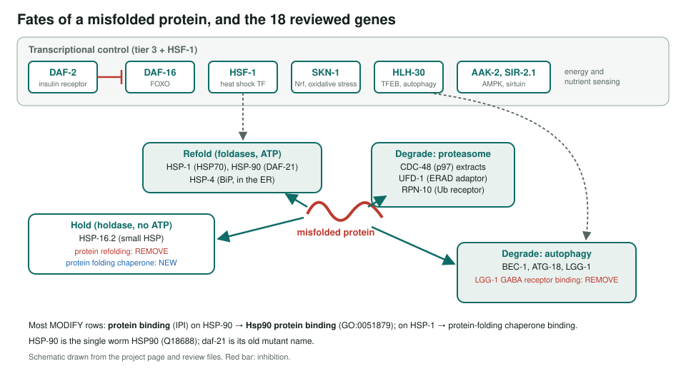
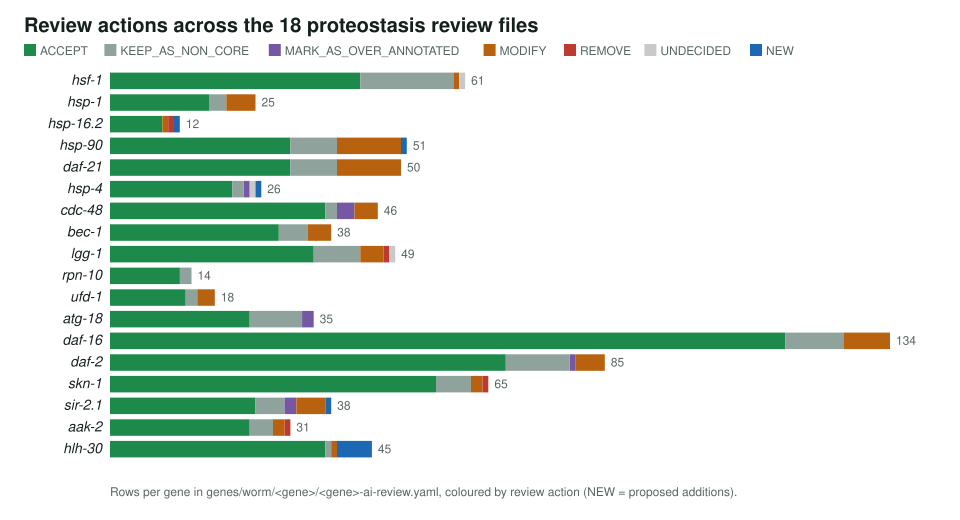
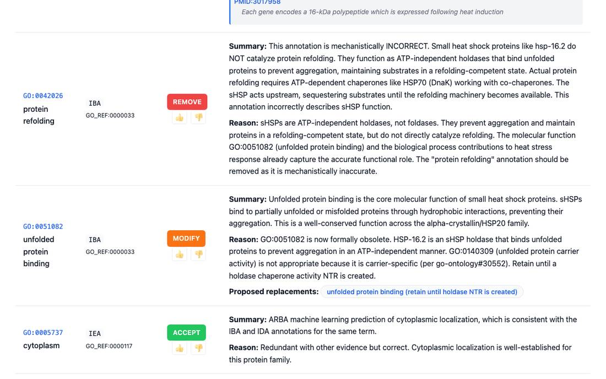

<!-- _class: lead -->

# The *C. elegans* proteostasis network

Reviewing GO annotations for chaperones, degradation machinery and longevity regulators

AI Gene Review · projects/CAEEL_PROTEOSTASIS · 2026

---

<!-- _class: bluf -->

## Bottom line

- The network **folds, holds and clears** proteins; in worms its capacity declines with age under insulin/FOXO control.
- We reviewed **every GO annotation in 18 review files**: **823 rows**, 628 ACCEPT, 67 MODIFY, 4 REMOVE, 10 NEW.
- Most changes replace `protein binding` with **Hsp90 protein binding** and similar; `hsp-90` and `daf-21` turned out to be **the same protein** reviewed twice.

---

## Why proteostasis in the worm

- Short lifespan and a transparent body: aggregation can be watched in live animals.
- Worm models of polyQ, amyloid-beta, alpha-synuclein and SOD1 aggregation.
- HSF-1 activity drops at reproductive maturity; DAF-16 (FOXO) extends capacity.
- Test: do chaperone annotations keep **mechanism** (foldase vs holdase) and not just "binds unfolded protein"?

---

## The network and the 18 genes

---

## Actions per review file

---

## Holdase is not foldase

hsp-16.2 review page. The small HSP holds substrates without ATP, so <em>protein refolding</em> (IBA) is removed. The obsolete <em>unfolded protein binding</em> is kept until GO has a holdase term.

---

## Findings

1. **`protein binding` → Hsp90 protein binding** (GO:0051879): 9 IPI rows each on hsp-90 and daf-21; HSP-1 partners → protein-folding chaperone binding.
2. **Holdase vs foldase**: HSP-16.2 *protein refolding* removed.
3. **Artefacts removed**: LGG-1 *GABA receptor binding* (IBA), AAK-2 *positive regulation of protein secretion*, SKN-1 *regulation of translation*.
4. **Duplicate review**: `genes/worm/hsp-90/` and `genes/worm/daf-21/` both review Q18688.

---

## Status and next steps

- ✅ 18 review files and the pathway summary complete.
- ⬜ Merge the hsp-90 and daf-21 reviews into one (same UniProt entry, Q18688).
- ⬜ The status section on the project page (868 rows, 626 ACCEPT) predates later edits.
- ⬜ Only cct-1, cct-8 and rpn-10 of the chaperonin and proteasome subunits on the page have reviews; the rest are not yet reviewed.

**Read more:** `projects/CAEEL_PROTEOSTASIS.md` · `projects/CAEEL_PROTEOSTASIS/` · `genes/worm/<gene>/`
